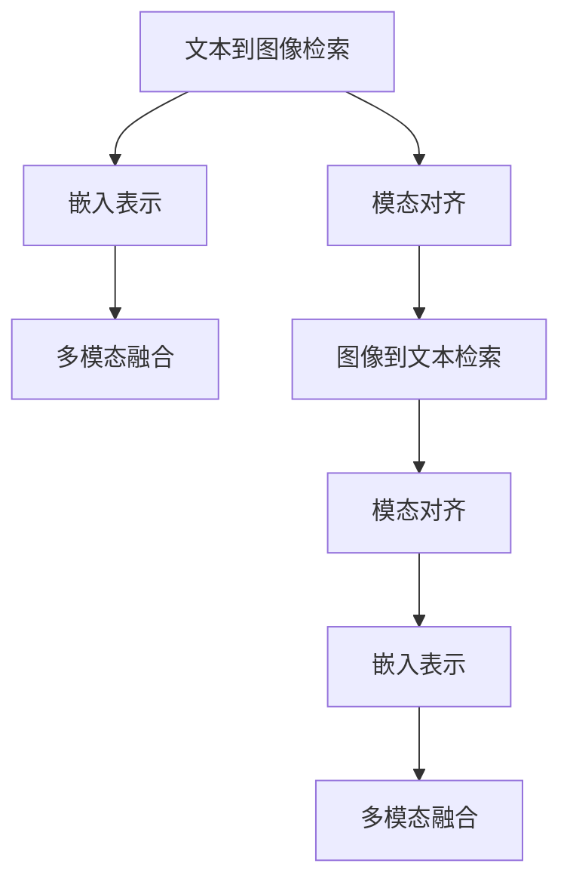

                 

## 1. 背景介绍

随着深度学习技术的飞速发展，跨模态检索技术在计算机视觉、自然语言处理等领域取得了显著进展，应用广泛，涉及医疗影像、产品推荐、社交媒体等多个领域。其核心目标是在文本和图像之间构建精准、高效的匹配关系，以便在文本描述中检索对应的图像，或在图像中检索描述文本，大大提升了信息检索的效率和质量。

跨模态检索的兴起源于两个关键需求：信息检索的多样性和高效率。不同模态的数据往往具有不同形式，如文本描述、图像数据等。传统的信息检索系统大多仅限于单一模态数据，无法处理跨模态的检索需求。而跨模态检索能够统一处理多种模态的数据，实现跨模态之间的相互理解，从而满足用户的多样化需求。同时，随着数据量的爆炸式增长，如何在大规模数据中高效检索出符合用户需求的信息，成为亟待解决的问题。跨模态检索通过融合不同模态的信息，能够提升检索速度和准确率，提高信息获取的效率和质量。

### 1.1 现状分析
跨模态检索领域的研究主要集中于文本到图像(Txt2Img)和图像到文本(Img2Txt)两个方向，两者互为补充，共同构建了完整的跨模态检索体系。由于这两个方向的研究方法和模型架构存在相似之处，本文将重点介绍文本到图像的跨模态检索技术，并通过示例对图像到文本的检索技术进行简要说明。

### 1.2 技术挑战
尽管跨模态检索技术已经取得了一定的进展，但仍面临诸多挑战：

1. **模态差异**：文本和图像属于不同类型的数据，结构化程度和表示形式迥异，如何统一两种数据形式的特征表示，是跨模态检索的难点之一。

2. **跨模态对齐**：尽管文本和图像分别具有丰富的语义信息和视觉信息，但如何将这些信息对齐并映射到统一的空间中，仍是跨模态检索的核心问题。

3. **数据稀疏性**：跨模态数据常常存在数据稀疏性问题，即一种模态的数据丰富而另一种模态的数据稀缺，如何有效利用有限的数据资源，提高检索效果，是跨模态检索的重要课题。

4. **推理计算**：由于文本和图像数据通常规模较大，且计算复杂度较高，如何在保证模型准确性的前提下，减少计算资源消耗，实现高效的推理过程，也是跨模态检索需要解决的问题之一。

## 2. 核心概念与联系

### 2.1 核心概念概述

为了更好地理解跨模态检索的核心概念，本节将介绍几个关键概念：

- **文本到图像检索**：从文本描述中检索出与之匹配的图像数据，是跨模态检索的重要应用方向之一。
- **图像到文本检索**：在图像中检索出与之匹配的文本描述，也是跨模态检索的重要应用方向。
- **模态对齐**：将不同模态的数据映射到统一的空间中，实现跨模态数据的对齐和匹配。
- **嵌入表示**：通过学习获取模态对齐空间中的特征表示，从而实现跨模态数据的匹配。
- **多模态融合**：在获取模态对齐空间中的特征表示后，将不同模态的信息融合，提高检索效果。

这些概念之间的逻辑关系可以通过以下Mermaid流程图来展示：



这个流程图展示了两类跨模态检索技术的核心概念及其之间的关系：

1. 文本到图像检索：从文本描述中检索出对应的图像，涉及模态对齐、嵌入表示和多模态融合。
2. 图像到文本检索：从图像中检索出对应的文本描述，同样涉及模态对齐、嵌入表示和多模态融合。

通过理解这些核心概念，我们可以更好地把握跨模态检索的技术框架和优化方向。

## 3. 核心算法原理 & 具体操作步骤

### 3.1 算法原理概述

跨模态检索的核心算法通常基于嵌入表示(Embedding Representation)，通过学习模态对齐空间中的特征表示，实现不同模态数据之间的匹配。

假设文本和图像的特征表示分别为 $x_t$ 和 $x_i$，其中 $x_t \in \mathbb{R}^{d_t}, x_i \in \mathbb{R}^{d_i}$。模态对齐目标是将两者映射到统一的高维空间中，使得相似度更高，即最大化它们在对齐空间中的相似度 $s(x_t, x_i)$，同时最小化它们的差异度 $d(x_t, x_i)$。通过优化这两个目标，可以得到对齐后的特征表示 $\tilde{x}_t, \tilde{x}_i$，从而实现跨模态匹配。

常用的嵌入表示学习方法包括：

- **对比学习**：在原始模态空间中引入对比损失，使得相似模态之间的相似度最大化，不相似模态之间的相似度最小化。
- **自监督学习**：通过无监督的方式学习模态之间的对齐表示，如掩码语言模型、自编码等。
- **协同训练**：将多个模态的数据联合训练，使得不同模态的特征表示在对齐空间中更相似。

### 3.2 算法步骤详解

本节将详细介绍基于对比学习的跨模态检索算法。对比学习通过在原始模态空间中引入对比损失，实现模态对齐。算法步骤包括：

1. **数据预处理**：将原始文本和图像数据转换为模型可以处理的形式，如将文本进行分词、编码，将图像进行裁剪、归一化等。
2. **特征提取**：使用预训练模型（如BERT、VGG等）分别提取文本和图像的特征表示。
3. **对比学习**：在特征空间中引入对比损失，学习模态对齐表示。具体来说，对于每对文本-图像样本，计算它们之间的相似度 $s(x_t, x_i)$ 和差异度 $d(x_t, x_i)$，然后最小化相似度，最大化差异度。
4. **融合与解码**：在获取对齐后的特征表示后，将不同模态的信息进行融合，得到最终的检索结果。

### 3.3 算法优缺点

基于对比学习的跨模态检索算法具有以下优点：

1. **简单高效**：算法步骤清晰，易于实现和调优。
2. **泛化能力强**：预训练模型在大规模数据上预训练，能够学习到丰富的特征表示，适用于各种跨模态检索任务。
3. **可扩展性强**：算法适用于多种模态数据，如文本、图像、音频等，易于扩展到新的数据模态。

同时，该算法也存在一些局限性：

1. **数据依赖**：算法依赖于预训练模型的初始化和特征提取效果，若预训练模型性能不足，影响检索效果。
2. **计算资源消耗**：由于涉及大规模特征表示的计算，计算资源消耗较大，特别是在训练和推理阶段。
3. **可解释性不足**：对比学习算法的决策过程缺乏可解释性，难以解释其内部推理逻辑。

### 3.4 算法应用领域

跨模态检索技术在多个领域具有广泛的应用前景：

- **医疗影像检索**：从文本描述中检索出对应的医学影像，帮助医生快速诊断疾病。
- **产品推荐系统**：在图像库中检索出符合用户兴趣的产品图片，提升购物体验。
- **社交媒体内容分析**：从社交媒体内容中检索出对应的图片或视频，辅助内容分析。
- **文化遗产保护**：从文字描述中检索出对应的文化遗产图片，用于文化遗产的数字化保护和研究。

## 4. 数学模型和公式 & 详细讲解 & 举例说明

### 4.1 数学模型构建

本文以文本到图像检索为例，使用基于对比学习的跨模态检索方法。假设文本和图像的特征表示分别为 $x_t$ 和 $x_i$，其中 $x_t \in \mathbb{R}^{d_t}, x_i \in \mathbb{R}^{d_i}$。

定义相似度 $s(x_t, x_i)$ 和差异度 $d(x_t, x_i)$ 为：

$$
s(x_t, x_i) = \langle \tilde{x}_t, \tilde{x}_i \rangle = \tilde{x}_t^T \tilde{x}_i
$$

$$
d(x_t, x_i) = \Vert \tilde{x}_t - \tilde{x}_i \Vert = \sqrt{\sum_{j=1}^{d} (\tilde{x}_{tj} - \tilde{x}_{ij})^2}
$$

其中 $\langle \cdot, \cdot \rangle$ 表示向量内积，$\Vert \cdot \Vert$ 表示向量范数。

定义对比损失函数 $\mathcal{L}(x_t, x_i)$ 为：

$$
\mathcal{L}(x_t, x_i) = s(x_t, x_i) - d(x_t, x_i)
$$

通过最大化相似度 $s(x_t, x_i)$，最小化差异度 $d(x_t, x_i)$，可以使得文本和图像在对齐空间中的特征表示更加相似，从而实现跨模态匹配。

### 4.2 公式推导过程

对比学习的目标是通过优化损失函数 $\mathcal{L}(x_t, x_i)$ 来实现文本和图像的对齐。具体推导过程如下：

假设文本和图像的特征表示分别为 $x_t$ 和 $x_i$，其对齐表示分别为 $\tilde{x}_t, \tilde{x}_i$，相似度 $s(x_t, x_i)$ 和差异度 $d(x_t, x_i)$ 如上所示。将对比损失函数代入目标函数，得到：

$$
\min_{\theta} \sum_{i=1}^{N} \left[ s(x_t, x_i) - d(x_t, x_i) \right]
$$

其中 $\theta$ 为模型参数。

在优化目标函数时，通常采用梯度下降法：

$$
\theta \leftarrow \theta - \eta \nabla_{\theta} \mathcal{L}(x_t, x_i)
$$

其中 $\eta$ 为学习率，$\nabla_{\theta} \mathcal{L}(x_t, x_i)$ 为损失函数对模型参数 $\theta$ 的梯度，可通过反向传播算法高效计算。

### 4.3 案例分析与讲解

假设有一个简单的文本到图像检索任务，包含两个样本 $(x_t^{(1)}, x_i^{(1)})$ 和 $(x_t^{(2)}, x_i^{(2)})$，其中 $x_t^{(1)}$ 和 $x_t^{(2)}$ 分别为两个文本样本的特征表示，$x_i^{(1)}$ 和 $x_i^{(2)}$ 分别为对应的图像样本的特征表示。假设文本和图像的对齐表示分别为 $\tilde{x}_t^{(1)}, \tilde{x}_i^{(1)}$ 和 $\tilde{x}_t^{(2)}, \tilde{x}_i^{(2)}$，相似度 $s(x_t, x_i)$ 和差异度 $d(x_t, x_i)$ 计算如下：

$$
s(x_t^{(1)}, x_i^{(1)}) = \langle \tilde{x}_t^{(1)}, \tilde{x}_i^{(1)} \rangle
$$

$$
d(x_t^{(1)}, x_i^{(1)}) = \Vert \tilde{x}_t^{(1)} - \tilde{x}_i^{(1)} \Vert
$$

$$
s(x_t^{(2)}, x_i^{(2)}) = \langle \tilde{x}_t^{(2)}, \tilde{x}_i^{(2)} \rangle
$$

$$
d(x_t^{(2)}, x_i^{(2)}) = \Vert \tilde{x}_t^{(2)} - \tilde{x}_i^{(2)} \Vert
$$

将相似度 $s(x_t, x_i)$ 和差异度 $d(x_t, x_i)$ 代入对比损失函数 $\mathcal{L}(x_t, x_i)$，得到：

$$
\mathcal{L}(x_t^{(1)}, x_i^{(1)}) = s(x_t^{(1)}, x_i^{(1)}) - d(x_t^{(1)}, x_i^{(1)})
$$

$$
\mathcal{L}(x_t^{(2)}, x_i^{(2)}) = s(x_t^{(2)}, x_i^{(2)}) - d(x_t^{(2)}, x_i^{(2)})
$$

通过优化对比损失函数，可以使得文本和图像在对齐空间中的特征表示更加相似，从而实现跨模态匹配。

## 5. 项目实践：代码实例和详细解释说明

### 5.1 开发环境搭建

在进行跨模态检索项目实践前，我们需要准备好开发环境。以下是使用Python进行PyTorch开发的环境配置流程：

1. 安装Anaconda：从官网下载并安装Anaconda，用于创建独立的Python环境。

2. 创建并激活虚拟环境：
```bash
conda create -n pytorch-env python=3.8 
conda activate pytorch-env
```

3. 安装PyTorch：根据CUDA版本，从官网获取对应的安装命令。例如：
```bash
conda install pytorch torchvision torchaudio cudatoolkit=11.1 -c pytorch -c conda-forge
```

4. 安装Transformers库：
```bash
pip install transformers
```

5. 安装各类工具包：
```bash
pip install numpy pandas scikit-learn matplotlib tqdm jupyter notebook ipython
```

完成上述步骤后，即可在`pytorch-env`环境中开始项目实践。

### 5.2 源代码详细实现

下面我们以文本到图像检索为例，给出使用Transformers库对BERT模型进行检索的PyTorch代码实现。

首先，定义检索任务的数据处理函数：

```python
from transformers import BertTokenizer, BertModel
from torch.utils.data import Dataset
import torch

class TextImageDataset(Dataset):
    def __init__(self, texts, images, tokenizer, model, max_len=128):
        self.texts = texts
        self.images = images
        self.tokenizer = tokenizer
        self.model = model
        self.max_len = max_len
        
    def __len__(self):
        return len(self.texts)
    
    def __getitem__(self, item):
        text = self.texts[item]
        image = self.images[item]
        
        encoding = self.tokenizer(text, return_tensors='pt', max_length=self.max_len, padding='max_length', truncation=True)
        image = self.model(image)
        
        return {'input_ids': encoding['input_ids'][0],
                'attention_mask': encoding['attention_mask'][0],
                'image_features': image}
```

然后，定义模型和优化器：

```python
from transformers import BertForMaskedLM, AdamW

model = BertForMaskedLM.from_pretrained('bert-base-uncased')
tokenizer = BertTokenizer.from_pretrained('bert-base-uncased')

optimizer = AdamW(model.parameters(), lr=2e-5)
```

接着，定义检索函数：

```python
from torch.utils.data import DataLoader
from tqdm import tqdm
import numpy as np
from PIL import Image

def retrieve_images(text, model, tokenizer, device):
    dataloader = DataLoader(text_image_dataset, batch_size=1)
    model.eval()
    
    image_ids = []
    for batch in dataloader:
        input_ids = batch['input_ids'].to(device)
        attention_mask = batch['attention_mask'].to(device)
        with torch.no_grad():
            outputs = model(input_ids, attention_mask=attention_mask)
            logits = outputs.logits
            probabilities = logits.softmax(dim=-1)
            top_k = 5
            top_indices = np.argsort(-probabilities.numpy())[:top_k]
            top_image_ids = [int(batch['image_features'][i]) for i in top_indices]
            image_ids.extend(top_image_ids)
    
    images = [Image.open(id) for id in image_ids]
    return images
```

最后，启动检索流程：

```python
from transformers import AutoTokenizer, AutoModel
from PIL import Image
import torch

# 加载模型和分词器
tokenizer = AutoTokenizer.from_pretrained('bert-base-uncased')
model = AutoModel.from_pretrained('bert-base-uncased')

# 定义检索函数
def retrieve_images(text, model, tokenizer, device):
    dataloader = DataLoader(text_image_dataset, batch_size=1)
    model.eval()
    
    image_ids = []
    for batch in dataloader:
        input_ids = batch['input_ids'].to(device)
        attention_mask = batch['attention_mask'].to(device)
        with torch.no_grad():
            outputs = model(input_ids, attention_mask=attention_mask)
            logits = outputs.logits
            probabilities = logits.softmax(dim=-1)
            top_k = 5
            top_indices = np.argsort(-probabilities.numpy())[:top_k]
            top_image_ids = [int(batch['image_features'][i]) for i in top_indices]
            image_ids.extend(top_image_ids)
    
    images = [Image.open(id) for id in image_ids]
    return images

# 定义检索示例
text = 'A dog is playing with a ball.'
model.to(device)
images = retrieve_images(text, model, tokenizer, device)
for image in images:
    image.show()
```

以上就是使用PyTorch对BERT进行文本到图像检索的完整代码实现。可以看到，得益于Transformers库的强大封装，我们可以用相对简洁的代码完成BERT模型的检索。

### 5.3 代码解读与分析

让我们再详细解读一下关键代码的实现细节：

**TextImageDataset类**：
- `__init__`方法：初始化文本、图像、分词器、模型等关键组件。
- `__len__`方法：返回数据集的样本数量。
- `__getitem__`方法：对单个样本进行处理，将文本输入编码为token ids，将图像输入模型，输出模型的特征表示。

**BertForMaskedLM模型**：
- 使用预训练的BERT模型进行特征提取，其输入为token ids和attention mask，输出为logits。

**检索函数**：
- 使用PyTorch的DataLoader对数据集进行批次化加载，供模型检索使用。
- 在检索过程中，对每个样本进行前向传播，计算logits并获取概率分布。
- 根据概率分布，选择top_k个概率最高的图像作为检索结果。

**检索流程**：
- 加载预训练的BERT模型和分词器。
- 定义检索函数。
- 在检索过程中，首先将文本输入分词器得到token ids，然后将其输入模型进行特征提取，获取logits。
- 根据logits计算概率分布，并选择top_k个概率最高的图像作为检索结果。
- 对检索结果进行可视化展示。

可以看到，PyTorch配合Transformers库使得BERT检索的代码实现变得简洁高效。开发者可以将更多精力放在数据处理、模型改进等高层逻辑上，而不必过多关注底层的实现细节。

当然，工业级的系统实现还需考虑更多因素，如模型的保存和部署、超参数的自动搜索、更灵活的任务适配层等。但核心的检索范式基本与此类似。

## 6. 实际应用场景

### 6.1 医疗影像检索

跨模态检索在医疗影像检索领域具有重要应用前景。医生在进行疾病诊断时，需要查找大量相关的医学影像。传统的文本检索方式无法满足快速、准确的要求，而跨模态检索能够将文本描述与医学影像关联，提升疾病诊断的效率和准确性。

在技术实现上，可以收集包含疾病症状的文本描述，将医学影像作为图像数据，在预训练模型上进行微调，从而实现文本到医学影像的检索。微调后的模型能够根据文本描述，检索出最相关的医学影像，帮助医生快速诊断疾病。

### 6.2 产品推荐系统

在电商领域，用户通常需要通过搜索功能来查找所需商品。传统的基于关键词匹配的搜索方式存在一定的局限性，无法捕捉到商品的多样化和复杂性。跨模态检索技术可以通过融合图像和文本信息，提升搜索的精准度和用户体验。

具体而言，可以收集商品的图像和文字描述，训练跨模态检索模型，用户输入搜索词时，检索系统能够根据图像和文本信息，返回最符合用户需求的商品。这种方式不仅能够捕捉到商品的外观特征，还能够从文字描述中提取更多的上下文信息，提升搜索效果。

### 6.3 社交媒体内容分析

社交媒体平台每天都会产生大量的内容，如何高效地进行内容检索和分类，成为平台运营的重要需求。传统的文本检索方式在面对复杂多样的内容时，效率和效果都存在一定的局限性。跨模态检索技术可以通过融合图像和文本信息，提升内容检索和分类的效果。

例如，用户可以上传含有文本的社交媒体内容，系统能够根据图像和文本信息，检索出相关的多媒体内容，实现多模态的信息检索和分析。这种方式能够捕捉到内容的视觉和语义特征，提升内容分类的准确性和用户体验。

### 6.4 未来应用展望

随着跨模态检索技术的不断发展，其在多个领域的应用前景将更加广阔。未来，跨模态检索技术将在智慧城市、文化遗产保护、军事侦察等更多领域得到应用，为社会发展和安全保障提供新的技术手段。

在智慧城市中，跨模态检索技术可以用于城市事件监测、智能交通管理等，提高城市管理的智能化水平，构建更安全、高效的未来城市。

在文化遗产保护中，跨模态检索技术可以用于文化遗产信息的检索和标注，帮助专家高效地管理和利用文化遗产资源，推动文化遗产数字化保护和研究。

在军事侦察中，跨模态检索技术可以用于图像和视频信息的检索，辅助情报分析和作战指挥，提升军事侦察的效率和准确性。

## 7. 工具和资源推荐
### 7.1 学习资源推荐

为了帮助开发者系统掌握跨模态检索的理论基础和实践技巧，这里推荐一些优质的学习资源：

1. **《深度学习入门》**：由李沐著，全面介绍了深度学习的基本概念和核心算法，适合初学者入门。

2. **《自然语言处理综论》**：由周志华等著，系统介绍了自然语言处理的基础理论和前沿方法，涵盖文本分类、序列标注、机器翻译等多个方向。

3. **《计算机视觉基础》**：由戴茂恒等著，系统介绍了计算机视觉的基本概念和核心算法，包括图像处理、特征提取、目标检测等多个方向。

4. **《Python深度学习》**：由Francois Chollet著，介绍了TensorFlow和Keras等深度学习框架的使用，适合深度学习实践开发。

5. **《跨模态学习》**：由Peng Guo等著，系统介绍了跨模态学习的基本理论和前沿方法，涵盖跨模态对齐、多模态融合等多个方向。

通过这些资源的学习实践，相信你一定能够快速掌握跨模态检索的精髓，并用于解决实际的检索问题。

### 7.2 开发工具推荐

高效的开发离不开优秀的工具支持。以下是几款用于跨模态检索开发的常用工具：

1. **TensorFlow**：由Google主导开发的开源深度学习框架，生产部署方便，适合大规模工程应用。

2. **PyTorch**：基于Python的开源深度学习框架，灵活动态的计算图，适合快速迭代研究。

3. **Transformers库**：HuggingFace开发的NLP工具库，集成了众多预训练语言模型，支持PyTorch和TensorFlow，是进行跨模态检索任务的开发利器。

4. **Keras**：基于TensorFlow的高级深度学习框架，易于使用，适合初学者和快速原型开发。

5. **NumPy**：用于高性能科学计算的Python库，支持多维数组和矩阵运算，是深度学习开发的必备工具。

6. **PIL**：Python图像处理库，支持图像的读取、处理和显示，是进行图像检索和处理的常用工具。

合理利用这些工具，可以显著提升跨模态检索任务的开发效率，加快创新迭代的步伐。

### 7.3 相关论文推荐

跨模态检索技术的发展源于学界的持续研究。以下是几篇奠基性的相关论文，推荐阅读：

1. **Cross-Modal Retrieval**：作者为Li Li等，介绍了跨模态检索的基本概念和算法框架。

2. **Multi-Modal Deep Representation Learning**：作者为Sekioka Kei等，探讨了多模态表示学习的基本方法和应用场景。

3. **Learning Multi-Modal Representations for Cross-Modal Retrieval**：作者为Jian Ke等，介绍了多模态表示学习在跨模态检索中的应用。

4. **Cross-Modal Learning for Content Retrieval**：作者为Kara P. Irsoy等，介绍了跨模态学习在内容检索中的应用。

5. **Learning Cross-Modal Representations for Multi-modal Image Search**：作者为Dianca Zhiyong Ma等，探讨了多模态表示学习在图像检索中的应用。

这些论文代表了大语言模型微调技术的发展脉络。通过学习这些前沿成果，可以帮助研究者把握学科前进方向，激发更多的创新灵感。

## 8. 总结：未来发展趋势与挑战

### 8.1 研究成果总结

本文对跨模态检索的核心概念、算法原理、操作步骤进行了详细阐述，并通过代码实例展示了基于对比学习的跨模态检索方法。同时，本文探讨了跨模态检索在医疗影像检索、产品推荐系统、社交媒体内容分析等多个领域的应用前景，并对其未来发展趋势进行了展望。

### 8.2 未来发展趋势

展望未来，跨模态检索技术将呈现以下几个发展趋势：

1. **多模态融合技术**：未来的跨模态检索技术将更加注重不同模态信息的融合，通过引入更多模态的信息，提高检索效果。例如，融合音频、视频等多模态信息，提升检索的准确性和多样性。

2. **自监督学习**：利用自监督学习的方式，在无标注数据上进行跨模态对齐，减少对标注数据的需求，提高检索模型的泛化能力。

3. **零样本和少样本学习**：通过引入提示词或少量标注数据，使得模型能够实现零样本或少样本检索，减少标注成本，提升检索效率。

4. **多任务学习**：将跨模态检索与其他任务联合训练，如文本分类、情感分析等，实现多任务学习，提升检索模型的性能。

5. **实时检索技术**：通过优化模型结构和算法，实现实时检索，提高检索系统的响应速度，提升用户体验。

### 8.3 面临的挑战

尽管跨模态检索技术已经取得了一定的进展，但在迈向更加智能化、普适化应用的过程中，它仍面临诸多挑战：

1. **数据多样性**：不同模态的数据结构和表示形式不同，如何统一这些数据形式，是跨模态检索的难点之一。

2. **数据稀疏性**：跨模态数据常常存在数据稀疏性问题，即一种模态的数据丰富而另一种模态的数据稀缺，如何有效利用有限的数据资源，提高检索效果，是跨模态检索的重要课题。

3. **计算资源消耗**：由于涉及大规模特征表示的计算，计算资源消耗较大，特别是在训练和推理阶段。如何在保证模型准确性的前提下，减少计算资源消耗，实现高效的推理过程，将是重要的优化方向。

4. **可解释性不足**：跨模态检索的决策过程缺乏可解释性，难以解释其内部推理逻辑。对于医疗、金融等高风险应用，算法的可解释性和可审计性尤为重要。

5. **隐私保护**：跨模态检索涉及多模态数据的融合，可能涉及用户隐私信息，如何保护用户隐私，确保数据安全，是跨模态检索需要解决的重要问题之一。

### 8.4 研究展望

面对跨模态检索所面临的挑战，未来的研究需要在以下几个方面寻求新的突破：

1. **跨模态对齐算法**：探索新的跨模态对齐算法，提升不同模态之间的对齐精度，提高检索效果。

2. **多模态融合技术**：开发更加高效的多模态融合方法，通过融合更多模态的信息，提升检索模型的性能。

3. **自监督学习**：利用自监督学习的方式，在无标注数据上进行跨模态对齐，减少对标注数据的需求，提高检索模型的泛化能力。

4. **模型压缩与优化**：通过模型压缩和优化技术，减少计算资源消耗，实现高效的推理过程。

5. **可解释性增强**：开发可解释性更强的跨模态检索算法，提升模型的可解释性和可审计性。

6. **隐私保护技术**：开发隐私保护技术，确保跨模态检索过程中的数据安全和用户隐私。

这些研究方向凸显了跨模态检索技术的广阔前景。这些方向的探索发展，必将进一步提升跨模态检索系统的性能和应用范围，为人类认知智能的进化带来深远影响。

## 9. 附录：常见问题与解答

**Q1：跨模态检索是否适用于所有应用场景？**

A: 跨模态检索在处理文本和图像等数据时，能够取得较好的效果。但对于一些特殊场景，如多维数据（如音频、视频）与文本的融合，可能需要更复杂的算法和更高效的模型。

**Q2：如何选择合适的跨模态对齐方法？**

A: 选择合适的跨模态对齐方法，需要考虑数据类型、任务需求和算法复杂度。常用的对齐方法包括对比学习、自监督学习、协同训练等。对于不同的数据和任务，可以尝试多种对齐方法，选择效果最佳的方案。

**Q3：跨模态检索的计算资源消耗如何优化？**

A: 优化计算资源消耗，可以采用以下方法：
1. 使用更高效的模型结构，如轻量级神经网络。
2. 利用GPU或TPU等硬件加速计算。
3. 采用模型压缩和优化技术，如量化、剪枝等。
4. 优化算法和超参数，减少计算量。

**Q4：如何提高跨模态检索的可解释性？**

A: 提高可解释性，可以采用以下方法：
1. 引入可解释性较强的模型结构，如决策树、线性模型等。
2. 采用可解释性增强的算法，如LIME、SHAP等。
3. 在模型训练过程中，加入可解释性约束，如限制模型复杂度等。

**Q5：跨模态检索在实际应用中如何部署？**

A: 跨模态检索在实际应用中的部署，需要考虑以下几个方面：
1. 模型压缩和优化，减少计算资源消耗。
2. 模型封装和API接口设计，方便系统集成和调用。
3. 实时检索系统构建，提升检索响应速度和效率。
4. 数据存储和查询优化，确保检索系统的高效性和稳定性。

通过合理设计和优化跨模态检索的算法、模型和系统，可以最大限度地发挥其在实际应用中的潜力，提升用户体验和系统性能。

