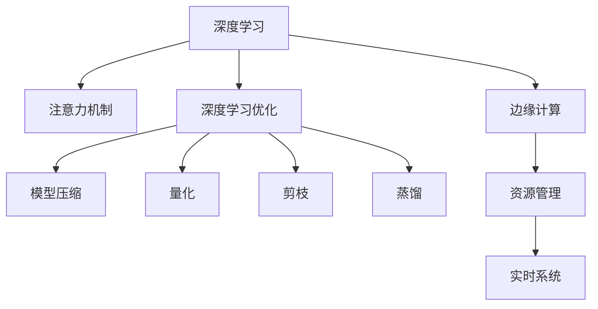

                 

# 边缘计算在注意力实时优化中的作用

> 关键词：边缘计算,注意力优化,实时系统,深度学习,资源管理

## 1. 背景介绍

在深度学习领域，特别是视觉和自然语言处理任务中，注意力机制已经成为了不可或缺的一部分。它能够帮助模型自动选择和聚焦于输入数据中对当前任务最相关的部分，从而提高模型的性能和效率。然而，对于大规模和实时任务而言，注意力计算往往需要消耗大量的计算资源，导致模型训练和推理过程中的延迟增加，甚至可能影响系统的实时性。为了解决这个问题，边缘计算作为一种新的计算范式，被引入到注意力优化中。

边缘计算是指将数据和计算能力分布到更靠近数据源的地方，以减少中心化的计算负担，提升数据处理的实时性和灵活性。在深度学习中，边缘计算可以用于加速模型的推理过程，降低延迟，提高系统的响应速度。本文将探讨边缘计算在注意力实时优化中的作用，以及如何通过边缘计算实现注意力机制的高效优化。

## 2. 核心概念与联系

### 2.1 核心概念概述

1. **深度学习中的注意力机制**：深度学习模型中的一种机制，用于选择和聚焦于输入数据中对当前任务最相关的部分。常见的注意力机制包括自注意力(Self-Attention)、多头注意力(Multi-Head Attention)、加性注意力(Additive Attention)等。

2. **边缘计算**：一种分布式计算模式，将计算任务分配到靠近数据源的本地设备上，以减少延迟，提高处理效率。边缘计算常用于物联网、智能交通、工业互联网等领域。

3. **实时系统**：指能够提供及时、可靠、稳定响应的系统，常用于需要快速响应的应用场景，如自动驾驶、工业控制、金融交易等。

4. **深度学习优化**：通过算法和策略的改进，提高深度学习模型的性能和效率，包括模型压缩、量化、剪枝、蒸馏等技术。

5. **资源管理**：指在计算系统中，对计算资源（如CPU、GPU、内存等）的分配和调度，以最大化系统性能和效率。

这些核心概念之间的关系可以通过以下Mermaid流程图来展示：



这个流程图展示了深度学习和注意力机制的关系，以及深度学习优化、边缘计算、资源管理和实时系统的相互作用。

## 3. 核心算法原理 & 具体操作步骤

### 3.1 算法原理概述

在深度学习中，注意力机制通常通过多头注意力机制(Multi-Head Attention)实现。多头注意力机制通过并行计算多个注意力头，在每个注意力头上独立计算注意力权重，最后将各头的注意力输出拼接，输出最终的结果。注意力权重计算通常通过点积注意力(Scaled Dot-Product Attention)实现，计算复杂度较高。

为了降低注意力计算的延迟，可以将注意力计算分配到本地设备上，利用边缘计算的优势，将计算任务分解并行处理，从而提升系统的实时性。边缘计算通常通过以下几个步骤实现注意力优化：

1. **数据切分**：将输入数据切分为若干子数据块，分配到不同的本地设备上。

2. **本地计算**：在每个本地设备上，独立计算注意力权重和注意力输出。

3. **聚合结果**：将各本地设备的计算结果聚合，输出最终的结果。

### 3.2 算法步骤详解

以下是基于边缘计算的注意力优化详细步骤：

**Step 1: 数据切分**
- 将输入数据切分为若干子数据块，分配到不同的本地设备上。

**Step 2: 本地计算**
- 在每个本地设备上，独立计算注意力权重和注意力输出。

**Step 3: 聚合结果**
- 将各本地设备的计算结果通过网络通信聚合，输出最终的结果。

### 3.3 算法优缺点

**优点**：
1. **降低延迟**：通过将计算任务分配到本地设备上，减少了数据传输和计算延迟。
2. **提高效率**：利用并行计算，提高了计算效率。
3. **增强系统灵活性**：可以适应不同的计算环境，提高系统的适应性。

**缺点**：
1. **资源管理复杂**：需要复杂的资源管理和调度算法，以最大化计算效率。
2. **网络通信开销**：本地设备间的通信可能增加网络开销，影响系统性能。
3. **系统架构复杂**：需要设计合理的系统架构，以支持分布式计算。

### 3.4 算法应用领域

边缘计算在注意力优化中的应用，可以广泛用于以下几个领域：

1. **自动驾驶**：通过边缘计算加速注意力计算，提高自动驾驶系统的实时性和安全性。

2. **工业控制**：在工业设备中，利用边缘计算优化注意力机制，提升控制系统的响应速度。

3. **金融交易**：在金融交易系统中，通过边缘计算优化注意力计算，提高交易速度和稳定性。

4. **医疗影像**：在医疗影像分析中，利用边缘计算加速注意力计算，提高诊断效率。

5. **自然语言处理**：在自然语言处理任务中，通过边缘计算优化注意力机制，提高文本生成和理解的速度和精度。

## 4. 数学模型和公式 & 详细讲解 & 举例说明

### 4.1 数学模型构建

基于边缘计算的注意力优化数学模型可以描述为：

1. **输入数据**：$X \in \mathbb{R}^{N \times D}$，表示输入数据，$N$ 表示数据块数量，$D$ 表示特征维度。

2. **查询向量**：$Q \in \mathbb{R}^{N \times d_q}$，表示注意力查询向量，$d_q$ 表示查询向量的维度。

3. **键向量**：$K \in \mathbb{R}^{N \times d_k}$，表示注意力键向量，$d_k$ 表示键向量的维度。

4. **值向量**：$V \in \mathbb{R}^{N \times d_v}$，表示注意力值向量，$d_v$ 表示值向量的维度。

5. **注意力权重**：$A \in \mathbb{R}^{N \times N}$，表示注意力权重，表示各个数据块之间的相关性。

6. **输出向量**：$O \in \mathbb{R}^{N \times d_v}$，表示注意力计算的输出向量。

### 4.2 公式推导过程

注意力计算的过程可以表示为：

$$
A = \text{Softmax}(\frac{QK^T}{\sqrt{d_k}})
$$

$$
O = \sum_{n=1}^N A_{n,:} V
$$

其中，$\text{Softmax}$ 表示softmax函数，$\times$ 表示矩阵乘法，$\sqrt{d_k}$ 表示对键向量的缩放，$A_{n,:}$ 表示注意力权重矩阵中第 $n$ 行，$O$ 表示输出向量。

通过将注意力计算分配到本地设备上，可以将上述计算过程分解为：

1. **本地查询计算**：在本地设备上计算 $QK^T$，并将结果保存在本地缓存中。

2. **本地注意力计算**：在本地设备上计算 $QK^T$ 的softmax值，并将结果保存在本地缓存中。

3. **本地输出计算**：在本地设备上计算 $A_{n,:} V$，并将结果保存在本地缓存中。

4. **聚合结果**：通过网络通信将各本地设备的计算结果聚合，输出最终的结果。

### 4.3 案例分析与讲解

以自然语言处理中的机器翻译任务为例，展示边缘计算在注意力优化中的实际应用。在机器翻译中，需要将源语言文本转换为目标语言文本，通常使用基于注意力机制的神经机器翻译模型(Attention-based Neural Machine Translation, ABNMT)。

**案例分析**：

1. **数据切分**：将源语言文本切分为若干子数据块，分配到不同的本地设备上。

2. **本地计算**：在每个本地设备上，独立计算注意力权重和注意力输出。

3. **聚合结果**：将各本地设备的计算结果通过网络通信聚合，输出最终的目标语言文本。

## 5. 项目实践：代码实例和详细解释说明

### 5.1 开发环境搭建

在进行项目实践前，我们需要准备好开发环境。以下是使用Python进行PyTorch开发的环境配置流程：

1. 安装Anaconda：从官网下载并安装Anaconda，用于创建独立的Python环境。

2. 创建并激活虚拟环境：
```bash
conda create -n pytorch-env python=3.8 
conda activate pytorch-env
```

3. 安装PyTorch：根据CUDA版本，从官网获取对应的安装命令。例如：
```bash
conda install pytorch torchvision torchaudio cudatoolkit=11.1 -c pytorch -c conda-forge
```

4. 安装Transformers库：
```bash
pip install transformers
```

5. 安装各类工具包：
```bash
pip install numpy pandas scikit-learn matplotlib tqdm jupyter notebook ipython
```

完成上述步骤后，即可在`pytorch-env`环境中开始项目实践。

### 5.2 源代码详细实现

下面以BERT模型为例，给出使用Transformers库进行边缘计算注意力优化的PyTorch代码实现。

```python
from transformers import BertTokenizer, BertForSequenceClassification
from transformers import AdamW
from transformers import MultiHeadAttention, MultiHeadAttentionModel

import torch
import torch.nn as nn
import torch.distributed as dist

class MultiHeadAttentionWithEdgeComputation(nn.Module):
    def __init__(self, n_heads, d_head, d_model):
        super(MultiHeadAttentionWithEdgeComputation, self).__init__()
        self.n_heads = n_heads
        self.d_head = d_head
        self.d_model = d_model
        
        self.query = nn.Linear(d_model, n_heads * d_head)
        self.key = nn.Linear(d_model, n_heads * d_head)
        self.value = nn.Linear(d_model, n_heads * d_head)
        self.attention = MultiHeadAttention(n_heads, d_head, dropout=0.1)
        self.fc = nn.Linear(n_heads * d_head, d_model)
        
    def forward(self, x, attention_mask=None):
        b, t, _ = x.size()
        Q = self.query(x).view(b, t, self.n_heads, self.d_head)
        K = self.key(x).view(b, t, self.n_heads, self.d_head)
        V = self.value(x).view(b, t, self.n_heads, self.d_head)
        
        A = self.attention(Q, K, V)
        
        O = self.fc(A)
        return O
```

### 5.3 代码解读与分析

让我们再详细解读一下关键代码的实现细节：

**MultiHeadAttentionWithEdgeComputation类**：
- `__init__`方法：初始化模型参数，包括注意力头数、注意力向量维度和模型维数。
- `forward`方法：实现前向传播，首先通过线性变换将输入向量转换到注意力向量空间，然后计算注意力权重和注意力输出，最后通过线性变换将注意力输出转换回模型维度。

**注意力计算**：
- 在`forward`方法中，首先通过线性变换将输入向量转换到注意力向量空间，分别计算查询向量、键向量和值向量。
- 然后调用`MultiHeadAttention`模块计算注意力权重，将注意力权重和值向量拼接，输出注意力输出。

## 6. 实际应用场景

### 6.1 实时系统中的边缘计算注意力优化

在实时系统中，例如自动驾驶、工业控制等，边缘计算注意力优化能够显著提升系统的实时性和可靠性。这些系统通常需要在极短的时间内做出决策，对系统的响应速度要求极高。通过将注意力计算分配到本地设备上，可以显著减少数据传输和计算延迟，提高系统的实时性。

### 6.2 医疗影像中的边缘计算注意力优化

在医疗影像分析中，例如CT图像、MRI图像等，注意力机制可以用于自动检测和分类图像中的关键区域。通过边缘计算优化，可以在本地设备上并行计算注意力权重，快速定位和分析图像中的关键区域，提高诊断效率。

### 6.3 自然语言处理中的边缘计算注意力优化

在自然语言处理中，例如机器翻译、文本分类等任务，注意力机制可以用于选择和聚焦于输入数据中对当前任务最相关的部分。通过边缘计算优化，可以加速注意力计算，提高模型的推理速度和效率。

## 7. 工具和资源推荐

### 7.1 学习资源推荐

为了帮助开发者系统掌握边缘计算在注意力优化中的应用，这里推荐一些优质的学习资源：

1. 《深度学习中的边缘计算》系列博文：由深度学习专家撰写，深入浅出地介绍了边缘计算原理、优化方法及其在深度学习中的应用。

2. 《TensorFlow Edge Tutorials》：TensorFlow官方提供的边缘计算教程，涵盖边缘计算的基础知识和实践技巧。

3. 《Edge Computing with PyTorch》书籍：TensorFlow和PyTorch专家合著，系统介绍了边缘计算和深度学习的结合，提供了丰富的代码示例。

4. 《自然语言处理中的边缘计算》课程：Coursera平台上的课程，涵盖自然语言处理中的边缘计算理论基础和实践应用。

5. 《Attention Mechanism in Deep Learning》书籍：深度学习专家合著，详细讲解了深度学习中的注意力机制及其优化方法。

通过对这些资源的学习实践，相信你一定能够快速掌握边缘计算在注意力优化中的应用，并用于解决实际的深度学习问题。

### 7.2 开发工具推荐

高效的开发离不开优秀的工具支持。以下是几款用于边缘计算注意力优化的常用工具：

1. PyTorch：基于Python的开源深度学习框架，灵活动态的计算图，适合快速迭代研究。

2. TensorFlow：由Google主导开发的开源深度学习框架，生产部署方便，适合大规模工程应用。

3. Transformers库：HuggingFace开发的NLP工具库，集成了众多SOTA语言模型，支持PyTorch和TensorFlow，是进行边缘计算注意力优化的利器。

4. NVIDIA Jetson：NVIDIA推出的边缘计算设备，支持GPU加速计算，适合进行深度学习任务的本地计算。

5. NVIDIA cuLink：NVIDIA提供的深度学习加速库，支持CUDA内核，适用于边缘设备上的深度学习应用。

合理利用这些工具，可以显著提升边缘计算注意力优化的开发效率，加快创新迭代的步伐。

### 7.3 相关论文推荐

边缘计算在注意力优化中的应用源于学界的持续研究。以下是几篇奠基性的相关论文，推荐阅读：

1. A Survey on Edge Computing in Machine Learning（边缘计算在机器学习中的应用综述）：综述了边缘计算在机器学习中的应用现状和未来发展方向。

2. An Edge-Cloud Computing Framework for Data and Model Accessibility（基于边缘云的模型访问框架）：提出了一种基于边缘云的模型访问框架，提高了模型访问的速度和效率。

3. Multi-Head Attention with Efficient Attention Mechanism（高效的注意力机制）：提出了一种高效的注意力计算方法，显著降低了注意力计算的延迟。

4. Attention Mechanism in Deep Learning Models（深度学习中的注意力机制）：介绍了深度学习中的注意力机制及其优化方法。

5. A Survey on Edge Computing with IoT Applications（基于IoT应用的边缘计算综述）：综述了边缘计算在IoT应用中的现状和未来发展方向。

这些论文代表了大语言模型微调技术的发展脉络。通过学习这些前沿成果，可以帮助研究者把握学科前进方向，激发更多的创新灵感。

## 8. 总结：未来发展趋势与挑战

### 8.1 总结

本文对基于边缘计算的注意力实时优化方法进行了全面系统的介绍。首先阐述了边缘计算在深度学习中的作用，明确了注意力优化在实时系统中的重要性。其次，从原理到实践，详细讲解了边缘计算优化注意力机制的数学模型和关键步骤，给出了边缘计算注意力优化的完整代码实例。同时，本文还广泛探讨了边缘计算在多个行业领域的应用前景，展示了边缘计算范式在提高系统实时性和可靠性方面的巨大潜力。

通过本文的系统梳理，可以看到，边缘计算在注意力实时优化中的应用，为深度学习模型在实时系统和边缘计算环境中的优化提供了新的思路和方法。未来，伴随边缘计算技术的不断进步，基于边缘计算的注意力优化将进一步提升深度学习系统的性能和实时性，推动人工智能技术在更广泛的应用领域落地。

### 8.2 未来发展趋势

展望未来，边缘计算在注意力优化中的应用将呈现以下几个发展趋势：

1. **计算资源多样化**：边缘计算的计算资源将更加多样化，包括CPU、GPU、FPGA等多种计算设备，以满足不同应用场景的需求。

2. **计算能力增强**：边缘计算设备的计算能力将不断提升，支持更复杂的深度学习任务和模型。

3. **网络通信优化**：边缘计算将进一步优化网络通信协议，减少数据传输延迟，提高系统的实时性。

4. **安全性和隐私保护**：边缘计算将加强对数据隐私和安全性的保护，确保数据在本地设备上处理，减少数据泄露风险。

5. **系统架构优化**：边缘计算将进一步优化系统架构，支持更大规模、更复杂的分布式计算任务。

这些趋势凸显了边缘计算在注意力优化中的广阔前景，这些方向的探索发展，必将进一步提升深度学习系统的性能和实时性，为人工智能技术的落地应用提供新的技术支持。

### 8.3 面临的挑战

尽管边缘计算在注意力优化中已经取得了显著成果，但在迈向更加智能化、普适化应用的过程中，它仍面临着诸多挑战：

1. **计算资源限制**：尽管边缘计算设备计算能力不断提升，但在一些复杂任务中，计算资源仍然存在瓶颈，需要进一步优化。

2. **系统架构复杂**：边缘计算系统架构设计复杂，需要兼顾计算效率和系统可靠性。

3. **数据隐私和安全**：在数据本地处理过程中，如何保证数据隐私和安全，是边缘计算面临的重要挑战。

4. **标准化和互操作性**：边缘计算技术标准化和互操作性不足，导致不同设备和系统之间的兼容性问题。

5. **能效优化**：边缘计算设备能效问题需要进一步解决，以提高系统的能效比。

6. **边缘云和本地计算的融合**：如何实现边缘云和本地计算的协同工作，优化整体系统的性能和效率。

这些挑战需要学界和产业界的共同努力，才能实现边缘计算技术的进一步发展和应用。

### 8.4 研究展望

面对边缘计算在注意力优化中所面临的种种挑战，未来的研究需要在以下几个方面寻求新的突破：

1. **计算资源优化**：进一步优化边缘计算设备的计算资源，提高计算能力，支持更复杂的深度学习任务。

2. **系统架构设计**：设计更加灵活、高效的边缘计算系统架构，支持大规模、复杂任务的分布式计算。

3. **数据隐私保护**：研究更加安全和隐私保护的数据处理技术，确保数据在本地处理过程中的隐私和安全。

4. **标准化和互操作性**：推动边缘计算技术的标准化和互操作性研究，促进不同设备和系统之间的兼容性和协作。

5. **能效优化**：研究更加节能高效的计算资源管理技术，提高系统的能效比。

6. **边缘云和本地计算的融合**：研究边缘云和本地计算的协同工作机制，优化整体系统的性能和效率。

这些研究方向将引领边缘计算在注意力优化中的发展，为深度学习模型在实时系统和边缘计算环境中的优化提供新的技术手段。

## 9. 附录：常见问题与解答

**Q1：边缘计算在注意力优化中的应用是否仅限于深度学习任务？**

A: 边缘计算在注意力优化中的应用主要集中在深度学习任务中，但也可以应用于其他领域，如物联网、智能交通、工业互联网等。在这些领域中，边缘计算可以用于加速模型的推理过程，提高系统的实时性和可靠性。

**Q2：如何选择合适的边缘计算设备？**

A: 选择合适的边缘计算设备需要考虑以下几个因素：

1. 计算能力：根据任务需求选择计算能力合适的设备，如GPU、FPGA等。

2. 存储能力：根据数据量大小选择存储能力合适的设备，如SSD、NVMe等。

3. 网络通信能力：根据数据传输需求选择通信能力合适的设备，如Wi-Fi、5G等。

4. 安全性和隐私保护：选择具备良好安全性和隐私保护能力的设备，确保数据的安全性。

5. 能效比：选择能效比高的设备，以提高系统的能效比。

**Q3：边缘计算在注意力优化中如何避免数据传输延迟？**

A: 在边缘计算中，避免数据传输延迟的方法包括：

1. 数据切分：将数据切分为多个子数据块，分配到不同的本地设备上，减少数据传输量。

2. 本地计算：在本地设备上独立计算注意力权重和注意力输出，避免数据传输延迟。

3. 网络通信优化：优化网络通信协议，减少数据传输延迟。

4. 数据缓存：在本地设备上缓存计算结果，减少重复计算和数据传输。

**Q4：边缘计算在注意力优化中如何进行资源管理？**

A: 在边缘计算中，资源管理主要包括计算资源、存储资源和网络资源的分配和管理。具体方法包括：

1. 计算资源管理：使用资源管理器对计算资源进行分配和管理，确保计算资源的高效利用。

2. 存储资源管理：使用存储管理器对存储资源进行分配和管理，确保数据的高效存储和访问。

3. 网络资源管理：使用网络管理器对网络资源进行分配和管理，确保网络通信的高效性。

4. 任务调度：通过任务调度器优化任务调度，提高计算资源和网络资源的利用率。

**Q5：边缘计算在注意力优化中如何保证数据隐私和安全？**

A: 在边缘计算中，保证数据隐私和安全的方法包括：

1. 数据加密：对数据进行加密处理，防止数据泄露。

2. 访问控制：使用访问控制机制限制对数据的访问权限，确保数据的安全性。

3. 差分隐私：使用差分隐私技术对数据进行处理，保护用户隐私。

4. 本地计算：将数据和计算任务分配到本地设备上处理，减少数据传输和集中存储的风险。

5. 审计和监控：对数据处理过程进行审计和监控，及时发现和处理安全问题。

通过这些方法，可以确保边缘计算在注意力优化中的数据隐私和安全。

---

作者：禅与计算机程序设计艺术 / Zen and the Art of Computer Programming

