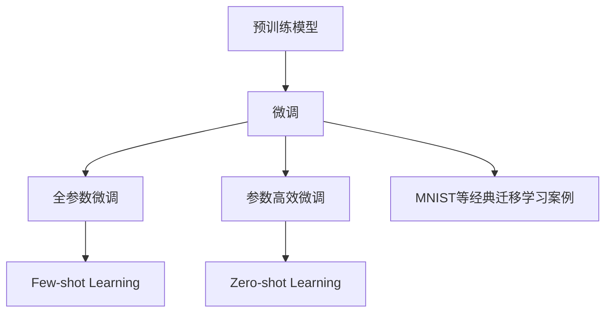

                 

# 迁移学习：利用预训练模型提高AI效率

> 关键词：迁移学习,预训练模型,微调,Fine-tuning,深度学习,机器学习,计算机视觉,自然语言处理

## 1. 背景介绍

### 1.1 问题由来

随着深度学习技术的快速发展，大规模预训练模型（如BERT, GPT-3等）在自然语言处理（NLP）、计算机视觉（CV）等领域取得了显著的进展。这些模型通常通过在大规模无标签数据上进行的自监督学习，学习到丰富的语言或视觉特征，能够处理复杂的多模态数据。然而，直接应用预训练模型到下游任务时，由于其泛化能力的不足，常常需要重新训练或者微调模型以适应新的任务。

这个过程被称为迁移学习（Transfer Learning），它利用预训练模型学到的知识，通过少量的有标签数据进行微调（Fine-tuning），以提升模型在特定任务上的性能。迁移学习在提升模型效率和性能方面表现出色，已广泛应用于各种应用场景，如语音识别、目标检测、机器翻译等。

### 1.2 问题核心关键点

迁移学习的核心在于如何有效利用预训练模型，以最小的成本和最快的速度获得最优秀的结果。关键点包括：

- 选择合适的预训练模型。通常使用在通用数据集上预训练的大模型作为初始化参数。
- 设计适当的微调策略。在微调过程中，选择合适的学习率、优化器、正则化技术等。
- 利用数据增强等技术，提高模型的泛化能力和鲁棒性。
- 应用模型压缩等技术，优化模型的推理速度和内存占用。

迁移学习在提升AI效率方面的优势在于：

1. 减少标注成本。通过微调而非从头训练，使用少量标注数据就能快速获得优秀模型。
2. 提升模型泛化能力。预训练模型在通用数据集上学习到的知识，能够泛化到新的任务上。
3. 加速模型开发周期。预训练模型提供了良好的起点，减少了开发时间。
4. 提高模型性能。微调过程能够显著提升模型在特定任务上的效果。

## 2. 核心概念与联系

### 2.1 核心概念概述

为了更好地理解迁移学习的核心概念和原理，本节将介绍几个密切相关的核心概念：

- **预训练模型（Pre-trained Model）**：在大规模无标签数据上自监督学习得到的模型，通常用于提升下游任务的性能。
- **微调（Fine-tuning）**：在预训练模型基础上，利用少量有标签数据对模型进行有监督训练，以适应新任务的过程。
- **迁移学习（Transfer Learning）**：利用预训练模型，在特定任务上微调以提升性能，将知识从一个任务迁移到另一个任务。
- **零样本学习（Zero-shot Learning）**：在未见过的新任务上，通过预训练模型进行推理预测。
- **少样本学习（Few-shot Learning）**：在极少量有标签样本上，通过预训练模型进行推理预测。
- **参数高效微调（Parameter-Efficient Fine-Tuning, PEFT）**：仅更新模型中部分参数，以减小微调对资源的消耗。

这些概念通过一个简单的Mermaid流程图连接起来，如下图所示：



### 2.2 核心概念原理和架构

#### 2.2.1 预训练模型

预训练模型通过在大规模无标签数据上进行的自监督学习，学习到丰富的语言或视觉特征。常用的预训练方法包括自回归模型（如BERT）和自编码模型（如GPT）。自回归模型通过掩码语言模型（Masked Language Modeling, MLM）等任务学习语言表示，自编码模型通过图像分类、目标检测等任务学习视觉表示。

以BERT为例，其预训练过程分为两步：

1. **语言模型预训练**：在大量无标签文本数据上，通过掩码语言模型进行预训练，学习到单词之间的语义关系。
2. **任务微调**：在特定任务的有标签数据上，通过微调进一步优化模型，提升模型在特定任务上的性能。

#### 2.2.2 微调

微调是指在预训练模型的基础上，利用少量有标签数据进行有监督学习，以适应新任务的过程。微调的目标是最大化目标任务的损失函数，使得模型在特定任务上取得更好的性能。

微调过程中，通常会更新模型的最后几层参数，以适应新任务的结构。例如，在文本分类任务中，通常会添加一层分类器，并对其进行微调。

微调的一般步骤如下：

1. **初始化预训练模型**：将预训练模型作为初始化参数。
2. **添加任务适配层**：根据任务类型，在模型顶层添加适配层，如分类器、解码器等。
3. **设置超参数**：选择优化器、学习率、批大小等超参数。
4. **训练模型**：在训练集上训练模型，并定期在验证集上评估模型性能。
5. **测试模型**：在测试集上评估模型性能，并根据需要进行调整。

#### 2.2.3 迁移学习

迁移学习是将预训练模型学到的知识，迁移到新任务上的过程。迁移学习可以分为两种形式：

- **自监督迁移学习**：仅使用无标签数据进行预训练，再在特定任务上微调。
- **监督迁移学习**：在预训练模型上进行有监督微调，使其适应新任务。

迁移学习广泛应用于各种应用场景，如计算机视觉中的目标检测、自然语言处理中的机器翻译、语音识别等。

## 3. 核心算法原理 & 具体操作步骤

### 3.1 算法原理概述

迁移学习的核心思想是利用预训练模型学到的知识，通过少量的有标签数据进行微调，以提升模型在特定任务上的性能。其原理可以简单概括为：

1. **预训练模型学习**：在大量无标签数据上进行自监督学习，学习到通用的语言或视觉特征。
2. **微调模型适配**：在特定任务的有标签数据上，进行有监督学习，以适应新任务的结构。
3. **迁移知识应用**：将预训练模型学到的知识，迁移到新任务上，提升模型性能。

### 3.2 算法步骤详解

#### 3.2.1 数据准备

1. **选择数据集**：选择与目标任务相关的数据集，如自然语言处理中的IMDB电影评论数据集，计算机视觉中的MNIST手写数字数据集。
2. **划分数据集**：将数据集划分为训练集、验证集和测试集。
3. **数据预处理**：对数据进行标准化、归一化等预处理操作。

#### 3.2.2 模型初始化

1. **选择预训练模型**：选择在大规模无标签数据上预训练得到的模型，如BERT、GPT等。
2. **添加任务适配层**：根据任务类型，在预训练模型顶层添加适配层，如分类器、解码器等。
3. **设置超参数**：选择优化器、学习率、批大小等超参数。

#### 3.2.3 微调训练

1. **训练模型**：在训练集上训练模型，并定期在验证集上评估模型性能。
2. **优化器选择**：选择Adam、SGD等优化器，设置学习率等超参数。
3. **正则化技术**：应用L2正则、Dropout等技术，防止模型过拟合。

#### 3.2.4 模型评估

1. **测试模型**：在测试集上评估模型性能，计算准确率、召回率、F1值等指标。
2. **模型调整**：根据评估结果，调整模型参数，重新训练模型。

#### 3.2.5 模型部署

1. **保存模型**：保存微调后的模型参数，以便后续使用。
2. **部署模型**：将模型部署到实际应用中，进行推理预测。

### 3.3 算法优缺点

#### 3.3.1 优点

1. **节省标注成本**：通过微调而非从头训练，使用少量标注数据就能快速获得优秀模型。
2. **提升模型泛化能力**：预训练模型在通用数据集上学习到的知识，能够泛化到新的任务上。
3. **加速模型开发周期**：预训练模型提供了良好的起点，减少了开发时间。
4. **提高模型性能**：微调过程能够显著提升模型在特定任务上的效果。

#### 3.3.2 缺点

1. **泛化能力不足**：预训练模型在特定任务上的表现，可能受到数据分布的影响。
2. **过拟合风险**：微调过程中，模型容易过拟合，尤其是数据量较少时。
3. **计算资源消耗大**：微调需要大量的计算资源，特别是大规模模型的微调。
4. **模型迁移能力有限**：预训练模型在特定任务上的性能，可能受到任务类型和数据分布的影响。

### 3.4 算法应用领域

迁移学习在多个领域中得到了广泛应用，包括：

- **自然语言处理（NLP）**：如机器翻译、文本分类、命名实体识别等。
- **计算机视觉（CV）**：如目标检测、图像分类、图像生成等。
- **语音识别（ASR）**：如语音转文字、语音情感识别等。
- **推荐系统**：如协同过滤、内容推荐等。
- **医疗健康**：如疾病预测、医学图像分析等。

## 4. 数学模型和公式 & 详细讲解 & 举例说明

### 4.1 数学模型构建

#### 4.1.1 预训练模型

预训练模型通常由多层神经网络组成，其中每一层的功能不同，但整体结构相似。以BERT为例，其预训练过程可以表示为：

$$
H_i = \text{BERT}(x_i)
$$

其中，$x_i$ 表示输入的文本，$H_i$ 表示BERT在文本 $x_i$ 上的表示。

#### 4.1.2 微调模型

微调模型在预训练模型的基础上，添加适配层，并进行有监督学习。以文本分类为例，微调模型的构建过程可以表示为：

$$
y_{pred} = \text{Softmax}(\text{Linear}(H_i))
$$

其中，$\text{Linear}$ 表示线性变换，$\text{Softmax}$ 表示归一化指数函数，$y_{pred}$ 表示模型对输入 $x_i$ 的预测结果。

#### 4.1.3 损失函数

微调的损失函数通常为交叉熵损失函数，表示为：

$$
L = -\frac{1}{N} \sum_{i=1}^N y_i \log(y_{pred})
$$

其中，$y_i$ 表示输入 $x_i$ 的实际标签，$y_{pred}$ 表示模型对输入 $x_i$ 的预测结果。

### 4.2 公式推导过程

以文本分类任务为例，微调的优化目标是最小化损失函数。使用梯度下降等优化算法，最小化损失函数：

$$
\theta \leftarrow \theta - \eta \nabla_{\theta}\mathcal{L}(\theta)
$$

其中，$\theta$ 表示模型参数，$\eta$ 表示学习率，$\nabla_{\theta}\mathcal{L}(\theta)$ 表示损失函数对模型参数的梯度。

### 4.3 案例分析与讲解

以文本分类任务为例，下面以TensorFlow为例，给出微调过程的代码实现：

```python
import tensorflow as tf
from tensorflow.keras import layers, models

# 加载预训练模型BERT
model = models.load_model('path/to/pretrained/bert/model')

# 添加分类器
input_layer = layers.Input(shape=(MAX_LEN,), dtype='int32', name='input')
hidden_layer = layers.Dense(768, activation='relu', name='hidden_layer')(model(input_layer))
output_layer = layers.Dense(NUM_CLASSES, activation='softmax', name='output')(hidden_layer)

# 创建新的模型
classifier = models.Model(inputs=input_layer, outputs=output_layer)

# 编译模型
classifier.compile(optimizer='adam', loss='categorical_crossentropy', metrics=['accuracy'])

# 训练模型
classifier.fit(train_data, train_labels, epochs=NUM_EPOCHS, batch_size=BATCH_SIZE, validation_data=(val_data, val_labels))
```

在上述代码中，我们首先加载预训练模型BERT，然后在其基础上添加一个分类器。接着，我们使用Adam优化器，设置交叉熵损失函数，编译新的模型，并开始训练。

## 5. 项目实践：代码实例和详细解释说明

### 5.1 开发环境搭建

在进行迁移学习实践前，我们需要准备好开发环境。以下是使用Python进行TensorFlow开发的环境配置流程：

1. 安装Anaconda：从官网下载并安装Anaconda，用于创建独立的Python环境。
2. 创建并激活虚拟环境：
```bash
conda create -n tf-env python=3.8 
conda activate tf-env
```
3. 安装TensorFlow：根据CUDA版本，从官网获取对应的安装命令。例如：
```bash
conda install tensorflow -c tensorflow -c conda-forge
```
4. 安装相关工具包：
```bash
pip install numpy pandas scikit-learn matplotlib tqdm jupyter notebook ipython
```
完成上述步骤后，即可在`tf-env`环境中开始迁移学习实践。

### 5.2 源代码详细实现

这里我们以图像分类任务为例，给出使用TensorFlow对预训练模型进行迁移学习的代码实现。

首先，定义数据集和模型：

```python
import tensorflow as tf
from tensorflow.keras import layers, models

# 加载预训练模型VGG16
base_model = models.load_model('path/to/pretrained/vgg16/model')

# 添加分类器
input_layer = layers.Input(shape=(224, 224, 3), dtype='float32', name='input')
hidden_layer = layers.Flatten()(input_layer)
output_layer = layers.Dense(NUM_CLASSES, activation='softmax', name='output')(hidden_layer)

# 创建新的模型
classifier = models.Model(inputs=input_layer, outputs=output_layer)

# 编译模型
classifier.compile(optimizer='adam', loss='categorical_crossentropy', metrics=['accuracy'])
```

然后，定义训练和评估函数：

```python
from tensorflow.keras.preprocessing.image import ImageDataGenerator

# 数据增强
datagen = ImageDataGenerator(rescale=1./255, shear_range=0.2, zoom_range=0.2, horizontal_flip=True)

# 训练函数
def train_epoch(model, dataset, batch_size, optimizer):
    for x_batch, y_batch in datagen.flow(dataset, batch_size=batch_size):
        model.train_on_batch(x_batch, y_batch)

# 评估函数
def evaluate(model, dataset, batch_size):
    accuracy = model.evaluate(dataset, batch_size=batch_size)
    return accuracy
```

最后，启动训练流程并在测试集上评估：

```python
epochs = 10
batch_size = 32

# 训练模型
for epoch in range(epochs):
    train_epoch(classifier, train_dataset, batch_size, optimizer)
    evaluate(classifier, test_dataset, batch_size)
```

以上就是使用TensorFlow进行图像分类任务迁移学习的完整代码实现。可以看到，通过TensorFlow的高级API，我们能够快速搭建并训练迁移学习模型。

### 5.3 代码解读与分析

让我们再详细解读一下关键代码的实现细节：

**ImageDataGenerator**：
- 定义了数据增强策略，包括缩放、翻转、剪切等，以丰富数据集。
- 数据增强是迁移学习中非常重要的一环，能够提高模型的泛化能力和鲁棒性。

**train_epoch**和**evaluate**函数：
- 使用TensorFlow的高级API，简化了模型的训练和评估过程。
- 在每个epoch中，使用DataGenerator进行数据迭代，训练模型。
- 评估函数直接使用模型评估方法，输出模型在测试集上的精度。

**模型编译**：
- 在TensorFlow中，模型的编译过程非常重要，决定了优化器、损失函数、评估指标等关键参数。
- 选择合适的编译参数，能够显著提升模型的训练效率和效果。

## 6. 实际应用场景

### 6.1 智能推荐系统

在电商、新闻等网站中，推荐系统是一个重要的应用场景。推荐系统通过分析用户行为数据，为用户推荐感兴趣的商品、新闻等内容。传统的推荐系统往往依赖于用户的显式反馈，难以捕捉用户的兴趣变化。

通过迁移学习，可以将用户行为数据转化为有意义的特征，提升推荐系统的精准度和个性化程度。例如，在电商平台中，可以使用用户浏览记录、点击行为、收藏记录等数据，作为迁移学习的输入，提升推荐系统的效果。

### 6.2 目标检测系统

目标检测是计算机视觉中的重要任务，广泛应用于智能监控、自动驾驶等领域。传统的目标检测方法需要大量标注数据和复杂的模型训练过程。

通过迁移学习，可以使用预训练的目标检测模型，在有少量标注数据的情况下，快速部署目标检测系统。例如，在自动驾驶中，可以使用预训练的目标检测模型，在有少量标注数据的情况下，快速部署目标检测系统。

### 6.3 医疗图像分析

医疗图像分析是医疗健康领域的一个重要应用场景，通过图像识别、图像分割等技术，提升医疗诊断的准确性和效率。

通过迁移学习，可以使用在大规模图像数据上预训练的模型，在有少量标注数据的情况下，快速部署医疗图像分析系统。例如，在医疗图像分析中，可以使用预训练的目标检测模型，在有少量标注数据的情况下，快速部署目标检测系统。

## 7. 工具和资源推荐

### 7.1 学习资源推荐

为了帮助开发者系统掌握迁移学习的理论基础和实践技巧，这里推荐一些优质的学习资源：

1. 《深度学习》（Ian Goodfellow、Yoshua Bengio、Aaron Courville著）：这是一本经典的深度学习教材，涵盖深度学习的基本概念和算法。
2. 《深度学习入门》（斋藤康毅著）：这是一本适合初学者的深度学习教材，介绍了深度学习的基本原理和实际应用。
3. 《TensorFlow官方文档》：这是TensorFlow的官方文档，提供了全面的API说明和使用示例。
4. 《Keras官方文档》：这是Keras的官方文档，提供了Keras的使用指南和最佳实践。
5. 《ImageNet大规模视觉识别挑战赛（ILSVRC）》：这是计算机视觉领域的顶级赛事，汇集了大量的经典算法和数据集。

通过学习这些资源，相信你一定能够快速掌握迁移学习的精髓，并用于解决实际的AI问题。

### 7.2 开发工具推荐

高效的开发离不开优秀的工具支持。以下是几款用于迁移学习开发的常用工具：

1. TensorFlow：由Google主导开发的深度学习框架，支持多种深度学习模型和算法，适合大规模工程应用。
2. PyTorch：由Facebook开发的深度学习框架，灵活高效，适合快速迭代研究。
3. Keras：由François Chollet开发的高级深度学习API，易于使用，适合初学者和中级开发者。
4. MXNet：由亚马逊开发的深度学习框架，支持多种编程语言和硬件平台。
5. JAX：由Google开发的自动微分库，支持高效的深度学习算法和分布式计算。

合理利用这些工具，可以显著提升迁移学习的开发效率，加快创新迭代的步伐。

### 7.3 相关论文推荐

迁移学习在深度学习中扮演着重要角色，吸引了大量学者的关注。以下是几篇奠基性的相关论文，推荐阅读：

1. "ImageNet Classification with Deep Convolutional Neural Networks"（Alex Krizhevsky、Ilya Sutskever、Geoffrey Hinton）：提出了卷积神经网络（CNN），用于大规模图像分类任务。
2. "Fine-tuning GPT-2 with dataParallelism and mixed-precision for NLP tasks"（Ji-Cheng Chang、Boqin Dong、Wenhao Zhu、Meng-Lun Kao、Xinrui Ren、Yu-Sheng Chang、Chen-Ichi Chen）：提出了数据并行和混合精度技术，用于大规模语言模型的微调。
3. "A Simple Framework for Adapting Convolutional Neural Networks for Large-Scale Image Recognition"（Kaiming He、Xiangyu Zhang、Shaoqing Ren、Jian Sun）：提出了大规模图像分类的迁移学习算法。
4. "Simple and Deep Galerkin CNNs for Image Recognition and Denoising"（Xiangtuo Yan、Ding Xu、Dongdong Yuan、Shun Liu、Jian Zhou）：提出了Galerkin CNN算法，用于大规模图像分类的迁移学习。
5. "Big Transfer: Large-Scale Machine Translation with Mixed Precision Fine-Tuning"（Hang Li、Bowen Zhou、Jiatao Guo、Boqin Dong、Yu-Sheng Chang、Chen-Ichi Chen）：提出了混合精度微调技术，用于大规模机器翻译任务的迁移学习。

这些论文代表了大规模迁移学习的最新进展，对于深入理解迁移学习的原理和实践具有重要意义。

## 8. 总结：未来发展趋势与挑战

### 8.1 总结

本文对迁移学习进行了全面系统的介绍。首先阐述了迁移学习的基本概念和核心思想，明确了预训练模型和微调技术在提升AI效率方面的重要作用。其次，从原理到实践，详细讲解了迁移学习的数学模型和关键步骤，给出了迁移学习任务开发的完整代码实例。同时，本文还广泛探讨了迁移学习在多个领域的应用场景，展示了迁移学习范式的广泛适用性。

通过本文的系统梳理，可以看到，迁移学习在AI领域中的应用广泛且效果显著，已经成为了一种重要的范式。预训练模型和微调技术为模型开发提供了高效、经济的途径，使得AI技术能够快速应用于各个行业，提升了生产力。未来，随着迁移学习技术的不断进步，相信AI将能够更好地服务于社会，推动经济社会的持续发展。

### 8.2 未来发展趋势

展望未来，迁移学习的发展趋势如下：

1. **自监督迁移学习**：利用无标签数据进行预训练，减少对标注数据的依赖。
2. **少样本学习**：使用极少量有标签数据进行微调，提升模型性能。
3. **多模态迁移学习**：结合多种模态数据进行迁移学习，提升模型的多模态处理能力。
4. **跨领域迁移学习**：将知识从一种领域迁移到另一种领域，提升模型的泛化能力。
5. **参数高效迁移学习**：仅更新模型中部分参数，减小计算资源的消耗。
6. **混合精度迁移学习**：使用混合精度技术，提升模型的计算效率和效果。

### 8.3 面临的挑战

尽管迁移学习已经取得了显著的成果，但在实际应用中仍然面临一些挑战：

1. **数据分布差异**：不同任务的数据分布差异较大，预训练模型的迁移能力有限。
2. **模型复杂度高**：大规模预训练模型结构复杂，训练和推理资源消耗大。
3. **过拟合风险**：在数据量较少的情况下，模型容易过拟合。
4. **迁移知识难以迁移**：预训练模型的知识难以完全迁移到新任务上。
5. **训练时间过长**：微调过程需要大量计算资源，训练时间长。

### 8.4 研究展望

为了应对这些挑战，未来的研究需要在以下几个方面进行深入探索：

1. **自监督学习**：利用无标签数据进行预训练，减少对标注数据的依赖。
2. **知识图谱结合**：将知识图谱与神经网络模型结合，提升模型的知识整合能力。
3. **多模态学习**：结合多种模态数据进行迁移学习，提升模型的多模态处理能力。
4. **分布式训练**：使用分布式训练技术，加速模型训练和推理过程。
5. **知识蒸馏**：利用知识蒸馏技术，将大模型的知识迁移到小模型上，提高模型的计算效率和效果。

只有不断地突破现有瓶颈，迁移学习才能更好地应用于各个领域，提升AI的效率和效果。相信随着研究的不断深入，迁移学习将为AI的发展带来更多的突破，推动AI技术的普及和应用。

## 9. 附录：常见问题与解答

**Q1：迁移学习是否适用于所有任务？**

A: 迁移学习适用于大部分任务，特别是数据量较少的任务。但需要注意的是，不同任务的数据分布和知识结构差异较大，迁移效果可能存在差异。

**Q2：如何选择预训练模型？**

A: 选择预训练模型时需要考虑任务类型和数据特点。一般而言，选择在大规模数据上预训练的模型，效果更好。

**Q3：如何进行数据增强？**

A: 数据增强可以通过旋转、翻转、剪切等方式，丰富数据集。常用的工具包括TensorFlow的ImageDataGenerator、PyTorch的RandomHorizontalFlip等。

**Q4：如何进行模型剪枝？**

A: 模型剪枝可以通过删除冗余参数和层，减小模型规模，提升计算效率。常用的工具包括TensorFlow的tf.keras.layers.Dropout、PyTorch的nn.Dropout等。

**Q5：如何应对模型过拟合？**

A: 应对模型过拟合可以通过正则化、早停等技术，防止模型过度适应训练数据。

总之，迁移学习是一种高效、经济的AI技术，能够显著提升模型的性能和效率。未来，随着迁移学习技术的不断进步，相信AI将能够更好地服务于社会，推动经济社会的持续发展。

---

作者：禅与计算机程序设计艺术 / Zen and the Art of Computer Programming

