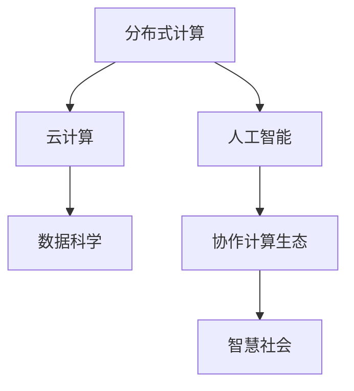

                 

# 连接人类智慧的纽带：人类计算的协作精神

> 关键词：协作计算、分布式系统、云计算、人工智能、数据科学、创新生态、智慧社会

## 1. 背景介绍

### 1.1 问题由来

在人类社会的发展历程中，计算能力的提升一直是推动文明进步的关键力量。从算盘、机械计算器到电子计算机，每一次计算能力的飞跃，都伴随着人类社会的深刻变革。今天，随着大数据、云计算、人工智能等技术的快速演进，我们正在进入一个新的时代——协作计算的时代。

协作计算不仅提升了计算能力，更开启了一种全新的计算范式。在协作计算的世界里，计算不再是单点的高性能设备所能承担的任务，而是通过全球范围的分布式协作，实现计算资源的共享和最优配置，从而极大地拓展了计算的边界。

这一变革，在诸多领域已经显现出巨大潜力。比如，在科学研究中，多个实验室的共同计算可以大大加速数据的处理和分析；在商业领域，协同计算可以提升供应链管理、市场营销等业务决策的精准度；在公共服务中，协作计算可以大幅提高应急响应、灾害预防等公共安全水平。

协作计算不仅改变了计算的方式，更深刻地影响了社会的运行机制。通过协作计算，我们能够更高效地利用数据、资源，促进不同行业、不同领域、不同群体之间的协同合作，从而构建一个更加智慧、更加和谐的社会。

### 1.2 问题核心关键点

协作计算的核心在于通过分布式计算平台，将海量数据、高性能计算资源和智能算法进行有机整合，实现计算任务的协同完成。这其中，以下几个关键点尤为值得关注：

1. **分布式计算框架**：如Hadoop、Spark等，提供了一种将大规模计算任务分割成小型任务并并行处理的能力，是实现协作计算的基础。
2. **云计算服务**：如AWS、Google Cloud、Microsoft Azure等，通过提供按需弹性计算资源，使得协作计算变得更加灵活和高效。
3. **人工智能算法**：如机器学习、深度学习等，是协作计算中实现智能分析和决策的核心技术。
4. **数据共享与治理**：如何安全、高效地共享和治理数据，是协作计算中不可或缺的环节。
5. **协作计算生态**：构建一个开放、活跃、协作的计算生态系统，是协作计算可持续发展的关键。

这些关键点相互交织，共同构成了一个复杂的协作计算体系。只有深入理解这些关键点，才能更好地把握协作计算的内在规律，推动其进一步发展。

### 1.3 问题研究意义

研究协作计算的内在原理和应用实践，对于拓展计算能力、提升数据价值、促进社会协作具有重要意义：

1. **提升计算效率**：通过分布式计算框架，可以大幅提升数据处理和分析的效率，应对海量数据的挑战。
2. **挖掘数据价值**：协作计算平台能够更好地整合和利用数据，挖掘数据中的深层次信息，驱动科学研究和商业决策。
3. **促进社会协作**：通过协作计算，不同行业、不同领域、不同群体之间的数据和知识可以共享，促进跨界合作，构建更紧密的社会联系。
4. **支持智慧社会**：协作计算是构建智慧社会的基础设施，能够支持智能交通、智慧医疗、智慧城市等众多创新应用。
5. **加速创新生态**：协作计算提供了灵活、高效、低成本的计算资源，为科技创新和商业创新提供了强大的支撑。

总之，协作计算不仅是计算技术的一次重大变革，更是人类社会协作方式的深刻变革。深入研究协作计算的内在原理和应用实践，将为构建智慧社会、推动人类文明进步提供强大的技术支撑。

## 2. 核心概念与联系

### 2.1 核心概念概述

为了更好地理解协作计算的核心原理和应用实践，本节将介绍几个密切相关的核心概念：

1. **分布式计算**：指通过将计算任务分割成多个子任务，并在多台计算机上并行处理，以提升计算效率的计算方式。经典例子包括MapReduce、Spark等。

2. **云计算**：指通过互联网提供按需计算资源和存储服务，使得计算资源的分配和使用变得更加灵活、高效和廉价。主要提供商包括AWS、Google Cloud、Microsoft Azure等。

3. **人工智能(AI)**：指通过计算机模拟人的智能行为，实现自动感知、推理、决策等能力。核心技术包括机器学习、深度学习、自然语言处理等。

4. **数据科学**：指利用统计学、数据挖掘、机器学习等方法，对大规模数据进行分析和建模，提取有价值的信息和洞见。

5. **协作计算生态**：指围绕协作计算平台构建的开放、活跃、协作的创新生态系统，包括数据提供商、计算资源提供商、应用开发者、用户等各方角色。

6. **智慧社会**：指通过信息技术和创新应用，提升社会管理和公共服务的智能化水平，实现人机协同、互联互通、高效便捷的社会形态。

这些核心概念之间的逻辑关系可以通过以下Mermaid流程图来展示：



这个流程图展示了一些核心概念之间的内在联系：

1. 分布式计算是云计算的基础，提供了高效灵活的计算资源。
2. 云计算为人工智能和数据科学提供了强大的基础设施。
3. 人工智能和数据科学驱动了协作计算生态的发展，使其更加智能和高效。
4. 协作计算生态为智慧社会的构建提供了技术支撑，推动了社会的智能化进程。

这些概念相互依存、相互作用，共同构成了协作计算的完整体系。

## 3. 核心算法原理 & 具体操作步骤
### 3.1 算法原理概述

协作计算的核心算法原理可以概括为“数据-计算-智能”的闭环反馈机制。即通过分布式计算平台将大规模数据进行高效处理，再利用云计算基础设施提供灵活的计算资源，最后通过人工智能算法进行智能分析和决策，形成一个不断优化和提升的闭环反馈系统。

具体来说，协作计算过程包括：

1. **数据收集与处理**：通过分布式计算框架将海量数据进行收集和初步处理，为后续计算任务提供数据支撑。
2. **任务分割与执行**：将计算任务分割成多个小型任务，在多台计算机上并行处理，提升计算效率。
3. **数据存储与共享**：通过云存储技术实现数据的集中管理和高效共享，为跨界协作提供数据基础。
4. **智能分析与决策**：利用人工智能算法对处理后的数据进行智能分析和决策，提升数据价值和应用效果。
5. **反馈优化与迭代**：通过闭环反馈机制，不断优化和提升计算能力和智能水平，推动协作计算体系的持续演进。

这一过程涉及到大数据处理、分布式计算、云存储、人工智能等多项技术，需要跨学科的知识和技能。

### 3.2 算法步骤详解

协作计算的具体操作步骤包括以下几个关键步骤：

**Step 1: 数据收集与预处理**

- 收集大规模数据，并对其进行清洗、去重、标注等预处理，确保数据的质量和可用性。
- 使用分布式计算框架（如Hadoop、Spark）将数据分割成多个小型任务，并行处理。
- 使用云存储服务（如AWS S3、Google Cloud Storage）集中管理和存储数据，确保数据的可靠性和可访问性。

**Step 2: 任务分割与执行**

- 根据计算任务的需求，将任务分割成多个小型任务，确保每个任务的大小适合分布式计算框架的处理能力。
- 将小型任务分配给多台计算机进行并行处理，使用分布式计算框架（如MapReduce、Spark）进行任务调度和执行。
- 使用云服务提供高性能计算资源，确保任务执行的效率和稳定性。

**Step 3: 数据存储与共享**

- 将处理后的数据存储到云存储服务中，确保数据的安全性和可用性。
- 通过API接口，实现数据的跨界共享和访问，促进协作计算生态的发展。

**Step 4: 智能分析与决策**

- 利用人工智能算法（如机器学习、深度学习）对处理后的数据进行智能分析和决策，提取有价值的信息和洞见。
- 根据决策结果，进行后续的计算任务分割和执行，不断优化和提升计算能力和智能水平。

**Step 5: 反馈优化与迭代**

- 根据智能分析结果和业务需求，不断优化和调整计算任务，提升计算效率和智能水平。
- 使用闭环反馈机制，将优化后的计算结果反馈到数据收集和处理阶段，形成一个不断迭代和提升的协作计算体系。

### 3.3 算法优缺点

协作计算作为一种新型计算范式，具有以下优点：

1. **高效率**：通过分布式计算和云计算，能够高效处理海量数据，提升计算效率。
2. **低成本**：使用云计算基础设施，按需弹性扩展计算资源，降低计算成本。
3. **灵活性**：可以根据业务需求灵活调整计算任务和资源，适应多样化的应用场景。
4. **高安全性**：通过集中管理和访问控制，保障数据和计算资源的安全性。
5. **高智能性**：利用人工智能算法进行智能分析和决策，提升数据价值和应用效果。

同时，协作计算也存在一些缺点：

1. **复杂性**：涉及多项技术，需要跨学科的知识和技能，实施复杂。
2. **延迟问题**：分布式计算和数据共享可能带来网络延迟和通信开销，影响计算效率。
3. **数据隐私**：数据存储和共享可能带来隐私和安全问题，需要严格的数据治理和隐私保护机制。
4. **资源管理**：需要有效的资源管理策略，避免资源浪费和过度消耗。
5. **系统稳定性**：系统复杂度高，需要考虑冗余和容错机制，确保系统的稳定性和可靠性。

尽管存在这些缺点，但协作计算的诸多优点使其在实际应用中具有广泛的应用前景，值得深入研究和探索。

### 3.4 算法应用领域

协作计算已经在诸多领域得到了广泛应用，覆盖了从科学研究到商业创新、从公共服务到社会治理等多个领域：

- **科学研究**：在基因组学、天文学、环境科学等领域，通过大规模协作计算，加速科学研究和数据分析。
- **商业创新**：在市场营销、供应链管理、客户关系管理等领域，通过协作计算，提升业务决策的精准度和效率。
- **公共服务**：在应急响应、城市管理、灾害预防等领域，通过协作计算，提升公共服务的智能化水平。
- **社会治理**：在智慧医疗、智慧教育、智慧交通等领域，通过协作计算，推动社会治理的现代化和智能化。

除了上述这些经典应用外，协作计算还在更多场景中发挥了重要作用，如金融风险管理、能源管理、工业生产等领域，为各行各业带来了新的发展机遇。

## 4. 数学模型和公式 & 详细讲解
### 4.1 数学模型构建

协作计算的数学模型可以概括为以下形式：

$$
\text{计算任务} = \text{数据收集} \times \text{分布式计算} \times \text{云计算} \times \text{人工智能算法} \times \text{数据治理}
$$

其中，数据收集和预处理、分布式计算、云计算和数据治理构成了协作计算的基础设施，而人工智能算法则负责对数据进行智能分析和决策。

### 4.2 公式推导过程

以机器学习算法为例，协作计算的数学模型可以进一步具体化为：

1. **数据收集与预处理**

$$
\text{数据预处理} = \text{原始数据} \rightarrow \text{清洗去重} \rightarrow \text{特征提取} \rightarrow \text{数据集构建}
$$

其中，原始数据经过清洗去重后，使用特征提取方法（如PCA、TF-IDF等）提取特征，最终构建数据集。

2. **分布式计算**

$$
\text{分布式计算} = \text{任务分割} \rightarrow \text{任务调度} \rightarrow \text{并行执行}
$$

其中，任务分割将大规模任务分割成多个小型任务，任务调度将任务分配给多台计算机并行执行，提升计算效率。

3. **云计算**

$$
\text{云计算} = \text{资源申请} \rightarrow \text{资源管理} \rightarrow \text{计算资源}
$$

其中，根据计算需求，申请相应的计算资源，并进行资源管理，确保计算资源的高效利用。

4. **智能分析与决策**

$$
\text{智能分析与决策} = \text{模型训练} \rightarrow \text{特征工程} \rightarrow \text{模型评估}
$$

其中，使用机器学习模型对数据进行训练和特征工程，评估模型效果并进行优化。

5. **反馈优化与迭代**

$$
\text{反馈优化与迭代} = \text{结果反馈} \rightarrow \text{任务优化} \rightarrow \text{新任务生成}
$$

其中，根据智能分析结果，进行任务优化和新任务的生成，形成一个不断迭代和提升的协作计算体系。

### 4.3 案例分析与讲解

以智慧医疗为例，协作计算的实际应用过程如下：

**Step 1: 数据收集与预处理**

- 收集大量的医疗数据，包括病历、影像、基因等数据。
- 对数据进行清洗去重，使用机器学习算法提取特征，构建数据集。

**Step 2: 任务分割与执行**

- 将数据处理任务分割成多个小型任务，使用分布式计算框架进行处理。
- 使用云计算平台提供高性能计算资源，确保数据处理效率。

**Step 3: 数据存储与共享**

- 将处理后的数据存储到云存储服务中，确保数据的安全性和可用性。
- 通过API接口，实现数据的跨界共享和访问，促进不同医院和研究机构之间的协作。

**Step 4: 智能分析与决策**

- 利用机器学习模型对数据进行训练和分析，提取有价值的洞见，如疾病预测、治疗方案推荐等。
- 根据分析结果，进行后续的医疗决策和优化。

**Step 5: 反馈优化与迭代**

- 根据医疗决策的效果，进行任务优化和改进。
- 使用闭环反馈机制，将优化后的数据和决策结果反馈到数据收集和处理阶段，形成一个不断迭代和提升的协作计算体系。

## 5. 项目实践：代码实例和详细解释说明
### 5.1 开发环境搭建

在进行协作计算实践前，我们需要准备好开发环境。以下是使用Python进行Spark开发的 environment配置流程：

1. 安装Anaconda：从官网下载并安装Anaconda，用于创建独立的Python环境。

2. 创建并激活虚拟环境：
```bash
conda create -n spark-env python=3.8 
conda activate spark-env
```

3. 安装Apache Spark：根据操作系统版本，从官网获取对应的安装命令。例如：
```bash
conda install apache-spark=3.1.2
```

4. 安装各类工具包：
```bash
pip install numpy pandas scikit-learn matplotlib tqdm jupyter notebook ipython
```

完成上述步骤后，即可在`spark-env`环境中开始协作计算实践。

### 5.2 源代码详细实现

这里我们以智慧医疗领域为例，给出使用Apache Spark进行数据处理和机器学习算法的PySpark代码实现。

首先，定义数据处理函数：

```python
from pyspark.sql import SparkSession
from pyspark.sql.functions import col, split, udf
from pyspark.ml.feature import VectorAssembler
from pyspark.ml import Pipeline

spark = SparkSession.builder.appName("spark-collaborative").getOrCreate()

def data_processing(spark, data_path):
    # 加载数据
    df = spark.read.csv(data_path, header=True)
    
    # 数据清洗
    df = df.dropna()
    
    # 特征提取
    features = ['age', 'gender', 'blood_pressure', 'cholesterol', 'glucose', 'bmi', 'insulin', 'smoke', 'alcohol', 'active', 'vegetarian']
    df = df.select(features)
    
    # 分词处理
    split_fn = udf(lambda x: x.split(','), StringType(), returnType=ArrayType(StringType()))
    df = df.withColumn('label', split_fn(col('label')))
    
    # 特征编码
    assembler = VectorAssembler(inputCols=features, outputCol='features')
    df = assembler.transform(df)
    
    return df
```

然后，定义机器学习模型和评估函数：

```python
from pyspark.ml.classification import LogisticRegression
from pyspark.ml.evaluation import BinaryClassificationEvaluator

# 定义逻辑回归模型
model = LogisticRegression(maxIter=10, regParam=0.3, elasticNetParam=0.8)

# 定义评估器
evaluator = BinaryClassificationEvaluator(labelCol='label', metricName='auc')

# 定义数据处理与模型训练的Pipeline
pipeline = Pipeline(stages=[data_processing, model])

# 训练模型
pipeline.fit(df)

# 评估模型
evaluator.evaluate(df, pipeline.stages[1])
```

最后，启动训练流程并在测试集上评估：

```python
data_path = 'path/to/data.csv'

# 加载数据
df = data_processing(spark, data_path)

# 训练模型
pipeline.fit(df)

# 评估模型
evaluator.evaluate(df, pipeline.stages[1])

# 预测新数据
new_data = spark.createDataFrame([['58', 'male', '126', '4.3', '82', '24', '88', 'no', 'yes', 'yes', 'no', 'no']], ['age', 'gender', 'blood_pressure', 'cholesterol', 'glucose', 'bmi', 'insulin', 'smoke', 'alcohol', 'active', 'vegetarian', 'label'])
predictions = pipeline.transform(new_data)
```

以上就是使用PySpark进行智慧医疗领域数据处理和机器学习算法实践的完整代码实现。可以看到，得益于Spark的高效分布式计算能力，我们能够快速处理海量数据，并利用机器学习算法提取有价值的信息和洞见。

### 5.3 代码解读与分析

让我们再详细解读一下关键代码的实现细节：

**data_processing函数**：
- `data_path`参数：指定数据文件的路径。
- `spark`参数：创建SparkSession对象，用于管理Spark集群。
- `load_data`方法：从指定路径加载数据文件。
- `dropna`方法：删除缺失值。
- `select`方法：选择需要的特征列。
- `split_fn`方法：定义一个UDF函数，将标签列按逗号分隔成数组。
- `withColumn`方法：在数据帧中添加新的列，用于标签的特征编码。
- `VectorAssembler`类：用于将特征列组合成向量，方便机器学习算法处理。
- `Pipeline`类：用于将数据处理和模型训练步骤串联起来，方便统一管理。

**LogisticRegression模型**：
- `maxIter`参数：最大迭代次数。
- `regParam`参数：正则化参数。
- `elasticNetParam`参数：弹性网正则化参数。

**BinaryClassificationEvaluator评估器**：
- `labelCol`参数：标签列名。
- `metricName`参数：评估指标名称，如AUC。

**pipelinePipeline模型**：
- `data_processing`和`model`是数据处理和模型训练的具体步骤。
- `Pipeline`类将这两步串联起来，形成完整的协作计算流程。

**评估模型**：
- 使用`evaluate`方法评估模型的AUC值，判断模型效果。
- 使用`transform`方法将新数据输入模型进行预测。

通过这些代码的实现，我们可以看到，Spark的分布式计算能力使得协作计算变得更加高效和灵活。开发者可以方便地对大规模数据进行并行处理，同时利用机器学习算法提取有价值的信息和洞见，推动各行业的智能化进程。

当然，工业级的系统实现还需考虑更多因素，如模型的保存和部署、超参数的自动搜索、更灵活的任务适配层等。但核心的协作计算流程基本与此类似。

## 6. 实际应用场景
### 6.1 智慧医疗

协作计算在智慧医疗领域的应用已经取得了显著成效。传统医疗系统需要大量人力进行数据处理和分析，效率低、成本高。而协作计算平台能够高效处理海量医疗数据，提取有价值的洞见，提升医疗决策的精准度和效率。

具体应用包括：

- **疾病预测**：利用机器学习模型分析病历数据，预测患者可能患有的疾病，提前进行干预和治疗。
- **治疗方案推荐**：根据患者的特征和历史治疗记录，利用智能算法推荐最合适的治疗方案，提升治疗效果。
- **患者管理**：利用协作计算平台进行患者的长期管理和监控，及时发现异常情况，提供个性化的健康管理服务。

### 6.2 智慧城市

协作计算在智慧城市领域也有广泛的应用。智慧城市建设需要大量数据和计算资源进行支撑，通过协作计算平台，可以实现城市管理和公共服务的智能化、精细化。

具体应用包括：

- **交通管理**：利用协作计算平台进行交通数据的实时分析，优化交通信号灯的控制策略，缓解交通拥堵。
- **公共安全**：利用协作计算平台进行灾害预警和应急响应，提升公共安全水平。
- **智慧照明**：利用协作计算平台进行路灯的智能控制，节省能源消耗。

### 6.3 智慧教育

协作计算在智慧教育领域也有广泛的应用。传统的教育模式依赖于人力和纸质教材，效率低、资源浪费。而协作计算平台可以高效处理学生数据，提供个性化的学习推荐和辅导服务，提升教育质量和效率。

具体应用包括：

- **学习分析**：利用协作计算平台分析学生的学习数据，提供个性化的学习建议和辅导服务。
- **课程推荐**：根据学生的兴趣和学习进度，利用智能算法推荐合适的课程和教材，提升学习效果。
- **智能辅导**：利用协作计算平台提供智能化的学习辅导服务，解答学生的疑问，提供个性化的学习支持。

### 6.4 未来应用展望

随着协作计算技术的不断发展，未来其在各行业的应用前景将更加广阔。以下列举几个未来可能的趋势：

1. **实时数据处理**：协作计算平台将能够实时处理大规模数据，实现实时分析和决策，提升各行业的决策速度和效率。
2. **跨界数据融合**：协作计算平台将能够高效整合不同领域、不同来源的数据，实现跨界数据融合和创新应用。
3. **智能预测与决策**：利用协作计算平台进行智能预测和决策，提升各行业的智能化水平，驱动社会进步。
4. **社会治理智能化**：利用协作计算平台进行智慧治理，提升政府决策的科学性和公正性，推动社会治理的现代化。
5. **商业创新生态**：利用协作计算平台推动商业创新，实现更灵活、更高效的商业运作模式。

## 7. 工具和资源推荐
### 7.1 学习资源推荐

为了帮助开发者系统掌握协作计算的理论基础和实践技巧，这里推荐一些优质的学习资源：

1. **《大数据与人工智能：协作计算》**：该书详细介绍了大数据和人工智能技术在协作计算中的应用，涵盖数据收集、数据处理、机器学习等多个方面。
2. **Apache Spark官方文档**：Spark官方文档提供了丰富的学习资源，包括API文档、用户指南、案例分析等，是学习Spark的重要参考。
3. **《深度学习与人工智能：理论与实践》**：该书介绍了深度学习在协作计算中的应用，涵盖数据预处理、模型训练、模型评估等多个方面。
4. **Coursera《大数据技术与应用》课程**：斯坦福大学开设的课程，详细介绍了大数据技术和协作计算的原理和应用，适合初学者和进阶者学习。
5. **Kaggle大数据与机器学习竞赛**：Kaggle提供了大量的数据集和竞赛，通过实践提升数据处理和机器学习技能。

通过对这些资源的学习实践，相信你一定能够快速掌握协作计算的精髓，并用于解决实际的计算问题。

### 7.2 开发工具推荐

高效的开发离不开优秀的工具支持。以下是几款用于协作计算开发的常用工具：

1. **Apache Spark**：Spark是当前最流行的分布式计算框架之一，提供了高效的数据处理和机器学习能力。
2. **Hadoop**：Hadoop是另一个流行的分布式计算框架，适合大规模数据处理和存储。
3. **Google Cloud Platform**：Google Cloud提供了丰富的云服务，包括数据存储、计算资源、机器学习等，是协作计算的理想平台。
4. **Amazon Web Services (AWS)**：AWS提供了强大的云服务平台，包括计算、存储、数据库等服务，是协作计算的重要支撑。
5. **Microsoft Azure**：Azure是微软的云服务平台，提供了丰富的云服务和资源，适合各类计算需求。
6. **Kubernetes**：Kubernetes是容器编排工具，可以实现分布式应用的自动化部署、扩展和管理。

合理利用这些工具，可以显著提升协作计算开发的效率和效果。

### 7.3 相关论文推荐

协作计算的研究涉及多个学科，以下列举几篇具有代表性的论文，推荐阅读：

1. **《A Survey of Collaborative Computing》**：该文综述了协作计算的基本概念、技术和应用，适合初步学习者。
2. **《Collaborative Computing in Science and Engineering》**：该文介绍了协作计算在科学研究和工程中的应用，展示了协作计算的实际价值。
3. **《Collaborative Data Science》**：该文详细介绍了大数据和协作计算在科学研究中的应用，提供了丰富的案例分析。
4. **《Collaborative Computing for Big Data Analysis》**：该文介绍了协作计算在大数据分析中的应用，展示了协作计算的高效性和灵活性。
5. **《Collaborative Computing for Smart Cities》**：该文介绍了协作计算在智慧城市中的应用，展示了协作计算对城市治理的深刻影响。

这些论文代表了协作计算领域的研究前沿，通过学习这些前沿成果，可以帮助研究者把握学科前进方向，激发更多的创新灵感。

## 8. 总结：未来发展趋势与挑战
### 8.1 研究成果总结

本文对协作计算的内在原理和应用实践进行了全面系统的介绍。首先阐述了协作计算的背景和意义，明确了协作计算在提升计算能力、挖掘数据价值、促进社会协作等方面的独特价值。其次，从原理到实践，详细讲解了协作计算的数学原理和关键步骤，给出了协作计算任务开发的完整代码实例。同时，本文还广泛探讨了协作计算在智慧医疗、智慧城市、智慧教育等多个领域的应用前景，展示了协作计算的巨大潜力。此外，本文精选了协作计算技术的各类学习资源，力求为开发者提供全方位的技术指引。

通过本文的系统梳理，可以看到，协作计算不仅是计算技术的一次重大变革，更是人类协作方式的深刻变革。深入研究协作计算的内在原理和应用实践，将为构建智慧社会、推动人类文明进步提供强大的技术支撑。

### 8.2 未来发展趋势

展望未来，协作计算将呈现以下几个发展趋势：

1. **计算能力持续提升**：随着硬件性能的不断提升和算法优化的不断进步，协作计算的计算能力将持续提升，支持更大规模的数据处理和分析。
2. **数据资源更加丰富**：各类物联网设备、传感器等将不断产生新的数据，协作计算平台能够高效整合和利用这些数据，提升数据价值。
3. **智能分析更加深入**：通过深度学习、增强学习等技术，协作计算平台将能够进行更深入的智能分析和决策，提升各行业的智能化水平。
4. **跨界融合更加紧密**：协作计算平台将能够实现跨界数据融合和跨领域协作，推动各行业的创新和发展。
5. **社会治理更加智能化**：协作计算平台将能够提升政府决策的科学性和公正性，推动社会治理的现代化。
6. **商业创新更加高效**：协作计算平台将能够推动商业创新，实现更灵活、更高效的商业运作模式。

以上趋势凸显了协作计算的广阔前景。这些方向的探索发展，将进一步拓展计算能力、挖掘数据价值、促进社会协作，为构建智慧社会、推动人类文明进步提供强大的技术支撑。

### 8.3 面临的挑战

尽管协作计算技术已经取得了瞩目成就，但在迈向更加智能化、普适化应用的过程中，它仍面临诸多挑战：

1. **数据治理复杂**：协作计算平台需要处理来自不同来源、不同格式的数据，如何进行数据治理和整合，是一大难题。
2. **计算资源管理**：协作计算平台需要高效管理和调度计算资源，避免资源浪费和过度消耗。
3. **系统架构复杂**：协作计算平台涉及众多技术和组件，如何进行架构设计和优化，是一大挑战。
4. **安全和隐私**：协作计算平台需要保障数据和计算资源的安全性，防止数据泄露和隐私侵害。
5. **实时性要求高**：协作计算平台需要能够实时处理数据和任务，确保系统的稳定性和响应速度。

尽管存在这些挑战，但协作计算的诸多优点使其在实际应用中具有广泛的应用前景，值得深入研究和探索。

### 8.4 研究展望

面向未来，协作计算研究需要在以下几个方面寻求新的突破：

1. **高效数据治理**：开发更加高效的数据治理工具，实现跨界数据融合和整合，提升数据价值。
2. **智能资源管理**：开发智能资源管理算法，实现计算资源的动态调度和优化，提升资源利用效率。
3. **分布式架构优化**：开发高效的分布式架构，提升系统的可扩展性和稳定性。
4. **安全与隐私保护**：开发安全与隐私保护技术，确保数据和计算资源的安全性。
5. **实时处理能力提升**：开发高效的实时处理算法，提升系统的实时处理能力。
6. **跨界融合创新**：推动跨界数据融合和跨领域协作，推动各行业的创新和发展。

这些研究方向的探索，将推动协作计算技术的不断进步，为构建智慧社会、推动人类文明进步提供强大的技术支撑。相信随着学界和产业界的共同努力，协作计算必将在更广阔的应用领域大放异彩，深刻影响人类的生产生活方式。

## 9. 附录：常见问题与解答

**Q1：协作计算与分布式计算有什么区别？**

A: 分布式计算是协作计算的基础，通过将计算任务分割成多个子任务，并在多台计算机上并行处理，以提升计算效率。而协作计算则是在分布式计算的基础上，通过云计算和人工智能算法，实现数据的高效处理和智能分析，提升数据价值和应用效果。

**Q2：协作计算有哪些应用场景？**

A: 协作计算在科学研究、商业创新、公共服务、社会治理等多个领域都有广泛应用，如智慧医疗、智慧城市、智慧教育等。这些应用场景都要求高效处理大规模数据，实现智能分析和决策，协作计算提供了强大的支撑。

**Q3：协作计算平台如何实现高效的数据处理？**

A: 协作计算平台通过分布式计算框架（如Spark、Hadoop）将大规模数据进行高效处理。同时，利用云计算基础设施提供灵活的计算资源，确保数据处理的稳定性和高效性。

**Q4：协作计算平台如何实现智能分析？**

A: 协作计算平台利用人工智能算法（如机器学习、深度学习）对数据进行智能分析和决策，提取有价值的信息和洞见。通过闭环反馈机制，不断优化和提升计算能力和智能水平。

**Q5：协作计算平台如何保障数据安全？**

A: 协作计算平台需要严格的数据治理和隐私保护机制，确保数据和计算资源的安全性。通过访问控制、加密存储、数据脱敏等技术，保障数据的安全性和隐私性。

通过这些问题的解答，可以帮助读者更深入地理解协作计算的内在原理和应用实践，推动其在各行业的广泛应用。

---

作者：禅与计算机程序设计艺术 / Zen and the Art of Computer Programming

