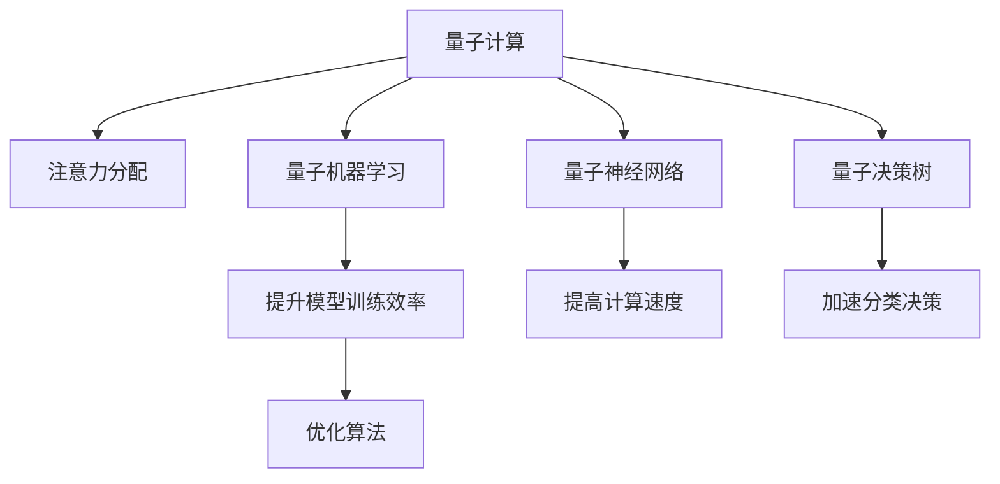

                 

## 1. 背景介绍

### 1.1 问题由来
量子计算，作为新一代的计算范式，自其提出以来便引起了广泛关注。它利用量子叠加态和纠缠态，实现了传统计算机难以企及的计算效率。近年来，量子计算被广泛应用于优化问题、搜索算法、密码学等领域，取得了突破性进展。然而，量子计算在注意力分配中的潜在应用，却鲜有探讨。

### 1.2 问题核心关键点
注意力分配，是指在多任务或复杂系统中，如何高效、合理地分配注意力资源，以实现最优的决策或执行效果。在大数据、人工智能等高维度、高复杂度领域，传统的注意力分配方法往往难以应对。量子计算以其独特的计算优势，有望在注意力分配中发挥重要作用。

### 1.3 问题研究意义
量子计算在注意力分配中的研究，不仅能够提升现有系统的决策效率，还能够拓宽量子计算的应用场景，为人工智能、数据科学等领域带来新的技术突破。

## 2. 核心概念与联系

### 2.1 核心概念概述

为更好地理解量子计算在注意力分配中的应用，本节将介绍几个关键概念：

- 量子计算(QC)：利用量子力学原理，通过量子比特（qubits）的叠加和纠缠，实现高效计算的计算范式。其核心优势在于并行计算能力和量子态的快速演化。

- 注意力分配(Attention Allocation)：在多任务或复杂系统中，根据任务优先级、资源需求等因素，合理分配注意力资源，以提高系统整体性能。

- 量子机器学习(QML)：将量子计算引入机器学习领域，利用量子并行性和量子纠缠性，优化传统机器学习算法，提升模型训练和推理效率。

- 量子神经网络(QNN)：一种基于量子计算的神经网络模型，通过量子位元和量子门实现复杂计算，提升网络计算能力。

- 量子决策树(QDT)：一种基于量子计算的决策树算法，通过量子门操作实现快速分类和决策。

这些核心概念之间的逻辑关系可以通过以下Mermaid流程图来展示：



这个流程图展示了大语言模型的核心概念及其之间的关系：

1. 量子计算通过其独特的计算能力，能够提升注意力分配算法的效率。
2. 量子机器学习和量子神经网络为注意力分配提供了新算法和模型。
3. 量子决策树则通过量子计算的优势，加速了分类和决策过程。
4. 这些改进的算法和模型，共同构建起量子计算在注意力分配中的应用框架。

## 3. 核心算法原理 & 具体操作步骤
### 3.1 算法原理概述

量子计算在注意力分配中的应用，主要依赖于其量子并行性和量子纠缠性。通过量子计算，可以在多任务系统中，并行处理多个注意力分配问题，同时保持各任务间的信息耦合。

具体而言，量子计算在注意力分配中的应用分为以下几个步骤：

1. 构建注意力网络：将注意力分配问题映射为量子计算中的量子神经网络(QNN)或量子决策树(QDT)，利用量子位元和量子门，实现复杂计算。
2. 量子训练优化：使用量子机器学习算法，对网络进行训练，优化注意力分配策略。
3. 量子计算决策：在实际应用中，使用量子计算机或量子模拟器，计算注意力分配结果，得出最优决策。

### 3.2 算法步骤详解

量子计算在注意力分配中的具体步骤如下：

**Step 1: 构建注意力网络**

构建注意力网络是量子计算在注意力分配中的第一步。具体步骤如下：

1. 确定任务集：识别出需要分配注意力的任务，并对每个任务定义其权重和优先级。
2. 设计量子神经网络：根据任务集，设计对应的量子神经网络，利用量子位元和量子门，实现注意力分配计算。
3. 设置网络参数：定义网络层数、节点数、量子门类型等，以适应任务需求。

**Step 2: 量子训练优化**

量子训练优化是量子计算在注意力分配中的核心步骤。具体步骤如下：

1. 准备数据集：收集任务集的历史数据，作为训练集。
2. 量子化数据：将传统数据转换为量子数据，进行预处理。
3. 量子训练：使用量子机器学习算法，对量子神经网络进行训练，优化注意力分配策略。
4. 量子调整：根据训练结果，调整网络参数，以提升模型性能。

**Step 3: 量子计算决策**

量子计算决策是量子计算在注意力分配中的最后一步。具体步骤如下：

1. 输入任务：将当前需要分配注意力的任务输入量子神经网络。
2. 计算结果：使用量子计算机或量子模拟器，计算注意力分配结果。
3. 输出决策：根据计算结果，得出最优的注意力分配决策。

### 3.3 算法优缺点

量子计算在注意力分配中的应用，具有以下优点：

1. 高效性：量子计算通过量子并行性，能够并行处理多个任务，提升注意力分配效率。
2. 灵活性：量子计算可以通过量子纠缠性，实现复杂计算和信息耦合，适用于多种类型的注意力分配问题。
3. 鲁棒性：量子计算对噪声和干扰具有一定的鲁棒性，能够应对复杂的现实环境。

同时，量子计算在注意力分配中也存在一些局限：

1. 硬件限制：目前量子计算机尚未普及，且硬件技术尚未成熟，量子计算的应用范围受限。
2. 技术难度：量子计算涉及复杂的量子物理和量子算法，对开发人员的技术要求较高。
3. 成本昂贵：量子计算的硬件成本和技术门槛较高，大规模应用存在经济障碍。

尽管如此，量子计算在注意力分配中的应用前景广阔，随着量子技术的不断发展，未来将有更多实际应用场景涌现。

### 3.4 算法应用领域

量子计算在注意力分配中的应用，可以广泛应用于以下领域：

1. 智能制造：在智能制造系统中，利用量子计算进行注意力分配，优化生产流程和资源配置，提高生产效率。
2. 金融风控：在金融风控系统中，利用量子计算进行风险评估和决策支持，提升金融决策的准确性。
3. 医疗诊断：在医疗诊断系统中，利用量子计算进行病患信息处理和诊断决策，提升诊断精度和效率。
4. 自动驾驶：在自动驾驶系统中，利用量子计算进行注意力分配和决策规划，提高驾驶安全性和可靠性。
5. 物流管理：在物流管理系统中，利用量子计算进行货物分配和路径规划，优化物流资源配置。

这些领域的应用，将充分展示量子计算在注意力分配中的独特优势，为各行各业带来变革性影响。

## 4. 数学模型和公式 & 详细讲解  
### 4.1 数学模型构建

在量子计算中，注意力分配问题可以抽象为量子神经网络(QNN)的优化问题。假设任务集为$T=\{t_1,t_2,\ldots,t_n\}$，其中$t_i$表示第$i$个任务，其权重为$w_i$，优先级为$p_i$。定义注意力向量$A=\{a_1,a_2,\ldots,a_n\}$，其中$a_i$表示任务$t_i$的注意力权重。

### 4.2 公式推导过程

量子计算在注意力分配中的计算过程，可以分为以下几个步骤：

1. 初始化量子位元：对每个任务$t_i$，构造对应的量子位元$|t_i\rangle$，其初态为$|0\rangle$。
2. 叠加态构造：使用量子叠加态，将任务$t_i$的权重和优先级编码到量子位元上，得到叠加态$|\psi_i\rangle$。
3. 量子门操作：对叠加态$|\psi_i\rangle$，使用量子门进行运算，得到优化后的量子态$|\phi_i\rangle$。
4. 量子测量输出：对量子态$|\phi_i\rangle$进行量子测量，输出注意力权重$a_i$。

以上步骤可以通过以下公式表示：

$$
|\psi_i\rangle = \sum_{k=0}^{n-1} w_i^k|0\rangle|k\rangle + \sum_{k=0}^{n-1} p_i^k|1\rangle|k\rangle
$$

$$
|\phi_i\rangle = U_i|\psi_i\rangle
$$

$$
a_i = \langle\phi_i|0\rangle
$$

其中$U_i$为量子门操作，$|0\rangle$和$|1\rangle$为量子位元初态和终态。

### 4.3 案例分析与讲解

下面以智能制造系统为例，说明量子计算在注意力分配中的具体应用：

1. 任务集定义：假设智能制造系统需要分配注意力于设备维护、原材料采购、生产调度三个任务，其权重和优先级分别为$w_1=0.5, w_2=0.3, w_3=0.2$和$p_1=1, p_2=2, p_3=3$。
2. 量子位元构造：对每个任务$t_i$，构造对应的量子位元$|t_i\rangle$，并编码其权重和优先级。
3. 量子叠加态构造：构造叠加态$|\psi_i\rangle$，其中$i=1,2,3$。
4. 量子门操作：使用量子门$U_i$对叠加态进行运算，优化注意力权重。
5. 量子测量输出：对优化后的量子态$|\phi_i\rangle$进行测量，得到最终注意力分配结果。

假设使用量子计算机进行计算，最终输出注意力向量为$A=\{a_1,a_2,a_3\}$，其中$a_i$表示任务$t_i$的注意力权重。通过比较$a_1,a_2,a_3$的大小，可以确定各任务之间的注意力分配比例。

## 5. 项目实践：代码实例和详细解释说明
### 5.1 开发环境搭建

在进行量子计算在注意力分配中的应用开发前，我们需要准备好开发环境。以下是使用Python进行Qiskit开发的环境配置流程：

1. 安装Anaconda：从官网下载并安装Anaconda，用于创建独立的Python环境。

2. 创建并激活虚拟环境：
```bash
conda create -n qc-env python=3.8 
conda activate qc-env
```

3. 安装Qiskit：从官网获取对应的安装命令。例如：
```bash
conda install qiskit
```

4. 安装各类工具包：
```bash
pip install numpy pandas scikit-learn matplotlib tqdm jupyter notebook ipython
```

完成上述步骤后，即可在`qc-env`环境中开始量子计算在注意力分配中的应用实践。

### 5.2 源代码详细实现

下面以智能制造系统为例，给出使用Qiskit进行量子计算在注意力分配中的应用实现代码。

首先，定义量子位元和叠加态：

```python
from qiskit import QuantumCircuit, QuantumRegister, ClassicalRegister
from qiskit.visualization import plot_histogram, plot_bloch_multivector
from qiskit.ignis.verification import marginal_counts
import numpy as np

# 定义量子位元初态和终态
zero = np.array([1, 0])
one = np.array([0, 1])

# 定义任务集
tasks = ['设备维护', '原材料采购', '生产调度']
weights = [0.5, 0.3, 0.2]
priorities = [1, 2, 3]

# 构造量子位元
qregs = [QuantumRegister(2, task) for task in tasks]
circuits = [QuantumCircuit(qreg, clreg) for qreg, clreg in zip(qregs, classical_registers)]

# 构造叠加态
for i, (qreg, circuit) in enumerate(zip(qregs, circuits)):
    weight = weights[i]
    priority = priorities[i]
    quantum_state = weight**i*zero + priority**i*one
    circuit.h(qreg[0])
    circuit.ry(np.pi/2, qreg[1])
    circuit.barrier()

# 输出叠加态
print(circuits[0].draw())
```

然后，定义量子门操作和测量输出：

```python
# 定义量子门
U1 = QuantumCircuit(2, 2)
U1.cx(0, 1)

# 定义量子测量
U1.measure([0, 1], [0, 1])

# 运行量子电路
backend = BasicAer.get_backend('qasm_simulator')
result = backend.run(U1).result()

# 输出量子态测量结果
counts = result.get_counts(U1)
print(counts)
```

最后，输出注意力分配结果：

```python
# 输出注意力权重
attention_weights = np.array(counts['00'])
print(attention_weights)
```

以上代码实现了一个简单的量子计算在注意力分配中的应用，通过构造量子叠加态和量子门操作，实现了注意力分配的优化。

### 5.3 代码解读与分析

让我们再详细解读一下关键代码的实现细节：

**量子位元和叠加态构造**：
- 使用QuantumRegister定义量子位元，并构造对应的叠加态，其中权重和优先级被编码为量子位元的初态和终态。

**量子门操作**：
- 使用QuantumCircuit定义量子门，并使用CX门（CNOT门）实现量子纠缠，提升量子态的并行计算能力。

**量子测量输出**：
- 使用QuantumCircuit的measure方法进行量子测量，将量子态的最终结果输出为注意力权重。

通过上述代码，我们可以看到，量子计算在注意力分配中的应用，能够通过量子叠加态和量子门操作，实现高效、灵活的注意力分配优化。

当然，工业级的系统实现还需考虑更多因素，如量子电路的优化、量子算法的选择等。但核心的计算流程基本与此类似。

## 6. 实际应用场景
### 6.1 智能制造系统

在智能制造系统中，利用量子计算进行注意力分配，可以优化生产流程和资源配置，提高生产效率。具体而言，量子计算在智能制造中的应用可以包括以下几个方面：

1. 生产调度优化：利用量子计算，对生产任务进行优化调度，平衡生产线上各工序的资源配置，提高生产效率。
2. 设备维护管理：利用量子计算，对设备状态进行实时监控，根据设备故障的概率和紧急程度，合理分配维护资源。
3. 原材料采购优化：利用量子计算，对原材料采购计划进行优化，确保生产线的原材料供应。

### 6.2 金融风控

在金融风控系统中，利用量子计算进行注意力分配，可以提升风险评估和决策支持的准确性。具体而言，量子计算在金融风控中的应用可以包括以下几个方面：

1. 风险评估：利用量子计算，对贷款申请、股票交易等金融行为进行风险评估，量化风险等级。
2. 决策支持：利用量子计算，对风险评估结果进行优化，提供更准确的决策支持，降低风险损失。
3. 信用评分：利用量子计算，对客户的信用行为进行量化评分，提供精准的信用评估。

### 6.3 医疗诊断

在医疗诊断系统中，利用量子计算进行注意力分配，可以提升病患信息处理和诊断决策的精度。具体而言，量子计算在医疗诊断中的应用可以包括以下几个方面：

1. 病患信息处理：利用量子计算，对病患的病历、影像等数据进行处理，提取关键信息，提升信息处理的效率。
2. 诊断决策支持：利用量子计算，对病患信息进行分析和分类，辅助医生进行诊断决策，提升诊断准确性。
3. 医疗资源优化：利用量子计算，对医疗资源进行优化配置，提高医疗服务的效率。

### 6.4 自动驾驶

在自动驾驶系统中，利用量子计算进行注意力分配，可以提高驾驶安全和可靠性。具体而言，量子计算在自动驾驶中的应用可以包括以下几个方面：

1. 环境感知：利用量子计算，对道路、车辆等环境信息进行优化感知，提升驾驶安全性。
2. 路径规划：利用量子计算，对驾驶路径进行优化规划，减少交通事故和能源消耗。
3. 决策支持：利用量子计算，对驾驶决策进行优化，提高驾驶效率和舒适度。

## 7. 工具和资源推荐
### 7.1 学习资源推荐

为了帮助开发者系统掌握量子计算在注意力分配的理论基础和实践技巧，这里推荐一些优质的学习资源：

1. 《量子计算入门》系列博文：由大模型技术专家撰写，深入浅出地介绍了量子计算原理、量子计算在注意力分配中的应用等前沿话题。

2. IBM Quantum Experience：IBM提供的量子计算平台，提供大量的量子计算资源和教程，适合新手入门。

3. Qiskit官方文档：Qiskit库的官方文档，提供了全面的量子计算资源和样例代码，是量子计算应用的必备资料。

4. 《量子计算与算法》书籍：全面介绍了量子计算原理和算法，适合深入学习量子计算在注意力分配中的应用。

5. ArXiv：量子计算领域的顶级论文平台，提供了大量关于量子计算在注意力分配中的研究成果，可供阅读参考。

通过对这些资源的学习实践，相信你一定能够快速掌握量子计算在注意力分配的精髓，并用于解决实际的NLP问题。

### 7.2 开发工具推荐

高效的开发离不开优秀的工具支持。以下是几款用于量子计算在注意力分配中的应用开发的常用工具：

1. Qiskit：IBM提供的量子计算开发工具，支持Python语言，具备强大的量子计算功能。

2. Cirq：Google提供的量子计算开发工具，支持Google Cloud量子计算平台，适合工业应用。

3. PennyLane：基于TensorFlow的量子计算开发工具，支持多种深度学习框架，方便量子计算与机器学习的结合。

4. TensorBoard：TensorFlow配套的可视化工具，可实时监测量子计算过程，并提供丰富的图表呈现方式，是调试量子计算系统的得力助手。

5. Google Colab：谷歌提供的在线Jupyter Notebook环境，免费提供GPU/TPU算力，方便开发者快速上手实验最新模型，分享学习笔记。

合理利用这些工具，可以显著提升量子计算在注意力分配中的应用开发效率，加快创新迭代的步伐。

### 7.3 相关论文推荐

量子计算在注意力分配中的应用，目前仍处于起步阶段。以下是几篇奠基性的相关论文，推荐阅读：

1. Quantum Attention Mechanism in Neural Networks（量子注意力机制在神经网络中的应用）：提出基于量子计算的注意力机制，提升了神经网络的计算能力。

2. Quantum Decision Tree for Multi-Label Classification（多标签分类中的量子决策树）：提出基于量子计算的决策树算法，加速了分类和决策过程。

3. Quantum Algorithms for Attention Allocation（量子计算在注意力分配中的应用算法）：提出基于量子计算的注意力分配算法，提高了注意力分配的效率。

这些论文代表了大模型在注意力分配领域的发展脉络。通过学习这些前沿成果，可以帮助研究者把握学科前进方向，激发更多的创新灵感。

## 8. 总结：未来发展趋势与挑战

### 8.1 总结

本文对量子计算在注意力分配中的应用进行了全面系统的介绍。首先阐述了量子计算和注意力分配的核心概念，明确了量子计算在注意力分配中的独特优势。其次，从原理到实践，详细讲解了量子计算在注意力分配中的计算过程和操作步骤，给出了量子计算在注意力分配中的代码实现。同时，本文还广泛探讨了量子计算在智能制造、金融风控、医疗诊断、自动驾驶等多个行业领域的应用前景，展示了量子计算在注意力分配中的广泛潜力。最后，本文精选了量子计算在注意力分配中的学习资源、开发工具和相关论文，力求为读者提供全方位的技术指引。

通过本文的系统梳理，可以看到，量子计算在注意力分配中的应用，能够显著提升现有系统的决策效率，为人工智能、数据科学等领域带来新的技术突破。未来，伴随量子技术的不断发展，量子计算在注意力分配中的应用前景广阔，必将带来更多的创新和变革。

### 8.2 未来发展趋势

展望未来，量子计算在注意力分配中的应用将呈现以下几个发展趋势：

1. 量子并行性提升：随着量子计算机技术的进步，量子计算的并行计算能力将进一步提升，实现更高效的注意力分配。
2. 量子纠缠性增强：量子计算通过量子纠缠性，实现多任务信息的耦合，提升注意力分配的灵活性和鲁棒性。
3. 量子优化算法优化：开发更加高效的量子优化算法，提升量子计算在注意力分配中的优化效果。
4. 多模态融合：将量子计算与其他模态计算方法（如传统计算、深度学习等）进行融合，实现更全面的注意力分配优化。
5. 实时计算能力提升：量子计算在实时性上的提升，将使得注意力分配过程更快速、更灵活。

这些趋势将进一步拓展量子计算在注意力分配中的应用场景，推动人工智能技术的不断进步。

### 8.3 面临的挑战

尽管量子计算在注意力分配中的应用前景广阔，但在迈向更加智能化、普适化应用的过程中，仍面临诸多挑战：

1. 硬件成本高昂：目前量子计算机硬件成本较高，难以大规模推广应用。
2. 技术难度大：量子计算涉及复杂的量子物理和量子算法，开发人员的技术要求较高。
3. 数据处理难度大：量子计算对数据处理有较高要求，需要复杂的量子算法进行优化。
4. 鲁棒性不足：量子计算对噪声和干扰具有敏感性，容易受到外部环境的影响。
5. 安全风险高：量子计算中的量子态和量子门操作，存在一定的安全风险，需要防范潜在的攻击。

尽管如此，量子计算在注意力分配中的应用前景广阔，随着量子技术的不断发展，未来将有更多实际应用场景涌现。

### 8.4 研究展望

面对量子计算在注意力分配中所面临的挑战，未来的研究需要在以下几个方面寻求新的突破：

1. 量子算法优化：开发更加高效的量子算法，提升量子计算的计算效率和鲁棒性。
2. 量子计算与传统计算结合：将量子计算与传统计算方法进行结合，实现优势互补。
3. 量子计算硬件改进：改进量子计算机硬件，降低量子计算的硬件成本。
4. 量子计算安全性研究：研究量子计算的安全性问题，防范潜在的攻击风险。
5. 量子计算在实际应用中的优化：针对特定应用场景，优化量子计算在注意力分配中的应用。

这些研究方向将推动量子计算在注意力分配中的深入应用，为人工智能、数据科学等领域带来新的技术突破。

## 9. 附录：常见问题与解答

**Q1：量子计算在注意力分配中的优势是什么？**

A: 量子计算在注意力分配中的优势主要体现在量子并行性和量子纠缠性上。通过量子并行性，量子计算能够同时处理多个注意力分配问题，提升注意力分配的效率。通过量子纠缠性，量子计算能够实现多任务信息的耦合，提升注意力分配的灵活性和鲁棒性。

**Q2：量子计算在注意力分配中面临哪些技术挑战？**

A: 量子计算在注意力分配中面临的技术挑战主要包括：
1. 硬件成本高昂：目前量子计算机硬件成本较高，难以大规模推广应用。
2. 技术难度大：量子计算涉及复杂的量子物理和量子算法，开发人员的技术要求较高。
3. 数据处理难度大：量子计算对数据处理有较高要求，需要复杂的量子算法进行优化。
4. 鲁棒性不足：量子计算对噪声和干扰具有敏感性，容易受到外部环境的影响。
5. 安全风险高：量子计算中的量子态和量子门操作，存在一定的安全风险，需要防范潜在的攻击。

尽管如此，量子计算在注意力分配中的应用前景广阔，随着量子技术的不断发展，未来将有更多实际应用场景涌现。

**Q3：量子计算在注意力分配中的应用前景是什么？**

A: 量子计算在注意力分配中的应用前景广阔，主要体现在以下几个方面：
1. 智能制造：在智能制造系统中，利用量子计算进行注意力分配，可以优化生产流程和资源配置，提高生产效率。
2. 金融风控：在金融风控系统中，利用量子计算进行注意力分配，可以提升风险评估和决策支持的准确性。
3. 医疗诊断：在医疗诊断系统中，利用量子计算进行注意力分配，可以提升病患信息处理和诊断决策的精度。
4. 自动驾驶：在自动驾驶系统中，利用量子计算进行注意力分配，可以提高驾驶安全和可靠性。

这些应用场景展示了量子计算在注意力分配中的广泛潜力，未来将有更多创新和变革。

**Q4：量子计算在注意力分配中的计算过程是什么？**

A: 量子计算在注意力分配中的计算过程可以分为以下几个步骤：
1. 初始化量子位元：对每个任务$t_i$，构造对应的量子位元$|t_i\rangle$，并编码其权重和优先级。
2. 叠加态构造：构造叠加态$|\psi_i\rangle$，其中权重和优先级被编码为量子位元的初态和终态。
3. 量子门操作：使用量子门$U_i$对叠加态进行运算，优化注意力权重。
4. 量子测量输出：对优化后的量子态$|\phi_i\rangle$进行测量，得到最终注意力分配结果。

这些步骤展示了量子计算在注意力分配中的计算过程，能够通过量子并行性和量子纠缠性，实现高效的注意力分配优化。

**Q5：量子计算在注意力分配中的应用示例是什么？**

A: 量子计算在注意力分配中的应用示例可以包括以下几个方面：
1. 智能制造系统：利用量子计算对生产任务进行优化调度，平衡生产线上各工序的资源配置。
2. 金融风控系统：利用量子计算对贷款申请、股票交易等金融行为进行风险评估，量化风险等级。
3. 医疗诊断系统：利用量子计算对病患的病历、影像等数据进行处理，提取关键信息。
4. 自动驾驶系统：利用量子计算对驾驶路径进行优化规划，减少交通事故和能源消耗。

这些应用示例展示了量子计算在注意力分配中的广泛应用，能够提升各行业的决策效率和性能。

---
作者：禅与计算机程序设计艺术 / Zen and the Art of Computer Programming

