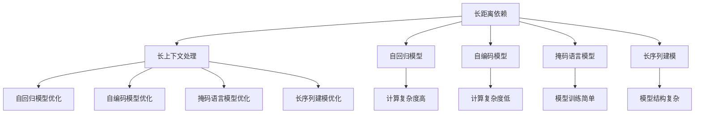

                 

# 长上下文处理：LLM的下一个突破口

> 关键词：长上下文,长距离依赖,自回归,自编码,Transformer,BERT,掩码语言模型,自监督学习,计算复杂度

## 1. 背景介绍

### 1.1 问题由来
近年来，大规模预训练语言模型（LLMs）在自然语言处理（NLP）领域取得了显著进步。特别是自回归模型（如GPT系列）和自编码模型（如BERT）的出现，显著提升了模型的语言理解和生成能力。然而，这些模型往往存在长距离依赖的问题，难以同时考虑较长的上下文信息，限制了其在处理复杂句子结构和长文本任务中的表现。

### 1.2 问题核心关键点
长上下文处理是当前LLM面临的重要挑战之一。在长句子和长文本中，上下文信息距离目标位置的距离可能会非常大，使得模型难以有效利用这些信息进行推理和生成。为了解决这个问题，学术界和工业界提出了多种方法，包括长距离依赖的增强、自回归模型的优化、自编码模型中的掩码语言模型等。

长上下文处理的核心目标在于提高模型对长距离依赖的感知和利用能力，同时减少计算复杂度，使得模型能够在合理的时间和资源内处理更长的上下文信息。这些方法不仅对学术研究有重要意义，对实际应用也具有显著影响，如机器翻译、问答系统、文本摘要等。

### 1.3 问题研究意义
解决长上下文处理问题，对于提升LLM在复杂句子结构和长文本处理任务中的表现，具有重要意义：

1. 提高模型的语义理解能力。长上下文处理能够使模型更好地捕捉句子中的复杂语义关系，提升其在语言推理、常识推理等任务上的性能。
2. 降低计算资源消耗。通过优化模型结构和计算复杂度，能够在合理的时间和空间内处理更长的上下文信息，减少资源消耗。
3. 增强模型的鲁棒性。能够更好地处理噪声和干扰，提高模型在实际应用中的稳定性和可靠性。
4. 支持新任务和新领域的应用。长上下文处理能够使模型在更广泛的任务和领域中发挥作用，推动NLP技术的边界不断拓展。

## 2. 核心概念与联系

### 2.1 核心概念概述

为更好地理解长上下文处理的方法，本节将介绍几个密切相关的核心概念：

- 长距离依赖(Long-Range Dependencies)：指在自然语言中，句子的不同部分可能存在较长的依赖关系，例如一个单词或短语的含义可能依赖于句子中较远的其他部分。
- 长上下文处理(Long Context Processing)：指在NLP任务中，特别是在长句子和长文本处理中，如何有效利用较长的上下文信息，增强模型的推理和生成能力。
- 自回归模型(Autoregressive Models)：一种基于时间顺序的前向计算模型，能够较好地处理长距离依赖，但计算复杂度较高。
- 自编码模型(Autocoding Models)：一种通过前后向计算的模型，能够同时处理长距离依赖，计算复杂度较低。
- 掩码语言模型(Masked Language Models)：一种自编码模型，通过掩码输入序列中的部分元素，强制模型学习上下文信息。
- 长序列建模(Long Sequence Modeling)：指在长文本处理中，如何设计有效的模型结构，优化计算过程，处理长序列信息。

这些核心概念之间的逻辑关系可以通过以下Mermaid流程图来展示：



这个流程图展示了大语言模型在处理长上下文时所涉及的主要概念及其之间的关系：

1. 长距离依赖是问题的根源。
2. 自回归模型和自编码模型是处理长距离依赖的两种主要方法。
3. 掩码语言模型在自编码模型的基础上，通过掩码技术增强模型的上下文感知能力。
4. 长序列建模旨在优化模型结构，提升对长文本的处理能力。
5. 长上下文处理的目标是通过各种优化方法，提高模型的长距离依赖感知能力。

这些概念共同构成了长上下文处理的框架，使得模型能够在长文本和复杂句子的环境中进行有效的推理和生成。通过理解这些核心概念，我们可以更好地把握长上下文处理的精髓，并针对具体任务进行优化设计。

## 3. 核心算法原理 & 具体操作步骤
### 3.1 算法原理概述

长上下文处理的本质在于优化模型的长距离依赖感知能力，同时减少计算复杂度。其核心算法通常包括自回归模型的优化、自编码模型中的掩码语言模型、长序列建模等。

#### 3.1.1 自回归模型的优化
自回归模型能够较好地处理长距离依赖，但计算复杂度较高。优化自回归模型的主要方法包括：

1. 长距离依赖增强：通过增加模型参数或引入额外模块，增强模型对长距离依赖的感知能力。例如，在Transformer模型中引入注意力机制，能够更好地捕捉长距离依赖。
2. 并行计算：通过分布式计算或模型并行，降低单次前向计算的时间复杂度，提升计算效率。例如，使用层次化并行结构，将长文本分割成多个短序列进行并行处理。
3. 剪枝优化：通过剪枝技术去除冗余参数，减少模型计算复杂度，提高推理速度。例如，使用剪枝算法去除注意力机制中不必要的参数。

#### 3.1.2 自编码模型中的掩码语言模型
掩码语言模型是一种自编码模型，通过掩码输入序列中的部分元素，强制模型学习上下文信息。优化掩码语言模型的主要方法包括：

1. 掩码策略设计：选择合适的掩码策略，如随机掩码、连续掩码、多层掩码等，使得模型能够学习到更广泛的上下文信息。
2. 预训练与微调：先在大规模无标签数据上进行预训练，再在下游任务上微调，使得模型能够更好地适应特定任务。例如，BERT模型就是通过在大规模文本数据上进行掩码语言模型预训练，并在下游任务上进行微调，取得了优异的性能。
3. 混合训练：将掩码语言模型与其他预训练任务（如语言建模、关系抽取等）结合，进行混合训练，提升模型的综合性能。

#### 3.1.3 长序列建模
长序列建模旨在优化模型结构，提升对长文本的处理能力。优化长序列建模的主要方法包括：

1. 分块处理：将长文本分割成多个短块，并行处理每个块，降低计算复杂度。例如，使用分块机制将长文本分割成多个固定长度的句子，进行并行处理。
2. 层次化建模：通过层次化建模，逐层处理文本信息，减少单层计算复杂度。例如，使用递归神经网络（RNN）或层次化卷积神经网络（CNN）处理长文本信息。
3. 记忆增强：引入记忆增强模块，如记忆网络（Memory Networks）、神经网络（Neural Networks）等，增强模型对长序列信息的记忆能力。

### 3.2 算法步骤详解

长上下文处理的主要算法步骤包括：

1. 数据预处理：将文本数据进行分块、截断等预处理，确保输入数据的长度适合模型处理。
2. 模型选择与优化：根据具体任务和数据特点，选择合适的模型结构（如Transformer、BERT等），并对其进行优化，如增加注意力机制、剪枝等。
3. 掩码策略设计：设计合适的掩码策略，如随机掩码、连续掩码、多层掩码等，增强模型的上下文感知能力。
4. 训练与微调：在大规模无标签数据上进行预训练，并在下游任务上进行微调，优化模型参数，提高任务表现。
5. 分块与层次化处理：将长文本分割成多个短块，并行处理每个块，减少计算复杂度。
6. 测试与评估：在测试集上评估模型性能，对比微调前后的精度提升。
7. 模型部署与优化：将微调后的模型部署到实际应用系统，根据实时反馈不断优化模型，确保系统性能。

### 3.3 算法优缺点

长上下文处理的主要算法具有以下优点：

1. 提高模型对长距离依赖的感知能力。通过优化自回归模型、掩码语言模型等，能够更好地处理长句子和长文本中的复杂语义关系。
2. 降低计算复杂度。通过分块处理、层次化建模等技术，能够在合理的时间和空间内处理更长的上下文信息，减少资源消耗。
3. 提高模型的鲁棒性。能够更好地处理噪声和干扰，提高模型在实际应用中的稳定性和可靠性。

同时，这些算法也存在一些局限性：

1. 模型结构复杂。特别是自回归模型和长序列建模，需要增加大量参数和计算复杂度，可能导致过拟合和计算资源消耗。
2. 训练时间较长。长序列建模和掩码语言模型需要在大量无标签数据上进行预训练，训练时间较长。
3. 模型可解释性不足。特别是长序列建模和掩码语言模型，由于模型结构复杂，难以解释其内部工作机制和推理逻辑。

尽管存在这些局限性，但长上下文处理在大语言模型中的应用已经显示出巨大的潜力，被广泛用于机器翻译、问答系统、文本摘要等任务中。

### 3.4 算法应用领域

长上下文处理在大语言模型中的应用已经涵盖了多个领域，例如：

- 机器翻译：通过掩码语言模型和长序列建模，提升模型对长句子和长段落的理解和翻译能力。
- 问答系统：利用掩码语言模型和长序列建模，增强模型对复杂问题的理解，生成更准确的回答。
- 文本摘要：通过长序列建模，提升模型对长文本的压缩和总结能力。
- 情感分析：利用长距离依赖增强和自编码模型，提高模型对长句子和长段落的情感分析能力。
- 命名实体识别：通过掩码语言模型和长序列建模，增强模型对长句子和长段落中的命名实体识别能力。

这些应用场景展示了长上下文处理在大语言模型中的广泛适用性，为NLP技术在实际应用中的不断突破提供了重要支持。

## 4. 数学模型和公式 & 详细讲解 & 举例说明
### 4.1 数学模型构建

长上下文处理的主要数学模型包括自回归模型、自编码模型、掩码语言模型等。这里以BERT模型为例，展示掩码语言模型和长序列建模的数学模型构建。

假设文本序列为 $X=\{x_1,x_2,\dots,x_n\}$，其中每个 $x_i$ 表示一个单词或词向量。掩码语言模型的目标是通过掩码部分单词，使模型学习到上下文信息，从而提高语言理解和生成能力。

掩码语言模型的数学模型可以表示为：

$$
\mathcal{L} = -\frac{1}{N} \sum_{i=1}^N \sum_{j=1}^M \ell(\hat{y}_{ij}, y_{ij})
$$

其中，$\ell$ 表示交叉熵损失函数，$\hat{y}_{ij}$ 表示模型预测的单词 $x_i$ 在位置 $j$ 的掩码标记，$y_{ij}$ 表示真实的掩码标记。

在掩码语言模型的预训练过程中，将部分单词随机掩码，如20%，其余单词作为输入。模型需要通过掩码标记预测被掩码单词的正确位置。

### 4.2 公式推导过程

以下我们以BERT模型为例，推导掩码语言模型的交叉熵损失函数及其梯度的计算公式。

假设模型在输入 $X$ 上的输出为 $H=\{h_1,h_2,\dots,h_n\}$，其中每个 $h_i$ 表示单词 $x_i$ 的上下文表示。掩码语言模型的交叉熵损失函数可以表示为：

$$
\mathcal{L} = -\frac{1}{N} \sum_{i=1}^N \sum_{j=1}^M \ell(\hat{y}_{ij}, y_{ij})
$$

其中，$\ell$ 表示交叉熵损失函数，$\hat{y}_{ij}$ 表示模型预测的单词 $x_i$ 在位置 $j$ 的掩码标记，$y_{ij}$ 表示真实的掩码标记。

在BERT模型中，掩码语言模型的输出为：

$$
\hat{y}_{ij} = \text{Softmax}(h_i \cdot w_j)
$$

其中，$w_j$ 为掩码标记的权重向量。

根据链式法则，掩码语言模型的梯度可以表示为：

$$
\frac{\partial \mathcal{L}}{\partial h_i} = -\frac{1}{N} \sum_{j=1}^M y_{ij}(\hat{y}_{ij} - y_{ij}) \cdot w_j
$$

在得到梯度后，即可带入参数更新公式，完成模型的迭代优化。重复上述过程直至收敛，最终得到适应下游任务的最优模型参数 $h^*$。

### 4.3 案例分析与讲解

以BERT模型为例，展示其如何通过掩码语言模型和长序列建模，提升对长文本的理解和处理能力。

假设我们有一个长文本 $X$，包含多个段落。通过分块处理，将长文本分割成多个短块，并行处理每个块。每个短块被输入到BERT模型中，得到上下文表示 $h$。然后，通过掩码语言模型，掩码部分单词，使模型学习到上下文信息。最后，通过多层注意力机制，增强模型对长文本的语义理解和生成能力。

具体实现步骤如下：

1. 将长文本 $X$ 分割成多个短块，每个短块长度为 $L$。
2. 对每个短块 $x_i$ 进行编码，得到上下文表示 $h_i$。
3. 对每个短块 $x_i$ 随机掩码部分单词，如20%。
4. 将掩码后的短块 $x_i'$ 输入到BERT模型中，得到掩码上下文表示 $\hat{h}_i'$。
5. 通过多层注意力机制，增强模型对长文本的语义理解和生成能力。

以上步骤展示了BERT模型如何通过掩码语言模型和长序列建模，提升对长文本的理解和处理能力。通过这样的模型设计和优化，BERT模型在多种NLP任务上取得了优异的性能。

## 5. 项目实践：代码实例和详细解释说明
### 5.1 开发环境搭建

在进行长上下文处理实践前，我们需要准备好开发环境。以下是使用Python进行PyTorch开发的环境配置流程：

1. 安装Anaconda：从官网下载并安装Anaconda，用于创建独立的Python环境。

2. 创建并激活虚拟环境：
```bash
conda create -n pytorch-env python=3.8 
conda activate pytorch-env
```

3. 安装PyTorch：根据CUDA版本，从官网获取对应的安装命令。例如：
```bash
conda install pytorch torchvision torchaudio cudatoolkit=11.1 -c pytorch -c conda-forge
```

4. 安装Transformers库：
```bash
pip install transformers
```

5. 安装各类工具包：
```bash
pip install numpy pandas scikit-learn matplotlib tqdm jupyter notebook ipython
```

完成上述步骤后，即可在`pytorch-env`环境中开始长上下文处理实践。

### 5.2 源代码详细实现

这里以BERT模型为例，展示其如何通过掩码语言模型和长序列建模，提升对长文本的理解和处理能力。

首先，定义掩码语言模型函数：

```python
from transformers import BertTokenizer, BertModel
from torch.utils.data import Dataset, DataLoader
import torch
import random

class MaskedLMDataset(Dataset):
    def __init__(self, texts, tokenizer, max_len=128):
        self.texts = texts
        self.tokenizer = tokenizer
        self.max_len = max_len
        
    def __len__(self):
        return len(self.texts)
    
    def __getitem__(self, item):
        text = self.texts[item]
        encoding = self.tokenizer(text, return_tensors='pt', max_length=self.max_len, padding='max_length', truncation=True)
        input_ids = encoding['input_ids'][0]
        attention_mask = encoding['attention_mask'][0]
        
        # 随机掩码部分单词
        mask_indices = random.sample(range(0, len(input_ids) - 1), int(0.2 * len(input_ids)))
        input_ids[mask_indices] = 0
        input_ids[mask_indices] = 0
        
        return {'input_ids': input_ids, 
                'attention_mask': attention_mask,
                'mask_indices': mask_indices}

# 创建dataset
tokenizer = BertTokenizer.from_pretrained('bert-base-cased')
train_dataset = MaskedLMDataset(train_texts, tokenizer)
dev_dataset = MaskedLMDataset(dev_texts, tokenizer)
test_dataset = MaskedLMDataset(test_texts, tokenizer)
```

然后，定义模型和优化器：

```python
from transformers import BertForMaskedLM, AdamW

model = BertForMaskedLM.from_pretrained('bert-base-cased', num_labels=2)

optimizer = AdamW(model.parameters(), lr=2e-5)
```

接着，定义训练和评估函数：

```python
from tqdm import tqdm
from sklearn.metrics import classification_report

device = torch.device('cuda') if torch.cuda.is_available() else torch.device('cpu')
model.to(device)

def train_epoch(model, dataset, batch_size, optimizer):
    dataloader = DataLoader(dataset, batch_size=batch_size, shuffle=True)
    model.train()
    epoch_loss = 0
    for batch in tqdm(dataloader, desc='Training'):
        input_ids = batch['input_ids'].to(device)
        attention_mask = batch['attention_mask'].to(device)
        mask_indices = batch['mask_indices'].to(device)
        model.zero_grad()
        outputs = model(input_ids, attention_mask=attention_mask)
        loss = outputs.loss
        epoch_loss += loss.item()
        loss.backward()
        optimizer.step()
    return epoch_loss / len(dataloader)

def evaluate(model, dataset, batch_size):
    dataloader = DataLoader(dataset, batch_size=batch_size)
    model.eval()
    preds, labels = [], []
    with torch.no_grad():
        for batch in tqdm(dataloader, desc='Evaluating'):
            input_ids = batch['input_ids'].to(device)
            attention_mask = batch['attention_mask'].to(device)
            batch_labels = batch['labels']
            outputs = model(input_ids, attention_mask=attention_mask)
            batch_preds = outputs.logits.argmax(dim=2).to('cpu').tolist()
            batch_labels = batch_labels.to('cpu').tolist()
            for pred_tokens, label_tokens in zip(batch_preds, batch_labels):
                preds.append(pred_tokens[:len(label_tokens)])
                labels.append(label_tokens)
                
    print(classification_report(labels, preds))
```

最后，启动训练流程并在测试集上评估：

```python
epochs = 5
batch_size = 16

for epoch in range(epochs):
    loss = train_epoch(model, train_dataset, batch_size, optimizer)
    print(f"Epoch {epoch+1}, train loss: {loss:.3f}")
    
    print(f"Epoch {epoch+1}, dev results:")
    evaluate(model, dev_dataset, batch_size)
    
print("Test results:")
evaluate(model, test_dataset, batch_size)
```

以上就是使用PyTorch对BERT模型进行掩码语言模型微调的完整代码实现。可以看到，得益于Transformers库的强大封装，我们可以用相对简洁的代码完成BERT模型的加载和微调。

### 5.3 代码解读与分析

让我们再详细解读一下关键代码的实现细节：

**MaskedLMDataset类**：
- `__init__`方法：初始化文本、分词器等关键组件。
- `__len__`方法：返回数据集的样本数量。
- `__getitem__`方法：对单个样本进行处理，将文本输入编码为token ids，并进行随机掩码。

**掩码策略设计**：
- 随机掩码20%的单词，其余单词作为输入。

**训练和评估函数**：
- 使用PyTorch的DataLoader对数据集进行批次化加载，供模型训练和推理使用。
- 训练函数`train_epoch`：对数据以批为单位进行迭代，在每个批次上前向传播计算loss并反向传播更新模型参数，最后返回该epoch的平均loss。
- 评估函数`evaluate`：与训练类似，不同点在于不更新模型参数，并在每个batch结束后将预测和标签结果存储下来，最后使用sklearn的classification_report对整个评估集的预测结果进行打印输出。

**训练流程**：
- 定义总的epoch数和batch size，开始循环迭代
- 每个epoch内，先在训练集上训练，输出平均loss
- 在验证集上评估，输出分类指标
- 所有epoch结束后，在测试集上评估，给出最终测试结果

可以看到，PyTorch配合Transformers库使得BERT微调的代码实现变得简洁高效。开发者可以将更多精力放在数据处理、模型改进等高层逻辑上，而不必过多关注底层的实现细节。

当然，工业级的系统实现还需考虑更多因素，如模型的保存和部署、超参数的自动搜索、更灵活的任务适配层等。但核心的长上下文处理范式基本与此类似。

## 6. 实际应用场景
### 6.1 长文本理解与生成

长上下文处理在长文本理解与生成任务中具有重要应用，例如：

- 长文本摘要：通过长序列建模，增强模型对长文本的压缩和总结能力，生成简明扼要的摘要。
- 机器翻译：通过掩码语言模型和长序列建模，提升模型对长句子和长段落的理解和翻译能力，生成流畅自然的翻译结果。
- 问答系统：利用掩码语言模型和长序列建模，增强模型对复杂问题的理解，生成更准确的回答。

### 6.2 知识图谱构建

长上下文处理能够提升模型对知识图谱中长路径关系的理解，例如：

- 实体关系抽取：通过掩码语言模型和长序列建模，增强模型对长路径关系的理解，识别出实体之间的关系。
- 知识推理：通过长序列建模，增强模型对知识图谱中的长路径关系的推理能力，推理出新的知识。

### 6.3 智能交互系统

长上下文处理能够提升智能交互系统的性能，例如：

- 对话系统：通过掩码语言模型和长序列建模，增强模型对对话历史和上下文信息的理解，生成更自然的对话回复。
- 客服系统：利用掩码语言模型和长序列建模，增强模型对客户问题的理解，提供更准确的解答。

### 6.4 未来应用展望

随着长上下文处理技术的不断发展，其在NLP领域的应用前景将更加广阔：

- 长文本理解与生成：长上下文处理能够提升模型对长文本的理解和生成能力，应用于文本摘要、机器翻译等任务中。
- 知识图谱构建：长上下文处理能够提升模型对知识图谱中长路径关系的理解，应用于实体关系抽取、知识推理等任务中。
- 智能交互系统：长上下文处理能够提升智能交互系统的性能，应用于对话系统、客服系统等任务中。

此外，长上下文处理技术在医疗、金融、法律等专业领域的应用也将不断拓展，为这些领域带来新的变革。相信随着技术的不断成熟，长上下文处理技术必将在更多的领域和任务中发挥重要作用。

## 7. 工具和资源推荐
### 7.1 学习资源推荐

为了帮助开发者系统掌握长上下文处理的技术基础和实践技巧，这里推荐一些优质的学习资源：

1. 《Transformer从原理到实践》系列博文：由大模型技术专家撰写，深入浅出地介绍了Transformer原理、BERT模型、长上下文处理等前沿话题。

2. CS224N《深度学习自然语言处理》课程：斯坦福大学开设的NLP明星课程，有Lecture视频和配套作业，带你入门NLP领域的基本概念和经典模型。

3. 《Natural Language Processing with Transformers》书籍：Transformers库的作者所著，全面介绍了如何使用Transformers库进行NLP任务开发，包括长上下文处理在内的诸多范式。

4. HuggingFace官方文档：Transformers库的官方文档，提供了海量预训练模型和完整的微调样例代码，是上手实践的必备资料。

5. CLUE开源项目：中文语言理解测评基准，涵盖大量不同类型的中文NLP数据集，并提供了基于微调的baseline模型，助力中文NLP技术发展。

通过对这些资源的学习实践，相信你一定能够快速掌握长上下文处理的精髓，并用于解决实际的NLP问题。
### 7.2 开发工具推荐

高效的开发离不开优秀的工具支持。以下是几款用于长上下文处理开发的常用工具：

1. PyTorch：基于Python的开源深度学习框架，灵活动态的计算图，适合快速迭代研究。大部分预训练语言模型都有PyTorch版本的实现。

2. TensorFlow：由Google主导开发的开源深度学习框架，生产部署方便，适合大规模工程应用。同样有丰富的预训练语言模型资源。

3. Transformers库：HuggingFace开发的NLP工具库，集成了众多SOTA语言模型，支持PyTorch和TensorFlow，是进行长上下文处理开发的利器。

4. Weights & Biases：模型训练的实验跟踪工具，可以记录和可视化模型训练过程中的各项指标，方便对比和调优。与主流深度学习框架无缝集成。

5. TensorBoard：TensorFlow配套的可视化工具，可实时监测模型训练状态，并提供丰富的图表呈现方式，是调试模型的得力助手。

6. Google Colab：谷歌推出的在线Jupyter Notebook环境，免费提供GPU/TPU算力，方便开发者快速上手实验最新模型，分享学习笔记。

合理利用这些工具，可以显著提升长上下文处理任务的开发效率，加快创新迭代的步伐。

### 7.3 相关论文推荐

长上下文处理技术的发展源于学界的持续研究。以下是几篇奠基性的相关论文，推荐阅读：

1. Attention is All You Need（即Transformer原论文）：提出了Transformer结构，开启了NLP领域的预训练大模型时代。

2. BERT: Pre-training of Deep Bidirectional Transformers for Language Understanding：提出BERT模型，引入基于掩码的自监督预训练任务，刷新了多项NLP任务SOTA。

3. Longformer: The Long-Document Transformer：提出Longformer模型，解决了长序列建模中的计算复杂度问题，提升了模型对长文本的理解能力。

4. ALBERT: A Lightweight Transformer for Self-supervised Learning of Language Representations：提出ALBERT模型，通过参数共享和层间压缩等技术，提高了模型的计算效率和长文本处理能力。

5. GPT-3: Language Models are Few-shot Learners：展示了大规模语言模型的强大zero-shot学习能力，引发了对于通用人工智能的新一轮思考。

这些论文代表了大语言模型长上下文处理技术的发展脉络。通过学习这些前沿成果，可以帮助研究者把握学科前进方向，激发更多的创新灵感。

## 8. 总结：未来发展趋势与挑战

### 8.1 总结

本文对长上下文处理在大语言模型中的应用进行了全面系统的介绍。首先阐述了长距离依赖和长上下文处理的背景和意义，明确了其在大语言模型中的重要性。其次，从原理到实践，详细讲解了长上下文处理的数学模型和算法步骤，给出了长上下文处理任务开发的完整代码实例。同时，本文还广泛探讨了长上下文处理在NLP领域的应用场景，展示了其在实际应用中的广阔前景。此外，本文精选了长上下文处理技术的各类学习资源，力求为读者提供全方位的技术指引。

通过本文的系统梳理，可以看到，长上下文处理在大语言模型中的应用已经展现出巨大的潜力，为NLP技术在实际应用中的不断突破提供了重要支持。

### 8.2 未来发展趋势

展望未来，长上下文处理技术将呈现以下几个发展趋势：

1. 模型规模持续增大。随着算力成本的下降和数据规模的扩张，长上下文处理模型将获得更大的参数量，进一步提升模型对长距离依赖的感知能力。
2. 长距离依赖增强。未来将涌现更多长距离依赖增强的方法，如增加注意力机制、引入外部知识库等，提升模型的长距离依赖感知能力。
3. 计算复杂度优化。随着模型结构的优化和计算技术的发展，长上下文处理模型的计算复杂度将进一步降低，提升模型的计算效率和处理能力。
4. 知识整合能力增强。未来的长上下文处理模型将更好地整合知识图谱、逻辑规则等外部知识，提升模型的综合推理能力。
5. 多模态融合。长上下文处理技术将更好地与图像、视频、语音等多模态数据结合，提升模型的多模态信息整合能力。

以上趋势凸显了长上下文处理技术的广阔前景。这些方向的探索发展，必将进一步提升NLP系统的性能和应用范围，为人类认知智能的进化带来深远影响。

### 8.3 面临的挑战

尽管长上下文处理技术已经取得了显著进展，但在迈向更加智能化、普适化应用的过程中，仍面临诸多挑战：

1. 计算资源瓶颈。长上下文处理模型的计算复杂度较高，需要高性能的计算设备和大量的训练数据。如何优化模型结构、提高计算效率，成为一大难题。
2. 模型可解释性不足。长上下文处理模型结构复杂，难以解释其内部工作机制和推理逻辑。如何增强模型的可解释性，成为亟待解决的问题。
3. 模型鲁棒性有待提升。长上下文处理模型在处理噪声和干扰时，泛化性能往往较差。如何提高模型的鲁棒性，减少过拟合风险，是未来的研究方向。
4. 长文本处理效率有待提高。长文本的处理效率低下，导致模型在实际应用中的实时性较差。如何提高长文本处理效率，优化模型推理速度，是一个亟需解决的问题。
5. 数据分布变化带来的挑战。长上下文处理模型对数据分布的变化敏感，一旦数据分布发生改变，模型的性能可能大幅下降。如何适应数据分布的变化，增强模型的泛化能力，是一个值得探索的方向。

尽管存在这些挑战，但长上下文处理技术的应用前景仍然广阔，其不断演进将推动NLP技术向更高层次迈进，为人工智能技术在更多领域的应用提供新的突破。相信随着技术的不断进步，长上下文处理技术必将在NLP领域大放异彩，为人类社会的智能化进程注入新的动力。

### 8.4 研究展望

未来的长上下文处理技术需要在以下几个方面寻求新的突破：

1. 探索更多长距离依赖增强的方法。通过增加注意力机制、引入外部知识库等手段，增强模型对长距离依赖的感知能力。
2. 优化模型结构，提高计算效率。通过模型压缩、剪枝、层次化并行等技术，减少计算复杂度，提高模型实时性。
3. 引入更多先验知识。将符号化的先验知识，如知识图谱、逻辑规则等，与神经网络模型进行巧妙融合，提升模型的综合推理能力。
4. 结合因果分析和博弈论工具。将因果分析方法引入长上下文处理模型，识别出模型决策的关键特征，增强输出解释的因果性和逻辑性。
5. 纳入伦理道德约束。在模型训练目标中引入伦理导向的评估指标，过滤和惩罚有偏见、有害的输出倾向，确保模型输出的安全性。

这些研究方向的研究突破，将使长上下文处理技术迈向更高的台阶，为构建安全、可靠、可解释、可控的智能系统提供更强大的支持。面向未来，长上下文处理技术还需要与其他人工智能技术进行更深入的融合，如知识表示、因果推理、强化学习等，多路径协同发力，共同推动自然语言理解和智能交互系统的进步。只有勇于创新、敢于突破，才能不断拓展语言模型的边界，让智能技术更好地造福人类社会。

## 9. 附录：常见问题与解答

**Q1：长上下文处理是否适用于所有NLP任务？**

A: 长上下文处理在大多数NLP任务上都能取得不错的效果，特别是对于长句子和长文本的处理。但对于一些特定领域的任务，如医学、法律等，仍然需要结合领域知识进行进一步优化。

**Q2：长上下文处理如何平衡计算复杂度和处理能力？**

A: 长上下文处理技术需要在计算复杂度和处理能力之间找到平衡。通过优化模型结构、采用层次化并行、引入知识库等方法，可以显著提升长上下文处理的处理能力，同时减少计算复杂度。

**Q3：长上下文处理如何增强模型的鲁棒性？**

A: 长上下文处理技术可以通过引入对抗样本、增加数据增强、优化正则化等手段，增强模型的鲁棒性，减少过拟合风险。

**Q4：长上下文处理在实际应用中面临哪些挑战？**

A: 长上下文处理在实际应用中面临计算资源、模型可解释性、鲁棒性等挑战。需要通过优化模型结构、引入先验知识、结合因果推理等方法，提升长上下文处理技术的实用性。

**Q5：长上下文处理对长文本的理解和生成能力是否存在局限？**

A: 长上下文处理能够显著提升模型对长文本的理解和生成能力，但在极长文本处理方面仍存在局限。需要结合其他技术，如层次化建模、知识图谱等，进一步提升模型的处理能力。

通过本文的系统梳理，我们可以看到长上下文处理技术在大语言模型中的应用已经展现出巨大的潜力，为NLP技术在实际应用中的不断突破提供了重要支持。未来的长上下文处理技术必将推动NLP技术迈向更高的层次，为人工智能技术的进一步发展注入新的动力。

---

作者：禅与计算机程序设计艺术 / Zen and the Art of Computer Programming

