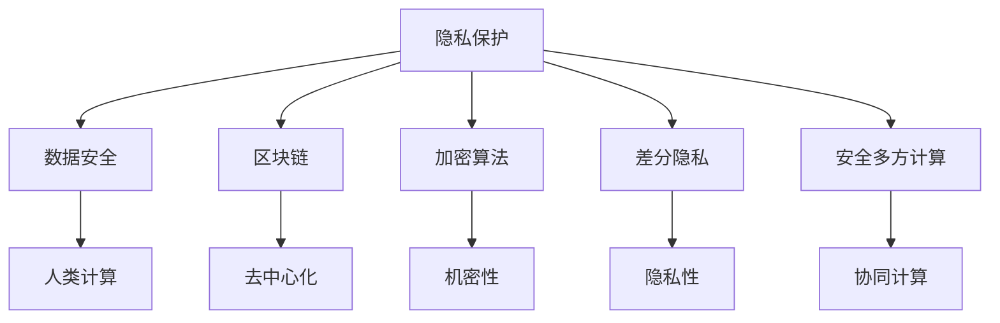
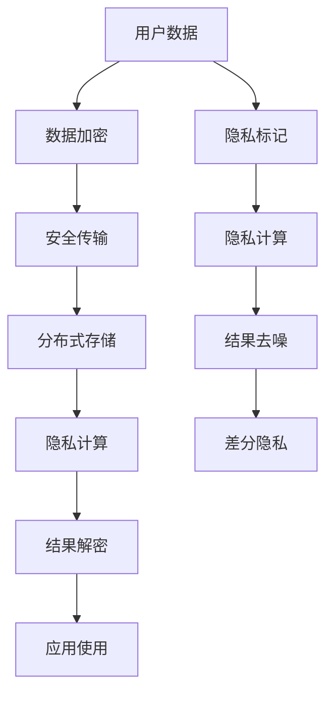

                 

# 隐私与安全：人类计算中的关键问题

> 关键词：隐私保护, 数据安全, 人类计算, 区块链, 加密算法, 差分隐私, 安全多方计算

## 1. 背景介绍

在数字化快速发展的今天，数据和计算能力已经成为了驱动社会进步和创新的关键资源。然而，随着大数据时代的来临，隐私与安全问题也日益凸显。如何在大规模数据处理与计算过程中保护用户的隐私，保障数据安全，已经成为计算科学领域亟待解决的关键问题。

隐私与安全问题不仅涉及个人隐私保护，更关系到公共安全和国家安全。在各类应用场景中，包括在线交易、云计算、人工智能、物联网等，数据泄露、数据篡改、攻击入侵等问题层出不穷。因此，隐私与安全技术的研发与应用，已经成为确保数字经济健康发展的重要基础。

## 2. 核心概念与联系

### 2.1 核心概念概述

为了更深入地理解隐私与安全问题，本节将介绍几个关键概念及其相互之间的联系：

- **隐私保护**：保护个人或企业数据不被未经授权访问，包括数据加密、匿名化、差分隐私等技术手段。
- **数据安全**：确保数据在存储、传输和处理过程中不被非法访问、篡改或破坏。
- **人类计算**：利用人类智慧而非机器智能进行复杂任务处理，如计算、推理、决策等。
- **区块链**：一种分布式数据库技术，通过去中心化、不可篡改和可追溯的特点保障数据安全。
- **加密算法**：包括对称加密、非对称加密、哈希函数等，用于保障数据传输和存储的安全性。
- **差分隐私**：通过加入噪声保护个人隐私，使攻击者无法从数据中推测出个人隐私信息。
- **安全多方计算**：允许多个参与者在不共享明文数据的情况下，共同计算一个函数。

这些概念之间的联系通过以下Mermaid流程图展示：



### 2.2 核心概念原理和架构的 Mermaid 流程图

由于篇幅限制，无法直接展示完整的Mermaid流程图，但可以通过以下简化的流程图展示隐私与安全问题的主要技术架构：



这个流程图示意了隐私保护的各个阶段：用户数据首先经过加密处理，然后通过安全方式传输到分布式存储系统，在那里进行隐私计算。结果经过解密后，才能用于应用使用。隐私标记在隐私计算过程中也起到了重要作用。

## 3. 核心算法原理 & 具体操作步骤

### 3.1 算法原理概述

隐私与安全问题涉及众多算法和技术，但本质上都是围绕如何保护数据机密性和隐私性进行设计的。本文将重点介绍几种核心算法及其原理：

- **对称加密**：使用相同的密钥加密和解密数据，速度快，但密钥分发和管理复杂。
- **非对称加密**：使用公钥加密数据，私钥解密，安全性高，但计算复杂度较高。
- **差分隐私**：通过加入随机噪声，保护个体隐私，使攻击者无法通过单个样本推断出全局信息。
- **安全多方计算**：允许多方在不共享明文数据的情况下，共同计算一个函数，保障数据隐私。

### 3.2 算法步骤详解

以下将详细介绍每种核心算法的详细步骤：

**对称加密算法**：

1. **密钥生成**：随机生成一个对称密钥。
2. **数据加密**：将明文数据和密钥一起输入加密算法，生成密文。
3. **数据解密**：将密文和密钥一起输入解密算法，恢复明文数据。

**非对称加密算法**：

1. **密钥生成**：生成一对公钥和私钥。
2. **数据加密**：使用公钥加密数据，生成密文。
3. **数据解密**：使用私钥解密数据，恢复明文。

**差分隐私算法**：

1. **数据预处理**：对数据进行标准化处理。
2. **加入噪声**：随机加入噪声，保护个体隐私。
3. **计算统计量**：计算敏感统计量，得到带噪声的结果。

**安全多方计算算法**：

1. **函数分割**：将计算任务分割为多个子任务。
2. **协议设计**：设计安全协议，确保每个参与者只计算自己的子任务。
3. **结果合并**：将每个参与者的结果合并，得到最终结果。

### 3.3 算法优缺点

每种算法都有其特定的优点和局限性：

- **对称加密**：速度快，但密钥分发和管理复杂。
- **非对称加密**：安全性高，但计算复杂度较高。
- **差分隐私**：保护个体隐私，但可能引入一定的数据失真。
- **安全多方计算**：保护数据隐私，但需要设计复杂的协议，计算复杂度较高。

### 3.4 算法应用领域

这些核心算法在多个领域都有广泛的应用：

- **金融行业**：在金融交易、信用评估等场景中，利用对称和非对称加密保障数据安全，防止数据泄露和篡改。
- **医疗行业**：在患者数据保护、医疗记录共享等方面，利用差分隐私技术保护个体隐私，同时保障数据的安全性。
- **政府部门**：在公共安全、情报分析等场景中，利用安全多方计算技术，在不共享明文数据的情况下，协同计算敏感信息，保护数据隐私。

## 4. 数学模型和公式 & 详细讲解 & 举例说明

### 4.1 数学模型构建

本节将使用数学语言对隐私与安全问题的核心算法进行更加严格的描述。

- **对称加密模型**：假设有一个明文 $m$ 和一个对称密钥 $k$，对称加密模型为：
  $$
  c = E_k(m)
  $$
  其中 $E_k$ 表示对称加密算法，$c$ 表示密文。

- **非对称加密模型**：假设有一个明文 $m$ 和一对公钥 $(e,n)$、私钥 $(d,n)$，非对称加密模型为：
  $$
  c = E_{(e,n)}(m)
  $$
  $$
  m' = D_{(d,n)}(c)
  $$
  其中 $D_{(d,n)}$ 表示非对称解密算法，$m'$ 表示解密后的明文。

- **差分隐私模型**：假设有一组原始数据 $x_1,\ldots,x_n$，差分隐私模型为：
  $$
  y_i = x_i + \epsilon
  $$
  其中 $\epsilon$ 表示随机噪声，$y_i$ 表示带噪声的隐私数据。

- **安全多方计算模型**：假设有一组参与者，每个参与者有一份数据 $x_i$，安全多方计算模型为：
  $$
  y = f(x_1,\ldots,x_n)
  $$
  其中 $f$ 表示需要计算的函数，$y$ 表示最终结果。

### 4.2 公式推导过程

以差分隐私为例，推导随机噪声 $\epsilon$ 的计算公式：

假设原始数据 $x_i$ 是均匀分布的，随机噪声 $\epsilon$ 也假设是均匀分布的，则差分隐私保证个体隐私的数学形式为：
$$
\left|\mathbb{P}[x_i=1|y_i=1]-\mathbb{P}[x_i=1|y_i=0]\right| \leq \delta
$$
其中 $\delta$ 表示隐私预算，即隐私损失的最大容忍度。

推导公式的过程较为复杂，需要借助信息论中的熵、差分隐私预算等概念。最终可以得到随机噪声 $\epsilon$ 的计算公式：
$$
\epsilon = 2\sqrt{\ln(1/\delta)/n}
$$

### 4.3 案例分析与讲解

以下通过一个简单的例子，说明如何应用差分隐私保护用户隐私：

假设有一家电商平台，需要统计用户的浏览和购买行为，以用于数据分析和优化。原始数据为 $(x_1,\ldots,x_n)$，其中 $x_i=1$ 表示用户浏览了该商品，$x_i=0$ 表示用户未浏览该商品。原始数据中包含敏感的个人信息，需要保护用户隐私。

采用差分隐私技术，可以按以下步骤保护用户隐私：

1. 对数据进行标准化处理，确保每个属性的分布相同。
2. 对每个数据点 $x_i$ 加入随机噪声 $\epsilon$，得到隐私数据 $y_i = x_i + \epsilon$。
3. 计算隐私数据 $y_i$ 的统计量，如总浏览次数、购买次数等。
4. 将计算结果与原始数据进行对比，确保隐私数据与原始数据的差异在可控范围内。

通过差分隐私技术，可以有效地保护用户隐私，同时保障数据的可用性。

## 5. 项目实践：代码实例和详细解释说明

### 5.1 开发环境搭建

在进行隐私与安全技术的开发实践前，需要搭建好开发环境。以下是使用Python进行加密和差分隐私的开发环境配置流程：

1. 安装Python 3.x，并配置好环境变量。
2. 安装必要的依赖包，如pycrypto、cryptography、numpy等。
3. 下载并安装相应算法的源代码。

### 5.2 源代码详细实现

以下是使用Python实现对称加密、非对称加密、差分隐私的代码示例：

**对称加密实现**：

```python
from Crypto.Cipher import AES

def symmetric_encrypt(plain_text, key):
    cipher = AES.new(key, AES.MODE_ECB)
    cipher_text = cipher.encrypt(plain_text)
    return cipher_text

def symmetric_decrypt(cipher_text, key):
    cipher = AES.new(key, AES.MODE_ECB)
    plain_text = cipher.decrypt(cipher_text)
    return plain_text.decode('utf-8')
```

**非对称加密实现**：

```python
from Crypto.PublicKey import ECC

def generate_key_pair():
    private_key = ECC.generate(curve=curve.SECP256k1)
    public_key = private_key.public_key()
    return private_key, public_key

def encrypt(public_key, data):
    encrypted_data = public_key.encrypt(data, None)
    return encrypted_data

def decrypt(private_key, encrypted_data):
    decrypted_data = private_key.decrypt(encrypted_data)
    return decrypted_data.decode('utf-8')
```

**差分隐私实现**：

```python
import numpy as np
from sklearn.preprocessing import StandardScaler

def differential_privacy(data, epsilon):
    scaler = StandardScaler()
    scaled_data = scaler.fit_transform(data)
    noise = np.random.normal(0, epsilon/len(scaled_data), size=(len(scaled_data), 1))
    noisy_data = scaled_data + noise
    return noisy_data
```

### 5.3 代码解读与分析

让我们详细解读一下关键代码的实现细节：

**对称加密实现**：
- `AES.new`函数用于创建一个新的AES加密器，`key`为密钥，`MODE_ECB`表示使用电子密码本模式。
- `encrypt`函数将明文加密，`decrypt`函数将密文解密。

**非对称加密实现**：
- `ECC.generate`函数用于生成一个ECC密钥对，`curve=curve.SECP256k1`表示使用椭圆曲线。
- `encrypt`函数使用公钥加密数据，`decrypt`函数使用私钥解密数据。

**差分隐私实现**：
- `StandardScaler`用于对数据进行标准化处理。
- `np.random.normal`函数用于生成随机噪声，`epsilon`为隐私预算。
- `noisy_data`为带噪声的隐私数据。

**运行结果展示**：
- 对于对称加密，可以加密一段文本，验证加密和解密的结果是否一致。
- 对于非对称加密，可以生成密钥对，使用公钥加密文本，验证解密结果。
- 对于差分隐私，可以对数据集加入噪声，验证隐私数据与原始数据的差异是否在可控范围内。

## 6. 实际应用场景

### 6.1 在线支付系统

在线支付系统需要对用户的交易信息进行保护，防止数据泄露和欺诈。使用对称加密和非对称加密技术，可以保障用户信息的安全性。具体应用场景如下：

- **对称加密**：在交易时，使用对称密钥对敏感信息进行加密，确保信息在传输过程中不被篡改。
- **非对称加密**：用户在登录时，使用非对称加密生成公钥和私钥，将公钥上传至服务器，私钥保存在本地。在每次交易时，服务器使用用户的公钥加密交易信息，用户使用私钥解密，保障交易信息的机密性和完整性。

### 6.2 公共数据分享平台

公共数据分享平台需要对数据集进行隐私保护，确保数据在共享时不会泄露个人隐私。使用差分隐私技术，可以保护个体隐私。具体应用场景如下：

- **标准化处理**：对数据集进行标准化处理，确保数据分布相同。
- **加入噪声**：对每个数据点加入随机噪声，保护个体隐私。
- **计算统计量**：计算噪声数据集的统计量，如总浏览次数、购买次数等。
- **结果去噪**：将噪声数据集与原始数据对比，得到去噪后的统计量。

通过差分隐私技术，可以有效地保护用户隐私，同时保障数据的可用性。

### 6.3 电子病历系统

电子病历系统需要对患者的隐私信息进行保护，防止数据泄露和滥用。使用安全多方计算技术，可以在不共享明文数据的情况下，协同计算敏感信息。具体应用场景如下：

- **函数分割**：将计算任务分割为多个子任务，如患者病情、治疗方案等。
- **安全协议**：设计安全协议，确保每个参与者只计算自己的子任务。
- **结果合并**：将每个参与者的结果合并，得到最终结果。

通过安全多方计算技术，可以有效地保护患者隐私，同时保障数据的可用性。

### 6.4 未来应用展望

随着隐私与安全技术的不断发展，未来将在更多领域得到应用，为社会带来深刻的变革：

- **智慧城市**：在智慧城市治理中，使用差分隐私和区块链技术，保护公共数据隐私，确保数据安全。
- **工业互联网**：在工业互联网中，使用安全多方计算和差分隐私技术，保护工业数据隐私，防止数据泄露。
- **智能医疗**：在智能医疗领域，使用差分隐私和区块链技术，保护患者隐私，确保医疗数据的安全。

## 7. 工具和资源推荐

### 7.1 学习资源推荐

为了帮助开发者系统掌握隐私与安全技术，这里推荐一些优质的学习资源：

1. 《隐私保护技术》系列博文：由隐私保护领域专家撰写，深入浅出地介绍了隐私保护的各种技术手段，包括数据加密、差分隐私等。
2. 《数据安全与隐私保护》课程：由国内外知名高校开设的课程，涵盖数据安全与隐私保护的理论基础和实践技巧。
3. 《安全多方计算》书籍：全面介绍了安全多方计算的技术原理、算法实现和应用场景，是研究安全多方计算的必备资源。
4. Coursera《数据科学与隐私保护》课程：由斯坦福大学开设的课程，结合实际案例，讲解隐私保护技术的实际应用。
5. 《区块链技术与应用》书籍：介绍了区块链技术的原理和应用场景，为学习隐私与安全技术提供参考。

通过对这些资源的学习实践，相信你一定能够快速掌握隐私与安全技术的精髓，并用于解决实际的隐私与安全问题。

### 7.2 开发工具推荐

高效的开发离不开优秀的工具支持。以下是几款用于隐私与安全技术开发的常用工具：

1. PyCrypto：Python加密库，支持多种加密算法，包括对称加密、非对称加密、哈希函数等。
2. OpenSSL：开源的安全套接字层协议库，支持SSL/TLS协议，保障网络通信的安全性。
3. scikit-learn：数据预处理和特征工程工具，支持标准化处理、差分隐私等技术。
4. TensorFlow Privacy：基于TensorFlow的差分隐私工具，支持差分隐私模型的实现和训练。
5. Pega Product Data Security Suite：安全多方计算工具，支持安全多方计算的算法实现和应用。

合理利用这些工具，可以显著提升隐私与安全技术的开发效率，加快创新迭代的步伐。

### 7.3 相关论文推荐

隐私与安全技术的发展源于学界的持续研究。以下是几篇奠基性的相关论文，推荐阅读：

1. Yao's Millionaire Problem: 介绍安全多方计算的奠基性论文。
2. Differential Privacy: 介绍差分隐私技术的奠基性论文。
3. Blockchain: 介绍区块链技术的奠基性论文。
4. Secure Multi-Party Computation: 介绍安全多方计算技术的经典论文。
5. Homomorphic Encryption: 介绍同态加密技术的经典论文。

这些论文代表了大数据隐私保护技术的发展脉络。通过学习这些前沿成果，可以帮助研究者把握学科前进方向，激发更多的创新灵感。

## 8. 总结：未来发展趋势与挑战

### 8.1 总结

本文对隐私与安全问题进行了全面系统的介绍。首先阐述了隐私与安全问题的重要性和研究背景，明确了隐私与安全技术在确保数据安全和个人隐私方面的独特价值。其次，从原理到实践，详细讲解了隐私与安全的核心算法及其应用，给出了隐私与安全技术开发的完整代码实例。同时，本文还广泛探讨了隐私与安全技术在多个行业领域的应用前景，展示了隐私与安全技术的巨大潜力。最后，本文精选了隐私与安全技术的各类学习资源，力求为读者提供全方位的技术指引。

通过本文的系统梳理，可以看到，隐私与安全技术已经成为确保数字经济健康发展的重要基础。隐私保护技术的发展，离不开数据加密、差分隐私、安全多方计算等核心算法的支持，也离不开区块链、智能合约等新兴技术的应用。未来，隐私与安全技术将在更多领域得到应用，为社会带来深刻的变革。

### 8.2 未来发展趋势

展望未来，隐私与安全技术将呈现以下几个发展趋势：

1. **技术融合**：隐私保护技术将与区块链、人工智能等新兴技术进行更深入的融合，推动隐私计算的发展。
2. **数据共享**：在数据安全的前提下，探索更加高效的数据共享机制，提升数据利用效率。
3. **隐私预算优化**：通过优化隐私预算和算法设计，进一步提升差分隐私的效果，保障个体隐私的同时，确保数据的可用性。
4. **同态加密**：发展同态加密技术，使数据加密计算的同时能够保护隐私，进一步提升数据安全。
5. **跨领域应用**：隐私与安全技术将在更多领域得到应用，如智慧城市、工业互联网、智能医疗等。

这些趋势凸显了隐私与安全技术的广阔前景。这些方向的探索发展，必将进一步提升隐私与安全技术的性能和应用范围，为数字经济的健康发展提供更坚实的保障。

### 8.3 面临的挑战

尽管隐私与安全技术已经取得了显著进展，但在迈向更加智能化、普适化应用的过程中，仍面临诸多挑战：

1. **计算复杂度**：隐私保护技术如差分隐私和安全多方计算，计算复杂度较高，需要高效的算法设计和优化。
2. **数据传输开销**：在分布式计算中，数据传输的开销较大，需要优化传输协议和算法。
3. **隐私与效率的平衡**：在保护隐私的同时，需要兼顾计算效率，保障系统的实时性。
4. **跨领域应用难度**：隐私与安全技术在不同领域的适用性需要进一步研究和验证。
5. **法律法规问题**：隐私与安全技术的合规性需要符合各地的法律法规要求，面临一定的法律风险。

解决这些挑战，需要多学科、多领域的技术和法律专家共同努力，才能实现隐私与安全技术的全面落地。

### 8.4 研究展望

未来隐私与安全技术的研究方向主要集中在以下几个方面：

1. **新算法的研究与设计**：探索新的加密算法和隐私保护技术，提升隐私保护的效果和计算效率。
2. **跨领域应用研究**：将隐私与安全技术应用于更多领域，提升数据安全和隐私保护的水平。
3. **隐私与伦理的结合**：研究隐私保护技术的伦理问题，确保数据利用符合人类价值观和社会规范。
4. **法律法规的研究**：研究隐私保护技术的法律法规问题，推动隐私保护技术的合规性应用。

这些研究方向的探索，将推动隐私与安全技术向更加智能、普适、安全的方向发展，为构建安全、可靠的数字社会提供坚实的技术基础。

## 9. 附录：常见问题与解答

**Q1：对称加密和非对称加密的区别是什么？**

A: 对称加密使用相同的密钥进行加密和解密，速度快，但密钥分发和管理复杂。非对称加密使用公钥加密数据，私钥解密，安全性高，但计算复杂度较高。

**Q2：差分隐私和同态加密的区别是什么？**

A: 差分隐私通过加入随机噪声保护个体隐私，使攻击者无法通过单个样本推断出全局信息。同态加密允许数据在加密状态下进行计算，保护隐私的同时保障计算的正确性。

**Q3：区块链和传统中心化数据库的区别是什么？**

A: 区块链是一种分布式数据库技术，通过去中心化、不可篡改和可追溯的特点保障数据安全。传统中心化数据库由单一机构控制，容易受到攻击和篡改。

**Q4：安全多方计算的优点和缺点是什么？**

A: 安全多方计算的优点是可以保护数据隐私，允许多方在不共享明文数据的情况下，协同计算一个函数。缺点是计算复杂度较高，需要设计复杂的协议。

**Q5：如何平衡隐私保护和数据可用性？**

A: 可以通过差分隐私技术，在保护个体隐私的同时，保证数据的可用性。也可以使用安全多方计算技术，在不共享明文数据的情况下，协同计算敏感信息。

总之，隐私与安全技术是确保数字经济健康发展的重要基础。未来，随着技术的不断发展，隐私与安全技术将在更多领域得到应用，为社会带来深刻的变革。

