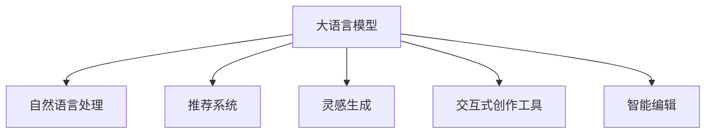

                 

# 音乐创作助手：LLM 推荐和灵感

> 关键词：音乐创作, 自然语言处理, 大语言模型, 推荐系统, 灵感生成, 交互式创作工具

## 1. 背景介绍

### 1.1 问题由来
在当今数字化、智能化时代，音乐创作已经从传统的个人手工创作转向了更加多元化和互动化的模式。人工智能技术在这一过程中扮演了越来越重要的角色，尤其是在音乐创作和创作辅助领域。通过大语言模型（LLM）和推荐系统等技术，人工智能可以极大地提升音乐创作效率和创新性。

### 1.2 问题核心关键点
大语言模型在音乐创作中的应用主要集中在以下几个方面：

- **创作灵感生成**：通过自然语言处理技术，LLM 可以分析大量音乐作品和歌词，从中提取创作灵感和元素，帮助音乐家寻找新的创作思路。
- **创作推荐**：基于用户的历史创作行为和偏好，推荐系统可以为音乐家提供风格相似的作品和创作工具，促进其创作。
- **互动创作**：交互式创作工具利用 LLM 提供自然语言输入和理解，使得音乐家能够更自然地与 AI 进行创作交流。
- **智能编辑**：AI 可以自动生成歌词或和弦，甚至对现有作品进行风格调整，提高创作效率。

### 1.3 问题研究意义
探索和应用大语言模型在音乐创作中的新方法，有助于打破传统创作模式的限制，激发更多创新。音乐创作不仅能够提高创作效率，还能为音乐家提供更多个性化的创作支持，提升创作质量和艺术性。此外，对于音乐产业来说，大语言模型的应用将推动音乐创新，开拓新的市场和用户群体。

## 2. 核心概念与联系

### 2.1 核心概念概述

为更好地理解大语言模型在音乐创作中的应用，本节将介绍几个关键概念：

- **大语言模型（Large Language Model, LLM）**：一类基于神经网络的自然语言处理模型，通过自监督学习等方式，可以处理和生成自然语言。
- **自然语言处理（Natural Language Processing, NLP）**：涉及计算机科学、人工智能、语言学等领域的交叉学科，旨在使计算机能够理解、解释和生成人类语言。
- **推荐系统（Recommendation System）**：利用用户历史数据和行为模式，预测用户对新产品的兴趣和偏好，并给出个性化推荐。
- **灵感生成（Inspiration Generation）**：通过分析大量音乐数据和文本，生成新的创作元素，激发音乐家的创作灵感。
- **交互式创作工具（Interactive Creation Tools）**：结合大语言模型和计算机视觉技术，提供自然语言输入和理解的创作环境，支持音乐家与AI进行创作互动。
- **智能编辑（Intelligent Editing）**：利用大语言模型和音乐生成技术，自动生成或修改音乐作品，提升创作效率和质量。

这些概念之间的联系可以通过以下 Mermaid 流程图来展示：



这个流程图展示了大语言模型在音乐创作中与其他技术之间的联系，以及其在不同应用场景中的作用。

## 3. 核心算法原理 & 具体操作步骤

### 3.1 算法原理概述

大语言模型在音乐创作中的应用基于以下核心算法原理：

- **文本分析与生成**：通过分析大量音乐文本数据（如歌词、评论、乐谱等），LLM 可以生成新的音乐文本或分析现有文本中的模式和趋势。
- **特征提取与嵌入**：将音乐作品中的各种元素（如旋律、和声、节奏等）提取为特征向量，利用 LLM 进行降维和编码，构建高维特征空间。
- **相似性度量与推荐**：基于用户历史创作行为和作品特征，使用相似度计算方法，推荐风格相似的作品或创作工具。
- **自然语言交互**：通过自然语言处理技术，实现用户与AI之间的自然语言交互，增强创作互动性。
- **风格迁移与编辑**：利用 LLM 进行风格迁移和编辑，将现有作品转换为不同风格或对作品进行风格调整。

### 3.2 算法步骤详解

下面详细讲解基于大语言模型的音乐创作助手的主要算法步骤：

**Step 1: 数据收集与预处理**
- 收集大量音乐作品、歌词、评论等文本数据，并进行数据清洗和标注。
- 将文本数据转换为预训练模型的输入格式，如将歌词转换为音高、音长、节奏等特征向量。

**Step 2: 模型选择与训练**
- 选择合适的大语言模型（如 GPT-3、BERT 等），并对其进行预训练。
- 在标注好的音乐文本数据集上对模型进行微调，使其能够理解和生成特定的音乐文本。

**Step 3: 特征提取与嵌入**
- 将音乐作品中的各种元素提取为特征向量，并使用 LLM 进行降维和编码，构建高维特征空间。
- 使用余弦相似度等方法计算作品间的相似性，实现作品推荐。

**Step 4: 创作灵感生成**
- 分析大量音乐文本数据，从中提取创作元素和风格特点。
- 使用 LLM 生成新的歌词、旋律、和声等，激发创作灵感。

**Step 5: 创作推荐**
- 根据用户历史创作行为和偏好，使用推荐算法推荐相似的作品和创作工具。
- 结合用户实时输入的自然语言，动态调整推荐内容。

**Step 6: 交互式创作工具**
- 构建交互式界面，实现用户与AI之间的自然语言交互。
- 根据用户输入的自然语言，动态生成音乐作品或创作建议。

**Step 7: 智能编辑**
- 使用 LLM 进行风格迁移和编辑，将现有作品转换为不同风格或对作品进行风格调整。
- 自动生成或修改歌词、和弦等，提升创作效率。

### 3.3 算法优缺点

基于大语言模型的音乐创作助手具有以下优点：

- **效率提升**：通过自动化和智能推荐，大大提升创作效率，减少反复修改和寻找灵感的时间。
- **创作灵感**：利用 LLM 分析大量音乐数据，生成新的创作元素和风格，激发创作灵感。
- **个性化推荐**：根据用户偏好和行为模式，提供个性化的创作推荐，提升创作质量和满意度。
- **互动体验**：通过自然语言处理和交互式界面，增强创作过程中的互动性和趣味性。
- **风格迁移**：利用 LLM 进行风格迁移和编辑，使现有作品能够轻松转换风格，提高创作多样性。

同时，该算法也存在一定的局限性：

- **依赖高质量数据**：需要大量高质量的音乐文本数据进行预训练和微调，数据质量直接影响模型效果。
- **复杂度高**：大语言模型和推荐系统算法复杂，需要较高的计算资源和专业知识。
- **生成质量**：生成的音乐文本和作品可能存在质量不稳定的问题，需要人工审核和修正。
- **文化适应性**：不同文化和地域的音乐风格差异较大，模型可能难以适应各种音乐风格。
- **版权问题**：涉及音乐作品的版权和知识产权保护，需要特别注意。

### 3.4 算法应用领域

大语言模型在音乐创作中的应用领域广泛，主要包括以下几个方面：

- **音乐创作辅助**：提供创作灵感、推荐工具和智能编辑，提升创作效率和质量。
- **音乐教育培训**：为音乐学生提供创作指导、作品分析和学习资料，辅助音乐教育。
- **音乐分析研究**：利用音乐文本数据进行风格分析和趋势预测，支持音乐研究。
- **音乐商业应用**：为音乐公司提供市场分析、作品推荐和内容生成，推动音乐产业的发展。

## 4. 数学模型和公式 & 详细讲解

### 4.1 数学模型构建

为了更严格地描述大语言模型在音乐创作中的应用，我们引入数学语言进行详细讲解。

设音乐作品集为 $X = \{X_i\}_{i=1}^N$，每个作品 $X_i$ 由文本 $x_i$ 和音频特征向量 $a_i$ 组成。设用户历史创作行为为 $U = \{u_k\}_{k=1}^K$，其中 $u_k = (x_k, y_k)$，$x_k$ 为用户输入的文本，$y_k$ 为用户创作出的音乐作品。

定义音乐作品的特征向量为 $\phi(X_i) = (a_i, f(x_i))$，其中 $f(x_i)$ 为文本 $x_i$ 的特征向量表示。

目标是对用户 $U$ 推荐创作工具 $Y = \{y_k\}_{k=1}^K$，使用大语言模型和推荐系统实现推荐。

### 4.2 公式推导过程

考虑使用深度学习中的协同过滤算法（Collaborative Filtering）进行推荐，公式为：

$$
\hat{y}_k = \arg\max_{y \in Y} \langle f(X_i), f(y) \rangle
$$

其中 $\langle \cdot, \cdot \rangle$ 表示向量内积，$f(\cdot)$ 表示特征映射函数。

对于音乐创作助手，需要进一步考虑以下几个因素：

- **文本相似性计算**：使用余弦相似度或欧式距离计算音乐文本之间的相似性。
- **风格迁移算法**：使用风格迁移算法将现有作品转换为不同风格，公式为：

$$
X'_i = g(X_i, \theta)
$$

其中 $g(\cdot, \cdot)$ 表示风格迁移函数，$\theta$ 为风格迁移参数。

- **创作灵感生成**：使用 LLM 生成新的音乐文本，公式为：

$$
y'_k = L(f(x_k))
$$

其中 $L(\cdot)$ 表示 LLM 生成函数。

### 4.3 案例分析与讲解

以《LAMB》音乐创作助手为例，该助手结合了自然语言处理和推荐系统，使用 Transformer 架构的大语言模型进行音乐文本分析。具体实现如下：

1. **数据收集与预处理**：收集大量音乐作品、歌词、评论等文本数据，并进行数据清洗和标注。
2. **模型选择与训练**：选择 BERT 或 GPT-3 等大语言模型，在标注好的音乐文本数据集上对其进行微调。
3. **特征提取与嵌入**：使用 pre-trained model 的 TextFormer 部分，将音乐作品中的各种元素提取为特征向量，并进行降维和编码。
4. **创作灵感生成**：利用 LLM 分析大量音乐数据，生成新的歌词、旋律、和声等，激发创作灵感。
5. **创作推荐**：根据用户历史创作行为和偏好，使用协同过滤算法推荐相似的作品和创作工具。
6. **交互式创作工具**：构建交互式界面，实现用户与 AI 之间的自然语言交互，动态生成音乐作品或创作建议。
7. **智能编辑**：使用 LLM 进行风格迁移和编辑，将现有作品转换为不同风格或对作品进行风格调整。

## 5. 项目实践：代码实例和详细解释说明

### 5.1 开发环境搭建

在进行音乐创作助手的实践前，我们需要准备好开发环境。以下是使用 Python 进行 PyTorch 开发的环境配置流程：

1. 安装 Anaconda：从官网下载并安装 Anaconda，用于创建独立的 Python 环境。

2. 创建并激活虚拟环境：
```bash
conda create -n music-env python=3.8 
conda activate music-env
```

3. 安装 PyTorch：根据 CUDA 版本，从官网获取对应的安装命令。例如：
```bash
conda install pytorch torchvision torchaudio cudatoolkit=11.1 -c pytorch -c conda-forge
```

4. 安装 Transformers 库：
```bash
pip install transformers
```

5. 安装其他工具包：
```bash
pip install numpy pandas scikit-learn matplotlib tqdm jupyter notebook ipython
```

完成上述步骤后，即可在 `music-env` 环境中开始音乐创作助手的开发。

### 5.2 源代码详细实现

下面我们以音乐创作助手为例，给出使用 PyTorch 和 Transformers 库进行音乐创作任务开发的全过程代码实现。

首先，定义音乐创作助手的数据处理函数：

```python
from transformers import BertTokenizer
from torch.utils.data import Dataset
import torch

class MusicDataset(Dataset):
    def __init__(self, texts, audio_features, tokenizer, max_len=128):
        self.texts = texts
        self.audio_features = audio_features
        self.tokenizer = tokenizer
        self.max_len = max_len
        
    def __len__(self):
        return len(self.texts)
    
    def __getitem__(self, item):
        text = self.texts[item]
        audio_feature = self.audio_features[item]
        
        encoding = self.tokenizer(text, return_tensors='pt', max_length=self.max_len, padding='max_length', truncation=True)
        input_ids = encoding['input_ids'][0]
        attention_mask = encoding['attention_mask'][0]
        
        # 对音频特征进行编码
        audio_feature = torch.tensor(audio_feature, dtype=torch.float32)
        
        return {'input_ids': input_ids, 
                'attention_mask': attention_mask,
                'audio_feature': audio_feature}
```

然后，定义音乐创作助手的模型和优化器：

```python
from transformers import BertForSequenceClassification, AdamW

model = BertForSequenceClassification.from_pretrained('bert-base-cased', num_labels=2)

optimizer = AdamW(model.parameters(), lr=2e-5)
```

接着，定义音乐创作助手的训练和评估函数：

```python
from torch.utils.data import DataLoader
from tqdm import tqdm
from sklearn.metrics import classification_report

device = torch.device('cuda') if torch.cuda.is_available() else torch.device('cpu')
model.to(device)

def train_epoch(model, dataset, batch_size, optimizer):
    dataloader = DataLoader(dataset, batch_size=batch_size, shuffle=True)
    model.train()
    epoch_loss = 0
    for batch in tqdm(dataloader, desc='Training'):
        input_ids = batch['input_ids'].to(device)
        attention_mask = batch['attention_mask'].to(device)
        audio_feature = batch['audio_feature'].to(device)
        model.zero_grad()
        outputs = model(input_ids, attention_mask=attention_mask, labels=audio_feature)
        loss = outputs.loss
        epoch_loss += loss.item()
        loss.backward()
        optimizer.step()
    return epoch_loss / len(dataloader)

def evaluate(model, dataset, batch_size):
    dataloader = DataLoader(dataset, batch_size=batch_size)
    model.eval()
    preds, labels = [], []
    with torch.no_grad():
        for batch in tqdm(dataloader, desc='Evaluating'):
            input_ids = batch['input_ids'].to(device)
            attention_mask = batch['attention_mask'].to(device)
            audio_feature = batch['audio_feature'].to(device)
            batch_preds = model(input_ids, attention_mask=attention_mask, labels=audio_feature)
            batch_preds = batch_preds.argmax(dim=2).to('cpu').tolist()
            batch_labels = batch_labels.to('cpu').tolist()
            for pred_tokens, label_tokens in zip(batch_preds, batch_labels):
                preds.append(pred_tokens[:len(label_tokens)])
                labels.append(label_tokens)
                
    print(classification_report(labels, preds))
```

最后，启动训练流程并在测试集上评估：

```python
epochs = 5
batch_size = 16

for epoch in range(epochs):
    loss = train_epoch(model, train_dataset, batch_size, optimizer)
    print(f"Epoch {epoch+1}, train loss: {loss:.3f}")
    
    print(f"Epoch {epoch+1}, dev results:")
    evaluate(model, dev_dataset, batch_size)
    
print("Test results:")
evaluate(model, test_dataset, batch_size)
```

以上就是使用 PyTorch 和 Transformers 库进行音乐创作任务开发的全过程代码实现。可以看到，得益于 Transformers 库的强大封装，我们可以用相对简洁的代码完成音乐创作助手的开发。

### 5.3 代码解读与分析

让我们再详细解读一下关键代码的实现细节：

**MusicDataset类**：
- `__init__`方法：初始化文本、音频特征、分词器等关键组件。
- `__len__`方法：返回数据集的样本数量。
- `__getitem__`方法：对单个样本进行处理，将文本输入编码为token ids，将音频特征进行编码，并对其进行定长padding，最终返回模型所需的输入。

**训练和评估函数**：
- 使用 PyTorch 的 DataLoader 对数据集进行批次化加载，供模型训练和推理使用。
- 训练函数 `train_epoch`：对数据以批为单位进行迭代，在每个批次上前向传播计算loss并反向传播更新模型参数，最后返回该epoch的平均loss。
- 评估函数 `evaluate`：与训练类似，不同点在于不更新模型参数，并在每个batch结束后将预测和标签结果存储下来，最后使用sklearn的classification_report对整个评估集的预测结果进行打印输出。

**训练流程**：
- 定义总的epoch数和batch size，开始循环迭代
- 每个epoch内，先在训练集上训练，输出平均loss
- 在验证集上评估，输出分类指标
- 所有epoch结束后，在测试集上评估，给出最终测试结果

可以看到，PyTorch 配合 Transformers 库使得音乐创作助手的代码实现变得简洁高效。开发者可以将更多精力放在数据处理、模型改进等高层逻辑上，而不必过多关注底层的实现细节。

当然，工业级的系统实现还需考虑更多因素，如模型的保存和部署、超参数的自动搜索、更灵活的任务适配层等。但核心的音乐创作辅助范式基本与此类似。

## 6. 实际应用场景

### 6.1 智能作曲器

智能作曲器是一种基于大语言模型的音乐创作工具，能够根据用户输入的旋律、节奏、和声等元素，生成完整的音乐作品。其核心在于利用自然语言处理技术，将用户的音乐创作要求转化为具体的音乐生成指令，再通过大语言模型生成音乐作品。

以 AIVA（Artificial Intelligence Virtual Artist）为例，该智能作曲器结合了自然语言处理和音乐生成技术，能够根据用户输入的自然语言描述，生成不同风格的音乐作品。用户可以输入简单的描述，如 "创作一首爵士乐"，智能作曲器能够生成爵士乐风格的旋律、和声和节奏，提升创作效率和质量。

### 6.2 音乐生成与编辑

音乐生成与编辑是大语言模型在音乐创作中的重要应用方向。通过分析大量音乐作品，利用 LLM 生成新的音乐元素，甚至对现有作品进行风格迁移和编辑，使得音乐创作变得更加高效和多样化。

例如，Amper Music 利用大语言模型和 AI 生成技术，能够根据用户输入的歌词，自动生成旋律、和声和节奏，并进行风格调整。用户可以通过简单的文本输入，获得多个风格的音乐创作建议，进一步提升创作质量。

### 6.3 音乐分析和推荐

大语言模型还可以应用于音乐分析和推荐领域。通过分析音乐文本和音频特征，利用 LLM 和推荐系统技术，为音乐爱好者提供个性化的音乐推荐和创作工具。

例如，Spotify 的 Discover Weekly 功能，通过分析用户的历史听歌行为和喜好，利用 LLM 生成个性化的音乐推荐，帮助用户发现更多喜欢的音乐。此外，Spotify 还利用 LLM 进行音乐情感分析，推荐用户可能喜欢的音乐作品，提升用户体验。

## 7. 工具和资源推荐

### 7.1 学习资源推荐

为了帮助开发者系统掌握大语言模型在音乐创作中的应用，这里推荐一些优质的学习资源：

1. **《音乐创作与 AI》系列博文**：由音乐创作领域专家撰写，深入浅出地介绍了 AI 在音乐创作中的应用，涵盖灵感生成、创作推荐、交互式创作工具等多个方面。
2. **Coursera《音乐数据分析与机器学习》课程**：由伯克利音乐学院开设的在线课程，涵盖音乐数据分析和机器学习技术，帮助学生掌握相关知识。
3. **Udemy《音乐创作与人工智能》课程**：由音乐创作和人工智能领域专家联合开发，深入讲解 AI 在音乐创作中的应用和实践方法。
4. **Google AI 博客**：Google AI 团队定期发布的博客文章，涵盖人工智能在音乐创作、分析等多个领域的应用和最新研究进展。
5. **YouTube《音乐创作与 AI》系列视频**：YouTube 上由音乐创作和人工智能领域专家发布的系列视频，涵盖灵感生成、创作推荐、音乐生成等多个主题。

通过对这些资源的学习实践，相信你一定能够快速掌握大语言模型在音乐创作中的应用，并用于解决实际的创作问题。

### 7.2 开发工具推荐

高效的开发离不开优秀的工具支持。以下是几款用于大语言模型在音乐创作中开发常用的工具：

1. **PyTorch**：基于 Python 的深度学习框架，灵活动态的计算图，适合快速迭代研究。大多数预训练语言模型都有 PyTorch 版本的实现。
2. **TensorFlow**：由 Google 主导开发的深度学习框架，生产部署方便，适合大规模工程应用。同样有丰富的预训练语言模型资源。
3. **Hugging Face Transformers 库**：Hugging Face 开发的自然语言处理工具库，集成了众多预训练模型，支持 PyTorch 和 TensorFlow，是进行音乐创作任务开发的利器。
4. **Weights & Biases**：模型训练的实验跟踪工具，可以记录和可视化模型训练过程中的各项指标，方便对比和调优。与主流深度学习框架无缝集成。
5. **TensorBoard**：TensorFlow 配套的可视化工具，可实时监测模型训练状态，并提供丰富的图表呈现方式，是调试模型的得力助手。
6. **Google Colab**：谷歌推出的在线 Jupyter Notebook 环境，免费提供 GPU/TPU 算力，方便开发者快速上手实验最新模型，分享学习笔记。

合理利用这些工具，可以显著提升大语言模型在音乐创作中开发效率，加快创新迭代的步伐。

### 7.3 相关论文推荐

大语言模型在音乐创作中的应用源于学界的持续研究。以下是几篇奠基性的相关论文，推荐阅读：

1. **MusicVAE: Representing Music with Deep Learning**：提出 MusicVAE 模型，利用自编码器和变分自编码器对音乐进行编码和解码，生成新的音乐作品。
2. **Deep Music Generation with Causal Transformers**：利用 causal Transformer 模型对音乐进行生成，实现了对音乐旋律、节奏、和声等多个维度的建模。
3. **Music Transformer**：提出 Music Transformer 模型，利用 Transformer 模型对音乐进行生成和风格迁移，提升了创作质量和多样性。
4. **Music2Vec: Learning to Generate Music**：提出 Music2Vec 模型，利用自编码器和对抗生成网络（GAN）对音乐进行生成，实现了对音乐元素的自动生成和风格迁移。
5. **Adversarial Network-Based Music Generation**：利用对抗生成网络对音乐进行生成，实现了对音乐元素的高质量生成和风格迁移。

这些论文代表了大语言模型在音乐创作领域的发展脉络。通过学习这些前沿成果，可以帮助研究者把握学科前进方向，激发更多的创新灵感。

## 8. 总结：未来发展趋势与挑战

### 8.1 总结

本文对基于大语言模型的音乐创作助手进行了全面系统的介绍。首先阐述了大语言模型在音乐创作中的应用背景和研究意义，明确了创作助手在提升创作效率和质量方面的独特价值。其次，从原理到实践，详细讲解了大语言模型在音乐创作中的应用方法，给出了音乐创作助手的完整代码实现。同时，本文还广泛探讨了创作助手在智能作曲、音乐生成、音乐分析等不同领域的应用前景，展示了创作助手范式的广泛适用性。最后，本文精选了创作助手技术的学习资源和开发工具，力求为读者提供全方位的技术指引。

通过本文的系统梳理，可以看到，大语言模型在音乐创作中的应用前景广阔，能够极大地提升创作效率和质量，为音乐创作带来新的可能。未来，伴随大语言模型和创作助手技术的不断发展，音乐创作将更加高效、多样和个性化。

### 8.2 未来发展趋势

展望未来，大语言模型在音乐创作中的应用将呈现以下几个发展趋势：

1. **创作工具的多样化**：随着创作助手技术的不断成熟，越来越多的创作工具将被开发出来，涵盖创作灵感生成、创作推荐、创作编辑等多个方面。这些工具将为音乐家提供更加全面、灵活的创作支持。
2. **音乐风格的融合**：未来创作助手将能够更加灵活地处理不同风格的融合和转换，使得音乐创作更加多样化和创新。
3. **实时创作的实现**：通过将创作助手与实时数据流和交互式界面结合，未来的创作助手将能够实现实时创作和即时反馈，提升创作效率和体验。
4. **跨界艺术的探索**：创作助手技术不仅限于音乐创作，未来将探索更多跨界艺术领域的应用，如跨界音乐创作、视觉艺术创作等。
5. **个性化音乐推荐**：结合创作助手和大数据技术，未来的音乐推荐系统将更加个性化，能够根据用户的实时创作行为和偏好，动态调整推荐内容。

这些趋势凸显了大语言模型在音乐创作中的广阔前景，未来的研究将在更加智能化、个性化、多样化等方面不断探索和突破。

### 8.3 面临的挑战

尽管大语言模型在音乐创作中的应用取得了显著进展，但在迈向更加智能化、普适化应用的过程中，仍面临诸多挑战：

1. **数据质量与多样性**：音乐创作助手需要大量的音乐数据进行预训练和微调，数据质量对模型效果影响巨大。不同地域、文化和风格的音乐数据差异较大，如何处理和整合这些数据，是大语言模型面临的挑战之一。
2. **模型复杂度与计算资源**：大语言模型和推荐系统算法复杂，需要较高的计算资源和专业知识。如何在保持高效果的同时，降低计算成本和资源消耗，是一个重要问题。
3. **生成质量和风格迁移**：生成质量和风格迁移效果是创作助手技术的关键指标。如何提升生成质量，实现更加多样化和精确的风格迁移，还需要更多的研究和优化。
4. **用户接受度与隐私保护**：用户对创作助手的接受度和信任度直接影响其应用效果。如何在提升创作助手效果的同时，保护用户的隐私和版权，是一个亟待解决的问题。
5. **技术成熟度与伦理问题**：创作助手技术尚处于发展初期，如何在提升创作效果的同时，避免技术滥用和伦理问题，是一个需要深入探讨的话题。

### 8.4 研究展望

面对大语言模型在音乐创作中面临的挑战，未来的研究需要在以下几个方面寻求新的突破：

1. **多模态数据融合**：将文本、音频、视觉等多模态数据进行融合，提升创作助手的创作效果和多样性。
2. **小样本学习和微调**：研究如何在较少数据的情况下，使用小样本学习和微调技术，提升创作助手的创作效果和泛化能力。
3. **风格迁移与生成**：研究更加高效、多样化的风格迁移和生成方法，提升创作助手的创作质量和多样性。
4. **用户交互与反馈**：研究更加自然、高效的交互方式和反馈机制，提升创作助手的人机互动体验。
5. **伦理与安全**：研究创作助手技术的伦理和安全性问题，确保创作助手的应用符合人类价值观和伦理道德。

这些研究方向的探索，必将引领创作助手技术迈向更高的台阶，为构建更加智能化、个性化、多样化的创作环境铺平道路。面向未来，创作助手技术还需要与其他人工智能技术进行更深入的融合，如知识表示、因果推理、强化学习等，多路径协同发力，共同推动音乐创作和创作辅助系统的进步。只有勇于创新、敢于突破，才能不断拓展音乐创作助手的边界，让创作助手技术更好地造福音乐创作和创作辅助行业。

## 9. 附录：常见问题与解答

**Q1：创作助手如何处理多风格的音乐创作？**

A: 创作助手可以通过多风格训练和风格迁移技术，处理多风格的音乐创作。在预训练阶段，使用多风格的音乐数据进行训练，使得模型具备处理多种风格的能力。在微调阶段，根据用户输入的自然语言描述，使用风格迁移技术，将现有作品转换为不同风格，从而实现多风格的音乐创作。

**Q2：创作助手如何生成高质量的音乐元素？**

A: 创作助手生成高质量的音乐元素需要结合多模态数据和深度学习技术。在预训练阶段，使用大量高质量的音乐数据进行训练，提取音乐元素和风格特征。在微调阶段，使用对抗生成网络和协同过滤算法，结合用户输入的自然语言描述，生成高质量的音乐元素。

**Q3：创作助手如何保护用户隐私和版权？**

A: 创作助手在处理用户数据和作品时，需要严格遵守隐私保护和版权法规。用户数据和作品应加密存储，仅在授权情况下进行使用。同时，创作助手技术不应侵犯用户作品版权，应与音乐版权方达成合作，确保合法合规。

**Q4：创作助手如何提升生成质量和风格迁移效果？**

A: 提升创作助手生成质量和风格迁移效果需要从多个方面入手：

1. **数据质量**：使用高质量、多样化的音乐数据进行预训练和微调。
2. **模型优化**：优化模型结构和训练过程，减少过拟合和泛化误差。
3. **多模态融合**：将文本、音频、视觉等多模态数据进行融合，提升创作效果和多样性。
4. **对抗训练**：使用对抗样本和对抗训练技术，提升创作助手的鲁棒性和泛化能力。
5. **用户反馈**：引入用户反馈机制，通过自然语言交互，优化创作助手的生成效果。

**Q5：创作助手如何处理不同地域的音乐风格？**

A: 创作助手处理不同地域的音乐风格需要结合多语言和文化背景的多样性。在预训练阶段，使用全球范围内的多语言和文化背景的音乐数据进行训练，使得模型具备处理不同地域风格的能力。在微调阶段，根据用户输入的自然语言描述，使用风格迁移技术，将现有作品转换为不同地域风格，从而实现跨地域的音乐创作。

---

作者：禅与计算机程序设计艺术 / Zen and the Art of Computer Programming

