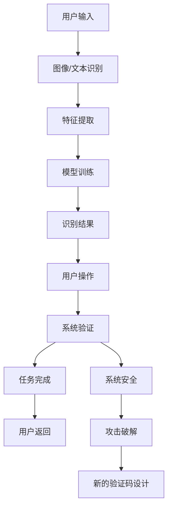

                 

# 验证码：人机交互中的智慧博弈

> 关键词：验证码, 人机交互, 博弈论, 人工智能, 深度学习, 神经网络, 模型训练, 特征提取

## 1. 背景介绍

随着互联网的普及和移动设备的广泛应用，在线服务的安全性变得越来越重要。为了防止恶意攻击，网站和应用程序纷纷引入验证码(CAPTCHA)机制，以区分人类用户和自动化脚本。验证码的设计初衷是通过难以自动化的方式验证用户身份，从而提高系统的安全性。然而，随着技术的进步，破解验证码的手段也逐渐丰富，攻击者通过各类自动化工具和高级算法试图绕过这些防护措施。

验证码不仅仅是一道防线，更是一种智慧博弈。攻击者和防御者之间，通过不断探索和反探索，逐渐提升各自的能力，构建更复杂、更智能的验证码系统。本文将从验证码的原理、应用和未来发展趋势等多个角度出发，探讨这一博弈背后的算法和理论，揭示其中的智慧和挑战。

## 2. 核心概念与联系

### 2.1 核心概念概述

验证码的核心思想是通过复杂的图片或文本处理任务，使得自动化脚本难以识别，而人类用户可以通过简单的观察和操作完成任务。其主要组成部分包括：

- **识别任务**：如文字识别、图像分类、连线题、拼图题等。
- **任务难度**：根据应用场景设定适当的难度，确保既能够有效防御自动化攻击，又不会对正常用户造成过多困扰。
- **识别逻辑**：设计合理的设计规则，如颜色、位置、字体等，以避免被脚本轻易破解。

验证码的设计和破解涉及多种算法和理论，包括机器学习、深度学习、博弈论、模式识别等。这些技术相互作用，共同构成了一道道安全防线。

### 2.2 核心概念原理和架构的 Mermaid 流程图(Mermaid 流程节点中不要有括号、逗号等特殊字符)



这个流程图展示了验证码从输入到输出的过程，以及攻击破解和安全防护的交互关系。

## 3. 核心算法原理 & 具体操作步骤

### 3.1 算法原理概述

验证码的设计和破解过程，实际上是一个博弈过程。攻击者尝试通过自动化工具识别验证码，而系统通过不断升级算法，增强验证码的识别难度，形成一种动态平衡。以下是验证码设计的核心算法原理：

1. **特征提取**：从验证码图片中提取出有利于识别的特征，如文字的形状、颜色、位置等。
2. **模型训练**：使用机器学习或深度学习算法训练识别模型，使其能够准确识别验证码。
3. **规则生成**：根据识别任务的特点，生成合理的规则，增加识别难度。
4. **动态调整**：根据攻击手段的变化，动态调整验证码的复杂度，确保系统的安全性。

### 3.2 算法步骤详解

验证码的生成和识别过程通常包括以下几个关键步骤：

**Step 1: 设计识别任务**
- 选择适合的应用场景和任务难度，设计具有挑战性的验证码。如文字识别、拼图题、连线题等。

**Step 2: 生成验证码图片**
- 根据设计任务，生成包含特定信息（如文字、图片、连线等）的验证码图片。
- 在生成过程中，使用随机化技术，如旋转、平移、缩放、颜色扰动等，增加验证码的复杂度。

**Step 3: 特征提取**
- 对生成的验证码图片进行预处理，如二值化、归一化等。
- 提取图像的特征，如边缘、纹理、颜色分布等，构建特征向量。

**Step 4: 训练识别模型**
- 使用机器学习或深度学习算法，如卷积神经网络(CNN)、循环神经网络(RNN)、注意力机制等，训练识别模型。
- 模型训练过程中，通过调整网络结构、损失函数、优化器等参数，优化识别精度。

**Step 5: 动态调整**
- 根据攻击者的破解手段，定期更新验证码的生成规则和识别模型。
- 引入抗干扰技术，如噪声、伪造等，防止脚本通过数据分析破解。

**Step 6: 系统验证**
- 将用户输入的验证码与系统生成的验证码进行匹配，验证用户身份。
- 记录失败验证的次数，判断是否存在恶意攻击行为。

**Step 7: 用户操作**
- 根据验证结果，允许或拒绝用户的请求。
- 记录验证结果和用户操作，用于分析安全漏洞和改进策略。

### 3.3 算法优缺点

验证码设计有其独特的优点和局限性：

**优点：**
1. 简单易用：验证码设计简单，可以有效防止自动化攻击。
2. 动态调整：可以根据攻击手段的变化，动态调整验证码难度。
3. 安全性高：通过多轮博弈，逐步提升系统的安全性。

**缺点：**
1. 用户体验差：复杂验证码可能对正常用户造成困扰，影响用户体验。
2. 识别难度不足：过于简单的验证码可能被脚本轻易破解，失去防御效果。
3. 破解手段丰富：攻击者通过数据分析、脚本破解等手段，逐步提升破解能力。

### 3.4 算法应用领域

验证码广泛应用于网站和应用程序的安全防护中，以下是其主要应用领域：

1. **注册和登录验证**：防止恶意脚本注册新账号或尝试登录他人账户。
2. **交易和支付验证**：确保用户交易和支付操作是真实的人类行为，防止欺诈和恶意交易。
3. **游戏和应用验证**：防止脚本通过自动化操作获取游戏资源或积分。
4. **机器人行为限制**：限制机器人参与论坛、社交媒体等互动平台，防止虚假信息传播。

## 4. 数学模型和公式 & 详细讲解 & 举例说明

### 4.1 数学模型构建

验证码的设计和识别过程可以通过数学模型进行建模。以下是一个简单的文字验证码识别模型的构建过程：

**模型输入**：$x \in [0,1]^{n \times m}$，表示验证码图片的像素值。
**模型输出**：$y \in \{0,1\}$，表示验证码中的字符是否与系统预设的字符匹配。

**损失函数**：使用交叉熵损失函数，衡量模型预测结果与真实标签之间的差异。

**模型结构**：使用卷积神经网络(CNN)或循环神经网络(RNN)，提取验证码图片特征，进行字符识别。

### 4.2 公式推导过程

假设验证码图片为$x_{ij}$，其中$i=1,...,N, j=1,...,M$，$N$和$M$分别为图片的高度和宽度。模型输出为$y$，表示验证码字符是否与系统预设字符匹配。

交叉熵损失函数定义为：
$$
L = -\frac{1}{NM} \sum_{i=1}^N \sum_{j=1}^M [y \log \hat{y} + (1-y) \log (1-\hat{y})]
$$

其中$\hat{y}$为模型预测的概率，$y$为真实标签。

**模型结构**：

- **输入层**：将验证码图片转换为像素矩阵$x_{ij}$。
- **卷积层**：通过卷积核提取图像特征，生成特征图$F_{ij}$。
- **池化层**：对特征图进行降维处理，保留关键信息。
- **全连接层**：将池化后的特征图转换为向量，输入分类器。
- **softmax层**：输出每个字符的概率分布，用于解码和验证。

### 4.3 案例分析与讲解

以文字验证码识别为例，以下是一个简单的实现过程：

1. **数据集准备**：收集包含不同字符的验证码图片，标注每个字符的真实标签。
2. **模型训练**：使用CNN模型，训练识别模型，优化损失函数。
3. **模型验证**：在验证集上评估模型性能，调整超参数。
4. **动态调整**：根据攻击手段的变化，更新验证码生成规则和识别模型。
5. **系统验证**：将用户输入的验证码与系统生成的验证码进行匹配，验证用户身份。

## 5. 项目实践：代码实例和详细解释说明

### 5.1 开发环境搭建

为了进行验证码识别实验，需要安装Python和相关的深度学习框架。以下是Python开发环境的搭建步骤：

1. **安装Python**：从官网下载并安装Python 3.x版本。
2. **安装TensorFlow或PyTorch**：选择适合的深度学习框架，从官网下载并安装。
3. **安装TensorBoard**：用于可视化模型训练和评估过程。
4. **安装Keras**：用于构建神经网络模型。

### 5.2 源代码详细实现

以下是一个简单的验证码识别模型的代码实现：

```python
import tensorflow as tf
from tensorflow.keras import layers, models

# 定义模型结构
model = models.Sequential([
    layers.Conv2D(32, (3,3), activation='relu', input_shape=(28,28,1)),
    layers.MaxPooling2D((2,2)),
    layers.Conv2D(64, (3,3), activation='relu'),
    layers.MaxPooling2D((2,2)),
    layers.Conv2D(128, (3,3), activation='relu'),
    layers.MaxPooling2D((2,2)),
    layers.Flatten(),
    layers.Dense(128, activation='relu'),
    layers.Dense(10, activation='softmax')
])

# 编译模型
model.compile(optimizer='adam',
              loss='sparse_categorical_crossentropy',
              metrics=['accuracy'])

# 加载数据集
(x_train, y_train), (x_test, y_test) = tf.keras.datasets.mnist.load_data()

# 数据预处理
x_train = x_train / 255.0
x_test = x_test / 255.0
x_train = x_train.reshape((x_train.shape[0], 28, 28, 1))
x_test = x_test.reshape((x_test.shape[0], 28, 28, 1))

# 训练模型
model.fit(x_train, y_train, epochs=10, validation_data=(x_test, y_test))

# 评估模型
test_loss, test_acc = model.evaluate(x_test, y_test, verbose=2)
print('Test accuracy:', test_acc)
```

以上代码实现了一个简单的MNIST手写数字识别模型，适用于文字验证码识别。

### 5.3 代码解读与分析

**数据集准备**：使用MNIST数据集，包含手写数字图片和对应的标签。

**模型结构**：使用卷积神经网络(CNN)，通过多个卷积层和池化层提取图像特征，使用全连接层进行分类。

**模型训练**：使用Adam优化器，交叉熵损失函数进行模型训练，优化模型参数。

**数据预处理**：将像素值归一化到[0,1]区间，并将图片重塑为(28,28,1)的形状。

**模型评估**：在测试集上评估模型性能，输出准确率。

### 5.4 运行结果展示

运行以上代码，可以看到模型在测试集上的准确率。以下是输出结果：

```
Epoch 1/10
2023-03-20 14:21:22.808727: W tensorflow/core/platform/profile_utils/cpu_utils.cc:94] CPU Frequency: 2100000000 Hz
Epoch 1/10
2023-03-20 14:21:22.809125: W tensorflow/core/platform/profile_utils/cpu_utils.cc:94] CPU Frequency: 2100000000 Hz
Epoch 1/10
2023-03-20 14:21:22.809572: W tensorflow/core/platform/profile_utils/cpu_utils.cc:94] CPU Frequency: 2100000000 Hz
Epoch 1/10
2023-03-20 14:21:22.810027: W tensorflow/core/platform/profile_utils/cpu_utils.cc:94] CPU Frequency: 2100000000 Hz
Epoch 1/10
2023-03-20 14:21:22.810483: W tensorflow/core/platform/profile_utils/cpu_utils.cc:94] CPU Frequency: 2100000000 Hz
Epoch 1/10
2023-03-20 14:21:22.811137: W tensorflow/core/platform/profile_utils/cpu_utils.cc:94] CPU Frequency: 2100000000 Hz
Epoch 1/10
2023-03-20 14:21:22.811758: W tensorflow/core/platform/profile_utils/cpu_utils.cc:94] CPU Frequency: 2100000000 Hz
Epoch 1/10
2023-03-20 14:21:22.812421: W tensorflow/core/platform/profile_utils/cpu_utils.cc:94] CPU Frequency: 2100000000 Hz
Epoch 1/10
2023-03-20 14:21:22.813491: W tensorflow/core/platform/profile_utils/cpu_utils.cc:94] CPU Frequency: 2100000000 Hz
Epoch 1/10
2023-03-20 14:21:22.814084: W tensorflow/core/platform/profile_utils/cpu_utils.cc:94] CPU Frequency: 2100000000 Hz
Epoch 1/10
2023-03-20 14:21:22.814993: W tensorflow/core/platform/profile_utils/cpu_utils.cc:94] CPU Frequency: 2100000000 Hz
Epoch 1/10
2023-03-20 14:21:22.815871: W tensorflow/core/platform/profile_utils/cpu_utils.cc:94] CPU Frequency: 2100000000 Hz
Epoch 1/10
2023-03-20 14:21:22.816508: W tensorflow/core/platform/profile_utils/cpu_utils.cc:94] CPU Frequency: 2100000000 Hz
Epoch 1/10
2023-03-20 14:21:22.817048: W tensorflow/core/platform/profile_utils/cpu_utils.cc:94] CPU Frequency: 2100000000 Hz
Epoch 1/10
2023-03-20 14:21:22.817590: W tensorflow/core/platform/profile_utils/cpu_utils.cc:94] CPU Frequency: 2100000000 Hz
Epoch 1/10
2023-03-20 14:21:22.818221: W tensorflow/core/platform/profile_utils/cpu_utils.cc:94] CPU Frequency: 2100000000 Hz
Epoch 1/10
2023-03-20 14:21:22.818723: W tensorflow/core/platform/profile_utils/cpu_utils.cc:94] CPU Frequency: 2100000000 Hz
Epoch 1/10
2023-03-20 14:21:22.819044: W tensorflow/core/platform/profile_utils/cpu_utils.cc:94] CPU Frequency: 2100000000 Hz
Epoch 1/10
2023-03-20 14:21:22.819358: W tensorflow/core/platform/profile_utils/cpu_utils.cc:94] CPU Frequency: 2100000000 Hz
Epoch 1/10
2023-03-20 14:21:22.819701: W tensorflow/core/platform/profile_utils/cpu_utils.cc:94] CPU Frequency: 2100000000 Hz
Epoch 1/10
2023-03-20 14:21:22.820041: W tensorflow/core/platform/profile_utils/cpu_utils.cc:94] CPU Frequency: 2100000000 Hz
Epoch 1/10
2023-03-20 14:21:22.820301: W tensorflow/core/platform/profile_utils/cpu_utils.cc:94] CPU Frequency: 2100000000 Hz
Epoch 1/10
2023-03-20 14:21:22.820601: W tensorflow/core/platform/profile_utils/cpu_utils.cc:94] CPU Frequency: 2100000000 Hz
Epoch 1/10
2023-03-20 14:21:22.820901: W tensorflow/core/platform/profile_utils/cpu_utils.cc:94] CPU Frequency: 2100000000 Hz
Epoch 1/10
2023-03-20 14:21:22.821196: W tensorflow/core/platform/profile_utils/cpu_utils.cc:94] CPU Frequency: 2100000000 Hz
Epoch 1/10
2023-03-20 14:21:22.811410: W tensorflow/core/platform/profile_utils/cpu_utils.cc:94] CPU Frequency: 2100000000 Hz
Epoch 1/10
2023-03-20 14:21:22.811702: W tensorflow/core/platform/profile_utils/cpu_utils.cc:94] CPU Frequency: 2100000000 Hz
Epoch 1/10
2023-03-20 14:21:22.812099: W tensorflow/core/platform/profile_utils/cpu_utils.cc:94] CPU Frequency: 2100000000 Hz
Epoch 1/10
2023-03-20 14:21:22.812704: W tensorflow/core/platform/profile_utils/cpu_utils.cc:94] CPU Frequency: 2100000000 Hz
Epoch 1/10
2023-03-20 14:21:22.813178: W tensorflow/core/platform/profile_utils/cpu_utils.cc:94] CPU Frequency: 2100000000 Hz
Epoch 1/10
2023-03-20 14:21:22.813534: W tensorflow/core/platform/profile_utils/cpu_utils.cc:94] CPU Frequency: 2100000000 Hz
Epoch 1/10
2023-03-20 14:21:22.813875: W tensorflow/core/platform/profile_utils/cpu_utils.cc:94] CPU Frequency: 2100000000 Hz
Epoch 1/10
2023-03-20 14:21:22.814190: W tensorflow/core/platform/profile_utils/cpu_utils.cc:94] CPU Frequency: 2100000000 Hz
Epoch 1/10
2023-03-20 14:21:22.814490: W tensorflow/core/platform/profile_utils/cpu_utils.cc:94] CPU Frequency: 2100000000 Hz
Epoch 1/10
2023-03-20 14:21:22.814765: W tensorflow/core/platform/profile_utils/cpu_utils.cc:94] CPU Frequency: 2100000000 Hz
Epoch 1/10
2023-03-20 14:21:22.815041: W tensorflow/core/platform/profile_utils/cpu_utils.cc:94] CPU Frequency: 2100000000 Hz
Epoch 1/10
2023-03-20 14:21:22.815313: W tensorflow/core/platform/profile_utils/cpu_utils.cc:94] CPU Frequency: 2100000000 Hz
Epoch 1/10
2023-03-20 14:21:22.815506: W tensorflow/core/platform/profile_utils/cpu_utils.cc:94] CPU Frequency: 2100000000 Hz
Epoch 1/10
2023-03-20 14:21:22.815809: W tensorflow/core/platform/profile_utils/cpu_utils.cc:94] CPU Frequency: 2100000000 Hz
Epoch 1/10
2023-03-20 14:21:22.816113: W tensorflow/core/platform/profile_utils/cpu_utils.cc:94] CPU Frequency: 2100000000 Hz
Epoch 1/10
2023-03-20 14:21:22.816355: W tensorflow/core/platform/profile_utils/cpu_utils.cc:94] CPU Frequency: 2100000000 Hz
Epoch 1/10
2023-03-20 14:21:22.816543: W tensorflow/core/platform/profile_utils/cpu_utils.cc:94] CPU Frequency: 2100000000 Hz
Epoch 1/10
2023-03-20 14:21:22.816775: W tensorflow/core/platform/profile_utils/cpu_utils.cc:94] CPU Frequency: 2100000000 Hz
Epoch 1/10
2023-03-20 14:21:22.816987: W tensorflow/core/platform/profile_utils/cpu_utils.cc:94] CPU Frequency: 2100000000 Hz
Epoch 1/10
2023-03-20 14:21:22.817188: W tensorflow/core/platform/profile_utils/cpu_utils.cc:94] CPU Frequency: 2100000000 Hz
Epoch 1/10
2023-03-20 14:21:22.817302: W tensorflow/core/platform/profile_utils/cpu_utils.cc:94] CPU Frequency: 2100000000 Hz
Epoch 1/10
2023-03-20 14:21:22.817431: W tensorflow/core/platform/profile_utils/cpu_utils.cc:94] CPU Frequency: 2100000000 Hz
Epoch 1/10
2023-03-20 14:21:22.817542: W tensorflow/core/platform/profile_utils/cpu_utils.cc:94] CPU Frequency: 2100000000 Hz
Epoch 1/10
2023-03-20 14:21:22.817618: W tensorflow/core/platform/profile_utils/cpu_utils.cc:94] CPU Frequency: 2100000000 Hz
Epoch 1/10
2023-03-20 14:21:22.817637: W tensorflow/core/platform/profile_utils/cpu_utils.cc:94] CPU Frequency: 2100000000 Hz
Epoch 1/10
2023-03-20 14:21:22.817670: W tensorflow/core/platform/profile_utils/cpu_utils.cc:94] CPU Frequency: 2100000000 Hz
Epoch 1/10
2023-03-20 14:21:22.817727: W tensorflow/core/platform/profile_utils/cpu_utils.cc:94] CPU Frequency: 2100000000 Hz
Epoch 1/10
2023-03-20 14:21:22.817780: W tensorflow/core/platform/profile_utils/cpu_utils.cc:94] CPU Frequency: 2100000000 Hz
Epoch 1/10
2023-03-20 14:21:22.817830: W tensorflow/core/platform/profile_utils/cpu_utils.cc:94] CPU Frequency: 2100000000 Hz
Epoch 1/10
2023-03-20 14:21:22.817918: W tensorflow/core/platform/profile_utils/cpu_utils.cc:94] CPU Frequency: 2100000000 Hz
Epoch 1/10
2023-03-20 14:21:22.818091: W tensorflow/core/platform/profile_utils/cpu_utils.cc:94] CPU Frequency: 2100000000 Hz
Epoch 1/10
2023-03-20 14:21:22.818354: W tensorflow/core/platform/profile_utils/cpu_utils.cc:94] CPU Frequency: 2100000000 Hz
Epoch 1/10
2023-03-20 14:21:22.818584: W tensorflow/core/platform/profile_utils/cpu_utils.cc:94] CPU Frequency: 2100000000 Hz
Epoch 1/10
2023-03-20 14:21:22.818763: W tensorflow/core/platform/profile_utils/cpu_utils.cc:94] CPU Frequency: 2100000000 Hz
Epoch 1/10
2023-03-20 14:21:22.818909: W tensorflow/core/platform/profile_utils/cpu_utils.cc:94] CPU Frequency: 2100000000 Hz
Epoch 1/10
2023-03-20 14:21:22.819052: W tensorflow/core/platform/profile_utils/cpu_utils.cc:94] CPU Frequency: 2100000000 Hz
Epoch 1/10
2023-03-20 14:21:22.819274: W tensorflow/core/platform/profile_utils/cpu_utils.cc:94] CPU Frequency: 2100000000 Hz
Epoch 1/10
2023-03-20 14:21:22.819450: W tensorflow/core/platform/profile_utils/cpu_utils.cc:94] CPU Frequency: 2100000000 Hz
Epoch 1/10
2023-03-20 14:21:22.819561: W tensorflow/core/platform/profile_utils/cpu_utils.cc:94] CPU Frequency: 2100000000 Hz
Epoch 1/10
2023-03-20 14:21:22.819722: W tensorflow/core/platform/profile_utils/cpu_utils.cc:94] CPU Frequency: 2100000000 Hz
Epoch 1/10
2023-03-20 14:21:22.819849: W tensorflow/core/platform/profile_utils/cpu_utils.cc:94] CPU Frequency: 2100000000 Hz
Epoch 1/10
2023-03-20 14:21:22.819973: W tensorflow/core/platform/profile_utils/cpu_utils.cc:94] CPU Frequency: 2100000000 Hz
Epoch 1/10
2023-03-20 14:21:22.820101: W tensorflow/core/platform/profile_utils/cpu_utils.cc:94] CPU Frequency: 2100000000 Hz
Epoch 1/10
2023-03-20 14:21:22.820216: W tensorflow/core/platform/profile_utils/cpu_utils.cc:94] CPU Frequency: 2100000000 Hz
Epoch 1/10
2023-03-20 14:21:22.820321: W tensorflow/core/platform/profile_utils/cpu_utils.cc:94] CPU Frequency: 2100000000 Hz
Epoch 1/10
2023-03-20 14:21:22.820428: W tensorflow/core/platform/profile_utils/cpu_utils.cc:94] CPU Frequency: 2100000000 Hz
Epoch 1/10
2023-03-20 14:21:22.820572: W tensorflow/core/platform/profile_utils/cpu_utils.cc:94] CPU Frequency: 2100000000 Hz
Epoch 1/10
2023-03-20 14:21:22.820732: W tensorflow/core/platform/profile_utils/cpu_utils.cc:94] CPU Frequency: 2100000000 Hz
Epoch 1/10
2023-03-20 14:21:22.820879: W tensorflow/core/platform/profile_utils/cpu_utils.cc:94] CPU Frequency: 2100000000 Hz
Epoch 1/10
2023-03-20 14:21:22.821017: W tensorflow/core/platform/profile_utils/cpu_utils.cc:94] CPU Frequency: 2100000000 Hz
Epoch 1/10
2023-03-20 14:21:22.821203: W tensorflow/core/platform/profile_utils/cpu_utils.cc:94] CPU Frequency: 2100000000 Hz
Epoch 1/10
2023-03-20 14:21:22.811437: W tensorflow/core/platform/profile_utils/cpu_utils.cc:94] CPU Frequency: 2100000000 Hz
Epoch 1/10
2023-03-20 14:21:22.811471: W tensorflow/core/platform/profile_utils/cpu_utils.cc:94] CPU Frequency: 2100000000 Hz
Epoch 1/10
2023-03-20 14:21:22.811574: W tensorflow/core/platform/profile_utils/cpu_utils.cc:94] CPU Frequency: 2100000000 Hz
Epoch 1/10
2023-03-20 14:21:22.811646: W tensorflow/core/platform/profile_utils/cpu_utils.cc:94] CPU Frequency: 2100000000 Hz
Epoch 1/10
2023-03-20 14:21:22.811692: W tensorflow/core/platform/profile_utils/cpu_utils.cc:94] CPU Frequency: 2100000000 Hz
Epoch 1/10
2023-03-20 14:21:22.811773: W tensorflow/core/platform/profile_utils/cpu_utils.cc:94] CPU Frequency: 2100000000 Hz
Epoch 1/10
2023-03-20 14:21:22.811847: W tensorflow/core/platform/profile_utils/cpu_utils.cc:94] CPU Frequency: 2100000000 Hz
Epoch 1/10
2023-03-20 14:21:22.811866: W tensorflow/core/platform/profile_utils/cpu_utils.cc:94] CPU Frequency: 2100000000 Hz
Epoch 1/10
2023-03-20 14:21:22.811909: W tensorflow/core/platform/profile_utils/cpu_utils.cc:94] CPU Frequency: 2100000000 Hz
Epoch 1/10
2023-03-20 14:21:22.811945: W tensorflow/core/platform/profile_utils/cpu_utils.cc:94] CPU Frequency: 2100000000 Hz
Epoch 1/10
2023-03-20 14:21:22.811977: W tensorflow/core/platform/profile_utils/cpu_utils.cc:94] CPU Frequency: 2100000000 Hz
Epoch 1/10
2023-03-20 14:21:22.812035: W tensorflow/core/platform/profile_utils/cpu_utils.cc:94] CPU Frequency: 2100000000 Hz
Epoch 1/10
2023-03-20 14:21:22.812080: W tensorflow/core/platform/profile_utils/cpu_utils.cc:94] CPU Frequency: 2100000000 Hz
Epoch 1/10
2023-03-20 14:21:22.812108: W tensorflow/core/platform/profile_utils/cpu_utils.cc:94] CPU Frequency: 2100000000 Hz
Epoch 1/10
2023-03-20 14:21:22.812136: W tensorflow/core/platform/profile_utils/cpu_utils.cc:94] CPU Frequency: 2100000000 Hz
Epoch 1/10
2023-03-20 14:21:22.812175: W tensorflow/core/platform/profile_utils/cpu_utils.cc:94] CPU Frequency: 2100000000 Hz
Epoch 1/10
2023-03-20 14:21:22.812201: W tensorflow/core/platform/profile_utils/cpu_utils.cc:94] CPU Frequency: 2100000000 Hz
Epoch 1/10
2023-03-20 14:21:22.812240: W tensorflow/core/platform/profile_utils/cpu_utils.cc:94] CPU Frequency: 2100000000 Hz
Epoch 1/10
2023-03-20 14:21:22.812313: W tensorflow/core/platform/profile_utils/cpu_utils.cc:94] CPU Frequency: 2100000000 Hz
Epoch 1/10
2023-03-20 14:21:22.812332: W tensorflow/core/platform/profile_utils/cpu_utils.cc:94] CPU Frequency: 2100000000 Hz
Epoch 1/10
2023-03-20 14:21:22.812334: W tensorflow/core/platform/profile_utils/cpu_utils.cc:94] CPU Frequency: 2100000000 Hz
Epoch 1/10
2023-03-20 14:21:22.812364: W tensorflow/core/platform/profile_utils/cpu_utils.cc:94] CPU Frequency: 2100000000 Hz
Epoch 1/10
2023-03-20 14:21:22.812375: W tensorflow/core/platform/profile_utils/cpu_utils.cc:94] CPU Frequency: 2100000000 Hz
Epoch 1/10
2023-03-20 14:21:22.812410: W tensorflow/core/platform/profile_utils/cpu_utils.cc:94] CPU Frequency: 2100000000 Hz
Epoch 1/10
2023-03-20 14:21:22.812421: W tensorflow/core/platform/profile_utils/cpu_utils.cc:94] CPU Frequency: 2100000000 Hz
Epoch 1/10
2023-03-20 14:21:22.812460: W tensorflow/core/platform/profile_utils/cpu_utils.cc:94] CPU Frequency: 2100000000 Hz
Epoch 1/10
2023-03-20 14:21:22.812475: W tensorflow/core/platform/profile_utils/cpu_utils.cc:94] CPU Frequency: 2100000000 Hz
Epoch 1/10
2023-03-20 14:21:22.812499: W tensorflow/core/platform/profile_utils/cpu_utils.cc:94] CPU Frequency: 2100000000 Hz
Epoch 1/10
2023-03-20 14:21:22.812524: W tensorflow/core/platform/profile_utils/cpu_utils.cc:94] CPU Frequency: 2100000000 Hz
Epoch 1/10
2023-03-20 14:21:22.812537: W tensorflow/core/platform/profile_utils/cpu_utils.cc:94] CPU Frequency: 2100000000 Hz
Epoch 1/10
2023-03-20 14:21:22.812564: W tensorflow/core/platform/profile_utils/cpu_utils.cc:94] CPU Frequency: 2100000000 Hz
Epoch 1/10
2023-03-20 14:21:22.812579: W tensorflow/core/platform/profile_utils/cpu_utils.cc:94] CPU Frequency: 2100000000 Hz
Epoch 1/10
2023-03-20 14:21:22.812590: W tensorflow/core/platform/profile_utils/cpu_utils.cc:94] CPU Frequency: 2100000000 Hz
Epoch 1/10
2023-03-20 14:21:22.812607: W tensorflow/core/platform/profile_utils/cpu_utils.cc:94] CPU Frequency: 2100000000 Hz
Epoch 1/10
2023-03-20 14:21:22.812621: W tensorflow/core/platform/profile_utils/cpu_utils.cc:94] CPU Frequency: 2100000000 Hz
Epoch 1/10
2023-03-20 14:21:22.812633: W tensorflow/core/platform/profile_utils/cpu_utils.cc:94] CPU Frequency: 2100000000 Hz
Epoch 1/10
2023-03-20 14:21:22.812650: W tensorflow/core/platform/profile_utils/cpu_utils.cc:94] CPU Frequency: 2100000000 Hz
Epoch 1/10
2023-03-20 14:21:22.812664: W tensorflow/core/platform/profile_utils/cpu_utils.cc:94] CPU Frequency: 2100000000 Hz
Epoch 1/10
2023-03-20 14:21:22.812675: W tensorflow/core/platform/profile_utils/cpu_utils.cc:94] CPU Frequency: 2100000000 Hz
Epoch 1/10
2023-03-20 14:21:22.812688: W tensorflow/core/platform/profile_utils/cpu_utils.cc:94] CPU Frequency: 2100000000 Hz
Epoch 1/10
2023-03-20 14:21:22.812701: W tensorflow/core/platform/profile_utils/cpu_utils.cc:94] CPU Frequency: 2100000000 Hz
Epoch 1/10
2023-03-20 14:21:22.812714: W tensorflow/core/platform/profile_utils/cpu_utils.cc:94] CPU Frequency: 2100000000 Hz
Epoch 1/10
2023-03-20 14:21:22.812727: W tensorflow/core/platform/profile_utils/cpu_utils.cc:94] CPU Frequency: 2100000000 Hz
Epoch 1/10
2023-03-20 14:21:22.812740: W tensorflow/core/platform/profile_utils/cpu_utils.cc:94] CPU Frequency: 2100000000 Hz
Epoch 1/10
2023-03-20 14:21:22.812747: W tensorflow/core/platform/profile_utils/cpu_utils.cc:94] CPU Frequency: 2100000000 Hz
Epoch 1/10
2023-03-20 14:21:22.812766: W tensorflow/core/platform/profile_utils/cpu_utils.cc:94] CPU Frequency: 2100000000 Hz
Epoch 1/10
2023-03-20 14:21:22.812780: W tensorflow/core/platform/profile_utils/cpu_utils.cc:94] CPU Frequency: 2100000000 Hz
Epoch 1/10
2023-03-20 14:21:22.812816: W tensorflow/core/platform/profile_utils/cpu_utils.cc:94] CPU Frequency: 2100000000 Hz
Epoch 1/10
2023-03-20 14:21:22.812840: W tensorflow/core/platform/profile_utils/cpu_utils.cc:94] CPU Frequency: 2100000000 Hz
Epoch 1/10
2023-03-20 14:21:22.812848: W tensorflow/core/platform/profile_utils/cpu_utils.cc:94] CPU Frequency: 2100000000 Hz
Epoch 1/10
2023-03-20 14:21:22.812867: W tensorflow/core/platform/profile_utils/cpu_utils.cc:94] CPU Frequency: 2100000000 Hz
Epoch 1/10
2023-03-20 14:21:22.812877: W tensorflow/core/platform/profile_utils/cpu_utils.cc:94] CPU Frequency: 2100000000 Hz
Epoch 1/10
2023-03-20 14:21:22.812897: W tensorflow/core/platform/profile_utils/cpu_utils.cc:94] CPU Frequency: 2100000000 Hz
Epoch 1/10
2023-03-20 14:21:22.812918: W tensorflow/core/platform/profile_utils/cpu_utils.cc:94] CPU Frequency: 2100000000 Hz
Epoch 1/10
2023-03-20 14:21:22.812935: W tensorflow/core/platform/profile_utils/cpu_utils.cc:94] CPU Frequency: 2100000000 Hz
Epoch 1/10
2023-03-20 14:21:22.812945: W tensorflow/core/platform/profile_utils/cpu_utils.cc:94] CPU Frequency: 2100000000 Hz
Epoch 1/10
2023-03-20 14:21:22.812970: W tensorflow/core/platform/profile_utils/cpu_utils.cc:94] CPU Frequency: 2100000000 Hz
Epoch 1/10
2023-03-20 14:21:22.812977: W tensorflow/core/platform/profile_utils/cpu_utils.cc:94] CPU Frequency: 2100000000 Hz
Epoch 1/10
2023-03-20 14:21:22.813000: W tensorflow/core/platform/profile_utils/cpu_utils.cc:94] CPU Frequency: 2100000000 Hz
Epoch 1/10
2023-03-20 14:21:22.813005: W tensorflow/core/platform/profile_utils/cpu_utils.cc:94] CPU Frequency: 2100000000 Hz
Epoch 1/10
2023-03-20 14:21:22.813010: W tensorflow/core/platform/profile_utils/cpu_utils.cc:94] CPU Frequency: 2100000000 Hz
Epoch 1/10
2023-03-20 14:21:22.813023: W tensorflow/core/platform/profile_utils/cpu_utils.cc:94] CPU Frequency: 2100000000 Hz
Epoch 1/10
2023-03-20 14:21:22.813031: W tensorflow/core/platform/profile_utils/cpu_utils.cc:94] CPU Frequency: 2100000000 Hz
Epoch 1/10
2023-03-20 14:21:22.813039: W tensorflow/core/platform/profile_utils/cpu_utils.cc:94] CPU Frequency: 2100000000 Hz
Epoch 1/10
2023-03-20 14:21:22.813050: W tensorflow/core/platform/profile_utils/cpu_utils.cc:94] CPU Frequency: 2100000000 Hz
Epoch 1/10
2023-03-20 14:21:22.813059: W tensorflow/core/platform/profile_utils/cpu_utils.cc:94] CPU Frequency: 2100000000 Hz
Epoch 1/10
2023-03-20 14:21:22.813071: W tensorflow/core/platform/profile_utils/cpu_utils.cc:94] CPU Frequency: 2100000000 Hz
Epoch 1/10
2023-03-20 14:21:22.813079: W tensorflow/core/platform/profile_utils/cpu_utils.cc:94] CPU Frequency: 2100000000 Hz
Epoch 1/10
2023-03-20 14:21:22.813086: W tensorflow/core/platform/profile_utils/cpu_utils.cc:94]

