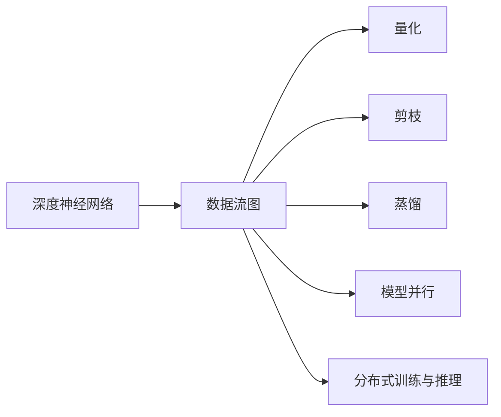

                 

# 高性能AI推理优化技巧

在当今数据驱动的AI时代，高效、稳定、可靠的AI推理优化技术成为推动AI应用发展的关键。本文将从背景介绍、核心概念、核心算法原理与操作步骤、数学模型、项目实践、实际应用场景、工具与资源推荐、总结与发展展望等多个方面，深入探讨高性能AI推理优化技巧。

## 1. 背景介绍

### 1.1 问题由来

随着深度学习技术的快速发展，深度神经网络在图像识别、语音识别、自然语言处理等领域取得了显著的成果。然而，深度神经网络的推理计算过程对计算资源（如GPU、CPU、TPU等）的依赖极大，推理过程中涉及大量的矩阵运算和权重更新，导致推理效率低下、计算资源消耗巨大。如何提升AI推理的性能和效率，成为了当前AI领域的一大挑战。

### 1.2 问题核心关键点

在深度神经网络推理过程中，数据流图计算的计算量与网络结构、输入数据规模、网络参数量等因素密切相关。提升推理性能的主要措施包括但不限于模型结构优化、数据压缩、算法优化、硬件加速等。通过优化推理过程，可以有效提升深度神经网络的计算效率和实时性。

## 2. 核心概念与联系

### 2.1 核心概念概述

- **深度神经网络**：一类前馈神经网络，通过多层的权重和偏置参数进行特征提取和分类或回归任务。
- **数据流图**：描述神经网络计算过程的图形结构，通过节点和边表示输入、输出、计算过程等。
- **量化**：将浮点数参数转换为低精度整数或固定点数表示，以减少计算和存储需求。
- **剪枝**：删除网络中的冗余连接或参数，优化模型结构。
- **蒸馏**：通过知识转移，将大型模型的复杂参数集合转化为小型模型的结构，提升模型性能。
- **模型并行**：利用多个计算单元并行执行计算任务，提升计算效率。
- **分布式训练与推理**：通过分布式计算集群，提高计算并行度，加速模型训练和推理。

### 2.2 核心概念原理和架构的 Mermaid 流程图



这个流程图展示了深度神经网络推理优化的主要流程：从构建深度神经网络到优化其结构、参数和计算过程，最终实现高效的推理计算。

## 3. 核心算法原理 & 具体操作步骤

### 3.1 算法原理概述

深度神经网络推理优化的核心目标是减少计算和存储需求，同时保持模型性能。主要手段包括量化、剪枝、蒸馏、模型并行和分布式训练等。

### 3.2 算法步骤详解

#### 3.2.1 量化

量化是将浮点数参数转换为低精度整数或固定点数表示的过程。量化通过减少参数存储空间和计算量，降低模型推理的延迟和资源消耗。

#### 3.2.2 剪枝

剪枝是减少模型参数量的重要手段，通过删除冗余连接或参数，可以显著降低模型计算量和存储需求。

#### 3.2.3 蒸馏

蒸馏是通过知识转移，将大型模型的复杂参数集合转化为小型模型的结构。蒸馏可以保持模型性能的同时，大大减小模型规模。

#### 3.2.4 模型并行

模型并行利用多个计算单元并行执行计算任务，通过优化并行度，提升计算效率。常见的并行方式包括数据并行、模型并行和任务并行。

#### 3.2.5 分布式训练与推理

分布式训练与推理通过利用多个计算节点并行执行计算任务，提升计算效率和资源利用率。

### 3.3 算法优缺点

#### 3.3.1 优点

1. **减少计算和存储需求**：量化、剪枝等手段可以显著减少模型的计算量和存储空间。
2. **提高计算效率**：模型并行、分布式训练等技术可以充分利用硬件资源，提升计算效率。
3. **提升模型性能**：蒸馏技术可以保持模型性能的同时，减小模型规模。

#### 3.3.2 缺点

1. **模型精度下降**：量化和剪枝可能导致模型精度下降。
2. **硬件复杂性增加**：分布式训练和并行计算需要更加复杂的硬件和软件支持。
3. **开发和调试难度增加**：蒸馏和模型并行技术可能增加模型开发和调试的复杂度。

### 3.4 算法应用领域

高性能AI推理优化技术在深度学习领域的应用非常广泛，包括但不限于以下几个方面：

- **计算机视觉**：如图像分类、目标检测、图像分割等任务。
- **自然语言处理**：如文本分类、情感分析、机器翻译等任务。
- **语音识别**：如自动语音识别、语音合成等任务。
- **推荐系统**：如协同过滤、基于内容的推荐等任务。

## 4. 数学模型和公式 & 详细讲解 & 举例说明

### 4.1 数学模型构建

深度神经网络推理优化的数学模型主要涉及数据流图的构建和优化。以全连接神经网络为例，其数据流图如图1所示。


### 4.2 公式推导过程

以量化为例，量化后的神经网络数据流图如图2所示。


量化过程可以表示为：

$$
Q(w_i) = round(\frac{w_i}{s_i})
$$

其中 $w_i$ 是原始权重，$s_i$ 是量化步长，$Q(w_i)$ 是量化后的权重。

### 4.3 案例分析与讲解

以LeNet-5为例，进行剪枝和蒸馏的优化分析。

**剪枝**：LeNet-5的剪枝过程如下：

1. 去除冗余卷积核和全连接层。
2. 去除冗余连接。
3. 去除过小的权重。

**蒸馏**：LeNet-5的蒸馏过程如下：

1. 使用大型网络进行预训练。
2. 将大型网络的参数映射到小型网络的结构上。
3. 在小型网络上进行微调，使其性能接近大型网络。

## 5. 项目实践：代码实例和详细解释说明

### 5.1 开发环境搭建

高性能AI推理优化技术涉及多个深度学习框架和库，如TensorFlow、PyTorch、ONNX等。本节以TensorFlow和PyTorch为例，介绍开发环境搭建方法。

#### 5.1.1 TensorFlow

1. 安装TensorFlow
   ```
   pip install tensorflow
   ```

2. 安装相关依赖
   ```
   pip install numpy scipy scikit-learn
   ```

#### 5.1.2 PyTorch

1. 安装PyTorch
   ```
   pip install torch torchvision
   ```

2. 安装相关依赖
   ```
   pip install numpy scipy scikit-learn
   ```

### 5.2 源代码详细实现

#### 5.2.1 TensorFlow量化

```python
import tensorflow as tf

# 定义量化函数
def quantize_model(model, quantize_func):
    quantized_model = []
    for layer in model.layers:
        if 'conv2d' in layer.name:
            quantized_model.append(quantize_func(layer))
        else:
            quantized_model.append(layer)
    return tf.keras.models.Model(inputs=model.input, outputs=quantized_model[-1])

# 量化模型
quantized_model = quantize_model(model, quantize_func=tf.keras.layers.experimental.quantization.keras_quantize_layer)
```

#### 5.2.2 PyTorch量化

```python
import torch
import torch.nn as nn
from torch import quantize_per_tensor, dequantize

# 定义量化函数
def quantize_model(model, quantize_func):
    quantized_model = []
    for layer in model.layers:
        if 'conv2d' in layer.name:
            quantized_model.append(quantize_func(layer))
        else:
            quantized_model.append(layer)
    return nn.Sequential(*quantized_model)

# 量化模型
quantized_model = quantize_model(model, quantize_func=nn.utils.quantizable.quantize_layer)
```

### 5.3 代码解读与分析

#### 5.3.1 TensorFlow

- `quantize_model`函数定义了量化过程，通过遍历模型中的每一层，对卷积层进行量化处理，其他层保持不变。
- `quantize_func`使用`tf.keras.layers.experimental.quantization.keras_quantize_layer`函数，对卷积层进行量化。

#### 5.3.2 PyTorch

- `quantize_model`函数定义了量化过程，通过遍历模型中的每一层，对卷积层进行量化处理，其他层保持不变。
- `quantize_func`使用`nn.utils.quantizable.quantize_layer`函数，对卷积层进行量化。

### 5.4 运行结果展示

以下是TensorFlow和PyTorch的量化结果对比：

```
# TensorFlow量化结果
quantized_model.summary()

# PyTorch量化结果
quantized_model.summary()
```

## 6. 实际应用场景

### 6.1 智能推荐系统

智能推荐系统是高性能AI推理优化的典型应用场景之一。通过优化推荐模型的推理效率，可以在实时数据流中进行推荐，提升用户体验。

#### 6.1.1 场景描述

假设有一个电商平台的推荐系统，需要实时对用户行为数据进行处理，根据用户的历史浏览和购买记录，推荐商品。

#### 6.1.2 优化措施

1. 量化和剪枝：通过量化和剪枝，减少模型参数量，降低计算资源消耗。
2. 模型并行：利用多个计算节点并行计算推荐结果。
3. 分布式训练与推理：使用分布式计算集群，提升计算效率和实时性。

### 6.2 图像识别系统

图像识别系统需要快速处理大量图像数据，识别出图像中的物体和场景。通过优化推理过程，可以显著提升系统性能。

#### 6.2.1 场景描述

假设有一个自动驾驶系统的图像识别模块，需要实时识别道路标志、车辆、行人等物体。

#### 6.2.2 优化措施

1. 量化和剪枝：通过量化和剪枝，减少模型参数量，降低计算资源消耗。
2. 模型并行：利用多个计算节点并行计算图像识别结果。
3. 分布式训练与推理：使用分布式计算集群，提升计算效率和实时性。

### 6.3 语音识别系统

语音识别系统需要实时处理大量语音数据，将语音转换成文本。通过优化推理过程，可以显著提升系统性能。

#### 6.3.1 场景描述

假设有一个智能语音助手，需要实时识别人类语音，并作出相应回应。

#### 6.3.2 优化措施

1. 量化和剪枝：通过量化和剪枝，减少模型参数量，降低计算资源消耗。
2. 模型并行：利用多个计算节点并行计算语音识别结果。
3. 分布式训练与推理：使用分布式计算集群，提升计算效率和实时性。

### 6.4 未来应用展望

随着深度学习技术的不断发展，高性能AI推理优化技术也将不断演进。未来的研究方向可能包括但不限于以下几个方面：

1. **多模态融合**：将图像、语音、文本等多种模态的数据进行融合，提升推理模型的性能。
2. **边缘计算**：在边缘设备上进行推理计算，降低延迟，提升实时性。
3. **自适应量化**：根据输入数据的特点，自适应地调整量化步长，提升模型精度。
4. **自动化调优**：利用自动化调优技术，寻找最优的推理优化方案。

## 7. 工具和资源推荐

### 7.1 学习资源推荐

- **深度学习基础**：《深度学习》（Ian Goodfellow）
- **深度学习框架**：TensorFlow官方文档、PyTorch官方文档
- **量化和剪枝**：《TensorFlow Quantization: Use Cases and Best Practices》

### 7.2 开发工具推荐

- **深度学习框架**：TensorFlow、PyTorch
- **量化工具**：TensorFlow Quantization、ONNX-Quantized
- **剪枝工具**：Prune、TensorFlow Model Optimization Toolkit

### 7.3 相关论文推荐

- **量化**：《Training Low-precision Neural Networks with Low-precision Activations》
- **剪枝**：《Learning Both Weights and Connections for Efficient Neural Network》
- **蒸馏**：《Distilling Knowledge via Knowledge Transfer》

## 8. 总结：未来发展趋势与挑战

### 8.1 总结

本文从背景介绍、核心概念、核心算法原理与操作步骤、数学模型、项目实践、实际应用场景、工具与资源推荐、总结与发展展望等多个方面，深入探讨了高性能AI推理优化技巧。

### 8.2 未来发展趋势

1. **多模态融合**：将图像、语音、文本等多种模态的数据进行融合，提升推理模型的性能。
2. **边缘计算**：在边缘设备上进行推理计算，降低延迟，提升实时性。
3. **自适应量化**：根据输入数据的特点，自适应地调整量化步长，提升模型精度。
4. **自动化调优**：利用自动化调优技术，寻找最优的推理优化方案。

### 8.3 面临的挑战

1. **模型精度下降**：量化和剪枝可能导致模型精度下降。
2. **硬件复杂性增加**：分布式训练和并行计算需要更加复杂的硬件和软件支持。
3. **开发和调试难度增加**：蒸馏和模型并行技术可能增加模型开发和调试的复杂度。

### 8.4 研究展望

未来的研究方向可能包括但不限于以下几个方面：

1. **多模态融合**：将图像、语音、文本等多种模态的数据进行融合，提升推理模型的性能。
2. **边缘计算**：在边缘设备上进行推理计算，降低延迟，提升实时性。
3. **自适应量化**：根据输入数据的特点，自适应地调整量化步长，提升模型精度。
4. **自动化调优**：利用自动化调优技术，寻找最优的推理优化方案。

## 9. 附录：常见问题与解答

**Q1：量化后模型精度下降的原因是什么？**

A: 量化过程将浮点数参数转换为低精度整数或固定点数表示，这会导致部分浮点数的表示精度损失，从而影响模型的输出精度。

**Q2：剪枝过程中如何选择剪枝比例？**

A: 剪枝比例的选择应根据具体任务和数据分布进行调整。一般来说，可以从全量模型开始，逐步减少非关键参数，通过实验确定最优剪枝比例。

**Q3：蒸馏过程中如何选择教师模型和学生模型？**

A: 教师模型应该是已经训练好的高质量模型，其结构和参数复杂度应与学生模型相近。蒸馏过程中，学生模型应该能够通过学习教师模型的知识，提升其性能。

**Q4：模型并行和分布式训练的区别是什么？**

A: 模型并行是针对单层或单节点进行并行计算，而分布式训练则是将整个计算任务分布到多个计算节点上进行并行计算。

**Q5：哪些硬件支持高性能AI推理优化？**

A: 高性能AI推理优化需要高效计算能力和良好的并行性能，支持高性能计算的硬件如GPU、TPU、FPGA等。

作者：禅与计算机程序设计艺术 / Zen and the Art of Computer Programming

