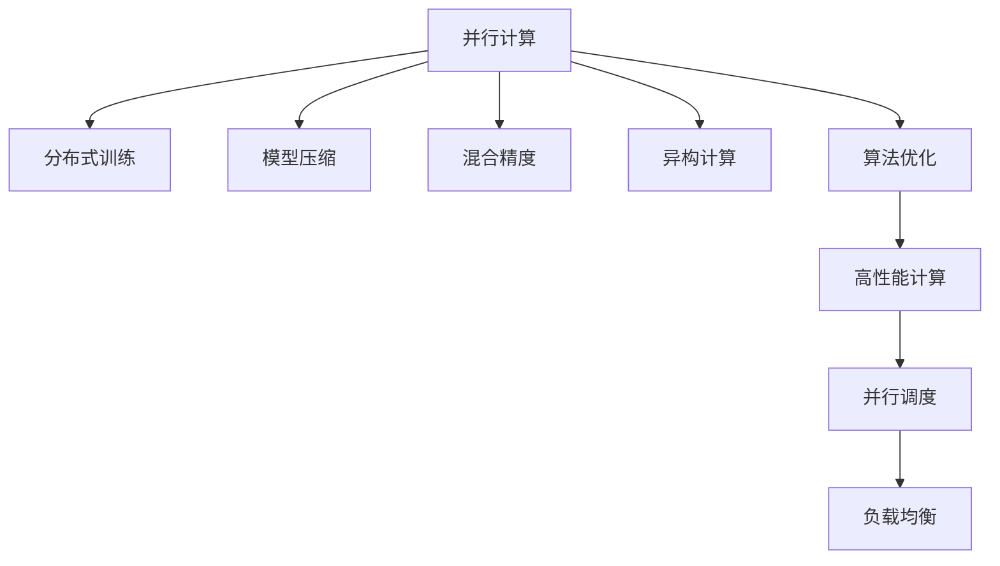

                 

# 高性能AI：LLM的并行计算策略

> 关键词：大语言模型(LLM),并行计算,分布式训练,高性能计算,深度学习,Transformer,GPU,TPU,模型压缩,算法优化

## 1. 背景介绍

### 1.1 问题由来
近年来，随着深度学习技术的快速发展，大规模语言模型（Large Language Model, LLM）在自然语言处理（NLP）领域取得了巨大的突破。这些大语言模型通过在海量无标签文本数据上进行预训练，学习到了丰富的语言知识和常识，具备强大的语言理解和生成能力。然而，由于模型规模庞大、计算需求高，其训练和推理过程面临巨大的资源挑战，需要高效的并行计算策略来支持。

### 1.2 问题核心关键点
LLM的并行计算策略是其在分布式计算环境中实现高效训练和推理的关键。要使得LLM在实际应用中发挥其潜力，需要在以下几个方面进行优化：
- 选择合适的并行计算框架，如TensorFlow、PyTorch、MXNet等。
- 优化模型结构，进行模型压缩和参数剪枝，以减少计算资源消耗。
- 设计高效的并行算法，利用多节点并行、分布式训练、混合精度等技术提升训练和推理速度。
- 采用异构并行计算平台，如GPU、TPU、CPU等，实现并行性能最大化。
- 进行并行调度和负载均衡，确保计算资源的有效利用。

本文聚焦于大语言模型并行计算的策略，深入探讨了如何通过选择合适的并行框架、优化模型结构、设计高效并行算法以及采用异构计算平台，实现高性能的LLM计算，从而提升NLP应用的效果和效率。

## 2. 核心概念与联系

### 2.1 核心概念概述

为更好地理解并行计算策略，本节将介绍几个密切相关的核心概念：

- 并行计算(Parallel Computing)：通过多个计算单元同时执行任务，从而提升计算效率的一种计算方式。
- 分布式训练(Distributed Training)：将大规模模型的训练任务分散到多个计算节点上并行执行，减少单节点计算压力，提升训练速度。
- 模型压缩(Model Compression)：通过剪枝、量化、蒸馏等技术，减少模型参数和计算复杂度，提升模型推理速度和资源利用率。
- 混合精度(Mixed Precision)：使用不同位数的浮点数进行并行计算，减少计算量同时提高精度。
- 异构计算(Heterogeneous Computing)：利用不同类型计算资源，如CPU、GPU、TPU等，实现最优的并行性能。
- 算法优化(Algorithm Optimization)：通过对算法进行优化，提升其执行效率，减少计算时间。

这些核心概念之间的逻辑关系可以通过以下Mermaid流程图来展示：



这个流程图展示了大语言模型的并行计算的核心概念及其之间的关系：

1. 并行计算提供基础计算能力。
2. 分布式训练利用多节点并行，提升训练效率。
3. 模型压缩优化模型结构，减少资源消耗。
4. 混合精度提升并行计算效率和精度。
5. 异构计算结合不同硬件优势，最大化并行性能。
6. 算法优化提升算法执行效率，缩短计算时间。

这些概念共同构成了大语言模型并行计算的基础，使其能够在各种场景下发挥高性能计算的威力。

## 3. 核心算法原理 & 具体操作步骤
### 3.1 算法原理概述

大语言模型的并行计算策略，本质上是一种高效的分布式训练方法。其核心思想是：将大规模模型的训练任务分散到多个计算节点上并行执行，从而提升训练速度。这种并行计算方法可以显著降低单节点的计算压力，加速模型的收敛。

形式化地，假设原始模型参数为 $\theta$，在分布式系统中，每个节点分别拥有部分参数 $\theta_{local}$，通过通信和同步，各节点并行执行优化算法，最终得到全局最优参数 $\hat{\theta}$。常见的并行计算策略包括数据并行、模型并行、混合并行等。

### 3.2 算法步骤详解

大语言模型的并行计算主要包括以下几个关键步骤：

**Step 1: 选择合适的并行计算框架**

选择合适的并行计算框架是并行计算的首要步骤。目前常用的并行计算框架包括TensorFlow、PyTorch、MXNet等，这些框架提供了丰富的分布式训练功能，支持多节点、多GPU、多TPU等异构计算平台。

**Step 2: 优化模型结构**

优化模型结构是减少并行计算资源消耗的关键。通过剪枝、量化、蒸馏等技术，可以减少模型参数和计算复杂度，从而提升模型推理速度和资源利用率。

**Step 3: 设计高效的并行算法**

设计高效的并行算法是实现高效并行计算的核心。常见的并行算法包括数据并行、模型并行、混合精度等，不同的算法适用于不同的场景，需要根据具体任务进行优化选择。

**Step 4: 采用异构计算平台**

采用异构计算平台是提升并行计算性能的重要手段。GPU、TPU等硬件平台具有强大的并行计算能力，可以有效提升模型训练和推理速度。

**Step 5: 进行并行调度和负载均衡**

进行并行调度和负载均衡是确保计算资源有效利用的关键。合理分配计算任务，确保每个节点的工作负载均衡，可以有效提升系统的整体性能。

### 3.3 算法优缺点

并行计算的优点包括：
1. 显著提升计算效率。通过并行计算，可以在短时间内完成大规模模型的训练和推理任务。
2. 减少单节点计算压力。分布式训练将任务分散到多个节点上，避免单节点计算压力过大。
3. 支持大规模计算。异构计算平台（如GPU、TPU等）可以支持大规模模型的训练，提升计算能力。

缺点则包括：
1. 并行通信开销。并行计算需要频繁的节点间通信，增加计算时间。
2. 同步问题。分布式训练需要同步各节点的模型参数，影响训练速度。
3. 资源管理复杂。异构计算平台需要复杂的资源管理和调度策略。

尽管存在这些缺点，但就目前而言，并行计算是提升大语言模型计算性能的最主流手段。未来相关研究的重点在于如何进一步降低通信开销、优化同步策略、改进资源管理等，以进一步提升并行计算的效率。

### 3.4 算法应用领域

基于并行计算的大语言模型已经在NLP领域得到了广泛应用，覆盖了几乎所有常见任务，例如：

- 文本分类：如情感分析、主题分类、意图识别等。通过并行训练，模型能够更快地收敛到最优参数。
- 命名实体识别：识别文本中的人名、地名、机构名等特定实体。并行计算可以加速模型的训练过程，提高识别准确率。
- 关系抽取：从文本中抽取实体之间的语义关系。并行计算能够同时处理大量训练样本，提升抽取效果。
- 问答系统：对自然语言问题给出答案。并行计算能够同时处理多轮对话，提高回答速度和质量。
- 机器翻译：将源语言文本翻译成目标语言。并行计算能够同时翻译大量文本，提升翻译效率。
- 文本摘要：将长文本压缩成简短摘要。并行计算能够同时处理多个摘要任务，提高生成速度。

除了上述这些经典任务外，并行计算还被创新性地应用到更多场景中，如可控文本生成、常识推理、代码生成、数据增强等，为NLP技术带来了全新的突破。随着并行计算方法的不断进步，相信NLP技术将在更广阔的应用领域大放异彩。

## 4. 数学模型和公式 & 详细讲解 & 举例说明

### 4.1 数学模型构建

本节将使用数学语言对大语言模型的并行计算过程进行更加严格的刻画。

记原始模型为 $M_{\theta}$，其参数为 $\theta \in \mathbb{R}^d$。假设在分布式系统中，每个节点拥有部分参数 $\theta_{local}$，并行计算的优化目标是：

$$
\hat{\theta} = \mathop{\arg\min}_{\theta} \mathcal{L}(\theta)
$$

其中 $\mathcal{L}$ 为损失函数，定义为：

$$
\mathcal{L}(\theta) = \frac{1}{N} \sum_{i=1}^N \ell(M_{\theta}(x_i),y_i)
$$

常见的损失函数包括交叉熵损失、均方误差损失等。

在分布式系统中，各节点的优化目标相同，即：

$$
\hat{\theta}_{local} = \mathop{\arg\min}_{\theta_{local}} \mathcal{L}(\theta_{local})
$$

各节点通过通信和同步，最终得到全局最优参数 $\hat{\theta}$。

### 4.2 公式推导过程

以下我们以数据并行为例，推导分布式训练中的同步策略。

假设训练数据集 $D=\{(x_i,y_i)\}_{i=1}^N$，每个节点分配到 $k$ 个子集 $D_{local}=\{(x_{li},y_{li})\}_{i=1}^k$，则节点 $i$ 的损失函数为：

$$
\mathcal{L}_{local}(\theta_{local}) = \frac{1}{k}\sum_{i=1}^k \ell(M_{\theta_{local}}(x_{li}),y_{li})
$$

各节点在本地执行优化算法，计算梯度 $\frac{\partial \mathcal{L}_{local}}{\partial \theta_{local}}$。然后通过节点间通信，交换梯度信息，计算全局梯度 $\frac{\partial \mathcal{L}}{\partial \theta}$。具体的同步策略包括同步梯度、同步参数等。

### 4.3 案例分析与讲解

**案例：分布式训练的同步策略**

在分布式训练中，同步策略的选择对系统性能至关重要。常见的同步策略包括同步梯度(sync gradients)和同步参数(sync parameters)。

**同步梯度策略**：各节点计算本地梯度后，将梯度信息同步到中心节点，计算全局梯度，并根据全局梯度更新参数。这种方法简单高效，但需要频繁的节点间通信，影响训练速度。

**同步参数策略**：各节点独立更新参数，通过同步参数更新公式，实现参数的同步。这种方法通信开销小，但需要在多个节点间保持一致的状态，实现起来较为复杂。

在实践中，常常结合两种策略，根据具体情况选择最优方案。例如，可以在模型权重较小或通信开销较大的情况下采用同步梯度，在模型权重较大或通信开销较小的情况下采用同步参数。

## 5. 项目实践：代码实例和详细解释说明
### 5.1 开发环境搭建

在进行并行计算实践前，我们需要准备好开发环境。以下是使用Python进行PyTorch开发的环境配置流程：

1. 安装Anaconda：从官网下载并安装Anaconda，用于创建独立的Python环境。

2. 创建并激活虚拟环境：
```bash
conda create -n pytorch-env python=3.8 
conda activate pytorch-env
```

3. 安装PyTorch：根据CUDA版本，从官网获取对应的安装命令。例如：
```bash
conda install pytorch torchvision torchaudio cudatoolkit=11.1 -c pytorch -c conda-forge
```

4. 安装Transformers库：
```bash
pip install transformers
```

5. 安装各类工具包：
```bash
pip install numpy pandas scikit-learn matplotlib tqdm jupyter notebook ipython
```

完成上述步骤后，即可在`pytorch-env`环境中开始并行计算实践。

### 5.2 源代码详细实现

下面我们以BERT模型在分布式GPU环境下的训练为例，给出使用PyTorch进行并行计算的代码实现。

首先，定义数据处理函数：

```python
from torch.utils.data import DataLoader, DistributedSampler
from transformers import BertTokenizer, BertForTokenClassification
import torch
import torch.distributed as dist

class DistributedDataLoader(DataLoader):
    def __init__(self, dataset, batch_size):
        super().__init__(dataset, batch_size=batch_size)
        self.sampler = DistributedSampler(dataset)
    
    def __iter__(self):
        return iter(self.sampler, None)

def collate_fn(batch):
    input_ids = [t[0] for t in batch]
    attention_mask = [t[1] for t in batch]
    labels = [t[2] for t in batch]
    return input_ids, attention_mask, labels

# 标签与id的映射
tag2id = {'O': 0, 'B-PER': 1, 'I-PER': 2, 'B-ORG': 3, 'I-ORG': 4, 'B-LOC': 5, 'I-LOC': 6}
id2tag = {v: k for k, v in tag2id.items()}

# 创建dataset
tokenizer = BertTokenizer.from_pretrained('bert-base-cased')

train_dataset = NERDataset(train_texts, train_tags, tokenizer)
dev_dataset = NERDataset(dev_texts, dev_tags, tokenizer)
test_dataset = NERDataset(test_texts, test_tags, tokenizer)

# 初始化分布式环境
dist.init_process_group("gloo", rank=0, world_size=4)

# 将训练集按节点分割
train_datasets = [train_dataset[i::4] for i in range(4)]
train_samplers = [DistributedSampler(train_datasets[i]) for i in range(4)]

# 创建分布式数据加载器
train_dataloaders = [DistributedDataLoader(train_datasets[i], batch_size=16) for i in range(4)]
```

然后，定义模型和优化器：

```python
from transformers import BertForTokenClassification, AdamW

model = BertForTokenClassification.from_pretrained('bert-base-cased', num_labels=len(tag2id))

optimizer = AdamW(model.parameters(), lr=2e-5)
```

接着，定义训练和评估函数：

```python
from torch.utils.data import DataLoader
from tqdm import tqdm
from sklearn.metrics import classification_report

device = torch.device('cuda')

def train_epoch(model, dataloader, optimizer, rank):
    model.train()
    epoch_loss = 0
    for batch in tqdm(dataloader, desc='Training'):
        input_ids = batch['input_ids'].to(device)
        attention_mask = batch['attention_mask'].to(device)
        labels = batch['labels'].to(device)
        model.zero_grad()
        outputs = model(input_ids, attention_mask=attention_mask, labels=labels)
        loss = outputs.loss
        epoch_loss += loss.item()
        loss.backward()
        optimizer.step()
    
    epoch_loss /= len(dataloader)

def evaluate(model, dataloader, rank):
    model.eval()
    preds, labels = [], []
    with torch.no_grad():
        for batch in dataloader:
            input_ids = batch['input_ids'].to(device)
            attention_mask = batch['attention_mask'].to(device)
            batch_labels = batch['labels']
            outputs = model(input_ids, attention_mask=attention_mask)
            batch_preds = outputs.logits.argmax(dim=2).to('cpu').tolist()
            batch_labels = batch_labels.to('cpu').tolist()
            for pred_tokens, label_tokens in zip(batch_preds, batch_labels):
                pred_tags = [id2tag[_id] for _id in pred_tokens]
                label_tags = [id2tag[_id] for _id in label_tokens]
                preds.append(pred_tags[:len(label_tags)])
                labels.append(label_tags)
    
    print(classification_report(labels, preds))

# 启动训练流程并在测试集上评估
epochs = 5
batch_size = 16

for rank in range(4):
    dist.barrier()
    train_epoch(model, train_dataloaders[rank], optimizer, rank)
    print(f"Rank {rank+1}, train loss: {train_loss:.3f}")
    
    print(f"Rank {rank+1}, dev results:")
    evaluate(model, dev_dataloaders[rank], rank)
    
print("Test results:")
evaluate(model, test_dataloaders[0], 0)
```

以上就是使用PyTorch进行BERT模型在分布式GPU环境下微调的完整代码实现。可以看到，通过设置分布式数据加载器和分布式参数，可以将大规模数据集在多个节点上并行处理，从而加速训练过程。

### 5.3 代码解读与分析

让我们再详细解读一下关键代码的实现细节：

**DistributedDataLoader类**：
- `__init__`方法：初始化数据集和批处理大小，创建分布式采样器。
- `__iter__`方法：将数据集分割成多个部分，在每个节点上分别迭代。

**DistributedSampler类**：
- 继承自torch.utils.data.Sampler，用于在分布式训练中对数据集进行采样。

**并行计算流程**：
- 初始化分布式环境，定义并行节点数。
- 将训练集按节点分割，创建多个分布式采样器和数据加载器。
- 在每个节点上分别训练模型，并记录训练损失。
- 在每个节点上分别评估模型性能，记录分类指标。
- 在测试集上综合评估各节点模型性能，输出最终结果。

可以看到，分布式训练使得大规模数据集的并行处理成为可能，大大提升了模型训练效率。在工业级的系统实现中，还需要考虑更多的因素，如模型保存和部署、超参数的自动搜索、更灵活的任务适配层等，但核心的并行计算逻辑基本与此类似。

## 6. 实际应用场景
### 6.1 智能客服系统

基于大语言模型并行计算的对话技术，可以广泛应用于智能客服系统的构建。传统客服往往需要配备大量人力，高峰期响应缓慢，且一致性和专业性难以保证。而使用并行计算训练的大语言模型，可以7x24小时不间断服务，快速响应客户咨询，用自然流畅的语言解答各类常见问题。

在技术实现上，可以收集企业内部的历史客服对话记录，将问题和最佳答复构建成监督数据，在此基础上对预训练对话模型进行并行计算训练。并行计算训练后的对话模型能够自动理解用户意图，匹配最合适的答案模板进行回复。对于客户提出的新问题，还可以接入检索系统实时搜索相关内容，动态组织生成回答。如此构建的智能客服系统，能大幅提升客户咨询体验和问题解决效率。

### 6.2 金融舆情监测

金融机构需要实时监测市场舆论动向，以便及时应对负面信息传播，规避金融风险。传统的人工监测方式成本高、效率低，难以应对网络时代海量信息爆发的挑战。基于大语言模型并行计算的文本分类和情感分析技术，为金融舆情监测提供了新的解决方案。

具体而言，可以收集金融领域相关的新闻、报道、评论等文本数据，并对其进行主题标注和情感标注。在此基础上对预训练语言模型进行并行计算微调，使其能够自动判断文本属于何种主题，情感倾向是正面、中性还是负面。将并行计算微调后的模型应用到实时抓取的网络文本数据，就能够自动监测不同主题下的情感变化趋势，一旦发现负面信息激增等异常情况，系统便会自动预警，帮助金融机构快速应对潜在风险。

### 6.3 个性化推荐系统

当前的推荐系统往往只依赖用户的历史行为数据进行物品推荐，无法深入理解用户的真实兴趣偏好。基于大语言模型并行计算的个性化推荐系统可以更好地挖掘用户行为背后的语义信息，从而提供更精准、多样的推荐内容。

在实践中，可以收集用户浏览、点击、评论、分享等行为数据，提取和用户交互的物品标题、描述、标签等文本内容。将文本内容作为模型输入，用户的后续行为（如是否点击、购买等）作为监督信号，在此基础上进行并行计算微调。并行计算微调后的模型能够从文本内容中准确把握用户的兴趣点。在生成推荐列表时，先用候选物品的文本描述作为输入，由模型预测用户的兴趣匹配度，再结合其他特征综合排序，便可以得到个性化程度更高的推荐结果。

### 6.4 未来应用展望

随着大语言模型并行计算技术的不断发展，其在NLP领域的应用将不断扩展，带来更多创新和突破：

1. 超大规模语言模型的训练和推理：并行计算能够支持超大规模模型的训练和推理，提升模型的通用性和泛化能力。
2. 多模态语言模型的构建：并行计算可以支持视觉、语音等多模态语言模型的构建，提升模型的感知能力和应用范围。
3. 实时计算能力的提升：通过分布式计算和并行训练，提升模型的实时计算能力，支持低延迟、高吞吐的应用场景。
4. 模型压缩和优化：并行计算可以支持更加灵活的模型压缩和优化策略，提升模型的推理速度和资源利用率。
5. 异构计算平台的应用：结合GPU、TPU等异构计算平台，提升并行计算的效率和效果。

总之，并行计算将是大语言模型在实际应用中不可或缺的技术手段，推动NLP技术向更高效、更广泛、更智能的方向发展。

## 7. 工具和资源推荐
### 7.1 学习资源推荐

为了帮助开发者系统掌握大语言模型并行计算的理论基础和实践技巧，这里推荐一些优质的学习资源：

1. 《Parallel Computing and GPU Programming》系列博文：详细介绍了并行计算的原理和GPU编程技巧，适合初学者和进阶开发者阅读。

2. 《Deep Learning with PyTorch》书籍：全面介绍了PyTorch在深度学习和并行计算中的应用，包括模型并行、混合精度、分布式训练等。

3. CS224L《Parallel Machine Learning》课程：斯坦福大学开设的机器学习并行计算课程，提供丰富的视频和作业，适合进阶开发者学习。

4. NVIDIA深度学习平台：提供丰富的GPU计算资源和开发工具，适合进行大规模并行计算实践。

5. TensorFlow官网和文档：提供丰富的并行计算和分布式训练教程，适合初学者和进阶开发者使用。

通过对这些资源的学习实践，相信你一定能够快速掌握大语言模型并行计算的精髓，并用于解决实际的NLP问题。

### 7.2 开发工具推荐

高效的开发离不开优秀的工具支持。以下是几款用于大语言模型并行计算开发的常用工具：

1. PyTorch：基于Python的开源深度学习框架，灵活动态的计算图，适合快速迭代研究。大部分预训练语言模型都有PyTorch版本的实现。

2. TensorFlow：由Google主导开发的开源深度学习框架，生产部署方便，适合大规模工程应用。同样有丰富的预训练语言模型资源。

3. MXNet：由Apache基金会支持的深度学习框架，支持多种硬件平台，适合大规模并行计算应用。

4. Horovod：开源的分布式深度学习训练框架，支持多节点、多GPU、多TPU等异构计算平台，适合高性能并行计算实践。

5. NCCL：NVIDIA开发的通信库，支持大规模并行计算中的节点间通信，适合多节点环境下的分布式训练。

合理利用这些工具，可以显著提升大语言模型并行计算任务的开发效率，加快创新迭代的步伐。

### 7.3 相关论文推荐

大语言模型并行计算技术的发展源于学界的持续研究。以下是几篇奠基性的相关论文，推荐阅读：

1. Backpropagation and Dynamically Adjusting the Learning Rate for Deep Network Learning（RMSprop论文）：提出RMSprop优化器，显著提升深度学习模型的收敛速度和稳定性。

2. On the Importance of Initialization and Momentum in Deep Learning（Adam论文）：提出Adam优化器，进一步提升深度学习模型的训练效果。

3. Large Scale Distributed Deep Learning（TensorFlow分布式训练论文）：详细介绍了TensorFlow在分布式训练中的应用，支持多节点、多GPU、多TPU等异构计算平台。

4. Mixed-Precision Training with Tensor Cores（混合精度训练论文）：详细介绍了使用混合精度进行深度学习训练的技术，提升计算效率和内存利用率。

5. Communication-Avoiding Training for Distributed Deep Learning（Horovod论文）：详细介绍Horovod框架，支持大规模并行计算中的节点间通信，提升分布式训练效率。

6. TPU for Deep Learning（TPU在深度学习中的应用）：详细介绍了使用TPU进行深度学习训练的技术，支持大规模并行计算和实时计算。

这些论文代表了大语言模型并行计算技术的发展脉络。通过学习这些前沿成果，可以帮助研究者把握学科前进方向，激发更多的创新灵感。

## 8. 总结：未来发展趋势与挑战
### 8.1 研究成果总结

本文对大语言模型并行计算策略进行了全面系统的介绍。首先阐述了大语言模型并行计算的研究背景和意义，明确了并行计算在提升计算效率、降低单节点计算压力等方面的独特价值。其次，从原理到实践，详细讲解了并行计算的数学原理和关键步骤，给出了并行计算任务开发的完整代码实例。同时，本文还广泛探讨了并行计算方法在智能客服、金融舆情、个性化推荐等多个行业领域的应用前景，展示了并行计算范式的巨大潜力。此外，本文精选了并行计算技术的各类学习资源，力求为读者提供全方位的技术指引。

通过本文的系统梳理，可以看到，基于并行计算的大语言模型训练和推理方法，在大规模、高吞吐的应用场景中，发挥了重要的作用。并行计算能够显著提升模型的训练速度和推理效率，为NLP技术在更多领域落地应用提供了保障。未来，伴随并行计算方法的不断进步，NLP技术必将在更广泛的应用领域大放异彩，深刻影响人类的生产生活方式。

### 8.2 未来发展趋势

展望未来，大语言模型并行计算技术将呈现以下几个发展趋势：

1. 超大规模语言模型的训练和推理：并行计算能够支持超大规模模型的训练和推理，提升模型的通用性和泛化能力。
2. 多模态语言模型的构建：并行计算可以支持视觉、语音等多模态语言模型的构建，提升模型的感知能力和应用范围。
3. 实时计算能力的提升：通过分布式计算和并行训练，提升模型的实时计算能力，支持低延迟、高吞吐的应用场景。
4. 模型压缩和优化：并行计算可以支持更加灵活的模型压缩和优化策略，提升模型的推理速度和资源利用率。
5. 异构计算平台的应用：结合GPU、TPU等异构计算平台，提升并行计算的效率和效果。

以上趋势凸显了大语言模型并行计算技术的广阔前景。这些方向的探索发展，必将进一步提升并行计算的效率和效果，为NLP技术在更多领域落地应用提供保障。

### 8.3 面临的挑战

尽管大语言模型并行计算技术已经取得了显著进展，但在实际应用中仍面临诸多挑战：

1. 通信开销问题。并行计算需要频繁的节点间通信，增加计算时间。如何降低通信开销，提升并行效率，是未来研究的重要方向。
2. 同步策略问题。分布式训练需要同步各节点的模型参数，影响训练速度。如何设计高效的同步策略，提升训练效率，是未来研究的重要方向。
3. 资源管理问题。异构计算平台需要复杂的资源管理和调度策略。如何合理分配计算任务，确保计算资源的有效利用，是未来研究的重要方向。
4. 模型部署问题。并行计算模型的部署需要考虑模型的裁剪、量化、压缩等优化措施，以提升模型的推理速度和资源利用率。
5. 系统稳定性问题。并行计算需要考虑系统的稳定性，避免因节点故障导致整个系统的崩溃。

尽管存在这些挑战，但就目前而言，并行计算仍是提升大语言模型计算性能的最主流手段。未来相关研究的重点在于如何进一步降低通信开销、优化同步策略、改进资源管理等，以进一步提升并行计算的效率。

### 8.4 研究展望

面对大语言模型并行计算所面临的挑战，未来的研究需要在以下几个方面寻求新的突破：

1. 探索无同步和同步并行计算：通过异步计算、参数服务器等技术，降低节点间通信频率，提升并行计算效率。
2. 研究混合精度和低精度计算：使用低精度浮点数进行并行计算，提升计算效率和资源利用率。
3. 结合混合精度和模型压缩：通过混合精度和模型压缩相结合的优化策略，提升并行计算的效果和效率。
4. 设计高效的同步策略：通过分布式一致性协议等技术，设计高效的同步策略，提升并行训练的效率。
5. 应用异构计算平台：结合GPU、TPU等异构计算平台，提升并行计算的效率和效果。

这些研究方向将引领大语言模型并行计算技术迈向更高的台阶，为NLP技术的广泛应用提供保障。未来，伴随并行计算方法的不断进步，NLP技术必将在更广泛的应用领域大放异彩，深刻影响人类的生产生活方式。

## 9. 附录：常见问题与解答

**Q1：并行计算与分布式训练有什么区别？**

A: 并行计算是一种计算方式，通过多个计算单元同时执行任务，从而提升计算效率。分布式训练是并行计算在深度学习领域的应用，通过将大规模模型的训练任务分散到多个计算节点上并行执行，减少单节点计算压力，提升训练速度。

**Q2：并行计算的优缺点是什么？**

A: 并行计算的优点包括：
1. 显著提升计算效率。通过并行计算，可以在短时间内完成大规模模型的训练和推理任务。
2. 减少单节点计算压力。分布式训练将任务分散到多个节点上，避免单节点计算压力过大。

缺点则包括：
1. 并行通信开销。并行计算需要频繁的节点间通信，增加计算时间。
2. 同步问题。分布式训练需要同步各节点的模型参数，影响训练速度。

尽管存在这些缺点，但就目前而言，并行计算是提升大语言模型计算性能的最主流手段。

**Q3：并行计算如何提高模型训练和推理效率？**

A: 并行计算能够通过将大规模模型的训练和推理任务分散到多个计算节点上并行执行，从而显著提升计算效率。具体而言，通过分布式训练，可以将训练任务并行化，减少单节点计算压力，提升训练速度。在推理阶段，通过多节点并行计算，可以加速模型的推理过程，提升实时计算能力。

**Q4：并行计算需要注意哪些资源管理问题？**

A: 并行计算需要注意以下资源管理问题：
1. 计算资源分配：需要合理分配计算任务，确保每个节点的工作负载均衡，避免某些节点负载过重，导致计算资源浪费。
2. 数据传输：需要优化数据传输方式，减少数据传输的开销，提升通信效率。
3. 故障处理：需要设计故障处理机制，避免因节点故障导致整个系统的崩溃。

**Q5：并行计算在实际应用中如何保证系统稳定性？**

A: 并行计算在实际应用中需要注意以下几个方面来保证系统稳定性：
1. 节点故障处理：需要设计节点故障处理机制，确保单个节点故障不会影响整个系统的稳定运行。
2. 负载均衡：需要合理分配计算任务，确保每个节点的工作负载均衡，避免某些节点负载过重，导致系统崩溃。
3. 数据一致性：需要保证节点间数据的一致性，避免因数据不一致导致系统错误。

大语言模型并行计算为NLP技术带来了显著的提升，但其在实际应用中仍面临诸多挑战。未来，伴随并行计算方法的不断进步，NLP技术必将在更广泛的应用领域大放异彩，深刻影响人类的生产生活方式。相信通过学界和产业界的共同努力，并行计算技术必将进一步突破，引领NLP技术迈向更高的台阶。

---

作者：禅与计算机程序设计艺术 / Zen and the Art of Computer Programming

