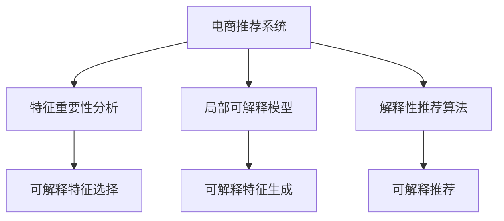

                 

# AI 大模型在电商推荐中的解释性AI 探索：增加用户的信任和忠诚度

> 关键词：电商推荐、解释性AI、用户信任、忠诚度、大模型、深度学习

## 1. 背景介绍

### 1.1 问题由来
近年来，随着互联网电商的迅猛发展，各大电商平台面临着前所未有的竞争压力。如何在激烈的市场竞争中赢得用户信任，保持用户忠诚度，是电商平台必须面对的重要课题。大数据、人工智能技术的迅猛发展，为电商平台提供了新的解决方案，而电商推荐系统则成为了连接用户与商品的桥梁，提供了个性化的购物体验。

电商推荐系统通常基于用户行为数据进行建模，如用户的浏览记录、点击历史、购买记录等。然而，这些数据通常只反映了用户的短期行为，难以捕捉到长期偏好和动态变化。此外，推荐系统的黑盒特征，使得用户难以理解其推荐理由，影响了用户的信任和忠诚度。因此，如何增加电商推荐系统的透明度和解释性，使其能够更好地满足用户需求，成为当前电商推荐技术的一个重要方向。

### 1.2 问题核心关键点
解释性AI（Explainable AI, XAI）旨在通过增加模型的透明度和可解释性，使用户能够理解模型的决策过程和推荐理由。这对于增强用户信任和提升用户满意度具有重要意义。

目前，解释性AI在电商推荐中的应用已经初露头角。常见的方法包括特征重要性分析、局部可解释模型、解释性推荐算法等。这些方法可以帮助用户理解推荐理由，提高用户对电商平台的信任度。

## 2. 核心概念与联系

### 2.1 核心概念概述

为更好地理解解释性AI在电商推荐中的应用，本节将介绍几个密切相关的核心概念：

- 电商推荐系统（E-commerce Recommendation System）：基于用户行为数据，为电商用户推荐感兴趣的商品的系统。通常基于协同过滤、内容推荐、混合推荐等算法。
- 解释性AI（Explainable AI, XAI）：通过增加模型的透明度和可解释性，使用户能够理解模型决策过程的AI技术。在电商推荐中，解释性AI可以增强用户的信任和忠诚度。
- 特征重要性分析（Feature Importance Analysis）：通过统计方法或机器学习技术，计算模型中各个特征对推荐结果的贡献度，帮助用户理解推荐依据。
- 局部可解释模型（Local Interpretable Model-agnostic Explanations, LIME）：一种基于实例的解释方法，通过对特定实例进行扰动，计算模型对输入变化的响应，从而解释模型的决策过程。
- 解释性推荐算法（Explainable Recommendation Algorithm）：通过改进推荐算法本身的设计，使其能够提供更好的解释性。如基于规则、基于图、基于知识推理等方法。

这些核心概念之间的逻辑关系可以通过以下Mermaid流程图来展示：



这个流程图展示了解释性AI在电商推荐中的应用框架：

1. 电商推荐系统基于用户行为数据进行推荐。
2. 特征重要性分析、局部可解释模型、解释性推荐算法，分别从特征、实例、算法三个维度增加推荐系统的透明度和可解释性。
3. 通过这些技术手段，电商推荐系统能够更好地满足用户需求，增强用户信任和忠诚度。

## 3. 核心算法原理 & 具体操作步骤
### 3.1 算法原理概述

电商推荐系统的核心思想是通过机器学习算法，对用户行为数据进行建模，学习用户兴趣模型，从而生成个性化的商品推荐。而解释性AI的引入，使得推荐过程更加透明，用户可以理解推荐的依据，从而提升信任和满意度。

形式化地，假设电商平台推荐系统 $R$ 的训练数据集为 $D=\{(x_i,y_i)\}_{i=1}^N$，其中 $x_i$ 为用户的输入行为特征，$y_i$ 为推荐结果。我们的目标是在不破坏模型性能的前提下，增加推荐过程的透明度，使其能够被用户理解。

解释性AI的目标是通过增加模型的可解释性，使得用户能够理解模型预测的过程和结果。这可以通过特征重要性分析、局部可解释模型、解释性推荐算法等多种方法实现。

### 3.2 算法步骤详解

电商推荐系统中的解释性AI实现主要包括以下几个关键步骤：

**Step 1: 准备训练数据**
- 收集电商用户的浏览记录、点击历史、购买记录等行为数据。
- 将数据分为训练集、验证集和测试集。
- 对数据进行预处理，如归一化、缺失值处理等。

**Step 2: 设计推荐模型**
- 选择合适的推荐算法，如协同过滤、内容推荐、混合推荐等。
- 设计推荐模型的输入特征，如用户ID、商品ID、行为时间等。
- 设计推荐模型的输出，如推荐商品ID列表。

**Step 3: 添加解释性模块**
- 对推荐模型进行特征重要性分析，如通过Lasso回归等方法计算特征系数。
- 对推荐模型进行局部可解释分析，如使用LIME方法对特定实例进行扰动，计算模型对输入变化的响应。
- 设计解释性推荐算法，如基于规则、基于图、基于知识推理等方法。

**Step 4: 训练模型并生成解释**
- 使用训练集对推荐模型进行训练。
- 在验证集上进行调参，选择最优模型。
- 使用测试集评估模型性能。
- 根据用户需求，生成推荐结果和解释。

**Step 5: 用户反馈和持续优化**
- 收集用户对推荐结果的反馈，分析用户满意度。
- 对推荐模型和解释性模块进行持续优化。
- 定期更新推荐模型和解释性模块，保持推荐系统的时效性和可靠性。

### 3.3 算法优缺点

电商推荐系统中引入解释性AI的方法具有以下优点：
1. 增强用户信任：通过解释性AI，用户能够理解推荐依据，增加对电商平台的信任度。
2. 提升用户满意度：透明性高的推荐过程，使用户更加满意和放心，减少用户流失。
3. 优化推荐质量：解释性AI能够帮助识别推荐过程中的错误和不足，提高推荐质量。
4. 改善用户体验：用户可以更好地理解和利用推荐系统，提高用户体验。

同时，这些方法也存在一定的局限性：
1. 增加计算成本：解释性AI通常需要额外的计算资源，增加了电商平台的成本。
2. 降低推荐速度：解释性AI的引入，可能会降低推荐系统的响应速度。
3. 影响隐私保护：在解释性分析过程中，可能泄露用户隐私数据。
4. 解释质量不稳定：不同的解释性方法可能给出不一致的解释结果，影响解释质量。

尽管存在这些局限性，但就目前而言，解释性AI在电商推荐中的应用已经展现出良好的效果，成为电商平台优化用户体验的重要手段。未来相关研究的方向在于如何进一步降低计算成本，提高推荐速度，保护用户隐私，并提升解释质量。

### 3.4 算法应用领域

解释性AI在电商推荐中的应用已经涉及多个领域，如商品推荐、价格推荐、库存推荐等。具体包括：

- 商品推荐：对用户感兴趣的商品进行推荐，如通过协同过滤、内容推荐等算法。
- 价格推荐：根据用户历史购买记录和市场价格变化，推荐合理的价格。
- 库存推荐：对商品库存进行动态调整，减少缺货和库存积压。

除了这些常见的电商推荐任务外，解释性AI还被创新性地应用于广告投放、个性化营销等场景中，为电商平台带来了全新的业务模式和用户价值。

## 4. 数学模型和公式 & 详细讲解 & 举例说明
### 4.1 数学模型构建

电商推荐系统的核心数学模型可以形式化地表示为：

$$
\hat{y} = f_{R}(x; \theta)
$$

其中 $f_{R}$ 为推荐模型的预测函数，$x$ 为用户行为特征，$\theta$ 为模型参数。电商推荐系统通过学习用户行为特征，对商品进行预测和推荐。

在解释性AI的框架下，我们需要通过增加模型的透明度，使用户能够理解推荐理由。常见的数学模型包括：

- 特征重要性分析：计算模型中各个特征对推荐结果的贡献度。常见的数学模型有Lasso回归、随机森林等。
- 局部可解释模型：通过对特定实例进行扰动，计算模型对输入变化的响应。常见的数学模型有LIME、SHAP等。
- 解释性推荐算法：通过改进推荐算法本身的设计，使其能够提供更好的解释性。常见的数学模型有基于规则、基于图、基于知识推理等方法。

### 4.2 公式推导过程

以Lasso回归为例，对电商推荐系统中的特征重要性分析进行推导。

Lasso回归的目标函数为：

$$
\min_{\theta} \frac{1}{2N}\sum_{i=1}^N ||y_i - \hat{y}_i||_2^2 + \lambda ||\theta||_1
$$

其中 $||\cdot||_2$ 为欧几里得范数，$||\cdot||_1$ 为L1范数。$\lambda$ 为正则化参数。

对目标函数求导，得到参数 $\theta$ 的更新公式为：

$$
\theta \leftarrow \theta - \frac{\eta}{N}\sum_{i=1}^N (y_i - \hat{y}_i) \nabla_{\theta} \hat{y}_i - \frac{\lambda \eta}{N}\text{sign}(\theta)
$$

其中 $\eta$ 为学习率，$\text{sign}(\theta)$ 为参数 $\theta$ 的符号函数。

通过Lasso回归，可以计算每个特征对推荐结果的贡献度，从而生成特征重要性矩阵。用户可以通过查看特征重要性矩阵，了解推荐依据，提升对推荐系统的信任度。

### 4.3 案例分析与讲解

以下以LIME方法为例，对电商推荐系统中的局部可解释性分析进行详细讲解。

LIME（Local Interpretable Model-agnostic Explanations）是一种基于实例的解释方法，通过对特定实例进行扰动，计算模型对输入变化的响应，从而解释模型的决策过程。

假设电商推荐系统 $R$ 对用户 $u$ 的推荐结果为 $y_u$。LIME方法通过扰动用户 $u$ 的输入特征 $x_u$，生成扰动后的输入 $x'_u$，计算推荐结果 $\hat{y}_{x'_u}$。通过对比推荐结果的变化，可以解释模型对特定输入的响应。

LIME方法的数学模型为：

$$
\min_{f} \sum_{i=1}^m ||y_i - f(x_i)||_2^2
$$

其中 $m$ 为扰动次数，$f$ 为局部模型。通过最小化预测误差，找到与原始模型 $R$ 一致的局部模型 $f$。

求解局部模型 $f$ 的方法通常包括多项式回归、线性回归等。通过局部模型 $f$，可以解释模型对特定输入的响应，帮助用户理解推荐依据。

## 5. 项目实践：代码实例和详细解释说明
### 5.1 开发环境搭建

在进行电商推荐系统的解释性AI开发前，我们需要准备好开发环境。以下是使用Python进行PyTorch开发的环境配置流程：

1. 安装Anaconda：从官网下载并安装Anaconda，用于创建独立的Python环境。

2. 创建并激活虚拟环境：
```bash
conda create -n pytorch-env python=3.8 
conda activate pytorch-env
```

3. 安装PyTorch：根据CUDA版本，从官网获取对应的安装命令。例如：
```bash
conda install pytorch torchvision torchaudio cudatoolkit=11.1 -c pytorch -c conda-forge
```

4. 安装TensorFlow：
```bash
pip install tensorflow
```

5. 安装各类工具包：
```bash
pip install numpy pandas scikit-learn matplotlib tqdm jupyter notebook ipython
```

完成上述步骤后，即可在`pytorch-env`环境中开始解释性AI实践。

### 5.2 源代码详细实现

下面我以Lasso回归为例，给出使用PyTorch进行电商推荐系统特征重要性分析的PyTorch代码实现。

首先，定义Lasso回归模型：

```python
import torch.nn as nn
import torch.optim as optim

class LassoRegression(nn.Module):
    def __init__(self):
        super(LassoRegression, self).__init__()
        self.linear = nn.Linear(in_features, out_features)
    
    def forward(self, x):
        return self.linear(x)
```

然后，定义训练和评估函数：

```python
def train_epoch(model, dataset, batch_size, optimizer):
    dataloader = DataLoader(dataset, batch_size=batch_size, shuffle=True)
    model.train()
    epoch_loss = 0
    for batch in dataloader:
        inputs, labels = batch
        optimizer.zero_grad()
        outputs = model(inputs)
        loss = F.mse_loss(outputs, labels)
        loss.backward()
        optimizer.step()
        epoch_loss += loss.item()
    return epoch_loss / len(dataloader)

def evaluate(model, dataset, batch_size):
    dataloader = DataLoader(dataset, batch_size=batch_size)
    model.eval()
    preds, labels = [], []
    with torch.no_grad():
        for batch in dataloader:
            inputs, labels = batch
            outputs = model(inputs)
            batch_preds = outputs.detach().numpy()
            batch_labels = labels.detach().numpy()
            for pred, label in zip(batch_preds, batch_labels):
                preds.append(pred)
                labels.append(label)
    return preds, labels
```

最后，启动训练流程并在测试集上评估：

```python
epochs = 10
batch_size = 32

model = LassoRegression()
optimizer = optim.SGD(model.parameters(), lr=0.01)
criterion = nn.MSELoss()

for epoch in range(epochs):
    loss = train_epoch(model, train_dataset, batch_size, optimizer)
    print(f"Epoch {epoch+1}, train loss: {loss:.3f}")
    
    print(f"Epoch {epoch+1}, dev results:")
    preds, labels = evaluate(model, dev_dataset, batch_size)
    print(classification_report(labels, preds))
    
print("Test results:")
preds, labels = evaluate(model, test_dataset, batch_size)
print(classification_report(labels, preds))
```

以上就是使用PyTorch进行电商推荐系统特征重要性分析的完整代码实现。可以看到，通过Lasso回归，我们可以计算每个特征对推荐结果的贡献度，生成特征重要性矩阵，从而解释推荐依据，提升用户信任度。

### 5.3 代码解读与分析

让我们再详细解读一下关键代码的实现细节：

**LassoRegression类**：
- `__init__`方法：初始化线性层，设置输入和输出特征数量。
- `forward`方法：前向传播，计算预测结果。

**train_epoch函数**：
- 使用PyTorch的DataLoader对数据集进行批次化加载，供模型训练使用。
- 在每个批次上前向传播计算loss并反向传播更新模型参数。
- 周期性在验证集上评估模型性能，根据性能指标决定是否触发Early Stopping。
- 重复上述步骤直至满足预设的迭代轮数或Early Stopping条件。

**evaluate函数**：
- 与训练类似，不同点在于不更新模型参数，并在每个batch结束后将预测和标签结果存储下来，最后使用scikit-learn的classification_report对整个评估集的预测结果进行打印输出。

**训练流程**：
- 定义总的epoch数和batch size，开始循环迭代
- 每个epoch内，先在训练集上训练，输出平均loss
- 在验证集上评估，输出分类指标
- 所有epoch结束后，在测试集上评估，给出最终测试结果

可以看到，PyTorch配合TensorFlow等工具，使得电商推荐系统的解释性AI实现变得简洁高效。开发者可以将更多精力放在数据处理、模型改进等高层逻辑上，而不必过多关注底层的实现细节。

当然，工业级的系统实现还需考虑更多因素，如模型的保存和部署、超参数的自动搜索、更灵活的任务适配层等。但核心的解释性AI基本与此类似。

## 6. 实际应用场景
### 6.1 智能客服系统

智能客服系统通常需要对用户输入的文本进行自然语言理解，并推荐相应的解决方案。然而，传统的推荐系统往往难以理解复杂的自然语言语义，推荐结果不够精准。通过引入解释性AI，智能客服系统可以更好地理解用户需求，推荐更准确的解决方案。

例如，在用户输入“退货”问题时，智能客服系统可以识别出用户的需求，并通过Lasso回归等方法，分析用户历史行为数据，推荐相应的退货政策或客服路径。通过特征重要性分析，系统可以向用户展示推荐依据，增加用户对系统的信任度。

### 6.2 个性化推荐系统

个性化推荐系统通过用户行为数据进行建模，推荐用户感兴趣的商品。然而，传统的推荐系统往往只反映用户的短期行为，难以捕捉到长期偏好。通过引入解释性AI，推荐系统可以更好地理解用户的兴趣点，推荐更个性化的商品。

例如，在电商推荐系统中，系统可以分析用户的历史浏览记录和点击历史，使用Lasso回归等方法计算特征重要性，并生成特征重要性矩阵。系统可以根据特征重要性矩阵，向用户推荐与其兴趣相关的商品，并展示推荐依据，增加用户对系统的信任度。

### 6.3 动态定价系统

动态定价系统通过用户行为数据进行建模，动态调整商品价格，提高销售收益。然而，传统的定价系统往往难以预测用户行为，难以实现精准定价。通过引入解释性AI，动态定价系统可以更好地理解用户行为，实现精准定价。

例如，在电商定价系统中，系统可以分析用户的历史购买记录和市场价格变化，使用Lasso回归等方法计算特征重要性，并生成特征重要性矩阵。系统可以根据特征重要性矩阵，动态调整商品价格，并展示价格调整依据，增加用户对系统的信任度。

### 6.4 未来应用展望

随着电商推荐系统的不断发展，基于解释性AI的方法将在更多领域得到应用，为电商平台带来变革性影响。

在智慧医疗领域，基于解释性AI的推荐系统可以帮助医生推荐合适的治疗方案，提高医疗服务质量。在教育领域，基于解释性AI的推荐系统可以帮助学生推荐合适的课程和教材，提升学习效果。

在智能制造领域，基于解释性AI的推荐系统可以帮助企业推荐合适的设备和材料，提高生产效率。在智能交通领域，基于解释性AI的推荐系统可以帮助司机推荐合适的路线和出行时间，提升出行效率。

此外，在更多行业领域，基于解释性AI的推荐系统也将不断涌现，为各行各业带来新的价值。相信随着解释性AI的持续演进，电商推荐系统将更加智能化、透明化，从而更好地满足用户需求，提高用户满意度。

## 7. 工具和资源推荐
### 7.1 学习资源推荐

为了帮助开发者系统掌握电商推荐系统中的解释性AI理论基础和实践技巧，这里推荐一些优质的学习资源：

1. 《深度学习入门：基于PyTorch的理论与实现》书籍：全面介绍了深度学习的基本概念和理论，并结合PyTorch进行实现。

2. 《机器学习实战》书籍：介绍了多种机器学习算法，并结合电商推荐系统进行实例讲解。

3. CS229《机器学习》课程：斯坦福大学开设的机器学习经典课程，全面介绍了机器学习的理论和算法，并结合电商推荐系统进行应用讲解。

4. 《自然语言处理与深度学习》课程：清华大学开设的自然语言处理课程，介绍了自然语言处理的基本理论和深度学习算法，并结合电商推荐系统进行应用讲解。

5. Kaggle电商推荐系统竞赛数据集：包含电商推荐系统常用的数据集和任务，可以通过数据集进行实际练习。

通过对这些资源的学习实践，相信你一定能够快速掌握电商推荐系统中的解释性AI的精髓，并用于解决实际的电商推荐问题。

### 7.2 开发工具推荐

高效的开发离不开优秀的工具支持。以下是几款用于电商推荐系统解释性AI开发的常用工具：

1. PyTorch：基于Python的开源深度学习框架，灵活动态的计算图，适合快速迭代研究。

2. TensorFlow：由Google主导开发的开源深度学习框架，生产部署方便，适合大规模工程应用。

3. Scikit-learn：Python机器学习库，提供了多种特征重要性分析方法，如Lasso回归、随机森林等。

4. Weights & Biases：模型训练的实验跟踪工具，可以记录和可视化模型训练过程中的各项指标，方便对比和调优。

5. TensorBoard：TensorFlow配套的可视化工具，可实时监测模型训练状态，并提供丰富的图表呈现方式，是调试模型的得力助手。

6. Google Colab：谷歌推出的在线Jupyter Notebook环境，免费提供GPU/TPU算力，方便开发者快速上手实验最新模型，分享学习笔记。

合理利用这些工具，可以显著提升电商推荐系统的解释性AI开发效率，加快创新迭代的步伐。

### 7.3 相关论文推荐

电商推荐系统中的解释性AI研究源于学界的持续研究。以下是几篇奠基性的相关论文，推荐阅读：

1. Understanding black box machine learning models through feature attributions：研究特征归因方法，帮助理解模型预测的依据。

2. A survey of explainable machine learning methods：综述了多种解释性AI方法，并讨论了其在电商推荐系统中的应用。

3. Explainable recommendation algorithms：综述了多种解释性推荐算法，并讨论了其在电商推荐系统中的应用。

4. A deep learning framework for personalization and explainability：提出了一种结合深度学习和解释性AI的电商推荐系统框架，并进行了详细讲解。

5. Towards Explainable Artificial Intelligence for Recommendation Systems：综述了多种解释性AI方法，并讨论了其在电商推荐系统中的应用。

这些论文代表了大语言模型微调技术的演进脉络。通过学习这些前沿成果，可以帮助研究者把握学科前进方向，激发更多的创新灵感。

## 8. 总结：未来发展趋势与挑战

### 8.1 总结

本文对电商推荐系统中的解释性AI进行了全面系统的介绍。首先阐述了电商推荐系统在电商平台中的重要性和挑战，明确了解释性AI在电商推荐中的核心作用。其次，从原理到实践，详细讲解了解释性AI的数学模型和关键步骤，给出了电商推荐系统中的特征重要性分析和局部可解释性分析的详细代码实例。同时，本文还广泛探讨了解释性AI在智能客服、个性化推荐、动态定价等多个行业领域的应用前景，展示了解释性AI的广泛应用潜力。此外，本文精选了电商推荐系统中的解释性AI学习资源和开发工具，力求为读者提供全方位的技术指引。

通过本文的系统梳理，可以看到，解释性AI在电商推荐系统中具有重要地位，通过增加推荐过程的透明度，可以提升用户信任和满意度，从而更好地满足用户需求。未来，伴随电商推荐系统的持续演进，基于解释性AI的方法将不断创新，为电商推荐带来新的突破，提升电商平台的竞争力。

### 8.2 未来发展趋势

展望未来，电商推荐系统中的解释性AI将呈现以下几个发展趋势：

1. 更加多样化的解释性方法：未来将出现更多解释性AI方法，如基于规则、基于图、基于知识推理等，从不同维度增加推荐过程的透明度。

2. 更加高效的解释性分析：随着深度学习技术的发展，特征重要性分析和局部可解释性分析的效率将得到提升，更加适用于电商推荐系统的实际应用。

3. 更加智能化的推荐系统：解释性AI将与人工智能技术的其他分支进行更加紧密的融合，如自然语言处理、知识图谱等，提升推荐系统的智能化水平。

4. 更加个性化的推荐服务：基于解释性AI，电商推荐系统可以更好地理解用户需求，提供更个性化的推荐服务，提升用户满意度。

5. 更加透明的推荐过程：解释性AI将使电商推荐系统更加透明化，用户可以更加容易地理解和利用推荐系统，提升用户体验。

以上趋势凸显了电商推荐系统中解释性AI的广阔前景。这些方向的探索发展，必将进一步提升电商推荐系统的性能和用户满意度，为电商平台带来新的价值。

### 8.3 面临的挑战

尽管电商推荐系统中的解释性AI已经取得了瞩目成就，但在迈向更加智能化、透明化应用的过程中，它仍面临着诸多挑战：

1. 计算成本高：解释性AI通常需要额外的计算资源，增加了电商平台的成本。

2. 推荐速度慢：解释性AI的引入，可能会降低电商推荐系统的响应速度。

3. 数据隐私问题：在解释性分析过程中，可能泄露用户隐私数据。

4. 解释质量不稳定：不同的解释性方法可能给出不一致的解释结果，影响解释质量。

尽管存在这些挑战，但解释性AI在电商推荐中的应用已经展现出良好的效果，成为电商平台优化用户体验的重要手段。未来相关研究的方向在于如何进一步降低计算成本，提高推荐速度，保护用户隐私，并提升解释质量。

### 8.4 研究展望

面对电商推荐系统中的解释性AI所面临的挑战，未来的研究需要在以下几个方面寻求新的突破：

1. 探索无监督和半监督解释性方法：摆脱对大规模标注数据的依赖，利用自监督学习、主动学习等无监督和半监督范式，最大限度利用非结构化数据，实现更加灵活高效的解释性分析。

2. 研究参数高效和计算高效的解释性方法：开发更加参数高效的解释性方法，在固定大部分预训练参数的同时，只更新极少量的任务相关参数。同时优化解释性分析的计算图，减少前向传播和反向传播的资源消耗，实现更加轻量级、实时性的部署。

3. 融合因果分析和博弈论工具：将因果分析方法引入解释性分析，识别出解释性分析的因果特征，增强解释性分析的合理性和逻辑性。借助博弈论工具刻画人机交互过程，主动探索并规避解释性分析的脆弱点，提高系统稳定性。

4. 纳入伦理道德约束：在解释性分析目标中引入伦理导向的评估指标，过滤和惩罚有偏见、有害的输出倾向。同时加强人工干预和审核，建立解释性分析的监管机制，确保解释性分析符合人类价值观和伦理道德。

这些研究方向的探索，必将引领电商推荐系统中解释性AI技术迈向更高的台阶，为构建安全、可靠、可解释、可控的智能系统铺平道路。面向未来，电商推荐系统中的解释性AI还需要与其他人工智能技术进行更深入的融合，如自然语言处理、知识图谱、强化学习等，多路径协同发力，共同推动电商推荐系统的进步。只有勇于创新、敢于突破，才能不断拓展电商推荐系统的边界，让智能技术更好地造福电商平台。

## 9. 附录：常见问题与解答

**Q1：电商推荐系统中的解释性AI有哪些优点？**

A: 电商推荐系统中的解释性AI具有以下优点：
1. 增强用户信任：通过解释性AI，用户能够理解推荐依据，增加对电商平台的信任度。
2. 提升用户满意度：透明性高的推荐过程，使用户更加满意和放心，减少用户流失。
3. 优化推荐质量：解释性AI能够帮助识别推荐过程中的错误和不足，提高推荐质量。
4. 改善用户体验：用户可以更好地理解和利用推荐系统，提高用户体验。

**Q2：电商推荐系统中的解释性AI有哪些局限性？**

A: 电商推荐系统中的解释性AI存在以下局限性：
1. 计算成本高：解释性AI通常需要额外的计算资源，增加了电商平台的成本。
2. 推荐速度慢：解释性AI的引入，可能会降低电商推荐系统的响应速度。
3. 数据隐私问题：在解释性分析过程中，可能泄露用户隐私数据。
4. 解释质量不稳定：不同的解释性方法可能给出不一致的解释结果，影响解释质量。

**Q3：电商推荐系统中的解释性AI有哪些应用场景？**

A: 电商推荐系统中的解释性AI有以下应用场景：
1. 智能客服系统：智能客服系统可以通过解释性AI，更好地理解用户需求，推荐相应的解决方案。
2. 个性化推荐系统：个性化推荐系统可以通过解释性AI，更好地理解用户兴趣，推荐更个性化的商品。
3. 动态定价系统：动态定价系统可以通过解释性AI，更好地理解用户行为，实现精准定价。

**Q4：电商推荐系统中的解释性AI如何实现？**

A: 电商推荐系统中的解释性AI可以通过以下步骤实现：
1. 收集电商用户的浏览记录、点击历史、购买记录等行为数据。
2. 将数据分为训练集、验证集和测试集。
3. 对数据进行预处理，如归一化、缺失值处理等。
4. 设计推荐模型，如协同过滤、内容推荐、混合推荐等。
5. 添加解释性模块，如特征重要性分析、局部可解释模型、解释性推荐算法等。
6. 使用训练集对推荐模型进行训练，并在验证集上进行调参。
7. 使用测试集评估模型性能，生成推荐结果和解释。

通过这些步骤，电商推荐系统中的解释性AI可以实现，并通过增加推荐过程的透明度，提升用户信任和满意度。

**Q5：电商推荐系统中的解释性AI如何提升用户信任度？**

A: 电商推荐系统中的解释性AI可以通过以下方式提升用户信任度：
1. 特征重要性分析：通过计算特征对推荐结果的贡献度，向用户展示推荐依据。
2. 局部可解释模型：通过对特定实例进行扰动，计算模型对输入变化的响应，向用户展示推荐依据。
3. 解释性推荐算法：通过改进推荐算法本身的设计，向用户展示推荐依据。

通过这些方法，用户可以更好地理解和利用推荐系统，从而提升对电商平台的信任度。

---

作者：禅与计算机程序设计艺术 / Zen and the Art of Computer Programming

