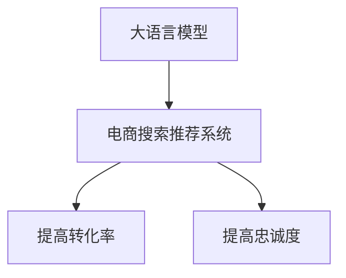

                 

## 1. 背景介绍

在电子商务领域，搜索推荐系统作为提升用户体验、提高转化率和忠诚度的关键技术，得到了广泛应用。传统的推荐系统基于协同过滤、内容推荐等方法，但在应对个性化需求、提升精准度等方面存在一定局限。随着大语言模型（Large Language Models, LLMs）的兴起，利用其强大的自然语言处理能力，可以在电商搜索推荐中引入更多的智能元素，提升系统的智能性和效果。本文将介绍大语言模型在电商搜索推荐中的应用，并详细阐述其如何通过提高转化率和忠诚度，进一步推动电商业务的发展。

## 2. 核心概念与联系

### 2.1 核心概念概述

为更好地理解大语言模型在电商搜索推荐中的价值，本节将介绍几个密切相关的核心概念：

- 大语言模型(Large Language Model, LLM)：如BERT、GPT等，通过在大规模无标签文本数据上进行预训练，学习到丰富的语言知识和表达能力，具备强大的文本理解与生成能力。
- 电商搜索推荐系统（E-commerce Search and Recommendation System）：通过分析用户行为数据和商品信息，为用户推荐符合其兴趣和需求的商品，提升用户购买转化率和忠诚度。
- 转化率（Conversion Rate）：指用户在看到推荐商品后，完成购买操作的比例。
- 忠诚度（Loyalty）：指用户对电商平台的依赖程度和重复购买率。

这些核心概念之间的逻辑关系可以通过以下Mermaid流程图来展示：



### 2.2 核心概念原理和架构的 Mermaid 流程图

在电商搜索推荐系统中，大语言模型通过以下步骤实现转化率和忠诚度的提升：

1. 预训练：大语言模型在大规模无标签文本数据上进行预训练，学习通用的语言表示和语义关系。
2. 微调：在电商搜索推荐系统的标注数据上，通过微调优化模型，使其具备对电商场景的理解和生成能力。
3. 文本生成：利用微调后的大语言模型生成推荐内容（如商品标题、描述、评论等）。
4. 信息检索：将生成的推荐内容与用户的历史行为数据、兴趣偏好等进行匹配，找到最相关的商品。
5. 推荐排序：根据推荐结果的相关性和用户行为特征，对商品进行排序，优先展示最可能被购买的商品。
6. 反馈循环：收集用户对推荐结果的反馈（如点击、购买、评价等），再次进行微调，提升模型的精准度。

以下是详细的流程架构：


## 3. 核心算法原理 & 具体操作步骤

### 3.1 算法原理概述

基于大语言模型在电商搜索推荐中的应用，算法原理可以概括为：

- **预训练**：在大规模无标签文本数据上，通过自监督学习任务，如语言模型预训练（Language Model Pretraining），学习通用语言表示。
- **微调**：在电商场景的标注数据上，通过监督学习任务，如文本分类、信息检索等，优化模型，使其能够理解和生成电商相关的文本。
- **文本生成**：利用微调后的大语言模型，生成推荐内容，包括商品标题、描述、评价等，提升推荐内容的质量。
- **信息检索**：通过大语言模型的文本生成能力和电商场景的标注数据，进行信息检索，找到最相关的商品。
- **推荐排序**：根据推荐结果的相关性和用户行为特征，对商品进行排序，优先展示最可能被购买的商品。

### 3.2 算法步骤详解

以下是电商搜索推荐系统中大语言模型应用的具体步骤：

1. **数据准备**：
   - 收集用户行为数据（如浏览记录、购买历史等）。
   - 收集商品信息（如商品标题、描述、类别等）。
   - 收集用户反馈数据（如评分、评论等）。

2. **数据预处理**：
   - 对用户行为数据和商品信息进行清洗、归一化、特征工程等处理。
   - 构建标注数据集，用于大语言模型的微调。

3. **大语言模型预训练**：
   - 在大规模无标签文本数据上，使用自监督学习任务（如语言模型），预训练大语言模型。
   - 通过预训练，大语言模型学习到丰富的语言表示和语义关系。

4. **电商场景微调**：
   - 在电商场景的标注数据上，使用监督学习任务（如文本分类、信息检索），微调大语言模型。
   - 通过微调，大语言模型学习到电商相关的语言表示，能够理解和生成电商相关的文本。

5. **文本生成**：
   - 利用微调后的大语言模型，生成推荐内容（如商品标题、描述、评论等）。
   - 可以通过用户行为数据和商品信息生成，也可以通过文本生成模型（如GPT-3）生成。

6. **信息检索**：
   - 将生成的推荐内容与用户的历史行为数据、兴趣偏好等进行匹配，找到最相关的商品。
   - 可以使用余弦相似度、BM25等经典方法进行信息检索，也可以使用大语言模型的信息检索能力进行优化。

7. **推荐排序**：
   - 根据推荐结果的相关性和用户行为特征，对商品进行排序，优先展示最可能被购买的商品。
   - 可以使用基于内容的排序方法、协同过滤、混合排序等方法进行推荐排序。

### 3.3 算法优缺点

基于大语言模型在电商搜索推荐中的应用，其优缺点如下：

**优点**：
1. **多模态信息融合**：大语言模型可以融合文本、图像、音频等多种模态信息，提供更全面的商品推荐。
2. **高精度文本生成**：通过大语言模型生成推荐内容，能够提供高质量的商品描述、评论等，提升用户体验。
3. **灵活性**：大语言模型可以动态生成推荐内容，适应不同场景和用户需求，提升推荐系统的灵活性。
4. **跨领域泛化**：大语言模型可以应用于各种电商领域，如服装、食品、电子产品等，具有较强的跨领域泛化能力。

**缺点**：
1. **计算资源消耗大**：大语言模型参数量巨大，训练和推理需要大量计算资源。
2. **数据质量依赖度高**：大语言模型的效果高度依赖于数据质量，标注数据不足可能导致效果下降。
3. **泛化能力受限**：大语言模型可能过拟合于训练数据，导致泛化能力不足。
4. **隐私问题**：大语言模型需要处理大量用户行为数据和个人信息，涉及隐私保护问题。

### 3.4 算法应用领域

基于大语言模型的电商搜索推荐系统，已经在多个电商平台得到了应用，如亚马逊、淘宝、京东等，并取得了显著的效果。具体应用场景包括：

1. **商品推荐**：根据用户浏览记录、购买历史等，生成个性化推荐商品。
2. **品牌推荐**：根据用户对某个品牌的偏好，推荐相关商品或品牌。
3. **跨领域推荐**：将用户在不同领域的行为数据进行融合，提供跨领域的推荐服务。
4. **情感分析**：通过分析用户评论、评分等，了解用户对商品的态度和反馈。
5. **客服机器人**：利用大语言模型，实现智能客服对话，解决用户疑问，提升客户体验。

## 4. 数学模型和公式 & 详细讲解 & 举例说明

### 4.1 数学模型构建

在电商搜索推荐系统中，大语言模型主要应用于以下几个数学模型：

- **语言模型**：
  - 定义：$P(w_1,w_2,...,w_t)$，表示输入序列$w_1,w_2,...,w_t$的概率。
  - 定义：$\log P(w_1,w_2,...,w_t) = \sum_{i=1}^t \log P(w_i|w_{<i})$，其中$w_{<i}$表示序列中的前$i-1$个词。

- **文本分类模型**：
  - 定义：$P(y|x)$，表示给定文本$x$的分类标签$y$的概率。
  - 定义：$P(y|x) = \frac{P(x|y)P(y)}{P(x)}$，其中$P(x)$是文本的边缘概率，通常表示为$P(x|y)$和$P(y)$的乘积。

- **信息检索模型**：
  - 定义：$P(d|q)$，表示给定查询$q$，文档$d$的相关性概率。
  - 定义：$P(d|q) = \frac{P(q|d)P(d)}{P(q)}$，其中$P(q|d)$是查询和文档的相关性概率，$P(d)$是文档的边缘概率。

### 4.2 公式推导过程

以下我们将对上述模型的公式进行推导。

#### 语言模型推导

设训练数据集为$D=\{(x_1,y_1),(x_2,y_2),...(x_n,y_n)\}$，其中$x_i$表示输入序列，$y_i$表示目标序列。目标序列长度为$L$，即$y_i=(y_1^{(i)},y_2^{(i)},...,y_L^{(i)})$。

语言模型的目标是最大化条件概率$P(y|x)$，即：

$$
\max_{\theta} \sum_{(x,y) \in D} \log P(y|x)
$$

其中$\theta$表示模型参数。

根据条件概率的链式法则，有：

$$
P(y|x) = \prod_{i=1}^L P(y_i|y_{<i})
$$

因此，最大化条件概率变为最大化每个条件概率的乘积：

$$
\max_{\theta} \sum_{(x,y) \in D} \sum_{i=1}^L \log P(y_i|y_{<i})
$$

为了简化计算，通常使用最大似然估计方法：

$$
\max_{\theta} \sum_{(x,y) \in D} \sum_{i=1}^L \log P(y_i|y_{<i})
$$

其中$P(y_i|y_{<i})$可以通过softmax函数计算得到。

#### 文本分类模型推导

文本分类模型的目标是最大化分类标签$y$的条件概率$P(y|x)$。根据贝叶斯公式，有：

$$
P(y|x) = \frac{P(x|y)P(y)}{P(x)}
$$

其中$P(y)$表示分类标签的概率，通常表示为$P(y|D)$；$P(x)$是文本的边缘概率，通常表示为$P(x|D)$。

在微调过程中，我们希望最大化条件概率$P(y|x)$，即：

$$
\max_{\theta} \sum_{(x,y) \in D} \log P(y|x)
$$

其中$\theta$表示模型参数。

### 4.3 案例分析与讲解

假设我们有一个电商商品推荐系统，需要根据用户行为数据，推荐最相关的商品。具体步骤包括：

1. **数据收集**：
   - 收集用户行为数据（如浏览记录、购买历史等）。
   - 收集商品信息（如商品标题、描述、类别等）。
   - 收集用户反馈数据（如评分、评论等）。

2. **数据预处理**：
   - 对用户行为数据和商品信息进行清洗、归一化、特征工程等处理。
   - 构建标注数据集，用于大语言模型的微调。

3. **大语言模型预训练**：
   - 在大规模无标签文本数据上，使用自监督学习任务（如语言模型），预训练大语言模型。
   - 通过预训练，大语言模型学习到丰富的语言表示和语义关系。

4. **电商场景微调**：
   - 在电商场景的标注数据上，使用监督学习任务（如文本分类、信息检索），微调大语言模型。
   - 通过微调，大语言模型学习到电商相关的语言表示，能够理解和生成电商相关的文本。

5. **文本生成**：
   - 利用微调后的大语言模型，生成推荐内容（如商品标题、描述、评论等）。
   - 可以通过用户行为数据和商品信息生成，也可以通过文本生成模型（如GPT-3）生成。

6. **信息检索**：
   - 将生成的推荐内容与用户的历史行为数据、兴趣偏好等进行匹配，找到最相关的商品。
   - 可以使用余弦相似度、BM25等经典方法进行信息检索，也可以使用大语言模型的信息检索能力进行优化。

7. **推荐排序**：
   - 根据推荐结果的相关性和用户行为特征，对商品进行排序，优先展示最可能被购买的商品。
   - 可以使用基于内容的排序方法、协同过滤、混合排序等方法进行推荐排序。

## 5. 项目实践：代码实例和详细解释说明

### 5.1 开发环境搭建

在进行电商搜索推荐系统的开发前，我们需要准备好开发环境。以下是使用Python进行PyTorch开发的环境配置流程：

1. 安装Anaconda：从官网下载并安装Anaconda，用于创建独立的Python环境。

2. 创建并激活虚拟环境：
```bash
conda create -n ecommerce_env python=3.8 
conda activate ecommerce_env
```

3. 安装PyTorch：根据CUDA版本，从官网获取对应的安装命令。例如：
```bash
conda install pytorch torchvision torchaudio cudatoolkit=11.1 -c pytorch -c conda-forge
```

4. 安装TensorFlow：由Google主导开发的开源深度学习框架，生产部署方便，适合大规模工程应用。同样有丰富的预训练语言模型资源。

5. 安装各类工具包：
```bash
pip install numpy pandas scikit-learn matplotlib tqdm jupyter notebook ipython
```

完成上述步骤后，即可在`ecommerce_env`环境中开始电商搜索推荐系统的开发。

### 5.2 源代码详细实现

下面我们以商品推荐为例，给出使用Transformers库对BERT模型进行微调的PyTorch代码实现。

首先，定义商品推荐任务的数据处理函数：

```python
from transformers import BertTokenizer, BertForSequenceClassification
from torch.utils.data import Dataset, DataLoader
import torch

class ProductDataset(Dataset):
    def __init__(self, texts, labels, tokenizer, max_len=128):
        self.texts = texts
        self.labels = labels
        self.tokenizer = tokenizer
        self.max_len = max_len
        
    def __len__(self):
        return len(self.texts)
    
    def __getitem__(self, item):
        text = self.texts[item]
        label = self.labels[item]
        
        encoding = self.tokenizer(text, return_tensors='pt', max_length=self.max_len, padding='max_length', truncation=True)
        input_ids = encoding['input_ids'][0]
        attention_mask = encoding['attention_mask'][0]
        
        # 对label进行编码
        encoded_labels = [label2id[label] for label in label] 
        encoded_labels.extend([label2id['O']] * (self.max_len - len(encoded_labels)))
        labels = torch.tensor(encoded_labels, dtype=torch.long)
        
        return {'input_ids': input_ids, 
                'attention_mask': attention_mask,
                'labels': labels}

# 标签与id的映射
label2id = {'O': 0, 'A': 1, 'B': 2, 'C': 3}
id2label = {v: k for k, v in label2id.items()}

# 创建dataset
tokenizer = BertTokenizer.from_pretrained('bert-base-cased')

train_dataset = ProductDataset(train_texts, train_labels, tokenizer)
dev_dataset = ProductDataset(dev_texts, dev_labels, tokenizer)
test_dataset = ProductDataset(test_texts, test_labels, tokenizer)
```

然后，定义模型和优化器：

```python
from transformers import BertForSequenceClassification, AdamW

model = BertForSequenceClassification.from_pretrained('bert-base-cased', num_labels=len(label2id))

optimizer = AdamW(model.parameters(), lr=2e-5)
```

接着，定义训练和评估函数：

```python
from tqdm import tqdm
from sklearn.metrics import classification_report

device = torch.device('cuda') if torch.cuda.is_available() else torch.device('cpu')
model.to(device)

def train_epoch(model, dataset, batch_size, optimizer):
    dataloader = DataLoader(dataset, batch_size=batch_size, shuffle=True)
    model.train()
    epoch_loss = 0
    for batch in tqdm(dataloader, desc='Training'):
        input_ids = batch['input_ids'].to(device)
        attention_mask = batch['attention_mask'].to(device)
        labels = batch['labels'].to(device)
        model.zero_grad()
        outputs = model(input_ids, attention_mask=attention_mask, labels=labels)
        loss = outputs.loss
        epoch_loss += loss.item()
        loss.backward()
        optimizer.step()
    return epoch_loss / len(dataloader)

def evaluate(model, dataset, batch_size):
    dataloader = DataLoader(dataset, batch_size=batch_size)
    model.eval()
    preds, labels = [], []
    with torch.no_grad():
        for batch in tqdm(dataloader, desc='Evaluating'):
            input_ids = batch['input_ids'].to(device)
            attention_mask = batch['attention_mask'].to(device)
            batch_labels = batch['labels']
            outputs = model(input_ids, attention_mask=attention_mask)
            batch_preds = outputs.logits.argmax(dim=2).to('cpu').tolist()
            batch_labels = batch_labels.to('cpu').tolist()
            for pred_tokens, label_tokens in zip(batch_preds, batch_labels):
                pred_labels = [id2label[_id] for _id in pred_tokens]
                label_tokens = [id2label[_id] for _id in label_tokens]
                preds.append(pred_labels[:len(label_tokens)])
                labels.append(label_tokens)
                
    print(classification_report(labels, preds))
```

最后，启动训练流程并在测试集上评估：

```python
epochs = 5
batch_size = 16

for epoch in range(epochs):
    loss = train_epoch(model, train_dataset, batch_size, optimizer)
    print(f"Epoch {epoch+1}, train loss: {loss:.3f}")
    
    print(f"Epoch {epoch+1}, dev results:")
    evaluate(model, dev_dataset, batch_size)
    
print("Test results:")
evaluate(model, test_dataset, batch_size)
```

以上就是使用PyTorch对BERT进行商品推荐任务微调的完整代码实现。可以看到，得益于Transformers库的强大封装，我们可以用相对简洁的代码完成BERT模型的加载和微调。

### 5.3 代码解读与分析

让我们再详细解读一下关键代码的实现细节：

**ProductDataset类**：
- `__init__`方法：初始化文本、标签、分词器等关键组件。
- `__len__`方法：返回数据集的样本数量。
- `__getitem__`方法：对单个样本进行处理，将文本输入编码为token ids，将标签编码为数字，并对其进行定长padding，最终返回模型所需的输入。

**label2id和id2label字典**：
- 定义了标签与数字id之间的映射关系，用于将label进行编码。

**训练和评估函数**：
- 使用PyTorch的DataLoader对数据集进行批次化加载，供模型训练和推理使用。
- 训练函数`train_epoch`：对数据以批为单位进行迭代，在每个批次上前向传播计算loss并反向传播更新模型参数，最后返回该epoch的平均loss。
- 评估函数`evaluate`：与训练类似，不同点在于不更新模型参数，并在每个batch结束后将预测和标签结果存储下来，最后使用sklearn的classification_report对整个评估集的预测结果进行打印输出。

**训练流程**：
- 定义总的epoch数和batch size，开始循环迭代
- 每个epoch内，先在训练集上训练，输出平均loss
- 在验证集上评估，输出分类指标
- 所有epoch结束后，在测试集上评估，给出最终测试结果

可以看到，PyTorch配合Transformers库使得BERT微调的代码实现变得简洁高效。开发者可以将更多精力放在数据处理、模型改进等高层逻辑上，而不必过多关注底层的实现细节。

当然，工业级的系统实现还需考虑更多因素，如模型的保存和部署、超参数的自动搜索、更灵活的任务适配层等。但核心的微调范式基本与此类似。

## 6. 实际应用场景

### 6.1 智能客服系统

基于大语言模型微调的对话技术，可以广泛应用于智能客服系统的构建。传统客服往往需要配备大量人力，高峰期响应缓慢，且一致性和专业性难以保证。而使用微调后的对话模型，可以7x24小时不间断服务，快速响应客户咨询，用自然流畅的语言解答各类常见问题。

在技术实现上，可以收集企业内部的历史客服对话记录，将问题和最佳答复构建成监督数据，在此基础上对预训练对话模型进行微调。微调后的对话模型能够自动理解用户意图，匹配最合适的答案模板进行回复。对于客户提出的新问题，还可以接入检索系统实时搜索相关内容，动态组织生成回答。如此构建的智能客服系统，能大幅提升客户咨询体验和问题解决效率。

### 6.2 金融舆情监测

金融机构需要实时监测市场舆论动向，以便及时应对负面信息传播，规避金融风险。传统的人工监测方式成本高、效率低，难以应对网络时代海量信息爆发的挑战。基于大语言模型微调的文本分类和情感分析技术，为金融舆情监测提供了新的解决方案。

具体而言，可以收集金融领域相关的新闻、报道、评论等文本数据，并对其进行主题标注和情感标注。在此基础上对预训练语言模型进行微调，使其能够自动判断文本属于何种主题，情感倾向是正面、中性还是负面。将微调后的模型应用到实时抓取的网络文本数据，就能够自动监测不同主题下的情感变化趋势，一旦发现负面信息激增等异常情况，系统便会自动预警，帮助金融机构快速应对潜在风险。

### 6.3 个性化推荐系统

当前的推荐系统往往只依赖用户的历史行为数据进行物品推荐，无法深入理解用户的真实兴趣偏好。基于大语言模型微调技术，个性化推荐系统可以更好地挖掘用户行为背后的语义信息，从而提供更精准、多样的推荐内容。

在实践中，可以收集用户浏览、点击、评论、分享等行为数据，提取和用户交互的物品标题、描述、标签等文本内容。将文本内容作为模型输入，用户的后续行为（如是否点击、购买等）作为监督信号，在此基础上微调预训练语言模型。微调后的模型能够从文本内容中准确把握用户的兴趣点。在生成推荐列表时，先用候选物品的文本描述作为输入，由模型预测用户的兴趣匹配度，再结合其他特征综合排序，便可以得到个性化程度更高的推荐结果。

### 6.4 未来应用展望

随着大语言模型微调技术的发展，其应用场景将进一步拓展。未来，大语言模型在电商搜索推荐系统中的应用将更加广泛，涵盖商品推荐、品牌推荐、跨领域推荐、情感分析等多个方面。同时，大语言模型还将与知识图谱、逻辑推理等技术结合，提供更加全面、深入的电商搜索推荐服务。

此外，大语言模型在智能客服、金融舆情、个性化推荐等多个领域，也将继续发挥重要作用。预计未来几年，大语言模型微调技术将在更多行业得到应用，为各行各业带来新的变革和机遇。

## 7. 工具和资源推荐

### 7.1 学习资源推荐

为了帮助开发者系统掌握大语言模型微调的理论基础和实践技巧，这里推荐一些优质的学习资源：

1. 《Transformer from Pretraining to Practical Applications》系列博文：由大模型技术专家撰写，深入浅出地介绍了Transformer原理、BERT模型、微调技术等前沿话题。

2. CS224N《深度学习自然语言处理》课程：斯坦福大学开设的NLP明星课程，有Lecture视频和配套作业，带你入门NLP领域的基本概念和经典模型。

3. 《Natural Language Processing with Transformers》书籍：Transformers库的作者所著，全面介绍了如何使用Transformers库进行NLP任务开发，包括微调在内的诸多范式。

4. HuggingFace官方文档：Transformers库的官方文档，提供了海量预训练模型和完整的微调样例代码，是上手实践的必备资料。

5. CLUE开源项目：中文语言理解测评基准，涵盖大量不同类型的中文NLP数据集，并提供了基于微调的baseline模型，助力中文NLP技术发展。

通过对这些资源的学习实践，相信你一定能够快速掌握大语言模型微调的精髓，并用于解决实际的NLP问题。
###  7.2 开发工具推荐

高效的开发离不开优秀的工具支持。以下是几款用于大语言模型微调开发的常用工具：

1. PyTorch：基于Python的开源深度学习框架，灵活动态的计算图，适合快速迭代研究。大部分预训练语言模型都有PyTorch版本的实现。

2. TensorFlow：由Google主导开发的开源深度学习框架，生产部署方便，适合大规模工程应用。同样有丰富的预训练语言模型资源。

3. Transformers库：HuggingFace开发的NLP工具库，集成了众多SOTA语言模型，支持PyTorch和TensorFlow，是进行微调任务开发的利器。

4. Weights & Biases：模型训练的实验跟踪工具，可以记录和可视化模型训练过程中的各项指标，方便对比和调优。与主流深度学习框架无缝集成。

5. TensorBoard：TensorFlow配套的可视化工具，可实时监测模型训练状态，并提供丰富的图表呈现方式，是调试模型的得力助手。

6. Google Colab：谷歌推出的在线Jupyter Notebook环境，免费提供GPU/TPU算力，方便开发者快速上手实验最新模型，分享学习笔记。

合理利用这些工具，可以显著提升大语言模型微调任务的开发效率，加快创新迭代的步伐。

### 7.3 相关论文推荐

大语言模型和微调技术的发展源于学界的持续研究。以下是几篇奠基性的相关论文，推荐阅读：

1. Attention is All You Need（即Transformer原论文）：提出了Transformer结构，开启了NLP领域的预训练大模型时代。

2. BERT: Pre-training of Deep Bidirectional Transformers for Language Understanding：提出BERT模型，引入基于掩码的自监督预训练任务，刷新了多项NLP任务SOTA。

3. Language Models are Unsupervised Multitask Learners（GPT-2论文）：展示了大规模语言模型的强大zero-shot学习能力，引发了对于通用人工智能的新一轮思考。

4. Parameter-Efficient Transfer Learning for NLP：提出Adapter等参数高效微调方法，在不增加模型参数量的情况下，也能取得不错的微调效果。

5. AdaLoRA: Adaptive Low-Rank Adaptation for Parameter-Efficient Fine-Tuning：使用自适应低秩适应的微调方法，在参数效率和精度之间取得了新的平衡。

6. Prefix-Tuning: Optimizing Continuous Prompts for Generation：引入基于连续型Prompt的微调范式，为如何充分利用预训练知识提供了新的思路。

这些论文代表了大语言模型微调技术的发展脉络。通过学习这些前沿成果，可以帮助研究者把握学科前进方向，激发更多的创新灵感。

## 8. 总结：未来发展趋势与挑战

### 8.1 总结

本文对基于大语言模型的电商搜索推荐系统的应用进行了全面系统的介绍。首先阐述了大语言模型在电商搜索推荐系统中的价值，明确了其在提高转化率和忠诚度方面的独特作用。其次，从原理到实践，详细讲解了电商搜索推荐系统中大语言模型的应用流程，并给出了微调任务开发的完整代码实例。同时，本文还广泛探讨了微调方法在智能客服、金融舆情、个性化推荐等多个行业领域的应用前景，展示了微调范式的巨大潜力。

通过本文的系统梳理，可以看到，基于大语言模型的电商搜索推荐系统正在成为电商领域的重要技术，极大地提升用户的购物体验和平台价值。未来，随着大语言模型微调技术的发展，其应用场景将进一步拓展，为更多行业带来新的变革和机遇。

### 8.2 未来发展趋势

展望未来，大语言模型在电商搜索推荐系统中的应用将呈现以下几个发展趋势：

1. **个性化推荐**：随着个性化需求不断提升，大语言模型将更好地挖掘用户行为背后的语义信息，提供更加精准、多样化的推荐内容。
2. **跨领域推荐**：大语言模型将跨领域推荐技术融合到电商搜索推荐系统中，提升推荐系统在跨领域数据上的性能。
3. **情感分析**：基于大语言模型的情感分析技术将更加精准，帮助电商平台更好地理解用户情感，优化用户体验。
4. **知识图谱**：大语言模型将与知识图谱等技术结合，提供更加全面、深入的电商搜索推荐服务。
5. **多模态融合**：大语言模型将融合文本、图像、音频等多种模态信息，提供更加全面、多样的电商搜索推荐服务。

以上趋势凸显了大语言模型在电商搜索推荐系统中的广泛应用前景。这些方向的探索发展，必将进一步提升电商搜索推荐系统的智能性和效果，为电商业务带来新的机遇和挑战。

### 8.3 面临的挑战

尽管大语言模型在电商搜索推荐系统中已经取得了显著效果，但在迈向更加智能化、普适化应用的过程中，仍面临诸多挑战：

1. **数据质量问题**：电商搜索推荐系统高度依赖于用户行为数据和商品信息，数据质量差可能导致模型性能下降。
2. **计算资源消耗大**：大语言模型参数量巨大，训练和推理需要大量计算资源。
3. **泛化能力不足**：大语言模型可能过拟合于训练数据，导致泛化能力不足。
4. **隐私保护问题**：电商搜索推荐系统需要处理大量用户行为数据和个人信息，涉及隐私保护问题。
5. **模型部署挑战**：大语言模型在生产环境中部署和优化，面临着计算效率、模型裁剪等问题。

### 8.4 研究展望

面对大语言模型在电商搜索推荐系统中面临的挑战，未来的研究需要在以下几个方面寻求新的突破：

1. **数据增强**：通过数据增强技术，提升电商搜索推荐系统的数据质量。
2. **高效微调**：开发更加参数高效的微调方法，在固定大部分预训练参数的同时，只更新极少量的任务相关参数。
3. **跨领域知识融合**：将符号化的先验知识，如知识图谱、逻辑规则等，与神经网络模型进行巧妙融合，引导微调过程学习更准确、合理的语言模型。
4. **多模态信息融合**：将文本、图像、音频等多种模态信息融合到电商搜索推荐系统中，提升推荐系统的智能性和效果。
5. **隐私保护**：研究如何在大语言模型中引入隐私保护技术，保护用户个人信息安全。
6. **模型部署优化**：研究如何在大语言模型中引入模型压缩、剪枝等技术，提升模型的部署效率。

这些研究方向的探索，必将引领大语言模型在电商搜索推荐系统中的应用走向成熟，推动电商业务的发展和创新。

## 9. 附录：常见问题与解答

**Q1：大语言模型微调是否适用于所有NLP任务？**

A: 大语言模型微调在大多数NLP任务上都能取得不错的效果，特别是对于数据量较小的任务。但对于一些特定领域的任务，如医学、法律等，仅仅依靠通用语料预训练的模型可能难以很好地适应。此时需要在特定领域语料上进一步预训练，再进行微调，才能获得理想效果。此外，对于一些需要时效性、个性化很强的任务，如对话、推荐等，微调方法也需要针对性的改进优化。

**Q2：如何选择合适的学习率？**

A: 大语言模型微调的学习率一般要比预训练时小1-2个数量级，如果使用过大的学习率，容易破坏预训练权重，导致过拟合。一般建议从1e-5开始调参，逐步减小学习率，直至收敛。也可以使用warmup策略，在开始阶段使用较小的学习率，再逐渐过渡到预设值。需要注意的是，不同的优化器(如AdamW、Adafactor等)以及不同的学习率调度策略，可能需要设置不同的学习率阈值。

**Q3：采用大语言模型微调时会面临哪些资源瓶颈？**

A: 目前主流的预训练大模型动辄以亿计的参数规模，对算力、内存、存储都提出了很高的要求。GPU/TPU等高性能设备是必不可少的，但即便如此，超大批次的训练和推理也可能遇到显存不足的问题。因此需要采用一些资源优化技术，如梯度积累、混合精度训练、模型并行等，来突破硬件瓶颈。同时，模型的存储和读取也可能占用大量时间和空间，需要采用模型压缩、稀疏化存储等方法进行优化。

**Q4：如何缓解微调过程中的过拟合问题？**

A: 过拟合是微调面临的主要挑战，尤其是在标注数据不足的情况下。常见的缓解策略包括：
1. 数据增强：通过回译、近义替换等方式扩充训练集
2. 正则化：使用L2正则、Dropout、Early Stopping等避免过拟合
3. 对抗训练：引入对抗样本，提高模型鲁棒性
4. 参数高效微调：只调整少量参数(如Adapter、Prefix等)，减小过拟合风险
5. 多模型集成：训练多个微调模型，取平均输出，抑制过拟合

这些策略往往需要根据具体任务和数据特点进行灵活组合。只有在数据、模型、训练、推理等各环节进行全面优化，才能最大限度地发挥大语言模型微调的威力。

**Q5：微调模型在落地部署时需要注意哪些问题？**

A: 将微调模型转化为实际应用，还需要考虑以下因素：
1. 模型裁剪：去除不必要的层和参数，减小模型尺寸，加快推理速度
2. 量化加速：将浮点模型转为定点模型，压缩存储空间，提高计算效率
3. 服务化封装：将模型封装为标准化服务接口，便于集成调用
4. 弹性伸缩：根据请求流量动态调整资源配置，平衡服务质量和成本
5. 监控告警：实时采集系统指标，设置异常告警阈值，确保服务稳定性
6. 安全防护：采用访问鉴权、数据脱敏等措施，保障数据和模型安全

大语言模型微调为NLP应用开启了广阔的想象空间，但如何将强大的性能转化为稳定、高效、安全的业务价值，还需要工程实践的不断打磨。唯有从数据、算法、工程、业务等多个维度协同发力，才能真正实现人工智能技术在垂直行业的规模化落地。总之，微调需要开发者根据具体任务，不断迭代和优化模型、数据和算法，方能得到理想的效果。

---

作者：禅与计算机程序设计艺术 / Zen and the Art of Computer Programming

