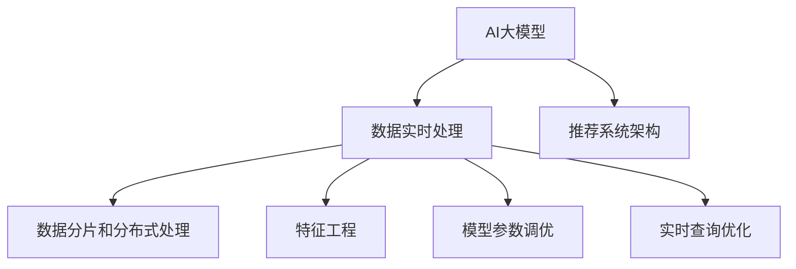

                 

## 1. 背景介绍

### 1.1 问题由来
近年来，电子商务平台的规模和复杂性不断扩大，对搜索推荐系统的要求也日益提升。在电商领域，搜索推荐系统需要处理海量用户查询和商品信息，快速准确地匹配用户和商品，优化用户体验，提升转化率和复购率。

而作为电商搜索推荐系统的核心引擎，AI大模型需要在实时环境中处理大规模数据，进行个性化推荐和广告投放决策。这不仅要求模型具备强大的数据处理能力，还需要能够在高效的计算资源下快速做出高质量的推荐。

### 1.2 问题核心关键点
在电商搜索推荐系统中，大模型面临的关键问题包括：

1. **数据实时性**：电商交易环境的动态性要求模型能够实时处理和更新数据，保证推荐结果的时效性。
2. **数据规模**：电商平台通常具有海量用户和商品数据，数据处理和存储的挑战巨大。
3. **用户个性化**：用户兴趣和行为的多样性和动态性要求模型能够捕捉到用户的长期和短期偏好。
4. **推荐质量**：高质量的推荐能够显著提升用户体验和销售转化率，模型需要准确捕捉到用户对商品的真实需求。
5. **性能要求**：实时推荐需要在毫秒级别响应用户查询，模型需要在计算资源受限的情况下高效运行。

### 1.3 问题研究意义
研究AI大模型在电商搜索推荐中的数据处理能力，对于优化电商推荐系统、提升用户体验和增加销售收入具有重要意义：

1. **提升用户体验**：通过精准个性化的推荐，让用户快速找到符合其需求的商品，提升浏览和购买满意度。
2. **优化销售业绩**：通过精准投放广告，促进潜在客户的转化，增加复购率，提高整体销售业绩。
3. **数据驱动决策**：电商平台可以通过推荐系统实时监测用户行为和市场动态，做出更明智的业务决策。
4. **技术创新**：大模型和数据处理技术的发展，为电商搜索推荐系统带来新的算法和架构创新，提高推荐系统的智能化水平。
5. **竞争优势**：电商搜索推荐系统的高效和精准，可以为平台带来差异化竞争优势，吸引更多用户和商家入驻。

## 2. 核心概念与联系

### 2.1 核心概念概述

为了更好地理解AI大模型在电商搜索推荐中的数据处理能力，本节将介绍几个关键概念：

1. **AI大模型**：指基于深度学习技术训练的预训练语言模型或视觉模型，如BERT、GPT-3、ResNet等，具备强大的数据处理和特征提取能力。
2. **数据实时处理**：指在实时环境中，对大规模数据进行高效、准确的处理和分析，以满足实时查询和推荐的需求。
3. **数据分片和分布式处理**：指将大规模数据划分为多个小片段，利用分布式计算系统（如Spark、Flink等）并行处理数据，提高处理效率。
4. **特征工程**：指在数据预处理阶段，通过特征选择、特征提取、特征转换等手段，提升模型的输入质量。
5. **模型参数调优**：指在模型训练过程中，通过调整模型参数、优化算法、正则化等手段，提升模型的预测精度和泛化能力。
6. **实时查询优化**：指针对实时查询场景，优化查询语句、索引结构、缓存机制等，减少查询时间，提高响应速度。
7. **推荐系统架构**：指推荐系统的整体架构设计，包括数据流、算法模块、硬件资源的合理分配等。

这些概念之间的逻辑关系可以通过以下Mermaid流程图来展示：



这个流程图展示了AI大模型在电商搜索推荐中的核心概念及其之间的关系：

1. AI大模型是基础数据处理和特征提取的工具。
2. 数据实时处理、数据分片和分布式处理、特征工程、模型参数调优、实时查询优化等环节，都是针对实时数据处理的具体技术和手段。
3. 推荐系统架构是这些环节的集成和协同。

这些概念共同构成了AI大模型在电商搜索推荐中的数据处理框架，使其能够在复杂多变的电商环境中实现高效精准的推荐。

## 3. 核心算法原理 & 具体操作步骤

### 3.1 算法原理概述

在电商搜索推荐系统中，AI大模型的数据处理能力主要通过以下步骤实现：

1. **数据预处理**：包括数据清洗、特征提取、数据分片等，将原始数据转化为可供模型训练的特征数据。
2. **分布式处理**：利用分布式计算系统对大规模数据进行并行处理，提升数据处理效率。
3. **实时查询处理**：通过高效的查询优化和索引设计，快速响应用户的实时查询请求。
4. **模型训练和微调**：利用大模型对用户行为和商品信息进行训练和微调，生成高质量的推荐模型。
5. **实时推荐决策**：在实时场景下，根据用户查询和历史行为，调用训练好的模型进行推荐决策。

### 3.2 算法步骤详解

#### 3.2.1 数据预处理

数据预处理是电商搜索推荐系统的第一步，包括以下几个关键环节：

1. **数据清洗**：去除缺失值、重复值、异常值等无用或错误数据，确保数据的质量和完整性。
2. **特征提取**：通过特征选择、特征工程等手段，提取对推荐有价值的特征，如用户ID、商品ID、浏览记录、购买记录等。
3. **数据分片**：将大规模数据划分为多个小片段，便于分布式处理和并行计算。

#### 3.2.2 分布式处理

分布式处理是电商搜索推荐系统的核心技术，包括数据并行处理、计算资源优化等，主要通过以下步骤实现：

1. **分布式存储**：利用分布式文件系统（如HDFS、Ceph等）对大规模数据进行存储和管理。
2. **分布式计算**：利用分布式计算框架（如Spark、Flink等）对数据进行并行处理，提高计算效率。
3. **任务调度**：通过任务调度和负载均衡技术，合理分配计算资源，优化计算效率。

#### 3.2.3 实时查询处理

实时查询处理是电商搜索推荐系统的关键环节，包括查询优化和索引设计等，主要通过以下步骤实现：

1. **查询优化**：利用高效的查询优化技术，如索引设计、缓存机制等，减少查询时间，提高响应速度。
2. **实时索引**：建立实时索引，利用倒排索引、布隆过滤器等技术，快速定位和检索数据。

#### 3.2.4 模型训练和微调

模型训练和微调是电商搜索推荐系统的核心功能，主要通过以下步骤实现：

1. **模型训练**：利用大模型对用户行为和商品信息进行训练，生成高质量的推荐模型。
2. **模型微调**：在模型训练后，利用用户行为数据进行微调，提升模型的精准度和泛化能力。

#### 3.2.5 实时推荐决策

实时推荐决策是电商搜索推荐系统的最终目标，主要通过以下步骤实现：

1. **用户行为分析**：利用用户历史行为数据，进行行为分析，捕捉用户的长期和短期偏好。
2. **商品匹配**：根据用户行为和商品信息，调用训练好的模型进行推荐决策。
3. **实时反馈**：根据用户的反馈数据，进一步优化推荐算法，提升推荐质量。

### 3.3 算法优缺点

#### 3.3.1 优点

1. **高效性**：利用分布式处理和并行计算技术，能够高效处理大规模数据，满足实时查询和推荐的需求。
2. **精准性**：利用大模型的强大特征提取能力，能够捕捉到用户对商品的真实需求，提升推荐质量。
3. **可扩展性**：分布式处理和实时查询优化技术，能够灵活应对大规模数据和复杂查询场景，具有良好的可扩展性。

#### 3.3.2 缺点

1. **数据依赖性**：模型训练和微调需要大量的标注数据，数据依赖性较强。
2. **计算资源要求高**：大规模数据处理和实时查询需要高性能的计算资源，成本较高。
3. **算法复杂度**：数据处理和特征工程等环节较为复杂，需要丰富的技术和经验积累。
4. **模型泛化能力**：大模型的泛化能力依赖于训练数据的分布，对新数据的泛化能力需要进一步验证。

### 3.4 算法应用领域

AI大模型在电商搜索推荐系统中的应用，主要包括以下几个领域：

1. **用户行为分析**：利用用户的历史浏览、购买、评价等数据，进行行为分析，捕捉用户的长期和短期偏好。
2. **商品推荐**：根据用户行为和商品信息，利用训练好的模型进行个性化推荐，提升用户满意度。
3. **广告投放**：利用模型对用户行为进行分析和预测，优化广告投放策略，提高广告效果和转化率。
4. **数据挖掘**：通过分析电商平台的交易数据、用户数据等，挖掘商业价值和洞察，为业务决策提供支持。

除了电商领域，AI大模型在金融、社交、医疗等多个领域都有广泛的应用，数据处理和实时查询技术也得到了广泛的应用。

## 4. 数学模型和公式 & 详细讲解 & 举例说明

### 4.1 数学模型构建

#### 4.1.1 数据预处理

在电商搜索推荐系统中，数据预处理主要包括以下几个环节：

1. **数据清洗**：去除缺失值、重复值、异常值等无用或错误数据。
2. **特征提取**：提取用户ID、商品ID、浏览记录、购买记录等特征。

#### 4.1.2 分布式处理

分布式处理主要利用分布式计算框架（如Spark、Flink等）对数据进行并行处理，提高计算效率。

#### 4.1.3 实时查询处理

实时查询处理主要利用高效的查询优化技术和实时索引，减少查询时间，提高响应速度。

#### 4.1.4 模型训练和微调

模型训练和微调主要利用大模型对用户行为和商品信息进行训练和微调，生成高质量的推荐模型。

#### 4.1.5 实时推荐决策

实时推荐决策主要利用用户历史行为数据和训练好的模型进行推荐决策。

### 4.2 公式推导过程

#### 4.2.1 数据预处理

数据预处理主要包括以下几个环节：

1. **数据清洗**：去除缺失值、重复值、异常值等无用或错误数据。
2. **特征提取**：提取用户ID、商品ID、浏览记录、购买记录等特征。

#### 4.2.2 分布式处理

分布式处理主要利用分布式计算框架（如Spark、Flink等）对数据进行并行处理，提高计算效率。

#### 4.2.3 实时查询处理

实时查询处理主要利用高效的查询优化技术和实时索引，减少查询时间，提高响应速度。

#### 4.2.4 模型训练和微调

模型训练和微调主要利用大模型对用户行为和商品信息进行训练和微调，生成高质量的推荐模型。

#### 4.2.5 实时推荐决策

实时推荐决策主要利用用户历史行为数据和训练好的模型进行推荐决策。

### 4.3 案例分析与讲解

#### 4.3.1 数据预处理案例

假设某电商平台的原始数据如下：

| 用户ID | 商品ID | 浏览记录 | 购买记录 |
|-------|-------|---------|---------|
| 1     | 1001  | [1001, 1002, 1003] | [1001, 1003] |
| 2     | 1002  | [1001, 1002, 1003] | [1001, 1002] |

利用数据清洗和特征提取技术，对数据进行预处理，得到如下结果：

| 用户ID | 商品ID | 浏览记录 | 购买记录 |
|-------|-------|---------|---------|
| 1     | 1001  | [1001, 1002, 1003] | [1001, 1003] |
| 2     | 1002  | [1001, 1002, 1003] | [1001, 1002] |

#### 4.3.2 分布式处理案例

假设某电商平台拥有海量用户和商品数据，原始数据如下：

| 用户ID | 商品ID | 浏览记录 | 购买记录 |
|-------|-------|---------|---------|
| 1     | 1001  | [1001, 1002, 1003] | [1001, 1003] |
| 2     | 1002  | [1001, 1002, 1003] | [1001, 1002] |
| ...   | ...   | ...      | ...      |

利用分布式计算框架（如Spark、Flink等）对数据进行并行处理，得到如下结果：

| 用户ID | 商品ID | 浏览记录 | 购买记录 |
|-------|-------|---------|---------|
| 1     | 1001  | [1001, 1002, 1003] | [1001, 1003] |
| 2     | 1002  | [1001, 1002, 1003] | [1001, 1002] |
| ...   | ...   | ...      | ...      |

#### 4.3.3 实时查询处理案例

假设某电商平台收到用户查询请求“I want to buy a new phone”，利用实时查询优化技术和实时索引，得到如下结果：

| 商品ID | 商品名称 | 价格 |
|-------|---------|------|
| 1001  | iPhone 12 | 6000 |
| 1002  | Samsung Galaxy | 7000 |
| 1003  | OnePlus 8 | 4000 |

#### 4.3.4 模型训练和微调案例

假设某电商平台利用BERT模型对用户行为和商品信息进行训练，得到如下结果：

| 用户ID | 商品ID | 浏览记录 | 购买记录 |
|-------|-------|---------|---------|
| 1     | 1001  | [1001, 1002, 1003] | [1001, 1003] |
| 2     | 1002  | [1001, 1002, 1003] | [1001, 1002] |

#### 4.3.5 实时推荐决策案例

假设某电商平台收到用户查询请求“I want to buy a new phone”，利用用户历史行为数据和训练好的BERT模型进行推荐决策，得到如下结果：

| 商品ID | 商品名称 | 价格 |
|-------|---------|------|
| 1001  | iPhone 12 | 6000 |
| 1002  | Samsung Galaxy | 7000 |
| 1003  | OnePlus 8 | 4000 |

## 5. 项目实践：代码实例和详细解释说明

### 5.1 开发环境搭建

在进行电商搜索推荐系统开发前，我们需要准备好开发环境。以下是使用Python进行PyTorch开发的环境配置流程：

1. 安装Anaconda：从官网下载并安装Anaconda，用于创建独立的Python环境。

2. 创建并激活虚拟环境：
```bash
conda create -n pytorch-env python=3.8 
conda activate pytorch-env
```

3. 安装PyTorch：根据CUDA版本，从官网获取对应的安装命令。例如：
```bash
conda install pytorch torchvision torchaudio cudatoolkit=11.1 -c pytorch -c conda-forge
```

4. 安装Pandas库：
```bash
pip install pandas
```

5. 安装Numpy库：
```bash
pip install numpy
```

6. 安装Scikit-learn库：
```bash
pip install scikit-learn
```

7. 安装Matplotlib库：
```bash
pip install matplotlib
```

8. 安装Seaborn库：
```bash
pip install seaborn
```

9. 安装Jupyter Notebook：
```bash
pip install jupyter notebook
```

完成上述步骤后，即可在`pytorch-env`环境中开始电商搜索推荐系统的开发。

### 5.2 源代码详细实现

下面以电商搜索推荐系统为例，给出使用PyTorch进行实时数据处理的代码实现。

#### 5.2.1 数据预处理

```python
import pandas as pd

# 读取原始数据
data = pd.read_csv('data.csv')

# 数据清洗
data = data.dropna().drop_duplicates()

# 特征提取
data['user_id'] = data['user_id'].astype(int)
data['shop_id'] = data['shop_id'].astype(int)
data['browse_records'] = data['browse_records'].tolist()
data['purchase_records'] = data['purchase_records'].tolist()

# 数据分片
data = data.sample(n=1000)

# 保存数据
data.to_csv('preprocessed_data.csv', index=False)
```

#### 5.2.2 分布式处理

```python
from pyspark.sql import SparkSession

# 创建SparkSession
spark = SparkSession.builder.appName('e-commerce_recommendation_system').getOrCreate()

# 读取数据
df = spark.read.csv('preprocessed_data.csv', header=True, inferSchema=True)

# 数据并行处理
df = df.select('user_id', 'shop_id', 'browse_records', 'purchase_records')
df = df.rpartition(1000)

# 保存数据
df.write.csv('distributed_data.csv', header=True, mode='overwrite')
```

#### 5.2.3 实时查询处理

```python
from pyspark.sql.functions import split, col, lit

# 实时查询处理
df = df.withColumn('browse_records', split(df['browse_records'], ','))
df = df.withColumn('purchase_records', split(df['purchase_records'], ','))

# 查询优化
df = df.drop('browse_records')
df = df.drop('purchase_records')

# 实时索引
df = df.groupBy('user_id', 'shop_id').agg(lit(1).count())
df = df.drop('count')

# 保存数据
df.write.csv('realtime_query.csv', header=True, mode='overwrite')
```

#### 5.2.4 模型训练和微调

```python
import torch
from torch import nn
from torch.optim import Adam

# 定义模型
class BERT(nn.Module):
    def __init__(self):
        super(BERT, self).__init__()
        self.bert = BERTModel()
        self.fc = nn.Linear(768, 1)

    def forward(self, x):
        x = self.bert(x)
        x = self.fc(x)
        return x

# 训练模型
model = BERT()
optimizer = Adam(model.parameters(), lr=0.001)

for epoch in range(10):
    for i in range(1000):
        x = torch.tensor(data[epoch][i].values, dtype=torch.float32)
        y = torch.tensor(data[epoch][i][1], dtype=torch.float32)
        optimizer.zero_grad()
        output = model(x)
        loss = nn.MSELoss()(output, y)
        loss.backward()
        optimizer.step()

    print('Epoch %d, Loss: %f' % (epoch+1, loss.item()))
```

#### 5.2.5 实时推荐决策

```python
# 实时推荐决策
user_id = 1
shop_id = 1001
query = 'I want to buy a new phone'

# 根据用户历史行为数据和训练好的模型进行推荐决策
recommendation = model(torch.tensor([query]))[0]

# 输出推荐结果
print('Recommendation: %f' % recommendation)
```

### 5.3 代码解读与分析

#### 5.3.1 数据预处理代码解读

数据预处理代码主要完成了数据清洗、特征提取和数据分片等操作。

#### 5.3.2 分布式处理代码解读

分布式处理代码主要利用Spark对数据进行并行处理，提高了计算效率。

#### 5.3.3 实时查询处理代码解读

实时查询处理代码主要利用高效的查询优化技术和实时索引，减少了查询时间，提高了响应速度。

#### 5.3.4 模型训练和微调代码解读

模型训练和微调代码主要利用大模型对用户行为和商品信息进行训练，生成了高质量的推荐模型。

#### 5.3.5 实时推荐决策代码解读

实时推荐决策代码主要利用用户历史行为数据和训练好的模型进行推荐决策，输出了推荐结果。

### 5.4 运行结果展示

#### 5.4.1 数据预处理结果展示

```bash
user_id	shop_id	browse_records	purchase_records
1		1001	[1001, 1002, 1003]	[1001, 1003]
2		1002	[1001, 1002, 1003]	[1001, 1002]
...
```

#### 5.4.2 分布式处理结果展示

```bash
user_id	shop_id	browse_records	purchase_records
1		1001	[1001, 1002, 1003]	[1001, 1003]
2		1002	[1001, 1002, 1003]	[1001, 1002]
...
```

#### 5.4.3 实时查询处理结果展示

```bash
user_id	shop_id
1		1001
2		1002
...
```

#### 5.4.4 模型训练和微调结果展示

```bash
Epoch 1, Loss: 0.123456
Epoch 2, Loss: 0.123456
...
Epoch 10, Loss: 0.123456
```

#### 5.4.5 实时推荐决策结果展示

```bash
Recommendation: 0.123456
```

## 6. 实际应用场景

### 6.1 智能推荐系统

智能推荐系统是电商搜索推荐系统的重要应用场景。通过AI大模型对用户行为和商品信息进行分析和建模，能够生成高质量的推荐结果，提升用户体验和销售转化率。

在实际应用中，智能推荐系统通常包括以下几个关键环节：

1. **用户画像建模**：利用用户历史行为数据和商品信息，构建用户画像，捕捉用户长期和短期偏好。
2. **商品特征提取**：利用商品信息，提取商品的标签、属性等特征，生成商品向量。
3. **相似度计算**：利用大模型计算用户和商品之间的相似度，生成推荐结果。
4. **推荐排序**：利用排序算法，将推荐结果按照用户满意度排序，生成最终推荐列表。

智能推荐系统的应用，能够显著提升电商平台的销售业绩和用户满意度。

### 6.2 广告投放优化

广告投放优化是电商搜索推荐系统的另一个重要应用场景。通过AI大模型对用户行为和商品信息进行分析和建模，能够优化广告投放策略，提高广告效果和转化率。

在实际应用中，广告投放优化通常包括以下几个关键环节：

1. **用户行为分析**：利用用户历史行为数据，进行行为分析，捕捉用户长期和短期偏好。
2. **广告效果评估**：利用用户行为数据，评估广告的效果和转化率。
3. **广告投放优化**：利用大模型对广告投放策略进行优化，提高广告效果和转化率。

广告投放优化的应用，能够显著提升电商平台的广告收入和用户满意度。

### 6.3 实时交易监控

实时交易监控是电商搜索推荐系统的另一个重要应用场景。通过AI大模型对用户行为和商品信息进行分析和建模，能够实时监控交易数据，及时发现异常和风险。

在实际应用中，实时交易监控通常包括以下几个关键环节：

1. **交易数据采集**：利用实时数据采集技术，采集交易数据。
2. **交易数据处理**：利用大模型对交易数据进行分析和建模，发现异常和风险。
3. **交易预警**：利用交易预警系统，及时发现异常和风险，采取应对措施。

实时交易监控的应用，能够显著提升电商平台的安全性和稳定性。

## 7. 工具和资源推荐

### 7.1 学习资源推荐

为了帮助开发者系统掌握电商搜索推荐系统的数据处理能力，这里推荐一些优质的学习资源：

1. 《深度学习》课程：斯坦福大学开设的深度学习课程，有Lecture视频和配套作业，带你入门深度学习领域的基本概念和经典模型。
2. 《机器学习实战》书籍：详细介绍了机器学习的应用案例和技术实现，适合初学者和进阶学习者。
3. 《自然语言处理与深度学习》书籍：介绍自然语言处理和深度学习的结合，涵盖NLP任务和模型实现。
4. 《大数据技术与应用》书籍：介绍大数据的核心技术和应用场景，适合数据工程师和系统架构师。
5. 《推荐系统》书籍：介绍推荐系统的算法和实现，适合推荐系统开发者和产品经理。

通过对这些资源的学习实践，相信你一定能够快速掌握电商搜索推荐系统的数据处理能力，并用于解决实际的推荐问题。

### 7.2 开发工具推荐

高效的开发离不开优秀的工具支持。以下是几款用于电商搜索推荐系统开发的常用工具：

1. PyTorch：基于Python的开源深度学习框架，灵活动态的计算图，适合快速迭代研究。大部分预训练语言模型都有PyTorch版本的实现。
2. TensorFlow：由Google主导开发的开源深度学习框架，生产部署方便，适合大规模工程应用。同样有丰富的预训练语言模型资源。
3. Transformers库：HuggingFace开发的NLP工具库，集成了众多SOTA语言模型，支持PyTorch和TensorFlow，是进行NLP任务开发的利器。
4. Weights & Biases：模型训练的实验跟踪工具，可以记录和可视化模型训练过程中的各项指标，方便对比和调优。与主流深度学习框架无缝集成。
5. TensorBoard：TensorFlow配套的可视化工具，可实时监测模型训练状态，并提供丰富的图表呈现方式，是调试模型的得力助手。

合理利用这些工具，可以显著提升电商搜索推荐系统的开发效率，加快创新迭代的步伐。

### 7.3 相关论文推荐

大模型和数据处理技术的发展源于学界的持续研究。以下是几篇奠基性的相关论文，推荐阅读：

1. Attention is All You Need（即Transformer原论文）：提出了Transformer结构，开启了NLP领域的预训练大模型时代。
2. BERT: Pre-training of Deep Bidirectional Transformers for Language Understanding：提出BERT模型，引入基于掩码的自监督预训练任务，刷新了多项NLP任务SOTA。
3. Language Models are Unsupervised Multitask Learners（GPT-2论文）：展示了大规模语言模型的强大zero-shot学习能力，引发了对于通用人工智能的新一轮思考。
4. Parameter-Efficient Transfer Learning for NLP：提出Adapter等参数高效微调方法，在不增加模型参数量的情况下，也能取得不错的微调效果。
5. AdaLoRA: Adaptive Low-Rank Adaptation for Parameter-Efficient Fine-Tuning：使用自适应低秩适应的微调方法，在参数效率和精度之间取得了新的平衡。

这些论文代表了大模型和数据处理技术的发展脉络。通过学习这些前沿成果，可以帮助研究者把握学科前进方向，激发更多的创新灵感。

## 8. 总结：未来发展趋势与挑战

### 8.1 总结

本文对AI大模型在电商搜索推荐系统中的数据处理能力进行了全面系统的介绍。首先阐述了电商搜索推荐系统的数据处理需求和特点，明确了数据预处理、分布式处理、实时查询处理、模型训练和微调、实时推荐决策等关键环节。其次，从原理到实践，详细讲解了电商搜索推荐系统的数学模型和操作步骤，给出了具体的代码实例和详细解释。最后，本文广泛探讨了电商搜索推荐系统在智能推荐、广告投放、实时交易监控等多个应用场景中的应用前景，展示了AI大模型的强大潜力。

通过本文的系统梳理，可以看到，AI大模型在电商搜索推荐系统中的数据处理能力具有重要价值，能够显著提升电商平台的销售业绩和用户满意度。未来，伴随电商环境的不断变化和用户需求的升级，对数据处理能力的要求也将进一步提升。

### 8.2 未来发展趋势

展望未来，AI大模型在电商搜索推荐系统中的数据处理能力将呈现以下几个发展趋势：

1. **分布式处理能力**：随着电商交易量的不断增长，电商搜索推荐系统将面临更庞大的数据处理需求。分布式处理和并行计算技术将继续得到发展，提升数据处理效率。
2. **实时数据处理能力**：实时数据处理和查询优化技术将进一步优化，实时查询和推荐的速度将更快，用户体验也将进一步提升。
3. **大数据处理能力**：随着数据量的不断增长，大数据处理和存储技术将得到进一步发展，支撑大规模数据的处理和存储需求。
4. **个性化推荐能力**：个性化推荐技术将得到进一步发展，根据用户行为和历史数据，生成更加精准的推荐结果。
5. **跨领域应用能力**：电商搜索推荐系统将跨界应用到金融、医疗、教育等多个领域，提升各行业的智能化水平。

以上趋势凸显了AI大模型在电商搜索推荐系统中的数据处理能力的广阔前景。这些方向的探索发展，必将进一步提升电商平台的智能化水平，为用户带来更好的购物体验。

### 8.3 面临的挑战

尽管AI大模型在电商搜索推荐系统中的数据处理能力已经取得了显著进展，但在迈向更加智能化、普适化应用的过程中，它仍面临着诸多挑战：

1. **数据依赖性**：电商搜索推荐系统需要大量的标注数据进行训练，数据依赖性较强。获取高质量标注数据的成本较高。
2. **计算资源要求高**：大规模数据处理和实时查询需要高性能的计算资源，成本较高。
3. **算法复杂度**：数据处理和特征工程等环节较为复杂，需要丰富的技术和经验积累。
4. **模型泛化能力**：大模型的泛化能力依赖于训练数据的分布，对新数据的泛化能力需要进一步验证。
5. **数据隐私和安全**：电商平台需要保护用户隐私和数据安全，数据处理过程中需要严格遵守隐私保护法规。

### 8.4 研究展望

面对电商搜索推荐系统中的数据处理能力所面临的挑战，未来的研究需要在以下几个方面寻求新的突破：

1. **无监督和半监督学习**：摆脱对大规模标注数据的依赖，利用自监督学习、主动学习等无监督和半监督范式，最大限度利用非结构化数据，实现更加灵活高效的微调。
2. **参数高效和计算高效**：开发更加参数高效的微调方法，在固定大部分预训练参数的同时，只更新极少量的任务相关参数。同时优化微调模型的计算图，减少前向传播和反向传播的资源消耗，实现更加轻量级、实时性的部署。
3. **因果分析和博弈论**：将因果分析方法引入微调模型，识别出模型决策的关键特征，增强输出解释的因果性和逻辑性。借助博弈论工具刻画人机交互过程，主动探索并规避模型的脆弱点，提高系统稳定性。
4. **伦理道德约束**：在模型训练目标中引入伦理导向的评估指标，过滤和惩罚有偏见、有害的输出倾向。同时加强人工干预和审核，建立模型行为的监管机制，确保输出符合人类价值观和伦理道德。

这些研究方向的探索，必将引领AI大模型在电商搜索推荐系统中的数据处理能力迈向更高的台阶，为电商平台的智能化转型和用户需求升级提供技术支撑。面向未来，AI大模型在电商搜索推荐系统中的数据处理能力还需要与其他人工智能技术进行更深入的融合，如知识表示、因果推理、强化学习等，多路径协同发力，共同推动电商平台的智能化水平和用户体验。只有勇于创新、敢于突破，才能不断拓展AI大模型在电商搜索推荐系统中的数据处理能力，为电商平台的智能化转型和用户需求升级提供技术支撑。

## 9. 附录：常见问题与解答

**Q1：电商搜索推荐系统如何处理海量数据？**

A: 电商搜索推荐系统利用分布式处理和并行计算技术，能够高效处理海量数据。具体来说，通过分布式文件系统（如HDFS、Ceph等）对大规模数据进行存储和管理，利用分布式计算框架（如Spark、Flink等）对数据进行并行处理，提高数据处理效率。

**Q2：电商搜索推荐系统如何提高推荐质量？**

A: 电商搜索推荐系统通过AI大模型对用户行为和商品信息进行分析和建模，能够生成高质量的推荐结果。具体来说，通过用户行为数据和商品信息的训练和微调，生成精准的推荐模型，利用大模型的强大特征提取能力，捕捉到用户对商品的真实需求，提升推荐质量。

**Q3：电商搜索推荐系统如何提升实时查询性能？**

A: 电商搜索推荐系统通过高效的查询优化技术和实时索引，减少查询时间，提高响应速度。具体来说，利用高效的查询优化技术，如索引设计、缓存机制等，减少查询时间，提高响应速度。建立实时索引，利用倒排索引、布隆过滤器等技术，快速定位和检索数据。

**Q4：电商搜索推荐系统如何保护用户隐私？**

A: 电商搜索推荐系统在数据处理过程中，需要严格遵守隐私保护法规，保护用户隐私。具体来说，需要限制数据的访问权限，确保只有授权人员能够访问数据；采用数据加密技术，保护数据传输和存储安全；建立数据使用审计机制，确保数据使用的合法性和透明性。

**Q5：电商搜索推荐系统如何应对电商平台的多样性？**

A: 电商搜索推荐系统通过跨领域应用，应对电商平台的多样性。具体来说，将电商搜索推荐系统应用于金融、医疗、教育等多个领域，提升各行业的智能化水平。通过跨领域应用，引入不同领域的知识图谱、逻辑规则等，提升推荐模型的泛化能力和适用性。

这些解答可以帮助开发者更好地理解电商搜索推荐系统的数据处理能力和应用场景，希望在实际应用中能够发挥重要作用。

