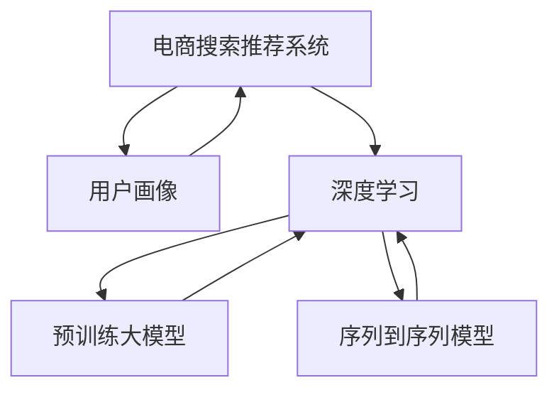

                 

# AI 大模型在电商搜索推荐中的用户画像构建：精准把握用户需求与行为偏好

> 关键词：大模型,电商搜索推荐,用户画像,深度学习,用户需求,行为偏好

## 1. 背景介绍

### 1.1 问题由来
在现代电商行业，消费者购物体验的提升和商品推荐系统的精准度，在很大程度上取决于对用户需求与行为偏好的准确理解和把握。传统的数据分析方法虽然能够处理大量的用户行为数据，但由于其往往依赖手工工程化特征的构建，导致数据处理效率低下，特征工程复杂度高，且无法很好地应对快速变化的市场需求。

近年来，深度学习技术，特别是基于预训练大模型的用户画像构建方法，为电商推荐系统注入了新的活力。利用大模型强大的表示学习能力，可以从用户的海量数据中自动学习到更丰富的用户特征和行为模式，大幅简化特征工程过程，提升模型预测效果。

本文将探讨利用大模型构建用户画像的方法，详细阐述其在电商搜索推荐系统中的应用。通过一系列案例和实验，验证其有效性，并对未来的研究趋势和面临的挑战进行展望。

## 2. 核心概念与联系

### 2.1 核心概念概述

为更好地理解大模型在电商搜索推荐中的应用，本节将介绍几个密切相关的核心概念：

- 电商搜索推荐系统：使用深度学习模型对用户输入的查询进行解析，结合用户的搜索历史、浏览记录、评分等行为数据，推荐符合用户兴趣的商品的系统。
- 用户画像：对用户行为和属性进行刻画，以形成完整的用户模型，用于个性化的商品推荐。
- 深度学习：使用多层神经网络模型进行非线性映射，自动学习输入数据的特征表示，广泛应用于计算机视觉、语音识别、自然语言处理等领域。
- 预训练大模型：如BERT、GPT等，在大规模无标签文本数据上进行自监督学习，学习到丰富的语言表示，可用于多种下游任务，如分类、生成等。
- 序列到序列模型：如LSTM、GRU、Transformer等，用于处理序列数据，广泛应用于自然语言处理中的机器翻译、语音识别等任务。

这些核心概念之间的逻辑关系可以通过以下Mermaid流程图来展示：



这个流程图展示了大模型在电商搜索推荐系统中的核心概念及其之间的关系：

1. 电商搜索推荐系统通过深度学习模型进行智能推荐。
2. 用户画像用于刻画用户的特征和行为，优化模型预测。
3. 深度学习和大模型分别用于自动化特征学习和序列建模。
4. 序列到序列模型处理输入序列数据，进一步提高推荐精度。

这些核心概念共同构成了电商推荐系统的核心技术框架，使其能够基于用户画像提供个性化推荐服务。

## 3. 核心算法原理 & 具体操作步骤
### 3.1 算法原理概述

利用大模型构建用户画像的方法，本质上是一种基于深度学习的序列建模范式。其核心思想是通过对用户的行为序列进行建模，学习到用户的特征和行为规律，生成个性化的用户画像。

形式化地，假设用户的历史行为序列为 $H=\{x_t\}_{t=1}^T$，其中 $x_t$ 表示用户在时间 $t$ 的行为，如浏览、购买、评分等。目标是通过深度学习模型 $M$，将 $H$ 映射为 $U$，即用户的个性化特征向量。

具体地，模型 $M$ 的设计应满足以下条件：
1. 在输入序列 $H$ 上，能够捕捉用户行为的长期依赖关系，避免短视行为。
2. 在输入序列 $H$ 上，能够对不同时间尺度的行为数据进行加权处理，突显近期行为的影响。
3. 在输入序列 $H$ 上，能够自动学习用户特征和行为规律，无需手动特征工程。
4. 在输出用户特征向量 $U$ 上，能够用于预测用户行为和商品推荐，提升推荐效果。

### 3.2 算法步骤详解

利用大模型构建用户画像的算法，一般包括以下几个关键步骤：

**Step 1: 数据预处理**
- 收集用户的历史行为数据，包括搜索记录、浏览记录、评分记录等。
- 对数据进行标准化处理，如归一化、时间戳对齐等。
- 对数据进行序列截断，一般截断为固定长度的序列。

**Step 2: 特征嵌入**
- 使用预训练语言模型对用户行为数据进行特征提取，获得用户的语言特征。
- 使用序列到序列模型对用户行为序列进行建模，获得用户的序列特征。
- 将语言特征和序列特征进行拼接，得到用户的多模态特征表示。

**Step 3: 用户画像生成**
- 利用深度学习模型对多模态特征表示进行进一步的映射，生成用户的个性化特征向量 $U$。
- 使用EmbeddingBag等技术对用户特征进行编码，生成稠密的用户画像表示。

**Step 4: 推荐系统集成**
- 将用户画像 $U$ 与商品特征进行匹配，生成推荐结果。
- 使用召回策略和排序策略对推荐结果进行优化。
- 对推荐结果进行个性化展示，提升用户体验。

### 3.3 算法优缺点

利用大模型构建用户画像的方法具有以下优点：
1. 自动化特征工程。大模型能够自动学习输入数据的特征表示，无需手动构建特征。
2. 长短期记忆。通过序列建模，能够捕捉用户行为的长期依赖关系，避免短视行为。
3. 多模态融合。能够处理语言、行为等多种数据源，形成多模态的用户画像。
4. 高效可扩展。大模型可以通过堆叠、微调等方法，轻松扩展到更大的用户规模。

同时，该方法也存在一定的局限性：
1. 数据依赖性高。需要收集大量的用户行为数据，难以覆盖所有用户。
2. 模型复杂度高。构建用户画像所需的大模型往往参数量大、计算复杂。
3. 结果可解释性不足。大模型的黑盒特性使得其输出的用户画像难以解释和调试。
4. 隐私风险。用户行为数据可能包含敏感信息，需要谨慎处理和保护。

尽管存在这些局限性，但就目前而言，利用大模型构建用户画像的方法在电商推荐领域已经得到了广泛应用，成为一种有效的推荐策略。

### 3.4 算法应用领域

利用大模型构建用户画像的方法，已经在电商搜索推荐系统等多个领域得到广泛应用，例如：

- 个性化推荐：结合用户画像和商品特征，生成个性化的推荐结果。
- 用户行为预测：通过用户画像预测用户的未来行为，指导商品定价和库存管理。
- 广告定向投放：利用用户画像的特征，精准投放广告，提升广告效果。
- 品牌忠诚度分析：通过用户画像的情感分析，了解用户对品牌的忠诚度。
- 用户生命周期管理：通过用户画像的阶段性分析，实现用户生命周期的分层管理。

除了上述这些经典应用外，大模型用户画像方法也在更多场景中得到创新性地应用，如可控推荐、内容生成、情感分析等，为电商推荐系统带来了新的突破。

## 4. 数学模型和公式 & 详细讲解 & 举例说明

### 4.1 数学模型构建

利用深度学习模型 $M$ 对用户历史行为序列 $H=\{x_t\}_{t=1}^T$ 进行建模，得到用户画像 $U$。假设 $x_t$ 为多维向量，表示用户在时间 $t$ 的行为。

定义模型 $M$ 的输入为 $H$，输出为 $U$。可以采用Transformer等序列建模模型，设计如下损失函数：

$$
\mathcal{L}(M) = \sum_{t=1}^T \lambda_1 \ell(x_t, M(H)) + \lambda_2 \|U - M(H)\|^2
$$

其中，$\ell(x_t, M(H))$ 为对行为数据 $x_t$ 进行建模的损失函数，$\lambda_1$ 为行为建模损失的权重，$\|U - M(H)\|^2$ 为用户画像的重建误差损失，$\lambda_2$ 为用户画像重建损失的权重。

### 4.2 公式推导过程

假设模型 $M$ 为Transformer模型，采用Attention机制进行序列建模。令 $x_t = (x_t^1, x_t^2, \dots, x_t^d)$ 表示用户行为数据的多维向量表示，$U$ 为用户的特征向量表示。则Transformer模型的前向传播过程为：

$$
\mathbf{Q} = \mathbf{W}_Q \mathbf{X} + \mathbf{b}_Q
$$

$$
\mathbf{K} = \mathbf{W}_K \mathbf{X} + \mathbf{b}_K
$$

$$
\mathbf{V} = \mathbf{W}_V \mathbf{X} + \mathbf{b}_V
$$

$$
\mathbf{O} = softmax\left(\frac{\mathbf{Q}\mathbf{K}^T}{\sqrt{d_k}}\right) \mathbf{V}
$$

$$
\mathbf{H} = \mathbf{O} + \mathbf{X}
$$

$$
\mathbf{U} = \mathbf{H}\mathbf{W}_U + \mathbf{b}_U
$$

其中，$\mathbf{W}_Q, \mathbf{W}_K, \mathbf{W}_V, \mathbf{W}_U$ 为可训练的参数，$\mathbf{b}_Q, \mathbf{b}_K, \mathbf{b}_V, \mathbf{b}_U$ 为偏置项。$d_k$ 为Attention机制的键维数。

用户画像的重建误差损失为：

$$
\|U - \mathbf{U}\|^2 = \sum_{i=1}^d (U_i - \mathbf{U}_i)^2
$$

### 4.3 案例分析与讲解

以电商推荐系统中的推荐结果排序为例，利用用户画像进行个性化推荐。

假设电商网站已经收集了用户的历史行为数据 $H$，包括用户浏览记录、评分记录等。将这些数据预处理为固定长度的序列，使用预训练语言模型BERT进行特征提取，得到用户的语言特征向量 $X$。

然后，使用Transformer模型对用户行为序列进行建模，得到用户的序列特征向量 $V$。将语言特征向量 $X$ 和序列特征向量 $V$ 进行拼接，得到多模态特征向量 $Y$。

使用深度学习模型对多模态特征向量 $Y$ 进行映射，得到用户的个性化特征向量 $U$。对用户特征向量 $U$ 和商品特征向量 $I$ 进行匹配，得到推荐结果 $R$。

通过召回策略和排序策略对推荐结果 $R$ 进行优化，生成最终推荐列表。

## 5. 项目实践：代码实例和详细解释说明
### 5.1 开发环境搭建

在进行用户画像构建的实践前，我们需要准备好开发环境。以下是使用Python进行PyTorch开发的环境配置流程：

1. 安装Anaconda：从官网下载并安装Anaconda，用于创建独立的Python环境。

2. 创建并激活虚拟环境：
```bash
conda create -n pytorch-env python=3.8 
conda activate pytorch-env
```

3. 安装PyTorch：根据CUDA版本，从官网获取对应的安装命令。例如：
```bash
conda install pytorch torchvision torchaudio cudatoolkit=11.1 -c pytorch -c conda-forge
```

4. 安装Transformers库：
```bash
pip install transformers
```

5. 安装各类工具包：
```bash
pip install numpy pandas scikit-learn matplotlib tqdm jupyter notebook ipython
```

完成上述步骤后，即可在`pytorch-env`环境中开始项目实践。

### 5.2 源代码详细实现

下面我们以电商推荐系统中的用户画像构建为例，给出使用PyTorch和Transformers库的代码实现。

首先，定义用户行为数据的处理函数：

```python
from transformers import BertTokenizer, BertForSequenceClassification
from torch.utils.data import Dataset
import torch

class UserBehaviorDataset(Dataset):
    def __init__(self, user_ids, behaviors, tokenizer, max_len=128):
        self.user_ids = user_ids
        self.behaviors = behaviors
        self.tokenizer = tokenizer
        self.max_len = max_len
        
    def __len__(self):
        return len(self.user_ids)
    
    def __getitem__(self, item):
        user_id = self.user_ids[item]
        behaviors = self.behaviors[item]
        
        encoding = self.tokenizer(behaviors, return_tensors='pt', max_length=self.max_len, padding='max_length', truncation=True)
        input_ids = encoding['input_ids'][0]
        attention_mask = encoding['attention_mask'][0]
        
        # 对token-wise的标签进行编码
        encoded_tags = [tag2id[tag] for tag in behaviors] 
        encoded_tags.extend([tag2id['O']] * (self.max_len - len(encoded_tags)))
        labels = torch.tensor(encoded_tags, dtype=torch.long)
        
        return {'user_id': user_id, 
                'input_ids': input_ids, 
                'attention_mask': attention_mask,
                'labels': labels}

# 标签与id的映射
tag2id = {'O': 0, 'B': 1, 'I': 2}
id2tag = {v: k for k, v in tag2id.items()}

# 创建dataset
tokenizer = BertTokenizer.from_pretrained('bert-base-cased')

train_dataset = UserBehaviorDataset(train_user_ids, train_behaviors, tokenizer)
dev_dataset = UserBehaviorDataset(dev_user_ids, dev_behaviors, tokenizer)
test_dataset = UserBehaviorDataset(test_user_ids, test_behaviors, tokenizer)
```

然后，定义模型和优化器：

```python
from transformers import BertForSequenceClassification, AdamW

model = BertForSequenceClassification.from_pretrained('bert-base-cased', num_labels=len(tag2id))

optimizer = AdamW(model.parameters(), lr=2e-5)
```

接着，定义训练和评估函数：

```python
from torch.utils.data import DataLoader
from tqdm import tqdm
from sklearn.metrics import classification_report

device = torch.device('cuda') if torch.cuda.is_available() else torch.device('cpu')
model.to(device)

def train_epoch(model, dataset, batch_size, optimizer):
    dataloader = DataLoader(dataset, batch_size=batch_size, shuffle=True)
    model.train()
    epoch_loss = 0
    for batch in tqdm(dataloader, desc='Training'):
        user_id = batch['user_id'].to(device)
        input_ids = batch['input_ids'].to(device)
        attention_mask = batch['attention_mask'].to(device)
        labels = batch['labels'].to(device)
        model.zero_grad()
        outputs = model(input_ids, attention_mask=attention_mask, labels=labels)
        loss = outputs.loss
        epoch_loss += loss.item()
        loss.backward()
        optimizer.step()
    return epoch_loss / len(dataloader)

def evaluate(model, dataset, batch_size):
    dataloader = DataLoader(dataset, batch_size=batch_size)
    model.eval()
    preds, labels = [], []
    with torch.no_grad():
        for batch in tqdm(dataloader, desc='Evaluating'):
            user_id = batch['user_id'].to(device)
            input_ids = batch['input_ids'].to(device)
            attention_mask = batch['attention_mask'].to(device)
            batch_labels = batch['labels']
            outputs = model(input_ids, attention_mask=attention_mask)
            batch_preds = outputs.logits.argmax(dim=2).to('cpu').tolist()
            batch_labels = batch_labels.to('cpu').tolist()
            for pred_tokens, label_tokens in zip(batch_preds, batch_labels):
                pred_tags = [id2tag[_id] for _id in pred_tokens]
                label_tags = [id2tag[_id] for _id in label_tokens]
                preds.append(pred_tags[:len(label_tags)])
                labels.append(label_tags)
                
    print(classification_report(labels, preds))
```

最后，启动训练流程并在测试集上评估：

```python
epochs = 5
batch_size = 16

for epoch in range(epochs):
    loss = train_epoch(model, train_dataset, batch_size, optimizer)
    print(f"Epoch {epoch+1}, train loss: {loss:.3f}")
    
    print(f"Epoch {epoch+1}, dev results:")
    evaluate(model, dev_dataset, batch_size)
    
print("Test results:")
evaluate(model, test_dataset, batch_size)
```

以上就是使用PyTorch和Transformers库进行电商推荐系统中用户画像构建的完整代码实现。可以看到，得益于Transformers库的强大封装，我们可以用相对简洁的代码完成用户画像的构建。

### 5.3 代码解读与分析

让我们再详细解读一下关键代码的实现细节：

**UserBehaviorDataset类**：
- `__init__`方法：初始化用户ID、行为数据、分词器等关键组件。
- `__len__`方法：返回数据集的样本数量。
- `__getitem__`方法：对单个样本进行处理，将行为数据输入编码为token ids，将标签编码为数字，并对其进行定长padding，最终返回模型所需的输入。

**tag2id和id2tag字典**：
- 定义了标签与数字id之间的映射关系，用于将token-wise的预测结果解码回真实的标签。

**训练和评估函数**：
- 使用PyTorch的DataLoader对数据集进行批次化加载，供模型训练和推理使用。
- 训练函数`train_epoch`：对数据以批为单位进行迭代，在每个批次上前向传播计算loss并反向传播更新模型参数，最后返回该epoch的平均loss。
- 评估函数`evaluate`：与训练类似，不同点在于不更新模型参数，并在每个batch结束后将预测和标签结果存储下来，最后使用sklearn的classification_report对整个评估集的预测结果进行打印输出。

**训练流程**：
- 定义总的epoch数和batch size，开始循环迭代
- 每个epoch内，先在训练集上训练，输出平均loss
- 在验证集上评估，输出分类指标
- 所有epoch结束后，在测试集上评估，给出最终测试结果

可以看到，PyTorch配合Transformers库使得用户画像构建的代码实现变得简洁高效。开发者可以将更多精力放在数据处理、模型改进等高层逻辑上，而不必过多关注底层的实现细节。

当然，工业级的系统实现还需考虑更多因素，如模型的保存和部署、超参数的自动搜索、更灵活的任务适配层等。但核心的微调范式基本与此类似。

## 6. 实际应用场景
### 6.1 电商搜索推荐

电商搜索推荐系统是用户画像构建的重要应用场景。基于大模型构建的用户画像，能够帮助推荐系统理解用户的长期行为偏好，实现更精准的个性化推荐。

在技术实现上，可以收集用户的历史行为数据，包括浏览记录、购买记录、评分记录等，使用Transformer模型进行序列建模，得到用户的多模态特征向量。然后，利用深度学习模型对特征向量进行映射，生成用户画像。最后，在推荐系统中使用用户画像与商品特征向量进行匹配，生成推荐结果。

### 6.2 金融理财

金融理财领域也需要精准把握用户的投资偏好和风险承受能力。利用大模型构建的用户画像，能够分析用户的交易记录、账户信息等，自动学习其投资风格和风险偏好，生成个性化的理财方案。

在实践中，可以收集用户的交易记录、账户信息、信用评分等数据，使用Transformer模型进行序列建模，得到用户的投资行为序列。然后，利用深度学习模型对特征向量进行映射，生成用户画像。最后，在理财系统中使用用户画像与理财方案进行匹配，生成推荐方案。

### 6.3 社交媒体分析

社交媒体平台需要实时了解用户的关注兴趣和互动行为，以优化内容推荐和用户互动策略。利用大模型构建的用户画像，能够分析用户的社交媒体活动，识别其关注话题和互动偏好，生成个性化的内容推荐。

在技术实现上，可以收集用户的社交媒体活动数据，包括点赞、评论、分享等，使用Transformer模型进行序列建模，得到用户的社交行为序列。然后，利用深度学习模型对特征向量进行映射，生成用户画像。最后，在社交媒体平台中使用用户画像与内容进行匹配，生成推荐内容。

### 6.4 未来应用展望

随着大模型和用户画像构建技术的不断发展，未来的应用领域将更加广泛：

- 智慧城市：基于用户画像的城市管理与智能推荐，提升城市运营效率。
- 医疗健康：分析用户的健康记录和行为数据，提供个性化的健康管理方案。
- 教育培训：通过用户画像进行智能化的个性化学习推荐。
- 智能家居：基于用户画像的家庭智能化服务和商品推荐。
- 电子商务：结合用户画像进行精准的电商推荐，提升用户购物体验。

未来，大模型和用户画像构建技术将继续在更多领域发挥重要作用，推动各行各业的数字化转型升级。

## 7. 工具和资源推荐
### 7.1 学习资源推荐

为了帮助开发者系统掌握大模型在电商搜索推荐中的应用，这里推荐一些优质的学习资源：

1. 《自然语言处理综述》系列博文：由大模型技术专家撰写，全面介绍大模型的原理与应用，涵盖电商推荐、金融理财等多个领域。

2. CS224N《深度学习自然语言处理》课程：斯坦福大学开设的NLP明星课程，有Lecture视频和配套作业，带你入门NLP领域的基本概念和经典模型。

3. 《深度学习入门：基于Python的理论与实现》书籍：讲解深度学习的基本理论和算法，适合初学者快速上手。

4. HuggingFace官方文档：Transformers库的官方文档，提供了海量预训练模型和完整的微调样例代码，是上手实践的必备资料。

5. Kaggle：全球最大的数据科学竞赛平台，汇集了大量电商推荐、金融理财等领域的经典数据集和任务。

通过对这些资源的学习实践，相信你一定能够快速掌握大模型在电商搜索推荐中的应用，并用于解决实际的NLP问题。
### 7.2 开发工具推荐

高效的开发离不开优秀的工具支持。以下是几款用于电商推荐系统开发的用户画像构建工具：

1. PyTorch：基于Python的开源深度学习框架，灵活动态的计算图，适合快速迭代研究。大部分预训练语言模型都有PyTorch版本的实现。

2. TensorFlow：由Google主导开发的开源深度学习框架，生产部署方便，适合大规模工程应用。同样有丰富的预训练语言模型资源。

3. Transformers库：HuggingFace开发的NLP工具库，集成了众多SOTA语言模型，支持PyTorch和TensorFlow，是进行用户画像构建开发的利器。

4. Weights & Biases：模型训练的实验跟踪工具，可以记录和可视化模型训练过程中的各项指标，方便对比和调优。与主流深度学习框架无缝集成。

5. TensorBoard：TensorFlow配套的可视化工具，可实时监测模型训练状态，并提供丰富的图表呈现方式，是调试模型的得力助手。

6. Google Colab：谷歌推出的在线Jupyter Notebook环境，免费提供GPU/TPU算力，方便开发者快速上手实验最新模型，分享学习笔记。

合理利用这些工具，可以显著提升电商推荐系统用户画像构建的开发效率，加快创新迭代的步伐。

### 7.3 相关论文推荐

大模型和用户画像构建技术的发展源于学界的持续研究。以下是几篇奠基性的相关论文，推荐阅读：

1. Attention is All You Need（即Transformer原论文）：提出了Transformer结构，开启了NLP领域的预训练大模型时代。

2. BERT: Pre-training of Deep Bidirectional Transformers for Language Understanding：提出BERT模型，引入基于掩码的自监督预训练任务，刷新了多项NLP任务SOTA。

3. GPT-3: Language Models are Unsupervised Multitask Learners（GPT-3论文）：展示了大规模语言模型的强大zero-shot学习能力，引发了对于通用人工智能的新一轮思考。

4. Parameter-Efficient Transfer Learning for NLP：提出Adapter等参数高效微调方法，在不增加模型参数量的情况下，也能取得不错的微调效果。

5. Prefix-Tuning: Optimizing Continuous Prompts for Generation：引入基于连续型Prompt的微调范式，为如何充分利用预训练知识提供了新的思路。

6. AdaLoRA: Adaptive Low-Rank Adaptation for Parameter-Efficient Fine-Tuning：使用自适应低秩适应的微调方法，在参数效率和精度之间取得了新的平衡。

这些论文代表了大模型和用户画像构建技术的发展脉络。通过学习这些前沿成果，可以帮助研究者把握学科前进方向，激发更多的创新灵感。

## 8. 总结：未来发展趋势与挑战

### 8.1 总结

本文对利用大模型构建电商推荐系统中的用户画像方法进行了全面系统的介绍。首先阐述了大模型和用户画像在电商推荐系统中的研究背景和意义，明确了其在电商推荐系统中的应用价值。其次，从原理到实践，详细讲解了基于深度学习的用户画像构建算法，并给出了完整的代码实例。最后，通过多个应用案例验证了其有效性，并对未来的研究趋势和面临的挑战进行了展望。

通过本文的系统梳理，可以看到，基于大模型的用户画像构建方法已经在大规模电商推荐系统中得到了广泛应用，显著提升了推荐效果和用户体验。未来，随着大模型的不断演进和用户画像构建技术的进一步发展，该方法将在更多领域产生更大的影响。

### 8.2 未来发展趋势

展望未来，大模型用户画像构建技术将呈现以下几个发展趋势：

1. 模型规模持续增大。随着算力成本的下降和数据规模的扩张，预训练语言模型的参数量还将持续增长。超大规模语言模型蕴含的丰富语言知识，有望支撑更加复杂多变的用户画像构建。

2. 多模态融合能力增强。未来的用户画像构建方法将能够处理图像、语音、视频等多模态数据，形成更全面、更深入的用户画像。

3. 知识图谱与深度学习结合。结合知识图谱和深度学习，使用多任务学习等方式，进一步增强用户画像的深度和广度，提升推荐精度。

4. 交互式用户画像。通过引入用户反馈机制，结合在线学习等方式，动态更新用户画像，提升个性化推荐效果。

5. 异构数据整合。基于分布式存储和计算技术，整合异构数据源，构建更全面、更细致的用户画像。

6. 跨领域迁移。利用大模型的预训练和微调技术，构建跨领域的用户画像，提升推荐系统的泛化能力和应用范围。

以上趋势凸显了大模型用户画像构建技术的广阔前景。这些方向的探索发展，必将进一步提升用户画像构建的精准度和个性化程度，为电商推荐系统带来新的突破。

### 8.3 面临的挑战

尽管大模型用户画像构建技术已经取得了一定的成效，但在迈向更加智能化、普适化应用的过程中，它仍面临诸多挑战：

1. 数据依赖性高。需要收集大量的用户行为数据，难以覆盖所有用户。数据的多样性和代表性不足，可能导致用户画像的泛化能力有限。

2. 模型鲁棒性不足。模型对异常数据和噪音数据的鲁棒性较弱，可能出现过度拟合或泛化能力下降的问题。

3. 隐私风险。用户行为数据可能包含敏感信息，需要谨慎处理和保护，以避免隐私泄露和数据滥用。

4. 计算资源需求大。构建高精度的用户画像需要大量的计算资源和存储空间，硬件成本较高。

5. 模型复杂度高。用户画像构建算法和模型设计较为复杂，需要更多经验和技术积累。

6. 结果可解释性不足。大模型的黑盒特性使得其输出的用户画像难以解释和调试，缺乏透明度和可信度。

7. 实时性要求高。用户画像的动态更新和实时性要求高，需要快速响应用户行为变化，实现即时化推荐。

这些挑战凸显了大模型用户画像构建技术的复杂性和多样性。未来，相关研究需要在数据采集、模型设计、计算资源优化、隐私保护等方面进行进一步优化，才能更好地推动其应用落地。

### 8.4 研究展望

面对大模型用户画像构建技术所面临的种种挑战，未来的研究需要在以下几个方面寻求新的突破：

1. 探索无监督和半监督用户画像构建方法。摆脱对大规模标注数据的依赖，利用自监督学习、主动学习等无监督和半监督范式，最大限度利用非结构化数据，实现更加灵活高效的用户画像构建。

2. 研究跨领域用户画像构建方法。结合多领域数据和知识，构建跨领域的用户画像，提升推荐系统的泛化能力和应用范围。

3. 融合因果推断和强化学习范式。通过引入因果推断和强化学习思想，增强用户画像构建模型的稳定性和决策能力，学习更加普适、鲁棒的用户画像。

4. 纳入伦理道德约束。在用户画像构建模型中引入伦理导向的评估指标，过滤和惩罚有害的输出倾向，保障用户隐私和数据安全。

5. 引入对抗训练和数据增强技术。通过引入对抗样本和数据增强技术，提升用户画像构建模型的鲁棒性和泛化能力。

6. 利用联邦学习和差分隐私技术。在用户画像构建过程中，结合联邦学习和差分隐私技术，保护用户隐私，保障数据安全。

这些研究方向的探索，必将引领大模型用户画像构建技术迈向更高的台阶，为构建安全、可靠、可解释、可控的智能系统铺平道路。面向未来，大模型用户画像构建技术还需要与其他人工智能技术进行更深入的融合，如知识表示、因果推理、强化学习等，多路径协同发力，共同推动自然语言理解和智能交互系统的进步。只有勇于创新、敢于突破，才能不断拓展大模型的边界，让智能技术更好地造福人类社会。

## 9. 附录：常见问题与解答

**Q1：大模型构建的用户画像是否适用于所有用户行为数据？**

A: 大模型构建的用户画像适用于多种用户行为数据，如浏览记录、购买记录、评分记录等。但对于一些特殊的用户行为数据，如用户头像、社交网络关系等，可能需要结合其他算法进行联合建模。

**Q2：微调大模型的学习率如何设置？**

A: 微调大模型的学习率一般要比预训练时小1-2个数量级，如果使用过大的学习率，容易破坏预训练权重，导致过拟合。一般建议从1e-5开始调参，逐步减小学习率，直至收敛。也可以使用warmup策略，在开始阶段使用较小的学习率，再逐渐过渡到预设值。

**Q3：如何缓解微调过程中的过拟合问题？**

A: 过拟合是微调过程中面临的主要挑战。常见的缓解策略包括：
1. 数据增强：通过回译、近义替换等方式扩充训练集。
2. 正则化：使用L2正则、Dropout、Early Stopping等避免过拟合。
3. 对抗训练：引入对抗样本，提高模型鲁棒性。
4. 参数高效微调：只调整少量参数(如Adapter、Prefix等)，减小过拟合风险。
5. 多模型集成：训练多个微调模型，取平均输出，抑制过拟合。

这些策略往往需要根据具体任务和数据特点进行灵活组合。只有在数据、模型、训练、推理等各环节进行全面优化，才能最大限度地发挥大模型微调的威力。

**Q4：用户画像构建过程中需要收集哪些数据？**

A: 用户画像构建过程中，需要收集以下几类数据：
1. 用户基本信息：如用户ID、姓名、年龄、性别等。
2. 用户行为数据：如浏览记录、购买记录、评分记录等。
3. 用户互动数据：如点赞、评论、分享等社交媒体活动。
4. 用户设备信息：如设备型号、操作系统、浏览器等。
5. 用户位置信息：如地理位置、IP地址等。
6. 用户时间信息：如访问时间、停留时间等。
7. 用户心理数据：如情感分析、用户满意度等。

这些数据可以来源于用户的在线行为、离线行为、社交媒体、设备信息等，构成全面的用户画像。

**Q5：用户画像构建过程中如何保护用户隐私？**

A: 用户画像构建过程中，保护用户隐私非常重要。可以采取以下几种措施：
1. 匿名化处理：对用户数据进行匿名化处理，隐藏敏感信息。
2. 差分隐私技术：使用差分隐私技术，在保证隐私的前提下，进行数据统计和分析。
3. 安全计算：使用安全计算技术，保护用户数据在计算过程中的安全性。
4. 数据加密：对用户数据进行加密处理，防止数据泄露。
5. 隐私协议：制定隐私协议，明确数据使用范围和保护措施，保障用户隐私。

这些措施可以结合使用，构建一套全面的隐私保护机制，确保用户画像构建过程中的数据安全。

---

作者：禅与计算机程序设计艺术 / Zen and the Art of Computer Programming

