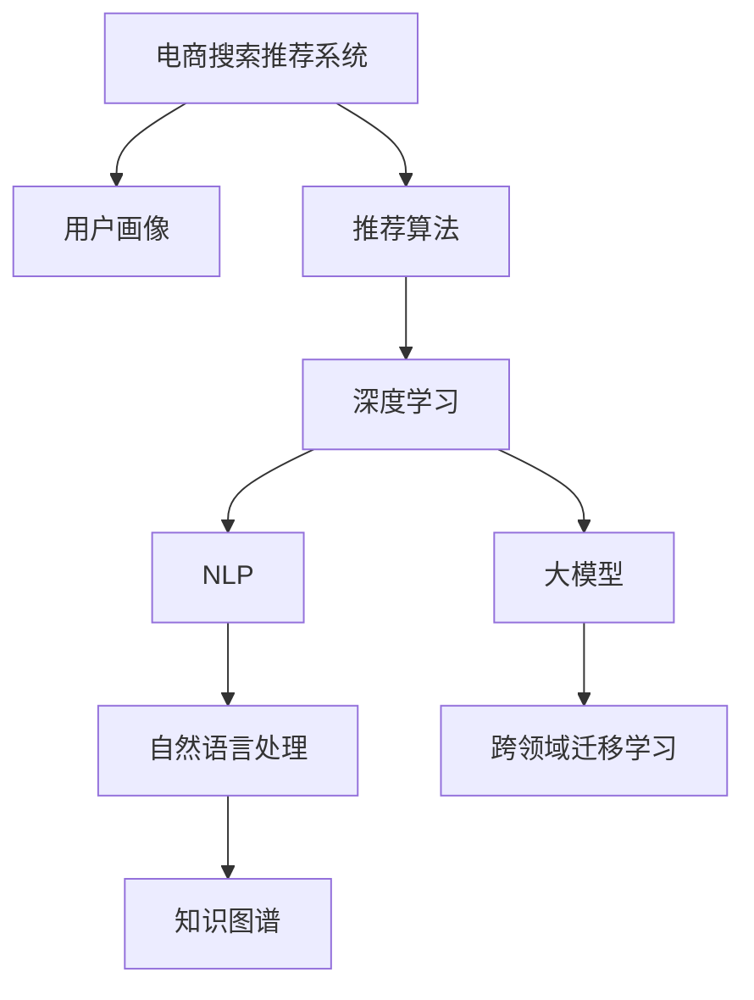

                 

# AI 大模型在电商搜索推荐中的用户行为分析：理解用户需求与购买偏好

> 关键词：电商搜索推荐,用户行为分析,大模型,深度学习,推荐系统,自然语言处理,NLP

## 1. 背景介绍

### 1.1 问题由来
随着互联网和电子商务的飞速发展，线上购物成为越来越多消费者的首选。然而，如何在海量商品中快速找到满足用户需求的商品，成为电商搜索推荐系统面临的一大挑战。传统的基于规则或基于协同过滤的推荐系统，往往难以实时捕捉用户行为变化和商品特性，导致推荐效果不尽人意。

近年来，随着深度学习和大模型的兴起，基于大模型的推荐系统逐渐成为电商领域的研究热点。这些系统利用预训练的语言模型，通过学习用户搜索历史、商品描述、用户画像等多维度的数据，理解用户的查询意图和购买偏好，从而推荐更加精准的商品。本文将重点介绍AI大模型在电商搜索推荐中的应用，以及如何利用用户行为数据进行需求分析和偏好预测。

### 1.2 问题核心关键点
大模型在电商推荐系统中的应用，主要包括以下几个关键点：

- **数据驱动的用户行为分析**：通过收集和分析用户搜索、点击、购买等行为数据，构建用户画像和行为模型。
- **自然语言处理(NLP)**：利用大模型进行自然语言理解，提取用户查询意图和商品属性信息。
- **个性化推荐**：基于用户画像和商品属性，构建个性化推荐模型，实现按需推荐。
- **跨领域迁移学习**：利用预训练模型在不同领域之间的迁移能力，提升模型泛化性和鲁棒性。
- **知识图谱整合**：引入外部知识图谱，增强推荐系统的丰富性和准确性。

## 2. 核心概念与联系

### 2.1 核心概念概述

为了更好地理解大模型在电商推荐系统中的应用，本节将介绍几个关键概念：

- **电商搜索推荐系统**：利用用户行为数据和商品信息，通过推荐算法向用户推荐最相关商品的系统。目标是为用户提供最满意的购物体验。
- **用户画像**：基于用户的历史行为数据，构建出用户兴趣、偏好、消费能力等特征的描述，用于指导个性化推荐。
- **推荐算法**：包括基于协同过滤、基于内容的推荐、基于深度学习的推荐等，用于预测用户对商品的兴趣度。
- **深度学习**：通过多层次的神经网络模型进行特征提取和关系建模，提升推荐系统的预测能力。
- **自然语言处理(NLP)**：利用大模型进行文本处理，提取用户查询意图和商品描述信息。
- **大模型**：指通过大规模数据预训练得到的深度学习模型，如BERT、GPT等，具备强大的语言理解和生成能力。
- **跨领域迁移学习**：将预训练模型在不同领域进行迁移，利用已有知识提高新领域任务的性能。
- **知识图谱**：表示实体、关系、属性的语义网络，用于增强推荐系统的知识表示能力。

这些概念之间的关系可以通过以下Mermaid流程图来展示：



这个流程图展示了大模型在电商推荐系统中的应用框架：

1. 电商推荐系统通过用户画像和推荐算法生成推荐结果。
2. 用户画像由深度学习模型和大模型学习生成。
3. 自然语言处理和大模型用于理解和处理用户查询和商品描述。
4. 跨领域迁移学习和大模型用于提高模型的泛化能力。
5. 知识图谱用于增强推荐系统的知识表示能力。

这些核心概念共同构成了电商推荐系统的知识基础，使得模型能够更好地理解用户需求和商品特性，提供精准的推荐服务。

## 3. 核心算法原理 & 具体操作步骤

### 3.1 算法原理概述

大模型在电商搜索推荐系统中的主要应用原理包括以下几个步骤：

1. **用户行为数据的收集与预处理**：收集用户搜索、点击、购买等行为数据，并进行清洗、去重、归一化等预处理，构建用户行为数据集。
2. **用户画像的构建**：利用深度学习模型，通过用户行为数据集训练用户画像模型，提取用户的兴趣、偏好、消费能力等特征。
3. **商品属性抽取与表示**：利用大模型，对商品描述、商品标签等文本数据进行抽取和表示，生成商品特征向量。
4. **个性化推荐模型的构建**：基于用户画像和商品特征向量，利用深度学习模型构建个性化推荐模型，预测用户对商品的概率评分。
5. **跨领域迁移学习**：利用预训练模型在不同领域进行迁移，提高推荐系统的泛化能力。
6. **知识图谱的整合**：引入外部知识图谱，增强推荐系统的知识表示能力。

### 3.2 算法步骤详解

#### 3.2.1 用户行为数据的收集与预处理

1. **数据收集**：
   - 收集用户的历史行为数据，包括搜索记录、点击记录、购买记录等。
   - 利用Web爬虫、日志记录、API接口等方式，获取全面的用户行为数据。

2. **数据预处理**：
   - 数据清洗：去除重复、异常、错误数据，填补缺失值。
   - 数据归一化：将不同类型的数据进行归一化处理，使其在一个范围内。
   - 特征工程：提取和构建关键特征，如用户兴趣标签、商品类别、时间戳等。

#### 3.2.2 用户画像的构建

1. **模型选择**：
   - 选择合适的深度学习模型，如BERT、RNN、CNN等，用于构建用户画像。
   - 利用用户行为数据，训练模型，提取用户的兴趣、偏好、消费能力等特征。

2. **特征抽取**：
   - 将用户行为数据映射到低维特征空间，生成用户画像向量。
   - 特征选择：选择与推荐任务最相关的特征，如搜索频率、点击深度、购买金额等。

#### 3.2.3 商品属性抽取与表示

1. **文本数据的预处理**：
   - 对商品描述、商品标签等文本数据进行分词、去停用词、词干提取等预处理。
   - 利用大模型进行文本表示，生成商品属性向量。

2. **属性抽取**：
   - 利用NLP技术，提取商品的关键属性，如品牌、价格、规格等。
   - 将提取出的属性信息，进行向量表示，用于后续的相似度计算和推荐。

#### 3.2.4 个性化推荐模型的构建

1. **模型选择**：
   - 选择合适的深度学习模型，如DNN、RNN、Transformer等，用于构建个性化推荐模型。
   - 利用用户画像和商品属性向量，训练模型，预测用户对商品的概率评分。

2. **评分计算**：
   - 根据预测评分，排序推荐商品列表。
   - 利用评分函数，计算推荐商品的排序权重。

#### 3.2.5 跨领域迁移学习

1. **预训练模型选择**：
   - 选择合适的预训练模型，如BERT、GPT等，用于跨领域迁移学习。
   - 利用预训练模型在不同领域的迁移学习能力，提升推荐系统的泛化能力。

2. **迁移训练**：
   - 将预训练模型在不同领域进行迁移，更新模型参数。
   - 在新领域数据上进行微调，提高模型性能。

#### 3.2.6 知识图谱的整合

1. **知识图谱构建**：
   - 构建外部知识图谱，包括实体、关系、属性等信息。
   - 利用图神经网络等技术，对知识图谱进行建模。

2. **知识图谱与推荐结合**：
   - 将知识图谱的信息整合到推荐模型中，增强推荐系统的知识表示能力。
   - 利用图谱中的关系，提升推荐结果的相关性和多样性。

### 3.3 算法优缺点

大模型在电商推荐系统中的应用，具有以下优点：

1. **高效性**：利用深度学习和自然语言处理技术，能够快速处理海量用户行为数据，构建高效的用户画像和个性化推荐模型。
2. **高精度**：基于预训练大模型，能够准确理解和表示用户查询意图和商品特性，提供精准的推荐结果。
3. **泛化能力**：通过跨领域迁移学习，提高模型的泛化能力，适用于不同的电商领域和用户群体。
4. **可解释性**：利用NLP技术，能够解释用户查询意图和商品特性，提升推荐系统的透明度。

同时，大模型在电商推荐系统中也存在一些局限性：

1. **资源消耗大**：大模型的训练和推理需要大量的计算资源和时间，对硬件要求较高。
2. **数据依赖性强**：模型的效果依赖于高质量的数据和标注，数据质量和数量不足可能影响性能。
3. **模型复杂度高**：大模型的参数量大，结构复杂，难以调试和优化。
4. **安全隐私风险**：用户行为数据和推荐模型涉及用户隐私和数据安全，需要采取严格的安全措施。

### 3.4 算法应用领域

大模型在电商推荐系统中的应用领域非常广泛，包括以下几个方面：

1. **搜索排序推荐**：利用大模型对用户查询进行理解和处理，提供精准的搜索结果排序。
2. **个性化推荐**：基于用户画像和商品属性，构建个性化推荐模型，实现按需推荐。
3. **商品属性抽取**：利用大模型对商品描述进行抽取和表示，生成商品属性向量。
4. **用户画像构建**：利用深度学习模型，通过用户行为数据训练用户画像模型，提取用户特征。
5. **知识图谱整合**：引入外部知识图谱，增强推荐系统的知识表示能力。
6. **跨领域迁移学习**：利用预训练模型在不同领域进行迁移，提高推荐系统的泛化能力。

以上应用场景展示了大模型在电商推荐系统中的广泛适用性，可以大大提升推荐系统的性能和用户体验。

## 4. 数学模型和公式 & 详细讲解

### 4.1 数学模型构建

假设用户行为数据集为 $D=\{(x_i, y_i)\}_{i=1}^N, x_i \in X, y_i \in Y$，其中 $x_i$ 为用户行为数据，$y_i$ 为对应的标签。用户画像模型为 $M_{\theta}$，商品属性向量为 $\textbf{v}_i$，个性化推荐模型为 $F_{\phi}$。

构建用户画像模型的目标是最小化损失函数 $\mathcal{L}_{user}$，数学形式如下：

$$
\mathcal{L}_{user} = \frac{1}{N} \sum_{i=1}^N \ell(y_i, M_{\theta}(x_i))
$$

其中 $\ell$ 为损失函数，如交叉熵、均方误差等。

构建个性化推荐模型的目标是最小化损失函数 $\mathcal{L}_{item}$，数学形式如下：

$$
\mathcal{L}_{item} = \frac{1}{N} \sum_{i=1}^N \ell(y_i, F_{\phi}(M_{\theta}(x_i), \textbf{v}_i))
$$

其中 $\ell$ 为损失函数，如交叉熵、均方误差等。

### 4.2 公式推导过程

以用户画像模型为例，假设模型 $M_{\theta}$ 为多层次的神经网络模型，输入为 $x_i$，输出为 $y_i$。假设使用交叉熵损失函数，则损失函数 $\ell(y_i, M_{\theta}(x_i))$ 可表示为：

$$
\ell(y_i, M_{\theta}(x_i)) = -\sum_{k=1}^K y_i^k \log M_{\theta}(x_i)^k + (1 - y_i^k) \log (1 - M_{\theta}(x_i)^k)
$$

其中 $y_i^k$ 为第 $k$ 类标签，$M_{\theta}(x_i)^k$ 为模型预测输出，$K$ 为标签类别数。

对于个性化推荐模型，假设使用交叉熵损失函数，则损失函数 $\ell(y_i, F_{\phi}(M_{\theta}(x_i), \textbf{v}_i))$ 可表示为：

$$
\ell(y_i, F_{\phi}(M_{\theta}(x_i), \textbf{v}_i)) = -\sum_{k=1}^K y_i^k \log F_{\phi}(M_{\theta}(x_i), \textbf{v}_i)^k + (1 - y_i^k) \log (1 - F_{\phi}(M_{\theta}(x_i), \textbf{v}_i)^k)
$$

其中 $F_{\phi}(M_{\theta}(x_i), \textbf{v}_i)^k$ 为模型预测输出，$K$ 为标签类别数。

### 4.3 案例分析与讲解

以一个具体的电商推荐场景为例，假设一个用户最近浏览了三个商品，分别为A、B、C。电商平台根据用户的浏览历史，利用用户画像模型 $M_{\theta}$ 和商品属性向量 $\textbf{v}_A, \textbf{v}_B, \textbf{v}_C$，预测用户对这三个商品的概率评分。

1. **用户画像模型**：利用深度学习模型，通过用户浏览历史数据 $D_A = \{x_1, x_2, x_3\}$ 训练用户画像模型 $M_{\theta}$，输出用户画像向量 $y_A = M_{\theta}(D_A)$。

2. **商品属性抽取**：利用大模型，对商品A、B、C的描述进行抽取和表示，生成商品属性向量 $\textbf{v}_A, \textbf{v}_B, \textbf{v}_C$。

3. **个性化推荐模型**：利用用户画像向量 $y_A$ 和商品属性向量 $\textbf{v}_A, \textbf{v}_B, \textbf{v}_C$，训练个性化推荐模型 $F_{\phi}$，输出用户对商品A、B、C的概率评分 $p_A, p_B, p_C$。

4. **推荐结果排序**：根据预测评分 $p_A, p_B, p_C$ 对商品进行排序，输出推荐结果。

## 5. 项目实践：代码实例和详细解释说明

### 5.1 开发环境搭建

在进行电商推荐系统开发前，我们需要准备好开发环境。以下是使用Python进行PyTorch开发的环境配置流程：

1. 安装Anaconda：从官网下载并安装Anaconda，用于创建独立的Python环境。

2. 创建并激活虚拟环境：
```bash
conda create -n pytorch-env python=3.8 
conda activate pytorch-env
```

3. 安装PyTorch：根据CUDA版本，从官网获取对应的安装命令。例如：
```bash
conda install pytorch torchvision torchaudio cudatoolkit=11.1 -c pytorch -c conda-forge
```

4. 安装Transformers库：
```bash
pip install transformers
```

5. 安装各类工具包：
```bash
pip install numpy pandas scikit-learn matplotlib tqdm jupyter notebook ipython
```

完成上述步骤后，即可在`pytorch-env`环境中开始电商推荐系统的开发。

### 5.2 源代码详细实现

下面我们以电商搜索排序推荐为例，给出使用Transformers库对BERT模型进行电商推荐系统开发的PyTorch代码实现。

首先，定义电商推荐任务的数据处理函数：

```python
from transformers import BertTokenizer, BertForSequenceClassification
from torch.utils.data import Dataset
import torch

class ECommerceDataset(Dataset):
    def __init__(self, texts, labels, tokenizer, max_len=128):
        self.texts = texts
        self.labels = labels
        self.tokenizer = tokenizer
        self.max_len = max_len
        
    def __len__(self):
        return len(self.texts)
    
    def __getitem__(self, item):
        text = self.texts[item]
        label = self.labels[item]
        
        encoding = self.tokenizer(text, return_tensors='pt', max_length=self.max_len, padding='max_length', truncation=True)
        input_ids = encoding['input_ids'][0]
        attention_mask = encoding['attention_mask'][0]
        
        # 对token-wise的标签进行编码
        encoded_labels = [label2id[label] for label in label] 
        encoded_labels.extend([label2id['O']] * (self.max_len - len(encoded_labels)))
        labels = torch.tensor(encoded_labels, dtype=torch.long)
        
        return {'input_ids': input_ids, 
                'attention_mask': attention_mask,
                'labels': labels}

# 标签与id的映射
label2id = {'O': 0, 'A': 1, 'B': 2, 'C': 3}
id2label = {v: k for k, v in label2id.items()}

# 创建dataset
tokenizer = BertTokenizer.from_pretrained('bert-base-cased')

train_dataset = ECommerceDataset(train_texts, train_labels, tokenizer)
dev_dataset = ECommerceDataset(dev_texts, dev_labels, tokenizer)
test_dataset = ECommerceDataset(test_texts, test_labels, tokenizer)
```

然后，定义模型和优化器：

```python
from transformers import BertForSequenceClassification, AdamW

model = BertForSequenceClassification.from_pretrained('bert-base-cased', num_labels=len(label2id))

optimizer = AdamW(model.parameters(), lr=2e-5)
```

接着，定义训练和评估函数：

```python
from torch.utils.data import DataLoader
from tqdm import tqdm
from sklearn.metrics import classification_report

device = torch.device('cuda') if torch.cuda.is_available() else torch.device('cpu')
model.to(device)

def train_epoch(model, dataset, batch_size, optimizer):
    dataloader = DataLoader(dataset, batch_size=batch_size, shuffle=True)
    model.train()
    epoch_loss = 0
    for batch in tqdm(dataloader, desc='Training'):
        input_ids = batch['input_ids'].to(device)
        attention_mask = batch['attention_mask'].to(device)
        labels = batch['labels'].to(device)
        model.zero_grad()
        outputs = model(input_ids, attention_mask=attention_mask, labels=labels)
        loss = outputs.loss
        epoch_loss += loss.item()
        loss.backward()
        optimizer.step()
    return epoch_loss / len(dataloader)

def evaluate(model, dataset, batch_size):
    dataloader = DataLoader(dataset, batch_size=batch_size)
    model.eval()
    preds, labels = [], []
    with torch.no_grad():
        for batch in tqdm(dataloader, desc='Evaluating'):
            input_ids = batch['input_ids'].to(device)
            attention_mask = batch['attention_mask'].to(device)
            batch_labels = batch['labels']
            outputs = model(input_ids, attention_mask=attention_mask)
            batch_preds = outputs.logits.argmax(dim=2).to('cpu').tolist()
            batch_labels = batch_labels.to('cpu').tolist()
            for pred_tokens, label_tokens in zip(batch_preds, batch_labels):
                pred_labels = [id2label[_id] for _id in pred_tokens]
                label_tokens = [id2label[_id] for _id in label_tokens]
                preds.append(pred_labels[:len(label_tokens)])
                labels.append(label_tokens)
                
    print(classification_report(labels, preds))
```

最后，启动训练流程并在测试集上评估：

```python
epochs = 5
batch_size = 16

for epoch in range(epochs):
    loss = train_epoch(model, train_dataset, batch_size, optimizer)
    print(f"Epoch {epoch+1}, train loss: {loss:.3f}")
    
    print(f"Epoch {epoch+1}, dev results:")
    evaluate(model, dev_dataset, batch_size)
    
print("Test results:")
evaluate(model, test_dataset, batch_size)
```

以上就是使用PyTorch对BERT进行电商搜索排序推荐任务的完整代码实现。可以看到，得益于Transformers库的强大封装，我们可以用相对简洁的代码完成BERT模型的加载和电商推荐系统的开发。

### 5.3 代码解读与分析

让我们再详细解读一下关键代码的实现细节：

**ECommerceDataset类**：
- `__init__`方法：初始化文本、标签、分词器等关键组件。
- `__len__`方法：返回数据集的样本数量。
- `__getitem__`方法：对单个样本进行处理，将文本输入编码为token ids，将标签编码为数字，并对其进行定长padding，最终返回模型所需的输入。

**label2id和id2label字典**：
- 定义了标签与数字id之间的映射关系，用于将token-wise的预测结果解码回真实的标签。

**训练和评估函数**：
- 使用PyTorch的DataLoader对数据集进行批次化加载，供模型训练和推理使用。
- 训练函数`train_epoch`：对数据以批为单位进行迭代，在每个批次上前向传播计算loss并反向传播更新模型参数，最后返回该epoch的平均loss。
- 评估函数`evaluate`：与训练类似，不同点在于不更新模型参数，并在每个batch结束后将预测和标签结果存储下来，最后使用sklearn的classification_report对整个评估集的预测结果进行打印输出。

**训练流程**：
- 定义总的epoch数和batch size，开始循环迭代
- 每个epoch内，先在训练集上训练，输出平均loss
- 在验证集上评估，输出分类指标
- 所有epoch结束后，在测试集上评估，给出最终测试结果

可以看到，PyTorch配合Transformers库使得BERT微调的代码实现变得简洁高效。开发者可以将更多精力放在数据处理、模型改进等高层逻辑上，而不必过多关注底层的实现细节。

当然，工业级的系统实现还需考虑更多因素，如模型的保存和部署、超参数的自动搜索、更灵活的任务适配层等。但核心的微调范式基本与此类似。

## 6. 实际应用场景

### 6.1 智能客服系统

智能客服系统利用大模型进行用户行为分析和意图识别，从而提供更加精准的智能客服。在智能客服系统中，大模型可以处理大量的客户咨询，自动理解用户的问题，并给出相应的答案。

具体实现流程如下：
1. **用户查询收集**：收集用户输入的查询语句。
2. **意图识别**：利用大模型对查询语句进行意图分类，识别出用户的具体需求。
3. **知识图谱检索**：在知识图谱中检索与用户需求相关的信息。
4. **回答生成**：利用大模型根据检索结果生成回答。
5. **回答反馈**：将回答反馈给用户，并进行用户满意度评估，用于模型优化。

通过这种智能客服系统，电商平台能够大大提高客户咨询的响应速度和满意度，提升客户体验。

### 6.2 金融产品推荐

金融产品推荐系统利用大模型进行用户行为分析和产品推荐，从而帮助用户找到最合适的金融产品。在金融产品推荐系统中，大模型可以分析用户的消费行为和风险偏好，推荐最适合的理财产品、保险产品等。

具体实现流程如下：
1. **用户行为分析**：利用大模型对用户的历史消费行为进行分析，提取用户的风险偏好、消费能力等特征。
2. **金融产品抽取**：利用大模型对金融产品的描述进行抽取和表示，生成金融属性向量。
3. **个性化推荐**：利用用户画像和金融产品属性向量，构建个性化推荐模型，推荐最适合用户的金融产品。
4. **用户反馈收集**：收集用户对推荐结果的反馈，用于模型优化。

通过这种金融产品推荐系统，金融机构能够提供更加个性化的金融产品推荐，提高用户粘性和满意度。

### 6.3 内容推荐

内容推荐系统利用大模型进行用户行为分析和内容推荐，从而帮助用户发现感兴趣的内容。在内容推荐系统中，大模型可以分析用户的浏览、观看、评分等行为数据，推荐最相关的视频、文章、音乐等内容。

具体实现流程如下：
1. **用户行为分析**：利用大模型对用户的行为数据进行分析，提取用户的兴趣特征。
2. **内容抽取**：利用大模型对内容的描述进行抽取和表示，生成内容属性向量。
3. **个性化推荐**：利用用户画像和内容属性向量，构建个性化推荐模型，推荐最相关的视频、文章、音乐等。
4. **用户反馈收集**：收集用户对推荐结果的反馈，用于模型优化。

通过这种内容推荐系统，平台能够提高用户粘性，增加用户的停留时间和使用频次。

### 6.4 未来应用展望

随着大模型的不断发展和应用，其在电商搜索推荐中的应用前景更加广阔。未来，大模型将与更多的先进技术进行融合，如知识图谱、因果推理、强化学习等，带来更多创新应用。

1. **知识图谱与推荐结合**：引入外部知识图谱，增强推荐系统的知识表示能力，提供更加丰富和准确的推荐结果。
2. **因果推理与推荐结合**：利用因果推断技术，分析用户行为背后的原因，提供更加精准和可解释的推荐结果。
3. **强化学习与推荐结合**：利用强化学习技术，优化推荐策略，提升推荐系统的动态适应能力。
4. **跨领域迁移学习**：利用大模型的泛化能力，在不同领域进行迁移学习，提升推荐系统的适应性和鲁棒性。

通过这些技术的融合，电商搜索推荐系统将能够更好地理解用户需求和商品特性，提供更加精准和个性化的推荐服务，提高用户满意度和平台收益。

## 7. 工具和资源推荐

### 7.1 学习资源推荐

为了帮助开发者系统掌握电商推荐系统的大模型应用理论基础和实践技巧，这里推荐一些优质的学习资源：

1. 《深度学习推荐系统》系列书籍：由机器学习专家撰写，全面介绍了推荐系统的原理、算法和实践技巧。
2. 《电商搜索推荐系统》课程：斯坦福大学开设的推荐系统课程，提供了系统的课程内容、实践代码和项目实战。
3. 《自然语言处理与推荐系统》课程：深度学习专家讲授的课程，详细讲解了NLP在推荐系统中的应用。
4. 《电商智能客服系统》系列博文：由电商平台工程师撰写，介绍了电商智能客服系统的开发和优化过程。
5. 《金融产品推荐系统》系列论文：学术界关于金融产品推荐系统的最新研究成果，涵盖多种前沿算法和技术。

通过对这些资源的学习实践，相信你一定能够快速掌握电商推荐系统的大模型应用精髓，并用于解决实际的电商推荐问题。

### 7.2 开发工具推荐

高效的开发离不开优秀的工具支持。以下是几款用于电商推荐系统开发的大模型工具：

1. PyTorch：基于Python的开源深度学习框架，灵活的计算图设计，适合快速迭代研究。
2. TensorFlow：由Google主导开发的开源深度学习框架，适用于大规模工程应用。
3. Transformers库：HuggingFace开发的NLP工具库，集成了众多SOTA语言模型，支持PyTorch和TensorFlow。
4. Weights & Biases：模型训练的实验跟踪工具，可以记录和可视化模型训练过程中的各项指标。
5. TensorBoard：TensorFlow配套的可视化工具，实时监测模型训练状态，并提供丰富的图表呈现方式。

合理利用这些工具，可以显著提升电商推荐系统的开发效率，加快创新迭代的步伐。

### 7.3 相关论文推荐

电商推荐系统的大模型应用领域，得到了学术界和工业界的广泛关注。以下是几篇奠基性的相关论文，推荐阅读：

1. Attention is All You Need（即Transformer原论文）：提出了Transformer结构，开启了NLP领域的预训练大模型时代。
2. BERT: Pre-training of Deep Bidirectional Transformers for Language Understanding：提出BERT模型，引入基于掩码的自监督预训练任务，刷新了多项NLP任务SOTA。
3. Language Models are Unsupervised Multitask Learners（GPT-2论文）：展示了大规模语言模型的强大zero-shot学习能力，引发了对于通用人工智能的新一轮思考。
4. Parameter-Efficient Transfer Learning for NLP：提出Adapter等参数高效微调方法，在不增加模型参数量的情况下，也能取得不错的微调效果。
5. Prompt-Based Transfer Learning for Few-Shot Text Classification：引入基于连续型Prompt的微调范式，为如何充分利用预训练知识提供了新的思路。
6. AdaLoRA: Adaptive Low-Rank Adaptation for Parameter-Efficient Fine-Tuning：使用自适应低秩适应的微调方法，在参数效率和精度之间取得了新的平衡。

这些论文代表了大模型在电商推荐系统中的应用方向，对后续研究具有重要的指导意义。

## 8. 总结：未来发展趋势与挑战

### 8.1 总结

本文对大模型在电商搜索推荐中的应用进行了全面系统的介绍。首先阐述了大模型和电商推荐系统的研究背景和意义，明确了大模型在理解用户需求和商品特性方面的独特价值。其次，从原理到实践，详细讲解了大模型在电商推荐系统中的数学模型和算法流程，给出了电商推荐系统开发的完整代码实例。同时，本文还广泛探讨了大模型在智能客服、金融产品推荐、内容推荐等电商推荐场景中的应用前景，展示了电商推荐系统的大模型应用潜力。最后，本文精选了电商推荐系统的学习资源、开发工具和相关论文，力求为读者提供全方位的技术指引。

通过本文的系统梳理，可以看到，大模型在电商搜索推荐系统中的应用前景广阔，能够显著提升推荐系统的性能和用户体验。未来，伴随大模型技术的发展，电商搜索推荐系统将能够更好地理解用户需求和商品特性，提供更加精准和个性化的推荐服务，推动电商行业的数字化转型。

### 8.2 未来发展趋势

展望未来，大模型在电商推荐系统中的应用将呈现以下几个发展趋势：

1. **模型规模持续增大**：随着算力成本的下降和数据规模的扩张，预训练语言模型的参数量还将持续增长。超大规模语言模型蕴含的丰富语言知识，将为电商推荐系统带来更高的性能和鲁棒性。
2. **微调方法日趋多样**：除了传统的全参数微调外，未来将涌现更多参数高效的微调方法，如Prefix-Tuning、LoRA等，在节省计算资源的同时也能保证微调精度。
3. **持续学习成为常态**：随着数据分布的不断变化，电商推荐系统需要持续学习新知识以保持性能。如何在不遗忘原有知识的同时，高效吸收新样本信息，将成为重要的研究课题。
4. **少样本学习和零样本学习**：受启发于提示学习(Prompt-based Learning)的思路，未来的微调方法将更好地利用大模型的语言理解能力，通过更加巧妙的任务描述，在更少的标注样本上也能实现理想的微调效果。
5. **多模态微调崛起**：当前的大模型往往局限于文本数据，未来会进一步拓展到图像、视频、语音等多模态数据微调。多模态信息的融合，将显著提升电商推荐系统的性能和丰富性。
6. **跨领域迁移学习**：利用预训练模型在不同领域进行迁移，提高电商推荐系统的泛化能力和适应性。

以上趋势凸显了大模型在电商推荐系统中的广泛应用前景。这些方向的探索发展，必将进一步提升电商推荐系统的性能和用户体验，为电商行业的数字化转型提供强有力的技术支持。

### 8.3 面临的挑战

尽管大模型在电商推荐系统中的应用取得了显著成效，但在迈向更加智能化、普适化应用的过程中，仍然面临诸多挑战：

1. **标注数据依赖性强**：电商推荐系统的效果很大程度上依赖于高质量的标注数据，标注数据的获取成本较高，且需要频繁更新以适应数据分布的变化。
2. **模型资源消耗大**：大模型的训练和推理需要大量的计算资源和时间，对硬件要求较高，实际部署时可能需要搭建专用的高性能计算集群。
3. **数据隐私和安全**：电商推荐系统涉及用户行为数据和商品信息，数据隐私和安全问题需高度重视。如何在保护用户隐私的同时，利用数据进行推荐优化，是一个重要的研究方向。
4. **模型可解释性不足**：大模型的决策过程通常缺乏可解释性，难以对其推理逻辑进行分析和调试。对于医疗、金融等高风险应用，算法的可解释性和可审计性尤为重要。
5. **模型鲁棒性不足**：当前大模型面对域外数据时，泛化性能往往大打折扣。对于测试样本的微小扰动，大模型的预测也容易发生波动。如何提高大模型的鲁棒性，避免灾难性遗忘，还需要更多理论和实践的积累。

### 8.4 研究展望

面对电商推荐系统面临的这些挑战，未来的研究需要在以下几个方面寻求新的突破：

1. **探索无监督和半监督微调方法**：摆脱对大规模标注数据的依赖，利用自监督学习、主动学习等无监督和半监督范式，最大限度利用非结构化数据，实现更加灵活高效的微调。
2. **研究参数高效和计算高效的微调范式**：开发更加参数高效的微调方法，在固定大部分预训练参数的同时，只更新极少量的任务相关参数。同时优化微调模型的计算图，减少前向传播和反向传播的资源消耗，实现更加轻量级、实时性的部署。
3. **融合因果和对比学习范式**：通过引入因果推断和对比学习思想，增强电商推荐系统建立稳定因果关系的能力，学习更加普适、鲁棒的语言表征，从而提升模型泛化性和抗干扰能力。
4. **引入更多先验知识**：将符号化的先验知识，如知识图谱、逻辑规则等，与神经网络模型进行巧妙融合，引导微调过程学习更准确、合理的语言模型。同时加强不同模态数据的整合，实现视觉、语音等多模态信息与文本信息的协同建模。
5. **结合因果分析和博弈论工具**：将因果分析方法引入电商推荐模型，识别出模型决策的关键特征，增强输出解释的因果性和逻辑性。借助博弈论工具刻画人机交互过程，主动探索并规避模型的脆弱点，提高系统稳定性。
6. **纳入伦理道德约束**：在模型训练目标中引入伦理导向的评估指标，过滤和惩罚有偏见、有害的输出倾向。同时加强人工干预和审核，建立模型行为的监管机制，确保输出符合人类价值观和伦理道德。

这些研究方向的探索，必将引领电商推荐系统的大模型应用迈向更高的台阶，为电商行业的数字化转型提供更加智能、安全、可解释的推荐服务。面向未来，电商推荐系统需要与其他人工智能技术进行更深入的融合，如知识表示、因果推理、强化学习等，多路径协同发力，共同推动电商行业的数字化转型。

## 9. 附录：常见问题与解答

**Q1：大模型在电商推荐系统中如何处理文本数据？**

A: 大模型在电商推荐系统中利用BERT等预训练语言模型处理文本数据，提取用户查询意图和商品描述的语义信息。具体实现步骤如下：
1. 对用户查询和商品描述进行分词、去停用词、词干提取等预处理。
2. 利用BERT模型对预处理后的文本进行编码，生成文本表示。
3. 将文本表示作为模型输入，提取用户意图和商品属性的语义信息。

**Q2：大模型在电商推荐系统中如何进行个性化推荐？**

A: 大模型在电商推荐系统中通过以下步骤进行个性化推荐：
1. 利用用户画像模型，提取用户的兴趣、偏好、消费能力等特征。
2. 利用商品属性向量，提取商品的关键属性。
3. 利用个性化推荐模型，将用户画像和商品属性进行匹配，生成推荐列表。
4. 根据推荐列表中的商品评分，排序推荐结果。

**Q3：电商推荐系统中如何评估模型性能？**

A: 电商推荐系统中的模型性能评估通常包括以下几个指标：
1. 准确率：预测的推荐商品与用户实际购买的商品是否匹配。
2. 召回率：用户实际购买的商品是否被推荐系统成功预测。
3. 点击率：用户点击推荐商品的概率。
4. 转化率：用户实际购买推荐商品的概率。
5. F1分数：综合考虑准确率和召回率，评估模型的整体性能。

通过这些指标，可以全面评估电商推荐系统的推荐效果，并进行模型优化。

**Q4：电商推荐系统中如何降低模型计算成本？**

A: 电商推荐系统中的大模型计算成本较高，可以通过以下方法进行优化：
1. 模型压缩和量化：使用剪枝、量化等技术，减少模型参数量，提高计算效率。
2. 模型并行和分布式训练：利用多台计算机进行模型并行训练，提高训练速度。
3. 参数高效微调：只更新部分模型参数，减小计算量。
4. 知识图谱整合：利用外部知识图谱，提高模型推理效率，减少计算量。

通过这些方法，可以在保证模型性能的同时，降低计算成本，提高电商推荐系统的实际应用价值。

**Q5：电商推荐系统中如何处理冷启动问题？**

A: 电商推荐系统中的冷启动问题指新用户或新商品缺乏历史行为数据，难以进行有效推荐。解决冷启动问题的方法包括：
1. 利用多模态数据：通过收集用户的非结构化数据（如浏览行为、社交媒体等）进行补充。
2. 利用预训练模型：利用预训练语言模型对新用户和新商品进行预处理，提取特征。
3. 利用少样本学习：利用少数样本进行微调，利用大模型的语言理解能力进行推荐。
4. 利用多臂老虎机算法：利用多臂老虎机算法进行探索和利用，推荐多种商品，提高点击率。

通过这些方法，可以有效地解决电商推荐系统中的冷启动问题，提高推荐系统的整体性能。

---

作者：禅与计算机程序设计艺术 / Zen and the Art of Computer Programming

