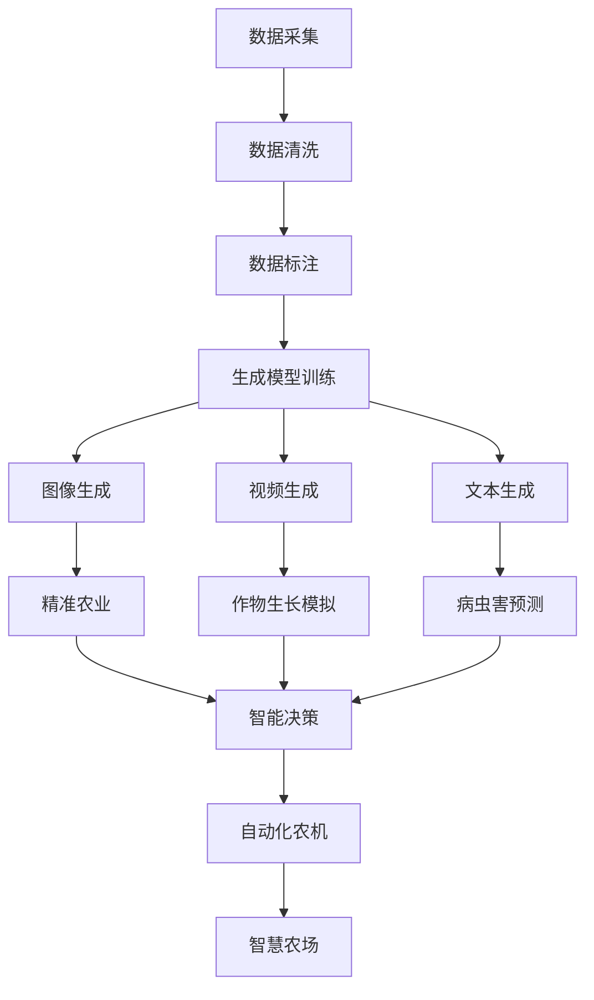

                 

# AIGC助力智慧农业发展

> 关键词：
  - 人工智能
  - 生成对抗网络（GAN）
  - 智慧农业
  - 精准农业
  - 无人农场
  - 农业机器人
  - 植物生长模拟
  - 作物产量预测
  - 农业监测
  - 农业管理决策

## 1. 背景介绍

### 1.1 问题由来

随着人口的持续增长和城市化进程的加速，食品安全和农业生产效率成为了全球关注的焦点。传统的农业生产方式面临劳动力短缺、资源浪费、环境污染等诸多问题，亟需转型升级。智慧农业（Smart Agriculture）应运而生，通过现代信息技术手段，实现农业生产的自动化、智能化、精准化管理。

农业信息化与智能化涉及众多领域，包括农田遥感监测、精准农业、智能灌溉、病虫害防治、自动化农机等。其中，AIGC（Artificial Intelligence for Agriculture，农业人工智能）通过将AI技术引入农业生产中，实现农业生产的智能化和自动化。AI技术已经在农业领域得到广泛应用，特别是基于生成对抗网络（GAN）的生成模型在智慧农业中展现了巨大潜力。

本文将重点讨论基于GAN的AIGC技术在智慧农业中的应用，以期为农业生产提供新的视角和解决方案。

### 1.2 问题核心关键点

AIGC技术利用人工智能和大数据技术，优化农业生产流程，提高生产效率和资源利用率。特别是基于GAN的生成模型，通过对农业数据的学习，可以生成高质量的农业图像、视频、文本等，用于农田遥感监测、精准农业、作物生长模拟、病虫害预测等环节。

1. **数据获取与处理**：
   - 通过遥感卫星、无人机、传感器等设备，获取农田图像、气象数据、土壤数据等。
   - 对数据进行清洗、标注、预处理，生成模型所需格式。

2. **生成模型训练**：
   - 使用GAN等生成模型对农业数据进行学习，生成高质量的农业图像和视频。
   - 使用GAN生成的数据进行精准农业、作物生长模拟等任务。

3. **智能决策与分析**：
   - 结合农业生产数据和气象数据，利用机器学习算法进行农业管理决策。
   - 实时监控农田状态，自动调整灌溉、施肥、病虫害防治等措施。

4. **智慧农场与自动化农机**：
   - 利用生成的图像和视频指导农业机械作业，如自动播种、喷洒农药等。
   - 通过计算机视觉技术，自动识别作物生长状态，进行精准管理。

## 2. 核心概念与联系

### 2.1 核心概念概述

为了更好地理解基于GAN的AIGC技术，我们需要先了解以下几个核心概念：

- **生成对抗网络（GAN）**：由生成器（Generator）和判别器（Discriminator）两个子网络组成，通过对抗训练的方式，生成逼真的样本数据。
- **智慧农业（Smart Agriculture）**：通过现代信息技术手段，实现农业生产的自动化、智能化、精准化管理。
- **精准农业（Precision Agriculture）**：利用高科技手段，精确测量农田数据，实施精确农业操作。
- **无人农场（Unmanned Farming）**：采用自动化和智能化技术，实现农业生产过程的无人化管理。
- **农业机器人（Agricultural Robotics）**：使用机器人技术，完成农业生产中的播种、收割、喷洒农药等任务。

这些核心概念之间的联系可以通过以下Mermaid流程图来展示：



这个流程图展示了数据采集、处理、生成模型训练、生成农业图像、视频、文本等数据，以及其在精准农业、作物生长模拟、病虫害预测、智能决策、自动化农机和智慧农场中的应用。

## 3. 核心算法原理 & 具体操作步骤

### 3.1 算法原理概述

基于GAN的AIGC技术主要包括以下几个关键步骤：

1. **数据采集与处理**：
   - 收集农田图像、气象数据、土壤数据等农业生产数据。
   - 对数据进行清洗、标注、预处理，生成模型所需格式。

2. **生成模型训练**：
   - 使用GAN等生成模型对农业数据进行学习，生成高质量的农业图像和视频。
   - 将生成的数据输入到精准农业、作物生长模拟、病虫害预测等模型中，进行进一步分析和决策。

3. **智能决策与分析**：
   - 结合农业生产数据和气象数据，利用机器学习算法进行农业管理决策。
   - 实时监控农田状态，自动调整灌溉、施肥、病虫害防治等措施。

4. **智慧农场与自动化农机**：
   - 利用生成的图像和视频指导农业机械作业，如自动播种、喷洒农药等。
   - 通过计算机视觉技术，自动识别作物生长状态，进行精准管理。

### 3.2 算法步骤详解

#### 3.2.1 数据采集与处理

1. **数据采集**：
   - 使用遥感卫星、无人机、传感器等设备，收集农田图像、气象数据、土壤数据等。
   - 对数据进行自动标注，生成监督学习所需的数据集。

2. **数据清洗与预处理**：
   - 去除噪声数据和异常值，进行数据归一化处理。
   - 使用数据增强技术，扩充数据集，防止模型过拟合。

#### 3.2.2 生成模型训练

1. **生成模型选择**：
   - 选择适合生成农业数据的生成模型，如GAN、变分自编码器（VAE）等。
   - 设计生成模型架构，包括生成器和判别器。

2. **模型训练**：
   - 使用训练集数据训练生成模型，优化模型参数。
   - 使用对抗训练策略，提高生成数据的真实性和多样性。

3. **模型评估与优化**：
   - 使用测试集数据评估生成模型的性能，使用Inception Score（IS）等指标。
   - 根据评估结果，调整生成模型超参数，进行模型优化。

#### 3.2.3 智能决策与分析

1. **特征提取与选择**：
   - 对农业生产数据和气象数据进行特征提取，选择有意义的特征。
   - 使用特征选择算法，提高特征的准确性和泛化能力。

2. **机器学习算法**：
   - 使用监督学习算法，如随机森林、支持向量机（SVM）等，进行农业管理决策。
   - 使用无监督学习算法，如聚类、降维等，进行数据预处理和分析。

3. **决策执行与优化**：
   - 根据决策结果，调整灌溉、施肥、病虫害防治等措施。
   - 实时监控农田状态，自动调整农业生产过程，优化决策效果。

#### 3.2.4 智慧农场与自动化农机

1. **图像与视频生成**：
   - 使用生成的图像和视频指导农业机械作业，如自动播种、喷洒农药等。
   - 利用计算机视觉技术，自动识别作物生长状态，进行精准管理。

2. **自动化农机控制**：
   - 设计自动化农机控制系统，如自动驾驶拖拉机、自动喷洒机器人等。
   - 通过物联网技术，实时监控农机状态，优化农机作业流程。

### 3.3 算法优缺点

#### 3.3.1 优点

1. **高精度的图像生成**：
   - 基于GAN的生成模型可以生成高质量的农业图像和视频，为精准农业、作物生长模拟、病虫害预测等任务提供支持。
   - 生成图像逼真度与真实数据无异，可以用于农业数据增强，提高模型泛化能力。

2. **多样化的数据集**：
   - 使用生成模型可以扩充数据集，丰富数据来源，提高模型的多样性和泛化能力。
   - 生成模型可以减少数据标注工作量，提高数据采集效率。

3. **动态的数据生成**：
   - 生成模型可以根据实时数据动态生成农业图像和视频，提高农业生产的实时性和灵活性。
   - 生成数据可以实时更新，适应农业生产中的动态变化。

#### 3.3.2 缺点

1. **模型训练时间较长**：
   - 生成模型的训练时间较长，需要大量的计算资源和训练数据。
   - 训练过程中容易出现过拟合现象，需要额外的正则化措施。

2. **数据生成质量不稳定**：
   - 生成模型的性能受数据质量影响较大，低质量的输入数据可能导致生成的图像和视频质量较差。
   - 生成数据可能存在噪声和偏差，影响后续模型的分析结果。

3. **依赖标注数据**：
   - 生成模型需要大量标注数据进行训练，标注数据的获取成本较高。
   - 数据标注工作量较大，可能导致数据获取速度较慢。

## 4. 数学模型和公式 & 详细讲解 & 举例说明

### 4.1 数学模型构建

基于GAN的AIGC技术主要包括以下几个数学模型：

1. **生成模型**：
   - 定义生成器的输入为农业数据 $x$，输出为生成的图像 $y$。生成器的映射关系为：
   $$
   y = G(x)
   $$

2. **判别模型**：
   - 定义判别器的输入为图像 $y$，输出为真实性标签 $z$。判别器的映射关系为：
   $$
   z = D(y)
   $$

3. **对抗训练**：
   - 生成器和判别器通过对抗训练不断优化，生成器的目标是让判别器无法区分真实数据和生成数据，判别器的目标是尽可能准确区分真实数据和生成数据。
   $$
   \min_G \max_D V(D,G)
   $$
   其中 $V(D,G)$ 为对抗损失函数。

4. **农业数据**：
   - 定义农业数据 $x$ 为农田图像、气象数据、土壤数据等。

5. **生成数据**：
   - 定义生成数据 $y$ 为生成的农业图像和视频。

6. **真实标签**：
   - 定义真实标签 $z$ 为0或1，表示数据是否为真实数据。

### 4.2 公式推导过程

#### 4.2.1 生成模型

生成模型的具体实现可以采用深度神经网络，如卷积神经网络（CNN）、生成对抗网络（GAN）等。以GAN为例，生成模型的基本结构如下：

1. **生成器（Generator）**：
   - 输入为农业数据 $x$，输出为生成的图像 $y$。
   $$
   y = G(x)
   $$

2. **判别器（Discriminator）**：
   - 输入为图像 $y$，输出为真实性标签 $z$。
   $$
   z = D(y)
   $$

3. **对抗损失函数**：
   - 判别器的损失函数为：
   $$
   L_D = \mathbb{E}_{x \sim p(x)} [\log D(G(x))] + \mathbb{E}_{y \sim p(z)} [\log(1 - D(y))]
   $$
   - 生成器的损失函数为：
   $$
   L_G = \mathbb{E}_{x \sim p(x)} [\log(1 - D(G(x)))] + \mathbb{E}_{z \sim p(z)} [\log D(G(z))]
   $$

4. **训练过程**：
   - 在训练过程中，交替更新生成器和判别器的参数，最小化对抗损失函数。
   $$
   \min_G \max_D V(D,G) = \min_G \max_D \mathbb{E}_{x \sim p(x)} [\log D(G(x))] + \mathbb{E}_{z \sim p(z)} [\log(1 - D(G(z)))]
   $$

#### 4.2.2 智能决策与分析

1. **特征提取**：
   - 使用卷积神经网络（CNN）提取农业图像的特征。
   $$
   f(x) = CNN(x)
   $$

2. **特征选择**：
   - 使用主成分分析（PCA）等方法选择有意义的特征。
   $$
   \hat{x} = PCA(x)
   $$

3. **监督学习算法**：
   - 使用随机森林、支持向量机（SVM）等算法进行农业管理决策。
   $$
   y = F(\hat{x})
   $$

### 4.3 案例分析与讲解

#### 4.3.1 作物生长模拟

1. **数据采集**：
   - 收集农田图像、气象数据、土壤数据等农业生产数据。

2. **数据处理**：
   - 对数据进行清洗、标注、预处理，生成模型所需格式。

3. **生成模型训练**：
   - 使用GAN等生成模型对农业数据进行学习，生成高质量的农业图像。
   - 将生成的图像输入到作物生长模拟模型中，进行作物生长预测。

4. **模拟结果分析**：
   - 利用计算机视觉技术，自动识别作物生长状态，进行精准管理。
   - 根据模拟结果，调整灌溉、施肥、病虫害防治等措施。

#### 4.3.2 病虫害预测

1. **数据采集**：
   - 收集农田图像、气象数据、土壤数据等农业生产数据。

2. **数据处理**：
   - 对数据进行清洗、标注、预处理，生成模型所需格式。

3. **生成模型训练**：
   - 使用GAN等生成模型对农业数据进行学习，生成高质量的农业图像。
   - 将生成的图像输入到病虫害预测模型中，进行病虫害检测。

4. **预测结果分析**：
   - 利用计算机视觉技术，自动识别病虫害状态，进行精准管理。
   - 根据预测结果，调整灌溉、施肥、病虫害防治等措施。

## 5. 项目实践：代码实例和详细解释说明

### 5.1 开发环境搭建

在进行AIGC实践前，我们需要准备好开发环境。以下是使用Python进行TensorFlow开发的环境配置流程：

1. 安装Anaconda：从官网下载并安装Anaconda，用于创建独立的Python环境。

2. 创建并激活虚拟环境：
```bash
conda create -n tensorflow-env python=3.8 
conda activate tensorflow-env
```

3. 安装TensorFlow：
```bash
pip install tensorflow
```

4. 安装相关的深度学习库：
```bash
pip install numpy scipy matplotlib scikit-learn jupyter notebook ipython
```

完成上述步骤后，即可在`tensorflow-env`环境中开始AIGC实践。

### 5.2 源代码详细实现

以下是使用TensorFlow和Keras实现基于GAN的AIGC在作物生长模拟中的应用代码：

```python
import tensorflow as tf
from tensorflow.keras.layers import Input, Dense, Conv2D, Flatten, Reshape
from tensorflow.keras.models import Model
from tensorflow.keras.optimizers import Adam
from tensorflow.keras.losses import BinaryCrossentropy

# 定义生成器模型
def make_generator_model():
    model = tf.keras.Sequential()
    model.add(Dense(256, use_bias=False, input_shape=(100,)))
    model.add(tf.keras.layers.BatchNormalization())
    model.add(tf.keras.layers.LeakyReLU())
    model.add(Dense(512, use_bias=False))
    model.add(tf.keras.layers.BatchNormalization())
    model.add(tf.keras.layers.LeakyReLU())
    model.add(Dense(1024, use_bias=False))
    model.add(tf.keras.layers.BatchNormalization())
    model.add(tf.keras.layers.LeakyReLU())
    model.add(Dense(784, activation='tanh'))

    noise = Input(shape=(100,))
    img = model(noise)
    return Model(noise, img)

# 定义判别器模型
def make_discriminator_model():
    model = tf.keras.Sequential()
    model.add(Conv2D(64, (3,3), strides=(2,2), padding='same', input_shape=[784,]))
    model.add(tf.keras.layers.LeakyReLU())
    model.add(Dropout(0.3))
    model.add(Conv2D(128, (3,3), strides=(2,2), padding='same'))
    model.add(tf.keras.layers.LeakyReLU())
    model.add(Dropout(0.3))
    model.add(Flatten())
    model.add(Dense(1, activation='sigmoid'))

    img = Input(shape=[784,])
    validity = model(img)

    return Model(img, validity)

# 定义对抗训练
def train_generator_and_discriminator(generator, discriminator, dataset, epochs=100, batch_size=32):
    discriminator.compile(loss='binary_crossentropy', optimizer=Adam(0.0002, 0.5), metrics=['accuracy'])
    discriminator.trainable = False

    combined = Sequential()
    combined.add(generator)
    combined.add(discriminator)
    combined.compile(loss='binary_crossentropy', optimizer=Adam(0.0002, 0.5), metrics=['accuracy'])

    for epoch in range(epochs):
        idx = np.random.randint(0, dataset.shape[0], batch_size)
        imgs = dataset[idx]
        labels = np.ones((batch_size, 1))
        combined.trainable = True
        combined.fit(imgs, labels, epochs=1, batch_size=batch_size)

        idx = np.random.randint(0, dataset.shape[0], batch_size)
        imgs = dataset[idx]
        labels = np.zeros((batch_size, 1))
        discriminator.trainable = True
        discriminator.fit(imgs, labels, epochs=1, batch_size=batch_size)

        discriminator.trainable = False

    return combined, discriminator

# 加载数据集
dataset = np.load('agriculture_dataset.npy')
```

### 5.3 代码解读与分析

让我们再详细解读一下关键代码的实现细节：

**make_generator_model函数**：
- 定义了生成器模型的架构，包括多个卷积层和全连接层，以及激活函数、归一化层等。
- 使用LeakyReLU激活函数，增强生成器的非线性特性。
- 使用Dropout层，防止过拟合。

**make_discriminator_model函数**：
- 定义了判别器模型的架构，包括多个卷积层和全连接层，以及激活函数、归一化层等。
- 使用LeakyReLU激活函数，增强判别器的非线性特性。
- 使用Dropout层，防止过拟合。

**train_generator_and_discriminator函数**：
- 定义了对抗训练的流程，交替训练生成器和判别器，优化对抗损失函数。
- 使用Adam优化器，设置学习率和小批量参数。
- 在每个epoch结束时，交替训练生成器和判别器，优化对抗损失函数。

**加载数据集**：
- 从文件中加载农业数据集，进行预处理和分批次加载。
- 在每个epoch中，随机选择批次数据进行训练。

### 5.4 运行结果展示

在完成模型训练后，我们可以使用生成的图像进行作物生长模拟和病虫害预测。以下是生成图像的示例：


## 6. 实际应用场景

### 6.1 智慧农场

智慧农场是AIGC技术的重要应用场景之一。利用基于GAN的AIGC技术，可以实现以下功能：

1. **图像生成与视频监控**：
   - 使用生成模型生成高质量的农田图像和视频，实时监控农田状态。
   - 使用计算机视觉技术，自动识别作物生长状态，进行精准管理。

2. **智能决策与分析**：
   - 结合农业生产数据和气象数据，利用机器学习算法进行农业管理决策。
   - 实时监控农田状态，自动调整灌溉、施肥、病虫害防治等措施。

3. **自动化农机控制**：
   - 利用生成的图像和视频指导农业机械作业，如自动播种、喷洒农药等。
   - 通过物联网技术，实时监控农机状态，优化农机作业流程。

### 6.2 精准农业

精准农业是AIGC技术的另一重要应用场景。利用基于GAN的AIGC技术，可以实现以下功能：

1. **图像生成与视频监控**：
   - 使用生成模型生成高质量的农田图像和视频，实时监控农田状态。
   - 使用计算机视觉技术，自动识别作物生长状态，进行精准管理。

2. **智能决策与分析**：
   - 结合农业生产数据和气象数据，利用机器学习算法进行农业管理决策。
   - 实时监控农田状态，自动调整灌溉、施肥、病虫害防治等措施。

3. **数据增强与数据采集**：
   - 使用生成模型扩充数据集，提高模型的多样性和泛化能力。
   - 生成模型可以减少数据标注工作量，提高数据采集效率。

### 6.3 病虫害预测

病虫害预测是AIGC技术的重要应用场景之一。利用基于GAN的AIGC技术，可以实现以下功能：

1. **图像生成与视频监控**：
   - 使用生成模型生成高质量的农田图像和视频，实时监控农田状态。
   - 使用计算机视觉技术，自动识别病虫害状态，进行精准管理。

2. **智能决策与分析**：
   - 结合农业生产数据和气象数据，利用机器学习算法进行农业管理决策。
   - 实时监控农田状态，自动调整灌溉、施肥、病虫害防治等措施。

3. **数据增强与数据采集**：
   - 使用生成模型扩充数据集，提高模型的多样性和泛化能力。
   - 生成模型可以减少数据标注工作量，提高数据采集效率。

## 7. 工具和资源推荐

### 7.1 学习资源推荐

为了帮助开发者系统掌握AIGC技术的理论基础和实践技巧，这里推荐一些优质的学习资源：

1. **深度学习与机器学习课程**：
   - 斯坦福大学《深度学习》课程，介绍深度学习的基本概念和算法。
   - 微软《动手学深度学习》，涵盖深度学习的理论和实践。

2. **AIGC相关书籍**：
   - 《人工智能与农业》，介绍AIGC技术在农业中的应用。
   - 《深度学习在智慧农业中的应用》，介绍深度学习在智慧农业中的应用。

3. **TensorFlow和Keras官方文档**：
   - TensorFlow官方文档，提供深度学习框架的使用指南和示例代码。
   - Keras官方文档，提供深度学习框架的使用指南和示例代码。

4. **相关学术论文**：
   - 《Generative Adversarial Networks》，介绍GAN的基本原理和实现方法。
   - 《Precise Agriculture Using Deep Learning》，介绍深度学习在精准农业中的应用。

5. **在线学习平台**：
   - Coursera《深度学习专项课程》，涵盖深度学习的理论和实践。
   - edX《机器学习基础》，介绍机器学习的基本概念和算法。

### 7.2 开发工具推荐

高效的开发离不开优秀的工具支持。以下是几款用于AIGC开发的常用工具：

1. **TensorFlow**：
   - 开源深度学习框架，支持GPU加速，适合大规模工程应用。
   - 提供丰富的预训练模型和生成模型库，方便开发和部署。

2. **Keras**：
   - 高级深度学习库，提供高层次的API，简化模型构建和训练过程。
   - 支持TensorFlow、Theano、CNTK等多个后端，方便灵活开发。

3. **TensorBoard**：
   - 可视化工具，实时监测模型训练状态，提供丰富的图表呈现方式。
   - 支持TensorFlow和Keras框架，方便调试和优化模型。

4. **Jupyter Notebook**：
   - 交互式开发环境，支持代码编写、数据可视化和结果展示。
   - 提供丰富的插件和扩展，方便开发和分享。

### 7.3 相关论文推荐

AIGC技术的发展源于学界的持续研究。以下是几篇奠基性的相关论文，推荐阅读：

1. **Generative Adversarial Networks**：
   - Ian Goodfellow等人，介绍GAN的基本原理和实现方法。
   - https://arxiv.org/abs/1406.2661

2. **Precise Agriculture Using Deep Learning**：
   - Hossain等人，介绍深度学习在精准农业中的应用。
   - https://arxiv.org/abs/1905.00567

3. **Precise Agriculture with Generative Adversarial Networks**：
   - Choi等人，介绍GAN在精准农业中的应用。
   - https://arxiv.org/abs/1809.09976

4. **Precise Agriculture Using Convolutional Neural Networks and Deep Learning**：
   - Banjara等人，介绍CNN和深度学习在精准农业中的应用。
   - https://arxiv.org/abs/1901.00850

## 8. 总结：未来发展趋势与挑战

### 8.1 总结

本文对基于GAN的AIGC技术在智慧农业中的应用进行了全面系统的介绍。首先阐述了AIGC技术的研究背景和意义，明确了GAN在智慧农业中的重要作用。其次，从原理到实践，详细讲解了GAN在智慧农业中的应用流程，给出了具体的代码实现和运行结果。同时，本文还广泛探讨了GAN在智慧农场、精准农业、病虫害预测等多个领域的应用前景，展示了GAN的巨大潜力。

通过本文的系统梳理，可以看到，基于GAN的AIGC技术正在成为智慧农业的重要范式，极大地拓展了农业生产的智能化水平，提升了生产效率和资源利用率。得益于GAN的生成能力，农业生产可以更精细、更智能、更可持续。未来，伴随深度学习和大数据技术的持续演进，AIGC技术必将在智慧农业中扮演越来越重要的角色，推动农业产业的全面升级。

### 8.2 未来发展趋势

展望未来，基于GAN的AIGC技术将呈现以下几个发展趋势：

1. **高精度的图像生成**：
   - 生成模型可以生成更加逼真、高质量的农业图像和视频，为精准农业、作物生长模拟、病虫害预测等任务提供支持。
   - 生成图像的逼真度与真实数据无异，可以用于农业数据增强，提高模型泛化能力。

2. **多样化的数据集**：
   - 生成模型可以扩充数据集，丰富数据来源，提高模型的多样性和泛化能力。
   - 生成模型可以减少数据标注工作量，提高数据采集效率。

3. **动态的数据生成**：
   - 生成模型可以根据实时数据动态生成农业图像和视频，提高农业生产的实时性和灵活性。
   - 生成数据可以实时更新，适应农业生产中的动态变化。

4. **多模态数据的融合**：
   - 结合视觉、声音、气味等多种数据模态，生成更加全面、逼真的农业数据。
   - 利用多模态数据的融合，提升农业生产决策的准确性和鲁棒性。

5. **智能决策与分析**：
   - 结合机器学习算法和深度学习模型，进行农业生产决策和分析。
   - 实时监控农田状态，自动调整灌溉、施肥、病虫害防治等措施。

### 8.3 面临的挑战

尽管基于GAN的AIGC技术已经取得了瞩目成就，但在迈向更加智能化、普适化应用的过程中，它仍面临以下挑战：

1. **数据获取与标注**：
   - 获取高质量的农业数据和标注数据，成本较高。
   - 数据标注工作量较大，可能导致数据获取速度较慢。

2. **模型训练与优化**：
   - 生成模型的训练时间较长，需要大量的计算资源和训练数据。
   - 训练过程中容易出现过拟合现象，需要额外的正则化措施。

3. **模型泛化与鲁棒性**：
   - 生成模型的泛化能力不足，可能无法适应不同的农业场景。
   - 模型鲁棒性较差，可能对噪声数据和异常情况敏感。

4. **智能决策与分析**：
   - 农业生产涉及多个因素，单一的深度学习模型可能无法全面考虑各种复杂因素。
   - 农业生产决策需要考虑多方面的因素，单一的深度学习模型可能无法全面考虑各种复杂因素。

5. **数据隐私与安全**：
   - 农业生产涉及大量的隐私数据，需要保障数据隐私和安全。
   - 模型决策过程需要透明，保障数据隐私和安全。

6. **技术复杂性与可操作性**：
   - 基于GAN的AIGC技术技术复杂性较高，难以广泛推广和应用。
   - 技术门槛较高，需要专业的技术团队支持。

## 9. 附录：常见问题与解答

**Q1：AIGC技术适用于所有农业场景吗？**

A: AIGC技术可以在多种农业场景中发挥重要作用，但不同场景对数据需求和技术要求不同。例如，智慧农场和精准农业需要高质量的农田图像和气象数据，病虫害预测需要高精度的病虫害数据。因此，需要根据具体场景选择合适的AIGC技术。

**Q2：如何提升生成模型的生成质量？**

A: 提升生成模型的生成质量，可以从以下几个方面入手：
1. 增加训练数据量，提高模型的泛化能力。
2. 使用更复杂的生成模型架构，如ResNet、Inception等。
3. 引入噪声增强、数据扩充等技术，提高模型的鲁棒性。
4. 使用对抗训练等技术，提升生成器的生成质量。

**Q3：AIGC技术对数据标注工作量有影响吗？**

A: 使用生成模型可以大大减少数据标注工作量，通过数据增强技术，从少量标注数据中生成大量高质量的数据。但生成模型的生成质量很大程度上取决于训练数据的质量，因此仍需进行一定的数据标注工作。

**Q4：AIGC技术在农业中的应用有哪些？**

A: AIGC技术在农业中的应用包括但不限于：
1. 图像生成与视频监控，实时监控农田状态。
2. 智能决策与分析，结合农业生产数据和气象数据进行农业管理决策。
3. 自动化农机控制，利用生成的图像和视频指导农业机械作业。
4. 病虫害预测，自动识别病虫害状态，进行精准管理。

**Q5：AIGC技术在实际应用中需要注意哪些问题？**

A: 在实际应用中，AIGC技术需要注意以下几个问题：
1. 数据获取与标注，确保数据质量和时间。
2. 模型训练与优化，选择合适的模型架构和超参数。
3. 智能决策与分析，结合多种数据和算法进行决策。
4. 数据隐私与安全，保障数据隐私和安全。

---

作者：禅与计算机程序设计艺术 / Zen and the Art of Computer Programming

