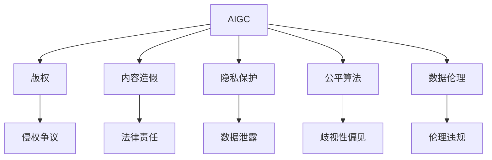

                 

# AIGC时代的法律与伦理挑战

> 关键词：人工智能生成内容(AIGC)、法律合规、伦理道德、隐私保护、版权争议、数字权利管理(DRM)、数据隐私、公平算法

## 1. 背景介绍

### 1.1 问题由来

随着人工智能技术的迅速发展，特别是生成式对抗网络(GAN)和深度学习(DL)技术的成熟，人工智能生成内容(AIGC)正在迎来爆发式增长。AIGC技术能够在文本、图像、音频等多个模态生成高度逼真的内容，极大地拓展了创意内容创作的边界，同时也引发了一系列法律与伦理挑战。

在AIGC领域，尤其是在内容生成、自动创作、虚拟现实等方向，已经展现出了强大的商业应用潜力。例如，虚拟主播、智能客服、自动作曲、影视特效等应用均基于AIGC技术实现。但同时，这些技术的发展也带来了诸如版权侵权、内容造假、隐私泄露、算法偏见等法律与伦理问题，亟待引起全社会的关注和重视。

### 1.2 问题核心关键点

AIGC时代面临的法律与伦理挑战主要集中在以下几个方面：

- **版权争议**：AIGC生成内容的版权归属问题，是当前法律界关注的核心点之一。创作、使用的界限不明确，容易引起版权纠纷。
- **内容造假**：AIGC技术能够生成逼真内容，存在被用于伪造、篡改内容，甚至传播虚假信息的风险。
- **隐私保护**：AIGC生成内容往往基于大量的数据输入，涉及隐私数据的获取与使用，如何保护用户隐私成为一大挑战。
- **公平算法**：AIGC模型在训练和使用过程中可能存在数据偏见，导致输出结果的歧视性，如何确保算法公平性是关键。
- **数据伦理**：AIGC模型的训练和应用依赖于数据，如何在数据获取、处理、使用过程中遵循伦理规范，是行业需要解决的重要问题。

## 2. 核心概念与联系

### 2.1 核心概念概述

为了深入理解AIGC技术的法律与伦理挑战，本节将介绍几个核心概念及其之间的关系：

- **人工智能生成内容(AIGC)**：利用深度学习、生成对抗网络等技术生成逼真内容，覆盖文本、图像、音频等多个模态。
- **版权**：作品创造完成后，创作者对其享有的一系列专有权利，包括复制权、发行权、展览权等。
- **内容造假**：使用AIGC技术生成的内容与实际不符，如伪造图像、虚假视频等。
- **隐私保护**：在数据收集、存储、使用过程中保护个人信息不受侵犯，遵循隐私保护相关法律法规。
- **公平算法**：确保算法在训练和应用过程中，不会因为数据偏见而导致不公平的输出结果。
- **数据伦理**：在数据获取、处理、使用过程中，遵循道德规范，尊重个人权益。

这些概念之间的逻辑关系可以通过以下Mermaid流程图来展示：



这个流程图展示了大语言模型的核心概念及其之间的关系：

1. AIGC生成内容基于海量数据，涉及版权、数据隐私、公平算法等多个法律和伦理层面问题。
2. 版权争议：AIGC生成内容是否受版权法保护，以及创作者、用户、平台之间的权利分配问题。
3. 内容造假：AIGC生成内容是否可被用于虚假信息的传播，以及相应的法律责任问题。
4. 隐私保护：AIGC模型如何处理个人数据，以及数据泄露风险问题。
5. 公平算法：AIGC模型在训练和使用过程中是否存在偏见，以及如何确保算法公平性。
6. 数据伦理：AIGC模型在数据获取、处理、使用过程中遵循的道德规范问题。

这些概念共同构成了AIGC技术的法律与伦理框架，对模型的开发、应用和监管具有重要指导意义。

## 3. 核心算法原理 & 具体操作步骤
### 3.1 算法原理概述

AIGC技术主要基于生成对抗网络(GAN)和深度学习模型进行训练。GAN是由生成器和判别器两个部分组成，通过对抗性训练方式，生成逼真内容。

GAN的基本流程包括：
- **生成器**：通过学习真实数据的分布，生成与真实数据难以区分的假数据。
- **判别器**：区分真实数据和生成数据的差异，并反馈给生成器，帮助其生成更逼真的数据。
- **对抗性训练**：生成器和判别器交替训练，生成器不断改进生成效果，判别器不断提升判别能力，形成对抗过程。

通过不断迭代训练，生成器能够生成与真实数据高度相似的假数据，即AIGC生成的内容。

### 3.2 算法步骤详解

基于GAN的AIGC生成内容的基本步骤如下：

**Step 1: 数据准备**
- 收集各类真实数据，如文本、图像、音频等，作为GAN训练的输入。
- 对数据进行预处理，如清洗、归一化、标签化等，确保数据的质量和格式一致。

**Step 2: 模型训练**
- 构建生成器和判别器网络，使用深度学习框架进行模型搭建和参数初始化。
- 通过对抗性训练策略，交替训练生成器和判别器，不断改进生成效果。
- 设置合适的损失函数和优化器，如交叉熵损失、Wasserstein距离、Adam优化器等。

**Step 3: 模型评估**
- 使用测试集对训练好的模型进行评估，量化生成内容的逼真度。
- 通过感知质量指标（如Inception Score、FID等）和人类评估等方式，评估生成内容的自然度和现实感。
- 调整超参数，继续迭代训练，提升生成质量。

**Step 4: 应用部署**
- 将训练好的模型部署到实际应用场景中，如生成文本、图像、音频等内容。
- 根据实际需求，使用后处理技术（如噪声注入、后滤波等）进一步优化生成效果。
- 实施数据保护措施，确保生成内容不侵犯第三方权益。

### 3.3 算法优缺点

AIGC生成内容在法律与伦理方面存在以下优缺点：

**优点**：
- 高效生成逼真内容：AIGC技术可以快速生成高质量的文本、图像、音频等内容，满足创意产业的需求。
- 多样性丰富：AIGC模型可以生成大量变体内容，丰富内容库，降低创作成本。
- 适用范围广：AIGC技术在多个模态内容生成上均有应用，如文本、图像、视频等。

**缺点**：
- 版权归属模糊：AIGC生成内容可能模糊版权归属，涉及多重利益主体，容易引起法律纠纷。
- 内容真实性存疑：AIGC生成的内容可能被用于虚假信息的传播，引发法律责任和道德问题。
- 隐私风险高：AIGC模型依赖于大量数据输入，存在隐私数据泄露的风险。
- 算法偏见：AIGC模型在训练过程中可能学习到数据偏见，导致生成内容具有歧视性。
- 伦理问题复杂：AIGC模型的训练和使用涉及多方的伦理考量，处理不当可能引发伦理争议。

### 3.4 算法应用领域

AIGC生成内容在多个领域已经展现出巨大的应用潜力，具体包括：

- **内容创作**：自动作曲、自动填词、自动绘图、自动视频剪辑等，极大地提升了内容创作的效率和质量。
- **娱乐产业**：影视特效、虚拟现实、电子游戏等，AIGC生成逼真内容，增强用户体验。
- **广告营销**：广告素材生成、产品展示等，降低营销成本，提升广告效果。
- **教育培训**：虚拟实验室、模拟场景、互动教学等，增强教学互动性。
- **医疗健康**：医学影像生成、病理切片分析、虚拟康复等，提高医疗服务的精准度和效率。

这些应用展示了AIGC技术在各个领域的重要价值，同时也提出了相应的法律与伦理挑战。

## 4. 数学模型和公式 & 详细讲解
### 4.1 数学模型构建

本节将使用数学语言对AIGC生成内容的基本原理进行更加严格的刻画。

假设AIGC模型为 $G$，输入为 $z$，生成的内容为 $x$。则生成过程可以表示为：

$$
x = G(z)
$$

其中 $G$ 为生成器网络，$z$ 为随机噪声向量，$x$ 为生成的内容。生成器的目标是最小化以下损失函数：

$$
\mathcal{L}_G = \mathbb{E}_{z \sim p(z)}[\ell(D(G(z)), 1)] + \mathbb{E}_{x \sim p(x)}[\ell(D(x), 0)]
$$

其中 $\ell$ 为损失函数，$D$ 为判别器网络，$z$ 和 $x$ 的分布分别为 $p(z)$ 和 $p(x)$。

### 4.2 公式推导过程

以生成文本为例，解释GAN的基本公式推导：

**Step 1: 定义模型**
假设生成器模型为 $G(z) = V(z)$，其中 $z$ 为噪声向量，$V$ 为多层感知器网络。

**Step 2: 定义损失函数**
假设判别器模型为 $D(x) = W(x)$，其中 $x$ 为输入文本，$W$ 为多层感知器网络。

**Step 3: 推导损失函数**
生成器的目标是最小化以下损失函数：

$$
\mathcal{L}_G = \mathbb{E}_{z \sim p(z)}[\log(D(G(z)))]
$$

判别器的目标是最小化以下损失函数：

$$
\mathcal{L}_D = \mathbb{E}_{x \sim p(x)}[\log(D(x))] + \mathbb{E}_{z \sim p(z)}[\log(1-D(G(z)))]
$$

**Step 4: 优化过程**
使用梯度下降等优化算法，交替训练生成器和判别器，不断改进生成效果。

通过上述推导，可以看到AIGC模型的基本框架和优化过程。

### 4.3 案例分析与讲解

以生成图像为例，展示AIGC模型的应用和效果：

**案例分析**：
- **输入**：一张真实图片的像素值。
- **生成器**：使用多层卷积神经网络，学习生成伪造图片的像素值。
- **判别器**：使用多层卷积神经网络，判断图片是否为真实图片。
- **损失函数**：使用Wasserstein距离，评估生成图片与真实图片的相似度。

**效果展示**：
- 生成器输出的图片越来越接近真实图片，难以区分真伪。
- 判别器对真实图片和伪造图片的识别率逐渐提高。

**案例讲解**：
- **对抗性训练**：生成器和判别器通过不断的对抗性训练，生成器不断改进生成效果，判别器不断提升识别能力。
- **生成质量评估**：使用Inception Score、FID等指标，量化生成图片的逼真度和自然度。

## 5. 项目实践：代码实例和详细解释说明
### 5.1 开发环境搭建

在进行AIGC项目实践前，我们需要准备好开发环境。以下是使用Python进行TensorFlow进行AIGC生成图像的代码实现：

1. 安装TensorFlow：
```bash
pip install tensorflow
```

2. 下载数据集：
```bash
wget https://github.com/zyan-zhang/data-augmentation-datasets/raw/master/CIFAR10/cifar-10-batches-py.tar.gz
tar -xvf cifar-10-batches-py.tar.gz
```

3. 搭建模型：
```python
import tensorflow as tf
from tensorflow.keras import layers, models

# 定义生成器
def make_generator_model():
    model = models.Sequential()
    model.add(layers.Dense(256, use_bias=False, input_shape=(100,)))
    model.add(layers.BatchNormalization())
    model.add(layers.LeakyReLU())
    model.add(layers.Dropout(0.2))
    model.add(layers.Dense(512))
    model.add(layers.BatchNormalization())
    model.add(layers.LeakyReLU())
    model.add(layers.Dropout(0.2))
    model.add(layers.Dense(1024))
    model.add(layers.BatchNormalization())
    model.add(layers.LeakyReLU())
    model.add(layers.Dropout(0.2))
    model.add(layers.Dense(3, activation='tanh'))
    return model

# 定义判别器
def make_discriminator_model():
    model = models.Sequential()
    model.add(layers.Conv2D(64, (3, 3), strides=2, padding='same', input_shape=[32, 32, 3]))
    model.add(layers.LeakyReLU(alpha=0.2))
    model.add(layers.Dropout(0.2))
    model.add(layers.Conv2D(128, (3, 3), strides=2, padding='same'))
    model.add(layers.LeakyReLU(alpha=0.2))
    model.add(layers.Dropout(0.2))
    model.add(layers.Flatten())
    model.add(layers.Dense(1))
    return model
```

### 5.2 源代码详细实现

以下是AIGC生成图像的完整代码实现：

```python
import tensorflow as tf
from tensorflow.keras import layers, models, optimizers

# 定义生成器
def make_generator_model():
    model = models.Sequential()
    model.add(layers.Dense(256, use_bias=False, input_shape=(100,)))
    model.add(layers.BatchNormalization())
    model.add(layers.LeakyReLU())
    model.add(layers.Dropout(0.2))
    model.add(layers.Dense(512))
    model.add(layers.BatchNormalization())
    model.add(layers.LeakyReLU())
    model.add(layers.Dropout(0.2))
    model.add(layers.Dense(1024))
    model.add(layers.BatchNormalization())
    model.add(layers.LeakyReLU())
    model.add(layers.Dropout(0.2))
    model.add(layers.Dense(3, activation='tanh'))
    return model

# 定义判别器
def make_discriminator_model():
    model = models.Sequential()
    model.add(layers.Conv2D(64, (3, 3), strides=2, padding='same', input_shape=[32, 32, 3]))
    model.add(layers.LeakyReLU(alpha=0.2))
    model.add(layers.Dropout(0.2))
    model.add(layers.Conv2D(128, (3, 3), strides=2, padding='same'))
    model.add(layers.LeakyReLU(alpha=0.2))
    model.add(layers.Dropout(0.2))
    model.add(layers.Flatten())
    model.add(layers.Dense(1))
    return model

# 加载数据集
(x_train, y_train), (x_test, y_test) = tf.keras.datasets.cifar10.load_data()
x_train = x_train / 255.0
x_test = x_test / 255.0

# 定义优化器
optimizer = optimizers.Adam(learning_rate=0.0002)

# 定义损失函数
cross_entropy = tf.keras.losses.BinaryCrossentropy(from_logits=True)

# 定义生成器和判别器
generator = make_generator_model()
discriminator = make_discriminator_model()

# 定义损失函数和优化器
generator_optimizer = optimizers.Adam(learning_rate=0.0002)
discriminator_optimizer = optimizers.Adam(learning_rate=0.0002)

# 训练过程
@tf.function
def train_step(images):
    noise = tf.random.normal([BATCH_SIZE, LATENT_DIM])

    with tf.GradientTape() as gen_tape, tf.GradientTape() as disc_tape:
        generated_images = generator(noise, training=True)

        real_output = discriminator(images, training=True)
        fake_output = discriminator(generated_images, training=True)

        gen_loss = cross_entropy(tf.ones_like(fake_output), fake_output)
        disc_loss = cross_entropy(tf.ones_like(real_output), real_output) + cross_entropy(tf.zeros_like(fake_output), fake_output)

    gradients_of_generator = gen_tape.gradient(gen_loss, generator.trainable_variables)
    gradients_of_discriminator = disc_tape.gradient(disc_loss, discriminator.trainable_variables)

    generator_optimizer.apply_gradients(zip(gradients_of_generator, generator.trainable_variables))
    discriminator_optimizer.apply_gradients(zip(gradients_of_discriminator, discriminator.trainable_variables))
    
    return gen_loss, disc_loss

# 定义超参数
BATCH_SIZE = 256
LATENT_DIM = 100
EPOCHS = 50

# 训练模型
for epoch in range(EPOCHS):
    for image_batch in x_train:
        gen_loss, disc_loss = train_step(image_batch)
        print(f'Epoch {epoch+1}, Generator Loss: {gen_loss:.4f}, Discriminator Loss: {disc_loss:.4f}')

# 测试模型
generated_images = generator(tf.random.normal([BATCH_SIZE, LATENT_DIM]))
print(f'Generated Images Shape: {generated_images.shape}')
```

### 5.3 代码解读与分析

让我们再详细解读一下关键代码的实现细节：

**make_generator_model函数**：
- 定义生成器网络，使用多层感知器网络，通过LeakyReLU、Dropout等激活函数和正则化技术，提高生成效果。

**make_discriminator_model函数**：
- 定义判别器网络，使用卷积神经网络，通过LeakyReLU、Dropout等激活函数和正则化技术，提高判别能力。

**train_step函数**：
- 定义训练过程，使用Adam优化器，交替训练生成器和判别器，计算生成器和判别器的损失函数，并更新模型参数。

**超参数设置**：
- 定义超参数，包括批量大小、噪声维度、训练轮数等，设置训练过程的基本参数。

**训练和测试**：
- 在训练过程中，每轮训练一次，输出生成器和判别器的损失函数。
- 在测试过程中，使用训练好的生成器生成一批随机噪声，输出生成图像，并打印图像的形状。

通过上述代码实现，可以看到AIGC生成图像的完整流程，从数据准备、模型训练、损失计算到生成图像的展示。

## 6. 实际应用场景
### 6.1 智能客服系统

智能客服系统是AIGC技术的重要应用场景之一。传统的客服系统依赖于人工，成本高且效率低。AIGC技术生成的智能客服机器人可以24小时在线服务，快速响应客户咨询，提高客户满意度。

在实际应用中，智能客服系统可以基于客户的问题生成自然流畅的回复，处理常见的客户咨询。通过训练基于AIGC技术的智能客服模型，系统能够不断学习客户的需求和偏好，提供个性化的服务。

### 6.2 广告营销

广告营销是AIGC技术的另一个重要应用场景。传统的广告制作成本高、周期长、效果难以量化。AIGC技术生成的广告素材，能够根据不同目标群体生成定制化的内容，提高广告的点击率和转化率。

在实际应用中，基于AIGC技术的广告生成系统可以根据用户的兴趣和行为，自动生成广告文案和图片，实时更新广告内容，实现精准投放。通过分析广告效果数据，系统可以不断优化广告素材，提升广告效果。

### 6.3 医疗影像分析

医疗影像分析是AIGC技术在医疗领域的重要应用之一。传统的医疗影像分析依赖于专家人工，耗时长、成本高。AIGC技术生成的医学影像分析模型，可以自动生成病理切片、X光片、CT扫描等影像的分析和报告，提高诊断效率和准确性。

在实际应用中，基于AIGC技术的医学影像分析系统可以根据医生的需求和偏好，自动生成详细的诊断报告，辅助医生进行决策。系统还可以不断学习医生的诊断经验，提高诊断的准确性和效率。

### 6.4 未来应用展望

随着AIGC技术的不断发展，其应用领域将不断拓展，带来更广泛的商业和社会价值。未来，AIGC技术将在以下几个方向取得突破：

1. **多模态内容生成**：AIGC技术不仅在文本生成方面取得突破，还将在图像、视频、音频等多模态内容生成上取得进展，推动内容创作的创新。
2. **智能创意工具**：AIGC技术将与创意产业深度融合，成为辅助内容创作的智能工具，如自动填词、自动绘图、自动视频剪辑等，提升创意产业的工作效率。
3. **虚拟现实**：AIGC技术生成的虚拟现实内容，将带来更沉浸式和逼真的体验，推动虚拟现实产业的发展。
4. **智能制造**：AIGC技术生成的智能制造数据，将帮助企业进行质量控制、过程优化等，推动智能制造的进程。
5. **数字娱乐**：AIGC技术生成的数字娱乐内容，将带来更丰富的用户体验，推动数字娱乐产业的发展。

## 7. 工具和资源推荐
### 7.1 学习资源推荐

为了帮助开发者系统掌握AIGC技术的法律与伦理知识，这里推荐一些优质的学习资源：

1. **《人工智能伦理与法律》课程**：由多所大学开设的AI伦理与法律课程，涵盖AI伦理、隐私保护、版权争议等多个方面。
2. **《人工智能生成内容》论文集**：多篇关于AIGC技术的论文，探讨生成内容的版权、隐私、公平性等问题。
3. **《深度学习》书籍**：一本深度学习领域的经典书籍，详细介绍了生成对抗网络、深度学习等内容，帮助开发者深入理解AIGC技术的原理。
4. **HuggingFace官方文档**：TensorFlow和PyTorch等框架的官方文档，提供丰富的AIGC技术实现样例。
5. **GPT-3论文**：GPT-3技术的官方论文，探讨了AIGC技术的生成效果、应用场景、法律与伦理问题。

通过这些资源的学习实践，相信你一定能够系统掌握AIGC技术的法律与伦理知识，并用于指导实际开发工作。

### 7.2 开发工具推荐

高效的开发离不开优秀的工具支持。以下是几款用于AIGC内容生成的常用工具：

1. **TensorFlow**：基于深度学习框架，提供丰富的API和优化器，支持AIGC生成图像、文本等内容。
2. **PyTorch**：深度学习框架，提供灵活的动态计算图，支持AIGC生成图像、文本等内容。
3. **OpenAI GPT-3**：AIGC技术的领先实现，提供文本生成、图像生成等多种功能，支持多语言处理。
4. **Jupyter Notebook**：轻量级开发环境，支持Python等语言，方便代码调试和版本控制。
5. **Google Colab**：免费的在线Jupyter Notebook环境，提供GPU和TPU资源，方便高性能计算。

合理利用这些工具，可以显著提升AIGC生成内容的开发效率，加快创新迭代的步伐。

### 7.3 相关论文推荐

AIGC技术的快速发展，得益于学界的持续研究。以下是几篇奠基性的相关论文，推荐阅读：

1. **Generative Adversarial Networks**（GAN论文）：提出GAN模型，通过对抗性训练生成逼真内容，推动AIGC技术的发展。
2. **Conditional Image Synthesis with Auxiliary Classifier GANs**：提出AC-GAN模型，在生成过程中加入分类器，提升生成内容的分类准确性。
3. **The Unreasonable Effectiveness of Transfer Learning**：探讨了预训练和微调技术在AIGC生成内容中的应用，提升生成效果的泛化能力。
4. **Semantic Segmentation with Deep Generative Models**：探讨了GAN在图像分割等任务中的应用，拓展了AIGC技术的实际应用场景。
5. **Adversarial Examples in Deep Learning**：探讨了GAN中生成的对抗样本问题，如何避免生成内容对判别器产生欺骗性效果。

这些论文代表了大语言模型微调技术的发展脉络。通过学习这些前沿成果，可以帮助研究者把握学科前进方向，激发更多的创新灵感。

## 8. 总结：未来发展趋势与挑战

### 8.1 总结

本文对AIGC生成内容的法律与伦理挑战进行了全面系统的介绍。首先阐述了AIGC技术的发展背景和应用前景，明确了法律与伦理问题的核心点。其次，从原理到实践，详细讲解了AIGC技术的核心算法和具体操作步骤，给出了具体的代码实现。同时，本文还广泛探讨了AIGC技术在智能客服、广告营销、医疗影像等多个领域的应用前景，展示了AIGC技术在各行各业的重要价值。

通过本文的系统梳理，可以看到，AIGC技术在多个领域展现出巨大的应用潜力，同时也带来了相应的法律与伦理挑战。AIGC技术的发展需要各方的共同努力，才能在推动产业进步的同时，确保法律与伦理的合规和公平。

### 8.2 未来发展趋势

展望未来，AIGC技术的法律与伦理研究将呈现以下几个发展趋势：

1. **版权保护和公平性**：随着AIGC技术的普及，版权保护和公平性问题将更加突出。未来的法律和政策将更加关注生成内容的归属和使用限制。
2. **隐私保护和数据安全**：AIGC技术的广泛应用将带来隐私数据的获取和处理问题，未来的隐私保护技术将更加成熟，数据安全机制也将更加完善。
3. **算法偏见和公平性**：AIGC模型在训练和使用过程中可能存在偏见，未来的算法公平性研究将更加深入，确保生成内容的公正性。
4. **跨模态内容生成**：AIGC技术将拓展到多模态内容生成，如文本、图像、音频等，提升内容创作的创新性和丰富性。
5. **智能创意工具**：AIGC技术将与创意产业深度融合，成为辅助内容创作的智能工具，推动创意产业的发展。
6. **虚拟现实和智能制造**：AIGC技术将在虚拟现实、智能制造等领域取得突破，推动相关产业的发展。

这些趋势展示了AIGC技术的广阔前景，对未来的应用和发展具有重要指导意义。

### 8.3 面临的挑战

尽管AIGC技术已经取得了显著进展，但在迈向更加智能化、普适化应用的过程中，仍面临诸多挑战：

1. **版权归属模糊**：AIGC生成内容的版权归属问题，涉及多重利益主体，容易引起法律纠纷。如何明确版权归属，是未来需要解决的重要问题。
2. **内容真实性存疑**：AIGC生成的内容可能被用于虚假信息的传播，引发法律责任和道德问题。如何确保生成内容的真实性，是未来的重要研究方向。
3. **隐私数据泄露**：AIGC模型的训练和使用依赖于大量数据，存在隐私数据泄露的风险。如何保护用户隐私，是未来的技术挑战。
4. **算法偏见和歧视**：AIGC模型在训练过程中可能学习到数据偏见，导致生成内容具有歧视性。如何确保算法的公平性，是未来需要解决的重要问题。
5. **伦理争议和合规性**：AIGC技术的广泛应用将带来伦理争议，如何确保AIGC技术的合规性，是未来的重要课题。

### 8.4 研究展望

面对AIGC技术面临的种种挑战，未来的研究需要在以下几个方面寻求新的突破：

1. **版权保护机制**：探索基于区块链等技术的版权保护机制，确保生成内容的归属和使用限制。
2. **隐私保护技术**：开发隐私保护技术，如差分隐私、同态加密等，保护用户隐私，防止数据泄露。
3. **公平算法研究**：研究公平算法，消除AIGC模型中的数据偏见，确保生成内容的公正性。
4. **跨模态内容生成**：研究多模态内容生成技术，提升AIGC技术的创新性和丰富性。
5. **智能创意工具**：开发智能创意工具，如自动填词、自动绘图、自动视频剪辑等，推动创意产业的发展。
6. **虚拟现实和智能制造**：推动AIGC技术在虚拟现实、智能制造等领域的应用，推动相关产业的发展。

这些研究方向将推动AIGC技术的法律与伦理研究不断深入，确保AIGC技术在推动产业进步的同时，遵循法律和伦理规范，实现社会价值的最大化。

## 9. 附录：常见问题与解答

**Q1：AIGC生成内容的版权归属问题**

A: AIGC生成内容的版权归属问题，涉及多重利益主体，容易引起法律纠纷。一般来说，生成内容应当遵循“先创作、后使用”的原则，版权归属需要根据具体的创作和利用方式进行明确。

**Q2：AIGC生成内容是否具有真实性**

A: AIGC生成内容可能被用于虚假信息的传播，引发法律责任和道德问题。在应用AIGC技术时，需要严格审查生成内容的真实性，避免传播虚假信息。

**Q3：AIGC生成内容是否侵犯用户隐私**

A: AIGC模型的训练和使用依赖于大量数据输入，存在隐私数据泄露的风险。开发者需要在数据收集、处理和使用过程中遵循隐私保护相关法律法规，保护用户隐私。

**Q4：AIGC生成内容是否存在算法偏见**

A: AIGC模型在训练过程中可能学习到数据偏见，导致生成内容具有歧视性。开发者需要在模型训练和应用过程中消除数据偏见，确保算法的公平性。

**Q5：AIGC技术如何与法律和伦理规范结合**

A: AIGC技术在开发和应用过程中，需要遵循法律和伦理规范，确保技术的合规性和公平性。开发者需要在技术实现中考虑法律和伦理因素，避免潜在的风险和争议。

这些问题的回答展示了AIGC技术在法律与伦理方面的关键点，帮助开发者在实际应用中遵循相关规范，避免潜在的法律和伦理风险。

---

作者：禅与计算机程序设计艺术 / Zen and the Art of Computer Programming

