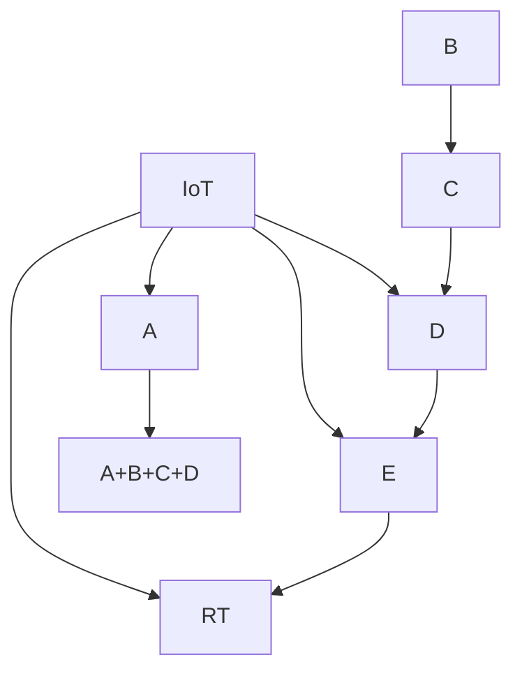

                 

## AIoT：人工智能与物联网的融合

随着物联网(IoT)技术在智能家居、智慧城市、工业自动化等领域的迅猛发展，其与人工智能(AI)的深度融合，正在推动一场新的技术革命。AIoT不仅将AI的智能决策能力与IoT的感知、控制能力相结合，还为各行各业带来了更精准、更高效、更智能的解决方案。本文将系统地探讨AIoT的核心概念、核心算法原理、具体操作步骤、实际应用场景，并提出未来发展趋势及面临的挑战，以期为AIoT领域的科研与实践提供指引。

## 1. 背景介绍

### 1.1 问题由来

物联网(IoT)技术通过传感器、嵌入式设备、通信网络等手段，实现了对物理世界的广泛感知和互联互通。然而，由于数据量巨大且类型繁多，传统的数据处理与分析方法难以满足需求。与此同时，人工智能(AI)技术的迅速崛起，以其强大的数据处理和模式识别能力，为物联网数据的应用提供了新的可能。

将AI与IoT融合，构建AIoT系统，已经成为当前科技发展的重要趋势。通过将AI的智能决策能力应用于物联网场景，能够实现更高效的数据处理、更精准的环境监测、更智能的资源管理等功能。例如，在智能家居中，通过集成语音识别、图像识别等AI技术，使得用户能够通过语音或手机APP轻松控制家中的各种设备，提升生活品质；在智慧城市中，通过AI对交通、能源、环境等数据的深度分析，能够实现智能交通管理、智能能源调度、智能环境监测等。

### 1.2 问题核心关键点

AIoT技术的发展主要集中在以下几个核心关键点：

1. **数据融合与处理**：将海量的物联网数据与AI算法结合，进行数据的清洗、标注、融合、处理，以获取更有价值的信息。
2. **感知与决策**：利用传感器等物联网设备收集数据，并通过AI算法进行分析和推理，做出决策并控制执行。
3. **实时性与高可靠性**：确保AIoT系统能够实时处理数据并做出准确决策，同时保证系统的高可靠性与稳定性。
4. **边缘计算**：通过在物联网设备上部署AI算法，减少数据传输开销，提高处理效率。
5. **安全性与隐私保护**：确保AIoT系统能够有效防止数据泄露、黑客攻击等安全威胁，保护用户隐私。

### 1.3 问题研究意义

AIoT技术的研究与应用具有重要意义：

1. **提升智能化水平**：将AI技术应用于物联网，能够实现更高效的数据处理和智能决策，提升系统智能化水平。
2. **推动产业升级**：AIoT技术能够显著提升传统产业的生产效率和自动化水平，促进产业转型升级。
3. **改善生活质量**：通过智能家居、智能交通、智能医疗等应用，AIoT能够显著改善人们的生活质量。
4. **促进科学研究**：AIoT技术的发展为科学研究提供了新的方法和工具，推动了人工智能和物联网领域的交叉研究。
5. **拓展应用边界**：AIoT技术的应用范围涵盖智能制造、智慧医疗、智慧农业等众多领域，具有广阔的发展前景。

## 2. 核心概念与联系

### 2.1 核心概念概述

为更好地理解AIoT技术，本文将介绍几个核心概念：

- **物联网(IoT)**：通过传感器、嵌入式设备、通信网络等手段，实现对物理世界的广泛感知和互联互通的技术体系。
- **人工智能(AI)**：模拟人类智能行为，包括感知、学习、推理、决策等能力的技术。
- **边缘计算**：在靠近数据源的物联网设备上，进行数据的处理与分析，以减少数据传输开销，提高处理效率。
- **数据融合**：将多种类型的数据进行综合处理和分析，以获取更有价值的信息。
- **实时系统**：能够在短时间内处理和响应数据，保证系统的高实时性。

这些核心概念之间的联系可以概述为：



其中，A为感知能力，B为数据融合，C为决策能力，D为实时性，E为边缘计算。物联网通过感知获取数据，结合数据融合与决策能力，通过实时性进行快速响应，在边缘计算中高效处理，最终构建了AIoT系统。

## 3. 核心算法原理 & 具体操作步骤

### 3.1 算法原理概述

AIoT技术的核心算法原理，主要包括以下几个方面：

1. **数据融合算法**：用于将多种类型的数据进行综合处理和分析，以获取更有价值的信息。
2. **深度学习算法**：利用深度神经网络对物联网数据进行特征提取、分类、回归等处理，以提升决策能力。
3. **实时系统算法**：用于确保系统能够在短时间内处理和响应数据，保证系统的高实时性。
4. **边缘计算算法**：在靠近数据源的物联网设备上，进行数据的处理与分析，以减少数据传输开销，提高处理效率。

这些算法共同构成了AIoT系统的技术基础，能够实现对物理世界的广泛感知、精准分析和智能控制。

### 3.2 算法步骤详解

AIoT系统的设计与实施，一般包括以下几个关键步骤：

**Step 1: 数据采集与预处理**
- 通过物联网设备，如传感器、摄像头等，采集数据。
- 对采集到的数据进行清洗、去噪、标注等预处理操作，确保数据的质量和一致性。

**Step 2: 数据融合与特征提取**
- 使用数据融合算法，将不同类型的数据进行综合处理，如时间同步、空间对齐等。
- 利用深度学习算法，对融合后的数据进行特征提取，获取有价值的信息。

**Step 3: 模型训练与推理**
- 使用深度学习算法，对提取的特征进行训练，构建AI模型。
- 利用训练好的AI模型，对新数据进行推理，做出智能决策。

**Step 4: 实时处理与控制**
- 在实时系统中，将AI推理结果快速传递给物联网设备，进行控制和执行。
- 利用实时系统算法，确保处理和响应速度，满足实时性要求。

**Step 5: 边缘计算与优化**
- 在靠近数据源的物联网设备上，部署AI模型，进行边缘计算。
- 利用边缘计算算法，优化计算效率，减少数据传输开销。

**Step 6: 系统集成与优化**
- 将感知、数据融合、决策、实时处理、边缘计算等组件进行集成，构建完整的AIoT系统。
- 对系统进行优化，提升性能和稳定性，确保可靠运行。

### 3.3 算法优缺点

AIoT技术的算法优缺点如下：

**优点：**

1. **高效数据处理**：通过深度学习等算法，能够高效处理和分析大量物联网数据。
2. **精准决策**：利用AI模型的智能推理能力，能够做出更精准的决策。
3. **实时响应**：通过实时系统算法，能够快速响应数据，满足实时性要求。
4. **边缘计算**：减少数据传输开销，提高处理效率。

**缺点：**

1. **计算资源需求高**：深度学习等算法需要大量的计算资源，对硬件要求较高。
2. **数据隐私问题**：在数据采集和传输过程中，存在隐私泄露的风险。
3. **系统复杂度**：系统集成的复杂度较高，需要综合考虑多方面因素。
4. **安全风险**：存在黑客攻击等安全威胁，需要加强防护措施。

### 3.4 算法应用领域

AIoT技术已经在多个领域得到了广泛应用，例如：

- **智能家居**：通过集成语音识别、图像识别等AI技术，实现对家庭设备的智能控制。
- **智慧城市**：利用AI对交通、能源、环境等数据进行深度分析，实现智能交通管理、智能能源调度、智能环境监测等。
- **智能制造**：通过AI对生产线上的数据进行实时分析，实现智能调度、预测维护等。
- **智慧医疗**：利用AI对医疗数据进行深度分析，辅助医生诊断、治疗等。
- **农业智能**：通过AI对农田数据进行实时监测和分析，实现智能灌溉、智能施肥等。

以上应用领域展示了AIoT技术的广泛应用前景，未来还将拓展到更多领域，推动智能化进程。

## 4. 数学模型和公式 & 详细讲解 & 举例说明

### 4.1 数学模型构建

为了更好地理解AIoT技术的数学模型，本文将使用数学语言进行更加严格的刻画。

设物联网系统采集到的数据为 $D=\{x_i,y_i\}_{i=1}^N$，其中 $x_i$ 为感知数据，$y_i$ 为标签数据。定义数据融合后的特征为 $X=\{x_j\}_{j=1}^M$，其中 $j$ 表示融合后的数据维度。设AI模型为 $f(x;\theta)$，其中 $\theta$ 为模型参数。

AIoT系统的目标是通过训练模型 $f(x;\theta)$，使得对于新数据 $x$，能够得到最优的输出 $y^*$。形式化地，问题可以描述为：

$$
\min_{\theta} \mathcal{L}(f(x;\theta),y^*)
$$

其中 $\mathcal{L}$ 为损失函数，用于衡量模型输出与真实标签之间的差异。

### 4.2 公式推导过程

以图像识别为例，假设采集到的图像数据 $x$ 为 $N$ 维向量，标签数据 $y$ 为二元分类标签（0或1）。设AI模型为卷积神经网络（CNN），输出层的激活函数为sigmoid函数。则目标为最小化分类损失函数：

$$
\mathcal{L}(f(x;\theta),y^*) = -\frac{1}{N}\sum_{i=1}^N y_i\log f(x_i;\theta) + (1-y_i)\log(1-f(x_i;\theta))
$$

其中 $f(x_i;\theta)$ 为模型在输入 $x_i$ 上的输出，$y^*$ 为真实标签。

通过反向传播算法，计算损失函数对参数 $\theta$ 的梯度，并根据梯度下降等优化算法更新参数，直至收敛。

### 4.3 案例分析与讲解

假设某智能家居系统，需要实现对灯光、温度、湿度等环境的智能控制。系统通过多个传感器采集数据，经过数据融合和特征提取后，输入到AI模型中进行推理，输出控制指令。

**案例分析：**

1. **数据采集与预处理**：通过传感器采集灯光亮度、温度、湿度等数据，并进行清洗、去噪、标注等预处理操作。
2. **数据融合与特征提取**：使用数据融合算法，将不同传感器数据进行综合处理，利用深度学习算法提取特征。
3. **模型训练与推理**：使用深度学习算法，对提取的特征进行训练，构建AI模型。利用训练好的AI模型，对新数据进行推理，输出控制指令。
4. **实时处理与控制**：在实时系统中，将AI推理结果快速传递给灯光、空调等设备，进行控制和执行。
5. **边缘计算与优化**：在靠近数据源的物联网设备上，部署AI模型，进行边缘计算。利用边缘计算算法，优化计算效率，减少数据传输开销。

## 5. 项目实践：代码实例和详细解释说明

### 5.1 开发环境搭建

在进行AIoT系统开发前，我们需要准备好开发环境。以下是使用Python进行TensorFlow和Keras开发的开发环境配置流程：

1. 安装Anaconda：从官网下载并安装Anaconda，用于创建独立的Python环境。

2. 创建并激活虚拟环境：
```bash
conda create -n aiot-env python=3.8 
conda activate aiot-env
```

3. 安装TensorFlow：从官网获取对应的安装命令。例如：
```bash
conda install tensorflow==2.8 
```

4. 安装Keras：
```bash
pip install keras 
```

5. 安装各类工具包：
```bash
pip install numpy pandas scikit-learn matplotlib tqdm jupyter notebook ipython
```

完成上述步骤后，即可在`aiot-env`环境中开始AIoT系统开发。

### 5.2 源代码详细实现

我们以智能家居环境监控系统为例，使用TensorFlow和Keras进行系统构建和微调。

首先，定义系统的输入和输出：

```python
from tensorflow.keras.layers import Input, Conv2D, MaxPooling2D, Flatten, Dense
from tensorflow.keras.models import Model

input_layer = Input(shape=(224, 224, 3))
x = Conv2D(32, (3, 3), activation='relu')(input_layer)
x = MaxPooling2D((2, 2))(x)
x = Conv2D(64, (3, 3), activation='relu')(x)
x = MaxPooling2D((2, 2))(x)
x = Flatten()(x)
x = Dense(128, activation='relu')(x)
output_layer = Dense(1, activation='sigmoid')(x)

model = Model(input_layer, output_layer)
model.compile(optimizer='adam', loss='binary_crossentropy', metrics=['accuracy'])
```

接着，定义数据生成器：

```python
from tensorflow.keras.preprocessing.image import ImageDataGenerator

train_datagen = ImageDataGenerator(rescale=1./255, shear_range=0.2, zoom_range=0.2, horizontal_flip=True)
test_datagen = ImageDataGenerator(rescale=1./255)

train_generator = train_datagen.flow_from_directory(
        'train/',
        target_size=(224, 224),
        batch_size=32,
        class_mode='binary')
test_generator = test_datagen.flow_from_directory(
        'test/',
        target_size=(224, 224),
        batch_size=32,
        class_mode='binary')
```

最后，进行模型训练和测试：

```python
epochs = 10
batch_size = 32

history = model.fit(
    train_generator,
    steps_per_epoch=len(train_generator),
    epochs=epochs,
    validation_data=test_generator,
    validation_steps=len(test_generator))

test_loss, test_acc = model.evaluate(test_generator, steps=len(test_generator))
print('Test loss:', test_loss)
print('Test accuracy:', test_acc)
```

以上就是使用TensorFlow和Keras进行智能家居环境监控系统构建的完整代码实现。可以看到，通过TensorFlow和Keras，能够以较简洁的代码实现复杂的深度学习模型，并快速进行训练和测试。

### 5.3 代码解读与分析

让我们再详细解读一下关键代码的实现细节：

**定义模型架构**：
- 使用Keras的层API定义卷积层、池化层、全连接层等，构建深度学习模型。
- 使用TensorFlow的损失函数和优化器进行模型编译，设置训练参数。

**数据生成器**：
- 使用Keras的数据生成器API，从目录中自动加载图像数据，进行预处理和增强操作，以确保数据的多样性和一致性。
- 通过set_per_epoch和validation_steps参数，设置每个epoch的步数和验证集的步数，确保模型在训练和验证过程中的稳定性。

**模型训练和测试**：
- 使用fit方法进行模型训练，指定训练数据生成器和验证数据生成器，设置训练轮数和批次大小。
- 使用evaluate方法对模型进行测试，计算测试损失和准确率。

通过上述代码，我们实现了基于TensorFlow和Keras的智能家居环境监控系统的构建。需要注意的是，在实际应用中，还需要考虑模型裁剪、优化器选择、学习率调整等多方面的问题，以进一步提升模型性能。

## 6. 实际应用场景

### 6.1 智能家居

通过将AI技术应用于智能家居系统，可以实现对家居环境的智能感知和控制。例如，通过集成语音识别、图像识别等AI技术，实现对灯光、温度、湿度等环境的智能控制。系统可以实时监测环境数据，根据用户习惯和需求，自动调节家庭设备。

### 6.2 智慧城市

利用AI对交通、能源、环境等数据进行深度分析，实现智能交通管理、智能能源调度、智能环境监测等。例如，通过部署传感器和摄像头，实时监测交通流量、能耗情况、环境质量等数据，结合AI算法进行分析和推理，优化交通管理、能源使用和环境治理。

### 6.3 智能制造

通过AI对生产线上的数据进行实时分析，实现智能调度、预测维护等。例如，通过部署传感器和摄像头，实时监测生产线上的设备状态、产品品质等数据，结合AI算法进行分析和推理，预测设备故障、优化生产流程、提升产品质量。

### 6.4 智慧医疗

利用AI对医疗数据进行深度分析，辅助医生诊断、治疗等。例如，通过部署传感器和摄像头，实时监测患者的生命体征、行为活动等数据，结合AI算法进行分析和推理，辅助医生进行诊断和治疗，提升医疗效率和质量。

### 6.5 农业智能

通过AI对农田数据进行实时监测和分析，实现智能灌溉、智能施肥等。例如，通过部署传感器和摄像头，实时监测土壤湿度、温度、光照等数据，结合AI算法进行分析和推理，优化灌溉和施肥方案，提升农业生产效率和产量。

## 7. 工具和资源推荐

### 7.1 学习资源推荐

为了帮助开发者系统掌握AIoT技术的理论基础和实践技巧，这里推荐一些优质的学习资源：

1. 《深度学习》系列课程：由斯坦福大学开设的深度学习课程，涵盖深度学习的基本概念和算法。
2. 《物联网基础》课程：由MIT等知名高校开设的物联网课程，介绍物联网的基本概念和关键技术。
3. 《AIoT技术与应用》书籍：详细介绍了AIoT技术的原理、算法、应用，以及最新发展。
4. 《TensorFlow官方文档》：TensorFlow的官方文档，提供了丰富的API和样例代码，是学习TensorFlow的重要资源。
5. Kaggle竞赛：参加Kaggle的AIoT相关竞赛，可以锻炼实战能力，学习前沿技术。

通过对这些资源的学习实践，相信你一定能够快速掌握AIoT技术的精髓，并用于解决实际的AIoT问题。

### 7.2 开发工具推荐

高效的开发离不开优秀的工具支持。以下是几款用于AIoT开发的常用工具：

1. TensorFlow：基于Python的开源深度学习框架，灵活动态的计算图，适合快速迭代研究。TensorFlow支持多种硬件平台，能够高效处理和分析大量数据。
2. Keras：基于TensorFlow的高级API，能够快速搭建深度学习模型，简化开发流程。
3. PyTorch：基于Python的开源深度学习框架，灵活性高，易于使用。
4. OpenCV：用于计算机视觉应用的开源库，支持图像处理、视频分析等。
5. ESP-IDF：用于物联网设备开发的开源框架，支持多种嵌入式设备。
6. Docker：用于容器化应用开发的开源平台，方便应用部署和管理。

合理利用这些工具，可以显著提升AIoT应用的开发效率，加快创新迭代的步伐。

### 7.3 相关论文推荐

AIoT技术的发展源于学界的持续研究。以下是几篇奠基性的相关论文，推荐阅读：

1. "IoT-based Wearable Health Monitoring System"：介绍了基于物联网的健康监测系统，利用传感器等设备实时监测用户健康数据，结合AI算法进行分析和推理。
2. "AIoT for Smart City: A Survey"：综述了AIoT在智慧城市中的应用，包括智能交通、智能能源、智能环境等方向。
3. "Deep Learning-based Smart Manufacturing"：介绍了基于深度学习的智能制造技术，利用AI算法对生产线数据进行实时分析和预测。
4. "AIoT in Healthcare: A Survey"：综述了AIoT在医疗领域的应用，包括智能诊断、智能治疗、智能监测等方向。
5. "Edge Computing in IoT: A Survey"：综述了物联网中边缘计算的应用，介绍了边缘计算在提高数据处理效率、降低通信开销等方面的优势。

这些论文代表了大AIoT技术的发展脉络。通过学习这些前沿成果，可以帮助研究者把握学科前进方向，激发更多的创新灵感。

## 8. 总结：未来发展趋势与挑战

### 8.1 总结

本文对AIoT技术的核心概念、算法原理、操作步骤、实际应用场景进行了全面系统的介绍。首先阐述了AIoT技术的背景和发展意义，明确了其在智能家居、智慧城市、智能制造等众多领域的应用价值。其次，从原理到实践，详细讲解了AIoT的数学模型和关键算法，给出了基于TensorFlow和Keras的AIoT系统开发代码实现。最后，本文还探讨了AIoT技术的未来发展趋势及面临的挑战，提出了相应的研究方向。

通过本文的系统梳理，可以看到，AIoT技术正在成为当前科技发展的重要趋势，极大地拓展了人工智能和物联网的应用边界，推动了各行各业的智能化进程。未来，伴随技术的持续演进和应用场景的不断拓展，AIoT技术必将在更多领域发挥更大作用，为人类社会带来深远的变革。

### 8.2 未来发展趋势

展望未来，AIoT技术将呈现以下几个发展趋势：

1. **边缘计算**：随着物联网设备的普及和计算能力的提升，边缘计算将在数据处理中扮演越来越重要的角色。
2. **实时性**：AIoT系统的实时性需求将不断提高，利用实时系统算法和优化技术，提升系统的响应速度。
3. **数据融合与处理**：未来的AIoT系统将面临更多类型的数据，数据融合与处理技术将进一步发展和完善。
4. **自适应与自学习**：未来的AIoT系统将具备更高的自适应能力和自学习能力，能够根据环境变化动态调整参数和优化模型。
5. **跨领域融合**：AIoT技术将与其他技术进行更深入的融合，如区块链、5G等，构建更全面、智能的解决方案。

以上趋势凸显了AIoT技术的广阔前景。这些方向的探索发展，必将进一步提升AIoT系统的性能和应用范围，为各行各业带来更强大的智能化支持。

### 8.3 面临的挑战

尽管AIoT技术已经取得了瞩目成就，但在迈向更加智能化、普适化应用的过程中，它仍面临诸多挑战：

1. **计算资源需求高**：深度学习等算法需要大量的计算资源，对硬件要求较高。
2. **数据隐私问题**：在数据采集和传输过程中，存在隐私泄露的风险。
3. **系统复杂度**：系统集成的复杂度较高，需要综合考虑多方面因素。
4. **安全风险**：存在黑客攻击等安全威胁，需要加强防护措施。
5. **数据融合问题**：不同类型的数据需要进行有效融合，才能获取有价值的信息。

正视AIoT面临的这些挑战，积极应对并寻求突破，将是大AIoT技术走向成熟的必由之路。

### 8.4 研究展望

面对AIoT技术面临的挑战，未来的研究需要在以下几个方面寻求新的突破：

1. **计算效率优化**：研究高效计算算法和硬件支持，提升计算效率和降低计算资源需求。
2. **隐私保护技术**：研究数据隐私保护技术，确保数据采集和传输过程中的安全。
3. **系统集成优化**：研究系统集成优化技术，提升系统集成效率和稳定性。
4. **模型优化与泛化**：研究模型优化和泛化技术，提升模型的自适应能力和泛化性能。
5. **跨领域融合**：研究与其他技术的融合，构建更全面、智能的解决方案。

这些研究方向的探索，必将引领AIoT技术迈向更高的台阶，为构建安全、可靠、高效、智能的AIoT系统铺平道路。面向未来，AIoT技术还需要与其他人工智能技术进行更深入的融合，如知识表示、因果推理、强化学习等，多路径协同发力，共同推动AIoT技术的发展。

## 9. 附录：常见问题与解答

**Q1：AIoT技术对计算资源有哪些要求？**

A: AIoT技术对计算资源的需求主要体现在以下几个方面：
1. **深度学习**：深度学习模型需要大量的计算资源，如GPU/TPU等高性能设备，以高效训练和推理。
2. **实时系统**：实时系统需要快速处理和响应数据，需要高效的计算和存储资源。
3. **边缘计算**：边缘计算需要靠近数据源的计算资源，以减少数据传输开销，提升处理效率。

**Q2：AIoT系统如何保护数据隐私？**

A: 数据隐私保护是AIoT系统的一个重要问题，主要从以下几个方面进行：
1. **数据加密**：在数据传输和存储过程中，使用加密技术保护数据隐私。
2. **差分隐私**：在数据处理和分析过程中，使用差分隐私技术，保护用户隐私。
3. **联邦学习**：在边缘计算环境中，利用联邦学习技术，本地化处理数据，保护数据隐私。

**Q3：AIoT系统的实时性要求如何满足？**

A: 实时性是AIoT系统的关键性能指标，主要通过以下几个方面进行优化：
1. **高效算法**：使用高效算法，如深度学习算法中的轻量级模型、卷积神经网络等，提升处理速度。
2. **硬件加速**：利用GPU/TPU等高性能设备，加速计算和推理。
3. **优化模型**：对模型进行优化，如剪枝、量化等，减少模型参数量和计算开销。

**Q4：AIoT技术如何实现跨领域融合？**

A: AIoT技术的跨领域融合主要通过以下几个方面实现：
1. **技术集成**：将不同技术集成到统一的框架中，如将物联网设备与人工智能模型集成。
2. **数据融合**：对不同领域的数据进行融合和处理，获取更有价值的信息。
3. **场景融合**：在实际应用场景中，将不同技术进行协同应用，构建更全面、智能的解决方案。

通过这些方式，AIoT技术能够在不同领域中发挥更大的作用，推动智能化进程。

---

作者：禅与计算机程序设计艺术 / Zen and the Art of Computer Programming

