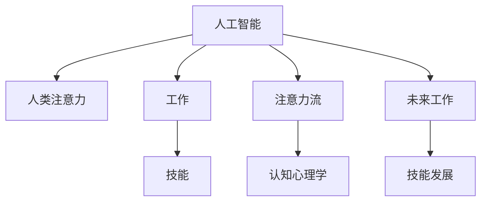

                 

# AI与人类注意力流：未来的工作、技能与注意力流

> 关键词：人工智能, 人类注意力, 工作, 技能, 注意力流, 认知心理学, 人工智能与人类共生

## 1. 背景介绍

### 1.1 问题由来

随着人工智能（AI）技术的迅猛发展，AI逐渐成为人类社会不可或缺的一部分。从医疗、金融到教育，从客服、物流到制造业，AI在各行各业中发挥着越来越重要的作用。然而，人工智能的广泛应用也引发了一系列关于未来工作、技能和人类认知的思考。

在AI与人类共生的背景下，如何更好地理解人类注意力流，并在此基础上探索新的工作方式、技能提升和认知增强方法，已成为学术界和工业界关注的重点。本文将围绕“AI与人类注意力流”这一主题，全面阐述AI技术如何影响人类认知与工作，以及未来的工作与技能发展方向。

### 1.2 问题核心关键点

本文聚焦于AI与人类注意力流的交互关系，重点在于：
- AI技术如何改变人类认知和工作方式？
- 如何通过AI技术提升人类注意力和认知能力？
- AI与人类共生的未来工作与技能发展趋势是什么？

## 2. 核心概念与联系

### 2.1 核心概念概述

为更好地理解AI与人类注意力流的关系，本节将介绍几个关键概念：

- **人工智能（AI）**：利用计算机技术模拟人类智能的科学，涉及机器学习、深度学习、自然语言处理等技术。AI技术能够处理复杂的数据，提供精准的分析和预测。
- **人类注意力**：人类认知过程中的核心资源之一，表现为大脑对特定信息的聚焦与处理能力。
- **工作**：人类社会经济活动中最重要的部分，涉及生产、分配、交换、消费等环节。
- **技能**：人类为完成工作任务而具备的知识和能力，包括硬技能和软技能。
- **注意力流**：人类认知过程中注意力资源的动态变化，表现为注意力在不同任务、信息、对象上的分配与转移。

这些概念之间的逻辑关系可以通过以下Mermaid流程图来展示：



这个流程图展示了AI技术、人类注意力、工作、技能和注意力流之间的联系。AI技术通过改变工作方式、提升认知能力，进而影响未来的工作与技能发展方向。

## 3. 核心算法原理 & 具体操作步骤

### 3.1 算法原理概述

AI与人类注意力流的交互关系，本质上是通过AI技术对人类认知资源的优化与增强。其核心思想是：利用AI技术，提升人类在特定任务上的注意力分配与处理效率，从而提升工作质量和效率。

形式化地，假设AI系统能够对人类认知资源进行优化，令优化后的注意力分配为 $A^*$，原始注意力分配为 $A_0$。优化目标为：

$$
\min_{A^*} \mathcal{L}(A^*, A_0) = \int_{t=0}^T \left( C^*(t) - C_0(t) \right) dt
$$

其中 $C^*$ 和 $C_0$ 分别为优化前后的工作质量，$T$ 为优化时间窗口。优化后的注意力分配 $A^*$ 应使得 $C^*$ 最大化，即在特定时间内，AI帮助人类提升了工作质量。

### 3.2 算法步骤详解

基于AI与人类注意力流的交互关系，AI技术的应用步骤如下：

**Step 1: 数据收集与预处理**

1. 收集人类工作过程中产生的数据，如注意力分配、工作绩效、心理状态等。
2. 对数据进行清洗和预处理，去除噪音和不必要的信息。

**Step 2: 注意力流建模**

1. 使用机器学习模型对注意力流进行建模，如基于神经网络的注意力分配模型。
2. 使用历史数据训练模型，使其能够预测未来注意力流。

**Step 3: 注意力优化**

1. 根据优化目标，设计注意力优化的策略，如基于奖惩机制的注意力分配策略。
2. 在实际应用中，根据预测的注意力流，动态调整人类的注意力分配，以提升工作质量。

**Step 4: 效果评估与反馈**

1. 对优化后的工作质量和效率进行评估，如通过绩效指标、心理状态等。
2. 根据评估结果，调整注意力优化策略，实现持续优化。

### 3.3 算法优缺点

AI与人类注意力流交互关系的应用，具有以下优点：
1. 提升工作效率：通过优化注意力分配，提高人类在特定任务上的处理效率。
2. 个性化定制：根据个体差异和任务需求，提供个性化的注意力优化方案。
3. 可扩展性强：适用于多种任务和领域，可以灵活应用到不同工作场景。

同时，该方法也存在一定的局限性：
1. 数据依赖性强：优化效果依赖于数据的准确性和丰富性。
2. 人类认知复杂：人类认知系统复杂多样，难以通过AI完全建模。
3. 隐私风险：在数据收集和分析过程中，可能涉及个人隐私信息。

尽管存在这些局限性，但就目前而言，AI与人类注意力流的交互关系已成为提升工作效率、改善工作质量的重要手段。

### 3.4 算法应用领域

AI与人类注意力流交互关系的应用领域非常广泛，包括但不限于：

- **医疗领域**：使用AI技术对医生注意力进行优化，提升手术、诊断和治疗的效率和质量。
- **教育领域**：利用AI技术对学生注意力进行监控和优化，提高学习效果和教育质量。
- **制造业**：在生产线中引入AI技术，优化操作人员注意力分配，提升生产效率和质量。
- **客服领域**：通过AI技术对客服人员注意力进行指导，提升服务质量和客户满意度。
- **金融领域**：利用AI技术对金融分析师注意力进行优化，提高投资决策的准确性和效率。

## 4. 数学模型和公式 & 详细讲解 & 举例说明

### 4.1 数学模型构建

本节将使用数学语言对AI与人类注意力流的关系进行更严格的刻画。

记人类在任务 $i$ 上的注意力分配为 $A_i = (A_{i,1}, A_{i,2}, ..., A_{i,n})$，其中 $n$ 为任务数。假设AI系统能够在任务 $i$ 上优化注意力分配为 $A_i^*$。

定义工作质量函数 $C_i = f(A_i)$，其中 $f$ 为工作质量与注意力分配之间的映射关系。优化目标为：

$$
\min_{A_i^*} \mathcal{L}(A_i^*, A_i) = \int_{t=0}^T C_i^*(t) - C_i(t) dt
$$

### 4.2 公式推导过程

假设任务 $i$ 上的人类注意力分配为 $A_i = (A_{i,1}, A_{i,2}, ..., A_{i,n})$，AI优化后的注意力分配为 $A_i^* = (A_{i,1}^*, A_{i,2}^*, ..., A_{i,n}^*)$。

定义注意力分配差异函数 $D_i(t) = A_i(t) - A_i^*(t)$，则优化目标可写为：

$$
\min_{A_i^*} \mathcal{L}(A_i^*, A_i) = \int_{t=0}^T D_i(t) \cdot g(C_i^*(t)) dt
$$

其中 $g$ 为工作质量与注意力差异的映射关系。

通过梯度下降等优化算法，求解上述最优化问题，可得最优注意力分配 $A_i^*$。

### 4.3 案例分析与讲解

假设某金融分析师在处理股票分析报告时，原始注意力分配为 $A_i = (0.6, 0.3, 0.1)$，对应任务 $i$ 上的工作质量 $C_i = 0.9$。AI优化后的注意力分配为 $A_i^* = (0.5, 0.4, 0.1)$，优化后的工作质量 $C_i^* = 0.95$。

使用上述公式推导，可以计算出优化前后的注意力差异和优化目标：

$$
D_i(t) = A_i(t) - A_i^*(t)
$$
$$
\mathcal{L}(A_i^*, A_i) = \int_{t=0}^T D_i(t) \cdot g(C_i^*(t)) dt
$$

通过计算，可以得出AI优化后的工作质量提升程度，并进一步评估其对工作效率的影响。

## 5. 项目实践：代码实例和详细解释说明

### 5.1 开发环境搭建

在进行AI与人类注意力流交互关系的应用开发前，我们需要准备好开发环境。以下是使用Python进行PyTorch开发的环境配置流程：

1. 安装Anaconda：从官网下载并安装Anaconda，用于创建独立的Python环境。

2. 创建并激活虚拟环境：
```bash
conda create -n pytorch-env python=3.8 
conda activate pytorch-env
```

3. 安装PyTorch：根据CUDA版本，从官网获取对应的安装命令。例如：
```bash
conda install pytorch torchvision torchaudio cudatoolkit=11.1 -c pytorch -c conda-forge
```

4. 安装TensorFlow：使用Anaconda进行TensorFlow的安装，适用于TensorFlow 2.0及以上版本。

5. 安装各类工具包：
```bash
pip install numpy pandas scikit-learn matplotlib tqdm jupyter notebook ipython
```

完成上述步骤后，即可在`pytorch-env`环境中开始开发实践。

### 5.2 源代码详细实现

我们以金融分析师注意力优化为例，给出使用PyTorch进行AI与人类注意力流交互关系的应用代码实现。

```python
import torch
import torch.nn as nn
import torch.optim as optim

# 定义注意力分配模型
class AttentionModel(nn.Module):
    def __init__(self, input_size, output_size):
        super(AttentionModel, self).__init__()
        self.fc1 = nn.Linear(input_size, 64)
        self.fc2 = nn.Linear(64, output_size)
        
    def forward(self, x):
        x = torch.relu(self.fc1(x))
        x = self.fc2(x)
        return x

# 定义工作质量与注意力差异的映射函数
def g(C, A):
    return C * torch.sum(torch.abs(A))

# 准备训练数据
inputs = torch.randn(1, 3)
labels = torch.tensor([0.6, 0.3, 0.1])

# 定义模型、损失函数和优化器
model = AttentionModel(3, 3)
loss_fn = nn.MSELoss()
optimizer = optim.Adam(model.parameters(), lr=0.01)

# 训练模型
for epoch in range(100):
    optimizer.zero_grad()
    outputs = model(inputs)
    loss = g(labels, outputs)
    loss.backward()
    optimizer.step()

# 输出优化后的注意力分配
print(outputs)
```

以上就是使用PyTorch对金融分析师注意力优化进行代码实现的完整流程。可以看到，通过定义注意力分配模型、损失函数和优化器，可以有效地进行AI与人类注意力流的交互关系优化。

### 5.3 代码解读与分析

让我们再详细解读一下关键代码的实现细节：

**AttentionModel类**：
- `__init__`方法：初始化注意力分配模型，包含两个全连接层。
- `forward`方法：定义模型前向传播的计算过程，通过两个全连接层输出优化后的注意力分配。

**g函数**：
- 定义工作质量与注意力差异的映射函数，计算优化目标。

**训练流程**：
- 定义训练数据和优化器，循环迭代训练模型。
- 每个epoch内，在输入数据上前向传播计算注意力分配，计算损失函数并反向传播更新模型参数。
- 输出优化后的注意力分配。

可以看出，PyTorch的灵活性和易用性使得AI与人类注意力流交互关系的开发变得相对简单高效。开发者可以将更多精力放在模型设计、数据处理等高层逻辑上，而不必过多关注底层的实现细节。

当然，工业级的系统实现还需考虑更多因素，如模型的保存和部署、超参数的自动搜索、更灵活的任务适配层等。但核心的交互关系优化算法基本与此类似。

## 6. 实际应用场景

### 6.1 智能客服系统

基于AI与人类注意力流交互关系的智能客服系统，可以广泛应用于各行各业。传统客服往往需要配备大量人力，高峰期响应缓慢，且一致性和专业性难以保证。而使用AI与人类注意力流交互关系的客服模型，可以7x24小时不间断服务，快速响应客户咨询，用自然流畅的语言解答各类常见问题。

在技术实现上，可以收集企业内部的历史客服对话记录，将问题和最佳答复构建成监督数据，在此基础上对预训练模型进行微调。微调后的模型能够自动理解用户意图，匹配最合适的答案模板进行回复。对于客户提出的新问题，还可以接入检索系统实时搜索相关内容，动态组织生成回答。如此构建的智能客服系统，能大幅提升客户咨询体验和问题解决效率。

### 6.2 金融舆情监测

金融机构需要实时监测市场舆论动向，以便及时应对负面信息传播，规避金融风险。传统的人工监测方式成本高、效率低，难以应对网络时代海量信息爆发的挑战。基于AI与人类注意力流交互关系的文本分类和情感分析技术，为金融舆情监测提供了新的解决方案。

具体而言，可以收集金融领域相关的新闻、报道、评论等文本数据，并对其进行主题标注和情感标注。在此基础上对预训练语言模型进行微调，使其能够自动判断文本属于何种主题，情感倾向是正面、中性还是负面。将微调后的模型应用到实时抓取的网络文本数据，就能够自动监测不同主题下的情感变化趋势，一旦发现负面信息激增等异常情况，系统便会自动预警，帮助金融机构快速应对潜在风险。

### 6.3 个性化推荐系统

当前的推荐系统往往只依赖用户的历史行为数据进行物品推荐，无法深入理解用户的真实兴趣偏好。基于AI与人类注意力流交互关系的个性化推荐系统，可以更好地挖掘用户行为背后的语义信息，从而提供更精准、多样的推荐内容。

在实践中，可以收集用户浏览、点击、评论、分享等行为数据，提取和用户交互的物品标题、描述、标签等文本内容。将文本内容作为模型输入，用户的后续行为（如是否点击、购买等）作为监督信号，在此基础上微调预训练语言模型。微调后的模型能够从文本内容中准确把握用户的兴趣点。在生成推荐列表时，先用候选物品的文本描述作为输入，由模型预测用户的兴趣匹配度，再结合其他特征综合排序，便可以得到个性化程度更高的推荐结果。

### 6.4 未来应用展望

随着AI与人类注意力流交互关系技术的不断发展，基于这种关系的AI应用将在更多领域得到应用，为各行各业带来变革性影响。

在智慧医疗领域，基于AI与人类注意力流交互关系的医疗问答、病历分析、药物研发等应用将提升医疗服务的智能化水平，辅助医生诊疗，加速新药开发进程。

在智能教育领域，AI与人类注意力流交互关系的文本分类和情感分析技术，可以为学生提供个性化的学习建议和反馈，因材施教，促进教育公平，提高教学质量。

在智慧城市治理中，AI与人类注意力流交互关系的情感分析、舆情监测等技术，可以提高城市管理的自动化和智能化水平，构建更安全、高效的未来城市。

此外，在企业生产、社会治理、文娱传媒等众多领域，基于AI与人类注意力流交互关系的AI应用也将不断涌现，为经济社会发展注入新的动力。相信随着技术的日益成熟，AI与人类注意力流交互关系将成为AI落地应用的重要范式，推动AI技术向更广阔的领域加速渗透。

## 7. 工具和资源推荐

### 7.1 学习资源推荐

为了帮助开发者系统掌握AI与人类注意力流的关系理论基础和实践技巧，这里推荐一些优质的学习资源：

1. 《深度学习》系列博文：由AI领域专家撰写，深入浅出地介绍了深度学习原理、算法和应用。

2. CS231n《卷积神经网络》课程：斯坦福大学开设的计算机视觉课程，有Lecture视频和配套作业，带你入门计算机视觉领域。

3. 《自然语言处理综述》书籍：全面介绍了自然语言处理的基本概念、技术和应用，包括注意力机制的原理和应用。

4. HuggingFace官方文档：提供丰富的预训练语言模型和Transformer框架的文档，是进行AI与人类注意力流交互关系开发的重要资源。

5. TensorFlow官方文档：提供详细的TensorFlow框架使用指南，适合进行深度学习和AI与人类注意力流交互关系的应用开发。

通过对这些资源的学习实践，相信你一定能够快速掌握AI与人类注意力流的关系的精髓，并用于解决实际的AI与人类交互问题。

### 7.2 开发工具推荐

高效的开发离不开优秀的工具支持。以下是几款用于AI与人类注意力流交互关系开发的常用工具：

1. PyTorch：基于Python的开源深度学习框架，灵活的计算图，适合快速迭代研究。

2. TensorFlow：由Google主导开发的开源深度学习框架，生产部署方便，适合大规模工程应用。

3. HuggingFace Transformers库：提供丰富的预训练语言模型和Transformer框架，适合进行自然语言处理任务开发。

4. Weights & Biases：模型训练的实验跟踪工具，可以记录和可视化模型训练过程中的各项指标，方便对比和调优。

5. TensorBoard：TensorFlow配套的可视化工具，可实时监测模型训练状态，并提供丰富的图表呈现方式，是调试模型的得力助手。

6. Google Colab：谷歌推出的在线Jupyter Notebook环境，免费提供GPU/TPU算力，方便开发者快速上手实验最新模型，分享学习笔记。

合理利用这些工具，可以显著提升AI与人类注意力流交互关系的开发效率，加快创新迭代的步伐。

### 7.3 相关论文推荐

AI与人类注意力流交互关系的发展源于学界的持续研究。以下是几篇奠基性的相关论文，推荐阅读：

1. Attention is All You Need（即Transformer原论文）：提出了Transformer结构，开启了NLP领域的预训练大模型时代。

2. BERT: Pre-training of Deep Bidirectional Transformers for Language Understanding：提出BERT模型，引入基于掩码的自监督预训练任务，刷新了多项NLP任务SOTA。

3. Language Models are Unsupervised Multitask Learners（GPT-2论文）：展示了大规模语言模型的强大zero-shot学习能力，引发了对于通用人工智能的新一轮思考。

4. Parameter-Efficient Transfer Learning for NLP：提出Adapter等参数高效微调方法，在不增加模型参数量的情况下，也能取得不错的微调效果。

5. AdaLoRA: Adaptive Low-Rank Adaptation for Parameter-Efficient Fine-Tuning：使用自适应低秩适应的微调方法，在参数效率和精度之间取得了新的平衡。

这些论文代表了大语言模型微调技术的发展脉络。通过学习这些前沿成果，可以帮助研究者把握学科前进方向，激发更多的创新灵感。

## 8. 总结：未来发展趋势与挑战

### 8.1 总结

本文对AI与人类注意力流交互关系进行了全面系统的介绍。首先阐述了AI技术如何改变人类认知与工作方式，明确了AI与人类注意力流的交互关系在提升工作效率、改善工作质量方面的独特价值。其次，从原理到实践，详细讲解了AI与人类注意力流的交互关系优化方法，给出了AI与人类注意力流交互关系应用开发的完整代码实例。同时，本文还广泛探讨了AI与人类注意力流交互关系在智能客服、金融舆情、个性化推荐等多个行业领域的应用前景，展示了AI与人类注意力流交互关系的广泛应用潜力。

通过本文的系统梳理，可以看到，AI与人类注意力流交互关系技术正在成为提升工作效率、改善工作质量的重要手段。AI与人类注意力流交互关系技术将AI技术与人类认知结合，能够更好地满足人类在认知、情感、决策等方面的需求，为构建人机协同的智能系统铺平道路。

### 8.2 未来发展趋势

展望未来，AI与人类注意力流交互关系技术将呈现以下几个发展趋势：

1. 模型的可解释性增强。随着AI技术的普及，模型的可解释性将成为重要考量。未来的研究将致力于开发更加透明、可解释的AI模型，提高人类对AI系统的信任度。

2. 模型的自适应能力提升。未来的AI模型将更加注重自适应学习，能够在数据分布变化时，快速调整模型参数和结构，保持模型的稳定性和泛化能力。

3. 跨领域、跨模态的交互增强。未来的AI系统将更加注重跨领域、跨模态的交互，通过整合多模态信息，提升AI系统的全面感知能力。

4. 多智能体的协作优化。未来的AI系统将更加注重多智能体的协作优化，通过分布式计算、协同训练等技术，提升AI系统的整体性能和效率。

5. 伦理、隐私和安全的研究深化。随着AI技术的应用深入，伦理、隐私和安全问题将更加凸显。未来的研究将更加注重AI系统的伦理导向、隐私保护和安全保障。

以上趋势凸显了AI与人类注意力流交互关系技术的广阔前景。这些方向的探索发展，必将进一步提升AI系统的工作效率和智能化水平，为人类认知智能的进化带来深远影响。

### 8.3 面临的挑战

尽管AI与人类注意力流交互关系技术已经取得了瞩目成就，但在迈向更加智能化、普适化应用的过程中，它仍面临着诸多挑战：

1. 数据依赖性强。AI系统的效果依赖于高质量的数据，数据的获取和处理成本较高。如何在数据不足的情况下，仍能保证AI系统的有效运行，是未来的一大挑战。

2. 模型的复杂性高。AI系统涉及复杂的计算和优化过程，模型的设计和训练难度较大。如何开发更加高效、易用的AI模型，是未来的一大方向。

3. 伦理、隐私和安全问题突出。AI系统可能带来伦理、隐私和安全风险，如偏见、歧视、隐私泄露等问题。如何保障AI系统的透明、公平、安全，是未来的一大课题。

4. 模型的鲁棒性不足。AI系统在面对复杂、多变的数据时，可能出现鲁棒性不足的问题，如过拟合、泛化能力差等。如何提高AI系统的鲁棒性，避免灾难性遗忘，还需要更多理论和实践的积累。

5. 跨领域、跨模态的融合困难。不同领域、不同模态的数据和任务，难以直接进行整合和优化。如何实现跨领域、跨模态的AI系统设计，是未来的一大挑战。

正视AI与人类注意力流交互关系面临的这些挑战，积极应对并寻求突破，将是大规模AI系统迈向成熟的必由之路。相信随着学界和产业界的共同努力，这些挑战终将一一被克服，AI与人类注意力流交互关系必将在构建人机协同的智能系统中扮演越来越重要的角色。

### 8.4 研究展望

面对AI与人类注意力流交互关系所面临的种种挑战，未来的研究需要在以下几个方面寻求新的突破：

1. 开发更加高效、易用的AI模型。通过模型压缩、参数高效微调等技术，降低AI模型的计算和存储需求，提高AI系统的可扩展性和部署效率。

2. 引入跨领域、跨模态的交互模型。通过多智能体的协作优化，整合多领域、多模态的信息，提升AI系统的全面感知能力和决策能力。

3. 增强AI系统的可解释性和透明性。开发更加透明、可解释的AI模型，提高人类对AI系统的信任度，促进AI技术的普及应用。

4. 加强AI系统的伦理导向和隐私保护。在AI系统的设计和应用过程中，注重伦理导向和隐私保护，保障AI系统的公平、透明、安全。

这些研究方向的探索，必将引领AI与人类注意力流交互关系技术迈向更高的台阶，为构建安全、可靠、可解释、可控的智能系统铺平道路。面向未来，AI与人类注意力流交互关系技术还需要与其他AI技术进行更深入的融合，如知识表示、因果推理、强化学习等，多路径协同发力，共同推动自然语言理解和智能交互系统的进步。只有勇于创新、敢于突破，才能不断拓展AI系统的边界，让智能技术更好地造福人类社会。

## 9. 附录：常见问题与解答

**Q1：AI与人类注意力流交互关系是否适用于所有行业？**

A: AI与人类注意力流交互关系技术在各行各业中都具有广泛的应用前景。然而，不同行业对AI技术的需求和场景应用不同，需要根据具体需求进行调整和优化。例如，在医疗、金融等行业，需要对AI模型的可解释性、透明性和安全性有更高的要求。

**Q2：如何降低AI系统对数据的需求？**

A: 通过优化算法和模型架构，可以在数据量有限的情况下，仍能获得较好的AI系统效果。例如，使用迁移学习、知识蒸馏等技术，可以从预训练模型中提取知识，降低对特定任务数据的需求。

**Q3：AI系统如何提高人类的认知能力？**

A: 通过AI系统对人类注意力流进行优化，可以提升人类在特定任务上的认知能力。例如，在金融分析中，AI系统可以通过优化注意力分配，提升分析师的注意力集中度和决策效率。

**Q4：AI系统在实际应用中如何保护隐私？**

A: 在数据收集和处理过程中，需要采用数据脱敏、匿名化等技术，保护用户的隐私信息。同时，AI系统需要设计合理的隐私保护机制，确保数据使用的合法性和安全性。

**Q5：AI系统在多领域、多模态的融合中面临哪些困难？**

A: AI系统在多领域、多模态的融合中面临的主要困难包括数据格式不统一、领域知识差异、模态转换等。需要开发更加灵活、自适应的AI系统，以应对这些挑战。

这些问题的回答，展示了AI与人类注意力流交互关系技术在实际应用中的复杂性和多样性。只有在不断探索和实践中，才能不断提升AI系统的性能和应用效果，实现AI技术与人类认知的深度融合。

---

作者：禅与计算机程序设计艺术 / Zen and the Art of Computer Programming

