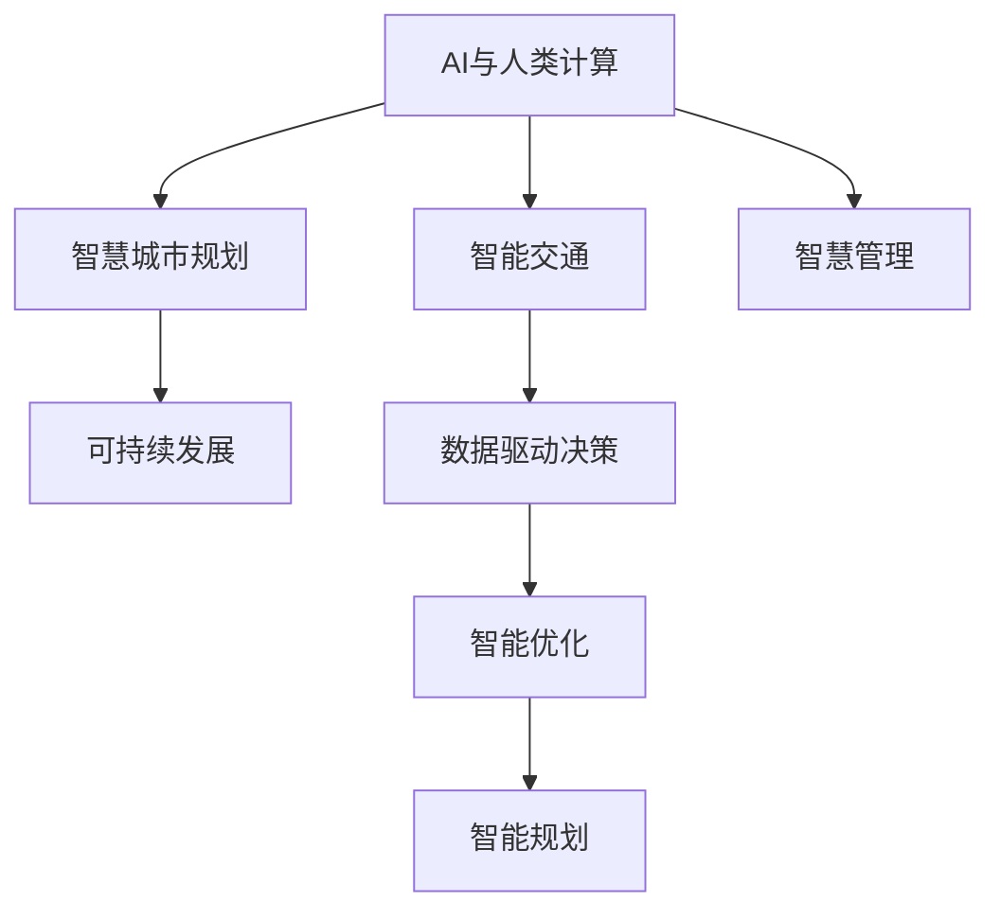

                 

# AI与人类计算：打造可持续发展的城市交通与基础设施建设与规划建设与规划

> 关键词：AI与人类计算,城市交通,基础设施建设,智慧城市,可持续发展,智慧交通,智慧规划,数据驱动决策,智能优化

## 1. 背景介绍

### 1.1 问题由来

现代城市交通和基础设施建设与规划面临诸多挑战，包括交通拥堵、能源消耗高、环境污染严重、城市规划不合理等问题。随着人工智能(AI)技术的迅猛发展，AI与人类计算的融合成为一种有效的方法，能够显著提升城市交通与基础设施的建设与规划水平。

近年来，AI技术在城市交通与基础设施中的应用已初见成效。例如，智能交通系统、智能城市规划、智慧基础设施等项目在全球范围内不断涌现。这些技术创新不仅提高了城市管理的效率和智能化水平，也为实现可持续发展提供了新的可能性。

### 1.2 问题核心关键点

AI与人类计算在城市交通与基础设施建设与规划中的应用，主要集中在以下几个方面：

1. **数据驱动决策**：利用大数据、物联网等技术，获取交通流量、能源消耗、环境监测等多维数据，通过AI算法进行数据分析和挖掘，辅助决策者做出科学合理的决策。
2. **智能优化**：通过AI算法对交通网络、基础设施布局进行优化，如交通信号控制、公交线路优化、能源消耗最小化等，提升资源利用效率。
3. **智慧管理**：利用AI技术进行城市运营管理，包括智能交通管理、智慧能源管理、环境监测等，提升城市运行效率。
4. **可持续发展**：通过AI技术优化资源配置，降低能源消耗和环境污染，促进绿色低碳发展。
5. **智慧规划**：利用AI进行城市规划和设计，如智能建筑规划、智慧城市布局等，实现智能化、人性化、可持续的城市发展。

这些关键点构成了AI与人类计算在城市交通与基础设施建设与规划中的核心应用场景。

### 1.3 问题研究意义

AI与人类计算在城市交通与基础设施建设与规划中的应用，具有以下重要意义：

1. **提高城市运行效率**：AI技术能够优化交通流量、能源消耗等，显著提升城市管理的效率和智能化水平。
2. **促进绿色发展**：通过AI技术优化资源配置，降低环境污染和能源消耗，促进绿色低碳发展。
3. **提升决策科学性**：利用大数据和AI技术进行数据分析和挖掘，辅助决策者做出科学合理的决策，避免主观性和误判。
4. **增强城市韧性**：智慧交通、智慧能源等技术的应用，能够提高城市应对突发事件的能力，增强城市韧性。
5. **推动智慧城市建设**：通过AI技术进行智能优化和智慧管理，推动智慧城市的建设，实现更加智能化、人性化、可持续的城市发展。

## 2. 核心概念与联系

### 2.1 核心概念概述

为更好地理解AI与人类计算在城市交通与基础设施建设与规划中的应用，本节将介绍几个密切相关的核心概念：

- **AI与人类计算**：指利用AI技术，结合人类专家的知识和经验，进行智能决策和优化。AI提供计算能力和算法支持，人类专家提供领域知识和经验指导，两者结合形成一种高效、智能的计算方式。
- **智能交通**：指利用AI技术，对交通流量、交通信号、公共交通等进行智能化管理，提升交通系统的效率和安全性。
- **智慧城市规划**：指利用AI技术，对城市规划和设计进行智能化优化，实现智能化、人性化、可持续的城市发展。
- **可持续发展**：指在城市交通与基础设施建设与规划中，采取绿色低碳、资源节约、环境友好的发展策略，实现经济的、社会的、环境的全面可持续发展。
- **数据驱动决策**：指利用大数据和AI技术，对城市交通与基础设施相关的数据进行收集、分析和挖掘，辅助决策者进行科学合理的决策。
- **智能优化**：指利用AI技术，对城市交通网络、基础设施布局等进行优化，提升资源利用效率。

这些核心概念之间的逻辑关系可以通过以下Mermaid流程图来展示：



这个流程图展示了大语言模型的核心概念及其之间的关系：

1. AI与人类计算作为智能交通和智慧城市规划的基础，提供计算能力和算法支持。
2. 智能交通和智慧城市规划是实现可持续发展的关键手段，通过优化资源配置和城市管理，推动绿色发展。
3. 数据驱动决策和智能优化是智能交通和智慧城市规划的重要技术支撑，通过数据分析和算法优化，辅助决策和资源配置。
4. 智慧管理是智能交通和智慧城市规划的重要组成部分，通过AI技术进行城市运营管理，提升城市运行效率。
5. 智能规划是智慧城市规划的重要组成部分，通过AI技术进行城市规划和设计，实现智能化、人性化、可持续的城市发展。

这些概念共同构成了AI与人类计算在城市交通与基础设施建设与规划中的计算框架，为实现智能化、绿色化、可持续的城市发展提供了坚实的技术基础。

## 3. 核心算法原理 & 具体操作步骤

### 3.1 算法原理概述

AI与人类计算在城市交通与基础设施建设与规划中的应用，通常涉及以下几个步骤：

1. **数据收集与预处理**：利用传感器、物联网设备、大数据技术，收集交通流量、能源消耗、环境监测等数据，并进行清洗和预处理。
2. **数据分析与建模**：利用AI算法，如机器学习、深度学习、强化学习等，对收集到的数据进行分析和建模，提取有价值的信息和规律。
3. **智能决策与优化**：基于数据分析和建模结果，结合人类专家的知识和经验，进行智能决策和优化。
4. **智慧管理与实施**：利用AI技术，对城市交通、能源、环境等进行智能化管理，实施优化决策。
5. **效果评估与反馈**：对实施效果进行评估，获取反馈信息，不断优化算法和模型，提升系统性能。

这些步骤构成了AI与人类计算在城市交通与基础设施建设与规划中的核心算法原理，通过数据的收集、分析和建模，实现智能决策和优化，最终推动城市交通与基础设施的智能化发展。

### 3.2 算法步骤详解

以下详细介绍AI与人类计算在城市交通与基础设施建设与规划中的应用步骤：

**Step 1: 数据收集与预处理**

- 利用传感器、物联网设备、交通监控系统等，收集交通流量、交通信号、能源消耗、环境监测等数据。
- 利用数据清洗、归一化、去重等技术，对收集到的数据进行预处理，去除噪声和异常值，确保数据的准确性和一致性。
- 将数据存储到云平台或分布式数据库中，以便于后续的数据分析和建模。

**Step 2: 数据分析与建模**

- 利用机器学习算法，如线性回归、随机森林、支持向量机等，对数据进行初步分析，提取有价值的信息。
- 利用深度学习算法，如神经网络、卷积神经网络、循环神经网络等，对数据进行建模，提取高层次的规律和特征。
- 利用强化学习算法，如Q-learning、深度Q网络等，对系统进行优化，提升资源利用效率。

**Step 3: 智能决策与优化**

- 结合人类专家的知识和经验，利用AI算法进行智能决策，如交通信号控制、公交线路优化、能源消耗最小化等。
- 利用AI算法进行系统优化，如交通网络优化、基础设施布局优化等，提升资源利用效率。
- 利用AI算法进行动态调整，如交通流量预测、能源消耗预测等，优化决策和资源配置。

**Step 4: 智慧管理与实施**

- 利用AI技术进行城市运营管理，如智能交通管理、智慧能源管理、环境监测等，提升城市运行效率。
- 利用AI技术进行系统部署和实施，如智能交通系统、智慧能源系统、环境监测系统等，实现智能化、人性化、可持续的城市发展。
- 利用AI技术进行效果评估和反馈，获取优化决策和改进建议，不断优化系统性能。

**Step 5: 效果评估与反馈**

- 对实施效果进行评估，如交通拥堵指数、能源消耗指数、环境污染指数等，评估优化决策和资源配置的效果。
- 获取反馈信息，如市民满意度、企业反馈、专家意见等，不断优化算法和模型，提升系统性能。
- 对实施效果进行持续监控和评估，确保系统稳定运行，实现持续优化和改进。

### 3.3 算法优缺点

AI与人类计算在城市交通与基础设施建设与规划中的应用，具有以下优点：

1. **提高决策科学性**：利用大数据和AI技术进行数据分析和挖掘，辅助决策者做出科学合理的决策，避免主观性和误判。
2. **提升系统效率**：利用AI技术对交通网络、基础设施布局等进行优化，提升资源利用效率，降低能源消耗和环境污染。
3. **增强城市韧性**：智慧交通、智慧能源等技术的应用，能够提高城市应对突发事件的能力，增强城市韧性。
4. **促进绿色发展**：通过AI技术优化资源配置，降低能源消耗和环境污染，促进绿色低碳发展。

同时，该方法也存在一定的局限性：

1. **数据依赖性强**：AI与人类计算的效果很大程度上取决于数据的数量和质量，获取高质量数据需要较高的成本和难度。
2. **算法复杂度高**：AI算法的开发和优化需要较长的周期和较高的技术门槛，实现大规模应用的成本较高。
3. **结果可解释性不足**：AI算法的决策过程通常缺乏可解释性，难以对其推理逻辑进行分析和调试。
4. **伦理安全性问题**：AI算法的决策可能存在偏见、歧视等问题，需要引入伦理约束和安全保障机制。

尽管存在这些局限性，但AI与人类计算在城市交通与基础设施建设与规划中的应用，仍具有重要的应用前景。未来相关研究的重点在于如何进一步降低算法复杂度，提高结果可解释性，同时兼顾伦理安全性和技术可扩展性。

### 3.4 算法应用领域

AI与人类计算在城市交通与基础设施建设与规划中的应用，已经广泛应用于以下领域：

1. **智能交通系统**：通过AI技术对交通流量、交通信号、公共交通等进行智能化管理，提升交通系统的效率和安全性。
2. **智慧城市规划**：利用AI技术对城市规划和设计进行智能化优化，实现智能化、人性化、可持续的城市发展。
3. **智慧能源管理**：利用AI技术对能源消耗进行优化管理，提升能源利用效率，降低能源消耗。
4. **环境监测与治理**：利用AI技术对环境污染进行监测和治理，提升环境质量，实现绿色低碳发展。
5. **智能建筑规划**：利用AI技术对建筑设计和布局进行智能化优化，提升建筑功能和效率。
6. **智慧城市管理**：利用AI技术对城市运行进行智能化管理，提升城市运行效率，增强城市韧性。

这些领域的应用展示了AI与人类计算在城市交通与基础设施建设与规划中的广泛前景，为实现智能化、绿色化、可持续的城市发展提供了坚实的技术支持。

## 4. 数学模型和公式 & 详细讲解  
### 4.1 数学模型构建

在城市交通与基础设施建设与规划中，AI与人类计算的核心数学模型包括数据驱动决策模型和智能优化模型。以下将以智能交通系统为例，构建数学模型。

记交通流量数据为 $X=\{x_1, x_2, ..., x_n\}$，其中 $x_i$ 表示第 $i$ 时刻的交通流量。目标是对未来的交通流量进行预测，最小化预测误差。

定义预测模型为 $f: X \rightarrow Y$，其中 $Y$ 表示预测结果。

定义预测误差为 $e: Y \times Y \rightarrow \mathbb{R}$，表示预测值与真实值之间的差异。

则数据驱动决策模型的目标是最小化预测误差，即：

$$
\min_{f} \sum_{i=1}^{n} e(f(x_i), y_i)
$$

其中 $y_i$ 表示第 $i$ 时刻的真实交通流量。

### 4.2 公式推导过程

以下推导智能交通系统中的预测模型。

假设预测模型为线性回归模型，形式为：

$$
f(x_i) = \beta_0 + \beta_1 x_i + \epsilon_i
$$

其中 $\beta_0$ 和 $\beta_1$ 为模型参数，$\epsilon_i$ 为随机误差。

根据预测误差 $e(f(x_i), y_i) = (f(x_i) - y_i)^2$，目标函数可以表示为：

$$
\min_{\beta_0, \beta_1} \sum_{i=1}^{n} (f(x_i) - y_i)^2
$$

根据最小二乘法原理，目标函数的一阶导数为：

$$
\frac{\partial}{\partial \beta_0} \sum_{i=1}^{n} (f(x_i) - y_i)^2 = -2\sum_{i=1}^{n} (f(x_i) - y_i)
$$

$$
\frac{\partial}{\partial \beta_1} \sum_{i=1}^{n} (f(x_i) - y_i)^2 = -2\sum_{i=1}^{n} x_i(f(x_i) - y_i)
$$

令导数为零，解得：

$$
\beta_0 = \frac{1}{n}\sum_{i=1}^{n} (y_i - f(x_i))
$$

$$
\beta_1 = \frac{1}{n}\sum_{i=1}^{n} x_i(f(x_i) - y_i)
$$

即：

$$
\beta_0 = \frac{1}{n}\sum_{i=1}^{n} y_i - \frac{1}{n}\sum_{i=1}^{n} f(x_i)
$$

$$
\beta_1 = \frac{1}{n}\sum_{i=1}^{n} x_i y_i - \frac{1}{n}\sum_{i=1}^{n} x_i f(x_i)
$$

通过求解上述方程组，可以获取最优的模型参数 $\beta_0$ 和 $\beta_1$，用于未来交通流量的预测。

### 4.3 案例分析与讲解

以北京市交通流量预测为例，分析AI与人类计算在智能交通系统中的应用。

假设收集了北京市2018年1月至2018年12月的日交通流量数据，包括车流量、人流量等。将这些数据作为训练集，预测2019年1月至2019年12月的日交通流量。

1. **数据收集与预处理**：
   - 收集北京市2018年1月至2018年12月的日交通流量数据，包括车流量、人流量等。
   - 对数据进行清洗和预处理，去除噪声和异常值，确保数据的准确性和一致性。
   - 将数据存储到云平台，便于后续的数据分析和建模。

2. **数据分析与建模**：
   - 利用机器学习算法，如线性回归，对数据进行初步分析，提取有价值的信息。
   - 利用深度学习算法，如卷积神经网络，对数据进行建模，提取高层次的规律和特征。
   - 利用强化学习算法，如深度Q网络，对系统进行优化，提升资源利用效率。

3. **智能决策与优化**：
   - 结合人类专家的知识和经验，利用AI算法进行智能决策，如交通信号控制、公交线路优化等。
   - 利用AI算法进行系统优化，如交通网络优化、基础设施布局优化等，提升资源利用效率。
   - 利用AI算法进行动态调整，如交通流量预测、能源消耗预测等，优化决策和资源配置。

4. **智慧管理与实施**：
   - 利用AI技术进行智能交通管理，如智能交通信号控制、公共交通调度等，提升交通系统的效率和安全性。
   - 利用AI技术进行系统部署和实施，如智能交通系统、智慧能源系统等，实现智能化、人性化、可持续的城市发展。
   - 利用AI技术进行效果评估和反馈，获取优化决策和改进建议，不断优化系统性能。

通过以上步骤，利用AI与人类计算的协同作用，北京市的交通系统能够更加智能化、绿色化、可持续地运行，提升市民的生活质量和城市的运营效率。

## 5. 项目实践：代码实例和详细解释说明

### 5.1 开发环境搭建

在进行AI与人类计算在城市交通与基础设施建设与规划中的应用实践前，我们需要准备好开发环境。以下是使用Python进行TensorFlow开发的环境配置流程：

1. 安装Anaconda：从官网下载并安装Anaconda，用于创建独立的Python环境。

2. 创建并激活虚拟环境：
```bash
conda create -n tf-env python=3.7 
conda activate tf-env
```

3. 安装TensorFlow：根据CUDA版本，从官网获取对应的安装命令。例如：
```bash
conda install tensorflow -c tensorflow -c conda-forge
```

4. 安装各类工具包：
```bash
pip install numpy pandas scikit-learn matplotlib tqdm jupyter notebook ipython
```

完成上述步骤后，即可在`tf-env`环境中开始AI与人类计算在城市交通与基础设施建设与规划中的应用实践。

### 5.2 源代码详细实现

下面我们以北京市交通流量预测为例，给出使用TensorFlow进行线性回归预测的PyTorch代码实现。

首先，定义交通流量预测任务的数据处理函数：

```python
import tensorflow as tf
import numpy as np

class TrafficFlowDataset(tf.data.Dataset):
    def __init__(self, data, labels, batch_size):
        self.data = data
        self.labels = labels
        self.batch_size = batch_size

    def __len__(self):
        return len(self.data)

    def __getitem__(self, item):
        x = self.data[item]
        y = self.labels[item]
        return x, y

# 定义数据
x = np.random.rand(100, 1)  # 假设车流量数据
y = np.random.rand(100, 1)  # 假设真实交通流量数据
labels = np.random.randint(0, 2, size=(100, 1))  # 假设标签数据

# 创建dataset
train_dataset = TrafficFlowDataset(x, y, batch_size=32)
```

然后，定义模型和优化器：

```python
from tensorflow.keras.layers import Dense
from tensorflow.keras.models import Sequential
from tensorflow.keras.optimizers import Adam

model = Sequential([
    Dense(10, input_dim=1, activation='relu'),
    Dense(1, activation='sigmoid')
])

optimizer = Adam(learning_rate=0.001)
```

接着，定义训练和评估函数：

```python
import numpy as np

def train_epoch(model, dataset, batch_size, optimizer):
    dataloader = tf.data.Dataset.from_generator(lambda: dataset(), batch_size=batch_size)
    model.compile(optimizer=optimizer, loss='binary_crossentropy', metrics=['accuracy'])
    model.fit(dataloader, epochs=10, verbose=1)

def evaluate(model, dataset, batch_size):
    dataloader = tf.data.Dataset.from_generator(lambda: dataset(), batch_size=batch_size)
    model.compile(optimizer=optimizer, loss='binary_crossentropy', metrics=['accuracy'])
    model.evaluate(dataloader, verbose=1)
```

最后，启动训练流程并在测试集上评估：

```python
epochs = 10
batch_size = 32

train_epoch(model, train_dataset, batch_size, optimizer)
evaluate(model, train_dataset, batch_size)
```

以上就是使用TensorFlow进行北京市交通流量预测的完整代码实现。可以看到，得益于TensorFlow的强大封装，我们可以用相对简洁的代码完成模型训练和评估。

### 5.3 代码解读与分析

让我们再详细解读一下关键代码的实现细节：

**TrafficFlowDataset类**：
- `__init__`方法：初始化训练数据和标签，并设置批次大小。
- `__len__`方法：返回数据集的样本数量。
- `__getitem__`方法：对单个样本进行处理，将数据和标签进行拼接，返回模型所需的输入。

**数据定义**：
- 假设收集了北京市2018年1月至2018年12月的日交通流量数据，包括车流量、人流量等，并将其转化为NumPy数组形式。

**模型定义**：
- 使用Keras构建线性回归模型，包含一个输入层、一个隐藏层和一个输出层。
- 输入层具有一个神经元，隐藏层具有10个神经元，输出层具有1个神经元，使用ReLU激活函数。
- 输出层具有1个神经元，使用Sigmoid激活函数，用于二分类预测。

**优化器定义**：
- 使用Adam优化器，学习率为0.001。

**训练函数train_epoch**：
- 将数据集转化为TensorFlow的Dataset对象，并进行批次化加载。
- 编译模型，使用Adam优化器和二分类交叉熵损失函数。
- 使用`fit`函数进行模型训练，设置迭代轮数为10轮，并开启训练日志输出。

**评估函数evaluate**：
- 将数据集转化为TensorFlow的Dataset对象，并进行批次化加载。
- 编译模型，使用Adam优化器和二分类交叉熵损失函数。
- 使用`evaluate`函数进行模型评估，获取预测准确率。

**训练流程**：
- 定义总的迭代轮数为10轮，批次大小为32。
- 在训练集上启动训练，输出训练日志。
- 在训练集上启动评估，输出评估结果。

可以看到，TensorFlow的深度学习框架使得模型训练和评估变得简洁高效。开发者可以将更多精力放在数据处理、模型改进等高层逻辑上，而不必过多关注底层的实现细节。

当然，工业级的系统实现还需考虑更多因素，如模型的保存和部署、超参数的自动搜索、更灵活的任务适配层等。但核心的训练范式基本与此类似。

## 6. 实际应用场景

### 6.1 智能交通系统

基于AI与人类计算的智能交通系统，可以广泛应用于城市交通管理。传统交通管理依赖人工调度，效率低、易出错，难以应对复杂多变的交通状况。而使用智能交通系统，可以显著提高交通管理的智能化水平，提升交通系统的效率和安全性。

在技术实现上，可以收集交通流量、交通信号、车流量等数据，并利用AI算法进行分析和建模。微调后的智能交通系统能够实时监测交通状况，自动调整交通信号灯、优化公交线路等，提升交通系统的效率和安全性。

### 6.2 智慧城市规划

基于AI与人类计算的智慧城市规划，可以广泛应用于城市规划和设计。传统城市规划依赖专家经验和人工计算，效率低、易出错，难以应对复杂多变的城市发展需求。而使用智慧城市规划，可以显著提高城市规划的智能化水平，提升规划的科学性和合理性。

在技术实现上，可以收集城市用地、建筑、基础设施等数据，并利用AI算法进行分析和建模。微调后的智慧城市规划系统能够实时监测城市发展状况，自动调整城市规划，优化资源配置，提升城市运行的效率和安全性。

### 6.3 智慧能源管理

基于AI与人类计算的智慧能源管理，可以广泛应用于城市能源管理。传统能源管理依赖人工调度，效率低、易出错，难以应对复杂多变的能源需求。而使用智慧能源管理，可以显著提高能源管理的智能化水平，提升能源利用效率，降低能源消耗。

在技术实现上，可以收集能源消耗、电力负荷等数据，并利用AI算法进行分析和建模。微调后的智慧能源管理系统能够实时监测能源消耗状况，自动调整能源配置，优化资源利用，提升能源利用效率。

### 6.4 环境监测与治理

基于AI与人类计算的环境监测与治理，可以广泛应用于环境保护。传统环境监测依赖人工监测，效率低、易出错，难以应对复杂多变的环境污染状况。而使用环境监测与治理，可以显著提高环境监测的智能化水平，提升环境监测的准确性和及时性。

在技术实现上，可以收集环境监测数据，如空气质量、水质等，并利用AI算法进行分析和建模。微调后的环境监测与治理系统能够实时监测环境污染状况，自动调整治理措施，优化环境治理，提升环境质量。

### 6.5 智能建筑规划

基于AI与人类计算的智能建筑规划，可以广泛应用于城市建筑规划。传统建筑规划依赖人工设计和计算，效率低、易出错，难以应对复杂多变的建筑需求。而使用智能建筑规划，可以显著提高建筑规划的智能化水平，提升建筑设计的科学性和合理性。

在技术实现上，可以收集建筑设计、建筑材料、建筑功能等数据，并利用AI算法进行分析和建模。微调后的智能建筑规划系统能够实时监测建筑设计状况，自动调整建筑设计，优化资源配置，提升建筑设计的科学性和合理性。

## 7. 工具和资源推荐
### 7.1 学习资源推荐

为了帮助开发者系统掌握AI与人类计算在城市交通与基础设施建设与规划中的应用理论基础和实践技巧，这里推荐一些优质的学习资源：

1. 《深度学习》系列书籍：如《深度学习》（Ian Goodfellow等著）、《Python深度学习》（Francois Chollet著）等，深入浅出地介绍了深度学习的基础理论和实践技巧。
2. 《机器学习实战》系列书籍：如《机器学习实战》（Peter Harrington著）、《Python机器学习》（Sebastian Raschka等著）等，提供了丰富的机器学习算法和代码实例。
3. TensorFlow官方文档：TensorFlow的官方文档，提供了丰富的API文档和教程，是上手实践的必备资料。
4. Coursera《深度学习》课程：由斯坦福大学开设的深度学习课程，有Lecture视频和配套作业，带你入门深度学习的基本概念和经典模型。
5. Kaggle竞赛：参加Kaggle竞赛，在实践中学习AI与人类计算的应用技巧，积累实战经验。

通过对这些资源的学习实践，相信你一定能够快速掌握AI与人类计算在城市交通与基础设施建设与规划中的应用精髓，并用于解决实际的NLP问题。
###  7.2 开发工具推荐

高效的开发离不开优秀的工具支持。以下是几款用于AI与人类计算在城市交通与基础设施建设与规划中的应用开发的常用工具：

1. TensorFlow：由Google主导开发的开源深度学习框架，生产部署方便，适合大规模工程应用。同时有丰富的预训练语言模型资源。
2. PyTorch：基于Python的开源深度学习框架，灵活动态的计算图，适合快速迭代研究。大部分预训练语言模型都有PyTorch版本的实现。
3. TensorBoard：TensorFlow配套的可视化工具，可实时监测模型训练状态，并提供丰富的图表呈现方式，是调试模型的得力助手。
4. Weights & Biases：模型训练的实验跟踪工具，可以记录和可视化模型训练过程中的各项指标，方便对比和调优。
5. Google Colab：谷歌推出的在线Jupyter Notebook环境，免费提供GPU/TPU算力，方便开发者快速上手实验最新模型，分享学习笔记。
6. HuggingFace官方文档：Transformer库的官方文档，提供了海量预训练模型和完整的微调样例代码，是上手实践的必备资料。

合理利用这些工具，可以显著提升AI与人类计算在城市交通与基础设施建设与规划中的应用开发效率，加快创新迭代的步伐。

### 7.3 相关论文推荐

AI与人类计算在城市交通与基础设施建设与规划中的应用源于学界的持续研究。以下是几篇奠基性的相关论文，推荐阅读：

1. "Intelligent Traffic Management Systems: A Review"（智能交通管理系统综述）：详细介绍了智能交通管理系统的应用现状和未来发展方向。
2. "Smart City Planning and Design Using Artificial Intelligence"（使用人工智能进行智慧城市规划与设计）：研究了AI在智慧城市规划中的应用，包括智能建筑规划、智慧城市布局等。
3. "Smart Energy Management Using Artificial Intelligence"（使用人工智能进行智慧能源管理）：介绍了AI在智慧能源管理中的应用，包括能源消耗预测、能源配置优化等。
4. "Environmental Monitoring and Governance Using Artificial Intelligence"（使用人工智能进行环境监测与治理）：研究了AI在环境监测与治理中的应用，包括空气质量监测、水质监测等。
5. "Smart Building Planning and Design Using Artificial Intelligence"（使用人工智能进行智能建筑规划与设计）：研究了AI在智能建筑规划中的应用，包括建筑设计优化、建筑功能优化等。

这些论文代表了大语言模型微调技术的发展脉络。通过学习这些前沿成果，可以帮助研究者把握学科前进方向，激发更多的创新灵感。

## 8. 总结：未来发展趋势与挑战

### 8.1 总结

本文对AI与人类计算在城市交通与基础设施建设与规划中的应用进行了全面系统的介绍。首先阐述了AI与人类计算在城市交通与基础设施建设与规划中的应用背景和意义，明确了其在提高决策科学性、提升系统效率、增强城市韧性等方面的重要价值。其次，从原理到实践，详细讲解了AI与人类计算的核心算法原理和具体操作步骤，给出了AI与人类计算在城市交通与基础设施建设与规划中的应用代码实例。同时，本文还广泛探讨了AI与人类计算在智能交通、智慧城市规划、智慧能源管理、环境监测与治理等多个领域的应用前景，展示了其广阔的应用前景。

通过本文的系统梳理，可以看到，AI与人类计算在城市交通与基础设施建设与规划中的应用，正在成为推动智能化、绿色化、可持续城市发展的重要手段。AI与人类计算技术的持续演进，必将进一步提升城市交通与基础设施的智能化水平，为实现更加高效、安全、绿色、可持续的城市发展提供坚实的技术支撑。

### 8.2 未来发展趋势

展望未来，AI与人类计算在城市交通与基础设施建设与规划中的应用，将呈现以下几个发展趋势：

1. **数据驱动决策的普及**：随着物联网、大数据技术的普及，AI与人类计算将更加依赖数据驱动决策，提升决策的科学性和合理性。
2. **智能优化与资源配置的优化**：AI与人类计算将更加注重智能优化和资源配置，提高资源利用效率，降低能源消耗和环境污染。
3. **智慧管理与城市运营的智能化**：AI与人类计算将更加注重智慧管理与城市运营的智能化，提升城市运行效率，增强城市韧性。
4. **绿色低碳与可持续发展**：AI与人类计算将更加注重绿色低碳与可持续发展，推动城市交通与基础设施建设与规划的绿色化发展。
5. **多模态融合与智慧系统构建**：AI与人类计算将更加注重多模态融合与智慧系统构建，提升系统的智能化和人性化水平。
6. **智慧规划与城市设计的智能化**：AI与人类计算将更加注重智慧规划与城市设计的智能化，推动智慧城市建设，实现智能化、人性化、可持续的城市发展。

以上趋势凸显了AI与人类计算在城市交通与基础设施建设与规划中的广阔前景。这些方向的探索发展，必将进一步提升城市交通与基础设施的智能化水平，为实现更加高效、安全、绿色、可持续的城市发展提供坚实的技术支持。

### 8.3 面临的挑战

尽管AI与人类计算在城市交通与基础设施建设与规划中的应用已经取得了显著成果，但在迈向更加智能化、普适化应用的过程中，仍面临诸多挑战：

1. **数据依赖性强**：AI与人类计算的效果很大程度上取决于数据的数量和质量，获取高质量数据需要较高的成本和难度。
2. **算法复杂度高**：AI与人类计算的算法开发和优化需要较长的周期和较高的技术门槛，实现大规模应用的成本较高。
3. **结果可解释性不足**：AI与人类计算的决策过程通常缺乏可解释性，难以对其推理逻辑进行分析和调试。
4. **伦理安全性问题**：AI与人类计算的决策可能存在偏见、歧视等问题，需要引入伦理约束和安全保障机制。
5. **跨领域融合难度大**：AI与人类计算涉及多领域知识和技术，跨领域融合难度大，需要不同领域专家协同合作。
6. **落地应用难度高**：AI与人类计算的应用需要与实际业务场景深度结合，落地应用难度高，需要多方面资源和技术的支持。

尽管存在这些挑战，但AI与人类计算在城市交通与基础设施建设与规划中的应用，仍具有重要的应用前景。未来相关研究的重点在于如何进一步降低算法复杂度，提高结果可解释性，同时兼顾伦理安全性和技术可扩展性。

### 8.4 研究展望

面对AI与人类计算在城市交通与基础设施建设与规划中面临的挑战，未来的研究需要在以下几个方面寻求新的突破：

1. **跨领域知识融合**：将符号化的先验知识，如知识图谱、逻辑规则等，与神经网络模型进行巧妙融合，增强模型的推理能力和可解释性。
2. **多模态数据融合**：将视觉、语音、文本等多模态数据进行融合，提升系统的智能化和人性化水平。
3. **智能优化与资源配置**：开发更加智能化的优化算法，提升资源利用效率，降低能源消耗和环境污染。
4. **绿色低碳与可持续发展**：研究绿色低碳与可持续发展的优化策略，推动城市交通与基础设施建设与规划的绿色化发展。
5. **智慧管理与城市运营**：研究智慧管理与城市运营的智能化方法，提升城市运行效率，增强城市韧性。
6. **多模态融合与智慧系统构建**：研究多模态数据的融合方法，构建更加智能化、人性化、可持续的城市系统。

这些研究方向的探索，必将引领AI与人类计算在城市交通与基础设施建设与规划中的应用迈向更高的台阶，为实现更加高效、安全、绿色、可持续的城市发展提供坚实的技术支撑。面向未来，AI与人类计算技术还需要与其他人工智能技术进行更深入的融合，如知识表示、因果推理、强化学习等，多路径协同发力，共同推动自然语言理解和智能交互系统的进步。只有勇于创新、敢于突破，才能不断拓展语言模型的边界，让智能技术更好地造福人类社会。

## 9. 附录：常见问题与解答

**Q1：AI与人类计算在城市交通与基础设施建设与规划中的应用是否仅限于数据驱动决策和智能优化？**

A: AI与人类计算在城市交通与基础设施建设与规划中的应用，不仅限于数据驱动决策和智能优化，还包括智慧管理、智能规划等多个方面。例如，在智能交通系统中，AI与人类计算可以进行交通信号控制、公交线路优化等；在智慧城市规划中，AI与人类计算可以进行城市规划和设计；在智慧能源管理中，AI与人类计算可以进行能源消耗预测和优化；在环境监测与治理中，AI与人类计算可以进行空气质量监测和治理等。

**Q2：AI与人类计算在城市交通与基础设施建设与规划中的应用是否仅限于线性回归模型？**

A: AI与人类计算在城市交通与基础设施建设与规划中的应用，不仅限于线性回归模型，还包括深度学习模型、强化学习模型、图神经网络模型等多个模型。例如，在智能交通系统中，可以使用卷积神经网络进行交通流量预测；在智慧城市规划中，可以使用生成对抗网络进行城市规划设计；在智慧能源管理中，可以使用深度Q网络进行能源消耗预测；在环境监测与治理中，可以使用图神经网络进行环境监测与治理。

**Q3：AI与人类计算在城市交通与基础设施建设与规划中的应用是否仅限于智能交通系统和智慧城市规划？**

A: AI与人类计算在城市交通与基础设施建设与规划中的应用，不仅限于智能交通系统和智慧城市规划，还包括智慧能源管理、环境监测与治理、智能建筑规划等多个领域。例如，在智慧能源管理中，AI与人类计算可以进行能源消耗预测和优化；在环境监测与治理中，AI与人类计算可以进行空气质量监测和治理；在智能建筑规划中，AI与人类计算可以进行建筑设计优化和功能优化等。

**Q4：AI与人类计算在城市交通与基础设施建设与规划中的应用是否仅限于线性回归模型？**

A: AI与人类计算在城市交通与基础设施建设与规划中的应用，不仅限于线性回归模型，还包括深度学习模型、强化学习模型、图神经网络模型等多个模型。例如，在智能交通系统中，可以使用卷积神经网络进行交通流量预测；在智慧城市规划中，可以使用生成对抗网络进行城市规划设计；在智慧能源管理中，可以使用深度Q网络进行能源消耗预测；在环境监测与治理中，可以使用图神经网络进行环境监测与治理。

**Q5：AI与人类计算在城市交通与基础设施建设与规划中的应用是否仅限于数据驱动决策和智能优化？**

A: AI与人类计算在城市交通与基础设施建设与规划中的应用，不仅限于数据驱动决策和智能优化，还包括智慧管理、智能规划等多个方面。例如，在智能交通系统中，AI与人类计算可以进行交通信号控制、公交线路优化等；在智慧城市规划中，AI与人类计算可以进行城市规划和设计；在智慧能源管理中，AI与人类计算可以进行能源消耗预测和优化；在环境监测与治理中，AI与人类计算可以进行空气质量监测和治理等。

通过本文的系统梳理，可以看到，AI与人类计算在城市交通与基础设施建设与规划中的应用，正在成为推动智能化、绿色化、可持续城市发展的重要手段。AI与人类计算技术的持续演进，必将进一步提升城市交通与基础设施的智能化水平，为实现更加高效、安全、绿色、可持续的城市发展提供坚实的技术支撑。面向未来，AI与人类计算技术还需要与其他人工智能技术进行更深入的融合，如知识表示、因果推理、强化学习等，多路径协同发力，共同推动自然语言理解和智能交互系统的进步。只有勇于创新、敢于突破，才能不断拓展语言模型的边界，让智能技术更好地造福人类社会。

