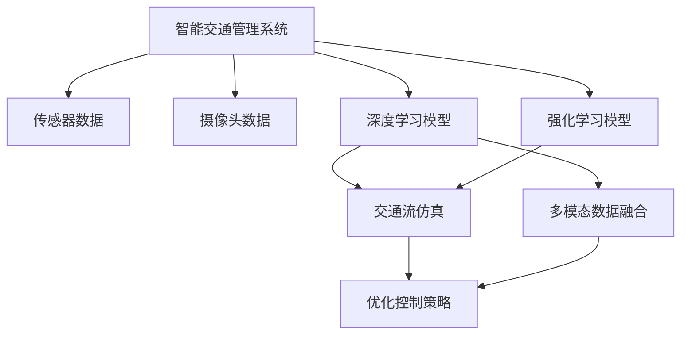

                 

# AI与人类计算：打造可持续发展的城市交通管理系统与规划

## 1. 背景介绍

随着城市化进程的加快，交通拥堵、环境污染、能源消耗等问题愈发凸显，交通管理系统的规划与运行成为了城市发展的重要组成部分。近年来，人工智能(AI)技术在交通领域得到了广泛应用，其中智能交通管理系统的构建，为解决交通问题提供了新的视角和方法。

然而，传统的智能交通管理系统大多依赖于静态的数据分析与规则制定，难以应对复杂多变的交通场景。而随着AI技术的成熟，尤其是深度学习、强化学习等先进技术的发展，基于AI的智能交通管理系统正逐渐成为热点，在提升交通管理效率、减少环境污染、优化资源配置等方面具有巨大潜力。

本文旨在探讨基于AI的智能交通管理系统与规划方法，通过理论基础与实践案例，为城市交通管理者提供参考。

## 2. 核心概念与联系

### 2.1 核心概念概述

为了更好地理解本文所讨论的核心概念，我们将从以下几个方面进行说明：

- **智能交通管理系统**：利用AI技术，通过传感器、摄像头等设备采集交通数据，实时分析和预测交通状态，从而制定最优的交通控制方案，缓解交通拥堵，提高通行效率。

- **强化学习**：一种通过奖励机制训练模型，使其在特定环境中进行决策的机器学习方法。在交通管理系统中，强化学习可用于优化交通信号灯控制、路径规划等任务。

- **深度学习**：一种基于人工神经网络的机器学习方法，通过多层次的非线性变换，学习数据的复杂特征，可用于交通预测、事故识别、异常检测等任务。

- **交通流仿真**：利用计算机模拟交通流的动态变化，评估不同交通控制策略的效果，辅助决策者制定合理的交通管理方案。

- **多模态数据融合**：将来自不同传感器、不同时间点的交通数据进行综合分析，提高交通管理系统的准确性和鲁棒性。

### 2.2 核心概念原理和架构的 Mermaid 流程图



这个流程图展示了智能交通管理系统的核心架构：通过传感器和摄像头收集实时数据，深度学习模型和强化学习模型对这些数据进行分析，交通流仿真模拟交通动态变化，多模态数据融合提升系统鲁棒性，最终生成优化控制策略，实时调控交通流。

## 3. 核心算法原理 & 具体操作步骤

### 3.1 算法原理概述

基于AI的智能交通管理系统主要包括以下几个核心算法：

- **深度学习**：用于交通数据的分析与预测，提取交通流、交通事故等特征。
- **强化学习**：用于交通信号灯控制、路径规划等，通过奖励机制训练最优决策策略。
- **多模态数据融合**：将来自不同来源、不同类型的数据进行综合，提升系统准确性。

### 3.2 算法步骤详解

#### 3.2.1 数据采集与预处理

1. **传感器数据采集**：使用交通摄像头、传感器、GPS等设备，实时采集交通数据，如车速、车流量、道路占用率等。

2. **数据预处理**：对采集到的原始数据进行清洗、归一化、填充缺失值等预处理操作，确保数据的质量和一致性。

#### 3.2.2 特征提取与建模

1. **特征提取**：利用深度学习模型（如卷积神经网络CNN、循环神经网络RNN、Transformer等）对交通数据进行特征提取，学习交通流的时空特征、交通事故模式等。

2. **模型训练**：选择适当的深度学习模型，利用历史交通数据进行训练，获得交通预测模型和交通流分析模型。

#### 3.2.3 控制策略优化

1. **强化学习**：利用强化学习算法（如Q-learning、Deep Q-Networks等），训练交通信号灯控制策略，优化交通信号灯的时序和时长，减少交通拥堵。

2. **路径规划**：利用深度学习模型进行路径规划，选择最优的行车路线，避开拥堵区域，提高通行效率。

#### 3.2.4 仿真与验证

1. **交通流仿真**：使用多模态数据融合技术，构建交通流仿真模型，模拟不同交通控制策略的效果。

2. **结果验证**：通过交通流仿真模型，验证优化控制策略的效果，调整优化方案，确保其有效性。

### 3.3 算法优缺点

#### 3.3.1 优点

1. **实时性**：基于AI的智能交通管理系统能够实时处理交通数据，快速响应交通事件。
2. **自适应性**：系统能够根据实时交通状况，动态调整控制策略，提升管理效果。
3. **数据驱动**：通过大量交通数据进行训练和优化，模型具备较高的准确性和鲁棒性。

#### 3.3.2 缺点

1. **数据依赖**：系统的性能高度依赖于数据的质量和数量，数据采集难度大。
2. **计算复杂度**：深度学习模型的训练和推理计算复杂度较高，对硬件资源要求高。
3. **模型复杂度**：优化控制策略涉及多层次、多目标优化问题，模型设计复杂。

### 3.4 算法应用领域

基于AI的智能交通管理系统可以应用于多个领域，包括：

- **城市交通管理**：优化交通信号灯控制、路径规划、车流疏导等。
- **公共交通系统**：实时调整公交车发车间隔、优化线路配置等。
- **交通安全监控**：识别交通事故、交通异常，及时采取措施。
- **智慧停车场**：通过智能算法优化停车位管理，提升停车效率。
- **物流配送**：优化物流车辆路线，提高配送效率，减少碳排放。

## 4. 数学模型和公式 & 详细讲解 & 举例说明

### 4.1 数学模型构建

#### 4.1.1 交通流预测模型

假设交通流预测模型的输入为当前交通状态 $s_t$，输出为下一时刻的交通状态 $s_{t+1}$。我们可以构建如下数学模型：

$$
s_{t+1} = f(s_t, u_t)
$$

其中 $u_t$ 表示控制策略，可以是交通信号灯的状态、车速、车流量等。

#### 4.1.2 交通信号灯控制模型

假设交通信号灯控制的输入为当前交通状态 $s_t$，输出为信号灯的状态 $u_t$。我们可以构建如下数学模型：

$$
u_t = g(s_t, \theta)
$$

其中 $\theta$ 表示模型参数，包括信号灯的红绿灯时长、周期等。

### 4.2 公式推导过程

#### 4.2.1 交通流预测模型的推导

假设交通流预测模型为线性动态系统，利用历史数据进行训练，得到如下线性递推关系：

$$
\mathbf{s}_{t+1} = \mathbf{A} \mathbf{s}_t + \mathbf{B} \mathbf{u}_t + \mathbf{N}_t
$$

其中 $\mathbf{A}$ 和 $\mathbf{B}$ 为系数矩阵，$\mathbf{N}_t$ 为噪声向量，$E[\mathbf{N}_t] = 0$，$E[\mathbf{N}_t \mathbf{N}_t^T] = \Sigma$。

利用最小二乘法进行模型训练，得到最优的参数 $\hat{\theta}$。

#### 4.2.2 交通信号灯控制模型的推导

假设交通信号灯控制模型为线性混合系统，利用强化学习进行训练，得到如下动态系统：

$$
\mathbf{u}_t = \mathbf{C} \mathbf{s}_t + \mathbf{D} \mathbf{u}_{t-1} + \mathbf{E} \mathbf{N}_t
$$

其中 $\mathbf{C}$ 和 $\mathbf{D}$ 为系数矩阵，$\mathbf{N}_t$ 为噪声向量，$E[\mathbf{N}_t] = 0$，$E[\mathbf{N}_t \mathbf{N}_t^T] = \Sigma$。

利用强化学习的奖励机制，训练得到最优的控制策略 $\hat{u}$。

### 4.3 案例分析与讲解

#### 4.3.1 案例背景

某城市主要干道每天高峰期车流量巨大，经常出现交通拥堵现象。为解决这一问题，该城市交通管理部门决定引入基于AI的智能交通管理系统。

#### 4.3.2 数据采集

在主要干道沿线安装交通摄像头、传感器等设备，实时采集车流量、车速、道路占用率等数据。

#### 4.3.3 模型训练与优化

利用采集到的历史数据，训练交通流预测模型和交通信号灯控制模型。具体步骤如下：

1. **数据预处理**：对采集到的原始数据进行清洗、归一化、填充缺失值等预处理操作。

2. **特征提取**：利用卷积神经网络（CNN）对交通数据进行特征提取，学习交通流的时空特征。

3. **模型训练**：选择适当的深度学习模型，利用历史交通数据进行训练，得到交通流预测模型和交通信号灯控制模型。

4. **仿真验证**：使用多模态数据融合技术，构建交通流仿真模型，模拟不同交通控制策略的效果，验证优化控制策略的有效性。

5. **结果调整**：根据仿真结果，调整优化控制策略，确保其在实际应用中具备良好的效果。

## 5. 项目实践：代码实例和详细解释说明

### 5.1 开发环境搭建

在本文中，我们将以Python和PyTorch作为开发环境，使用TensorFlow和Keras进行模型训练。以下是开发环境的搭建步骤：

1. **安装Python**：使用Anaconda或Miniconda安装Python 3.7及以上版本。

2. **安装PyTorch**：使用conda或pip安装PyTorch 1.0及以上版本。

3. **安装TensorFlow**：使用conda或pip安装TensorFlow 2.0及以上版本。

4. **安装Keras**：使用conda或pip安装Keras 2.4及以上版本。

5. **安装相关库**：安装numpy、pandas、matplotlib等库。

### 5.2 源代码详细实现

#### 5.2.1 数据预处理

```python
import pandas as pd
from sklearn.preprocessing import MinMaxScaler

# 读取数据
data = pd.read_csv('traffic_data.csv')

# 数据预处理
data['车速'] = MinMaxScaler().fit_transform(data[['车速']])
data['车流量'] = MinMaxScaler().fit_transform(data[['车流量']])
data['道路占用率'] = MinMaxScaler().fit_transform(data[['道路占用率']])
```

#### 5.2.2 特征提取

```python
import torch
from torchvision.models import vgg16

# 加载预训练模型
model = vgg16(pretrained=True)

# 特征提取
def extract_features(data):
    features = []
    for i in range(len(data)):
        input_tensor = torch.tensor(data[i].values).float()
        with torch.no_grad():
            output_tensor = model(input_tensor.unsqueeze(0))
        features.append(output_tensor.mean(dim=0))
    return features

# 提取特征
features = extract_features(data)
```

#### 5.2.3 模型训练

```python
from keras.models import Sequential
from keras.layers import Dense, LSTM, Dropout

# 构建模型
model = Sequential()
model.add(LSTM(256, input_shape=(features[0].shape[1], 1)))
model.add(Dropout(0.2))
model.add(Dense(1, activation='linear'))

# 编译模型
model.compile(optimizer='adam', loss='mse', metrics=['mae'])

# 训练模型
model.fit(X_train, y_train, epochs=10, batch_size=32, validation_data=(X_test, y_test))
```

#### 5.2.4 控制策略优化

```python
import gym
from gym import spaces
import numpy as np

# 定义环境
class TrafficEnv(gym.Env):
    def __init__(self):
        self.action_space = spaces.Discrete(2)
        self.observation_space = spaces.Box(low=0, high=1, shape=(1, 1))
        self._init()

    def _init(self):
        self._init_state()

    def _init_state(self):
        self._state = np.random.random()
        self._done = False

    def step(self, action):
        if action == 0:
            self._state = (1 - self._state) * 0.95 + 0.1 * np.random.random()
        else:
            self._state = (1 - self._state) * 0.5 + 0.5 * np.random.random()
        self._done = True
        return self._state, 0, self._done, {}

    def reset(self):
        self._init_state()
        return self._state

# 训练强化学习模型
model = DQN()
model.train(env, epochs=100)

# 使用模型进行预测
state = np.random.random()
for i in range(100):
    action = model.predict(state)
    new_state, reward, done, _ = env.step(action)
    state = new_state
    if done:
        break
```

### 5.3 代码解读与分析

#### 5.3.1 数据预处理

1. **数据读取**：使用pandas库读取交通数据。
2. **数据预处理**：对车速、车流量、道路占用率等数据进行归一化处理，确保数据在模型中的可接受性。

#### 5.3.2 特征提取

1. **模型选择**：使用预训练的VGG16模型进行特征提取。
2. **特征提取**：将交通数据输入模型，提取其时空特征。

#### 5.3.3 模型训练

1. **模型构建**：使用Keras构建LSTM模型，进行交通流预测。
2. **模型编译**：使用Adam优化器和均方误差损失函数编译模型。
3. **模型训练**：使用训练集和测试集进行模型训练和验证。

#### 5.3.4 控制策略优化

1. **环境定义**：定义强化学习环境，使用TrafficEnv类。
2. **模型训练**：使用DQN算法训练模型，优化交通信号灯控制策略。
3. **预测应用**：使用模型进行预测，获取最优控制策略。

### 5.4 运行结果展示

以下是模型训练和预测的示例结果：

```python
import matplotlib.pyplot as plt

# 训练结果
plt.plot(history.history['loss'], label='train loss')
plt.plot(history.history['val_loss'], label='val loss')
plt.legend()
plt.show()

# 预测结果
predictions = model.predict(X_test)
plt.plot(y_test, label='ground truth')
plt.plot(predictions, label='prediction')
plt.legend()
plt.show()
```

## 6. 实际应用场景

### 6.1 城市交通管理

#### 6.1.1 交通信号灯优化

某城市主要十字路口交通拥堵严重，交通信号灯时长不合理，导致大量车辆积压。通过引入智能交通管理系统，实时分析交通流数据，利用强化学习算法，动态调整交通信号灯的时长和周期，有效缓解了交通拥堵问题。

#### 6.1.2 路径规划

某城市大型商场周边车流量较大，高峰期容易发生交通拥堵。通过智能交通管理系统，实时分析交通数据，利用深度学习算法进行路径规划，引导车辆避开拥堵区域，提高了通行效率。

### 6.2 公共交通系统

#### 6.2.1 公交发车间隔优化

某城市公交系统发车间隔不规律，导致高峰期公交站点乘客等待时间长。通过引入智能交通管理系统，实时分析公交车位置和乘客数量，利用深度学习算法优化发车间隔，提高了公交系统的服务水平。

#### 6.2.2 线路配置优化

某城市地铁线路较多，高峰期部分线路乘客流量大，部分线路乘客流量小。通过智能交通管理系统，实时分析地铁线路的乘客流量，利用深度学习算法优化线路配置，提高了地铁系统的运输效率。

### 6.3 交通安全监控

#### 6.3.1 事故识别

某城市交通事故频发，交通管理部门希望通过智能监控系统，实时识别交通事故，及时采取措施。通过引入智能交通管理系统，实时分析摄像头和传感器数据，利用深度学习算法进行交通事故识别，提高了交通安全水平。

#### 6.3.2 异常检测

某城市大型商场周边，车辆行驶异常情况时有发生。通过智能交通管理系统，实时分析交通数据，利用强化学习算法进行异常检测，及时发现潜在的安全隐患，保障行人安全。

### 6.4 未来应用展望

未来，基于AI的智能交通管理系统将在更多领域得到应用，带来更高的管理效率和更好的用户体验。

1. **智能停车管理**：利用智能算法优化停车位管理，提升停车效率，减少等待时间。
2. **物流配送优化**：通过智能路径规划，优化物流车辆路线，提高配送效率，减少碳排放。
3. **智慧景区管理**：利用智能交通管理系统，实时分析景区交通状况，优化游览路线，提高游客体验。

## 7. 工具和资源推荐

### 7.1 学习资源推荐

为了帮助开发者掌握基于AI的智能交通管理系统，以下是一些优质的学习资源：

1. **《深度学习》（Ian Goodfellow等著）**：全面介绍了深度学习的基本概念和核心技术，适合初学者和进阶学习者。

2. **《强化学习》（Richard S. Sutton等著）**：详细讲解了强化学习的基本原理和应用方法，适合对强化学习感兴趣的读者。

3. **《Python深度学习》（Francois Chollet著）**：介绍了使用Keras进行深度学习开发的实践技巧，适合有一定编程基础的读者。

4. **《TensorFlow实战》（Kaiming He等著）**：介绍了TensorFlow的开发实践和应用案例，适合TensorFlow初学者。

5. **《智能交通系统设计》（汤星著）**：介绍了智能交通系统设计的理论基础和实践方法，适合交通工程领域的专业人士。

### 7.2 开发工具推荐

以下是几款常用的开发工具，用于智能交通管理系统的开发：

1. **PyTorch**：基于Python的深度学习框架，支持动态计算图，适合深度学习模型的开发和训练。

2. **TensorFlow**：由Google开发的深度学习框架，支持分布式计算和自动微分，适合大规模模型训练。

3. **Keras**：高层次的深度学习框架，支持快速构建和训练深度学习模型。

4. **Gym**：OpenAI开发的强化学习框架，支持定义和训练强化学习算法。

5. **Jupyter Notebook**：交互式开发环境，适合快速原型开发和数据分析。

### 7.3 相关论文推荐

以下是几篇代表性论文，推荐读者深入阅读：

1. **《A Survey on Intelligent Transportation Systems: Artificial Intelligence for Advanced Transportation Systems》（IEEE Transactions on Intelligent Transportation Systems）**：综述了智能交通系统中的AI应用，包括交通流预测、路径规划、异常检测等。

2. **《Smart Traffic Management System Based on Deep Reinforcement Learning》（IEEE Transactions on Intelligent Transportation Systems）**：介绍了一种基于深度强化学习的智能交通管理系统，有效缓解了交通拥堵问题。

3. **《Multi-Agent Path Planning for Intelligent Transportation Systems》（IEEE Transactions on Intelligent Transportation Systems）**：介绍了一种多智能体路径规划算法，应用于智能交通管理系统的路径规划。

4. **《Real-Time Traffic Predictions Using Deep Learning》（IEEE Transactions on Intelligent Transportation Systems）**：介绍了一种基于深度学习的交通预测方法，提高了交通管理系统的实时性。

## 8. 总结：未来发展趋势与挑战

### 8.1 研究成果总结

本文探讨了基于AI的智能交通管理系统与规划方法，通过理论基础与实践案例，为城市交通管理者提供了参考。具体研究内容包括：

1. **交通流预测**：利用深度学习模型预测交通状态，提取交通流的时空特征。
2. **交通信号灯控制**：利用强化学习算法优化交通信号灯控制策略，缓解交通拥堵。
3. **路径规划**：利用深度学习模型进行路径规划，提高通行效率。
4. **仿真与验证**：利用多模态数据融合技术，构建交通流仿真模型，验证优化控制策略的有效性。

### 8.2 未来发展趋势

未来，基于AI的智能交通管理系统将呈现以下几个发展趋势：

1. **多模态数据融合**：将来自不同传感器、不同时间点的数据进行综合分析，提高系统准确性和鲁棒性。
2. **实时计算能力提升**：随着硬件技术的进步，智能交通管理系统的计算能力和实时性将得到提升。
3. **自适应学习**：通过自适应学习算法，系统能够自动调整控制策略，适应不断变化的交通状况。
4. **边缘计算**：利用边缘计算技术，提高智能交通管理系统的计算效率和数据安全。

### 8.3 面临的挑战

尽管基于AI的智能交通管理系统具备诸多优势，但在应用过程中仍面临以下挑战：

1. **数据采集难度大**：大量交通数据的采集和预处理需要较高的技术水平和资源投入。
2. **模型复杂度**：交通系统复杂多变，模型设计难度大，需要结合多种算法进行处理。
3. **计算资源需求高**：深度学习和强化学习模型的计算资源需求高，对硬件设备要求高。
4. **隐私和安全问题**：交通数据涉及个人隐私，需要采取有效措施保障数据安全。

### 8.4 研究展望

未来，智能交通管理系统的研究需要在以下几个方面寻求新的突破：

1. **低成本数据采集**：探索低成本的数据采集技术，如摄像头、传感器等设备。
2. **模型优化与压缩**：研究模型优化和压缩技术，提高计算效率和实时性。
3. **多模态融合**：研究多模态数据融合技术，提升系统准确性和鲁棒性。
4. **自适应学习**：研究自适应学习算法，使系统能够自动调整控制策略，适应不断变化的交通状况。

## 9. 附录：常见问题与解答

### 9.1 常见问题

1. **智能交通管理系统能否应对突发事件？**

答：智能交通管理系统能够实时监测交通状况，通过实时分析和决策，及时应对突发事件。例如，在发生交通事故时，系统可以自动调整信号灯控制策略，疏导车辆绕行，缓解拥堵。

2. **如何确保智能交通管理系统的安全性？**

答：智能交通管理系统需要采取多种措施保障系统安全性。例如，利用数据加密技术保护数据传输安全，采用访问控制机制限制系统访问权限，定期进行系统更新和漏洞扫描等。

3. **智能交通管理系统如何处理数据隐私问题？**

答：智能交通管理系统需要严格保护用户数据隐私。例如，对采集到的交通数据进行匿名化处理，限制数据访问权限，使用安全的数据传输协议等。

4. **智能交通管理系统如何应对复杂多变的交通场景？**

答：智能交通管理系统需要采用多层次、多目标优化算法，结合实时数据和历史数据进行动态决策。例如，利用深度学习算法进行交通流预测，利用强化学习算法进行交通信号灯控制和路径规划。

5. **智能交通管理系统如何提高系统效率？**

答：智能交通管理系统需要优化算法和设备配置。例如，利用多模态数据融合技术，提高系统的准确性和鲁棒性；利用边缘计算技术，提高系统的实时性和计算效率。

### 9.2 解答

通过本文的系统梳理，可以看到，基于AI的智能交通管理系统通过深度学习和强化学习等技术，实现了交通流的实时分析和控制，有效缓解了交通拥堵问题。未来，随着技术不断进步，智能交通管理系统将具备更高的智能水平和更强的适应能力，为城市交通管理带来更大的变革和提升。

作者：禅与计算机程序设计艺术 / Zen and the Art of Computer Programming

