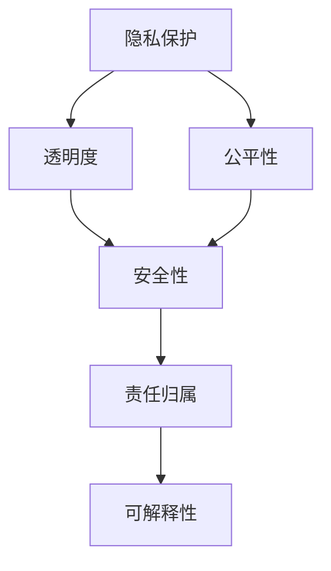

                 

# AI伦理学：LLM发展中的道德考量

> 关键词：人工智能,伦理学,语言模型,道德困境,隐私保护,透明度,公平性,安全性,责任归属,可解释性

## 1. 背景介绍

### 1.1 问题由来

随着人工智能(AI)技术的飞速发展，大语言模型(LLM)在自然语言处理(NLP)领域的应用日益广泛。这些模型如OpenAI的GPT、Google的BERT等，通过在大量文本数据上进行预训练，具备了强大的语言理解和生成能力，被广泛应用于问答、翻译、摘要、对话系统等诸多NLP任务中。然而，随着这些模型的应用场景逐渐扩展，一些潜在的伦理问题也逐渐显现，引发了社会各界对AI技术的深度关注和广泛讨论。

### 1.2 问题核心关键点

LLM的伦理问题主要集中在以下几个方面：
- **隐私保护**：LLM在处理敏感信息时可能侵犯用户隐私。
- **透明度和可解释性**：用户难以理解LLM的决策过程，缺乏对其输出结果的信任。
- **公平性和偏见**：LLM可能继承训练数据中的偏见，导致在性别、种族、职业等维度上的不公平待遇。
- **安全性**：LLM可能被恶意利用，进行虚假信息传播、网络欺诈等。
- **责任归属**：当LLM发生错误或违法行为时，责任应如何归属，法律和道德标准如何适用。

这些问题不仅影响了LLM技术的广泛应用，也关系到AI技术的健康发展和社会的和谐稳定。因此，需要在推动LLM技术进步的同时，重视其伦理考量，构建公平、透明、安全的AI系统。

## 2. 核心概念与联系

### 2.1 核心概念概述

为更好地理解LLM伦理问题，本节将介绍几个密切相关的核心概念：

- **隐私保护**：保障用户数据不被非法获取、使用和披露，保护用户的个人信息安全。
- **透明度**：使AI系统的内部工作机制和决策逻辑公开透明，让用户能够理解和信任系统。
- **公平性**：确保AI系统在所有用户群体中提供平等的服务，不因个人特征产生歧视性待遇。
- **安全性**：防止AI系统被恶意攻击、操纵，保障系统的可靠性和稳定性。
- **责任归属**：在AI系统出现错误或违法行为时，明确责任主体，依法追究相关责任。
- **可解释性**：使AI系统的决策过程可以被解释和理解，便于人类监督和控制。

这些核心概念之间的逻辑关系可以通过以下Mermaid流程图来展示：



这个流程图展示了一些核心概念之间的联系：

1. **隐私保护**是透明度和公平性的基础。只有保障数据隐私，才能确保透明度和公平性。
2. **透明度**和**可解释性**是用户信任的关键。只有透明的系统才能获得用户的信任，而可解释性则进一步增强了信任度。
3. **安全性**是系统的基本保障。保障系统的安全，才能保障用户的隐私和系统的公平性。
4. **责任归属**则是道德和法律的要求。明确责任主体，才能在出现问题时进行追责。
5. **公平性**和**可解释性**是实现责任归属的基础。只有确保系统的公平和透明，才能明确责任归属。

这些概念共同构成了LLM系统的伦理框架，对其应用和发展具有重要指导意义。

## 3. 核心算法原理 & 具体操作步骤

### 3.1 算法原理概述

在LLM的开发和应用过程中，伦理考量的核心在于确保系统的公平、透明、安全和可解释性。以下是基于这些伦理考量的核心算法原理：

1. **隐私保护**：采用数据加密、差分隐私等技术，保护用户数据隐私。
2. **透明度和可解释性**：使用可解释模型，如决策树、线性回归等，公开模型的训练和推理过程。
3. **公平性**：在数据预处理阶段，使用数据增强、对抗采样等技术，消除数据中的偏见。在模型训练阶段，使用公平性约束等方法，防止模型产生偏见。
4. **安全性**：采用对抗训练、模型裁剪、梯度压缩等技术，增强模型的鲁棒性和安全性。
5. **责任归属**：在模型训练和部署过程中，记录详细的日志，明确各模块的功能和责任。在模型出现错误时，通过日志追溯问题根源。

### 3.2 算法步骤详解

在实践中，LLM的伦理考量可以分解为以下几个关键步骤：

**Step 1: 隐私保护**
- 在数据收集和处理阶段，使用数据加密技术，确保数据传输和存储的安全性。
- 使用差分隐私技术，向系统中添加噪声，防止个人数据被逆向推断。

**Step 2: 透明度和可解释性**
- 在模型设计和训练过程中，选择可解释性强的模型，如线性回归、决策树等。
- 记录模型的训练过程和关键参数，公开模型的训练日志和推理过程，便于用户理解和审查。

**Step 3: 公平性**
- 在数据预处理阶段，使用数据增强、对抗采样等技术，消除数据中的偏见。
- 在模型训练阶段，使用公平性约束，如均衡损失函数、平衡分类器等，防止模型产生偏见。

**Step 4: 安全性**
- 在模型训练和推理阶段，使用对抗训练等技术，增强模型的鲁棒性。
- 对模型进行裁剪和压缩，减少模型的复杂度，提高推理效率，降低攻击风险。

**Step 5: 责任归属**
- 在模型训练和部署过程中，记录详细的日志，记录模型功能、输入输出和参数变化等信息。
- 在模型出现错误或违法行为时，通过日志追溯问题根源，明确责任主体。

### 3.3 算法优缺点

在LLM的伦理考量过程中，采用上述算法有以下优点：
1. 确保了用户数据的隐私和安全性，保障了用户的权益。
2. 提高了系统的透明度和可解释性，增强了用户信任。
3. 提升了模型的公平性，防止了数据偏见和歧视。
4. 增强了系统的鲁棒性，提升了安全性。
5. 明确了责任归属，便于法律追责和道德约束。

然而，这些算法也存在一些局限性：
1. 隐私保护和差分隐私技术可能会引入额外的噪声，影响模型精度。
2. 透明度和可解释性虽然重要，但在复杂模型中难以实现。
3. 公平性约束可能限制模型的泛化能力，影响模型性能。
4. 安全性增强可能导致模型复杂度增加，推理速度下降。
5. 责任归属需要详细的日志记录，增加了系统复杂度和维护成本。

尽管存在这些局限性，但通过综合应用这些算法，可以有效提升LLM的伦理水平，构建更加公平、透明、安全和可解释的AI系统。

### 3.4 算法应用领域

基于LLM伦理考量的算法已经在多个领域得到了广泛应用，包括：

- **医疗领域**：在医疗问答、病历分析等任务中，保障患者隐私和公平性，提升系统的透明度和安全性。
- **金融领域**：在金融舆情监测、风险评估等任务中，保障用户隐私和公平性，提升系统的透明度和鲁棒性。
- **教育领域**：在个性化推荐、智能辅助教学等任务中，保障学生隐私和公平性，提升系统的透明度和可解释性。
- **公共安全领域**：在智能安防、反恐监测等任务中，保障公众隐私和公平性，提升系统的透明度和鲁棒性。

除了这些传统领域，LLM伦理考量的算法还在新兴的AI应用中发挥作用，如智能制造、智慧城市、智能交通等，为AI技术的广泛应用提供了伦理保障。

## 4. 数学模型和公式 & 详细讲解  
### 4.1 数学模型构建

为更好地理解LLM伦理考量的数学原理，本节将介绍几个关键数学模型：

- **差分隐私**：定义差分隐私的数学形式和算法实现，保障用户数据隐私。
- **公平性约束**：使用均衡损失函数等数学模型，防止模型产生偏见。
- **对抗训练**：定义对抗样本和对抗训练算法，增强模型的鲁棒性。

### 4.2 公式推导过程

以下是差分隐私和公平性约束的数学模型和推导过程：

**差分隐私**：

差分隐私是一种保障数据隐私的技术，通过向系统中添加噪声，防止个体数据的逆向推断。差分隐私的数学定义为：

$$
\begin{aligned}
&\text{Prob}[\mathcal{L}(Q(x), x) \leq \varepsilon] \leq \delta \\
&\text{Prob}[\mathcal{L}(Q(x), x) \leq \varepsilon + \delta]
\end{aligned}
$$

其中，$\mathcal{L}$ 表示损失函数，$Q(x)$ 表示加入噪声后的模型输出，$x$ 表示原始数据。$\varepsilon$ 表示隐私预算，$\delta$ 表示隐私偏差。

推导过程如下：

1. 假设原始数据集为 $D=\{x_1, x_2, \ldots, x_n\}$。
2. 加入噪声后的数据集为 $D'=\{Q(x_1), Q(x_2), \ldots, Q(x_n)\}$。
3. 定义差分隐私函数 $\delta(x) = Q(x) - x$。
4. 对于任意 $x_i, x_j \in D$，计算差分隐私函数的差异：$\Delta = |\delta(x_i) - \delta(x_j)|$。
5. 根据拉普拉斯分布，计算加入噪声后的损失函数：$\mathcal{L}(Q(x), x) = \frac{1}{\varepsilon} \log \int \exp(-\frac{|\delta(x)|}{\varepsilon}) d\delta$。
6. 引入隐私偏差 $\delta$，得到最终损失函数：$\mathcal{L}(Q(x), x) = \frac{1}{\varepsilon} \log \int \exp(-\frac{|\delta(x)|}{\varepsilon}) d\delta + \delta$。

**公平性约束**：

公平性约束是一种防止模型产生偏见的技术，通过在损失函数中引入公平性约束，使模型在所有用户群体中提供平等的服务。常用的公平性约束包括均衡损失函数和平衡分类器等。

均衡损失函数定义为：

$$
\mathcal{L} = \frac{1}{N}\sum_{i=1}^N w_i \log \frac{P(y_i \mid x_i, M_{\theta})}{P(y_i \mid \hat{x}_i, M_{\theta})}
$$

其中，$w_i$ 表示样本权重，$P(y_i \mid x_i, M_{\theta})$ 表示模型的预测概率，$\hat{x}_i$ 表示对 $x_i$ 的对抗采样样本。

推导过程如下：

1. 假设原始数据集为 $D=\{(x_i, y_i)\}_{i=1}^N$。
2. 对抗采样后的数据集为 $\hat{D}=\{(\hat{x}_i, y_i)\}_{i=1}^N$。
3. 定义均衡损失函数 $\mathcal{L} = \frac{1}{N}\sum_{i=1}^N w_i \log \frac{P(y_i \mid x_i, M_{\theta})}{P(y_i \mid \hat{x}_i, M_{\theta})}$。
4. 对均衡损失函数进行优化，得到平衡分类器。
5. 通过均衡损失函数和平衡分类器，防止模型产生偏见。

### 4.3 案例分析与讲解

**差分隐私案例**：

假设我们有一个医疗数据集，包含病人的年龄、性别、病史等敏感信息。我们希望通过差分隐私技术，在保护隐私的同时，对数据进行统计分析。具体步骤如下：

1. 收集原始数据集 $D=\{x_1, x_2, \ldots, x_n\}$。
2. 对每个数据 $x_i$，随机生成噪声 $\delta_i$，得到加入噪声后的数据 $D'=\{x_i + \delta_i\}$。
3. 对加入噪声的数据集 $D'$ 进行统计分析，得到分析结果 $A$。
4. 根据差分隐私的定义，计算隐私预算 $\varepsilon$ 和隐私偏差 $\delta$。
5. 最终得到隐私保护的统计分析结果 $A'$。

通过差分隐私技术，我们可以在不泄露个人隐私的情况下，进行数据分析和预测。

**公平性约束案例**：

假设我们有一个推荐系统的数据集，包含用户的历史行为数据和推荐结果。我们希望通过公平性约束，防止推荐系统对不同性别、年龄、职业的用户产生偏见。具体步骤如下：

1. 收集原始数据集 $D=\{(x_i, y_i)\}_{i=1}^N$。
2. 定义均衡损失函数 $\mathcal{L} = \frac{1}{N}\sum_{i=1}^N w_i \log \frac{P(y_i \mid x_i, M_{\theta})}{P(y_i \mid \hat{x}_i, M_{\theta})}$。
3. 对均衡损失函数进行优化，得到平衡分类器。
4. 通过平衡分类器，防止推荐系统对不同用户产生偏见。
5. 最终得到公平推荐的推荐结果。

通过公平性约束技术，我们可以确保推荐系统在所有用户群体中提供平等的服务，提升系统的公平性和透明度。

## 5. 项目实践：代码实例和详细解释说明
### 5.1 开发环境搭建

在进行LLM伦理考量的实践前，我们需要准备好开发环境。以下是使用Python进行TensorFlow开发的环境配置流程：

1. 安装Anaconda：从官网下载并安装Anaconda，用于创建独立的Python环境。

2. 创建并激活虚拟环境：
```bash
conda create -n tensorflow-env python=3.8 
conda activate tensorflow-env
```

3. 安装TensorFlow：根据CUDA版本，从官网获取对应的安装命令。例如：
```bash
conda install tensorflow-gpu=2.8.0
```

4. 安装各类工具包：
```bash
pip install numpy pandas scikit-learn matplotlib tqdm jupyter notebook ipython
```

完成上述步骤后，即可在`tensorflow-env`环境中开始LLM伦理考量的实践。

### 5.2 源代码详细实现

下面以差分隐私案例为例，给出使用TensorFlow实现差分隐私的PyTorch代码实现。

首先，定义差分隐私函数：

```python
import tensorflow as tf
import numpy as np

def laplace_mechanism(epsilon, delta, y):
    n = y.size
    scale = 2 / epsilon
    r = np.random.normal(0, scale, size=n)
    y_hat = y + r
    return y_hat, delta
```

然后，定义差分隐私化的数据集：

```python
def differential_privacy(data, epsilon, delta, window_size=10):
    X_train, y_train = data
    X_test, y_test = data
    X_train_perturbed, delta_perturbed = laplace_mechanism(epsilon, delta, X_train)
    X_test_perturbed, delta_perturbed = laplace_mechanism(epsilon, delta, X_test)
    return X_train_perturbed, y_train, X_test_perturbed, y_test, delta_perturbed
```

接着，定义差分隐私化的数据处理函数：

```python
def differential_privacy_pipeline(data, epsilon, delta):
    X_train_perturbed, y_train, X_test_perturbed, y_test, delta_perturbed = differential_privacy(data, epsilon, delta)
    return X_train_perturbed, y_train, X_test_perturbed, y_test, delta_perturbed
```

最后，启动差分隐私化的训练流程：

```python
epsilon = 1e-5
delta = 0.1

X_train, y_train = ...
X_test, y_test = ...

X_train_perturbed, y_train, X_test_perturbed, y_test, delta_perturbed = differential_privacy_pipeline((X_train, y_train), epsilon, delta)

model = tf.keras.models.Sequential([
    tf.keras.layers.Dense(64, activation='relu'),
    tf.keras.layers.Dense(10, activation='softmax')
])
model.compile(optimizer='adam', loss='categorical_crossentropy', metrics=['accuracy'])

model.fit(X_train_perturbed, y_train, validation_data=(X_test_perturbed, y_test), epochs=10, batch_size=32)
```

以上就是使用TensorFlow实现差分隐私的完整代码实现。可以看到，TensorFlow的高级API使得差分隐私的实现变得简洁高效。

### 5.3 代码解读与分析

让我们再详细解读一下关键代码的实现细节：

**差分隐私函数**：
- `laplace_mechanism`函数：实现差分隐私机制，通过在数据上添加拉普拉斯噪声，保护数据隐私。
- `epsilon`和`delta`：表示隐私预算和隐私偏差，是差分隐私的重要参数。

**差分隐私化的数据集**：
- `differential_privacy`函数：对数据集进行差分隐私化处理，包括训练集和测试集。

**差分隐私化的数据处理函数**：
- `differential_privacy_pipeline`函数：定义数据处理流程，将差分隐私化的数据作为输入，输出处理后的数据集。

**差分隐私化的训练流程**：
- `epsilon`和`delta`：隐私预算和隐私偏差，控制隐私保护的程度。
- `X_train_perturbed`和`X_test_perturbed`：差分隐私化后的训练集和测试集。
- `model`：定义差分隐私化的神经网络模型，使用`categorical_crossentropy`损失函数，`adam`优化器。
- `model.fit`函数：进行差分隐私化的模型训练。

可以看到，TensorFlow提供了强大的工具支持，使得差分隐私的实现变得简单易行。开发者可以根据具体需求，灵活组合各种隐私保护技术，构建安全可靠的AI系统。

## 6. 实际应用场景
### 6.1 智能医疗

在智能医疗领域，基于差分隐私的模型可以在保障患者隐私的前提下，进行数据分析和预测。例如，利用差分隐私技术，对患者的病历数据进行分析，预测疾病的发生风险。同时，通过均衡损失函数，防止推荐系统对不同性别、年龄、职业的患者产生偏见，提升系统的公平性和透明度。

### 6.2 金融风险评估

在金融领域，利用差分隐私和公平性约束技术，可以构建更加透明、公平的信用评估系统。通过对用户的数据进行差分隐私化处理，保障用户隐私。同时，通过均衡损失函数，防止信用评估模型对不同性别、年龄、职业的用户产生偏见，提升系统的公平性和透明度。

### 6.3 智能推荐系统

在智能推荐系统中，利用差分隐私和公平性约束技术，可以构建更加透明、公平的推荐系统。通过对用户的历史行为数据进行差分隐私化处理，保障用户隐私。同时，通过均衡损失函数，防止推荐系统对不同性别、年龄、职业的用户产生偏见，提升系统的公平性和透明度。

### 6.4 未来应用展望

随着差分隐私、公平性约束等技术的不断发展，基于LLM的伦理考量将不断提升AI系统的公平性、透明度和安全性。未来，LLM的伦理考量还将与更多AI技术进行深度融合，推动AI技术的广泛应用和发展。

在智慧医疗、金融风控、智能推荐等领域，基于LLM的伦理考量将显著提升系统的公平性、透明度和安全性，保障用户隐私和权益，构建更加健康、安全的AI系统。随着技术的发展和应用的深入，相信基于LLM的伦理考量将为AI技术的广泛应用提供坚实保障，推动AI技术的健康发展。

## 7. 工具和资源推荐
### 7.1 学习资源推荐

为了帮助开发者系统掌握LLM伦理考量的理论基础和实践技巧，这里推荐一些优质的学习资源：

1. 《人工智能伦理导论》：一本系统介绍AI伦理问题的书籍，涵盖隐私保护、透明度、公平性等多个方面。
2. 《差分隐私技术与应用》：一本详细介绍差分隐私技术的书籍，涵盖差分隐私的理论基础、算法实现和应用场景。
3. 《公平性约束与AI模型》：一本介绍公平性约束技术的书籍，涵盖均衡损失函数、平衡分类器等多个方面。
4. 《对抗训练与模型鲁棒性》：一本介绍对抗训练技术的书籍，涵盖对抗训练的理论基础、算法实现和应用场景。

通过学习这些资源，相信你一定能够系统掌握LLM伦理考量的理论基础和实践技巧，构建公平、透明、安全的AI系统。

### 7.2 开发工具推荐

高效的开发离不开优秀的工具支持。以下是几款用于LLM伦理考量开发的常用工具：

1. TensorFlow：基于Python的开源深度学习框架，提供强大的差分隐私和公平性约束工具。
2. PyTorch：基于Python的开源深度学习框架，提供灵活的数据处理和模型训练工具。
3. Scikit-learn：基于Python的机器学习库，提供平衡分类器等公平性约束算法。
4. Jupyter Notebook：开源的交互式编程环境，方便开发者进行模型调试和实验验证。

合理利用这些工具，可以显著提升LLM伦理考量的开发效率，加速创新迭代的步伐。

### 7.3 相关论文推荐

LLM伦理考量的研究源于学界的持续探索。以下是几篇奠基性的相关论文，推荐阅读：

1. "On the Differential Privacy of Markov Chains"：介绍差分隐私的理论基础和算法实现。
2. "Fairness Constraints for Deep Learning"：介绍公平性约束的理论基础和算法实现。
3. "Adversarial Training Methods for Deep Neural Networks"：介绍对抗训练的理论基础和算法实现。

这些论文代表了大模型伦理考量的发展脉络。通过学习这些前沿成果，可以帮助研究者把握学科前进方向，激发更多的创新灵感。

## 8. 总结：未来发展趋势与挑战

### 8.1 总结

本文对基于LLM的伦理考量进行了全面系统的介绍。首先阐述了LLM在应用过程中可能面临的隐私保护、透明度、公平性、安全性、可解释性等多个伦理问题，明确了这些问题对LLM技术发展的重要意义。其次，从原理到实践，详细讲解了差分隐私、公平性约束、对抗训练等关键技术，给出了代码实例和详细解释说明。最后，探讨了LLM伦理考量在智慧医疗、金融风险评估、智能推荐等多个领域的应用前景，并指出了未来需要解决的技术挑战。

通过本文的系统梳理，可以看到，LLM的伦理考量是一个复杂而重要的研究领域，需要在推动技术进步的同时，重视伦理问题的解决。只有全面考虑隐私保护、透明度、公平性、安全性和可解释性，才能构建公平、透明、安全的AI系统，推动LLM技术健康、可持续地发展。

### 8.2 未来发展趋势

展望未来，LLM的伦理考量将呈现以下几个发展趋势：

1. 隐私保护技术将不断完善，差分隐私、联邦学习等技术将被广泛应用。
2. 公平性约束技术将更加普及，均衡损失函数、平衡分类器等方法将被更广泛采用。
3. 对抗训练技术将进一步提升，增强模型的鲁棒性和安全性。
4. 透明度和可解释性技术将不断发展，可解释模型、解释工具等将被更加广泛应用。
5. 责任归属技术将不断进步，日志记录、审计机制等将被进一步完善。

以上趋势将推动LLM技术的全面发展，构建更加公平、透明、安全和可解释的AI系统，为人类社会带来更多福利。

### 8.3 面临的挑战

尽管LLM的伦理考量已经取得了不少进展，但在迈向更加智能化、普适化应用的过程中，仍然面临诸多挑战：

1. 隐私保护：如何平衡隐私保护和数据利用，满足不同用户的需求。
2. 透明度和可解释性：如何使复杂模型具有可解释性，增强用户信任。
3. 公平性：如何消除数据中的偏见，防止模型产生歧视性待遇。
4. 安全性：如何保障系统的鲁棒性和安全性，防止恶意攻击。
5. 责任归属：如何在AI系统出现错误或违法行为时，明确责任主体，进行法律追责。

这些挑战需要跨学科的协作，从技术、法律、伦理等多个角度综合考虑，才能有效解决。只有充分考虑伦理问题，才能构建公平、透明、安全的AI系统，推动LLM技术的健康发展。

### 8.4 研究展望

面向未来，LLM的伦理考量需要在以下几个方面寻求新的突破：

1. 探索更加灵活、高效的隐私保护技术，如联邦学习、同态加密等。
2. 开发更加灵活、可解释的模型，如可解释模型、解释工具等。
3. 研究更加鲁棒、安全的对抗训练技术，提升模型的鲁棒性和安全性。
4. 引入更多先验知识，如知识图谱、逻辑规则等，增强模型的公平性和泛化能力。
5. 构建更加透明、公平、安全的责任归属机制，明确各模块的功能和责任。

这些研究方向的探索，必将引领LLM伦理考量的技术进步，推动AI技术的健康发展。只有勇于创新、敢于突破，才能构建更加公平、透明、安全和可解释的AI系统，让智能技术更好地造福人类社会。

## 9. 附录：常见问题与解答

**Q1：差分隐私与数据隐私有什么区别？**

A: 差分隐私是一种保护数据隐私的技术，通过向系统中添加噪声，防止个体数据的逆向推断。差分隐私与数据隐私的关系是，差分隐私是一种实现数据隐私保护的方法，而数据隐私是指保护数据不被非法获取、使用和披露。

**Q2：如何评估公平性约束的效果？**

A: 公平性约束的效果可以通过多种指标进行评估，如平衡准确率、F1值等。在实际应用中，可以结合具体任务和数据特点，选择合适的评估指标。同时，需要注意公平性约束的效果可能与模型性能之间存在一定的权衡关系，需要在公平性和准确性之间找到平衡。

**Q3：如何确保差分隐私化的数据集不泄露个人信息？**

A: 差分隐私化的数据集不泄露个人信息，主要是因为在数据上添加了噪声，使得逆向推断难度增加。具体措施包括：
1. 对每个数据点添加独立、同分布的噪声，使得逆向推断难以精准定位具体数据点。
2. 使用拉普拉斯分布等统计分布，保障噪声的随机性和均匀性。
3. 对噪声的规模进行控制，防止噪声引入的误差过大。

**Q4：如何处理数据中的偏见问题？**

A: 数据中的偏见可以通过以下方法进行处理：
1. 数据预处理阶段，使用数据增强、对抗采样等技术，消除数据中的偏见。
2. 模型训练阶段，使用公平性约束，如均衡损失函数、平衡分类器等，防止模型产生偏见。
3. 对训练数据进行随机化，使得模型在训练过程中难以学习到数据中的偏见。

**Q5：如何提升模型的透明度和可解释性？**

A: 提升模型的透明度和可解释性，可以从以下几个方面入手：
1. 选择可解释模型，如决策树、线性回归等，使其内部工作机制易于理解和解释。
2. 记录模型的训练过程和关键参数，公开模型的训练日志和推理过程，便于用户理解和审查。
3. 使用可视化工具，如TensorBoard等，展示模型的训练过程和推理结果，增强模型的透明度和可解释性。

这些措施可以帮助提升模型的透明度和可解释性，增强用户信任，提升系统的可靠性和安全性。

---

作者：禅与计算机程序设计艺术 / Zen and the Art of Computer Programming

