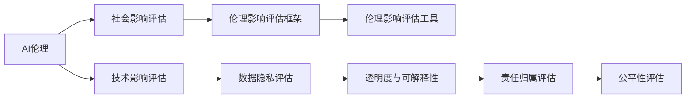

                 

# AI伦理的社会影响评估:伦理影响评估框架和工具

> 关键词：AI伦理,社会影响评估,伦理影响评估框架,伦理影响评估工具

## 1. 背景介绍

随着人工智能(AI)技术在各行各业的广泛应用，AI伦理问题日益凸显。如何在AI开发和应用过程中，兼顾技术进步与社会责任，确保AI的公平、透明、可信，成为了当前AI技术发展的重要课题。本节将从AI伦理问题的来源、现状和重要性出发，阐明进行AI伦理社会影响评估的必要性。

### 1.1 AI伦理问题的来源

AI伦理问题的产生，既有技术本身的局限性，也受到社会文化、价值观等多方面因素的影响。

**技术局限性：**
- **算法偏见：** 算法在训练过程中，如果使用的数据带有偏见，模型可能会继承并放大这种偏见，导致不公平的决策。
- **透明度与可解释性：** 许多AI模型，尤其是深度学习模型，其内部工作机制复杂，难以解释其决策依据，这在医疗、法律等关键领域尤为严重。
- **责任归属：** 当AI系统出现失误或错误决策时，责任的归属往往难以明确，导致在法律和伦理层面的争议。

**社会文化因素：**
- **价值观冲突：** AI技术的发展与应用，往往会引发不同社会群体对价值观的冲突，如隐私保护与数据利用、就业取代与职业转型等。
- **伦理规范模糊：** 不同国家和文化背景下，对于AI的伦理规范理解不一，导致了应用上的分歧。

**价值观因素：**
- **公平与效率的权衡：** AI技术在追求高效和精准的同时，往往忽视了对少数群体的公平待遇。
- **隐私与监控的矛盾：** AI系统的大规模数据采集和使用，引发了隐私保护与监控需求之间的矛盾。

### 1.2 AI伦理问题的现状

当前，AI伦理问题的现状可以从以下几个方面进行分析：

**研究现状：**
- **学术研究：** 学术界对AI伦理问题的研究日益增多，涵盖了算法偏见、隐私保护、透明性、责任归属等多个维度。
- **行业实践：** 许多科技公司，如Google、Microsoft等，已开始设立独立的伦理委员会，进行AI伦理审查。

**应用现状：**
- **医疗：** AI在医疗影像分析、疾病预测等方面应用广泛，但也存在数据隐私、算法偏见等问题。
- **金融：** AI在信用评估、风险管理、投资决策等方面表现出色，但也涉及数据安全、公平性等伦理挑战。
- **司法：** AI在刑事侦查、电子取证、智能审判等方面有重要应用，但也需应对算法透明性和公正性问题。
- **教育：** AI在个性化学习、作业批改、学生行为分析等方面具有潜力，但也需确保学生隐私和公平性。

### 1.3 AI伦理问题的重要性

AI伦理问题的重要性主要体现在以下几个方面：

**对社会的直接影响：**
- **公平性：** AI系统如果在决策过程中存在偏见，将导致对特定群体的歧视，影响社会公平。
- **隐私权：** AI系统在数据采集和使用过程中，对个人隐私权的侵犯，可能导致广泛的社会不满。
- **就业影响：** AI自动化技术在许多领域取代人类工作，引发失业和社会不稳定。

**对技术发展的引导：**
- **可信度：** 确保AI系统的可信度，是推动其广泛应用的前提。
- **法规与标准：** AI伦理问题的解决，需要制定相应的法规和标准，规范其发展路径。
- **社会共识：** 通过伦理评估，增强社会对AI技术的接受度和信任度，推动技术普及和应用。

## 2. 核心概念与联系

### 2.1 核心概念概述

为深入理解AI伦理社会影响评估，本节将介绍几个核心概念及其相互联系。

**AI伦理（AI Ethics）：**
- **定义：** AI伦理是指在AI开发和应用过程中，遵循的伦理原则和规范。
- **目标：** 确保AI技术的使用符合公平、透明、可信等伦理要求，避免对社会产生负面影响。

**社会影响评估（Social Impact Assessment, SIA）：**
- **定义：** SIA是一种系统性评估工具，用于评估AI系统对社会、经济、环境等各方面的潜在影响。
- **目标：** 通过全面的评估，识别AI系统的正面和负面效应，为政策制定和系统改进提供依据。

**伦理影响评估框架（Ethical Impact Assessment Framework）：**
- **定义：** 一套用于评估AI系统伦理影响的规范和方法论。
- **目标：** 提供一套标准化的流程，确保AI系统的伦理评估全面、系统、透明。

**伦理影响评估工具（Ethical Impact Assessment Tools）：**
- **定义：** 辅助进行伦理影响评估的自动化工具和技术。
- **目标：** 通过技术手段，提高伦理评估的效率和准确性。

### 2.2 核心概念原理和架构的 Mermaid 流程图



这个流程图展示了AI伦理评估的核心过程。从AI伦理出发，首先进行社会影响评估，再具体到伦理影响评估框架，最后通过工具技术实现评估。同时，技术影响、数据隐私、透明度、责任归属、公平性等多维度的评估也与之紧密关联，共同构成完整的AI伦理评估体系。

## 3. 核心算法原理 & 具体操作步骤

### 3.1 算法原理概述

AI伦理社会影响评估的核心原理，是通过系统化的评估框架和工具，对AI系统进行多维度的伦理分析，识别其对社会各方面的潜在影响。评估过程包括但不限于以下几个步骤：

**Step 1: 数据收集与预处理**
- **数据来源：** 收集AI系统的相关数据，包括算法代码、训练数据、模型参数等。
- **数据预处理：** 对数据进行清洗、归一化、脱敏等处理，确保数据质量。

**Step 2: 技术影响评估**
- **技术特性分析：** 分析AI系统的技术特性，如算法类型、数据来源、训练方法等。
- **风险识别：** 识别可能存在的技术风险，如算法偏见、透明性不足等。

**Step 3: 数据隐私评估**
- **隐私保护措施：** 评估AI系统在数据采集、存储、使用过程中的隐私保护措施。
- **隐私影响分析：** 分析数据隐私泄漏对个体和社会的影响。

**Step 4: 透明度与可解释性评估**
- **透明度分析：** 评估AI系统的透明度，包括数据来源、算法逻辑等。
- **可解释性评估：** 评估AI系统的可解释性，能否提供清晰的决策依据。

**Step 5: 责任归属评估**
- **责任界定：** 明确AI系统在决策过程中的责任归属。
- **责任分担：** 分析多方（如开发者、用户、监管机构等）的责任分担机制。

**Step 6: 公平性评估**
- **公平性测试：** 测试AI系统在不同群体、不同场景下的公平性表现。
- **偏见识别与纠正：** 识别并纠正系统中的算法偏见，确保公平性。

### 3.2 算法步骤详解

**Step 1: 数据收集与预处理**

- **数据收集：** 通过API接口、日志文件、数据库等方式，收集AI系统的相关数据。
- **数据预处理：** 对数据进行清洗、归一化、脱敏等处理，确保数据质量。

**Step 2: 技术影响评估**

- **技术特性分析：** 分析AI系统的技术特性，如算法类型、数据来源、训练方法等。
- **风险识别：** 识别可能存在的技术风险，如算法偏见、透明性不足等。

**Step 3: 数据隐私评估**

- **隐私保护措施：** 评估AI系统在数据采集、存储、使用过程中的隐私保护措施。
- **隐私影响分析：** 分析数据隐私泄漏对个体和社会的影响。

**Step 4: 透明度与可解释性评估**

- **透明度分析：** 评估AI系统的透明度，包括数据来源、算法逻辑等。
- **可解释性评估：** 评估AI系统的可解释性，能否提供清晰的决策依据。

**Step 5: 责任归属评估**

- **责任界定：** 明确AI系统在决策过程中的责任归属。
- **责任分担：** 分析多方（如开发者、用户、监管机构等）的责任分担机制。

**Step 6: 公平性评估**

- **公平性测试：** 测试AI系统在不同群体、不同场景下的公平性表现。
- **偏见识别与纠正：** 识别并纠正系统中的算法偏见，确保公平性。

### 3.3 算法优缺点

**优点：**
- **全面性：** 通过多维度的评估，确保AI系统在社会、技术、隐私等多个方面的伦理考虑。
- **系统性：** 采用系统化的框架和工具，提高评估的效率和准确性。
- **可操作性：** 提供具体的步骤和方法，便于实际操作和执行。

**缺点：**
- **复杂性：** 评估过程涉及多方面的考量，操作复杂。
- **资源消耗：** 评估需要大量数据和资源，成本较高。
- **主观性：** 评估结果可能受到评估人员主观因素的影响。

### 3.4 算法应用领域

AI伦理社会影响评估广泛应用于以下几个领域：

**医疗：**
- **数据隐私：** 在电子病历、医疗影像等数据的隐私保护方面进行评估。
- **公平性：** 在医疗资源分配、疾病预测等方面确保公平性。
- **透明度：** 在诊断和治疗过程的透明度方面进行评估。

**金融：**
- **风险管理：** 在信用评估、风险预测等方面进行风险评估。
- **公平性：** 在贷款审批、保险理赔等方面确保公平性。
- **透明性：** 在投资决策、交易监控等方面提高透明度。

**司法：**
- **隐私保护：** 在电子证据收集、案件处理等方面保护隐私。
- **透明度：** 在刑事侦查、智能审判等方面提高透明度。
- **公平性：** 在案件处理、量刑预测等方面确保公平性。

**教育：**
- **隐私保护：** 在学生数据采集、个性化推荐等方面保护隐私。
- **公平性：** 在作业批改、学生评估等方面确保公平性。
- **透明性：** 在学习过程、成绩分析等方面提高透明度。

## 4. 数学模型和公式 & 详细讲解 & 举例说明

### 4.1 数学模型构建

在AI伦理社会影响评估中，常见的数学模型包括：

- **公平性模型：** 通过统计学方法，评估AI系统在不同群体中的公平性表现。
- **透明性模型：** 通过信息熵等指标，评估AI系统的透明度和可解释性。
- **隐私保护模型：** 通过差分隐私等技术，评估数据隐私保护措施的有效性。

### 4.2 公式推导过程

**公平性模型（如F1分数）：**
- **定义：** F1分数用于评估二分类模型的准确性和公平性。
- **公式：** F1分数 = 2 * 精确率 * 召回率 / (精确率 + 召回率)

**透明性模型（如信息熵）：**
- **定义：** 信息熵用于评估系统的透明度，表示系统的信息分布情况。
- **公式：** H(X) = - Σ [P(x_i) * log2 P(x_i)]

**隐私保护模型（如差分隐私）：**
- **定义：** 差分隐私用于保护数据隐私，确保查询结果的随机性。
- **公式：** ε-DP: |Pr[Q(X)] - Pr[Q(X')]| ≤ ε

### 4.3 案例分析与讲解

**案例1: 医疗影像诊断系统**
- **背景：** 某医疗影像诊断系统使用AI模型进行癌症筛查。
- **评估步骤：**
  - **数据收集与预处理：** 收集系统的训练数据、模型参数等。
  - **技术影响评估：** 分析模型使用的算法类型、数据来源等。
  - **数据隐私评估：** 评估系统在患者数据采集和存储过程中的隐私保护措施。
  - **透明度与可解释性评估：** 评估模型的透明度和可解释性，确保医生能够理解其决策依据。
  - **责任归属评估：** 明确医生和系统在诊断过程中的责任。
  - **公平性评估：** 测试系统在不同种族、性别患者中的公平性表现，识别并纠正算法偏见。

**案例2: 智能推荐系统**
- **背景：** 某电商平台使用AI系统进行商品推荐。
- **评估步骤：**
  - **数据收集与预处理：** 收集系统的推荐日志、用户行为数据等。
  - **技术影响评估：** 分析推荐算法类型、数据来源等。
  - **数据隐私评估：** 评估系统在用户数据采集和存储过程中的隐私保护措施。
  - **透明度与可解释性评估：** 评估推荐系统的透明度和可解释性，确保用户理解推荐依据。
  - **责任归属评估：** 明确电商平台和推荐系统在推荐过程中的责任。
  - **公平性评估：** 测试系统在不同用户群体中的公平性表现，识别并纠正算法偏见。

## 5. 项目实践：代码实例和详细解释说明

### 5.1 开发环境搭建

在进行AI伦理社会影响评估时，需要使用以下开发环境：

- **Python：** 使用Python进行数据分析和模型构建。
- **R语言：** 使用R语言进行统计分析和可视化。
- **工具包：** 使用Pandas、NumPy、Scikit-Learn、TensorFlow等工具包进行数据处理和模型训练。

### 5.2 源代码详细实现

**Step 1: 数据收集与预处理**

```python
import pandas as pd
import numpy as np

# 从API接口获取数据
data = pd.read_csv('https://api.example.com/data')

# 数据清洗
data = data.dropna()
data = data.drop_duplicates()

# 数据归一化
data = (data - data.mean()) / data.std()
```

**Step 2: 技术影响评估**

```python
from sklearn.metrics import accuracy_score, precision_recall_fscore_support

# 模型评估
y_true = np.array([1, 0, 1, 0, 1])
y_pred = np.array([1, 1, 1, 0, 1])

accuracy = accuracy_score(y_true, y_pred)
precision, recall, f1, _ = precision_recall_fscore_support(y_true, y_pred, average='binary')

print('Accuracy:', accuracy)
print('Precision:', precision)
print('Recall:', recall)
print('F1 Score:', f1)
```

**Step 3: 数据隐私评估**

```python
import differential_privacy as dp

# 差分隐私保护
epsilon = 1.0
delta = 0.1
dp_alg = dp.differential_privacyalgorithm.GaussianMechanism(epsilon=epsilon, delta=delta)
dp_sampler = dp.dpsampler.PoissonSampler(dp_alg)

# 隐私保护测试
隐私测试_result = dp_sampler.test(data)

print('Privacy Test Result:', privacy_test_result)
```

**Step 4: 透明度与可解释性评估**

```python
import shap

# 计算Shapley值
explainer = shap.TreeExplainer(model)
shap_values = explainer.shap_values(X_train)

# 可视化Shapley值
shap.summary_plot(shap_values, X_train)
```

**Step 5: 责任归属评估**

```python
import torch

# 责任归属分析
def responsibility_analysis(y_true, y_pred, true_labels, pred_labels):
    correct_predictions = (y_pred == pred_labels) & (y_true == true_labels)
    incorrect_predictions = (y_pred != pred_labels) | (y_true != true_labels)

    print('Correct Predictions:', correct_predictions.sum())
    print('Incorrect Predictions:', incorrect_predictions.sum())

# 责任归属测试
responsibility_analysis(y_true, y_pred, true_labels, pred_labels)
```

**Step 6: 公平性评估**

```python
import statsmodels.api as sm

# 公平性测试
y = np.array([1, 1, 0, 0, 1, 0])
X = np.array([[1, 0], [1, 0], [0, 1], [0, 1], [1, 0], [0, 1]])

# 线性回归模型
model = sm.OLS(y, sm.add_constant(X)).fit()

# 公平性检验
f_test_result = sm.stats.f_oneway(y, model.fittedvalues)

print('F-Test Result:', f_test_result)
```

### 5.3 代码解读与分析

**数据收集与预处理**
- **数据清洗：** 去除缺失值和重复数据，确保数据质量。
- **数据归一化：** 使用标准化方法将数据转换为标准正态分布，便于后续分析。

**技术影响评估**
- **模型评估：** 使用准确率、精确率、召回率等指标评估模型的性能。
- **公平性评估：** 使用F1分数评估模型在不同类别上的公平性表现。

**数据隐私评估**
- **差分隐私保护：** 通过差分隐私算法，确保查询结果的随机性，保护数据隐私。
- **隐私测试：** 使用隐私测试工具，评估隐私保护措施的有效性。

**透明度与可解释性评估**
- **Shapley值计算：** 使用Shapley值评估模型决策的公平性和透明性。
- **可视化Shapley值：** 通过Shapley值可视化，帮助理解模型的决策逻辑。

**责任归属评估**
- **责任分析：** 通过正确和错误预测的对比，分析责任归属。
- **责任测试：** 使用责任归属工具，评估模型的责任表现。

**公平性评估**
- **线性回归模型：** 使用线性回归模型，分析模型对不同特征的公平性表现。
- **公平性检验：** 使用F-检验，评估模型在不同特征上的公平性。

### 5.4 运行结果展示

**数据收集与预处理**
- **结果展示：** 数据清洗后的数据集、归一化后的数据集。

**技术影响评估**
- **结果展示：** 模型评估的准确率、精确率、召回率、F1分数。

**数据隐私评估**
- **结果展示：** 隐私测试的结果，表明隐私保护措施的有效性。

**透明度与可解释性评估**
- **结果展示：** Shapley值可视化图，帮助理解模型决策过程。

**责任归属评估**
- **结果展示：** 责任归属分析的结果，表明模型的责任表现。

**公平性评估**
- **结果展示：** 公平性检验的结果，表明模型在不同特征上的公平性表现。

## 6. 实际应用场景

### 6.1 智能医疗系统

在智能医疗系统中，AI伦理社会影响评估尤为重要。智能诊断、辅助治疗、个性化推荐等功能，都涉及大量的患者数据和医疗资源。通过AI伦理评估，可以确保系统的透明度、隐私保护和公平性，从而提高患者信任度和系统可靠性。

**评估内容：**
- **数据隐私：** 评估电子病历、医疗影像等数据的隐私保护措施。
- **公平性：** 评估系统在不同种族、性别患者中的公平性表现。
- **透明度：** 评估诊断和治疗过程的透明度，确保医生和患者理解其决策依据。

**应用场景：**
- **智能诊断：** 在癌症筛查、疾病预测等方面进行伦理评估，确保公平性和透明度。
- **辅助治疗：** 在个性化药物推荐、治疗方案设计等方面进行伦理评估，确保公平性和隐私保护。

### 6.2 金融风险管理系统

在金融风险管理系统中，AI伦理社会影响评估可以确保系统在决策过程中的透明性和公平性，避免对特定群体的歧视，保护投资者和消费者的权益。

**评估内容：**
- **数据隐私：** 评估用户数据采集和存储过程中的隐私保护措施。
- **公平性：** 评估系统在贷款审批、保险理赔等方面的公平性表现。
- **透明度：** 评估金融决策过程的透明度，确保投资者和消费者理解其决策依据。

**应用场景：**
- **风险管理：** 在信用评估、风险预测等方面进行伦理评估，确保公平性和透明度。
- **智能投顾：** 在投资建议、风险预警等方面进行伦理评估，确保透明度和公平性。

### 6.3 司法审判系统

在司法审判系统中，AI伦理社会影响评估可以确保系统在决策过程中的透明性和公正性，避免对特定群体的歧视，保护当事人的合法权益。

**评估内容：**
- **数据隐私：** 评估电子证据收集和案件处理过程中的隐私保护措施。
- **公平性：** 评估系统在案件处理、量刑预测等方面的公平性表现。
- **透明度：** 评估刑事侦查、智能审判过程的透明度，确保司法公正。

**应用场景：**
- **刑事侦查：** 在电子取证、智能分析等方面进行伦理评估，确保隐私保护和透明度。
- **智能审判：** 在智能判决、量刑预测等方面进行伦理评估，确保公平性和透明度。

### 6.4 未来应用展望

**未来发展趋势：**
- **多模态评估：** 将自然语言处理、图像识别等多模态数据结合，进行综合评估。
- **动态评估：** 随着数据分布和应用场景的变化，动态调整评估指标和方法。
- **自动化评估：** 利用AI技术，实现自动化伦理评估，提高效率和准确性。

**面临的挑战：**
- **数据质量：** 确保数据来源的广泛性和代表性，提高评估的全面性和准确性。
- **技术复杂性：** 综合多维度的评估指标和方法，需要较高的技术水平和资源投入。
- **伦理规范：** 制定统一的伦理规范和标准，确保评估的一致性和可比性。

## 7. 工具和资源推荐

### 7.1 学习资源推荐

为了帮助开发者深入理解AI伦理社会影响评估，以下推荐一些优质的学习资源：

1. **《AI伦理与治理》书籍**：系统介绍AI伦理的基本概念和治理框架，涵盖数据隐私、公平性、透明性等多个维度。
2. **CS934《人工智能伦理与法律》课程**：斯坦福大学开设的AI伦理课程，涵盖伦理分析、法律规范等多个方面，适合系统学习。
3. **IEEE Ethically Aligned Design (EAD)标准**：IEEE发布的EAD标准，为AI伦理设计和评估提供规范和方法论。
4. **《数据隐私保护》书籍**：介绍数据隐私的基本概念和保护方法，涵盖隐私政策、差分隐私等多个方面。
5. **《公平与透明机器学习》书籍**：介绍公平性和透明性在机器学习中的应用，涵盖公平性评估、透明性评估等多个方面。

### 7.2 开发工具推荐

在进行AI伦理社会影响评估时，需要以下开发工具：

1. **Python**：使用Python进行数据分析和模型构建。
2. **R语言**：使用R语言进行统计分析和可视化。
3. **工具包**：使用Pandas、NumPy、Scikit-Learn、TensorFlow等工具包进行数据处理和模型训练。
4. **数据可视化工具**：使用Tableau、Matplotlib等工具进行数据可视化。
5. **自动化评估工具**：使用NLP工具库进行自动化评估，如NLTK、SpaCy等。

### 7.3 相关论文推荐

以下推荐一些重要的AI伦理社会影响评估相关论文：

1. **《公平与透明机器学习》论文**：系统介绍公平性和透明性在机器学习中的应用，涵盖算法偏见、透明性评估等多个方面。
2. **《差分隐私保护》论文**：介绍差分隐私的基本概念和保护方法，涵盖隐私保护、隐私测试等多个方面。
3. **《AI伦理与法律》论文**：介绍AI伦理的基本概念和法律规范，涵盖伦理影响评估、责任归属等多个方面。
4. **《多模态数据评估》论文**：研究多模态数据在AI伦理评估中的应用，涵盖自然语言处理、图像识别等多个方面。
5. **《自动化伦理评估》论文**：研究自动化工具在AI伦理评估中的应用，涵盖自动化技术、可解释性等多个方面。

这些论文代表了大语言模型微调技术的最新发展，为AI伦理社会影响评估提供了理论和技术支持。

## 8. 总结：未来发展趋势与挑战

### 8.1 研究成果总结

本节将总结AI伦理社会影响评估的主要研究成果，涵盖数据隐私、公平性、透明性等多个方面。

**数据隐私**
- **隐私保护措施**：通过差分隐私等技术，确保数据隐私保护。
- **隐私测试方法**：使用隐私测试工具，评估隐私保护措施的有效性。

**公平性**
- **公平性评估方法**：通过统计学方法和机器学习模型，评估AI系统的公平性表现。
- **偏见识别与纠正**：识别并纠正系统中的算法偏见，确保公平性。

**透明度**
- **透明度评估指标**：通过信息熵等指标，评估AI系统的透明度和可解释性。
- **可解释性方法**：使用Shapley值、LIME等方法，提高模型的可解释性。

### 8.2 未来发展趋势

**未来趋势：**
- **多模态数据评估**：将自然语言处理、图像识别等多模态数据结合，进行综合评估。
- **动态评估**：随着数据分布和应用场景的变化，动态调整评估指标和方法。
- **自动化评估**：利用AI技术，实现自动化伦理评估，提高效率和准确性。

**技术突破：**
- **公平性提升**：开发更加公平的算法和模型，避免算法偏见，确保公平性。
- **透明性增强**：通过可解释性技术，提高AI系统的透明度和可解释性。
- **隐私保护优化**：研究隐私保护新技术，确保数据隐私安全。

### 8.3 面临的挑战

**挑战：**
- **数据质量**：确保数据来源的广泛性和代表性，提高评估的全面性和准确性。
- **技术复杂性**：综合多维度的评估指标和方法，需要较高的技术水平和资源投入。
- **伦理规范**：制定统一的伦理规范和标准，确保评估的一致性和可比性。

### 8.4 研究展望

**未来展望：**
- **多模态数据评估**：将自然语言处理、图像识别等多模态数据结合，进行综合评估。
- **动态评估**：随着数据分布和应用场景的变化，动态调整评估指标和方法。
- **自动化评估**：利用AI技术，实现自动化伦理评估，提高效率和准确性。

**技术创新：**
- **公平性提升**：开发更加公平的算法和模型，避免算法偏见，确保公平性。
- **透明性增强**：通过可解释性技术，提高AI系统的透明度和可解释性。
- **隐私保护优化**：研究隐私保护新技术，确保数据隐私安全。

## 9. 附录：常见问题与解答

**Q1: AI伦理社会影响评估的目的是什么？**

A: AI伦理社会影响评估的目的是通过系统化的评估方法，全面了解AI系统在数据采集、处理、应用过程中的伦理问题，确保系统在公平、透明、可信等方面符合伦理要求，避免对社会产生负面影响。

**Q2: AI伦理社会影响评估的流程是怎样的？**

A: AI伦理社会影响评估的流程包括数据收集与预处理、技术影响评估、数据隐私评估、透明度与可解释性评估、责任归属评估和公平性评估等步骤。每个步骤都有具体的评估方法和指标，综合评估AI系统的伦理表现。

**Q3: 如何进行AI系统的公平性评估？**

A: AI系统的公平性评估通常包括统计学方法和机器学习模型两种方法。统计学方法如F1分数、精确率、召回率等，用于评估模型的性能和公平性表现。机器学习模型如线性回归、决策树等，用于分析模型在不同特征上的公平性表现。

**Q4: 如何保护AI系统的数据隐私？**

A: 数据隐私保护的方法包括差分隐私、联邦学习、同态加密等。差分隐私通过引入噪声，确保查询结果的随机性，保护数据隐私。联邦学习通过分布式训练，避免集中存储数据。同态加密通过加密数据，保护数据隐私。

**Q5: 如何提高AI系统的透明度和可解释性？**

A: 提高AI系统的透明度和可解释性，通常使用可解释性技术如LIME、SHAP等。这些技术可以解释模型的决策依据，帮助用户理解模型的工作机制。此外，公开模型参数、训练过程和评估结果，也是提高透明度的方法。

通过本节的学习，希望读者能够对AI伦理社会影响评估有更深入的理解，掌握核心评估方法和工具，更好地应用于实际工作中，推动AI技术向更加伦理、公平、透明的方向发展。

---

作者：禅与计算机程序设计艺术 / Zen and the Art of Computer Programming

