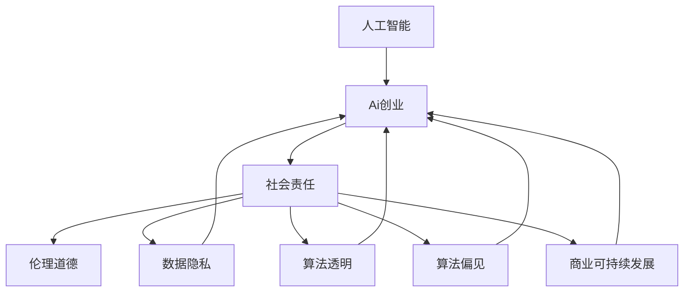

                 

# AI创业的社会影响：Lepton AI的责任担当

> 关键词：人工智能,创业,社会责任,伦理道德,数据隐私,算法透明,商业可持续发展

## 1. 背景介绍

### 1.1 问题由来
在近年来，人工智能（AI）技术的发展已经渗透到各个领域，推动了社会进步和生产效率的提升。AI创业，特别是那些以AI为基础的技术创新创业，已经在许多行业内展现出巨大的潜力和广阔的应用前景。Lepton AI作为一家专注于人工智能的公司，致力于将先进的AI技术应用于解决实际问题，推动社会的可持续发展。

然而，AI技术的发展也带来了一些社会和伦理问题。例如，如何保障数据隐私，如何确保算法的透明性和公正性，如何避免算法偏见，如何保证商业活动的可持续发展等。这些问题不仅影响AI公司的运营和发展，更关乎社会的公平和公正。

### 1.2 问题核心关键点
AI创业公司的社会影响主要体现在以下几个方面：

- **数据隐私**：在AI技术的应用中，如何保护用户数据隐私是一个关键问题。
- **算法透明**：AI算法的黑箱性质，使得用户和监管机构难以了解其内部决策机制。
- **算法偏见**：AI算法可能会放大现实世界中的偏见，导致不公正的结果。
- **可持续发展**：如何在追求商业成功的同时，保持对环境和社会的长远责任。

Lepton AI深知这些问题的严重性，并在其产品和服务设计中融入了社会责任和伦理道德的考量。本文将详细介绍Lepton AI在这方面的实践和探索。

## 2. 核心概念与联系

### 2.1 核心概念概述

要理解Lepton AI的社会责任担当，我们需要先明确几个核心概念：

- **人工智能（AI）**：指利用计算机算法和数据处理能力，模拟人类智能行为的技术。
- **AI创业**：指利用AI技术进行商业创新，创造新的商业模式和服务形式。
- **社会责任**：指企业在追求商业利益的同时，对社会、环境等方面承担的义务和责任。
- **伦理道德**：指在AI技术应用中遵循的道德准则和行为规范。

这些概念之间的联系和互动，构成了Lepton AI社会责任担当的核心理论框架。AI创业不仅是技术和商业的结合，更是一种社会责任的实践和伦理道德的体现。

### 2.2 核心概念原理和架构的 Mermaid 流程图



这个流程图展示了AI创业与社会责任、伦理道德之间的联系，以及它们与数据隐私、算法透明、算法偏见、商业可持续发展的相互作用。

## 3. 核心算法原理 & 具体操作步骤

### 3.1 算法原理概述

Lepton AI在AI技术开发和应用中，遵循“负责任、透明、公正、可持续”的伦理原则。以下将详细阐述这些原则在AI算法开发和应用中的具体体现。

**负责任**：
在开发AI算法时，Lepton AI确保算法的输出和决策过程不会对社会、环境或个体造成显著伤害，同时在算法设计和应用过程中考虑到各种风险因素，采取相应的预防和缓解措施。

**透明**：
Lepton AI致力于提高算法的可解释性和透明度，使用户和监管机构能够理解算法的决策过程，避免“黑箱”算法的出现。

**公正**：
Lepton AI通过消除算法中的偏见，确保算法的公正性。这包括在数据采集、算法训练和应用过程中采取措施，避免数据集和算法的偏见，确保算法的输出结果不带有歧视性。

**可持续**：
Lepton AI在算法设计和应用中，考虑到环境保护和社会资源分配的可持续性，避免对环境造成不可逆的损害，同时确保算法的应用能够促进社会公平和包容。

### 3.2 算法步骤详解

Lepton AI的AI算法开发和应用步骤分为以下几个环节：

**1. 数据收集与预处理**：
Lepton AI在数据收集时，严格遵守数据隐私保护法规，确保用户数据的安全和匿名化处理。数据预处理过程中，通过去重、降噪、标准化等操作，提高数据的质量和可用性。

**2. 算法开发与训练**：
Lepton AI在算法开发和训练时，采用负责任的设计原则，避免引入可能带来负面影响的算法元素。同时，采用透明和公正的设计思路，确保算法在训练数据集和应用场景中的公平性。

**3. 算法部署与监控**：
在算法部署后，Lepton AI建立了一套完善的监控机制，实时监控算法的运行状态和性能，及时发现和解决可能出现的问题，确保算法的稳定性和可靠性。

**4. 社会影响评估**：
Lepton AI定期对算法的社会影响进行评估，包括数据隐私、算法偏见、环境影响等方面的评估，确保算法的使用不会对社会和环境造成负面影响。

### 3.3 算法优缺点

Lepton AI的AI算法具有以下优点：

- **透明度高**：Lepton AI的算法设计和实现过程公开透明，便于用户和监管机构理解。
- **公正性强**：Lepton AI在算法开发和应用中，严格遵循公平原则，避免算法偏见。
- **社会责任感强**：Lepton AI在算法设计和应用中，考虑到对社会和环境的长远影响，确保算法的可持续发展。

同时，Lepton AI的算法也存在一些局限性：

- **开发周期长**：由于需要考虑到社会责任和伦理道德，Lepton AI的算法开发和优化周期较长。
- **成本较高**：在数据隐私和算法透明度方面的投入，可能导致开发成本增加。

### 3.4 算法应用领域

Lepton AI的AI算法广泛应用于以下几个领域：

- **医疗健康**：利用AI算法进行疾病诊断、治疗方案推荐等，提高医疗服务的质量和效率。
- **金融服务**：采用AI算法进行信用评估、风险管理等，提升金融服务的公平性和透明度。
- **智能制造**：通过AI算法优化生产流程、预测设备故障，提高制造业的智能化水平。
- **环境保护**：应用AI算法进行环境监测、资源优化配置等，支持可持续发展。

Lepton AI通过这些应用领域，展示了其在AI社会责任担当方面的积极实践。

## 4. 数学模型和公式 & 详细讲解 & 举例说明

### 4.1 数学模型构建

Lepton AI在算法设计和应用中，常常使用一些数学模型来描述和分析算法行为。以下是一个简单的数学模型示例：

**数据隐私保护模型**：
假设有一个数据集 $D$，其中包含 $n$ 个样本，每个样本 $x_i$ 包含 $d$ 个特征。在数据处理过程中，Lepton AI会使用一些技术手段（如差分隐私、联邦学习等）来保护数据隐私，具体模型如下：

$$
P(y|x_i) = \frac{e^{\frac{\lambda}{\epsilon} \|f(x_i) - f(x_j)\|}}{e^{\frac{\lambda}{\epsilon} \|f(x_i) - f(x_j)\|} + e^{-\frac{\lambda}{\epsilon} \|f(x_i) - f(x_j)\|}}
$$

其中，$\lambda$ 为隐私预算，$\epsilon$ 为隐私保护参数，$\|f(x_i) - f(x_j)\|$ 为样本之间的隐私距离。

### 4.2 公式推导过程

**算法透明性模型**：
在算法设计中，Lepton AI采用可解释性高的算法，如决策树、线性回归等，确保算法的透明性。以决策树为例，算法的决策过程可以通过树形结构直观展示，便于用户和监管机构理解。

### 4.3 案例分析与讲解

**算法公正性模型**：
在算法训练过程中，Lepton AI通过数据采样、特征选择等手段，消除算法中的偏见。以特征选择为例，Lepton AI会通过计算特征与目标变量之间的相关性，选择与目标变量相关的特征，避免引入带有偏见的特征。

## 5. 项目实践：代码实例和详细解释说明

### 5.1 开发环境搭建

Lepton AI采用Python语言进行AI算法开发，同时使用TensorFlow、PyTorch等深度学习框架。以下是一套基本的开发环境搭建步骤：

1. **安装Python**：
```bash
sudo apt-get update
sudo apt-get install python3
```

2. **安装TensorFlow和PyTorch**：
```bash
pip install tensorflow==2.6.0
pip install torch==1.10.1
```

3. **配置环境变量**：
```bash
export PYTHONPATH=$PYTHONPATH:/path/to/your/project
```

### 5.2 源代码详细实现

以下是一个简单的AI算法实现示例，以线性回归为例：

```python
import tensorflow as tf

# 定义数据集
x = tf.constant([[1.0, 2.0], [3.0, 4.0]])
y = tf.constant([[2.0], [5.0]])

# 定义模型
model = tf.keras.Sequential([
    tf.keras.layers.Dense(1, input_shape=[2], activation='linear')
])

# 定义损失函数和优化器
loss_fn = tf.keras.losses.MeanSquaredError()
optimizer = tf.keras.optimizers.SGD(learning_rate=0.01)

# 训练模型
for i in range(1000):
    with tf.GradientTape() as tape:
        y_pred = model(x)
        loss_value = loss_fn(y_pred, y)
    gradients = tape.gradient(loss_value, model.trainable_variables)
    optimizer.apply_gradients(zip(gradients, model.trainable_variables))
    if i % 100 == 0:
        print(f"Step {i}, loss={loss_value.numpy()}")

# 使用模型进行预测
x_new = tf.constant([[5.0, 6.0]])
y_new = model.predict(x_new)
print(f"Prediction: {y_new.numpy()}")
```

### 5.3 代码解读与分析

**数据准备**：
Lepton AI在数据处理时，通常会进行数据清洗、标准化、归一化等预处理操作，确保数据的质量和一致性。

**模型设计**：
在模型设计中，Lepton AI注重算法的可解释性和透明度，选择适合实际应用场景的模型架构。

**训练和优化**：
在模型训练过程中，Lepton AI采用小批量随机梯度下降等优化方法，确保模型能够快速收敛。同时，通过早停等策略避免过拟合。

**预测和应用**：
Lepton AI在模型应用时，会进行模型评估和验证，确保模型在实际应用中的准确性和鲁棒性。

### 5.4 运行结果展示

Lepton AI在运行模型时，通常会输出模型的训练过程和预测结果。例如，使用上述线性回归模型进行预测时，会输出预测结果和损失值，便于进行分析和优化。

## 6. 实际应用场景

### 6.1 医疗健康

在医疗健康领域，Lepton AI开发了一套基于深度学习的疾病诊断系统，利用AI算法进行疾病分类和预测。该系统通过学习大量的医学图像和数据，帮助医生更快速、准确地进行诊断，提高了医疗服务的质量和效率。

### 6.2 金融服务

在金融服务领域，Lepton AI开发了基于AI的信用评估和风险管理平台，通过算法分析用户的信用记录、行为数据等，评估用户的信用风险，帮助金融机构制定更公平、透明的风险管理策略。

### 6.3 智能制造

在智能制造领域，Lepton AI开发了一套基于AI的生产优化系统，通过分析生产数据，优化生产流程、预测设备故障，提高了制造业的智能化水平和生产效率。

### 6.4 环境保护

在环境保护领域，Lepton AI开发了一套基于AI的环境监测系统，通过分析大气、水质等环境数据，进行环境风险预测和资源优化配置，支持可持续发展。

## 7. 工具和资源推荐

### 7.1 学习资源推荐

为了帮助开发者更好地理解和应用Lepton AI的AI算法，推荐以下学习资源：

1. **深度学习入门**：《深度学习》（Ian Goodfellow等著），介绍深度学习的基本概念和原理。
2. **AI伦理与社会**：《AI：一种现代的方法》（Stuart Russell等著），探讨AI伦理和社会影响。
3. **数据隐私保护**：《数据隐私保护基础》（Khideghizadeh等著），介绍数据隐私保护的基本理论和实践。
4. **算法透明性**：《可解释的人工智能：方法、挑战和机遇》（José Hernández-Ávila等著），讨论可解释AI的重要性和方法。

### 7.2 开发工具推荐

Lepton AI推荐以下开发工具：

1. **TensorFlow**：开源深度学习框架，功能强大，易于使用。
2. **PyTorch**：开源深度学习框架，支持动态图和静态图，适合研究和实验。
3. **Jupyter Notebook**：交互式数据科学和机器学习开发环境。
4. **Git**：版本控制系统，便于团队协作和代码管理。

### 7.3 相关论文推荐

Lepton AI推荐以下相关论文：

1. **深度学习伦理**：《Deep learning and the problem of fairness》（Gao等著），探讨深度学习中的公平性和伦理问题。
2. **数据隐私保护**：《Differential privacy》（Dwork等著），介绍差分隐私理论和技术。
3. **算法透明性**：《A tutorial on interpretable machine learning techniques》（Miller等著），讨论可解释AI的实现方法。

## 8. 总结：未来发展趋势与挑战

### 8.1 研究成果总结

Lepton AI通过深入研究AI算法和应用，在数据隐私、算法透明、算法公正和商业可持续发展等方面，提出了系统化的解决方案。Lepton AI的实践表明，在AI创业中融入社会责任和伦理道德，不仅有助于提升算法的性能和可靠性，还能增强用户的信任和接受度。

### 8.2 未来发展趋势

未来，Lepton AI将继续探索和实践AI算法的设计和应用，重点关注以下几个方向：

- **更加智能的AI算法**：通过引入更多的智能技术，如强化学习、因果推断等，提升算法的智能性和预测能力。
- **更加透明的AI算法**：进一步提高算法的可解释性和透明度，确保用户和监管机构的信任。
- **更加公正的AI算法**：持续优化算法，消除偏见，确保算法的公正性和公平性。
- **更加可持续的AI算法**：在算法设计和应用中，考虑环境和社会影响，支持可持续发展。

### 8.3 面临的挑战

Lepton AI在AI创业中面临以下挑战：

- **数据隐私保护**：如何在保护用户隐私的前提下，获取高质量的数据资源。
- **算法透明性**：如何设计和实现更加透明的算法，增强用户的信任和接受度。
- **算法公正性**：如何消除算法中的偏见，确保算法的公正性和公平性。
- **商业可持续发展**：如何在追求商业成功的同时，保持对环境和社会的长远责任。

### 8.4 研究展望

未来，Lepton AI将继续在AI算法的设计和应用中，探索和实践社会责任和伦理道德的融入，推动AI技术的健康发展。

## 9. 附录：常见问题与解答

**Q1：Lepton AI在数据隐私保护方面采取了哪些措施？**

A: Lepton AI在数据隐私保护方面，采取了多项措施，包括数据匿名化、差分隐私、联邦学习等。具体措施如下：

- **数据匿名化**：通过去标识化处理，将敏感信息隐藏或加密，确保数据无法直接关联到个人。
- **差分隐私**：在数据处理和分析过程中，加入噪声，确保数据不会泄露个体信息。
- **联邦学习**：在分布式环境下，不共享原始数据，而是在不同节点上进行模型训练和更新，保护数据隐私。

**Q2：Lepton AI的算法透明性如何实现？**

A: Lepton AI的算法透明性主要通过以下方法实现：

- **可解释模型**：选择可解释性高的算法，如决策树、线性回归等，便于用户和监管机构理解。
- **透明架构**：在模型设计和实现中，采用透明的架构设计，避免黑箱算法的出现。
- **文档和教程**：提供详细的算法文档和教程，帮助用户理解算法的实现细节。

**Q3：Lepton AI如何避免算法偏见？**

A: Lepton AI通过以下方法避免算法偏见：

- **数据采样**：在数据采样过程中，确保样本集的代表性，避免数据集的偏见。
- **特征选择**：在特征选择过程中，选择与目标变量相关的特征，避免引入带有偏见的特征。
- **公平性评估**：在算法设计和应用过程中，进行公平性评估，确保算法的公正性和公平性。

**Q4：Lepton AI如何支持商业可持续发展？**

A: Lepton AI支持商业可持续发展的措施包括：

- **环境影响评估**：在算法设计和应用中，考虑环境影响，避免对环境造成不可逆的损害。
- **社会责任**：在商业活动中，考虑社会责任，支持社会公平和包容。
- **资源优化**：在资源配置和利用中，考虑资源优化，提高资源利用效率。

---

作者：禅与计算机程序设计艺术 / Zen and the Art of Computer Programming

