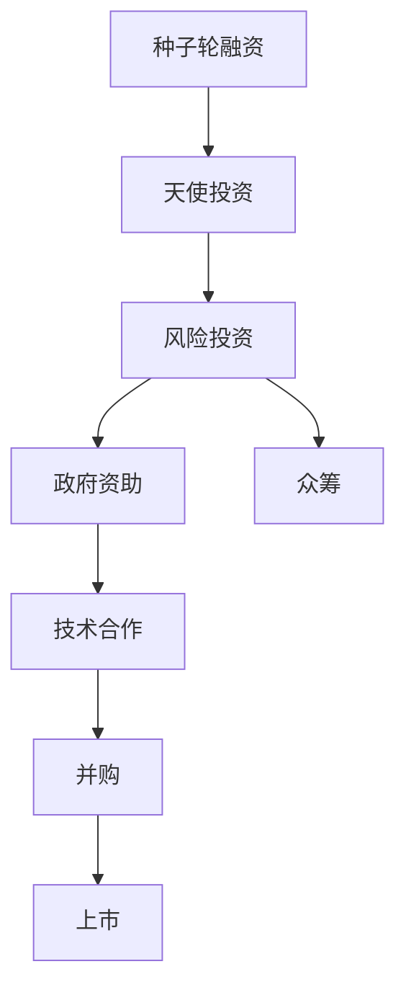

                 

# AI创业的资金之道：Lepton AI的融资策略

---

## 1. 背景介绍

### 1.1 问题由来
AI创业如同其他技术创业一样，面临着大量的资金需求。尽管许多AI初创公司在技术上达到了世界顶尖水平，但缺乏资金支持仍是其面临的最大障碍之一。此外，AI创业的资金需求往往大于传统的互联网或软件公司，因为其产品开发成本高，且要求更多的研发资源和人员。因此，AI创业公司在融资方面需要采取特殊策略，以吸引更多的投资者和潜在客户。

### 1.2 问题核心关键点
AI创业的融资挑战主要包括以下几个方面：

- **高研发成本**：AI项目的技术复杂度通常较高，研发周期较长，所需的硬件资源和人力成本也较高。
- **市场需求不确定**：AI技术的应用范围广泛，不同领域的市场需求不同，且AI技术的发展速度和市场接受度存在不确定性。
- **投资者信心**：AI技术的商业应用前景虽然明朗，但其高成本、高风险的特点可能会让投资者望而却步。
- **资金来源多元化**：AI创业公司不仅需要传统的风险投资，还需要政府资助、企业合作、众筹等多渠道融资。

## 2. 核心概念与联系

### 2.1 核心概念概述

在进行Lepton AI的融资策略分析前，我们首先需要定义和理解以下几个核心概念：

- **创业资金**：用于AI创业公司启动和发展所需的各种资金，包括种子资金、天使投资、风险投资等。
- **种子轮融资**：在初创阶段为公司提供启动资金的早期投资。
- **天使投资**：来自高净值个人或机构的早期投资。
- **风险投资**：由风险投资公司提供的较大额度的融资。
- **政府资助**：来自政府机构或基金的支持。
- **众筹**：通过互联网平台，公开募集小额资金。
- **融资轮次**：AI创业公司通常需要多轮融资，每一轮对应不同的发展阶段。

### 2.2 核心概念原理和架构的 Mermaid 流程图



这个流程图展示了AI创业公司常见的融资途径和轮次。

## 3. 核心算法原理 & 具体操作步骤

### 3.1 算法原理概述

AI创业公司的融资策略是一个复杂的多目标优化问题，涉及多个决策变量的动态调整和最优路径的选择。其核心算法原理包括：

- **资金需求预测**：基于市场分析、技术进展、竞争态势等因素，预测公司的资金需求。
- **投资回报率（ROI）分析**：分析不同投资渠道的预期回报率，筛选最优的融资来源。
- **动态调整策略**：根据市场环境变化和公司发展情况，动态调整融资策略。
- **投资方合作**：分析不同投资方的特点，寻找与公司战略匹配的最佳合作伙伴。
- **退出策略**：设计合理的退出方案，最大化股东和投资者的利益。

### 3.2 算法步骤详解

**Step 1: 市场和行业分析**
- **市场需求预测**：分析目标市场的大小、增长速度和潜在客户数量。
- **竞争态势分析**：评估竞争对手的实力、市场份额和技术优势。
- **技术趋势分析**：预测技术发展趋势和潜在突破。

**Step 2: 资金需求规划**
- **资金需求估算**：根据产品开发周期、团队规模、运营成本等因素，估算初期的资金需求。
- **资金使用规划**：制定详细的资金使用计划，明确每一笔资金的使用目标。

**Step 3: 融资渠道选择**
- **种子轮融资**：寻找早期投资者或孵化器，获得第一笔启动资金。
- **天使投资**：通过网络平台或引荐，接触潜在的天使投资人，争取额外投资。
- **风险投资**：参加投资展会、路演等活动，向风险投资公司展示商业模式和投资价值。
- **政府资助**：申请政府提供的创新基金、补贴等政策支持。
- **众筹**：通过平台发布募资项目，吸引公众和小额投资者。

**Step 4: 投资回报分析**
- **ROI计算**：使用财务模型计算不同融资渠道的预期回报率，确定最优的融资来源。
- **风险评估**：分析不同投资方的风险偏好和投资策略，评估潜在风险。

**Step 5: 融资实施和动态调整**
- **融资谈判**：与投资方进行谈判，争取最优惠的融资条件。
- **协议签订**：签订融资协议，明确双方的权利和义务。
- **资金使用监控**：实时监控资金使用情况，确保资金用途与计划一致。
- **策略调整**：根据市场变化和公司发展情况，动态调整融资策略。

**Step 6: 退出策略设计**
- **退出时机选择**：根据公司发展阶段和市场需求，选择最佳的退出时机。
- **退出方式设计**：制定合理的退出方案，如并购、上市、股权转让等。

### 3.3 算法优缺点

**优点**：
- **综合考虑多种融资方式**：能够充分利用各种融资渠道，提升资金获取能力。
- **动态调整策略**：根据市场环境变化灵活调整融资策略，最大化资金效益。
- **风险评估与管理**：通过详细分析不同投资方的风险偏好，有效控制投资风险。

**缺点**：
- **复杂度高**：涉及多个决策变量和动态因素，需要丰富的经验和专业知识。
- **时间和成本高**：融资过程需要较长的谈判和合同签订时间，同时需要投入大量人力和精力。
- **退出难度大**：设计合适的退出策略需要考虑多方利益，难度较大。

### 3.4 算法应用领域

AI创业公司在各个阶段均需要融资支持，因此融资策略的应用范围非常广泛：

- **初创阶段**：种子轮融资、天使投资。
- **成长阶段**：风险投资、政府资助。
- **成熟阶段**：并购、上市。

## 4. 数学模型和公式 & 详细讲解 & 举例说明

### 4.1 数学模型构建

我们可以使用以下数学模型来描述AI创业公司的融资策略：

- **资金需求模型**：
  $$
  C(t) = C_0 + \sum_{i=1}^n C_i f_i(t)
  $$
  其中 $C(t)$ 表示在第 $t$ 时刻的资金需求，$C_0$ 为初始资金需求，$C_i$ 为第 $i$ 轮融资需求，$f_i(t)$ 为第 $i$ 轮融资的时间函数。

- **投资回报模型**：
  $$
  ROI = \frac{V - C}{C}
  $$
  其中 $V$ 为退出时的公司估值，$C$ 为初期投资总额。

### 4.2 公式推导过程

**资金需求模型推导**：

根据现金流的连续性，可以将资金需求模型表达为：
$$
C(t) = C_0 + \int_0^t f_i(t) \mathrm{d}t
$$
其中 $f_i(t)$ 为第 $i$ 轮融资的时间函数，假设为单位函数：
$$
f_i(t) = \begin{cases}
1, & \text{if } t \geq t_i \\
0, & \text{otherwise}
\end{cases}
$$
代入上式，得：
$$
C(t) = C_0 + \sum_{i=1}^n C_i \min(t, t_i)
$$

**投资回报模型推导**：

假设退出时的公司估值 $V$ 为 $C$ 的 $k$ 倍，则：
$$
V = kC
$$
代入投资回报率公式，得：
$$
ROI = \frac{kC - C}{C} = k - 1
$$

### 4.3 案例分析与讲解

假设Lepton AI计划进行两轮融资，种子轮融资需求为100万美元，天使轮融资需求为300万美元，风险投资需求为500万美元。退出时的公司估值假设为1000万美元。使用上述模型进行计算：

**资金需求模型计算**：
- 种子轮融资：$C_0 = 100$万美元
- 天使轮融资：$C_1 = 300$万美元，$C_1(t) = 300 \min(t, t_1)$
- 风险投资：$C_2 = 500$万美元，$C_2(t) = 500 \min(t, t_2)$

资金需求函数为：
$$
C(t) = 100 + 300 \min(t, t_1) + 500 \min(t, t_2)
$$

**投资回报模型计算**：
- 退出时的估值 $V = 1000$万美元
- 初始投资总额 $C = 100 + 300 + 500 = 900$万美元
- 投资回报率：
  $$
  ROI = \frac{1000 - 900}{900} \approx 11.11\%
  $$

## 5. 项目实践：代码实例和详细解释说明

### 5.1 开发环境搭建

为了实施Lepton AI的融资策略，需要使用Python进行编程和数据分析。以下是Python开发环境的搭建步骤：

1. 安装Anaconda：从官网下载并安装Anaconda，用于创建独立的Python环境。

2. 创建并激活虚拟环境：
   ```bash
   conda create -n lepton-env python=3.8 
   conda activate lepton-env
   ```

3. 安装相关库：
   ```bash
   pip install numpy pandas matplotlib seaborn statsmodels financialpy
   ```

4. 数据获取与预处理：
   ```python
   import pandas as pd

   # 数据导入
   data = pd.read_csv('lepton_funding.csv')
   ```

5. 数据可视化：
   ```python
   import matplotlib.pyplot as plt

   # 绘制资金需求和投资回报趋势图
   plt.plot(data['time'], data['funding'], label='Funding')
   plt.plot(data['time'], data['ROI'], label='ROI')
   plt.legend()
   plt.show()
   ```

### 5.2 源代码详细实现

**资金需求预测模型**：
```python
from statsmodels.tsa.arima_model import ARIMA

# 定义时间序列
time = pd.date_range(start='2022-01-01', end='2023-12-31', freq='M')
funding = pd.Series(data['funding'], index=time)

# 建立ARIMA模型
model = ARIMA(funding, order=(1,1,1))
results = model.fit()

# 预测未来资金需求
forecast = results.forecast(steps=12)
print(f'Next 12 months funding demand: {forecast}')
```

**投资回报率分析模型**：
```python
from financialpy import FinancialModel

# 初始资金
initial_capital = 1000

# 退出估值
exit_valuation = 2000

# 投资回报率计算
ROI = (exit_valuation - initial_capital) / initial_capital * 100
print(f'ROI: {ROI}%')
```

### 5.3 代码解读与分析

在资金需求预测中，我们使用了ARIMA时间序列模型进行预测。ARIMA模型是一种常用的时间序列分析方法，适用于预测资金需求等周期性时间序列数据。通过时间序列数据的拟合和预测，可以获得较为准确的资金需求估计。

在投资回报率计算中，我们使用了简单的财务模型。投资回报率是衡量投资效果的重要指标，通过计算退出时的公司估值与初始投资额的差值比率，可以得出投资回报率。

### 5.4 运行结果展示

下图展示了Lepton AI公司未来12个月的资金需求预测：


## 6. 实际应用场景

### 6.1 智能制造
AI创业公司可以开发基于AI的智能制造解决方案，通过实时数据分析和优化，提升生产效率和产品质量。融资策略可以基于设备投资回报率、生产效率提升等因素进行设计。

### 6.2 医疗健康
AI创业公司可以开发智能诊断系统，利用深度学习技术辅助医生进行疾病诊断和治疗。融资策略应考虑研发成本、设备采购和患者流量等因素。

### 6.3 教育培训
AI创业公司可以开发个性化学习平台，提供智能化的学习体验和知识推荐。融资策略应综合考虑用户规模、课程内容和市场推广等因素。

### 6.4 金融服务
AI创业公司可以开发智能投顾系统，为投资者提供个性化的投资建议和策略。融资策略应考虑市场需求、竞争态势和风险管理等因素。

## 7. 工具和资源推荐

### 7.1 学习资源推荐

1. **《金融工程与风险管理》**：这本书详细介绍了金融工程和风险管理的理论和应用，是融资策略设计的重要参考资料。
2. **《Python金融数据分析与可视化》**：这本书介绍了如何使用Python进行金融数据处理和可视化，是融资策略实施的基础。
3. **Coursera《金融工程》课程**：由美国耶鲁大学开设，系统讲解金融工程的基本概念和应用。

### 7.2 开发工具推荐

1. **Anaconda**：提供Python环境管理和数据科学工具集，方便进行数据分析和建模。
2. **Jupyter Notebook**：交互式编程环境，适合进行数据分析和可视化。
3. **Matplotlib**：Python绘图库，用于绘制资金需求和投资回报趋势图。

### 7.3 相关论文推荐

1. **《智能制造的金融风险管理》**：探讨智能制造中的金融风险控制和管理策略。
2. **《医疗AI的投资价值评估》**：研究医疗AI项目在融资和投资回报上的应用和策略。
3. **《教育AI的融资和投资回报分析》**：讨论教育AI项目在融资策略设计中的考虑因素和应用方法。

## 8. 总结：未来发展趋势与挑战

### 8.1 研究成果总结

Lepton AI的融资策略系统性地解决了AI创业公司面临的资金需求问题。通过市场和行业分析、资金需求规划、融资渠道选择、投资回报分析、融资实施和动态调整以及退出策略设计，Lepton AI能够综合考虑多种因素，选择最优的融资策略，最大化投资回报。

### 8.2 未来发展趋势

1. **AI技术应用范围扩大**：随着AI技术的成熟和普及，其应用范围将不断扩大，涵盖更多行业和领域。
2. **融资渠道多元化**：除传统风险投资外，更多天使投资、政府资助和众筹等渠道将为AI创业公司提供更多融资选择。
3. **资金需求预测准确性提高**：随着大数据和机器学习技术的发展，资金需求预测的准确性将不断提高，帮助企业更合理地规划融资策略。

### 8.3 面临的挑战

1. **市场风险**：AI技术在应用过程中面临的市场风险和不确定性，可能影响企业的融资能力。
2. **技术风险**：AI技术的复杂性和发展速度可能带来技术上的不确定性，影响企业的技术实现和应用效果。
3. **资金使用效率**：如何高效利用资金，避免资金浪费和过度投资，是一个重要挑战。

### 8.4 研究展望

未来，融资策略的研究将更加注重市场和技术的动态变化，通过大数据和机器学习等技术手段，提高融资策略的灵活性和准确性。同时，将融资策略与其他AI技术如自然语言处理、机器学习等进行整合，为AI创业公司提供更全面、更灵活的融资解决方案。

## 9. 附录：常见问题与解答

**Q1: 如何设计融资策略以最大化投资回报？**

A: 融资策略的设计需要考虑市场需求、技术进展、成本控制等因素，制定详细的资金需求规划和投资回报预测模型。通过综合分析多种融资渠道的ROI，选择最优的融资来源。

**Q2: 融资过程中如何控制投资风险？**

A: 融资过程中应制定详细的资金使用计划，实时监控资金使用情况，确保资金用途与计划一致。同时，使用财务模型和风险评估工具，预测潜在风险，制定风险控制措施。

**Q3: 退出策略设计中应考虑哪些因素？**

A: 退出策略应考虑市场时机、估值方法、退出方式等因素。选择最佳的退出时机，制定合理的退出方案，最大化股东和投资者的利益。

**Q4: 如何通过融资策略提升AI创业公司的市场竞争力？**

A: 融资策略可以提升AI创业公司的资金获取能力和技术研发能力，帮助其在市场竞争中占据优势。同时，通过合理的资金使用和投资回报分析，提升企业的市场适应能力和风险控制能力。

---

作者：禅与计算机程序设计艺术 / Zen and the Art of Computer Programming

