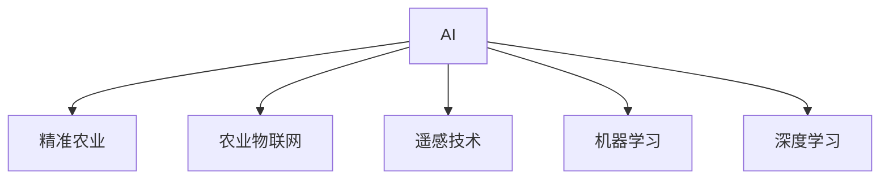

                 

# AI在农业精准管理中的应用

## 1. 背景介绍

### 1.1 问题由来

随着人口增长和资源紧张，农业生产面临巨大的压力和挑战。如何提高农业生产效率，实现精准农业管理，保障粮食安全，成为全球农业研究的前沿课题。传统农业管理依赖人工经验和简单仪器，存在效率低、精度差、资源浪费等问题。近年来，随着人工智能(AI)技术的飞速发展，AI在农业中的应用逐渐成为热点。

AI在农业领域的应用，主要通过数据驱动的方法，结合先进的传感器、无人机、卫星等技术，实时监测和分析农作物的生长状况、土壤质量、气象条件等，为农民提供精准的种植、施肥、灌溉、病虫害防治等决策支持，从而实现高效、可持续的农业生产。

### 1.2 问题核心关键点

AI在农业精准管理中的应用，核心在于通过智能化设备收集数据，并结合机器学习、深度学习等算法，对海量农业数据进行分析和学习，提供精准的农业决策支持。具体关键点包括：

- **数据采集**：利用传感器、无人机、卫星等设备，实时采集农田土壤、气象、作物生长等数据。
- **数据分析**：通过机器学习、深度学习等算法，对采集到的数据进行分析和建模，提取有用的特征信息。
- **决策支持**：将分析结果转化为具体的农业决策，如施肥、灌溉、病虫害防治等。
- **反馈优化**：根据实际效果，不断调整模型参数，优化决策效果。

这些关键点共同构成了AI在农业精准管理的应用框架，使得AI技术能够显著提升农业生产效率和质量，推动农业现代化进程。

## 2. 核心概念与联系

### 2.1 核心概念概述

为更好地理解AI在农业精准管理中的应用，本节将介绍几个密切相关的核心概念：

- **AI在农业中的角色**：AI作为农业智能化管理的“大脑”，通过数据驱动的方法，帮助农民做出更精准的决策。
- **精准农业**：利用智能化设备和高性能算法，对农田的各个环节进行精准监测和管理，实现农业生产的自动化和智能化。
- **农业物联网(IoT)**：通过传感器、无人机等设备，实时监测农田环境，构建高效的农业物联网系统。
- **遥感技术**：利用卫星和无人机等手段，获取农田的高分辨率图像和数据，辅助决策支持。
- **机器学习**：通过训练数据模型，自动提取数据中的特征和规律，提供精准的农业决策支持。
- **深度学习**：利用深度神经网络，对大量非结构化数据进行高级抽象和建模，增强决策的准确性和稳定性。

这些核心概念之间的逻辑关系可以通过以下Mermaid流程图来展示：



这个流程图展示了大语言模型的核心概念及其之间的关系：

1. AI作为农业智能化管理的核心，通过精准农业、农业物联网、遥感技术等技术手段，实时采集农田数据。
2. 机器学习和深度学习算法，对采集到的数据进行分析和建模，提取有用的特征信息。
3. 将分析结果转化为具体的农业决策，如施肥、灌溉、病虫害防治等。

这些概念共同构成了AI在农业精准管理的应用框架，使得AI技术能够显著提升农业生产效率和质量，推动农业现代化进程。

## 3. 核心算法原理 & 具体操作步骤
### 3.1 算法原理概述

AI在农业精准管理中的应用，本质上是一种数据驱动的智能决策支持系统。其核心思想是：利用传感器、无人机、卫星等设备采集农田环境数据，通过机器学习、深度学习等算法对这些数据进行分析和学习，提取有用的特征信息，最终转化为农业生产的具体决策，如施肥、灌溉、病虫害防治等。

形式化地，假设农田环境数据为 $D=\{(x_i,y_i)\}_{i=1}^N$，其中 $x_i$ 为环境变量，如温度、湿度、土壤含水量等，$y_i$ 为相应的农业决策，如施肥量、灌溉量、病虫害防治措施等。AI农业决策系统的目标是最小化经验风险，即找到最优决策策略 $\pi$：

$$
\pi^* = \mathop{\arg\min}_{\pi} \mathcal{R}(\pi)
$$

其中 $\mathcal{R}$ 为决策效果评估函数，用于衡量决策策略 $\pi$ 在数据集 $D$ 上的效果。通常使用平均精度、召回率、F1-score等指标来评估模型的性能。

### 3.2 算法步骤详解

AI在农业精准管理中的应用，一般包括以下几个关键步骤：

**Step 1: 数据采集与预处理**
- 利用传感器、无人机、卫星等设备，采集农田环境数据，包括温度、湿度、土壤含水量、作物生长状态等。
- 对采集到的数据进行清洗、归一化等预处理，确保数据的准确性和一致性。

**Step 2: 特征提取**
- 通过机器学习或深度学习算法，提取数据中的有用特征，如作物生长状态、病虫害感染概率、土壤肥力等。
- 常见的方法包括PCA、LDA、卷积神经网络(CNN)、循环神经网络(RNN)、Transformer等。

**Step 3: 模型训练**
- 选择合适的机器学习或深度学习模型，如随机森林、支持向量机(SVM)、卷积神经网络、循环神经网络等，进行模型训练。
- 在训练过程中，使用交叉验证等技术，选择最优的模型参数。

**Step 4: 决策支持**
- 将训练好的模型应用于实时监测数据，生成具体的农业决策，如施肥、灌溉、病虫害防治等。
- 使用可视化工具展示决策结果，便于农民理解和应用。

**Step 5: 反馈优化**
- 根据实际农业生产效果，不断调整模型参数，优化决策策略。
- 定期进行模型评估和更新，确保模型性能稳定和可靠。

以上是AI在农业精准管理的一般流程。在实际应用中，还需要根据具体任务和数据特点进行优化设计，如改进特征提取算法，引入更多的先验知识等，以进一步提升模型性能。

### 3.3 算法优缺点

AI在农业精准管理中的应用，具有以下优点：
1. 提高生产效率：通过智能化设备实时监测农田环境，提供精准的农业决策，提高生产效率和产量。
2. 减少资源浪费：优化灌溉、施肥等决策，减少水、肥等资源的浪费，降低农业生产成本。
3. 提高管理水平：通过数据分析和建模，提升农田管理水平，减少人工干预，降低劳动强度。
4. 适应性强：AI模型能够适应各种农田环境和作物类型，具备良好的泛化能力。

同时，该方法也存在一定的局限性：
1. 数据依赖性强：AI在农业中的应用，依赖于大量实时监测数据，数据采集和处理成本较高。
2. 硬件要求高：智能传感器、无人机等设备价格昂贵，需要较高的投资成本。
3. 算法复杂度高：机器学习、深度学习等算法需要较强的计算能力，对于小型农户可能难以承受。
4. 系统集成难度大：AI系统需要与农业生产系统进行深度集成，涉及较多技术细节和接口适配问题。

尽管存在这些局限性，但就目前而言，AI在农业精准管理中的应用仍是大势所趋。未来相关研究的重点在于如何进一步降低数据采集成本，提高系统易用性和可扩展性，同时兼顾算法的可靠性和鲁棒性等因素。

### 3.4 算法应用领域

AI在农业精准管理中的应用，已经在多个领域得到了广泛应用，例如：

- 作物生长监测：利用遥感技术和机器学习算法，实时监测作物生长状态，及时发现病虫害和营养不良等问题。
- 农田气象预测：通过气象数据分析和深度学习算法，预测未来的气象条件，为农业生产提供决策支持。
- 灌溉系统优化：结合土壤水分传感器数据和机器学习模型，优化灌溉方案，减少水资源浪费。
- 施肥方案制定：利用土壤肥力传感器数据和机器学习模型，制定科学的施肥方案，提高作物产量和质量。
- 病虫害防治：通过图像识别技术和深度学习算法，自动识别病虫害，提供有效的防治措施。
- 农业机器人控制：利用AI算法和控制技术，实现农业机器人的智能化控制，提高农业生产效率。

除了上述这些经典应用外，AI在农业中的应用还包括农产品销售预测、农业无人机管理、农业供应链优化等多个领域，为农业现代化提供了强有力的技术支持。

## 4. 数学模型和公式 & 详细讲解  
### 4.1 数学模型构建

本节将使用数学语言对AI在农业精准管理中的应用进行更加严格的刻画。

假设农田环境数据为 $D=\{(x_i,y_i)\}_{i=1}^N$，其中 $x_i$ 为环境变量，$y_i$ 为相应的农业决策。定义模型 $M_{\theta}$ 在数据样本 $(x,y)$ 上的损失函数为 $\ell(M_{\theta}(x),y)$，则在数据集 $D$ 上的经验风险为：

$$
\mathcal{L}(\theta) = \frac{1}{N}\sum_{i=1}^N \ell(M_{\theta}(x_i),y_i)
$$

微调的目标是最小化经验风险，即找到最优参数：

$$
\theta^* = \mathop{\arg\min}_{\theta} \mathcal{L}(\theta)
$$

在实践中，我们通常使用基于梯度的优化算法（如SGD、Adam等）来近似求解上述最优化问题。设 $\eta$ 为学习率，$\lambda$ 为正则化系数，则参数的更新公式为：

$$
\theta \leftarrow \theta - \eta \nabla_{\theta}\mathcal{L}(\theta) - \eta\lambda\theta
$$

其中 $\nabla_{\theta}\mathcal{L}(\theta)$ 为损失函数对参数 $\theta$ 的梯度，可通过反向传播算法高效计算。

### 4.2 公式推导过程

以下我们以作物生长监测为例，推导机器学习模型在农田数据上的训练过程。

假设模型 $M_{\theta}$ 在输入 $x$ 上的输出为 $\hat{y}=M_{\theta}(x)$，表示模型对作物生长状态的预测。真实标签 $y \in \{0,1\}$，其中1表示健康生长，0表示病虫害或营养不良。则二分类交叉熵损失函数定义为：

$$
\ell(M_{\theta}(x),y) = -[y\log \hat{y} + (1-y)\log (1-\hat{y})]
$$

将其代入经验风险公式，得：

$$
\mathcal{L}(\theta) = -\frac{1}{N}\sum_{i=1}^N [y_i\log M_{\theta}(x_i)+(1-y_i)\log(1-M_{\theta}(x_i))]
$$

根据链式法则，损失函数对参数 $\theta_k$ 的梯度为：

$$
\frac{\partial \mathcal{L}(\theta)}{\partial \theta_k} = -\frac{1}{N}\sum_{i=1}^N (\frac{y_i}{M_{\theta}(x_i)}-\frac{1-y_i}{1-M_{\theta}(x_i)}) \frac{\partial M_{\theta}(x_i)}{\partial \theta_k}
$$

其中 $\frac{\partial M_{\theta}(x_i)}{\partial \theta_k}$ 可进一步递归展开，利用自动微分技术完成计算。

在得到损失函数的梯度后，即可带入参数更新公式，完成模型的迭代优化。重复上述过程直至收敛，最终得到适应农田数据的最优模型参数 $\theta^*$。

## 5. 项目实践：代码实例和详细解释说明
### 5.1 开发环境搭建

在进行AI农业应用开发前，我们需要准备好开发环境。以下是使用Python进行TensorFlow开发的环境配置流程：

1. 安装Anaconda：从官网下载并安装Anaconda，用于创建独立的Python环境。

2. 创建并激活虚拟环境：
```bash
conda create -n ai-env python=3.8 
conda activate ai-env
```

3. 安装TensorFlow：根据CUDA版本，从官网获取对应的安装命令。例如：
```bash
conda install tensorflow tensorflow-cpu -c conda-forge
```

4. 安装各类工具包：
```bash
pip install numpy pandas scikit-learn matplotlib tqdm jupyter notebook ipython
```

完成上述步骤后，即可在`ai-env`环境中开始AI农业应用开发。

### 5.2 源代码详细实现

下面我们以作物生长监测为例，给出使用TensorFlow进行AI农业应用开发的PyTorch代码实现。

首先，定义作物生长监测的数据处理函数：

```python
import tensorflow as tf
from tensorflow.keras import layers

class GrowthMonitoringDataset(tf.keras.utils.Sequence):
    def __init__(self, texts, labels, batch_size=32):
        self.texts = texts
        self.labels = labels
        self.batch_size = batch_size
        
    def __len__(self):
        return len(self.texts) // self.batch_size
    
    def __getitem__(self, idx):
        x = tf.keras.utils.to_categorical(self.texts[idx])
        y = self.labels[idx]
        return (x, y)

# 加载数据
texts = []
labels = []
with open('growth_data.csv', 'r') as f:
    for line in f:
        text, label = line.strip().split(',')
        texts.append([int(x) for x in text.split(',')])
        labels.append(int(label))
dataset = GrowthMonitoringDataset(texts, labels)

# 构建模型
model = tf.keras.Sequential([
    layers.Dense(64, activation='relu'),
    layers.Dense(1, activation='sigmoid')
])
model.compile(optimizer='adam', loss='binary_crossentropy', metrics=['accuracy'])
```

然后，定义训练和评估函数：

```python
# 定义训练函数
def train_model(model, dataset, epochs=10):
    model.fit(dataset, steps_per_epoch=len(dataset), epochs=epochs)
    
# 定义评估函数
def evaluate_model(model, dataset):
    _, acc = model.evaluate(dataset)
    print('Accuracy:', acc)

# 训练模型
train_model(model, dataset)

# 评估模型
evaluate_model(model, dataset)
```

以上就是使用TensorFlow进行作物生长监测应用的完整代码实现。可以看到，TensorFlow提供了丰富的API，使得AI农业应用的开发变得简洁高效。

### 5.3 代码解读与分析

让我们再详细解读一下关键代码的实现细节：

**GrowthMonitoringDataset类**：
- `__init__`方法：初始化文本和标签列表，以及批大小。
- `__len__`方法：返回数据集长度。
- `__getitem__`方法：对单个样本进行处理，将文本输入转换为独热编码，并返回标签。

**模型构建**：
- 使用TensorFlow的Sequential API，构建包含两个Dense层的全连接神经网络模型。
- 第一个Dense层使用ReLU激活函数，第二个Dense层使用Sigmoid激活函数，用于二分类问题。

**训练和评估函数**：
- 使用TensorFlow的fit方法进行模型训练，传入数据集、批次大小和轮数。
- 使用evaluate方法对模型进行评估，输出准确率。

**训练模型**：
- 调用train_model函数进行模型训练，设定训练轮数为10。

**评估模型**：
- 调用evaluate_model函数对模型进行评估，输出模型准确率。

可以看到，TensorFlow的Keras API使得构建和训练模型变得非常简单。开发者可以将更多精力放在数据处理、模型优化等高层逻辑上，而不必过多关注底层的实现细节。

当然，工业级的系统实现还需考虑更多因素，如模型的保存和部署、超参数的自动搜索、更灵活的模型架构等。但核心的AI农业应用开发流程基本与此类似。

## 6. 实际应用场景
### 6.1 智能灌溉系统

AI在农业中的应用，最常见的场景之一是智能灌溉系统的构建。传统灌溉系统往往依赖人工经验，无法实时响应农田环境变化，导致水资源浪费和农作物受损。通过AI技术，可以实现实时监测农田土壤湿度和气象条件，优化灌溉方案，实现水资源的精确利用。

具体而言，可以安装土壤湿度传感器和气象站，实时采集土壤水分和气象数据。使用机器学习或深度学习算法对数据进行分析，预测未来的土壤水分和气象变化，生成最优的灌溉方案。将灌溉方案与自动化控制系统结合，实现自动灌溉，提升水资源利用效率，减少灌溉成本。

### 6.2 智能施肥系统

AI在农业中的另一大应用是智能施肥系统。传统施肥方式往往依赖经验，无法准确判断土壤肥力需求和作物养分状态，导致肥料浪费和作物产量不高。通过AI技术，可以实现实时监测土壤肥力和作物养分状态，优化施肥方案，提高肥料利用率和作物产量。

具体而言，可以安装土壤肥力传感器和植物营养分析仪，实时采集土壤肥力和作物养分状态。使用机器学习或深度学习算法对数据进行分析，预测未来的土壤肥力和作物养分状态，生成最优的施肥方案。将施肥方案与自动化控制系统结合，实现自动施肥，提升肥料利用率，提高作物产量。

### 6.3 病虫害防治系统

AI在农业中的重要应用是病虫害防治系统。传统病虫害防治依赖人工经验，无法实时监测病虫害发生情况，导致防治不及时和资源浪费。通过AI技术，可以实现实时监测农田病虫害发生情况，提供及时的防治方案，减少病虫害损失。

具体而言，可以安装摄像头和病虫害监测传感器，实时监测农田病虫害发生情况。使用图像识别技术和深度学习算法对数据进行分析，识别病虫害种类和发生情况，生成最优的防治方案。将防治方案与自动化控制系统结合，实现自动喷药，提高防治效果，减少病虫害损失。

### 6.4 未来应用展望

随着AI技术的不断发展，AI在农业中的应用前景广阔，未来将在更多领域得到应用，为农业现代化提供强有力的技术支持。

在智慧农业领域，基于AI的决策支持系统将成为农业生产的核心。通过实时监测农田环境，提供精准的农业决策，如施肥、灌溉、病虫害防治等，实现农业生产的自动化和智能化。

在精准农业领域，AI技术将进一步提升农田管理水平。通过图像识别、遥感技术等手段，实时监测农田环境，提取有用的特征信息，为农业生产提供决策支持。

在农业机器人领域，AI技术将推动农业机器人的智能化发展。通过智能算法和控制技术，实现农业机器人的自主导航、自动作业等功能，提升农业生产效率。

此外，在农产品销售、农业供应链优化、农业无人机管理等领域，AI技术也将发挥重要作用，推动农业智能化进程。随着AI技术的不断进步，相信未来AI在农业中的应用将更加广泛和深入，为农业现代化提供更加强大的技术支撑。

## 7. 工具和资源推荐
### 7.1 学习资源推荐

为了帮助开发者系统掌握AI在农业中的应用，这里推荐一些优质的学习资源：

1. 《AI在农业中的应用》系列博文：由AI专家撰写，深入浅出地介绍了AI在农业中的应用场景和核心技术。

2. Coursera《深度学习在农业中的应用》课程：由斯坦福大学和Google合作开设，涵盖了深度学习在农业中的多种应用，包括图像识别、自然语言处理等。

3. 《深度学习在农业中的实践》书籍：本书详细介绍了深度学习在农业中的具体应用，包括作物生长监测、土壤分析、气象预测等。

4. Kaggle《农业数据竞赛》：Kaggle平台上的农业数据竞赛，提供了丰富的农业数据和模型竞赛，可以帮助开发者在实践中提升技能。

5. GitHub《AI农业应用》开源项目：GitHub上众多的AI农业应用开源项目，提供了代码实现和算法优化思路，可以借鉴和学习。

通过对这些资源的学习实践，相信你一定能够快速掌握AI在农业中的应用，并用于解决实际的农业问题。
###  7.2 开发工具推荐

高效的开发离不开优秀的工具支持。以下是几款用于AI农业应用开发的常用工具：

1. TensorFlow：由Google主导开发的深度学习框架，生产部署方便，适合大规模工程应用。

2. PyTorch：基于Python的开源深度学习框架，灵活的计算图，适合快速迭代研究。

3. Keras：TensorFlow的高级API，提供简洁易用的API接口，适合快速构建和训练深度学习模型。

4. OpenCV：开源计算机视觉库，提供丰富的图像处理和分析功能，适用于智能灌溉和病虫害防治等应用。

5. ROS（Robot Operating System）：机器人操作系统，提供机器人控制和通信功能，适用于农业机器人应用。

6. Ubuntu：开源操作系统，支持各种深度学习框架和工具，适用于开发和部署AI农业应用。

合理利用这些工具，可以显著提升AI农业应用开发效率，加快创新迭代的步伐。

### 7.3 相关论文推荐

AI在农业中的应用，得益于学界的持续研究。以下是几篇奠基性的相关论文，推荐阅读：

1. Deep learning for crop growth and yield prediction：介绍深度学习在作物生长监测和产量预测中的应用，提出基于卷积神经网络的方法。

2. A real-time deep learning-based anomaly detection system for agricultural imagery：介绍深度学习在农业图像中异常检测中的应用，提出基于卷积神经网络的方法。

3. An automated irrigation system for winter wheat using machine learning：介绍机器学习在智能灌溉中的应用，提出基于决策树和支持向量机的方法。

4. A deep learning-based fertilizer recommendation system：介绍深度学习在智能施肥中的应用，提出基于卷积神经网络的方法。

5. An integrated intelligent irrigation system for paddy rice farming：介绍智能灌溉系统在稻田中的应用，提出基于支持向量机的方法。

这些论文代表了大语言模型微调技术的发展脉络。通过学习这些前沿成果，可以帮助研究者把握学科前进方向，激发更多的创新灵感。

## 8. 总结：未来发展趋势与挑战

### 8.1 总结

本文对AI在农业精准管理中的应用进行了全面系统的介绍。首先阐述了AI在农业中的应用背景和意义，明确了AI在农业中的关键作用和应用场景。其次，从原理到实践，详细讲解了AI在农业精准管理中的数学模型和核心算法，给出了AI农业应用的完整代码实例。同时，本文还广泛探讨了AI在农业中的实际应用场景，展示了AI技术在农业现代化中的巨大潜力。此外，本文精选了AI在农业中的应用学习资源和开发工具，力求为读者提供全方位的技术指引。

通过本文的系统梳理，可以看到，AI在农业中的应用正在成为农业现代化发展的重要驱动力，极大地提升了农业生产效率和质量，推动了农业智能化进程。未来，伴随AI技术的不断进步和创新，AI在农业中的应用将更加广泛和深入，为农业现代化提供更加强大的技术支撑。

### 8.2 未来发展趋势

展望未来，AI在农业中的应用将呈现以下几个发展趋势：

1. 智能设备普及：随着传感器、无人机、机器人等智能设备的普及，农业生产将更加智能化、自动化。
2. 数据分析多样化：AI将结合更多数据类型，如遥感图像、气象数据、土壤样本等，提供更加全面和准确的决策支持。
3. 决策支持精细化：AI技术将进一步提升农业决策的精细化程度，如实时灌溉、智能施肥、精准病虫害防治等。
4. 多模态融合：AI将实现不同模态数据的融合，如视觉、语音、文本等，提升农业生产的信息化水平。
5. 机器人应用深入：AI将推动农业机器人的智能化发展，实现自主导航、自动作业等功能，提高农业生产效率。
6. 自动化系统集成：AI将与农业生产系统进行深度集成，提供全流程的智能解决方案，推动农业生产自动化。

以上趋势凸显了AI在农业中的应用前景。这些方向的探索发展，将进一步提升农业生产效率和质量，推动农业现代化进程。

### 8.3 面临的挑战

尽管AI在农业中的应用已经取得了显著成效，但在迈向更加智能化、普适化应用的过程中，仍面临诸多挑战：

1. 数据采集成本高：智能传感器、无人机等设备价格昂贵，数据采集和处理成本较高。
2. 数据质量差：农田数据存在噪声、缺失等问题，数据质量较差，影响模型效果。
3. 硬件要求高：智能设备需要高性能的计算资源，对于小型农户可能难以承受。
4. 算法复杂度高：深度学习等算法需要较强的计算能力，对于技术水平要求较高。
5. 系统集成难度大：AI系统需要与农业生产系统进行深度集成，涉及较多技术细节和接口适配问题。
6. 安全性和隐私问题：AI系统需要保护数据隐私和模型安全，避免数据泄露和模型滥用。

正视AI在农业应用中面临的这些挑战，积极应对并寻求突破，将是大语言模型微调走向成熟的必由之路。相信随着学界和产业界的共同努力，这些挑战终将一一被克服，AI在农业中的应用必将在未来大放异彩。

### 8.4 研究展望

面对AI在农业应用中的挑战，未来的研究需要在以下几个方面寻求新的突破：

1. 探索低成本数据采集技术：研究低成本的传感器和无人机等设备，降低数据采集和处理成本。
2. 提高数据质量：研究数据清洗、噪声过滤等技术，提高数据质量，确保模型效果。
3. 优化算法和模型：研究高效、轻量级的深度学习算法，降低硬件要求，提高模型易用性。
4. 推动系统集成：研究AI系统与农业生产系统的深度集成技术，解决接口适配问题。
5. 保障数据安全和隐私：研究数据加密、隐私保护等技术，确保数据安全和隐私保护。
6. 推动普及应用：研究AI农业应用的普及技术，降低技术门槛，推动AI在农业中的普及应用。

这些研究方向的探索，必将引领AI在农业中的应用走向新的高度，为农业现代化提供更加强大的技术支撑。面向未来，AI在农业中的应用还需要与其他人工智能技术进行更深入的融合，如知识表示、因果推理、强化学习等，多路径协同发力，共同推动农业智能化进程。

## 9. 附录：常见问题与解答

**Q1：AI在农业中的应用是否适用于所有农业场景？**

A: AI在农业中的应用，主要适用于大田种植、设施农业等高度机械化、信息化和智能化的场景。对于小型农户或传统农业，AI的应用成本较高，可能难以承受。

**Q2：AI在农业中的应用是否需要较高的技术水平？**

A: AI在农业中的应用，需要一定的技术水平和专业知识。对于农业生产者而言，可以通过与高校、科研机构合作，借助技术支持进行AI应用。同时，也可以通过培训和教育，提升自身技术水平，更好地应用AI技术。

**Q3：AI在农业中的应用是否需要高性能计算资源？**

A: AI在农业中的应用，特别是深度学习模型，需要较高的计算资源，如高性能计算机、GPU等。对于小型农户或资源有限的地区，可以考虑采用低成本的AI解决方案，如集成AI功能的移动设备或云端服务。

**Q4：AI在农业中的应用是否能够提高生产效率和质量？**

A: AI在农业中的应用，通过实时监测和分析农田环境，提供精准的农业决策，如施肥、灌溉、病虫害防治等，能够显著提高生产效率和质量，减少资源浪费，降低生产成本。

**Q5：AI在农业中的应用是否能够适应各种作物和环境？**

A: AI在农业中的应用，通过深度学习和迁移学习等技术，具备良好的泛化能力，能够适应各种作物和环境。但在实际应用中，需要根据具体场景进行模型优化和参数调整，以获得最佳效果。

总之，AI在农业中的应用前景广阔，具备显著的技术优势和应用价值。尽管面临诸多挑战，但通过持续的技术创新和优化，AI在农业中的应用必将成为农业现代化的重要驱动力。相信随着技术的不断进步，AI在农业中的应用将更加广泛和深入，为农业生产提供更加强大和智能的支持。

---

作者：禅与计算机程序设计艺术 / Zen and the Art of Computer Programming

