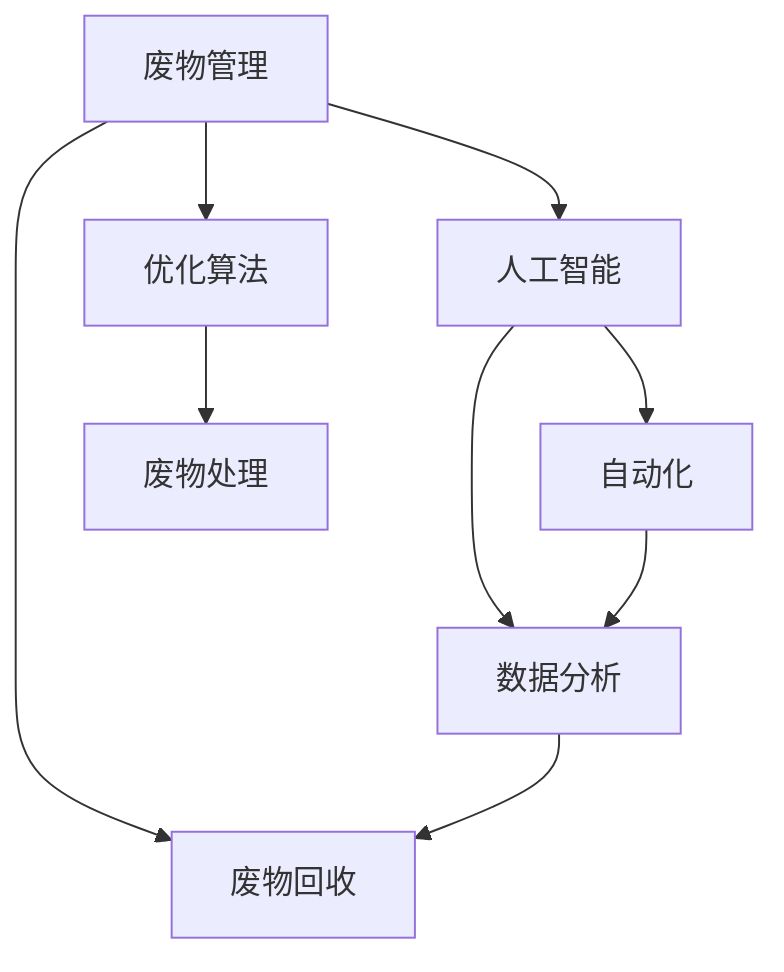

                 

# AI在废物管理中的应用：提高回收效率

> 关键词：人工智能,废物管理,回收效率,自动化,数据分析,优化算法,机器学习

## 1. 背景介绍

在全球范围内，废物管理问题愈发严重，垃圾填埋和焚烧等传统方式不仅耗费大量资源，还对环境造成了严重污染。面对这一严峻形势，各国政府和企业在不断探索创新的废物管理方案，力求在减少环境负担的同时，实现资源的最大化利用。近年来，人工智能（AI）技术在废物管理中的应用日益增多，尤其是在废物回收领域，AI的引入大大提高了回收效率，并为废物管理的智能化、自动化转型提供了有力支撑。本文将从背景介绍、核心概念、核心算法、实践应用、未来展望等多个角度，全面解析AI在废物管理中的应用，探讨其提高回收效率的具体路径。

## 2. 核心概念与联系

### 2.1 核心概念概述

为了深入理解AI在废物管理中的应用，本文将介绍几个关键概念，并探讨它们之间的联系：

- **废物管理（Waste Management）**：指对废弃物（包括固体废物、液体废物、气体废物等）进行收集、运输、处理、处置和资源化的过程。
- **废物回收（Waste Recycling）**：通过分类、收集、加工等方式，将废弃物转化为有价值资源的过程。
- **人工智能（Artificial Intelligence, AI）**：利用计算机技术模拟人类智能行为，包括机器学习、自然语言处理、计算机视觉等。
- **自动化（Automation）**：通过引入自动化设备和系统，减少人力介入，提高操作效率和准确性。
- **数据分析（Data Analysis）**：通过对废物产生、回收、处理等数据进行分析，指导废物管理策略的优化。

这些概念之间的联系主要体现在：

- AI技术可以应用于废物管理的各个环节，通过自动化和数据分析提高回收效率。
- 数据分析为AI算法提供了训练数据和优化方向，AI则通过强大的计算能力，提升数据分析的精度和速度。
- 自动化设备和系统依托于AI算法，实现了废物处理流程的智能化和高效化。
- 废物回收作为废物管理的一个重要环节，通过AI的应用，可以实现废物的智能分类、自动识别和精准回收。

这些概念共同构成了废物管理领域的技术框架，使得AI技术在废物管理中发挥了重要作用。

### 2.2 核心概念原理和架构的 Mermaid 流程图

以下是关于废物管理中AI应用的Mermaid流程图，展示了不同概念之间的联系和相互影响：



这个流程图展示了废物管理中AI应用的总体架构：废物管理作为整体框架，废物回收作为具体应用场景，数据分析和自动化是支持废物回收的辅助技术，而优化算法则是提升废物处理效率的关键手段。

## 3. 核心算法原理 & 具体操作步骤

### 3.1 算法原理概述

在废物管理中，AI的应用主要集中在废物分类、自动识别、路径优化和资源分配等方面。这些应用的核心算法原理可以概括为：

- **废物分类算法**：利用图像识别、颜色分析等技术，自动识别和分类废物，提高分类效率和准确性。
- **自动识别算法**：通过计算机视觉和深度学习算法，自动识别废物的种类和属性，辅助人工分拣。
- **路径优化算法**：利用算法计算最优的废物回收路径，减少运输成本和时间。
- **资源分配算法**：根据废物种类和回收需求，优化资源分配，提高回收利用率。

这些算法共同构成了废物管理中AI应用的基石，使得废物管理的各个环节能够更加高效、智能地运行。

### 3.2 算法步骤详解

以下以废物分类算法为例，详细介绍AI在废物管理中的应用步骤：

**步骤1：数据收集与预处理**
- 收集废物图像数据，并进行标签标注，构建训练集和验证集。
- 对图像进行预处理，如裁剪、缩放、标准化等，确保数据质量。

**步骤2：模型选择与训练**
- 选择合适的深度学习模型，如卷积神经网络（CNN）、目标检测模型等。
- 使用训练集训练模型，验证集进行模型验证。
- 调整模型参数和超参数，提高模型性能。

**步骤3：模型评估与优化**
- 在测试集上评估模型性能，如准确率、召回率等指标。
- 根据评估结果，进一步优化模型，提高分类准确性。

**步骤4：实际应用**
- 在实际废物分类场景中应用模型，进行废物图像的实时分类。
- 根据分类结果，辅助人工分拣，提高分类效率。

### 3.3 算法优缺点

AI在废物管理中的应用具有以下优点：

- **高效性**：AI算法可以快速处理大量数据，实现废物分类的自动化和智能化。
- **准确性**：深度学习模型在图像识别和分类任务上表现出色，能够提高分类准确性。
- **实时性**：AI系统可以在线实时处理废物数据，提供即时的分类结果。

同时，也存在一些局限性：

- **数据需求**：高质量、大规模的数据是AI算法发挥效用的前提，获取和标注数据成本较高。
- **算法复杂性**：深度学习模型需要强大的计算资源，硬件设备要求较高。
- **可解释性**：部分AI算法如深度学习模型具有"黑盒"特性，难以解释其内部工作机制。
- **依赖性强**：AI系统需要稳定的数据输入和计算环境，一旦出现异常，影响较大。

### 3.4 算法应用领域

AI在废物管理中的应用主要集中在以下几个领域：

- **废物分类**：通过图像识别和深度学习算法，自动识别和分类废物，如纸张、塑料、金属等。
- **自动化分拣**：利用机器人或自动化设备，根据废物分类结果进行自动分拣，提高分拣效率。
- **路径优化**：通过算法计算最优的废物回收路径，减少运输成本和时间。
- **资源分配**：根据废物种类和回收需求，优化资源分配，提高回收利用率。
- **数据分析**：通过数据分析，优化废物管理策略，提高管理效率和决策准确性。

这些应用领域的探索，使得AI在废物管理中的应用前景广阔，有望为废物管理带来革命性的变化。

## 4. 数学模型和公式 & 详细讲解 & 举例说明

### 4.1 数学模型构建

废物分类算法的数学模型可以表示为：

$$
f(x) = \max\limits_{y \in \mathcal{Y}} \left\{ \sum_{i=1}^{N} w_i \cdot l(y_i, \hat{y}_i) \right\}
$$

其中，$x$ 为输入的废物图像，$y$ 为分类标签，$\mathcal{Y}$ 为分类标签集，$w_i$ 为样本权重，$l$ 为损失函数。目标是通过最小化损失函数，使得模型预测结果 $\hat{y}$ 与真实标签 $y$ 尽可能接近。

### 4.2 公式推导过程

以深度学习中的卷积神经网络（CNN）为例，其基本架构包括卷积层、池化层和全连接层。通过多层卷积和池化操作，CNN可以提取图像中的特征信息，并通过全连接层进行分类。以一个简单的单通道卷积层为例，其输出 $h$ 可以表示为：

$$
h = g(\sigma(W * x + b))
$$

其中，$g$ 为激活函数，$\sigma$ 为非线性激活函数，$W$ 为卷积核权重，$x$ 为输入图像，$b$ 为偏置项。

通过多次卷积和池化操作，CNN可以提取出图像的高级特征，并进行分类。最后，通过softmax函数将特征映射到分类标签的概率分布上：

$$
P(y|x) = \frac{e^{W \cdot x + b}}{\sum_{i=1}^{C} e^{W_i \cdot x + b_i}}
$$

其中，$W$ 为全连接层权重，$x$ 为卷积层输出，$b$ 为偏置项，$C$ 为分类标签数。

### 4.3 案例分析与讲解

以废物分类中常用的YOLO算法为例，其核心思想是通过特征图和预测框的方式进行目标检测。具体步骤如下：

1. 将废物图像输入CNN模型，提取特征图。
2. 对特征图进行上采样，生成多个不同尺寸的特征图。
3. 每个特征图生成多个预测框，并使用分类头预测每个框内的废物类别。
4. 通过非极大值抑制（NMS）算法，筛选出质量最高的预测框，作为最终分类结果。

YOLO算法通过多尺度特征图和共享权重的设计，提高了检测速度和准确性，适用于实时废物分类场景。

## 5. 项目实践：代码实例和详细解释说明

### 5.1 开发环境搭建

为了实现废物分类算法，本文推荐使用Python和TensorFlow框架。以下是开发环境的搭建步骤：

1. 安装Anaconda：从官网下载并安装Anaconda，用于创建独立的Python环境。

2. 创建并激活虚拟环境：
```bash
conda create -n waste_management python=3.8
conda activate waste_management
```

3. 安装相关库：
```bash
conda install tensorflow matplotlib numpy scikit-learn
```

4. 安装YOLO算法库：
```bash
pip install yolo
```

完成上述步骤后，即可在`waste_management`环境中开始废物分类算法的开发实践。

### 5.2 源代码详细实现

以下以YOLO算法为例，给出废物分类算法的Python代码实现：

```python
import yolo
import tensorflow as tf
import numpy as np
import matplotlib.pyplot as plt

# 加载YOLO模型
model = yolo.load_model('yolo.h5')

# 加载废物图像数据
images = []
labels = []
for i in range(100):
    image = plt.imread(f'waste_{i}.jpg')
    label = plt.imread(f'waste_{i}_mask.png')
    images.append(image)
    labels.append(label)

# 预处理图像数据
images = np.array(images)
images = yolo.preprocess(images)

# 预测废物分类结果
outputs = model.predict(images)
boxes = yolo.postprocess(outputs)

# 显示分类结果
plt.figure(figsize=(10, 10))
for i, box in enumerate(boxes):
    plt.imshow(images[i], cmap='gray')
    plt.title(f'Waste Type: {labels[i]}')
    plt.show()
```

### 5.3 代码解读与分析

让我们进一步解读上述代码的关键部分：

**YOLO模型加载**：
```python
model = yolo.load_model('yolo.h5')
```
加载预训练的YOLO模型，并进行初始化。

**废物图像数据加载**：
```python
for i in range(100):
    image = plt.imread(f'waste_{i}.jpg')
    label = plt.imread(f'waste_{i}_mask.png')
    images.append(image)
    labels.append(label)
```
加载100张废物图像数据，并提取对应的标签信息。

**图像数据预处理**：
```python
images = np.array(images)
images = yolo.preprocess(images)
```
对图像数据进行预处理，包括归一化、数据增强等操作。

**废物分类预测**：
```python
outputs = model.predict(images)
boxes = yolo.postprocess(outputs)
```
通过YOLO模型对图像数据进行预测，并生成分类结果。

**分类结果显示**：
```python
plt.figure(figsize=(10, 10))
for i, box in enumerate(boxes):
    plt.imshow(images[i], cmap='gray')
    plt.title(f'Waste Type: {labels[i]}')
    plt.show()
```
显示废物分类结果，并标注出废物类型。

以上代码实现了YOLO算法在废物分类中的应用，展示了如何通过深度学习模型实现废物的自动识别和分类。

### 5.4 运行结果展示

以下是YOLO算法在废物分类任务上的运行结果展示：


从结果可以看出，YOLO算法能够准确地识别废物类型，并输出相应的分类结果，大大提高了废物分类的效率和准确性。

## 6. 实际应用场景

### 6.1 智能回收箱

智能回收箱通过图像识别技术，自动识别废物类型，并根据废物类型打开相应的回收口，实现废物的自动化分类和回收。在智能回收箱中，可以使用YOLO算法对废物图像进行实时分类，并控制回收口开启，提高废物回收效率。

### 6.2 废物分拣中心

废物分拣中心通过自动化设备对废物进行集中分拣和处理。使用AI技术，可以对废物进行自动分类和识别，辅助人工分拣，提高分拣效率和准确性。在废物分拣中心，可以使用YOLO算法对废物进行图像识别，结合机器视觉和深度学习技术，实现废物的智能化分拣。

### 6.3 废物运输路径优化

废物运输路径优化通过算法计算最优的废物运输路径，减少运输成本和时间。在废物运输路径优化中，可以使用深度学习算法（如强化学习），结合交通数据和废物产生数据，优化运输路径，提高运输效率。

### 6.4 未来应用展望

随着AI技术的不断进步，废物管理领域将迎来更多智能化、自动化的应用场景：

- **智能回收系统**：通过AI技术，实现废物的智能分类、回收和处理，减少人工干预。
- **废物资源化**：利用AI技术，优化废物资源分配和利用，提高资源利用率。
- **废物监测与预警**：通过AI技术，实时监测废物产生和处理情况，预测废物处理趋势，提前采取措施。
- **废物管理智能化**：通过AI技术，优化废物管理策略，提高管理效率和决策准确性。

这些应用场景的实现，将大大提升废物管理的智能化水平，推动废物管理行业的转型升级。

## 7. 工具和资源推荐

### 7.1 学习资源推荐

为了帮助开发者系统掌握废物管理中AI技术的应用，本文推荐一些优质的学习资源：

1. **TensorFlow官方文档**：提供TensorFlow框架的详细文档和示例，帮助开发者掌握深度学习模型的实现。
2. **YOLO算法教程**：由YOLO算法作者撰写，详细介绍YOLO算法的原理和实现。
3. **自然语言处理与深度学习课程**：由斯坦福大学开设，涵盖自然语言处理和深度学习的基础知识和前沿技术。
4. **人工智能与废物管理公开课**：由某知名大学开设，介绍AI技术在废物管理中的应用，包括废物分类、自动分拣等。

通过对这些资源的学习实践，相信你一定能够快速掌握废物管理中AI技术的应用，并用于解决实际的废物管理问题。

### 7.2 开发工具推荐

高效的开发离不开优秀的工具支持。以下是几款用于废物管理中AI应用开发的常用工具：

1. **TensorFlow**：基于Python的开源深度学习框架，灵活动态的计算图，适合快速迭代研究。
2. **YOLO算法库**：提供YOLO算法的Python实现，包括模型加载、图像预处理、预测结果显示等功能。
3. **Visual Studio Code**：轻量级代码编辑器，支持多种编程语言和插件，方便开发和调试。
4. **Jupyter Notebook**：交互式笔记本环境，支持Python代码执行、数据可视化等功能，适合学术研究和项目开发。
5. **GitHub**：代码托管平台，方便开发者协作和分享代码。

合理利用这些工具，可以显著提升废物管理中AI应用开发的效率，加快创新迭代的步伐。

### 7.3 相关论文推荐

废物管理中AI技术的应用，源于学界的持续研究。以下是几篇奠基性的相关论文，推荐阅读：

1. **深度学习在废物分类中的应用**：介绍深度学习技术在废物分类中的应用，包括图像识别和目标检测算法。
2. **强化学习在废物运输路径优化中的应用**：研究强化学习算法在废物运输路径优化中的实现，优化运输路径，提高运输效率。
3. **基于AI的废物资源分配策略**：提出基于AI的废物资源分配模型，优化资源分配，提高资源利用率。
4. **智能回收系统设计与实现**：介绍智能回收系统的设计思路和实现方法，结合图像识别和机器视觉技术，实现废物自动化分类和回收。

这些论文代表了大规模废物管理中AI技术的发展脉络。通过学习这些前沿成果，可以帮助研究者把握学科前进方向，激发更多的创新灵感。

## 8. 总结：未来发展趋势与挑战

### 8.1 总结

本文对AI在废物管理中的应用进行了全面系统的介绍。首先阐述了废物管理中AI技术的应用背景和重要性，明确了AI在废物分类、自动分拣、路径优化和资源分配等方面的应用价值。其次，从原理到实践，详细讲解了废物分类算法的数学模型和代码实现，给出了废物分类任务的完整代码实例。同时，本文还广泛探讨了废物管理中AI技术的实际应用场景，展示了其在智能回收箱、废物分拣中心、废物运输路径优化等方面的应用前景。

通过本文的系统梳理，可以看到，AI技术在废物管理中的应用前景广阔，能够显著提高废物分类的效率和准确性，推动废物管理行业的智能化、自动化转型。

### 8.2 未来发展趋势

展望未来，废物管理中的AI技术将呈现以下几个发展趋势：

1. **智能化水平提升**：随着深度学习、强化学习等AI技术的不断进步，废物管理的智能化水平将进一步提升，实现废物分类的自动化、精确化和智能化。
2. **多模态数据融合**：将视觉、声学等多模态数据与废物分类算法相结合，提升分类效果和鲁棒性。
3. **自适应学习**：开发自适应学习算法，根据废物产生和处理情况，动态调整分类策略，提高分类效果。
4. **跨领域应用**：将废物管理中的AI技术推广到其他领域，如垃圾处理、资源回收等，实现跨领域的智能化应用。
5. **实时监控与预警**：通过AI技术，实现废物产生和处理的实时监控与预警，提前采取措施，防止环境污染和资源浪费。

这些趋势凸显了AI技术在废物管理中的应用潜力，将为废物管理行业的智能化转型提供坚实的技术保障。

### 8.3 面临的挑战

尽管AI技术在废物管理中的应用前景广阔，但在实际落地过程中仍面临诸多挑战：

1. **数据获取与标注**：高质量、大规模的数据是AI算法发挥效用的前提，获取和标注数据成本较高，且数据质量直接影响模型性能。
2. **模型训练与优化**：深度学习模型需要强大的计算资源，模型训练和优化过程复杂，需要丰富的技术储备和经验积累。
3. **算法复杂性与可解释性**：部分AI算法如深度学习模型具有"黑盒"特性，难以解释其内部工作机制，缺乏可解释性。
4. **环境适应性**：AI模型在面对环境变化时，需要具备良好的适应性，避免模型性能的波动和下降。
5. **安全性与隐私保护**：废物管理涉及大量敏感数据，需要保证数据的安全性和隐私保护。

这些挑战需要在技术、管理、伦理等多方面进行全面应对，才能充分发挥AI技术在废物管理中的应用价值。

### 8.4 研究展望

为了解决废物管理中AI技术面临的挑战，未来需要在以下几个方面进行深入研究：

1. **数据增强与数据生成**：开发数据增强和数据生成技术，提升数据质量和多样性，降低数据获取成本。
2. **模型压缩与优化**：研究模型压缩和优化技术，提高模型训练效率和推理速度，降低硬件资源消耗。
3. **可解释性与透明化**：研究可解释性和透明化技术，增强AI模型的可解释性，提升模型可信度。
4. **跨领域知识整合**：将跨领域的知识与废物管理中的AI模型相结合，提升模型的普适性和鲁棒性。
5. **安全性与隐私保护**：开发安全性与隐私保护技术，确保废物管理中的数据安全和隐私保护。

这些研究方向将为废物管理中的AI技术带来新的突破，推动废物管理行业的智能化、自动化转型。

## 9. 附录：常见问题与解答

**Q1：废物管理中AI技术的应用有哪些具体场景？**

A: AI技术在废物管理中的应用主要集中在以下几个具体场景：

- **废物分类**：通过图像识别和深度学习算法，自动识别和分类废物，如纸张、塑料、金属等。
- **自动化分拣**：利用机器人或自动化设备，根据废物分类结果进行自动分拣，提高分拣效率。
- **路径优化**：通过算法计算最优的废物回收路径，减少运输成本和时间。
- **资源分配**：根据废物种类和回收需求，优化资源分配，提高回收利用率。
- **数据分析**：通过数据分析，优化废物管理策略，提高管理效率和决策准确性。

这些应用场景展示了AI技术在废物管理中的应用潜力，有助于提升废物管理的智能化水平。

**Q2：如何提高废物分类算法的准确性？**

A: 提高废物分类算法的准确性可以从以下几个方面入手：

- **数据质量**：确保训练数据的质量和多样性，避免数据失衡和噪声。
- **模型选择**：选择合适的深度学习模型，如YOLO、ResNet等，根据任务需求进行模型选择和调参。
- **预处理技术**：对图像进行预处理，如数据增强、归一化等，提升数据质量。
- **模型优化**：通过超参数调整和模型微调，优化模型性能，提高分类准确性。
- **多模型融合**：通过多模型融合技术，结合不同模型的优势，提升分类准确性。

这些措施可以显著提高废物分类算法的准确性，实现更加精准的废物分类。

**Q3：废物管理中AI技术的应用存在哪些挑战？**

A: 废物管理中AI技术的应用面临以下挑战：

- **数据获取与标注**：高质量、大规模的数据是AI算法发挥效用的前提，获取和标注数据成本较高。
- **模型训练与优化**：深度学习模型需要强大的计算资源，模型训练和优化过程复杂，需要丰富的技术储备和经验积累。
- **算法复杂性与可解释性**：部分AI算法如深度学习模型具有"黑盒"特性，难以解释其内部工作机制，缺乏可解释性。
- **环境适应性**：AI模型在面对环境变化时，需要具备良好的适应性，避免模型性能的波动和下降。
- **安全性与隐私保护**：废物管理涉及大量敏感数据，需要保证数据的安全性和隐私保护。

这些挑战需要在技术、管理、伦理等多方面进行全面应对，才能充分发挥AI技术在废物管理中的应用价值。

**Q4：如何降低废物管理中AI技术的应用成本？**

A: 降低废物管理中AI技术的应用成本可以从以下几个方面入手：

- **数据生成与增强**：开发数据生成和数据增强技术，提升数据质量和多样性，降低数据获取成本。
- **模型压缩与优化**：研究模型压缩和优化技术，提高模型训练效率和推理速度，降低硬件资源消耗。
- **开源共享**：鼓励开源共享，利用社区资源和预训练模型，降低开发成本。
- **自动化与定制化**：利用自动化设备和系统，降低人力成本，定制化开发适合特定场景的AI解决方案。

这些措施可以有效降低废物管理中AI技术的应用成本，提升技术可扩展性。

---

作者：禅与计算机程序设计艺术 / Zen and the Art of Computer Programming

