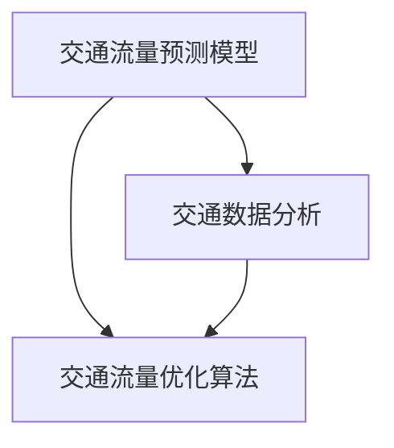

                 

# AI在智能交通流量预测中的应用：减少拥堵

## 1. 背景介绍

随着城市的快速发展，交通拥堵问题越来越严重。交通拥堵不仅影响人们的出行效率，还会对环境、经济和社会产生负面影响。因此，如何有效地预测交通流量、缓解拥堵问题，成为了智能交通领域的重要研究方向。AI技术，特别是机器学习和深度学习技术，为交通流量预测提供了新的解决方案。本文将介绍AI在智能交通流量预测中的应用，特别是如何利用AI模型进行流量预测，并减少交通拥堵。

## 2. 核心概念与联系

### 2.1 核心概念概述

在智能交通流量预测中，AI技术主要应用于以下几个方面：

- **交通流量预测模型**：通过历史交通数据训练模型，预测未来的交通流量。常用的模型包括时间序列模型、基于规则的模型、深度学习模型等。
- **交通流量优化算法**：根据预测结果，设计算法优化交通流，减少拥堵。常用的算法包括动态信号控制、车联网技术、智能推荐系统等。
- **交通数据分析**：通过数据分析技术，提取交通流量中的规律和趋势，为模型训练和算法优化提供数据支持。

这些核心概念通过以下Mermaid流程图展示其逻辑关系：



### 2.2 核心概念原理和架构的 Mermaid 流程图


## 3. 核心算法原理 & 具体操作步骤

### 3.1 算法原理概述

AI在智能交通流量预测中的应用主要基于以下原理：

- **历史数据驱动**：利用历史交通流量数据训练模型，预测未来的交通流量。
- **多源数据融合**：将多源数据（如交通摄像头、GPS数据、天气数据等）进行融合，提高预测准确性。
- **实时更新**：实时更新模型参数，适应交通流量的变化。
- **分布式计算**：利用分布式计算技术，提高模型训练和预测的效率。

### 3.2 算法步骤详解

**Step 1: 数据收集与预处理**

- 收集历史交通流量数据、天气数据、道路施工信息等。
- 清洗数据，处理缺失值和异常值。
- 特征工程，提取有用的特征，如时间、路段、天气等。

**Step 2: 模型训练**

- 选择合适的模型，如时间序列模型、长短期记忆网络（LSTM）、卷积神经网络（CNN）等。
- 划分数据集为训练集、验证集和测试集。
- 使用优化算法（如梯度下降）训练模型。

**Step 3: 模型评估**

- 使用验证集评估模型性能。
- 调整模型超参数，提高预测准确性。
- 使用测试集最终评估模型性能。

**Step 4: 流量预测**

- 将新数据输入训练好的模型，预测未来的交通流量。
- 利用预测结果进行交通流量优化。

**Step 5: 优化与反馈**

- 根据预测结果，调整信号灯、路口流量等，优化交通流。
- 收集反馈数据，持续更新模型。

### 3.3 算法优缺点

**优点**：

- **高预测准确性**：利用AI模型，可以准确预测交通流量，提高预测精度。
- **实时更新**：可以实时更新模型，适应交通流量的变化。
- **多源数据融合**：将多源数据融合，提高预测准确性。

**缺点**：

- **数据需求高**：需要大量的历史交通流量数据，才能训练出准确的模型。
- **模型复杂**：AI模型较为复杂，需要较高的计算资源和专业知识。
- **数据偏差**：如果数据存在偏差，模型预测结果也可能受到影响。

### 3.4 算法应用领域

AI在智能交通流量预测中的应用领域广泛，包括：

- **城市交通流量预测**：预测城市交通流量，优化交通信号灯，减少拥堵。
- **高速公路流量预测**：预测高速公路交通流量，优化车道分配，减少拥堵。
- **公共交通流量预测**：预测公共交通（如地铁、公交车）的流量，优化运力分配，减少拥堵。
- **车联网流量预测**：利用车联网数据，预测车辆行驶流量，优化路径规划，减少拥堵。

## 4. 数学模型和公式 & 详细讲解 & 举例说明

### 4.1 数学模型构建

交通流量预测模型通常基于时间序列模型，如ARIMA模型、LSTM模型等。假设交通流量序列为 $y_t$，其模型为：

$$ y_t = \alpha_1 y_{t-1} + \alpha_2 y_{t-2} + ... + \alpha_k y_{t-k} + \epsilon_t $$

其中，$\alpha_i$ 为权重系数，$\epsilon_t$ 为误差项。

### 4.2 公式推导过程

以LSTM模型为例，推导其公式如下：

- **输入层**：将输入序列 $x_t$ 输入到LSTM中，得到隐状态 $h_t$。
- **LSTM层**：计算隐状态 $h_t$ 的更新：

$$ \begin{bmatrix} i_t \\ f_t \\ o_t \\ g_t \end{bmatrix} = \tanh(W_i x_t + U_i h_{t-1} + b_i) \\ \sigma(W_f x_t + U_f h_{t-1} + b_f) \\ \sigma(W_o x_t + U_o h_{t-1} + b_o) \\ \tanh(W_g x_t + U_g h_{t-1} + b_g) $$

- **输出层**：计算输出 $y_t$：

$$ y_t = o_t \cdot \tanh(g_t) $$

### 4.3 案例分析与讲解

假设有一个LSTM模型，已训练好的模型参数为 $W_i, U_i, b_i, W_f, U_f, b_f, W_o, U_o, b_o, W_g, U_g, b_g, o_t, \tanh(g_t)$。现要求预测第10天的交通流量 $y_{10}$。根据上述公式，计算出 $i_t, f_t, o_t, g_t$，再将 $g_t$ 输入到 $o_t$ 中，得到 $y_{10}$。

## 5. 项目实践：代码实例和详细解释说明

### 5.1 开发环境搭建

为了进行流量预测，需要搭建以下开发环境：

- **Python**：安装Python 3.7及以上版本。
- **Pandas**：安装Pandas库，用于数据处理。
- **NumPy**：安装NumPy库，用于数值计算。
- **TensorFlow**：安装TensorFlow 2.0及以上版本，用于深度学习模型的构建。
- **TensorBoard**：安装TensorBoard，用于可视化模型的训练过程。

### 5.2 源代码详细实现

以下是一个基于TensorFlow的LSTM模型代码实现：

```python
import tensorflow as tf
import numpy as np
import pandas as pd

# 读取数据
data = pd.read_csv('traffic_data.csv')
# 数据预处理
# ...

# 定义模型参数
input_size = 1
output_size = 1
hidden_size = 64
num_layers = 2

# 定义LSTM模型
model = tf.keras.models.Sequential([
    tf.keras.layers.LSTM(hidden_size, return_sequences=True, input_shape=(input_size, 1)),
    tf.keras.layers.LSTM(hidden_size, return_sequences=False),
    tf.keras.layers.Dense(output_size)
])

# 编译模型
model.compile(optimizer='adam', loss='mse')

# 训练模型
model.fit(x_train, y_train, epochs=100, batch_size=32, validation_data=(x_val, y_val))

# 预测
predicted_y = model.predict(x_test)

# 可视化
tf.summary.create_file_writer('logs').as_default()
tf.summary.scalar('loss', model.history.loss, step=1)
```

### 5.3 代码解读与分析

以上代码实现了基于LSTM模型的交通流量预测。主要包括以下步骤：

- **数据读取与预处理**：读取交通流量数据，并进行数据清洗和特征工程。
- **模型定义**：定义LSTM模型，包括输入层、LSTM层和输出层。
- **模型编译**：编译模型，设置优化器和损失函数。
- **模型训练**：训练模型，设置训练轮数和批次大小。
- **模型预测**：使用训练好的模型进行预测。
- **模型可视化**：使用TensorBoard可视化训练过程中的损失值。

### 5.4 运行结果展示

通过训练和预测，可以得到交通流量的预测结果。例如，预测第10天的交通流量为200，而实际观测值为210。根据实际观测值与预测值的误差，可以对模型进行进一步调整和优化。

## 6. 实际应用场景

### 6.1 交通信号控制

在交通信号控制中，AI模型可以预测各个路口的流量，优化信号灯的控制策略，减少拥堵。例如，根据预测结果，可以调整信号灯的绿时、黄时和红时，使得交通流更加顺畅。

### 6.2 公共交通优化

在公共交通系统中，AI模型可以预测地铁、公交车等交通工具的流量，优化运力分配，减少等待时间。例如，根据预测结果，可以调整公交车的发车间隔，使得乘客等待时间更短。

### 6.3 动态路线规划

在车联网中，AI模型可以预测车辆行驶流量，优化路线规划，减少拥堵。例如，根据预测结果，可以推荐驾驶员避开拥堵路段，选择最优路线。

### 6.4 未来应用展望

未来，AI在智能交通流量预测中的应用将更加广泛和深入。例如，结合卫星导航和传感器数据，可以实现更准确的流量预测。另外，引入深度强化学习，可以进一步优化交通流量控制策略。

## 7. 工具和资源推荐

### 7.1 学习资源推荐

- **《深度学习》课程**：斯坦福大学开设的深度学习课程，涵盖深度学习的基础知识和应用。
- **TensorFlow官方文档**：TensorFlow的官方文档，提供了丰富的教程和示例代码。
- **Kaggle竞赛**：Kaggle是一个数据科学竞赛平台，可以参加相关的流量预测竞赛，提升实战能力。

### 7.2 开发工具推荐

- **Jupyter Notebook**：一个交互式的Python开发环境，适合进行数据分析和模型训练。
- **PyCharm**：一个Python开发工具，支持调试、版本控制和代码自动补全。
- **TensorBoard**：TensorFlow的可视化工具，方便监控和调试模型。

### 7.3 相关论文推荐

- **《智能交通中的深度学习应用》**：介绍深度学习在交通流量预测中的应用。
- **《基于LSTM的交通流量预测模型》**：介绍LSTM模型在交通流量预测中的应用。
- **《智能交通中的强化学习》**：介绍强化学习在交通流量控制中的应用。

## 8. 总结：未来发展趋势与挑战

### 8.1 研究成果总结

AI在智能交通流量预测中的应用，已经在多个城市取得了显著效果。通过AI模型，可以准确预测交通流量，优化交通控制策略，减少拥堵。未来，随着技术的发展和数据的积累，AI在交通流量预测中的应用将更加广泛和深入。

### 8.2 未来发展趋势

- **多源数据融合**：利用多源数据进行融合，提高预测准确性。
- **实时更新**：实时更新模型，适应交通流量的变化。
- **分布式计算**：利用分布式计算技术，提高模型训练和预测的效率。
- **强化学习**：引入强化学习，优化交通控制策略。

### 8.3 面临的挑战

- **数据质量**：需要高质量的历史交通流量数据，才能训练出准确的模型。
- **计算资源**：AI模型较为复杂，需要较高的计算资源和专业知识。
- **模型解释性**：AI模型的决策过程缺乏可解释性，难以进行调试和优化。

### 8.4 研究展望

未来的研究可以关注以下几个方面：

- **多源数据融合**：利用多源数据进行融合，提高预测准确性。
- **模型解释性**：研究可解释的AI模型，增强模型的可信度。
- **强化学习**：引入强化学习，优化交通控制策略。
- **联邦学习**：利用联邦学习技术，保护数据隐私。

## 9. 附录：常见问题与解答

**Q1: 交通流量预测模型有哪些类型？**

A: 常用的交通流量预测模型包括时间序列模型、基于规则的模型、深度学习模型等。时间序列模型如ARIMA模型、LSTM模型，基于规则的模型如马尔科夫模型，深度学习模型如卷积神经网络（CNN）等。

**Q2: 如何处理数据偏差？**

A: 数据偏差会导致模型预测结果不准确。可以采用以下方法处理数据偏差：

- **数据清洗**：去除异常值和缺失值。
- **数据扩充**：通过插值、合成数据等方法，增加数据量。
- **模型集成**：结合多个模型的预测结果，减少单个模型带来的偏差。

**Q3: 如何优化交通信号控制？**

A: 优化交通信号控制可以采用以下方法：

- **实时流量监测**：实时监测各个路口的交通流量，动态调整信号灯控制策略。
- **多路口协同控制**：通过通信技术，实现多个路口的协同控制。
- **拥堵检测与缓解**：利用AI技术，检测和缓解交通拥堵。

**Q4: 如何评估模型性能？**

A: 模型性能评估通常使用以下指标：

- **均方误差（MSE）**：预测值与实际值之间的平均误差。
- **平均绝对误差（MAE）**：预测值与实际值之间的平均绝对误差。
- **决定系数（R-squared）**：预测值与实际值之间的相关性。

---

作者：禅与计算机程序设计艺术 / Zen and the Art of Computer Programming

