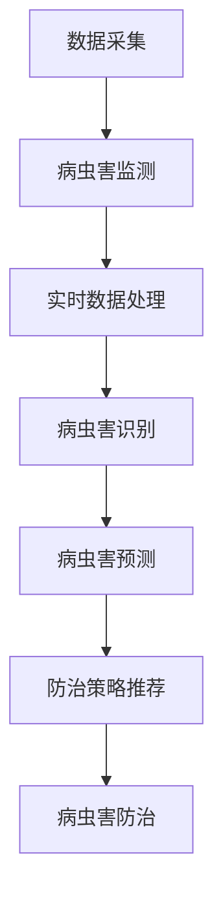

                 

## 1. 背景介绍

### 1.1 问题由来

农业作为人类社会的基础行业，其产量和质量的稳定性直接关系到社会的稳定与发展。然而，农作物病虫害的威胁日益严重，已经成为一个全球性的问题。病虫害不仅造成农作物减产，还导致严重的生态破坏和环境污染。如何高效、精准地防治病虫害，提高农作物产量和质量，成为当前农业领域亟需解决的重大课题。

近年来，随着人工智能（AI）技术的飞速发展，其在农业领域的应用引起了广泛关注。AI技术可以借助大数据、机器学习、深度学习等先进技术，实现病虫害的精准识别和预测，为农业生产提供科学的决策支持。尤其在智能农作物病虫害防治中，AI技术的融入，有望大幅提高防治效率和效果，推动农业产业的现代化和智能化转型。

### 1.2 问题核心关键点

智能农作物病虫害防治的核心问题是如何利用AI技术，在病虫害的识别、预测、监测和防治等方面，提供智能化的解决方案。核心关键点包括：

- **病虫害识别**：利用图像处理、深度学习等技术，自动识别农田中的病虫害，快速准确地检测病虫害发生情况。
- **病虫害预测**：基于历史数据和实时监测信息，预测病虫害的发生趋势，提供预警信息。
- **病虫害监测**：通过传感器、无人机等技术，实时监测农田环境，掌握病虫害动态变化。
- **病虫害防治**：根据病虫害的严重程度，自动推荐防治策略，辅助人工进行精准防治。

这些关键问题通过AI技术的应用，可以实现病虫害防治的自动化、智能化，从而提升农作物产量和质量。

## 2. 核心概念与联系

### 2.1 核心概念概述

在智能农作物病虫害防治中，涉及的核心概念主要包括：

- **人工智能**：一种通过机器学习、深度学习等技术，实现对数据进行学习、推理、决策的技术体系。
- **病虫害识别**：利用图像识别、模式识别等技术，自动识别和分类农田中的病虫害。
- **病虫害预测**：通过时间序列分析、回归分析等方法，预测病虫害的发生趋势和严重程度。
- **病虫害监测**：使用传感器、无人机等技术，实时采集农田环境数据，监控病虫害动态变化。
- **病虫害防治**：根据病虫害的严重程度，自动推荐或人工执行相应的防治措施。

这些核心概念之间相互联系，共同构成了智能农作物病虫害防治的技术体系。

### 2.2 核心概念原理和架构的 Mermaid 流程图



该图展示了智能农作物病虫害防治的基本流程：通过数据采集获取农田环境数据，经过实时数据处理后，利用病虫害识别技术自动识别病虫害，进而通过病虫害预测技术预测病虫害趋势，最后根据预测结果推荐防治策略，并进行防治。

## 3. 核心算法原理 & 具体操作步骤

### 3.1 算法原理概述

智能农作物病虫害防治主要依赖于机器学习和深度学习技术，其中以卷积神经网络（CNN）、循环神经网络（RNN）、长短期记忆网络（LSTM）等深度学习模型应用最为广泛。算法原理主要包括以下几个方面：

- **卷积神经网络（CNN）**：用于图像处理和识别，通过卷积和池化操作提取特征，适合处理空间结构化的数据，如农田图像。
- **循环神经网络（RNN）和长短期记忆网络（LSTM）**：用于时间序列分析，通过记忆机制处理时间依赖关系，适合预测病虫害的发生趋势。
- **注意力机制**：在处理多模态数据时，通过注意力机制综合多源数据，提高预测的准确性和鲁棒性。

### 3.2 算法步骤详解

智能农作物病虫害防治的算法步骤主要包括以下几个方面：

1. **数据采集与预处理**：收集农田环境数据，包括气候、土壤、作物、病虫害等信息，并进行预处理，如数据清洗、归一化等。
2. **病虫害识别**：利用CNN等模型对农田图像进行识别，自动检测病虫害发生情况。
3. **病虫害预测**：通过RNN或LSTM等模型，分析历史数据和实时数据，预测病虫害的发生趋势。
4. **防治策略推荐**：根据病虫害的严重程度和预测结果，自动推荐或人工执行相应的防治措施。
5. **模型评估与优化**：对模型进行评估，并根据评估结果不断优化模型参数，提高模型性能。

### 3.3 算法优缺点

智能农作物病虫害防治算法的主要优点包括：

- **高效自动化**：利用AI技术实现病虫害的自动识别和预测，大大提高了防治效率。
- **精准预测**：基于历史数据和实时监测信息，实现精准预测病虫害的发生趋势，提高了防治的针对性和效果。
- **灵活性高**：可以通过不断学习和优化，提高模型的适应性和鲁棒性，应对多种病虫害类型和变化。

其缺点主要包括：

- **数据需求高**：需要大量的历史数据和实时监测数据，才能进行有效的病虫害预测和防治。
- **算法复杂度高**：模型训练和优化过程较为复杂，对计算资源和专业技能要求较高。
- **实际应用难度大**：模型需要结合具体的农业生产场景进行优化，难以在所有场景下通用。

### 3.4 算法应用领域

智能农作物病虫害防治技术主要应用于以下几个领域：

- **种植业**：如水稻、小麦、玉米等主要农作物的病虫害防治。
- **林业**：如树木病虫害的检测和防治。
- **畜牧业**：如家畜、家禽的疾病防治。
- **渔业**：如鱼类、虾类等水生动植物的病害防治。

## 4. 数学模型和公式 & 详细讲解 & 举例说明

### 4.1 数学模型构建

在智能农作物病虫害防治中，常用的数学模型包括：

- **卷积神经网络（CNN）**：用于病虫害图像识别。
- **循环神经网络（RNN）**：用于时间序列数据预测。
- **支持向量机（SVM）**：用于分类和回归分析。

### 4.2 公式推导过程

以CNN为例，其核心公式包括卷积操作、池化操作、激活函数等：

- **卷积操作**：$$conv(x_i, w_j) = \sum_{i', j'} w_{i', j'} \cdot x_{i', j'}$$
- **池化操作**：$$pool(max(x_{i,j}, x_{i+1,j}, x_{i,j+1}, x_{i+1,j+1}))$$
- **激活函数**：$$ReLU(x) = max(0,x)$$

### 4.3 案例分析与讲解

以病虫害图像识别为例，其步骤如下：

1. **数据准备**：收集大量的病虫害图像数据，并进行标注。
2. **网络构建**：设计CNN网络结构，包括卷积层、池化层、全连接层等。
3. **模型训练**：使用标注数据训练CNN模型，通过反向传播算法更新模型参数。
4. **模型评估**：在测试数据集上评估模型性能，计算准确率、召回率等指标。
5. **模型应用**：将训练好的CNN模型应用于新的病虫害图像，进行自动识别和分类。

## 5. 项目实践：代码实例和详细解释说明

### 5.1 开发环境搭建

在智能农作物病虫害防治的项目实践中，需要进行如下环境配置：

1. **Python环境**：安装Python 3.x版本，确保环境稳定。
2. **深度学习框架**：安装TensorFlow或PyTorch等深度学习框架，支持模型训练和推理。
3. **数据处理工具**：安装Pandas、NumPy等数据处理工具，用于数据预处理和分析。
4. **图像处理库**：安装OpenCV等图像处理库，用于病虫害图像的采集和处理。

### 5.2 源代码详细实现

以下是一个简单的病虫害图像识别代码示例，使用TensorFlow实现：

```python
import tensorflow as tf
from tensorflow.keras import layers, models

# 构建CNN模型
model = models.Sequential([
    layers.Conv2D(32, (3,3), activation='relu', input_shape=(256, 256, 3)),
    layers.MaxPooling2D((2,2)),
    layers.Conv2D(64, (3,3), activation='relu'),
    layers.MaxPooling2D((2,2)),
    layers.Conv2D(128, (3,3), activation='relu'),
    layers.MaxPooling2D((2,2)),
    layers.Flatten(),
    layers.Dense(512, activation='relu'),
    layers.Dense(10, activation='softmax')
])

# 编译模型
model.compile(optimizer='adam', loss='categorical_crossentropy', metrics=['accuracy'])

# 加载数据
train_data = tf.keras.preprocessing.image_dataset_from_directory('train/', batch_size=32, image_size=(256, 256))
test_data = tf.keras.preprocessing.image_dataset_from_directory('test/', batch_size=32, image_size=(256, 256))

# 训练模型
model.fit(train_data, validation_data=test_data, epochs=10)
```

### 5.3 代码解读与分析

代码中，首先使用Sequential模型定义了CNN的层结构，包括卷积层、池化层和全连接层。然后使用compile方法编译模型，指定优化器、损失函数和评估指标。接着使用image_dataset_from_directory方法加载训练和测试数据，并指定批量大小和图像尺寸。最后使用fit方法训练模型，指定训练轮数和验证数据集。

## 6. 实际应用场景

### 6.1 智能监测系统

智能监测系统可以实时采集农田环境数据，包括土壤湿度、温度、光照强度等，通过传感器、无人机等技术手段进行监测。利用实时监测数据，结合历史数据和模型预测结果，智能监测系统可以实时预警病虫害的发生情况，为农作物的病虫害防治提供科学依据。

### 6.2 精准农业

精准农业通过智能监测系统获取的数据，结合病虫害预测和识别结果，自动推荐相应的防治策略，如喷洒农药、施肥等。与传统农业相比，精准农业能够根据实际需求，实现病虫害防治的精细化和智能化，提高农作物的产量和质量。

### 6.3 农产品质量追溯

智能农作物病虫害防治不仅关注病虫害的防治效果，还关注农产品的质量和安全。通过智能监测系统，实时监控农作物生长过程，防止病虫害对农产品造成污染，确保农产品的安全性和质量。

### 6.4 未来应用展望

未来，智能农作物病虫害防治技术将呈现以下几个发展趋势：

1. **多模态数据融合**：将农田图像、传感器数据、天气预报等多源数据进行融合，实现更全面的病虫害监测和预测。
2. **智能化决策支持**：基于AI技术，构建智能化决策支持系统，辅助人工进行病虫害防治决策。
3. **精准农业推广**：将智能农作物病虫害防治技术推广到更多地区，推动农业产业的现代化和智能化转型。
4. **跨领域应用**：将智能农作物病虫害防治技术应用于其他领域，如森林病虫害防治、海洋渔业病害防治等，拓展应用范围。

## 7. 工具和资源推荐

### 7.1 学习资源推荐

1. **《深度学习》课程**：斯坦福大学提供的深度学习课程，涵盖深度学习的基本概念和常用模型，适合入门学习。
2. **TensorFlow官方文档**：TensorFlow官方提供的详细文档，包含模型训练、部署和优化等内容，适合深入学习。
3. **《TensorFlow实战》书籍**：详细介绍TensorFlow的实际应用，涵盖模型构建、训练和优化等内容，适合实战学习。
4. **Kaggle竞赛**：参与Kaggle等数据科学竞赛，通过实际项目训练深度学习和图像处理等技术。

### 7.2 开发工具推荐

1. **TensorFlow**：Google开发的深度学习框架，支持分布式训练和模型部署。
2. **PyTorch**：Facebook开发的深度学习框架，灵活易用，适合研究和原型开发。
3. **OpenCV**：开源计算机视觉库，用于图像处理和识别。
4. **Jupyter Notebook**：交互式开发环境，支持Python代码的编写和运行。

### 7.3 相关论文推荐

1. **《卷积神经网络》论文**：提出卷积神经网络模型，推动深度学习的发展。
2. **《循环神经网络》论文**：提出循环神经网络模型，用于处理时间序列数据。
3. **《支持向量机》论文**：提出支持向量机模型，用于分类和回归分析。

## 8. 总结：未来发展趋势与挑战

### 8.1 研究成果总结

智能农作物病虫害防治技术利用AI技术，实现了病虫害的自动识别和预测，为农业生产提供了科学决策支持，提高了农作物产量和质量。该技术在实际应用中，已经取得了显著的效果，推动了农业产业的现代化和智能化转型。

### 8.2 未来发展趋势

未来，智能农作物病虫害防治技术将朝着以下几个方向发展：

1. **智能化决策支持**：构建智能化决策支持系统，辅助人工进行病虫害防治决策。
2. **多模态数据融合**：将多源数据进行融合，实现更全面的病虫害监测和预测。
3. **跨领域应用**：将智能农作物病虫害防治技术应用于其他领域，拓展应用范围。

### 8.3 面临的挑战

智能农作物病虫害防治技术虽然取得了显著进展，但在实际应用中仍面临以下挑战：

1. **数据需求高**：需要大量的历史数据和实时监测数据，才能进行有效的病虫害预测和防治。
2. **算法复杂度高**：模型训练和优化过程较为复杂，对计算资源和专业技能要求较高。
3. **实际应用难度大**：模型需要结合具体的农业生产场景进行优化，难以在所有场景下通用。

### 8.4 研究展望

未来，智能农作物病虫害防治技术需要在以下几个方面进行深入研究：

1. **多源数据融合**：研究如何将多源数据进行融合，提高模型的准确性和鲁棒性。
2. **模型优化**：研究如何优化模型结构，降低计算资源需求，提高模型训练和推理效率。
3. **跨领域应用**：研究如何将智能农作物病虫害防治技术应用于其他领域，如森林病虫害防治、海洋渔业病害防治等。

## 9. 附录：常见问题与解答

**Q1：智能农作物病虫害防治技术的主要优势是什么？**

A：智能农作物病虫害防治技术的主要优势包括：

- **高效自动化**：利用AI技术实现病虫害的自动识别和预测，大大提高了防治效率。
- **精准预测**：基于历史数据和实时监测信息，实现精准预测病虫害的发生趋势，提高了防治的针对性和效果。
- **灵活性高**：可以通过不断学习和优化，提高模型的适应性和鲁棒性，应对多种病虫害类型和变化。

**Q2：智能农作物病虫害防治技术在实际应用中需要注意哪些问题？**

A：智能农作物病虫害防治技术在实际应用中需要注意以下问题：

- **数据需求高**：需要大量的历史数据和实时监测数据，才能进行有效的病虫害预测和防治。
- **算法复杂度高**：模型训练和优化过程较为复杂，对计算资源和专业技能要求较高。
- **实际应用难度大**：模型需要结合具体的农业生产场景进行优化，难以在所有场景下通用。

**Q3：智能农作物病虫害防治技术未来可能面临哪些挑战？**

A：智能农作物病虫害防治技术未来可能面临以下挑战：

- **数据需求高**：需要更多的数据来提高模型的准确性和鲁棒性。
- **算法复杂度高**：模型训练和优化过程较为复杂，需要更多的计算资源和专业知识。
- **实际应用难度大**：模型需要结合具体的农业生产场景进行优化，难以在所有场景下通用。

**Q4：智能农作物病虫害防治技术如何与其他技术结合？**

A：智能农作物病虫害防治技术可以与其他技术结合，实现更全面、更精准的病虫害防治：

- **物联网技术**：利用物联网技术采集农田环境数据，实现实时监测和预警。
- **区块链技术**：利用区块链技术记录和管理农田数据，确保数据安全性和可信性。
- **人工智能与生物技术结合**：利用AI技术分析病虫害发生机理，结合生物技术进行更有效的防治。

作者：禅与计算机程序设计艺术 / Zen and the Art of Computer Programming

