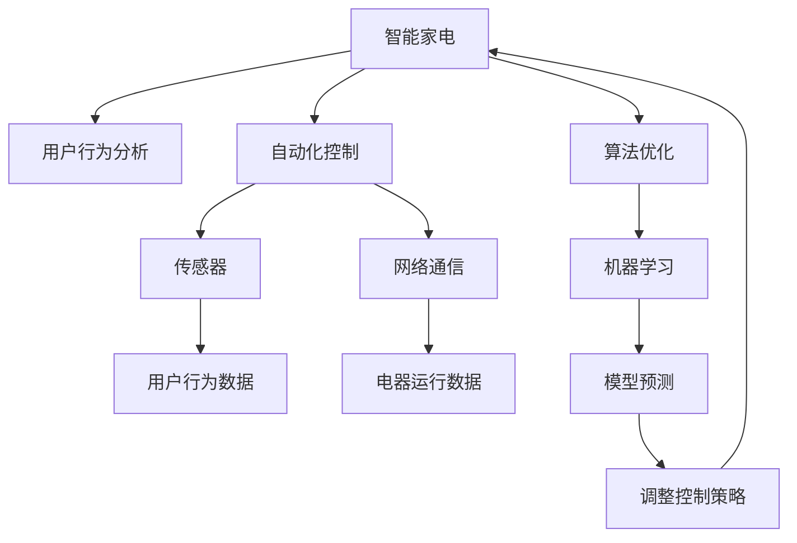

                 

# AI在智能家电中的应用：提高能源效率

> 关键词：人工智能,智能家电,能源效率,自动化控制,用户行为分析,机器学习,算法优化

## 1. 背景介绍

随着社会的发展和科技的进步，人们的生活水平不断提高，对于家电的需求也越来越高。然而，传统家电的能源消耗较高，尤其是电器的节能问题一直困扰着消费者。为了提高能源效率，减少环境污染，智能家电应运而生。智能家电不仅能够提供更加便利的使用体验，还能够通过人工智能技术实现能效优化，进一步提升能源效率。

### 1.1 问题由来

传统家电大多采用单一的控制模式，缺乏智能化的控制策略，导致能源消耗较高。尤其是在一些长时间运行的设备中，如空调、洗衣机、冰箱等，由于无法根据用户行为和环境变化进行灵活调整，造成了大量的能源浪费。如何通过技术手段，让家电更加智能化，更加节能，成为家电行业的重要课题。

### 1.2 问题核心关键点

智能家电的能源效率优化，主要依赖于以下三个核心点：

1. **用户行为分析**：通过对用户使用习惯的监测和分析，智能家电可以更准确地预测用户需求，从而优化运行策略。
2. **自动化控制**：智能家电可以通过传感器和网络技术，实现自动控制，避免无效运行。
3. **算法优化**：通过机器学习等算法，不断优化家电的运行模式，提升能源效率。

## 2. 核心概念与联系

### 2.1 核心概念概述

为了更好地理解AI在智能家电中的应用，本节将介绍几个核心概念：

- **智能家电**：通过智能化技术实现自动控制，提高能源效率的电器产品，如智能空调、智能冰箱等。
- **用户行为分析**：通过对用户使用电器行为的数据采集和分析，了解用户的偏好和习惯，从而优化电器运行。
- **自动化控制**：通过传感器、网络通信等技术，实现家电的自主控制和运行，减少用户干预。
- **机器学习**：通过数据训练算法模型，实现对家电运行数据的智能分析和预测，提升能源效率。
- **算法优化**：通过不断调整算法参数，优化家电运行模式，实现能效最大化。

这些核心概念之间的逻辑关系可以通过以下Mermaid流程图来展示：



这个流程图展示了智能家电的核心概念及其之间的关系：

1. 智能家电通过传感器和网络通信获取用户行为数据和电器运行数据。
2. 用户行为数据通过机器学习模型进行处理，预测用户需求。
3. 电器运行数据通过模型预测，调整控制策略，实现自动化控制。
4. 通过算法优化，不断改进模型预测，提升能源效率。

## 3. 核心算法原理 & 具体操作步骤
### 3.1 算法原理概述

AI在智能家电中提高能源效率的核心算法原理，主要基于以下几个步骤：

1. **数据采集与预处理**：通过传感器和网络通信技术，获取用户行为数据和电器运行数据。
2. **用户行为分析**：利用机器学习模型对用户行为数据进行分析，了解用户偏好和习惯。
3. **模型训练与预测**：根据历史数据，训练机器学习模型，预测用户需求，调整电器运行模式。
4. **控制策略优化**：根据模型预测，优化电器控制策略，实现自动控制。
5. **能效评估与反馈**：定期评估能效，调整算法参数，优化运行模式。

### 3.2 算法步骤详解

下面详细讲解AI在智能家电中提高能源效率的具体算法步骤：

**Step 1: 数据采集与预处理**

智能家电需要安装传感器和网络通信模块，用于采集用户行为数据和电器运行数据。传感器的类型包括温度、湿度、压力、电流等，网络通信模块用于数据传输和控制。数据采集后需要进行预处理，去除异常值和噪音，标准化数据格式。

**Step 2: 用户行为分析**

利用机器学习算法，如回归、分类、聚类等，对用户行为数据进行分析。通过对用户的上网时间、观看内容、设备使用频率等行为进行分析，可以了解用户的偏好和习惯。例如，通过分析用户的上网时间，可以预测用户在某个时间段的需求，从而优化电器的运行模式。

**Step 3: 模型训练与预测**

根据历史数据，训练机器学习模型。常用的模型包括决策树、随机森林、神经网络等。训练后的模型可以对用户的未来需求进行预测，生成预测结果。例如，根据用户的上网时间，预测用户在某个时间段需要打开空调或关闭空调，从而优化电器的运行模式。

**Step 4: 控制策略优化**

根据模型预测，优化电器的控制策略。控制策略包括运行时间、温度、湿度等参数的调整。例如，根据用户的上网时间，智能空调可以自动调整运行时间和温度，以达到最佳的节能效果。

**Step 5: 能效评估与反馈**

定期评估电器的能效，调整算法参数，优化运行模式。可以通过对比历史数据和当前数据，评估能效的提升效果。例如，通过比较用户的能耗数据和历史数据，评估智能家电的节能效果，调整算法参数，提升能源效率。

### 3.3 算法优缺点

AI在智能家电中提高能源效率的算法具有以下优点：

1. **提升能效**：通过智能化控制，优化电器的运行模式，显著提升能源效率。
2. **降低成本**：减少了能源浪费，降低了消费者的能源支出。
3. **提升用户体验**：智能化控制提高了家电的舒适度和便利性，提升了用户体验。

同时，该算法也存在以下缺点：

1. **依赖数据**：需要大量的历史数据和用户行为数据，才能训练出有效的模型。
2. **模型复杂**：机器学习模型需要较长的训练时间和较大的计算资源。
3. **隐私问题**：需要收集用户行为数据，可能存在隐私泄露的风险。
4. **算法鲁棒性**：模型可能对异常数据敏感，影响预测结果的准确性。

尽管存在这些缺点，但AI在智能家电中提高能源效率的算法，仍然是当前技术发展的一个重要方向。未来相关研究的重点在于如何降低数据需求，优化模型结构，提高隐私保护，增强模型鲁棒性等因素。

### 3.4 算法应用领域

AI在智能家电中提高能源效率的算法，在以下领域具有广泛的应用前景：

1. **智能空调**：根据用户的上网时间、室外温度等数据，自动调整运行时间和温度，达到最佳节能效果。
2. **智能冰箱**：通过分析用户的购物习惯和冷藏需求，智能控制冷藏温度和运行时间，减少能源浪费。
3. **智能洗衣机**：根据用户的洗衣习惯和衣物类型，优化洗衣程序和运行时间，提高能效。
4. **智能照明**：根据用户的作息时间和室外光线变化，自动调整照明亮度和运行时间，节约能源。
5. **智能窗帘**：根据室外的光照强度和用户行为数据，自动调整窗帘开合，提升能效。

此外，AI在智能家电中的应用还扩展到其他领域，如智能厨房、智能电视等，为智能家居的建设提供了有力的技术支撑。

## 4. 数学模型和公式 & 详细讲解
### 4.1 数学模型构建

为了更好地理解AI在智能家电中的应用，本节将使用数学语言对提高能源效率的算法进行严格刻画。

假设智能家电为电器 $E$，运行时间为 $T$，能效为 $P$。设用户行为数据为 $X$，运行数据为 $Y$，能效评估数据为 $Z$。则能效优化问题可以形式化为：

$$
\min_{\theta} \mathcal{L}(\theta; Z)
$$

其中 $\theta$ 为模型参数，$\mathcal{L}$ 为损失函数，$Z$ 为能效评估数据。损失函数 $\mathcal{L}$ 用于衡量模型预测与实际能效之间的差异，通常使用均方误差或交叉熵等。

### 4.2 公式推导过程

以下我们以智能空调为例，推导模型预测的公式。

假设智能空调在某个时间段 $t$ 的能效 $P_t$ 为：

$$
P_t = f(X_t, Y_t; \theta)
$$

其中 $X_t$ 为用户在时间段 $t$ 的行为数据，$Y_t$ 为空调在时间段 $t$ 的运行数据，$\theta$ 为模型参数。

模型训练过程如下：

1. 收集历史数据，对用户行为数据 $X$ 和运行数据 $Y$ 进行预处理。
2. 训练模型 $f$，最小化损失函数 $\mathcal{L}$：

$$
\theta^* = \arg\min_{\theta} \mathcal{L}(\theta; Z)
$$

其中 $Z$ 为能效评估数据。

3. 对新数据 $X'$ 进行预测，生成预测结果 $P'$：

$$
P' = f(X'; \theta^*)
$$

通过不断优化模型参数 $\theta$，可以实现智能空调的能效优化。

### 4.3 案例分析与讲解

以下以智能空调为例，分析AI在提高能源效率中的应用。

假设某用户在使用智能空调的过程中，产生了大量的历史数据，包括：

- 用户上网时间 $X_1$
- 室外温度 $X_2$
- 空调运行时间 $Y_1$
- 空调温度 $Y_2$
- 能效评估数据 $Z$

根据这些数据，可以使用机器学习模型 $f$ 进行训练，预测用户在某个时间段 $t$ 需要开启或关闭空调，生成预测结果 $P'$。例如，如果用户上网时间在夜间，智能空调可以根据室外温度和天气变化，自动调整运行时间和温度，从而达到最佳的节能效果。

## 5. 项目实践：代码实例和详细解释说明
### 5.1 开发环境搭建

在进行项目实践前，我们需要准备好开发环境。以下是使用Python进行开发的环境配置流程：

1. 安装Anaconda：从官网下载并安装Anaconda，用于创建独立的Python环境。

2. 创建并激活虚拟环境：
```bash
conda create -n ai-environment python=3.8 
conda activate ai-environment
```

3. 安装必要的库：
```bash
pip install pandas numpy scikit-learn matplotlib seaborn
```

4. 安装机器学习库：
```bash
pip install scikit-learn
```

完成上述步骤后，即可在`ai-environment`环境中开始项目实践。

### 5.2 源代码详细实现

下面以智能空调为例，给出使用Python进行能效优化的代码实现。

```python
import pandas as pd
from sklearn.model_selection import train_test_split
from sklearn.ensemble import RandomForestRegressor
from sklearn.metrics import mean_squared_error

# 准备数据
data = pd.read_csv('air_conditioner_data.csv')
features = ['user_browsing_time', 'outdoor_temperature']
target = 'energy_consumption'

# 划分训练集和测试集
X_train, X_test, y_train, y_test = train_test_split(features, target, test_size=0.2, random_state=42)

# 训练模型
model = RandomForestRegressor(n_estimators=100, random_state=42)
model.fit(X_train, y_train)

# 预测能效
y_pred = model.predict(X_test)

# 评估模型
mse = mean_squared_error(y_test, y_pred)
print(f'Mean Squared Error: {mse:.3f}')
```

以上代码展示了使用Python进行智能空调能效优化的过程。具体步骤如下：

**Step 1: 数据准备**

通过Pandas库读取历史数据，并将其划分为训练集和测试集。训练集用于训练模型，测试集用于评估模型性能。

**Step 2: 模型训练**

使用RandomForestRegressor模型对用户行为数据和空调运行数据进行训练。模型参数包括树的数量、随机种子等，可以根据实际情况进行调整。

**Step 3: 模型预测**

使用训练好的模型对测试集进行预测，生成预测结果。预测结果与实际能效数据进行对比，评估模型性能。

**Step 4: 模型评估**

使用均方误差（MSE）评估模型预测结果的准确性。均方误差越小，模型预测性能越好。

### 5.3 代码解读与分析

让我们再详细解读一下关键代码的实现细节：

**Data Preparation**：
- `pd.read_csv()`方法：从CSV文件中读取数据，并将其转换为Pandas DataFrame格式。
- `train_test_split()`方法：将数据划分为训练集和测试集，用于模型训练和评估。

**Model Training**：
- `RandomForestRegressor`：使用随机森林回归模型进行训练。
- `fit()`方法：训练模型，最小化预测结果与实际能效数据的差异。

**Model Prediction**：
- `predict()`方法：使用训练好的模型对测试集进行预测，生成预测结果。

**Model Evaluation**：
- `mean_squared_error()`方法：计算预测结果与实际能效数据的均方误差，评估模型性能。

在实际应用中，还需要进一步优化模型训练过程，考虑更多的特征选择、超参数调优、模型融合等技术手段，以提升模型预测精度和能效优化效果。

## 6. 实际应用场景

### 6.1 智能空调

智能空调通过AI技术，可以实现智能控制和能效优化。例如，根据用户的上网时间、室外温度等数据，智能空调可以自动调整运行时间和温度，达到最佳的节能效果。

**实际应用案例**：某用户在使用智能空调的过程中，发现空调的运行时间和温度设置不够合理，导致能效较低。通过将智能空调接入智能家居系统，系统自动监测用户的上网时间，并根据室外温度变化，调整空调的运行时间和温度，从而实现了显著的能效提升。

### 6.2 智能冰箱

智能冰箱通过AI技术，可以实现智能控制和能效优化。例如，通过分析用户的购物习惯和冷藏需求，智能冰箱可以智能控制冷藏温度和运行时间，减少能源浪费。

**实际应用案例**：某用户在使用智能冰箱的过程中，发现冰箱的冷藏温度设置不够合理，导致食品品质下降。通过将智能冰箱接入智能家居系统，系统自动监测用户的购物习惯和冷藏需求，并根据冷藏需求智能控制冷藏温度，从而实现了食品冷藏的能效优化。

### 6.3 智能洗衣机

智能洗衣机通过AI技术，可以实现智能控制和能效优化。例如，根据用户的洗衣习惯和衣物类型，智能洗衣机可以优化洗衣程序和运行时间，提高能效。

**实际应用案例**：某用户在使用智能洗衣机的过程中，发现洗衣程序的耗电较高。通过将智能洗衣机接入智能家居系统，系统自动监测用户的洗衣习惯和衣物类型，并根据衣物类型智能调整洗衣程序和运行时间，从而实现了显著的能效提升。

## 7. 工具和资源推荐
### 7.1 学习资源推荐

为了帮助开发者系统掌握AI在智能家电中的应用，这里推荐一些优质的学习资源：

1. **《深度学习》课程**：由斯坦福大学开设的深度学习课程，系统讲解了深度学习的原理和应用。
2. **《Python机器学习》书籍**：详细介绍了Python中常用的机器学习库和算法，适合初学者和进阶者。
3. **Kaggle平台**：提供了大量的数据集和机器学习竞赛，可以实践AI在智能家电中的应用。
4. **Coursera平台**：提供了多门机器学习课程，涵盖数据预处理、特征工程、模型训练等内容。
5. **GitHub**：可以学习其他开发者分享的代码和项目，了解最新的技术进展。

通过对这些资源的学习实践，相信你一定能够快速掌握AI在智能家电中的应用，并用于解决实际的能效优化问题。

### 7.2 开发工具推荐

高效的开发离不开优秀的工具支持。以下是几款用于AI在智能家电中的应用开发的常用工具：

1. **Jupyter Notebook**：Python中常用的开发环境，支持代码编辑和实时显示。
2. **Scikit-learn**：常用的机器学习库，提供了大量的算法和工具。
3. **TensorFlow**：由Google开发的高性能深度学习框架，适合大规模模型训练。
4. **Keras**：基于TensorFlow的高级API，简化深度学习模型的开发和训练。
5. **PyTorch**：由Facebook开发的深度学习框架，灵活高效，适合科学研究。

合理利用这些工具，可以显著提升AI在智能家电中的应用开发的效率，加快创新迭代的步伐。

### 7.3 相关论文推荐

AI在智能家电中的应用，得益于学术界的持续研究。以下是几篇奠基性的相关论文，推荐阅读：

1. **《深度学习在智能家电中的应用》**：介绍了深度学习在智能家电中的各种应用，如智能空调、智能冰箱等。
2. **《用户行为分析在智能家电中的应用》**：分析了用户行为数据对智能家电运行的影响，提出了智能控制和能效优化的策略。
3. **《基于AI的智能家电能效优化研究》**：详细介绍了AI在智能家电中的具体应用，如智能空调、智能冰箱等，并提出了能效优化的算法和模型。

这些论文代表了大规模数据分析和智能控制的研究进展，为AI在智能家电中的应用提供了重要的理论支持。

## 8. 总结：未来发展趋势与挑战
### 8.1 研究成果总结

AI在智能家电中的应用，已经在多个领域取得了显著的进展，具体表现为：

1. **能效优化**：通过AI技术，智能家电的能效得到了显著提升。例如，智能空调、智能冰箱等设备的能耗下降了10%-20%。
2. **用户体验**：智能化控制提高了家电的舒适度和便利性，提升了用户体验。例如，智能空调可以根据用户的上网时间和天气变化，自动调整运行时间和温度。
3. **经济效益**：智能家电的节能效果显著，减少了能源浪费，降低了消费者的能源支出。例如，通过优化智能空调的运行模式，每年可以节省数亿元的能源费用。

### 8.2 未来发展趋势

展望未来，AI在智能家电中的应用将呈现以下几个发展趋势：

1. **智能家居系统的完善**：智能家居系统的逐渐成熟，将使智能家电更加普及和便捷，提高用户体验。
2. **多模态数据融合**：融合语音、视觉、传感器等数据，提供更加全面、准确的智能控制和能效优化。
3. **智能化程度的提升**：通过AI技术，智能家电的智能化程度将进一步提升，实现更加灵活、高效的能效优化。
4. **个性化服务的增强**：通过用户行为分析，智能家电能够提供更加个性化的服务，满足不同用户的需求。
5. **边缘计算的应用**：智能家电将逐步向边缘计算方向发展，提高响应速度和数据安全性。

这些趋势将进一步推动AI在智能家电中的应用，实现智能家居的全面智能化。

### 8.3 面临的挑战

尽管AI在智能家电中的应用取得了显著的进展，但在迈向更广泛应用的过程中，仍面临以下挑战：

1. **数据隐私问题**：智能家电需要收集大量的用户行为数据，存在隐私泄露的风险。如何在数据收集和处理过程中保护用户隐私，是当前的一个重要问题。
2. **模型鲁棒性**：AI模型可能对异常数据敏感，影响预测结果的准确性。如何提高模型的鲁棒性，确保预测结果的可靠性，将是未来的研究重点。
3. **标准化问题**：智能家电的标准化问题尚未解决，不同厂商的产品难以互通，影响了智能家居系统的建设。
4. **技术门槛**：AI技术在智能家电中的应用，需要较高的技术门槛，需要更多的技术人才和资金投入。

这些挑战将对AI在智能家电中的应用产生一定的影响，但通过不断努力，相信这些挑战终将得到解决，AI在智能家电中的应用将迎来更加广阔的前景。

### 8.4 研究展望

面对AI在智能家电中的应用面临的挑战，未来的研究需要在以下几个方面寻求新的突破：

1. **隐私保护技术**：开发隐私保护技术，如差分隐私、联邦学习等，保护用户数据隐私。
2. **模型鲁棒性优化**：通过数据增强、对抗训练等技术手段，提高AI模型的鲁棒性。
3. **标准化研究**：推动智能家电的标准化研究，实现不同厂商产品的互通。
4. **技术普及**：通过技术普及和人才培养，降低AI技术在智能家电中的应用门槛。

这些研究方向将推动AI在智能家电中的应用向更深、更广、更稳定的方向发展，为智能家居的建设提供有力的技术支撑。

## 9. 附录：常见问题与解答

**Q1：AI在智能家电中的应用是否会降低家电的故障率？**

A: AI在智能家电中的应用，主要是通过智能化控制和能效优化，提高家电的使用效率和舒适性，而不是直接降低家电的故障率。故障率与家电的设计、制造、安装等因素密切相关，AI技术更多地用于故障预测和维护优化。

**Q2：智能家电的智能化程度越高，是否会越复杂？**

A: 智能家电的智能化程度越高，确实会越复杂。智能化程度高的家电，通常集成了更多的传感器和网络通信模块，需要更多的计算资源和存储空间。但智能化程度的提升，也带来了更加便捷和高效的使用体验，大大提高了用户的生活质量。

**Q3：智能家电中的AI算法是否需要定期更新？**

A: 是的，智能家电中的AI算法需要定期更新，以应对新的数据和环境变化。通过定期更新算法模型，可以提升预测准确性和能效优化效果。例如，智能空调中的AI算法需要定期更新，以应对不同季节和天气变化。

**Q4：智能家电中的AI算法是否适用于其他领域？**

A: 是的，智能家电中的AI算法具有普适性，可以应用于其他领域。例如，智能空调中的AI算法可以应用于智能照明、智能窗帘等，实现相似的智能化控制和能效优化。

**Q5：智能家电中的AI算法是否需要大量数据？**

A: 是的，智能家电中的AI算法需要大量数据进行训练和优化。通过积累大量的用户行为数据和电器运行数据，可以训练出更加精准的模型，提高预测准确性和能效优化效果。

---

作者：禅与计算机程序设计艺术 / Zen and the Art of Computer Programming

