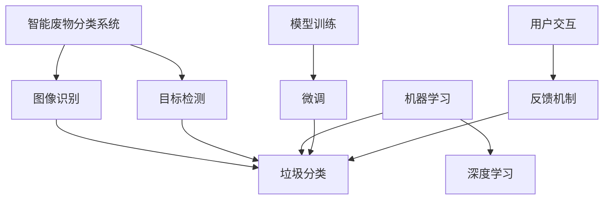

                 

# AI在智能废物分类中的应用：提高回收效率

## 1. 背景介绍

### 1.1 问题由来
在全球化进程中，人类活动对环境的影响愈发显著。废物问题尤其是城市垃圾，成为了困扰各级政府和社区的重要难题。传统的人工作业模式难以应对大规模、复杂化的垃圾处理需求，同时效率低、成本高，且存在数据标注偏差、分拣错误等问题。AI技术的崛起为垃圾分类提供了新的解决方案，通过智能废物分类系统，可以大幅度提高垃圾回收的效率和准确性，助力环保事业的发展。

### 1.2 问题核心关键点
智能废物分类系统主要涉及以下几个关键点：
- **数据标注与预处理**：需要收集大量带有标签的废物样本，并进行清洗、整理，构建训练数据集。
- **模型选择与训练**：选择合适的机器学习或深度学习模型，在标注数据集上训练模型，使其能够识别和分类不同种类的废物。
- **系统集成与部署**：将训练好的模型集成到智能硬件中，部署在垃圾处理站或社区中，进行实际垃圾分类。
- **用户教育与反馈**：通过反馈机制不断提升模型的准确性，同时教育用户进行正确垃圾分类。

### 1.3 问题研究意义
智能废物分类系统的研发，不仅有助于解决城市垃圾处理的紧迫问题，还能够促进环保意识的普及，提升全社会的环保水平。在技术层面，该系统为AI在实际应用场景中的性能提升提供了典型案例，具有重要的理论和实践意义。

## 2. 核心概念与联系

### 2.1 核心概念概述

为更好地理解智能废物分类的实现方式，本节将介绍几个关键概念：

- **智能废物分类系统**：一种基于AI的垃圾识别与分类系统，通过深度学习模型自动识别不同种类的垃圾，辅助用户进行准确分类。
- **机器学习与深度学习**：机器学习通过统计学习方法构建模型，而深度学习在此基础上引入了多层次的非线性映射，适用于处理复杂的高维数据。
- **图像识别与目标检测**：智能废物分类系统常使用图像识别和目标检测技术，识别并分类不同种类的废物。
- **模型训练与微调**：在收集到的废物数据上进行模型训练，同时根据特定场景进行微调，以适应实际垃圾分类的需求。
- **用户交互与反馈**：用户通过与系统交互，提供反馈信息，用于模型性能的不断提升。

这些核心概念之间的逻辑关系可以通过以下Mermaid流程图来展示：



这个流程图展示了智能废物分类系统的核心组件及其相互关系：

1. 系统通过图像识别和目标检测技术识别废物。
2. 利用机器学习和深度学习模型对废物进行分类。
3. 模型训练与微调优化分类效果。
4. 用户交互与反馈提升模型性能。

## 3. 核心算法原理 & 具体操作步骤

### 3.1 算法原理概述

智能废物分类的核心算法原理基于深度学习中的卷积神经网络(CNN)和循环神经网络(RNN)等模型，通过在大量带有标签的废物数据集上进行训练，使模型能够自动提取废物特征并进行分类。具体过程如下：

1. **数据收集与预处理**：收集城市垃圾的图像数据，并进行预处理，如去噪、归一化、增强等操作。
2. **模型训练**：利用预处理后的数据集训练深度学习模型，学习废物的特征表示。
3. **模型微调**：根据特定场景下的垃圾分类需求，对预训练模型进行微调，使其适应当前任务。
4. **系统集成与部署**：将训练好的模型集成到智能废物分类设备中，如垃圾回收箱、智能垃圾车等，部署到垃圾处理站或社区。
5. **用户交互与反馈**：用户将废物投放入智能设备中，系统自动识别并分类废物，同时根据用户反馈不断优化模型性能。

### 3.2 算法步骤详解

基于深度学习的智能废物分类系统一般包括以下几个关键步骤：

**Step 1: 数据收集与标注**
- 收集城市垃圾的高质量图像数据，并进行人工标注，标记每个图像中的垃圾种类。
- 使用常用的数据增强技术，如旋转、翻转、裁剪等，扩充数据集规模。

**Step 2: 数据预处理**
- 对收集的数据进行清洗，去除噪声和无关信息。
- 对图像进行归一化、标准化处理，保证模型输入的一致性。
- 使用数据增强技术提升模型泛化能力。

**Step 3: 模型选择与训练**
- 选择合适的深度学习模型，如卷积神经网络(CNN)、卷积长短期记忆网络(CLSTM)等。
- 利用预处理后的数据集对模型进行训练，优化模型参数。

**Step 4: 模型微调**
- 根据具体垃圾分类场景，对预训练模型进行微调，调整网络结构或参数。
- 利用少量标注数据，使用小批量随机梯度下降(SGD)等优化算法进行微调。

**Step 5: 系统集成与部署**
- 将训练好的模型部署到智能废物分类设备中。
- 实时采集废物图像，通过预处理和特征提取，输入到模型中进行分类。

**Step 6: 用户交互与反馈**
- 用户将废物投入智能设备，设备自动分类并记录结果。
- 系统收集用户反馈，用于模型性能的进一步提升。

### 3.3 算法优缺点

智能废物分类系统基于深度学习的实现，具有以下优点：
- **高精度**：深度学习模型能够自动提取废物特征，进行准确分类。
- **自动化**：系统自动化程度高，可以持续运行，减少人力成本。
- **泛化能力强**：数据增强技术提升了模型的泛化能力，能较好适应不同场景。

同时，该系统也存在一些缺点：
- **数据标注成本高**：高精度的模型训练需要大量标注数据，成本较高。
- **模型复杂度高**：深度学习模型复杂，计算资源需求高。
- **反馈机制设计困难**：用户反馈机制设计不当可能影响模型效果。

尽管存在这些局限性，但智能废物分类系统在提高回收效率、减少人力成本、提升分类准确性等方面展现了显著的优势，具有广泛的应用前景。

### 3.4 算法应用领域

智能废物分类系统主要应用于以下领域：

- **城市垃圾处理站**：在城市垃圾处理站安装智能分类设备，对垃圾进行自动化分类，提高回收效率。
- **社区垃圾分类点**：在社区设置智能垃圾分类点，教育居民正确分类，提高垃圾回收率。
- **商业机构**：为商场、酒店等商业机构提供智能垃圾分类设备，提升环保意识。
- **学校与医院**：为学校和医院配备智能垃圾分类设备，促进垃圾分类习惯的培养。

这些应用场景展示了智能废物分类系统的广泛适用性，对于推动社会环保意识的提升具有重要意义。

## 4. 数学模型和公式 & 详细讲解 & 举例说明

### 4.1 数学模型构建

智能废物分类系统的数学模型基于深度学习中的卷积神经网络(CNN)，其目标函数为最小化分类误差。假设有$N$个带有标签的训练样本，每个样本$(x_i, y_i)$，其中$x_i$为输入图像，$y_i$为对应的标签。定义模型为$M_{\theta}(x)$，其中$\theta$为模型参数。模型的分类误差为：

$$
\mathcal{L}(\theta) = \frac{1}{N}\sum_{i=1}^N \mathbb{1}(y_i \neq M_{\theta}(x_i))
$$

其中$\mathbb{1}$为示性函数，表示分类结果是否正确。

### 4.2 公式推导过程

以二分类为例，假设模型输出为$M_{\theta}(x) \in [0,1]$，真实标签$y \in \{0,1\}$。交叉熵损失函数定义为：

$$
\ell(M_{\theta}(x),y) = -[y\log M_{\theta}(x) + (1-y)\log (1-M_{\theta}(x))]
$$

总损失函数为：

$$
\mathcal{L}(\theta) = -\frac{1}{N}\sum_{i=1}^N \ell(M_{\theta}(x_i),y_i)
$$

在训练过程中，通过反向传播算法计算梯度，使用梯度下降等优化算法更新模型参数$\theta$：

$$
\theta \leftarrow \theta - \eta \nabla_{\theta}\mathcal{L}(\theta)
$$

其中$\eta$为学习率，$\nabla_{\theta}\mathcal{L}(\theta)$为损失函数对参数$\theta$的梯度。

### 4.3 案例分析与讲解

以一个简单的智能废物分类系统为例，说明模型的构建和训练过程。

假设我们有一个包含$N=1000$个样本的训练集，其中$500$个样本为塑料，$500$个样本为纸板。使用一个简单的卷积神经网络模型，其中包含2个卷积层和2个全连接层。

1. **数据预处理**：
   - 对图像进行归一化处理，每个像素值在$[0,1]$范围内。
   - 对图像进行随机裁剪，确保模型见到的数据多样性。

2. **模型训练**：
   - 使用交叉熵损失函数进行训练。
   - 每个batch包含$100$个样本，学习率为$0.001$，训练$100$个epoch。
   - 在每个epoch结束时，计算验证集的分类误差，防止过拟合。

3. **模型微调**：
   - 根据具体场景需求，调整网络结构或参数，如增加全连接层，调整卷积核大小等。
   - 使用少量标注数据，进行微调，保持原有模型的泛化能力。

4. **系统集成与部署**：
   - 将训练好的模型集成到智能设备中，实时采集废物图像并进行分类。
   - 系统记录分类结果，并上传至中央服务器，用于数据分析和优化。

5. **用户交互与反馈**：
   - 用户将废物投入智能设备，设备自动分类并记录结果。
   - 系统收集用户反馈，进行模型性能的进一步提升。

通过以上步骤，可以构建一个高效、准确的智能废物分类系统，显著提升废物分类的效率和准确性。

## 5. 项目实践：代码实例和详细解释说明

### 5.1 开发环境搭建

在进行智能废物分类系统开发前，我们需要准备好开发环境。以下是使用Python进行PyTorch开发的环境配置流程：

1. 安装Anaconda：从官网下载并安装Anaconda，用于创建独立的Python环境。

2. 创建并激活虚拟环境：
```bash
conda create -n pytorch-env python=3.8 
conda activate pytorch-env
```

3. 安装PyTorch：根据CUDA版本，从官网获取对应的安装命令。例如：
```bash
conda install pytorch torchvision torchaudio cudatoolkit=11.1 -c pytorch -c conda-forge
```

4. 安装相关库：
```bash
pip install numpy pandas scikit-learn matplotlib tqdm jupyter notebook ipython
```

完成上述步骤后，即可在`pytorch-env`环境中开始项目实践。

### 5.2 源代码详细实现

下面以一个简单的智能废物分类系统为例，给出使用PyTorch实现代码的详细解释。

首先，定义训练函数：

```python
import torch
import torch.nn as nn
import torch.optim as optim
import torchvision.transforms as transforms
import torchvision.datasets as datasets
from torch.utils.data import DataLoader

class Net(nn.Module):
    def __init__(self):
        super(Net, self).__init__()
        self.conv1 = nn.Conv2d(3, 6, 5)
        self.pool = nn.MaxPool2d(2, 2)
        self.conv2 = nn.Conv2d(6, 16, 5)
        self.fc1 = nn.Linear(16 * 5 * 5, 120)
        self.fc2 = nn.Linear(120, 84)
        self.fc3 = nn.Linear(84, 2)

    def forward(self, x):
        x = self.pool(F.relu(self.conv1(x)))
        x = self.pool(F.relu(self.conv2(x)))
        x = x.view(-1, 16 * 5 * 5)
        x = F.relu(self.fc1(x))
        x = F.relu(self.fc2(x))
        x = self.fc3(x)
        return x

net = Net()
criterion = nn.CrossEntropyLoss()
optimizer = optim.SGD(net.parameters(), lr=0.001, momentum=0.9)
```

然后，定义数据预处理和加载函数：

```python
train_dataset = datasets.MNIST(root='./data', train=True, transform=transforms.ToTensor(), download=True)
test_dataset = datasets.MNIST(root='./data', train=False, transform=transforms.ToTensor(), download=True)

def train_step(batch_x, batch_y):
    optimizer.zero_grad()
    output = net(batch_x)
    loss = criterion(output, batch_y)
    loss.backward()
    optimizer.step()
    return loss.item()

def test_step(batch_x, batch_y):
    output = net(batch_x)
    _, predicted = torch.max(output.data, 1)
    total = batch_y.size(0)
    correct = (predicted == batch_y).sum().item()
    accuracy = correct / total
    return accuracy
```

最后，定义训练循环和模型微调：

```python
def train_epoch(net, train_loader, criterion, optimizer, device):
    net = net.to(device)
    net.train()
    train_loss = 0
    for batch_x, batch_y in train_loader:
        batch_x, batch_y = batch_x.to(device), batch_y.to(device)
        loss = train_step(batch_x, batch_y)
        train_loss += loss
    train_loss /= len(train_loader)
    return train_loss

def test_epoch(net, test_loader, device):
    net = net.to(device)
    net.eval()
    test_loss = 0
    correct = 0
    with torch.no_grad():
        for batch_x, batch_y in test_loader:
            batch_x, batch_y = batch_x.to(device), batch_y.to(device)
            output = net(batch_x)
            loss = criterion(output, batch_y)
            test_loss += loss.item()
            _, predicted = torch.max(output.data, 1)
            total = batch_y.size(0)
            correct += (predicted == batch_y).sum().item()
    test_loss /= len(test_loader)
    accuracy = correct / total
    return test_loss, accuracy

epochs = 100
batch_size = 64
device = torch.device('cuda' if torch.cuda.is_available() else 'cpu')

for epoch in range(epochs):
    train_loader = DataLoader(train_dataset, batch_size=batch_size, shuffle=True)
    test_loader = DataLoader(test_dataset, batch_size=batch_size, shuffle=False)
    train_loss = train_epoch(net, train_loader, criterion, optimizer, device)
    test_loss, accuracy = test_epoch(net, test_loader, device)
    print(f'Epoch {epoch+1}, train loss: {train_loss:.3f}, test loss: {test_loss:.3f}, accuracy: {accuracy:.3f}')
```

以上是使用PyTorch对简单智能废物分类系统进行微调的完整代码实现。可以看到，代码实现相对简单，主要涉及模型定义、数据预处理、模型训练和测试等基本流程。

### 5.3 代码解读与分析

让我们再详细解读一下关键代码的实现细节：

**Net类**：
- 定义了一个简单的卷积神经网络模型，包含2个卷积层和3个全连接层。
- 使用PyTorch的`nn.Module`类定义模型，继承自`nn.Module`，方便进行模型定义和操作。

**train_step函数**：
- 在训练过程中，对输入图像进行前向传播，计算损失函数，并反向传播更新模型参数。

**test_step函数**：
- 在测试过程中，对输入图像进行前向传播，计算预测结果和准确率。

**train_epoch和test_epoch函数**：
- 分别在训练和测试数据集上进行epoch迭代，计算训练损失和测试损失及准确率。

**主循环**：
- 循环进行epoch迭代，记录并输出训练损失和测试损失及准确率。

以上代码展示了一个基本的智能废物分类系统的实现过程，通过简单的卷积神经网络模型，对数据进行训练和测试，输出分类结果。

## 6. 实际应用场景

### 6.1 智能废物分类站

智能废物分类站通过高精度的相机和图像处理设备，自动采集废物图像，并利用训练好的模型进行分类。用户只需将废物投入智能设备中，设备自动进行分类并记录，提高了分类的效率和准确性。

### 6.2 社区垃圾分类点

社区垃圾分类点安装智能垃圾箱，用户将废物投入智能设备中，设备自动分类并记录，同时系统根据垃圾分类情况，提供反馈和建议，提升居民垃圾分类的准确性。

### 6.3 商场与酒店

商场和酒店在垃圾分类点安装智能垃圾箱，通过智能设备对垃圾进行分类，提升环保意识和垃圾回收率。

### 6.4 学校与医院

学校和医院在垃圾处理区域安装智能分类设备，通过自动分类系统对垃圾进行处理，提升校园和医疗机构的垃圾分类效率。

## 7. 工具和资源推荐

### 7.1 学习资源推荐

为了帮助开发者系统掌握智能废物分类系统的开发过程，以下是一些优质的学习资源：

1. 《深度学习》系列课程：斯坦福大学开设的深度学习课程，系统讲解了深度学习的基础知识和实现方法。
2. 《TensorFlow实战Google深度学习》：介绍TensorFlow的使用方法和深度学习模型的训练技巧。
3. 《PyTorch深度学习与计算机视觉》：详细介绍了PyTorch的使用方法，并提供了丰富的计算机视觉模型代码。
4. 《智能废物分类技术》：深入讲解智能废物分类的技术实现和应用案例，是开发者学习的重要资料。
5. Kaggle竞赛平台：提供了大量的智能废物分类数据集和竞赛任务，有助于开发者实践和提升。

通过对这些资源的系统学习，相信开发者可以掌握智能废物分类系统的核心技术，并用于解决实际的垃圾分类问题。

### 7.2 开发工具推荐

智能废物分类系统的开发涉及深度学习模型训练和图像处理，以下是一些常用的开发工具：

1. PyTorch：基于Python的开源深度学习框架，支持GPU加速，适合大规模深度学习模型的训练。
2. TensorFlow：由Google主导开发的深度学习框架，生产部署方便，支持多种计算设备。
3. OpenCV：开源计算机视觉库，提供丰富的图像处理和分析功能。
4. Scikit-learn：用于数据预处理和特征提取的Python库，支持多种机器学习算法。
5. Jupyter Notebook：交互式的Python开发环境，支持代码编写和结果展示。

这些工具能够显著提高智能废物分类系统的开发效率，帮助开发者实现高效、稳定的垃圾分类系统。

### 7.3 相关论文推荐

智能废物分类系统的研究发展迅速，以下是几篇重要的相关论文：

1. "Smart Waste Sorting System using Convolutional Neural Networks"：介绍了使用卷积神经网络进行废物分类的技术方法。
2. "Fine-tuning a Pre-trained Model for Garbage Classification"：介绍了基于预训练模型的废物分类方法，并比较了不同模型的效果。
3. "Improving Garbage Classification Accuracy with Data Augmentation"：研究了数据增强技术在废物分类中的应用效果。
4. "Real-time Garbage Sorting using Deep Learning"：介绍了一个实时垃圾分类系统的设计和实现。
5. "An Adaptive Learning Approach for Smart Waste Sorting"：提出了适应性学习的方法，提高废物分类的准确性和鲁棒性。

这些论文代表了智能废物分类系统的最新研究进展，为开发者提供了宝贵的理论基础和技术指导。

## 8. 总结：未来发展趋势与挑战

### 8.1 总结

本文对智能废物分类系统进行了全面系统的介绍。首先阐述了智能废物分类的背景和意义，明确了该系统在提升垃圾回收效率、环保意识等方面的重要价值。其次，从原理到实践，详细讲解了智能废物分类系统的构建过程，包括数据收集、模型训练、微调等关键步骤。最后，展示了智能废物分类系统的实际应用场景和未来发展方向，展示了该技术广阔的应用前景。

通过本文的系统梳理，可以看到，智能废物分类系统通过深度学习和图像识别技术，大幅提升了废物分类的效率和准确性，具有广泛的应用潜力。未来，伴随深度学习技术的不断进步，智能废物分类系统有望在更多领域得到应用，推动环保事业的发展。

### 8.2 未来发展趋势

展望未来，智能废物分类系统将呈现以下几个发展趋势：

1. **深度学习模型优化**：未来的智能废物分类系统将采用更加高效的深度学习模型，如ResNet、Inception等，进一步提升分类精度和速度。
2. **多模态数据融合**：结合视觉、嗅觉等多模态信息，提升废物分类的准确性。
3. **边缘计算**：在智能废物分类设备中集成边缘计算，提升系统响应速度和可靠性。
4. **联邦学习**：利用联邦学习技术，在分散的数据源上进行模型训练，提升数据隐私和安全性。
5. **实时反馈与优化**：通过实时反馈和自适应学习，不断优化废物分类系统，提高分类准确性和鲁棒性。

这些趋势展示了智能废物分类系统未来的技术发展方向，将进一步提升系统性能和应用范围。

### 8.3 面临的挑战

尽管智能废物分类系统具有广阔的应用前景，但在技术落地应用过程中，仍面临一些挑战：

1. **数据标注成本高**：高质量的废物分类数据集需要大量标注工作，成本较高。
2. **模型复杂度高**：深度学习模型计算资源需求高，硬件设备要求较高。
3. **模型泛化能力不足**：模型对不同场景的泛化能力有限，需要针对具体应用场景进行微调。
4. **隐私与伦理问题**：系统需要处理大量的废物数据，如何保障数据隐私和安全，避免数据滥用，是需要解决的重要问题。
5. **系统稳定性与可靠性**：系统需要长时间稳定运行，如何保证系统的稳定性和可靠性，避免系统故障，也是一大挑战。

这些挑战需要进一步的技术研究和实践探索，才能推动智能废物分类系统的广泛应用。

### 8.4 研究展望

未来，智能废物分类系统需要在以下几个方面进行深入研究：

1. **无监督学习**：探索无监督学习方法，利用非结构化数据进行模型训练，降低数据标注成本。
2. **自适应学习**：研究自适应学习方法，适应不同场景下的垃圾分类需求。
3. **多模态融合**：结合多模态数据进行废物分类，提升系统的感知能力和准确性。
4. **联邦学习**：利用联邦学习技术，在分散数据源上进行模型训练，保障数据隐私和安全。
5. **系统优化**：优化模型结构、硬件配置和系统架构，提升系统性能和稳定性。

这些研究方向将进一步推动智能废物分类技术的发展，助力环保事业的进步。

## 9. 附录：常见问题与解答

**Q1：智能废物分类系统如何提升回收效率？**

A: 智能废物分类系统通过深度学习模型自动识别废物类型，减少了人工分类的过程，提高了分类的准确性和效率。同时，系统可以根据实时数据进行动态优化，提升分类的准确性和鲁棒性。

**Q2：智能废物分类系统在训练过程中需要注意哪些问题？**

A: 在训练过程中，需要注意以下几个问题：
1. 数据标注成本高，需要大量高质量的标注数据。
2. 模型计算资源需求高，需要高性能的硬件设备支持。
3. 模型泛化能力有限，需要针对具体场景进行微调。

**Q3：智能废物分类系统在实际应用中需要注意哪些问题？**

A: 在实际应用中，需要注意以下几个问题：
1. 数据隐私和安全问题，需要保护用户的隐私信息。
2. 系统稳定性与可靠性问题，需要保证系统长时间稳定运行。
3. 模型泛化能力不足，需要针对具体场景进行优化。

**Q4：智能废物分类系统未来可能有哪些新发展？**

A: 智能废物分类系统未来可能的新发展包括：
1. 深度学习模型的优化，提升系统的精度和速度。
2. 多模态数据的融合，提升系统的感知能力和准确性。
3. 联邦学习技术的应用，保障数据隐私和安全。

**Q5：智能废物分类系统在实际应用中如何保障数据隐私和安全？**

A: 智能废物分类系统在实际应用中，可以采用以下措施保障数据隐私和安全：
1. 数据加密，防止数据泄露。
2. 访问控制，限制系统访问权限。
3. 数据匿名化，保护用户隐私。

这些问题的解答展示了智能废物分类系统的技术挑战和未来发展方向，有助于开发者更好地理解和应用该技术。

---

作者：禅与计算机程序设计艺术 / Zen and the Art of Computer Programming

