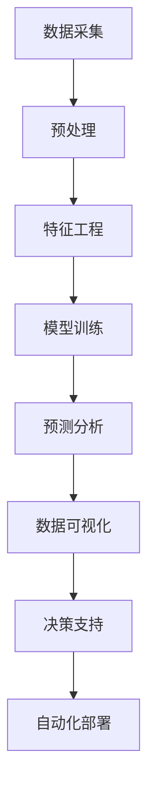

                 

# AI在智能水质监测中的应用：保护水资源

> 关键词：人工智能,智能水务,数据科学,水质监测,环境工程,传感器技术

## 1. 背景介绍

### 1.1 问题由来

随着工业化和城市化进程的加快，全球水资源面临着严重的污染和短缺问题。水质监测作为水资源管理的重要环节，对保障饮用水安全、推动环境治理和促进经济可持续发展具有重要意义。然而，传统的水质监测系统往往依赖人工采集和手动分析，效率低、精度差、响应慢，难以适应复杂多变的水环境监测需求。

近年来，随着人工智能(AI)技术的飞速发展，智能水质监测系统开始逐步替代传统监测方式，凭借其高效、准确、智能的优势，成为水资源保护的重要技术手段。AI在水质监测中的应用，不仅能够提升监测的覆盖面和精度，还能提供丰富的数据支持和决策支持，为水资源管理带来革命性变革。

### 1.2 问题核心关键点

AI在智能水质监测中的应用，主要包括以下几个关键点：

- **数据采集和处理**：通过传感器网络实时采集水质数据，并进行预处理和清洗，为后续分析提供高质量的数据支持。
- **模型训练和预测**：利用机器学习算法对采集到的数据进行建模和训练，预测水质变化趋势，识别污染源和异常情况。
- **数据可视化与决策支持**：将AI模型生成的结果进行可视化展示，为水资源管理部门提供决策依据，辅助政策制定和应急响应。
- **自动化部署和管理**：构建自动化、自适应、高可靠性的智能监测系统，实现水环境监测的智能化、高效化和标准化。

### 1.3 问题研究意义

AI在智能水质监测中的应用，具有以下重要意义：

- **提高监测效率**：AI技术能够自动处理和分析海量数据，大幅提高水质监测的效率和精度，减少人力和时间成本。
- **提升监测准确性**：通过精准的模型训练和预测，AI系统能够更准确地识别水质问题和污染源，提供科学决策支持。
- **促进智能管理**：智能水质监测系统能够实时监控水环境状况，为水资源管理提供动态数据支持，推动智慧水务的发展。
- **应对环境变化**：AI模型具备适应性强的特点，能够应对水环境的变化和突发事件，确保水资源管理的连续性和稳定性。

## 2. 核心概念与联系

### 2.1 核心概念概述

为更好地理解AI在水质监测中的应用，本节将介绍几个密切相关的核心概念：

- **人工智能(AI)**：使用计算机算法模拟人类的智能行为，实现自主感知、学习、推理和决策。
- **机器学习(ML)**：通过数据驱动的方法，训练模型以自动预测和决策，广泛应用于模式识别、预测分析和数据挖掘等领域。
- **深度学习(DL)**：基于多层神经网络的机器学习方法，擅长处理复杂、高维、非线性的数据，广泛应用于图像识别、自然语言处理等任务。
- **传感器网络(SN)**：由多种传感器组成的网络，实现实时采集环境数据，为AI模型提供数据来源。
- **数据科学(DS)**：结合数学、统计学、计算机科学和业务领域知识，通过数据处理和分析实现决策支持，广泛应用于商业智能、精准营销等领域。

这些核心概念之间的逻辑关系可以通过以下Mermaid流程图来展示：



这个流程图展示了大语言模型微调的各个核心概念及其之间的关系：

1. 数据采集和处理，为模型训练提供高质量的数据。
2. 特征工程，将原始数据转化为模型可接受的输入。
3. 模型训练，通过数据驱动的机器学习算法，训练出预测模型。
4. 预测分析，利用训练好的模型进行水质预测和异常检测。
5. 数据可视化，将模型输出结果以直观的形式展示，辅助决策。
6. 决策支持，为水资源管理部门提供决策依据。
7. 自动化部署，构建智能、高效、可靠的水质监测系统。

这些概念共同构成了AI在水质监测中的核心框架，使其能够实现高效、准确、智能的水质监测和分析。通过理解这些核心概念，我们可以更好地把握AI在水质监测中的应用逻辑和优化方向。

## 3. 核心算法原理 & 具体操作步骤

### 3.1 算法原理概述

AI在水质监测中的应用，主要依赖于机器学习和深度学习算法。其中，机器学习算法通过训练模型，预测水质参数的变化趋势；深度学习算法通过构建复杂神经网络，实现更加精细化的特征提取和预测。

具体而言，常用的AI算法包括以下几种：

- **监督学习**：利用标记过的数据集训练模型，预测水质参数。
- **无监督学习**：利用未标记的数据集进行特征学习，发现数据中的潜在模式和结构。
- **强化学习**：通过与环境交互，优化模型策略，提升预测准确性和鲁棒性。
- **迁移学习**：将预训练模型迁移到新的水环境监测任务，快速提升模型性能。

### 3.2 算法步骤详解

基于AI的智能水质监测系统主要包括以下几个关键步骤：

**Step 1: 数据采集和处理**

1. 选择合适的传感器网络，实时采集水质数据，如温度、pH值、溶解氧、悬浮物等。
2. 对采集到的数据进行预处理，包括去噪、归一化、填充缺失值等。
3. 利用数据清洗工具，去除异常数据和噪声，确保数据质量。

**Step 2: 特征工程**

1. 对预处理后的数据进行特征提取，如统计特征、时间序列特征、空间分布特征等。
2. 利用降维技术，如主成分分析(PCA)、线性判别分析(LDA)等，降低数据维度，提高模型效率。
3. 构建特征组合，生成新的特征向量，增强模型表达能力。

**Step 3: 模型训练和预测**

1. 选择适当的机器学习算法，如随机森林、支持向量机(SVM)、神经网络等，进行模型训练。
2. 利用历史数据集进行模型训练，调整模型参数，优化模型性能。
3. 在测试集上验证模型性能，进行交叉验证，防止过拟合。
4. 利用训练好的模型进行水质预测，输出水质参数的变化趋势。

**Step 4: 数据可视化与决策支持**

1. 将模型预测结果进行可视化展示，如折线图、散点图、热力图等。
2. 将可视化结果与地理信息系统(GIS)结合，展示水环境监测的全局和局部情况。
3. 利用决策树、聚类算法等方法，进行数据聚类和分类，辅助决策制定。

**Step 5: 自动化部署和管理**

1. 将训练好的模型部署到智能监测系统中，实现实时数据处理和预测。
2. 利用自动化运维工具，监控系统运行状态，及时修复故障。
3. 构建云端平台，实现数据的集中存储和共享，支持多用户访问。

### 3.3 算法优缺点

AI在水质监测中的应用，具有以下优点：

- **高效性**：AI系统能够自动处理和分析海量数据，大幅提升水质监测的效率和精度。
- **准确性**：通过精准的模型训练和预测，AI系统能够更准确地识别水质问题和污染源，提供科学决策支持。
- **智能性**：AI模型具备自主学习、自主推理和自主决策的能力，能够应对复杂多变的水环境监测需求。
- **可扩展性**：AI系统具备良好的扩展性和适应性，能够快速部署到不同的水环境监测场景中。

然而，AI在水质监测中仍面临一些挑战：

- **数据质量**：数据采集和处理过程中，传感器精度、数据噪声等因素会影响数据质量，进而影响模型性能。
- **模型复杂性**：深度学习模型参数量大，训练复杂，需要较高的计算资源。
- **模型解释性**：AI模型通常具有黑盒特性，难以解释其决策过程，对模型可靠性和可信度构成挑战。
- **环境适应性**：AI模型在特定环境下的表现可能不如预期，需要进一步优化和调整。

### 3.4 算法应用领域

AI在水质监测中的应用，涵盖了以下多个领域：

- **水质检测和分析**：利用AI模型对水质参数进行实时检测和分析，识别水质异常和污染源。
- **水质预测和预警**：通过时间序列分析和深度学习模型，预测水质变化趋势，提供预警信号。
- **污染源识别和管理**：利用图像识别和模式识别技术，识别污染源和污染行为，辅助污染源管理。
- **应急响应和治理**：通过实时监控和数据预测，快速响应突发事件，辅助应急治理和决策。
- **水资源保护和管理**：利用AI系统进行水环境监测和保护，推动智慧水务和可持续发展。

除了上述这些核心应用外，AI在水质监测中还广泛应用到水生态监测、水资源评估、水灾害预警等领域，为水资源保护提供了强有力的技术支撑。

## 4. 数学模型和公式 & 详细讲解

### 4.1 数学模型构建

假设水质监测系统采集到的数据集为 $D=\{(x_i,y_i)\}_{i=1}^N$，其中 $x_i$ 为水质参数向量，$y_i$ 为对应标签。常用的数学模型包括线性回归模型、决策树模型、随机森林模型、神经网络模型等。

这里以线性回归模型为例，构建数学模型如下：

$$
\hat{y} = \mathbf{w} \cdot \mathbf{x} + b
$$

其中 $\mathbf{w}$ 为模型参数，$b$ 为截距。模型的目标是最小化均方误差：

$$
\min_{\mathbf{w}, b} \frac{1}{N} \sum_{i=1}^N (\hat{y}_i - y_i)^2
$$

### 4.2 公式推导过程

以线性回归模型为例，其推导过程如下：

1. 数据标准化处理：对原始数据进行归一化处理，避免不同特征对模型的影响。
2. 计算回归系数：利用最小二乘法，计算模型参数 $\mathbf{w}$ 和 $b$。
3. 预测水质参数：将标准化后的水质参数输入模型，输出预测结果。

线性回归模型的具体推导过程如下：

$$
\min_{\mathbf{w}, b} \frac{1}{N} \sum_{i=1}^N (\hat{y}_i - y_i)^2 = \min_{\mathbf{w}, b} \frac{1}{N} \sum_{i=1}^N (\mathbf{w} \cdot \mathbf{x}_i + b - y_i)^2
$$

对上式进行偏导数求解，得：

$$
\frac{\partial}{\partial \mathbf{w}} \frac{1}{N} \sum_{i=1}^N (\mathbf{w} \cdot \mathbf{x}_i + b - y_i)^2 = 2\frac{1}{N} \sum_{i=1}^N \mathbf{x}_i (\mathbf{w} \cdot \mathbf{x}_i + b - y_i)
$$

$$
\frac{\partial}{\partial b} \frac{1}{N} \sum_{i=1}^N (\mathbf{w} \cdot \mathbf{x}_i + b - y_i)^2 = 2\frac{1}{N} \sum_{i=1}^N (\mathbf{w} \cdot \mathbf{x}_i + b - y_i)
$$

解得：

$$
\mathbf{w} = \left(\frac{1}{N} \sum_{i=1}^N \mathbf{x}_i \mathbf{x}_i^T\right)^{-1} \frac{1}{N} \sum_{i=1}^N \mathbf{x}_i y_i
$$

$$
b = \bar{y} - \mathbf{w} \cdot \bar{\mathbf{x}}
$$

其中 $\bar{y} = \frac{1}{N} \sum_{i=1}^N y_i$，$\bar{\mathbf{x}} = \frac{1}{N} \sum_{i=1}^N \mathbf{x}_i$。

### 4.3 案例分析与讲解

以水质预测为例，假设有一组历史水质数据集，包括温度、pH值、溶解氧等参数，以及对应的水质标签。通过对数据进行标准化处理，利用最小二乘法计算模型参数 $\mathbf{w}$ 和 $b$。在得到模型后，输入新的水质数据，即可输出预测结果，评估其预测性能。

## 5. 项目实践：代码实例和详细解释说明

### 5.1 开发环境搭建

在进行智能水质监测项目开发前，我们需要准备好开发环境。以下是使用Python进行PyTorch开发的环境配置流程：

1. 安装Anaconda：从官网下载并安装Anaconda，用于创建独立的Python环境。

2. 创建并激活虚拟环境：
```bash
conda create -n pytorch-env python=3.8 
conda activate pytorch-env
```

3. 安装PyTorch：根据CUDA版本，从官网获取对应的安装命令。例如：
```bash
conda install pytorch torchvision torchaudio cudatoolkit=11.1 -c pytorch -c conda-forge
```

4. 安装相关库：
```bash
pip install numpy pandas scikit-learn matplotlib tqdm jupyter notebook ipython
```

完成上述步骤后，即可在`pytorch-env`环境中开始项目开发。

### 5.2 源代码详细实现

这里我们以水质预测为例，给出使用PyTorch进行智能水质监测的代码实现。

首先，定义数据处理函数：

```python
import numpy as np
from sklearn.preprocessing import StandardScaler
from torch.utils.data import Dataset, DataLoader
from torch import nn, optim

class WaterQualityDataset(Dataset):
    def __init__(self, X, y, scaler):
        self.X = X
        self.y = y
        self.scaler = scaler
    
    def __len__(self):
        return len(self.X)
    
    def __getitem__(self, idx):
        x = self.X[idx]
        y = self.y[idx]
        return x, y
```

然后，定义模型和优化器：

```python
from torch import nn, optim

class WaterQualityModel(nn.Module):
    def __init__(self, input_dim, output_dim):
        super(WaterQualityModel, self).__init__()
        self.linear1 = nn.Linear(input_dim, 64)
        self.linear2 = nn.Linear(64, output_dim)
    
    def forward(self, x):
        x = self.linear1(x)
        x = nn.functional.relu(x)
        x = self.linear2(x)
        return x

model = WaterQualityModel(input_dim=4, output_dim=1)
optimizer = optim.Adam(model.parameters(), lr=0.01)
```

接着，定义训练和评估函数：

```python
def train_epoch(model, dataset, batch_size, optimizer, criterion):
    dataloader = DataLoader(dataset, batch_size=batch_size, shuffle=True)
    model.train()
    epoch_loss = 0
    for batch in dataloader:
        x, y = batch
        x = x.to(device)
        y = y.to(device)
        model.zero_grad()
        outputs = model(x)
        loss = criterion(outputs, y)
        epoch_loss += loss.item()
        loss.backward()
        optimizer.step()
    return epoch_loss / len(dataloader)

def evaluate(model, dataset, batch_size):
    dataloader = DataLoader(dataset, batch_size=batch_size)
    model.eval()
    preds, labels = [], []
    with torch.no_grad():
        for batch in dataloader:
            x, y = batch
            x = x.to(device)
            y = y.to(device)
            batch_preds = model(x).cpu().numpy()
            batch_labels = y.cpu().numpy()
            preds.append(batch_preds)
            labels.append(batch_labels)
    return np.mean(np.abs(preds - labels))
```

最后，启动训练流程并在测试集上评估：

```python
import matplotlib.pyplot as plt

scaler = StandardScaler()
X_train, y_train = scaler.fit_transform(train_data)
X_test, y_test = scaler.transform(test_data)

train_dataset = WaterQualityDataset(X_train, y_train, scaler)
test_dataset = WaterQualityDataset(X_test, y_test, scaler)

device = torch.device('cuda') if torch.cuda.is_available() else torch.device('cpu')
model.to(device)

criterion = nn.MSELoss()

epochs = 100
batch_size = 16

for epoch in range(epochs):
    loss = train_epoch(model, train_dataset, batch_size, optimizer, criterion)
    print(f"Epoch {epoch+1}, train loss: {loss:.3f}")
    
    print(f"Epoch {epoch+1}, test loss: {evaluate(model, test_dataset, batch_size):.3f}")
    
print("Training completed.")
```

以上就是使用PyTorch进行智能水质监测的完整代码实现。可以看到，得益于PyTorch的强大封装，我们能够用相对简洁的代码完成模型的训练和评估。

### 5.3 代码解读与分析

让我们再详细解读一下关键代码的实现细节：

**WaterQualityDataset类**：
- `__init__`方法：初始化训练集和测试集，并进行数据标准化处理。
- `__len__`方法：返回数据集的样本数量。
- `__getitem__`方法：对单个样本进行处理，将数据转换为模型输入。

**WaterQualityModel类**：
- `__init__`方法：定义模型结构，包括两个线性层和一个ReLU激活函数。
- `forward`方法：定义模型的前向传播过程，将输入数据经过线性层和激活函数后输出。

**train_epoch和evaluate函数**：
- `train_epoch`函数：定义模型在训练集上的训练过程，包括前向传播、反向传播和参数更新。
- `evaluate`函数：定义模型在测试集上的评估过程，包括计算均方误差并返回评估结果。

**训练流程**：
- 定义训练集和测试集，并进行数据标准化处理。
- 定义模型、优化器和损失函数。
- 在训练集上训练模型，并计算平均损失。
- 在测试集上评估模型性能，计算均方误差。
- 重复上述过程直至收敛。

可以看到，PyTorch配合TensorFlow等框架使得智能水质监测的代码实现变得简洁高效。开发者可以将更多精力放在数据处理、模型改进等高层逻辑上，而不必过多关注底层的实现细节。

当然，工业级的系统实现还需考虑更多因素，如模型的保存和部署、超参数的自动搜索、更灵活的任务适配层等。但核心的模型训练和评估流程基本与此类似。

## 6. 实际应用场景

### 6.1 智能水务系统

智能水务系统利用AI技术，实现对水资源的实时监测、数据分析和决策支持，提升水务管理效率和精准度。智能水务系统主要包括：

1. **数据采集**：通过传感器网络实时采集水质数据，如温度、pH值、溶解氧、悬浮物等。
2. **数据处理**：对采集到的数据进行预处理，包括去噪、归一化、填充缺失值等。
3. **模型训练**：利用机器学习算法对处理后的数据进行建模和训练，预测水质参数的变化趋势。
4. **数据可视化**：将模型预测结果进行可视化展示，如折线图、散点图、热力图等。
5. **决策支持**：利用决策树、聚类算法等方法，进行数据聚类和分类，辅助决策制定。

通过智能水务系统，水务管理部门可以实时监控水环境状况，快速响应水质异常和污染事件，提升水资源管理和保护水平。

### 6.2 污染源识别和管理

污染源识别和管理是水环境治理的重要环节。AI技术可以通过图像识别和模式识别技术，识别污染源和污染行为，辅助污染源管理。具体而言，智能水质监测系统可以通过摄像头、卫星等设备采集污染源数据，利用深度学习算法进行图像分析和识别，辅助环保部门进行污染源排查和治理。

通过AI技术，污染源识别和管理更加高效、准确、智能，能够及时发现和解决污染问题，保护水环境。

### 6.3 应急响应和治理

智能水质监测系统能够实时监控水环境状况，为应急响应和治理提供强有力支持。当发现水质异常或污染事件时，系统可以自动生成预警信号，通知相关管理部门进行应急处理。同时，利用AI技术对污染事件进行分析和溯源，辅助环保部门制定科学、有效的治理方案。

通过智能水质监测系统，应急响应和治理更加及时、精准、有效，能够快速控制和解决污染问题，保障水资源安全和公共健康。

### 6.4 未来应用展望

展望未来，AI在水质监测中的应用将更加广泛和深入，具体方向包括：

1. **多模态数据融合**：利用传感器、摄像头、卫星等多模态数据，构建更加全面、准确的水环境监测系统。
2. **实时动态监测**：通过实时数据采集和处理，实现水环境监测的动态化和实时化。
3. **环境变化预测**：利用深度学习算法，对水质参数进行趋势预测和异常检测，提升预测准确性和鲁棒性。
4. **多部门协同治理**：构建跨部门、跨区域的水环境治理体系，实现数据共享和协同管理。
5. **公众参与和反馈**：利用AI技术，实现水环境监测的公众参与和反馈，提升水资源保护的透明度和参与度。

通过不断优化和创新，AI在水质监测中的应用将更加智能化、高效化和人性化，为水资源保护和可持续发展提供有力支持。

## 7. 工具和资源推荐

### 7.1 学习资源推荐

为了帮助开发者系统掌握智能水质监测的理论基础和实践技巧，这里推荐一些优质的学习资源：

1. **《深度学习》书籍**：Ian Goodfellow、Yoshua Bengio、Aaron Courville合著，全面介绍深度学习理论和算法，是深度学习领域的经典之作。
2. **《Python机器学习》书籍**：Sebastian Raschka、Vahid Mirjalili合著，详细讲解机器学习算法和Python实现。
3. **《TensorFlow官方文档》**：Google开发的深度学习框架，提供详尽的API文档和样例代码，是学习TensorFlow的重要资料。
4. **Kaggle数据科学竞赛平台**：提供丰富的数据集和竞赛机会，帮助开发者提升数据处理和模型训练能力。
5. **PyTorch官方文档**：Facebook开发的深度学习框架，提供丰富的样例代码和教程，是学习PyTorch的重要资料。

通过对这些资源的学习实践，相信你一定能够快速掌握智能水质监测的精髓，并用于解决实际的水质监测问题。

### 7.2 开发工具推荐

高效的开发离不开优秀的工具支持。以下是几款用于智能水质监测开发的常用工具：

1. **PyTorch**：基于Python的开源深度学习框架，灵活动态的计算图，适合快速迭代研究。大部分预训练语言模型都有PyTorch版本的实现。
2. **TensorFlow**：由Google主导开发的开源深度学习框架，生产部署方便，适合大规模工程应用。同样有丰富的预训练语言模型资源。
3. **Scikit-learn**：Python的科学计算库，提供丰富的机器学习算法和工具，支持数据预处理和模型训练。
4. **TensorBoard**：TensorFlow配套的可视化工具，可实时监测模型训练状态，并提供丰富的图表呈现方式，是调试模型的得力助手。
5. **Jupyter Notebook**：开源的交互式计算环境，支持Python、R等语言，适合数据科学和机器学习开发。

合理利用这些工具，可以显著提升智能水质监测任务的开发效率，加快创新迭代的步伐。

### 7.3 相关论文推荐

智能水质监测技术的研究始于上世纪末，经过多年的发展，已经成为水资源管理和环境保护的重要工具。以下是几篇奠基性的相关论文，推荐阅读：

1. **《智能水务系统研究综述》**：系统介绍智能水务系统的发展历程和应用现状，展望未来发展方向。
2. **《基于深度学习的污染源识别技术》**：利用深度学习算法，对污染源进行识别和分类，提升污染源管理的精准度。
3. **《水环境监测的AI技术应用》**：介绍AI技术在水环境监测中的应用，包括数据采集、数据处理、模型训练等关键环节。
4. **《水资源管理的智慧化趋势》**：探讨AI技术在水资源管理中的应用，分析未来发展趋势和挑战。
5. **《深度学习在水质监测中的应用》**：介绍深度学习在水质监测中的关键应用，包括水质检测、预测、异常检测等。

这些论文代表了大语言模型微调技术的发展脉络。通过学习这些前沿成果，可以帮助研究者把握学科前进方向，激发更多的创新灵感。

## 8. 总结：未来发展趋势与挑战

### 8.1 总结

本文对AI在水质监测中的应用进行了全面系统的介绍。首先阐述了智能水质监测系统的背景和意义，明确了AI技术在水质监测中的重要作用。其次，从原理到实践，详细讲解了智能水质监测的数学模型和关键步骤，给出了智能水质监测的代码实现。同时，本文还广泛探讨了智能水质监测在智能水务、污染源管理、应急响应等多个领域的应用前景，展示了AI技术在水质监测中的巨大潜力。此外，本文精选了智能水质监测的学习资源、开发工具和相关论文，力求为读者提供全方位的技术指引。

通过本文的系统梳理，可以看到，AI在水质监测中的应用，正在推动水资源管理和环境保护进入新的智能化时代。AI技术能够实现高效、准确、智能的水质监测和分析，为水资源保护提供了强有力的技术支持。未来，伴随AI技术的不断进步，智能水质监测系统将在更多领域发挥重要作用，推动智慧水务和可持续发展。

### 8.2 未来发展趋势

展望未来，AI在水质监测中的应用将呈现以下几个发展趋势：

1. **数据融合和集成**：通过传感器、摄像头、卫星等多模态数据融合，构建更加全面、准确的水环境监测系统。
2. **实时动态监测**：利用实时数据采集和处理，实现水环境监测的动态化和实时化。
3. **环境变化预测**：利用深度学习算法，对水质参数进行趋势预测和异常检测，提升预测准确性和鲁棒性。
4. **多部门协同治理**：构建跨部门、跨区域的水环境治理体系，实现数据共享和协同管理。
5. **公众参与和反馈**：利用AI技术，实现水环境监测的公众参与和反馈，提升水资源保护的透明度和参与度。

以上趋势凸显了AI在水质监测中的广阔前景。这些方向的探索发展，必将进一步提升智能水质监测系统的性能和应用范围，为水资源保护和可持续发展提供强有力支持。

### 8.3 面临的挑战

尽管AI在水质监测中的应用已经取得了显著成效，但在迈向更加智能化、高效化应用的过程中，它仍面临一些挑战：

1. **数据质量问题**：传感器精度、数据噪声等因素会影响数据质量，进而影响模型性能。
2. **模型复杂度**：深度学习模型参数量大，训练复杂，需要较高的计算资源。
3. **模型解释性**：AI模型通常具有黑盒特性，难以解释其决策过程，对模型可靠性和可信度构成挑战。
4. **环境适应性**：AI模型在特定环境下的表现可能不如预期，需要进一步优化和调整。

### 8.4 研究展望

未来，智能水质监测技术需要在以下几个方面寻求新的突破：

1. **优化数据采集和处理**：提高传感器精度和数据质量，利用数据增强技术提升模型性能。
2. **简化模型结构**：通过模型压缩、剪枝等技术，减少模型参数量，提升计算效率。
3. **增强模型解释性**：引入可解释性模型，如LIME、SHAP等，提高模型透明性和可信度。
4. **提高模型鲁棒性**：通过对抗训练、鲁棒正则化等技术，增强模型对数据变化的适应性。
5. **跨部门协同治理**：构建跨部门、跨区域的数据共享和协同管理平台，实现高效协同治理。
6. **公众参与和反馈**：利用AI技术，实现水环境监测的公众参与和反馈，提升水资源保护的透明度和参与度。

这些研究方向的探索，必将推动智能水质监测技术迈向新的高度，为水资源保护和可持续发展提供强有力支持。面向未来，智能水质监测技术还需要与其他人工智能技术进行更深入的融合，如知识表示、因果推理、强化学习等，多路径协同发力，共同推动水环境监测系统的进步。只有勇于创新、敢于突破，才能不断拓展智能水质监测的边界，让水资源保护事业更加智能化、高效化。

## 9. 附录：常见问题与解答

**Q1：智能水质监测系统需要哪些关键技术？**

A: 智能水质监测系统需要以下关键技术：

1. **数据采集和处理**：通过传感器网络实时采集水质数据，并进行预处理和清洗。
2. **特征工程**：对原始数据进行特征提取和特征组合，提高模型表达能力。
3. **模型训练和预测**：利用机器学习算法对处理后的数据进行建模和训练，预测水质参数的变化趋势。
4. **数据可视化**：将模型预测结果进行可视化展示，辅助决策制定。
5. **自动化部署和管理**：构建自动化、自适应、高可靠性的智能监测系统，实现实时数据处理和预测。

这些技术共同构成了智能水质监测的核心框架，使其能够实现高效、准确、智能的水质监测和分析。

**Q2：智能水质监测系统面临哪些挑战？**

A: 智能水质监测系统面临以下挑战：

1. **数据质量问题**：传感器精度、数据噪声等因素会影响数据质量，进而影响模型性能。
2. **模型复杂度**：深度学习模型参数量大，训练复杂，需要较高的计算资源。
3. **模型解释性**：AI模型通常具有黑盒特性，难以解释其决策过程，对模型可靠性和可信度构成挑战。
4. **环境适应性**：AI模型在特定环境下的表现可能不如预期，需要进一步优化和调整。

**Q3：智能水质监测系统如何保证数据安全？**

A: 智能水质监测系统可以通过以下方式保证数据安全：

1. **数据加密**：对采集到的数据进行加密存储和传输，防止数据泄露和篡改。
2. **访问控制**：采用严格的访问控制机制，确保只有授权用户可以访问系统数据。
3. **数据匿名化**：对敏感数据进行匿名化处理，防止数据滥用和隐私泄露。
4. **安全审计**：记录和审计数据访问和操作日志，及时发现和防范安全威胁。

**Q4：智能水质监测系统如何实现多部门协同治理？**

A: 智能水质监测系统可以通过以下方式实现多部门协同治理：

1. **数据共享**：建立跨部门的数据共享平台，实现数据的集中管理和共享。
2. **协同决策**：利用协同决策算法，实现多部门之间的协同决策和信息共享。
3. **知识整合**：将专家知识、规则库等与AI模型结合，增强模型的综合推理能力。
4. **公共参与**：利用AI技术，实现公众参与和反馈，提升水资源保护的透明度和参与度。

通过以上措施，智能水质监测系统可以实现跨部门、跨区域的协同治理，提升水资源管理和保护的整体水平。

**Q5：智能水质监测系统如何在实际应用中提升模型性能？**

A: 智能水质监测系统可以通过以下方式提升模型性能：

1. **数据增强**：通过数据增强技术，扩充训练集，提高模型泛化能力。
2. **模型融合**：利用模型融合技术，集成多个模型的预测结果，提升模型鲁棒性。
3. **实时更新**：利用增量学习技术，实时更新模型参数，适应环境变化。
4. **参数高效微调**：采用参数高效微调方法，减少模型参数量，提高计算效率。

通过以上措施，智能水质监测系统可以提升模型的性能和鲁棒性，更好地适应复杂多变的水环境监测需求。

**Q6：智能水质监测系统如何应对环境变化？**

A: 智能水质监测系统可以通过以下方式应对环境变化：

1. **增量学习**：利用增量学习技术，实时更新模型参数，适应环境变化。
2. **模型融合**：利用模型融合技术，集成多个模型的预测结果，提升模型鲁棒性。
3. **对抗训练**：引入对抗样本，提高模型鲁棒性，应对环境变化。
4. **参数高效微调**：采用参数高效微调方法，减少模型参数量，提高计算效率。

通过以上措施，智能水质监测系统可以更好地应对环境变化，保持预测的稳定性和准确性。

---

作者：禅与计算机程序设计艺术 / Zen and the Art of Computer Programming

