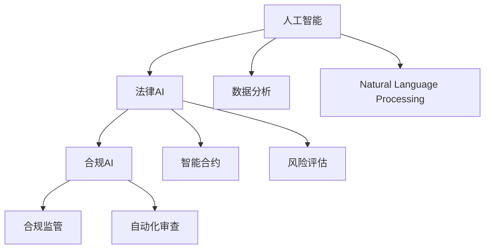

                 

# AI在法律和合规领域的应用

> 关键词：人工智能, 法律AI, 合规AI, 数据分析, 自然语言处理, 智能合约, 风险评估, 合规监管, 自动化审查

## 1. 背景介绍

在数字化、信息化不断加速的今天，人工智能(AI)技术的应用已经触及了社会经济的各个角落。而法律和合规作为规范社会行为、保障公平正义的重要领域，也越来越受到AI技术的关注和应用。AI不仅在提升法律、合规工作的效率、精度上大有作为，还通过数据分析、自然语言处理、智能合约等技术，推动了法律和合规领域的创新与变革。本文将系统介绍AI在法律和合规领域的应用现状与未来展望。

## 2. 核心概念与联系

### 2.1 核心概念概述

为便于深入理解AI在法律和合规领域的应用，我们首先介绍几个核心概念及其联系：

- **人工智能(AI)**：通过模拟人类智能行为，以算法、数据为基础，实现自动化决策、处理任务的技术体系。
- **法律AI**：将AI技术应用于法律领域，提升法律咨询、案件处理、合同审查等工作的效率和准确性。
- **合规AI**：将AI技术应用于合规管理，提升合规风险评估、合规审查、合规监控等工作的精度和速度。
- **数据分析**：通过挖掘和分析海量数据，发现隐含规律，辅助决策支持。
- **自然语言处理(NLP)**：通过机器学习和语言模型，使计算机能够理解、生成人类语言。
- **智能合约**：基于区块链和AI技术的自动执行合约，以实现无中介、自动化的交易。
- **风险评估**：通过模型和算法，量化评估各种风险因素及其影响，辅助决策优化。
- **合规监管**：通过AI技术，监测和审查组织或个人的合规行为，防止违法行为。
- **自动化审查**：利用AI自动审核和审查文档、数据，提升审查效率和准确性。

这些概念之间的逻辑关系可以通过以下Mermaid流程图来展示：



这个流程图展示了大AI技术在法律和合规领域的应用框架，其中数据分析、自然语言处理等技术是基础支持，智能合约、风险评估、合规监管和自动化审查等应用则是具体实践。

## 3. 核心算法原理 & 具体操作步骤
### 3.1 算法原理概述

AI在法律和合规领域的应用，主要依赖于机器学习、深度学习等算法原理，这些算法通过对大量数据的学习和分析，提炼出规律和模式，从而实现对法律、合规问题的自动化处理和决策支持。

以法律AI为例，常见的应用包括但不限于以下几个方面：

- **合同审核与生成**：通过文本分析和自然语言处理，自动审查合同文本，识别关键条款，甚至自动生成标准合同。
- **法律咨询与分析**：通过知识图谱和语义分析，提供法律咨询，解答法律问题，分析法律案例。
- **案件处理与预测**：利用机器学习模型，对案件进行分类、标注、预测，辅助法官判决。
- **合规审查与监控**：通过风险评估模型，量化合规风险，辅助企业合规管理。

这些应用基于的算法原理包括：

- **监督学习**：利用标注数据，训练分类器或回归器，实现分类、预测等任务。
- **无监督学习**：从无标注数据中发现模式，进行聚类、降维、异常检测等任务。
- **强化学习**：通过与环境的交互，优化决策策略，应用于游戏、机器人等领域。
- **深度学习**：利用多层神经网络，学习复杂非线性关系，适用于图像识别、语音识别等任务。
- **自然语言处理(NLP)**：通过语言模型、序列模型等技术，实现文本分类、情感分析、问答系统等。
- **知识图谱**：构建实体和关系图，辅助推理和决策。

### 3.2 算法步骤详解

AI在法律和合规领域的应用一般包括以下几个关键步骤：

**Step 1: 数据收集与预处理**
- 收集法律、合规领域的各类数据，包括案例、合同、法规、政策等。
- 对数据进行清洗、标注、归一化等预处理，以提升数据质量。

**Step 2: 模型选择与训练**
- 根据具体任务，选择适当的机器学习模型，如逻辑回归、支持向量机、决策树、随机森林、神经网络等。
- 利用标注数据训练模型，通过交叉验证等技术评估模型性能。
- 对模型进行调参优化，如学习率、正则化参数、网络结构等，以提升模型精度和泛化能力。

**Step 3: 模型部署与评估**
- 将训练好的模型部署到实际应用中，如合同审核系统、法律咨询系统等。
- 实时接收输入数据，利用模型进行自动化处理，并提供预测、分析结果。
- 定期评估模型效果，根据反馈调整模型参数和算法策略。

**Step 4: 持续学习与优化**
- 随着新数据的积累，定期更新训练数据集，重新训练模型，提升模型性能。
- 引入在线学习算法，使得模型能够持续适应新数据和新环境，保持最新的决策能力。

### 3.3 算法优缺点

AI在法律和合规领域的应用，具有以下优点：

- **效率提升**：自动化处理大量重复性工作，提升处理速度和效率。
- **精度提高**：利用机器学习算法，减少人为误差，提升决策准确性。
- **成本降低**：减少人工干预，降低人力成本。
- **覆盖面广**：可处理大量数据，涵盖多个领域，提高全面性和一致性。

同时，AI应用也存在一些局限性：

- **依赖数据质量**：模型效果依赖于数据质量和标注质量，数据偏差可能导致误判。
- **透明度不足**：AI决策过程缺乏透明性，难以解释，对合规审查可能带来挑战。
- **安全性问题**：数据隐私保护、模型攻击等安全问题需要特别关注。
- **伦理和法律挑战**：AI在法律和合规领域的应用可能面临伦理和法律上的复杂问题。

### 3.4 算法应用领域

AI在法律和合规领域的应用已经逐步深入多个具体领域，包括但不限于：

- **合同管理**：通过智能合同管理系统，自动化审核合同，提取关键条款，生成标准合同模板。
- **法律咨询与文书生成**：利用自然语言处理技术，提供法律咨询，自动生成法律文书。
- **案件处理**：通过AI模型，对案件进行分类、标注、预测，辅助法官判决。
- **风险评估与管理**：利用数据挖掘和机器学习模型，量化合规风险，提供合规建议。
- **合规监控**：通过实时监控和审计，发现合规违规行为，提供合规报告。
- **自动化审查**：利用AI自动审查和审计文件、文档，提升审查效率和准确性。
- **智能合约与区块链**：基于AI和区块链技术，实现自动执行、无需中介的智能合约。

## 4. 数学模型和公式 & 详细讲解  
### 4.1 数学模型构建

AI在法律和合规领域的应用，往往涉及复杂的数学模型和算法。以下以合同审核为例，详细介绍数学模型的构建过程。

假设合同审核任务为二分类问题，其中合同内容为 $x \in \mathbb{R}^d$，合同真实性标签为 $y \in \{0, 1\}$。我们的目标是构建一个二分类模型 $f(x; \theta)$，其中 $\theta$ 为模型参数。

常用的二分类模型包括逻辑回归、支持向量机、决策树、随机森林等。这里以逻辑回归为例，构建模型公式：

$$
f(x; \theta) = \sigma(\theta^T x)
$$

其中，$\sigma(z) = \frac{1}{1+e^{-z}}$ 为 sigmoid 函数，将输出映射到 $[0, 1]$ 区间，表示合同真实性的概率。$\theta$ 为模型参数，通常为向量形式。

**公式推导过程**

假设合同真实性标签为 $y$，模型预测结果为 $f(x)$，则损失函数（如交叉熵损失）为：

$$
L(y, f(x; \theta)) = -(y \log f(x; \theta) + (1-y) \log (1-f(x; \theta)))
$$

通过梯度下降等优化算法，最小化损失函数，更新模型参数 $\theta$，使得模型能够更准确地预测合同真实性。

### 4.2 公式推导过程

以逻辑回归模型为例，我们通过最大化似然函数，求解模型参数 $\theta$。具体步骤如下：

1. **最大化似然函数**：假设合同真实性标签 $y$ 服从伯努利分布，则似然函数为：

$$
L(y, f(x; \theta)) = y \log f(x; \theta) + (1-y) \log (1-f(x; \theta))
$$

2. **求导与优化**：对损失函数求导，得到梯度，利用梯度下降等优化算法，更新模型参数 $\theta$。

3. **模型训练**：通过交叉验证等方法，评估模型性能，调整模型参数，提升模型精度和泛化能力。

### 4.3 案例分析与讲解

假设我们有一批合同数据，每条记录包含合同文本 $x$ 和标签 $y$。我们可以利用逻辑回归模型进行训练和测试，步骤如下：

1. **数据预处理**：对合同文本进行分词、去除停用词等处理，转化为数值特征向量。
2. **模型训练**：利用训练集数据，通过梯度下降等算法，训练逻辑回归模型。
3. **模型评估**：利用测试集数据，评估模型性能，计算准确率、召回率、F1值等指标。
4. **模型应用**：将训练好的模型部署到实际应用中，对新合同文本进行预测。

## 5. 项目实践：代码实例和详细解释说明
### 5.1 开发环境搭建

在进行法律和合规领域的AI应用开发前，我们需要准备好开发环境。以下是使用Python进行PyTorch开发的流程：

1. 安装Anaconda：从官网下载并安装Anaconda，用于创建独立的Python环境。

2. 创建并激活虚拟环境：
```bash
conda create -n pytorch-env python=3.8 
conda activate pytorch-env
```

3. 安装PyTorch：根据CUDA版本，从官网获取对应的安装命令。例如：
```bash
conda install pytorch torchvision torchaudio cudatoolkit=11.1 -c pytorch -c conda-forge
```

4. 安装相关的Python包，如Pandas、NumPy、Scikit-learn等：
```bash
pip install pandas numpy scikit-learn
```

5. 安装自然语言处理相关的库，如NLTK、SpaCy等：
```bash
pip install nltk spacy
```

完成上述步骤后，即可在`pytorch-env`环境中开始开发。

### 5.2 源代码详细实现

以下以合同审核为例，给出使用PyTorch进行逻辑回归模型训练的代码实现。

```python
import torch
import torch.nn as nn
import torch.optim as optim
from sklearn.model_selection import train_test_split
from sklearn.metrics import accuracy_score, confusion_matrix
from sklearn.datasets import load_breast_cancer

# 加载合同数据
data = load_breast_cancer()

# 划分训练集和测试集
X_train, X_test, y_train, y_test = train_test_split(data.data, data.target, test_size=0.2, random_state=42)

# 定义模型
class LogisticRegression(nn.Module):
    def __init__(self, input_size, output_size):
        super(LogisticRegression, self).__init__()
        self.linear = nn.Linear(input_size, output_size)
        self.sigmoid = nn.Sigmoid()

    def forward(self, x):
        x = self.linear(x)
        return self.sigmoid(x)

# 初始化模型、损失函数和优化器
model = LogisticRegression(input_size=X_train.shape[1], output_size=1)
criterion = nn.BCELoss()
optimizer = optim.Adam(model.parameters(), lr=0.001)

# 训练模型
num_epochs = 100
for epoch in range(num_epochs):
    optimizer.zero_grad()
    outputs = model(X_train)
    loss = criterion(outputs, y_train)
    loss.backward()
    optimizer.step()

    if (epoch + 1) % 10 == 0:
        print(f"Epoch {epoch+1}, loss: {loss.item()}")

# 评估模型
y_pred = (model(X_test) > 0.5).float()
print(f"Accuracy: {accuracy_score(y_test, y_pred)}")
```

### 5.3 代码解读与分析

让我们再详细解读一下关键代码的实现细节：

**数据加载**：
- 使用scikit-learn的load_breast_cancer函数加载数据集。
- 利用train_test_split函数划分训练集和测试集。

**模型定义**：
- 定义一个简单的逻辑回归模型，包含一个线性层和一个sigmoid激活函数。
- 通过PyTorch的nn.Module进行封装，方便调用和训练。

**训练过程**：
- 在每个epoch中，对模型进行前向传播和反向传播，计算损失函数。
- 利用优化器Adam更新模型参数。
- 打印出每个epoch的损失，以便监控训练过程。

**评估过程**：
- 利用模型对测试集进行预测，计算预测结果与真实标签的准确率。
- 打印出模型的评估结果。

## 6. 实际应用场景

### 6.1 智能合同管理系统

智能合同管理系统利用AI技术，自动化审核和生成合同文本，提高合同管理的效率和准确性。该系统主要包括以下几个关键功能：

- **合同自动审核**：利用NLP技术，对合同文本进行关键词提取、实体识别、关系抽取等处理，自动审核合同内容。
- **合同自动生成**：根据合同模板和示例合同，利用NLP技术，自动生成标准合同文本。
- **合同合规审查**：利用合规AI技术，对合同内容进行合规性检查，发现不合规的条款，提供改进建议。

在实际应用中，智能合同管理系统可以集成到企业的合同管理系统，辅助合同人员进行合同处理，大幅提升工作效率。

### 6.2 法律咨询与文书生成

法律咨询与文书生成系统利用AI技术，提供法律咨询服务，自动生成法律文书。该系统主要包括以下几个关键功能：

- **法律咨询**：利用知识图谱和NLP技术，对用户输入的法律问题进行分析和解答。
- **文书生成**：根据用户输入的法律文书需求，自动生成符合法律规范的文书，如诉讼状、起诉状等。
- **文书校对**：利用自然语言处理技术，对自动生成的文书进行校对和修正，提高文书质量。

在实际应用中，法律咨询与文书生成系统可以集成到企业内部平台或外部网站，提供快速、准确的法律咨询服务，满足企业内部的法律需求。

### 6.3 案件处理与预测

案件处理与预测系统利用AI技术，对案件进行分类、标注、预测，辅助法官判决。该系统主要包括以下几个关键功能：

- **案件分类**：利用机器学习模型，对案件进行自动分类，如民事案件、刑事案件等。
- **案件标注**：利用自然语言处理技术，对案件文本进行关键词提取、关系抽取等处理，标注关键信息。
- **案件预测**：利用机器学习模型，对案件结果进行预测，如胜诉、败诉等。

在实际应用中，案件处理与预测系统可以集成到法院的案件管理系统，辅助法官进行案件处理和判决，提高案件处理的效率和准确性。

### 6.4 风险评估与管理

风险评估与管理系统利用AI技术，量化合规风险，提供合规建议。该系统主要包括以下几个关键功能：

- **风险评估**：利用机器学习模型，对企业的合规风险进行量化评估，发现潜在风险。
- **合规建议**：根据风险评估结果，提供改进建议，帮助企业提升合规水平。
- **合规监控**：利用实时监控技术，发现合规违规行为，及时预警。

在实际应用中，风险评估与管理系统可以集成到企业的风险管理系统，辅助企业进行合规管理，降低合规风险。

### 6.5 合规监控

合规监控系统利用AI技术，实时监控和审计企业的合规行为，防止违法行为。该系统主要包括以下几个关键功能：

- **行为监测**：利用机器学习模型，对企业的行为进行实时监测，发现异常行为。
- **异常分析**：利用NLP技术，对异常行为进行分析和解释，提供改进建议。
- **事件处理**：对监测到的违法行为，及时进行处理，防止进一步恶化。

在实际应用中，合规监控系统可以集成到企业的合规管理平台，辅助企业进行合规监控，提高合规管理的效率和效果。

## 7. 工具和资源推荐

### 7.1 学习资源推荐

为了帮助开发者系统掌握AI在法律和合规领域的应用，这里推荐一些优质的学习资源：

1. **《机器学习实战》**：本书详细介绍了机器学习算法的原理和实现，涵盖了分类、回归、聚类等基本算法。
2. **Coursera的《机器学习》课程**：由斯坦福大学教授Andrew Ng主讲，系统介绍了机器学习的基本概念和算法。
3. **Kaggle平台**：提供大量数据集和竞赛，可以练习和应用机器学习算法。
4. **Arxiv.org**：人工智能领域的顶级学术平台，可以获取最新的研究成果和技术动态。
5. **GitHub**：代码托管平台，可以找到众多AI项目的源码和项目经验。

通过对这些资源的学习实践，相信你一定能够快速掌握AI在法律和合规领域的应用技巧，并用于解决实际问题。

### 7.2 开发工具推荐

高效的开发离不开优秀的工具支持。以下是几款用于AI在法律和合规领域应用的常用工具：

1. **PyTorch**：基于Python的开源深度学习框架，支持动态计算图，适合快速迭代研究。
2. **TensorFlow**：由Google主导开发的深度学习框架，生产部署方便，适合大规模工程应用。
3. **TensorBoard**：TensorFlow配套的可视化工具，可以实时监测模型训练状态，提供丰富的图表呈现方式。
4. **Weights & Biases**：模型训练的实验跟踪工具，可以记录和可视化模型训练过程中的各项指标。
5. **HuggingFace的Transformers库**：提供预训练语言模型和微调技术，适合NLP任务开发。

合理利用这些工具，可以显著提升AI在法律和合规领域应用的开发效率，加快创新迭代的步伐。

### 7.3 相关论文推荐

AI在法律和合规领域的应用源于学界的持续研究。以下是几篇奠基性的相关论文，推荐阅读：

1. **《机器学习：理论和算法》**：由Tom Mitchell和Peter Domingos合著，系统介绍了机器学习的基本理论和算法。
2. **《NLP与深度学习》**：由Yoshua Bengio、Daphne Koller和John Paisley合著，介绍了自然语言处理和深度学习的基本技术。
3. **《智能合约：无需中介的交易》**：由Natasha Glicenstein等合著，介绍了智能合约的基本原理和应用。
4. **《合规性风险评估框架》**：由Larry D. Mitchell和Robert J. Chao合著，介绍了合规性风险评估的基本方法和应用。
5. **《法律信息抽取与分类》**：由Cynthia Hale和Dan Jurafsky合著，介绍了法律文本的抽取和分类技术。

这些论文代表了大AI技术在法律和合规领域的应用发展脉络。通过学习这些前沿成果，可以帮助研究者把握学科前进方向，激发更多的创新灵感。

## 8. 总结：未来发展趋势与挑战

### 8.1 总结

本文系统介绍了AI在法律和合规领域的应用现状与未来展望。通过详细阐述法律AI、合规AI的核心概念和原理，结合数学模型和算法推导，提供了具体的应用实例和代码实现。同时，本文还探讨了AI在法律和合规领域的应用场景，以及未来发展的趋势和挑战。

通过本文的系统梳理，可以看到，AI技术在法律和合规领域的应用前景广阔，不仅能提升工作效率，还能降低人力成本，提升决策精度。但AI技术在法律和合规领域的应用仍面临一些挑战，如数据质量、模型透明度、安全性等问题，需要在实践中不断优化和改进。

### 8.2 未来发展趋势

展望未来，AI在法律和合规领域的应用将呈现以下几个发展趋势：

1. **智能化水平提升**：随着AI技术的发展，智能化水平将不断提高，系统将更加智能、高效。
2. **多领域融合**：AI技术将与其他技术进行更深入的融合，如知识图谱、自然语言处理、区块链等，提升应用的全面性和复杂性。
3. **数据驱动决策**：更多依赖数据驱动的决策，通过大数据分析和机器学习，提升决策的科学性和合理性。
4. **跨界合作**：与法律、合规领域的专家进行更紧密的合作，提升系统的准确性和实用性。
5. **隐私保护**：随着数据隐私保护意识的增强，将更加注重保护用户隐私，提升数据安全性。

以上趋势凸显了AI在法律和合规领域应用的广阔前景。这些方向的探索发展，必将进一步提升AI在法律和合规领域的应用水平，为构建安全、可靠、高效的智能系统铺平道路。

### 8.3 面临的挑战

尽管AI在法律和合规领域的应用已经取得了一些成果，但在迈向更加智能化、普适化应用的过程中，仍面临诸多挑战：

1. **数据质量问题**：数据质量和标注质量直接影响到模型的效果，数据偏差可能导致误判。
2. **模型透明度不足**：AI决策过程缺乏透明性，难以解释，对合规审查可能带来挑战。
3. **安全性问题**：数据隐私保护、模型攻击等安全问题需要特别关注。
4. **伦理和法律问题**：AI在法律和合规领域的应用可能面临伦理和法律上的复杂问题。
5. **技术挑战**：如数据处理、模型训练、系统集成等技术难题。

正视这些挑战，积极应对并寻求突破，将是大AI技术在法律和合规领域走向成熟的必由之路。相信随着学界和产业界的共同努力，这些挑战终将一一被克服，AI在法律和合规领域的应用必将在构建人机协同的智能时代中扮演越来越重要的角色。

### 8.4 研究展望

面对AI在法律和合规领域的应用所面临的挑战，未来的研究需要在以下几个方面寻求新的突破：

1. **数据治理**：建立数据治理机制，确保数据质量和隐私保护，提升数据治理水平。
2. **模型透明化**：开发可解释的AI模型，提升模型的透明性和可解释性，辅助合规审查。
3. **安全性保障**：研究数据隐私保护、模型安全防御等技术，保障AI系统的安全性。
4. **跨界合作**：与法律、合规领域的专家进行更紧密的合作，提升系统的准确性和实用性。
5. **伦理规范**：建立AI伦理规范，确保AI技术的应用符合伦理和法律要求。
6. **技术优化**：优化数据处理、模型训练、系统集成等技术，提升系统的效率和效果。

这些研究方向的探索，必将引领AI在法律和合规领域走向更高的台阶，为构建安全、可靠、可解释、可控的智能系统铺平道路。面向未来，AI在法律和合规领域的研究和应用，还需要与其他AI技术进行更深入的融合，如知识表示、因果推理、强化学习等，多路径协同发力，共同推动法律和合规领域的智能转型。只有勇于创新、敢于突破，才能不断拓展AI在法律和合规领域的应用边界，让智能技术更好地造福社会。

## 9. 附录：常见问题与解答

**Q1：AI在法律和合规领域的应用有哪些优点？**

A: AI在法律和合规领域的应用具有以下优点：

1. **效率提升**：自动化处理大量重复性工作，提升处理速度和效率。
2. **精度提高**：利用机器学习算法，减少人为误差，提升决策准确性。
3. **成本降低**：减少人工干预，降低人力成本。
4. **覆盖面广**：可处理大量数据，涵盖多个领域，提高全面性和一致性。
5. **合规性提升**：利用合规AI技术，提高合规管理水平，降低合规风险。

**Q2：AI在法律和合规领域的应用面临哪些挑战？**

A: AI在法律和合规领域的应用面临以下挑战：

1. **数据质量问题**：数据质量和标注质量直接影响到模型的效果，数据偏差可能导致误判。
2. **模型透明度不足**：AI决策过程缺乏透明性，难以解释，对合规审查可能带来挑战。
3. **安全性问题**：数据隐私保护、模型攻击等安全问题需要特别关注。
4. **伦理和法律问题**：AI在法律和合规领域的应用可能面临伦理和法律上的复杂问题。
5. **技术挑战**：如数据处理、模型训练、系统集成等技术难题。

**Q3：AI在法律和合规领域的应用有哪些具体应用场景？**

A: AI在法律和合规领域的应用有以下具体应用场景：

1. **智能合同管理系统**：自动化审核和生成合同文本，提高合同管理的效率和准确性。
2. **法律咨询与文书生成系统**：提供法律咨询服务，自动生成法律文书。
3. **案件处理与预测系统**：对案件进行分类、标注、预测，辅助法官判决。
4. **风险评估与管理系统**：量化合规风险，提供合规建议，辅助企业合规管理。
5. **合规监控系统**：实时监控和审计企业的合规行为，防止违法行为。

**Q4：如何选择合适的AI模型和算法？**

A: 选择合适的AI模型和算法需要考虑以下几个因素：

1. **任务类型**：根据具体任务，选择适当的模型和算法，如分类、回归、聚类等。
2. **数据特征**：分析数据特征，选择适合该数据类型的模型，如时间序列、图像、文本等。
3. **模型复杂度**：根据任务需求和资源限制，选择复杂度适中的模型，避免过拟合或欠拟合。
4. **训练时间**：考虑模型的训练时间和计算资源，选择适合的模型和算法。
5. **可解释性**：选择可解释性高的模型，便于解释和理解AI决策过程。

**Q5：如何进行数据预处理？**

A: 数据预处理是AI模型训练的重要步骤，包括以下几个关键步骤：

1. **数据清洗**：去除无效数据、处理缺失值和异常值。
2. **数据归一化**：对数据进行归一化处理，提升模型性能。
3. **特征提取**：利用NLP技术，对文本数据进行分词、去停用词、词向量化等处理，提取特征。
4. **标注处理**：对标注数据进行清洗、处理，确保标注质量。

通过系统化的数据预处理，可以显著提升AI模型的训练效果和性能。

