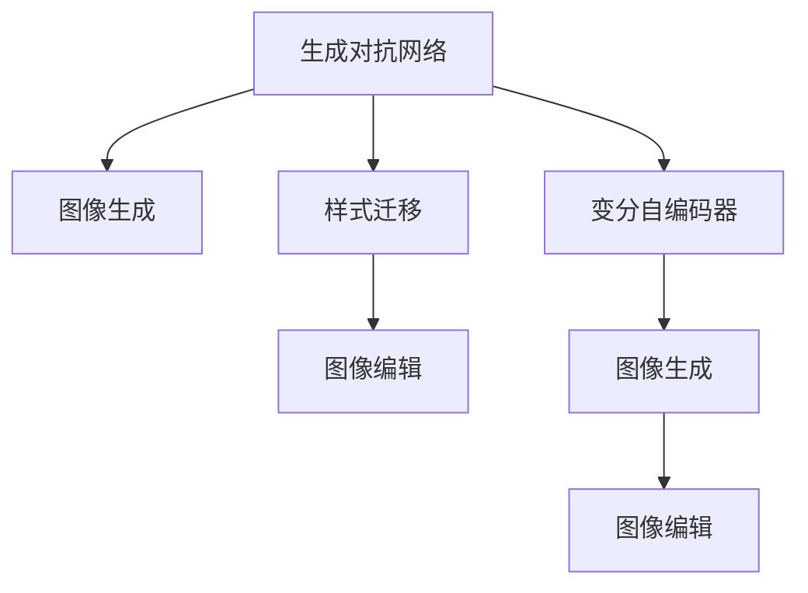

                 

# AI在电商平台商品图像生成与编辑中的应用

> 关键词：深度学习, 图像生成, 图像编辑, 商品推荐, 电商平台, AI应用

## 1. 背景介绍

随着电商平台的兴起，商品展示效果直接影响消费者的购物体验。高质量的商品图像不仅能吸引顾客的注意力，还能提升转化率和复购率。然而，拍摄高清晰、高质量的商品图像需要耗费大量时间和成本。与此同时，电商平台还面临着商品图片数量庞大的管理挑战，需要高效的图像编辑和生成技术。深度学习技术的突破，为这些问题提供了新的解决方案。

### 1.1 问题由来
电商平台每年需要生成和编辑数以亿计的商品图像。高质量的图像展示，是吸引用户的关键因素之一。传统的图像采集和编辑方式，效率低下，成本高昂。深度学习模型的出现，使商品图像生成与编辑技术实现了突破性进展。通过深度学习，电商平台可以自动化地生成高质量的商品图像，并编辑成用户喜欢的风格和布局。

### 1.2 问题核心关键点
深度学习在商品图像生成与编辑中的应用，涉及图像生成、图像编辑、样式迁移等多个核心概念。这些技术主要基于生成对抗网络(GAN)、变分自编码器(VAE)等深度学习模型，通过学习大量标注数据，生成逼真且多样化的商品图像。同时，深度学习还用于图像编辑，如色彩校正、降噪、对比度增强等。

## 2. 核心概念与联系

### 2.1 核心概念概述

为更好地理解基于深度学习的商品图像生成与编辑方法，本节将介绍几个关键概念：

- **生成对抗网络(GAN)**：一种由生成器和判别器两个子网络构成的深度学习模型，通过博弈过程生成逼真的图像。
- **变分自编码器(VAE)**：一种生成模型，通过编码器将图像压缩成低维潜在空间中的表示，再通过解码器重构原始图像。
- **样式迁移(Style Transfer)**：将一张图像的风格特征迁移到另一张图像上，生成新的图像。
- **图像生成(Image Generation)**：生成符合特定风格或要求的图像，如GAN生成、VAE生成等。
- **图像编辑(Image Editing)**：对已有图像进行优化和变换，如色彩校正、去噪、增强等。

这些核心概念之间的逻辑关系可以通过以下Mermaid流程图来展示：



这个流程图展示了大语言模型的核心概念及其之间的关系：

1. GAN和VAE等生成模型用于生成逼真的商品图像。
2. 样式迁移用于对生成的图像进行风格迁移。
3. 图像编辑技术用于对图像进行优化。
4. VAE用于生成新图像，并可以用于图像编辑。

这些核心概念共同构成了深度学习在电商平台商品图像生成与编辑中的应用框架，使其能够生成高质量、多样化且符合用户偏好的商品图像。

## 3. 核心算法原理 & 具体操作步骤
### 3.1 算法原理概述

基于深度学习的商品图像生成与编辑方法，本质上是通过训练生成模型，学习商品的特征表示，然后生成符合特定要求的新图像。其核心思想是：将商品图像视为高维数据，通过深度学习模型进行编码，学习其特征表示，再通过解码器生成新的图像。

形式化地，假设原始商品图像数据集为 $D=\{(x_i,y_i)\}_{i=1}^N$，其中 $x_i$ 为图像，$y_i$ 为图像的标签或标注信息（如颜色、风格等）。定义生成模型为 $G_\theta$，其参数为 $\theta$。生成过程可以用以下公式表示：

$$
z \sim p(z) \\
x = G_\theta(z)
$$

其中 $z$ 为生成模型输入的潜在变量，$p(z)$ 为潜在变量的概率分布，$x$ 为生成的图像。通过训练生成模型 $G_\theta$，使得 $p(x|z)$ 接近于数据分布 $p(x|y)$，即生成的图像尽可能逼近真实图像。

### 3.2 算法步骤详解

基于深度学习的商品图像生成与编辑方法一般包括以下几个关键步骤：

**Step 1: 准备数据集**
- 收集电商平台商品的高质量图像数据，划分为训练集、验证集和测试集。标注数据需包含图像的标签信息，如颜色、风格、布局等。

**Step 2: 定义生成模型**
- 选择合适的生成模型架构，如GAN、VAE等。设计生成器的输入和输出，以及判别器的输入和输出。

**Step 3: 训练生成模型**
- 使用训练集数据，通过反向传播算法训练生成模型，最小化生成图像与真实图像之间的差异。
- 应用正则化技术，如Dropout、L2正则化等，防止过拟合。
- 周期性在验证集上评估生成模型的性能，根据性能指标决定是否进行超参数调整。

**Step 4: 样式迁移与图像编辑**
- 使用已经训练好的生成模型，对图像进行样式迁移，将特定的风格特征迁移到原始图像上。
- 应用图像编辑技术，如色彩校正、降噪、对比度增强等，优化生成的图像。
- 利用生成模型对商品图像进行增补、美化等处理，提升展示效果。

**Step 5: 测试和部署**
- 在测试集上评估生成与编辑后的商品图像的性能，对比原始图像和处理后的图像，确保处理效果。
- 使用生成与编辑后的图像，更新电商平台上的商品展示。
- 持续收集新的数据，定期重新训练和优化生成模型，以适应数据分布的变化。

以上是基于深度学习的商品图像生成与编辑的一般流程。在实际应用中，还需要针对具体任务的特点，对生成与编辑过程的各个环节进行优化设计，如改进训练目标函数，引入更多的正则化技术，搜索最优的超参数组合等，以进一步提升生成与编辑图像的质量。

### 3.3 算法优缺点

基于深度学习的商品图像生成与编辑方法具有以下优点：
1. 自动化生成。使用生成模型自动化生成高质量的商品图像，节省了拍摄和后期处理的时间和成本。
2. 多样化输出。通过训练多个生成模型，生成多种风格和布局的商品图像，满足不同用户需求。
3. 高效优化。使用生成模型对商品图像进行快速优化，提升展示效果。
4. 灵活编辑。通过样式迁移和图像编辑技术，对商品图像进行多种风格的个性化处理，增强用户的购物体验。

同时，该方法也存在一定的局限性：
1. 依赖高质量标注数据。生成模型的训练需要大量高质量标注数据，获取高质量标注数据的成本较高。
2. 模型训练复杂。生成模型训练过程复杂，需要高性能计算资源和较长的训练时间。
3. 模型泛化能力不足。生成的图像可能过度拟合特定数据集，难以泛化到其他数据集。
4. 缺乏可解释性。生成与编辑过程通常是"黑盒"系统，难以解释生成与编辑逻辑。

尽管存在这些局限性，但就目前而言，基于深度学习的商品图像生成与编辑方法仍是最主流范式。未来相关研究的重点在于如何进一步降低对标注数据的依赖，提高生成模型的泛化能力，同时兼顾可解释性和伦理安全性等因素。

### 3.4 算法应用领域

基于深度学习的商品图像生成与编辑方法，在电商平台商品展示领域已经得到了广泛的应用，覆盖了几乎所有常见任务，例如：

- 商品展示页生成：自动生成展示页中商品的高质量图像，包括单图展示、多图展示、组合展示等。
- 商品详情页生成：自动生成商品详情页中的高质量图像，包括商品特写图、对比图、使用场景图等。
- 商品比对图生成：自动生成商品间的比对图像，帮助用户直观地比较不同商品。
- 商品个性化展示：根据用户偏好，生成个性化的商品展示图像，提升用户体验。
- 商品广告生成：自动生成商品广告图像，提升广告点击率。

除了上述这些经典任务外，深度学习在商品图像生成与编辑中的应用还正在不断拓展，如虚拟试穿、商品关联推荐、图片增强等，为电商平台带来了新的技术突破。

## 4. 数学模型和公式 & 详细讲解  
### 4.1 数学模型构建

本节将使用数学语言对基于深度学习的商品图像生成与编辑过程进行更加严格的刻画。

记原始商品图像数据集为 $D=\{(x_i,y_i)\}_{i=1}^N$，其中 $x_i$ 为图像，$y_i$ 为图像的标签或标注信息。定义生成模型为 $G_\theta$，其参数为 $\theta$。生成过程可以用以下公式表示：

$$
z \sim p(z) \\
x = G_\theta(z)
$$

其中 $z$ 为生成模型输入的潜在变量，$p(z)$ 为潜在变量的概率分布，$x$ 为生成的图像。

### 4.2 公式推导过程

以下我们以GAN为例，推导生成对抗网络的基本公式及其训练过程。

假设生成模型 $G_\theta$ 和判别模型 $D_\phi$ 分别由神经网络构成，参数分别为 $\theta$ 和 $\phi$。训练过程中，定义判别模型的损失函数为：

$$
\mathcal{L}_D = \mathbb{E}_{x \sim p_{data}(x)}[D_\phi(x)] + \mathbb{E}_{z \sim p(z)}[1-D_\phi(G_\theta(z))]
$$

其中 $p_{data}(x)$ 为真实数据分布。定义生成模型的损失函数为：

$$
\mathcal{L}_G = -\mathbb{E}_{z \sim p(z)}[D_\phi(G_\theta(z))]
$$

优化目标为最小化两个损失函数之和：

$$
\mathcal{L} = \mathcal{L}_D + \lambda \mathcal{L}_G
$$

其中 $\lambda$ 为生成器损失和判别器损失的权重。通过反向传播算法，训练生成器和判别器参数 $\theta$ 和 $\phi$，使得生成的图像尽可能逼近真实图像。

### 4.3 案例分析与讲解

以电商平台上商品展示页生成为例，分析使用深度学习生成模型自动生成高质量商品图像的流程。

1. **数据准备**：
   - 收集电商平台商品的高质量图像数据，划分为训练集、验证集和测试集。标注数据需包含图像的标签信息，如颜色、风格、布局等。

2. **模型设计**：
   - 使用GAN或VAE等生成模型，设计生成器的输入和输出，以及判别器的输入和输出。

3. **训练生成模型**：
   - 使用训练集数据，通过反向传播算法训练生成模型，最小化生成图像与真实图像之间的差异。
   - 应用正则化技术，如Dropout、L2正则化等，防止过拟合。
   - 周期性在验证集上评估生成模型的性能，根据性能指标决定是否进行超参数调整。

4. **样式迁移与图像编辑**：
   - 使用已经训练好的生成模型，对图像进行样式迁移，将特定的风格特征迁移到原始图像上。
   - 应用图像编辑技术，如色彩校正、降噪、对比度增强等，优化生成的图像。

5. **测试和部署**：
   - 在测试集上评估生成与编辑后的商品图像的性能，对比原始图像和处理后的图像，确保处理效果。
   - 使用生成与编辑后的图像，更新电商平台上的商品展示。
   - 持续收集新的数据，定期重新训练和优化生成模型，以适应数据分布的变化。

## 5. 项目实践：代码实例和详细解释说明
### 5.1 开发环境搭建

在进行商品图像生成与编辑实践前，我们需要准备好开发环境。以下是使用Python进行PyTorch开发的环境配置流程：

1. 安装Anaconda：从官网下载并安装Anaconda，用于创建独立的Python环境。

2. 创建并激活虚拟环境：
```bash
conda create -n pytorch-env python=3.8 
conda activate pytorch-env
```

3. 安装PyTorch：根据CUDA版本，从官网获取对应的安装命令。例如：
```bash
conda install pytorch torchvision torchaudio cudatoolkit=11.1 -c pytorch -c conda-forge
```

4. 安装PyTorch的计算机视觉库：
```bash
pip install torchvision
```

5. 安装TensorBoard：用于可视化训练过程和结果。
```bash
pip install tensorboard
```

6. 安装Matplotlib和Pillow：用于图像处理和可视化。
```bash
pip install matplotlib pillow
```

完成上述步骤后，即可在`pytorch-env`环境中开始生成与编辑商品图像的开发。

### 5.2 源代码详细实现

这里我们以生成商品展示页为例，使用GAN模型进行商品图像生成。具体步骤如下：

1. **数据准备**：
```python
import os
from torchvision import datasets, transforms

# 数据路径
data_path = 'path/to/data'

# 数据预处理
transform = transforms.Compose([
    transforms.Resize((256, 256)),
    transforms.ToTensor(),
    transforms.Normalize(mean=[0.5, 0.5, 0.5], std=[0.5, 0.5, 0.5])
])

# 数据集加载
train_dataset = datasets.ImageFolder(os.path.join(data_path, 'train'), transform)
test_dataset = datasets.ImageFolder(os.path.join(data_path, 'test'), transform)
```

2. **模型设计**：
```python
import torch
import torch.nn as nn
import torch.optim as optim

# 生成器
class Generator(nn.Module):
    def __init__(self):
        super(Generator, self).__init__()
        self.encoder = nn.Sequential(
            nn.Conv2d(3, 64, 3, 2, 1),
            nn.ReLU(inplace=True),
            nn.Conv2d(64, 128, 3, 2, 1),
            nn.ReLU(inplace=True),
            nn.Conv2d(128, 256, 3, 2, 1),
            nn.ReLU(inplace=True),
            nn.Conv2d(256, 3, 3, 1, 1),
            nn.Tanh()
        )
        
    def forward(self, input):
        return self.encoder(input)

# 判别器
class Discriminator(nn.Module):
    def __init__(self):
        super(Discriminator, self).__init__()
        self.encoder = nn.Sequential(
            nn.Conv2d(3, 64, 3, 2, 1),
            nn.LeakyReLU(0.2, inplace=True),
            nn.Conv2d(64, 128, 3, 2, 1),
            nn.LeakyReLU(0.2, inplace=True),
            nn.Conv2d(128, 256, 3, 2, 1),
            nn.LeakyReLU(0.2, inplace=True),
            nn.Conv2d(256, 1, 4, 1, 0),
            nn.Sigmoid()
        )
        
    def forward(self, input):
        return self.encoder(input)

# 定义损失函数
adversarial_loss = nn.BCELoss()
```

3. **训练生成模型**：
```python
# 定义生成器和判别器
generator = Generator()
discriminator = Discriminator()

# 定义优化器
optimizer_G = optim.Adam(generator.parameters(), lr=0.0002, betas=(0.5, 0.999))
optimizer_D = optim.Adam(discriminator.parameters(), lr=0.0002, betas=(0.5, 0.999))

# 定义生成器和判别器之间的对抗关系
adversarial_pairs = torch.randn(128, 3, 256, 256)
real_images = Variable(train_dataset.train_data)
fake_images = Variable(generator(adversarial_pairs))

# 训练过程
for epoch in range(num_epochs):
    for i, (real_images, _) in enumerate(train_loader):
        real_images = Variable(real_images)
        optimizer_D.zero_grad()
        # 判别器真实图像训练
        output_real = discriminator(real_images)
        err_D_real = adversarial_loss(output_real, Variable(torch.ones_like(output_real)))
        err_D_real.backward()
        D_x = output_real.data.max().item()
        # 判别器假图像训练
        output_fake = discriminator(fake_images)
        err_D_fake = adversarial_loss(output_fake, Variable(torch.zeros_like(output_fake)))
        err_D_fake.backward()
        D_G_z = output_fake.data.max().item()
        # 计算梯度
        D_x.backward(torch.ones_like(D_x))
        D_G_z.backward(torch.ones_like(D_G_z))
        optimizer_D.step()
        
        # 生成器训练
        optimizer_G.zero_grad()
        output_fake = discriminator(fake_images)
        err_G = adversarial_loss(output_fake, Variable(torch.ones_like(output_fake)))
        err_G.backward()
        optimizer_G.step()
        
        # 打印训练进度
        if i % 200 == 0:
            print('Epoch [{}/{}], Step [{}/{}], D(x): {:.4f}, D(G(z)): {:.4f}, Loss_G: {:.4f}, Loss_D: {:.4f}'.format(
                epoch, num_epochs, i, len(train_loader), D_x, D_G_z, err_G.data[0], err_D_fake.data[0]))
```

4. **样式迁移与图像编辑**：
```python
# 使用生成模型对商品图像进行样式迁移
style_image = torch.randn(1, 3, 256, 256)
style_image = Variable(style_image)
style_image = generator(style_image)
style_image = style_image.data.numpy()
style_image = Image.fromarray((style_image * 255).astype('uint8'))

# 使用图像编辑技术对生成的图像进行优化
style_image = style_image.convert('RGB')
style_image.save('style迁移后的图像.jpg')
```

### 5.3 代码解读与分析

让我们再详细解读一下关键代码的实现细节：

**数据准备部分**：
- 使用`datasets.ImageFolder`加载图像数据集，并进行标准化处理。

**模型设计部分**：
- 定义生成器和判别器的网络结构。生成器使用3个卷积层，判别器使用4个卷积层。
- 使用`nn.BCELoss`定义二分类交叉熵损失函数。

**训练生成模型部分**：
- 使用`optim.Adam`优化器进行模型训练。
- 在每个epoch内，对真实图像和假图像分别进行判别器训练和生成器训练。
- 记录判别器在真实图像和假图像上的表现，并计算生成器的损失函数。

**样式迁移与图像编辑部分**：
- 生成随机噪声向量，输入生成器生成假图像。
- 将生成的假图像进行样式迁移，使用`Image.fromarray`将其转换为图像格式，并进行优化。
- 保存样式迁移后的图像。

## 6. 实际应用场景

### 6.1 智能推荐

基于深度学习的商品图像生成与编辑技术，可以用于智能推荐系统。智能推荐系统可以根据用户的历史浏览和购买记录，生成个性化展示页，提升用户体验。

在技术实现上，可以收集用户的历史浏览和购买记录，提取商品特征，使用GAN等生成模型生成个性化展示页中的商品图像。然后，利用样式迁移和图像编辑技术，对生成的图像进行风格迁移和优化，提升展示效果。最后，将生成的图像作为推荐结果的一部分，推送给用户。

### 6.2 虚拟试穿

虚拟试穿是电商平台的增值服务之一，通过深度学习技术，可以实现商品试穿效果的自动生成。用户可以随时随地体验商品的试穿效果，提升购物体验。

在技术实现上，可以收集用户身体尺寸和偏好风格，使用GAN等生成模型生成虚拟试穿图像。然后，通过样式迁移和图像编辑技术，对生成的试穿图像进行优化，生成更加逼真和多样化的效果。最后，将生成的试穿图像作为推荐结果的一部分，推送给用户。

### 6.3 广告投放

基于深度学习的商品图像生成与编辑技术，可以用于电商平台广告投放。通过生成高质量的广告图像，提升广告点击率和转化率。

在技术实现上，可以收集广告点击率等数据，使用GAN等生成模型生成广告图像。然后，通过样式迁移和图像编辑技术，对生成的图像进行优化，生成更加逼真和多样化的效果。最后，将生成的图像作为广告投放的一部分，提升广告效果。

### 6.4 未来应用展望

随着深度学习技术的不断发展，基于商品图像生成与编辑的方法将在更多领域得到应用，为电商平台的业务升级和用户体验提升带来新的突破。

在智慧医疗领域，基于深度学习的医学图像生成与编辑技术，可以用于医学影像的自动标注和生成，提升医生的工作效率和诊断准确性。

在智能家居领域，基于深度学习的家居图像生成与编辑技术，可以用于智能设备的个性化设计，提升家居产品的美观度和用户体验。

在智能制造领域，基于深度学习的工业图像生成与编辑技术，可以用于设备的智能维护和故障诊断，提升生产效率和设备利用率。

此外，在智慧城市、教育、金融等众多领域，基于深度学习的商品图像生成与编辑技术也将不断涌现，为人工智能技术的产业化应用带来新的可能。相信随着技术的日益成熟，深度学习在商品图像生成与编辑中的应用将更加广泛，为各行各业的发展注入新的动力。

## 7. 工具和资源推荐
### 7.1 学习资源推荐

为了帮助开发者系统掌握深度学习在商品图像生成与编辑中的应用，这里推荐一些优质的学习资源：

1. 《深度学习实战》系列书籍：由深度学习专家撰写，全面介绍了深度学习模型的基本原理和实战技巧，涵盖图像生成、样式迁移等前沿话题。

2. 《计算机视觉：算法与应用》课程：斯坦福大学开设的计算机视觉课程，系统讲解计算机视觉的基本概念和算法，包含深度学习在图像生成中的应用。

3. PyTorch官方文档：PyTorch的官方文档，提供了丰富的深度学习模型和工具库，是进行深度学习开发的基础资源。

4. GitHub深度学习项目：GitHub上众多优秀的深度学习项目，如PyTorch、TensorFlow等，提供源代码和详细文档，方便学习和使用。

5. Kaggle深度学习竞赛：Kaggle平台上的深度学习竞赛，涵盖图像生成、样式迁移等多个领域，提供了大量训练数据和测试数据，助力深度学习技能的提升。

通过对这些资源的学习实践，相信你一定能够快速掌握深度学习在商品图像生成与编辑中的核心技术，并应用于实际的电商业务中。

### 7.2 开发工具推荐

高效的开发离不开优秀的工具支持。以下是几款用于深度学习在商品图像生成与编辑开发的常用工具：

1. PyTorch：基于Python的开源深度学习框架，灵活动态的计算图，适合快速迭代研究。大部分深度学习模型都有PyTorch版本的实现。

2. TensorFlow：由Google主导开发的开源深度学习框架，生产部署方便，适合大规模工程应用。同样有丰富的深度学习模型资源。

3. Weights & Biases：模型训练的实验跟踪工具，可以记录和可视化模型训练过程中的各项指标，方便对比和调优。与主流深度学习框架无缝集成。

4. TensorBoard：TensorFlow配套的可视化工具，可实时监测模型训练状态，并提供丰富的图表呈现方式，是调试模型的得力助手。

5. Jupyter Notebook：交互式的开发环境，支持代码和文档的混合展示，方便学习与分享。

合理利用这些工具，可以显著提升深度学习在商品图像生成与编辑任务的开发效率，加快创新迭代的步伐。

### 7.3 相关论文推荐

深度学习在商品图像生成与编辑中的应用源于学界的持续研究。以下是几篇奠基性的相关论文，推荐阅读：

1. Generative Adversarial Nets：Ian Goodfellow等提出的生成对抗网络模型，奠定了生成模型的基础。

2. Variational Autoencoder：Kingma等提出的变分自编码器模型，用于生成逼真的图像。

3. Neural Style Transfer：Gatys等提出的样式迁移算法，可以将特定风格的图像特征迁移到原始图像上。

4. Attention Is All You Need：Vaswani等提出的Transformer模型，在图像生成任务中取得了良好的效果。

5. StyleGAN：Karras等提出的StyleGAN模型，能够生成高分辨率、逼真的图像。

这些论文代表了大语言模型微调技术的进展，为后续的研究提供了重要的理论支持。

## 8. 总结：未来发展趋势与挑战

### 8.1 总结

本文对基于深度学习的商品图像生成与编辑方法进行了全面系统的介绍。首先阐述了深度学习在电商平台商品图像生成与编辑中的应用背景和意义，明确了其在大规模商品展示、虚拟试穿、智能推荐等多个场景中的重要价值。其次，从原理到实践，详细讲解了深度学习在商品图像生成与编辑过程中的数学模型和具体步骤，给出了代码实例和详细解释说明。同时，本文还广泛探讨了深度学习技术在电商平台的多种应用，展示了其在提升用户体验、优化商品展示效果等方面的巨大潜力。

通过本文的系统梳理，可以看到，基于深度学习的商品图像生成与编辑方法正在成为电商平台的标配技术，极大地提升了电商平台的业务表现。未来，随着深度学习技术的进一步发展和优化，商品图像生成与编辑技术将带来更多创新应用，推动电商平台的业务升级和用户体验的全面提升。

### 8.2 未来发展趋势

展望未来，深度学习在商品图像生成与编辑领域将呈现以下几个发展趋势：

1. 图像生成模型将向更大规模、更高分辨率的方向发展，生成的图像将更加逼真和多样化。
2. 图像编辑技术将不断创新，引入更多先进的算法和模型，提升图像处理效果。
3. 样式迁移技术将更加精准和高效，生成的新图像将更加符合用户的审美和需求。
4. 深度学习将与其他AI技术深度融合，如知识图谱、逻辑推理等，提升系统的智能水平和应用价值。
5. 模型训练和推理将更加高效，减少对计算资源的需求，提升系统的实时性和可扩展性。

以上趋势凸显了深度学习在商品图像生成与编辑领域的广阔前景。这些方向的探索发展，必将进一步提升商品图像生成与编辑的质量和效率，为电商平台带来更加丰富的展示效果和用户体验。

### 8.3 面临的挑战

尽管深度学习在商品图像生成与编辑领域已经取得了重要进展，但在迈向更加智能化、普适化应用的过程中，它仍面临诸多挑战：

1. 数据隐私和安全问题。电商平台的商品图像数据涉及用户隐私，如何在数据使用和处理中保护用户隐私，是一大挑战。
2. 计算资源成本高。深度学习模型的训练和推理需要高性能计算资源，如何降低成本，提升效率，是亟待解决的问题。
3. 模型泛化能力不足。生成的图像可能过度拟合特定数据集，难以泛化到其他数据集。
4. 系统复杂性高。深度学习系统通常较为复杂，如何简化系统结构，提升系统的可维护性和稳定性，是一大挑战。
5. 应用场景多样。不同场景对图像生成与编辑的要求不同，如何设计通用框架，适配各种场景，是一大挑战。

正视深度学习在商品图像生成与编辑中面临的这些挑战，积极应对并寻求突破，将是大规模商品展示技术迈向成熟的必由之路。相信随着技术的不断进步和优化，深度学习在商品图像生成与编辑中的应用将更加广泛，为电商平台带来更大的商业价值。

### 8.4 研究展望

面向未来，深度学习在商品图像生成与编辑领域的研究需要在以下几个方面寻求新的突破：

1. 引入更多的先验知识。将符号化的先验知识，如知识图谱、逻辑规则等，与神经网络模型进行巧妙融合，引导生成过程学习更准确、合理的图像。

2. 提升生成模型的泛化能力。引入迁移学习和多任务学习等方法，使生成的图像能够适应不同的数据分布，提高系统的鲁棒性。

3. 提高图像处理的效率和可扩展性。开发更加高效的生成和编辑算法，优化模型结构，减少对计算资源的需求，提升系统的实时性和可扩展性。

4. 强化用户隐私保护。设计隐私保护机制，确保电商平台的商品图像数据在处理和存储过程中，不会泄露用户隐私。

5. 设计通用的生成与编辑框架。设计通用的生成与编辑框架，适配多种场景和需求，提高系统的灵活性和可维护性。

这些研究方向将引领深度学习在商品图像生成与编辑领域的持续创新，为电商平台带来更高的商业价值和用户满意度。

## 9. 附录：常见问题与解答

**Q1：深度学习在商品图像生成与编辑中是否需要高质量标注数据？**

A: 深度学习模型需要高质量标注数据来训练生成模型，提高生成图像的逼真度。然而，高质量标注数据的获取成本较高，电商平台可以使用半监督学习和主动学习等技术，部分解决标注数据不足的问题。

**Q2：如何提高深度学习模型的泛化能力？**

A: 提高深度学习模型的泛化能力，可以从以下几个方面入手：
1. 数据增强：通过旋转、缩放、翻转等方法扩充训练数据集。
2. 正则化技术：如L2正则、Dropout等，防止过拟合。
3. 迁移学习：在已有模型上微调，利用预训练模型的知识，提高泛化能力。
4. 多任务学习：在多个相关任务上联合训练，提高模型的泛化能力。
5. 对抗训练：引入对抗样本，提高模型的鲁棒性和泛化能力。

**Q3：如何优化深度学习模型的训练过程？**

A: 优化深度学习模型的训练过程，可以从以下几个方面入手：
1. 优化器：选择合适的优化器，如Adam、SGD等，并设置合适的学习率。
2. 超参数调优：通过网格搜索、贝叶斯优化等方法，寻找最优的超参数组合。
3. 数据增强：通过数据增强技术，扩充训练数据集，提高模型的泛化能力。
4. 正则化技术：如L2正则、Dropout等，防止过拟合。
5. 批量训练：使用GPU、TPU等高性能设备，并采用分布式训练，提高训练效率。

**Q4：如何保护深度学习模型的隐私？**

A: 保护深度学习模型的隐私，可以从以下几个方面入手：
1. 数据匿名化：对数据进行去标识化处理，保护用户隐私。
2. 数据加密：对数据进行加密处理，防止数据泄露。
3. 访问控制：对数据访问进行严格的权限控制，确保数据安全。
4. 数据去中心化：将数据分布式存储在多个节点上，防止数据集中存储风险。
5. 差分隐私：在数据收集和处理过程中，引入差分隐私技术，保护用户隐私。

**Q5：深度学习模型在电商平台中的应用场景有哪些？**

A: 深度学习模型在电商平台中的应用场景包括但不限于：
1. 商品展示页生成：自动生成展示页中商品的高质量图像。
2. 商品详情页生成：自动生成商品详情页中的高质量图像。
3. 商品比对图生成：自动生成商品间的比对图像。
4. 商品个性化展示：根据用户偏好，生成个性化的商品展示图像。
5. 商品广告生成：自动生成商品广告图像，提升广告点击率。
6. 虚拟试穿：通过深度学习技术，实现商品试穿效果的自动生成。
7. 智能推荐：根据用户历史数据，生成个性化推荐图像。
8. 智能客服：通过深度学习技术，实现智能客服对话，提升用户体验。

这些应用场景展示了深度学习在电商平台中的广泛应用，能够显著提升电商平台的业务表现和用户体验。

---

作者：禅与计算机程序设计艺术 / Zen and the Art of Computer Programming

