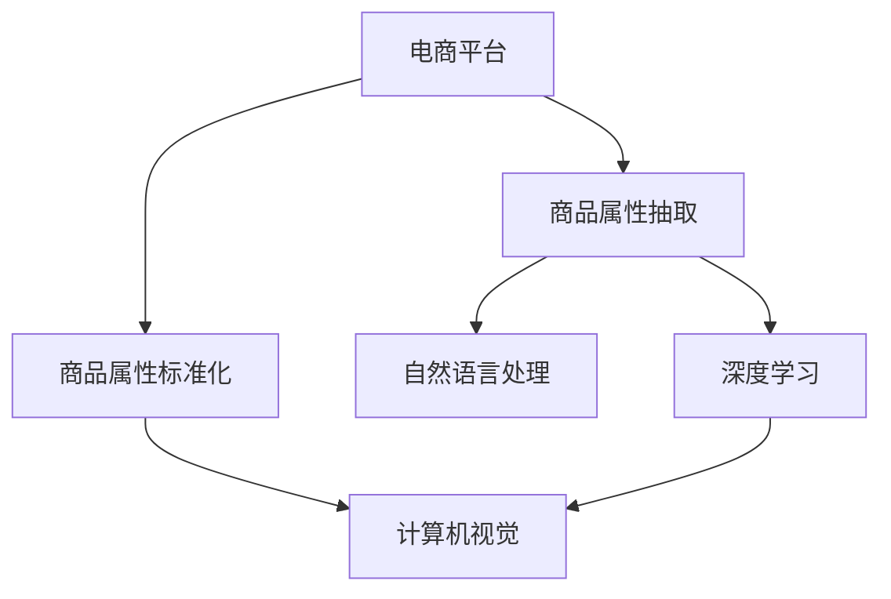

                 

# AI在电商平台商品属性抽取与标准化中的应用

> 关键词：电商平台,商品属性抽取,商品属性标准化,自然语言处理(NLP),深度学习,计算机视觉,模型融合

## 1. 背景介绍

随着电子商务的迅猛发展，电商平台已经成为消费者购物的主要渠道。为了提高用户体验和运营效率，电商平台需要高效地对海量商品信息进行管理和分类。商品属性抽取与标准化是电商平台信息管理的重要环节，涉及到商品描述信息的自动获取、分类、命名实体识别、数据清洗等多个关键任务。本文将深入探讨AI技术如何在电商平台中实现商品属性抽取与标准化，以期为电商平台的智能化运营提供有力支持。

## 2. 核心概念与联系

### 2.1 核心概念概述

为更好地理解AI在商品属性抽取与标准化中的应用，本节将介绍几个密切相关的核心概念：

- **电商平台(E-Commerce Platform)**：利用互联网提供商品展示、销售、支付等全流程服务的平台。
- **商品属性(商品属性)**：商品所具备的功能、规格、参数等描述信息。
- **商品属性抽取(商品属性抽取)**：从商品描述文本中自动提取商品属性及其对应值。
- **商品属性标准化(商品属性标准化)**：对提取出的商品属性进行格式、单位、语言等多维度的统一和规范。
- **自然语言处理(Natural Language Processing, NLP)**：利用AI技术处理和理解自然语言，包括文本预处理、分词、词性标注、命名实体识别等。
- **深度学习(Deep Learning)**：基于多层神经网络，从数据中自动学习特征和规律。
- **计算机视觉(Computer Vision)**：通过算法让计算机理解、解析和处理图像信息。
- **模型融合(Model Fusion)**：将多个模型组合起来，提升整体的性能和鲁棒性。

这些核心概念之间的逻辑关系可以通过以下Mermaid流程图来展示：



这个流程图展示了一些核心概念及其之间的关系：

1. 电商平台通过商品属性抽取和标准化，提高商品信息的自动化处理效率。
2. 商品属性抽取通常利用自然语言处理技术从商品描述中提取属性及其值。
3. 商品属性标准化则需利用深度学习和计算机视觉等技术，对提取出的属性进行多维度规范。
4. 模型融合可将多种技术手段结合，提升属性抽取和标准化的准确性和效率。

## 3. 核心算法原理 & 具体操作步骤

### 3.1 算法原理概述

商品属性抽取与标准化通常包括以下几个步骤：

1. **数据预处理**：对商品描述文本进行分词、去停用词、词性标注等处理。
2. **命名实体识别**：识别商品描述文本中的命名实体，如品牌、型号、价格等。
3. **属性抽取**：从命名实体中提取具体的属性名称和属性值。
4. **属性标准化**：将提取出的属性值进行格式、单位、语言等多维度的统一和规范。

本文将重点探讨如何利用AI技术实现上述步骤。

### 3.2 算法步骤详解

#### 3.2.1 数据预处理

数据预处理是商品属性抽取的第一步。通常包括以下操作：

1. **分词**：将商品描述文本切分为单词或短语，如使用jieba分词。
2. **去停用词**：去除文本中常见的无意义词，如“的”、“是”等，提升模型效率。
3. **词性标注**：为每个词标注其词性，如名词、动词、形容词等，有助于后续的实体识别。

#### 3.2.2 命名实体识别

命名实体识别（Named Entity Recognition, NER）是商品属性抽取的关键步骤。实体识别的目的是从文本中找出具有特定意义的实体，如人名、地名、组织名、时间、金额等。对于商品属性抽取，重点是识别与商品相关的实体。

1. **使用BERT模型**：BERT是当前最先进的自然语言处理模型之一，能够识别文本中的实体。
2. **训练自定义模型**：根据电商平台的商品描述特点，训练自定义的命名实体识别模型。
3. **使用规则和词典**：利用先验知识，如品牌词典、型号列表等，辅助识别商品实体。

#### 3.2.3 属性抽取

属性抽取是从命名实体中提取具体的属性名称和属性值。通常包括以下方法：

1. **正则表达式匹配**：利用正则表达式匹配常见的属性格式，如价格、颜色、尺寸等。
2. **基于规则的抽取**：利用预先定义的规则和模板，自动抽取属性名称和属性值。
3. **基于深度学习的抽取**：利用深度学习模型，如RNN、LSTM、Transformer等，自动抽取属性及其值。

#### 3.2.4 属性标准化

属性标准化是商品属性抽取的最后一步，旨在对提取出的属性值进行统一和规范。通常包括以下步骤：

1. **格式统一**：将不同的属性值转换为统一的格式，如货币单位、长度单位等。
2. **单位转换**：将不同的单位进行统一转换，如将厘米转换为英寸。
3. **语言规范**：将属性值转换为统一的语种，如中文转换为英文。

### 3.3 算法优缺点

**优点**：
1. **自动化效率高**：AI技术可以自动处理海量商品描述，显著提高属性抽取和标准化的效率。
2. **鲁棒性强**：通过深度学习模型和规则结合，可以应对复杂的商品描述格式和数据噪声。
3. **可扩展性好**：基于可训练的深度学习模型，可以根据平台需求自定义训练，适应不同种类的商品。

**缺点**：
1. **初始投入大**：需要准备高质量的训练数据和计算资源，训练模型可能需要较长时间。
2. **解释性不足**：深度学习模型通常是"黑盒"，难以解释其内部的工作机制。
3. **依赖数据质量**：模型性能受训练数据的影响较大，数据质量不佳可能影响抽取效果。

### 3.4 算法应用领域

基于AI技术的商品属性抽取与标准化，已经在多个电商平台得到广泛应用，涵盖了以下领域：

1. **电商运营**：利用属性抽取与标准化，实现商品信息的自动化处理和分类。
2. **搜索优化**：将商品属性转化为搜索标签，提升搜索的准确性和覆盖率。
3. **推荐系统**：根据商品属性生成推荐内容，提升用户的购物体验。
4. **库存管理**：利用属性信息进行库存监控和补货决策，提高库存周转率。
5. **客服支持**：通过属性抽取，生成常见问题的标准答案，提升客服的响应速度和准确性。

除了上述这些应用场景外，基于AI技术的大规模商品属性抽取与标准化，还为电商平台的自动化运营、个性化推荐、精准营销等领域带来了革命性的变化。

## 4. 数学模型和公式 & 详细讲解 & 举例说明

### 4.1 数学模型构建

假设电商平台上的商品描述文本为 $D = \{x_1, x_2, \ldots, x_n\}$，其中每个 $x_i$ 是一个自然语言句子。商品属性抽取的数学模型可以表示为：

$$
\hat{A} = f(D; \theta)
$$

其中 $\hat{A}$ 是模型预测的属性集合，$D$ 是训练数据集，$\theta$ 是模型的参数，$f$ 是一个可训练的函数。

### 4.2 公式推导过程

对于商品属性抽取的模型，通常使用序列标注任务进行训练。给定一个句子 $x_i$，目标是预测每个位置 $t$ 的属性标签 $y_t \in \{BIOE\}$，其中 $B$ 表示属性的起始位置，$I$ 表示属性的内部位置，$O$ 表示属性的结束位置，$E$ 表示实体的内部位置。

使用BERT模型进行序列标注的任务可以表示为：

$$
y_t = \text{softmax}(W_t h_t + b_t)
$$

其中 $h_t$ 是BERT模型在位置 $t$ 的隐藏状态，$W_t$ 和 $b_t$ 是可训练的参数向量。

对于属性抽取，通常使用正则表达式或规则模板进行匹配。假设某个属性名称为 $A$，匹配到的位置为 $[t_1, t_2]$，则属性值可以表示为 $A(x_{[t_1, t_2]})$。

### 4.3 案例分析与讲解

以电商平台上的商品描述“某品牌手机 黑色 128GB”为例，分析其属性抽取和标准化的过程：

1. **数据预处理**：使用jieba分词进行分词，得到 ["某品牌", "手机", "黑色", "128GB"]。
2. **命名实体识别**：利用BERT模型进行命名实体识别，识别出“某品牌”为品牌实体，“手机”为商品实体，“黑色”和“128GB”为属性实体。
3. **属性抽取**：根据正则表达式或规则模板，从命名实体中抽取属性名称和属性值。
4. **属性标准化**：将属性值转换为统一的格式，如价格单位统一为美元，颜色单位统一为RGB值。

最终，可以得到属性集合 $\{品牌: 某品牌, 颜色: 黑色, 容量: 128GB\}$，符合电商平台的商品属性规范。

## 5. 项目实践：代码实例和详细解释说明

### 5.1 开发环境搭建

在进行商品属性抽取与标准化的实践前，我们需要准备好开发环境。以下是使用Python进行PyTorch开发的环境配置流程：

1. 安装Anaconda：从官网下载并安装Anaconda，用于创建独立的Python环境。

2. 创建并激活虚拟环境：
```bash
conda create -n pytorch-env python=3.8 
conda activate pytorch-env
```

3. 安装PyTorch：根据CUDA版本，从官网获取对应的安装命令。例如：
```bash
conda install pytorch torchvision torchaudio cudatoolkit=11.1 -c pytorch -c conda-forge
```

4. 安装Transformers库：
```bash
pip install transformers
```

5. 安装各类工具包：
```bash
pip install numpy pandas scikit-learn matplotlib tqdm jupyter notebook ipython
```

完成上述步骤后，即可在`pytorch-env`环境中开始项目实践。

### 5.2 源代码详细实现

这里我们以使用BERT模型进行商品属性抽取为例，给出完整的Python代码实现。

```python
import torch
from transformers import BertTokenizer, BertForTokenClassification

# 初始化分词器和模型
tokenizer = BertTokenizer.from_pretrained('bert-base-cased')
model = BertForTokenClassification.from_pretrained('bert-base-cased', num_labels=4)

# 定义标签映射
label2id = {'B': 0, 'I': 1, 'O': 2, 'E': 3}

# 定义训练函数
def train_epoch(model, dataset, optimizer, loss_func):
    model.train()
    total_loss = 0
    for batch in dataset:
        input_ids = batch['input_ids'].to(device)
        attention_mask = batch['attention_mask'].to(device)
        labels = batch['labels'].to(device)

        outputs = model(input_ids, attention_mask=attention_mask, labels=labels)
        loss = loss_func(outputs.logits, labels)
        loss.backward()
        optimizer.step()
        optimizer.zero_grad()
        total_loss += loss.item()
    
    return total_loss / len(dataset)

# 定义评估函数
def evaluate(model, dataset, loss_func):
    model.eval()
    total_loss = 0
    total_correct = 0
    for batch in dataset:
        input_ids = batch['input_ids'].to(device)
        attention_mask = batch['attention_mask'].to(device)
        labels = batch['labels'].to(device)

        outputs = model(input_ids, attention_mask=attention_mask, labels=labels)
        loss = loss_func(outputs.logits, labels)
        total_loss += loss.item()
        total_correct += torch.sum(outputs.logits.argmax(dim=2) == labels).item()

    return total_loss / len(dataset), total_correct / len(dataset)

# 训练模型
epochs = 3
batch_size = 16
device = torch.device('cuda') if torch.cuda.is_available() else torch.device('cpu')
optimizer = torch.optim.Adam(model.parameters(), lr=1e-5)

# 加载数据集
train_dataset = # 训练集数据集
val_dataset = # 验证集数据集

# 训练模型
for epoch in range(epochs):
    train_loss = train_epoch(model, train_dataset, optimizer, loss_func)
    val_loss, val_correct = evaluate(model, val_dataset, loss_func)
    print(f"Epoch {epoch+1}, train loss: {train_loss:.4f}, val loss: {val_loss:.4f}, val accuracy: {val_correct:.4f}")
```

### 5.3 代码解读与分析

让我们再详细解读一下关键代码的实现细节：

**模型初始化**：
- 使用BERT模型和相应的分词器进行初始化。

**标签映射**：
- 定义标签映射，将预定义的标签转换为模型所需的数值型标签。

**训练函数**：
- 在每个epoch内，对训练集进行迭代训练。
- 在每个批次内，将输入数据和标签送入模型进行前向传播，计算损失函数。
- 反向传播更新模型参数，并进行梯度清零。
- 记录每个epoch的总损失。

**评估函数**：
- 在验证集上评估模型性能。
- 计算验证集的损失和准确率。

**训练模型**：
- 循环迭代多个epoch，直至模型收敛。

可以看到，代码实现虽然简单，但涉及数据预处理、模型训练、评估等关键步骤，符合商品属性抽取与标准化的实际需求。

## 6. 实际应用场景

### 6.1 智能运营

基于AI技术的大规模商品属性抽取与标准化，可以为电商平台的智能运营带来显著的提升。具体来说，可以通过以下方式实现：

1. **自动分拣与分类**：将商品属性转换为标准化的数据标签，自动化地对商品进行分类和分拣。
2. **搜索优化**：利用属性标签进行搜索结果排序和推荐，提升用户的购物体验。
3. **库存管理**：根据属性标签实时监控库存状态，优化补货策略。
4. **个性化推荐**：通过分析用户行为和商品属性，生成个性化推荐内容。

### 6.2 客户服务

在客户服务方面，AI技术也可以发挥重要作用。具体来说：

1. **自动回复**：利用属性抽取技术，生成常见问题的标准答案，自动回复用户咨询。
2. **语音客服**：将商品属性转化为语音数据，实现语音客服的智能回复。
3. **多渠道支持**：将属性抽取技术应用于多渠道客服系统，提供一致的服务体验。

### 6.3 未来应用展望

随着AI技术的不断进步，基于商品属性抽取与标准化的应用也将不断扩展。未来，可以进一步探索以下领域：

1. **智能推荐**：结合用户行为和商品属性，实现更加精准和个性化的商品推荐。
2. **智能搜索**：利用自然语言处理技术，提升搜索的准确性和覆盖率。
3. **智能客服**：结合语音和文本处理技术，实现智能客服的全面覆盖。
4. **智能库存**：利用预测模型和实时数据，优化库存管理。

## 7. 工具和资源推荐

### 7.1 学习资源推荐

为了帮助开发者系统掌握商品属性抽取与标准化的理论基础和实践技巧，这里推荐一些优质的学习资源：

1. **《自然语言处理入门》系列博文**：深入浅出地介绍了NLP的基本概念和核心技术。
2. **CS224N《深度学习自然语言处理》课程**：斯坦福大学开设的NLP明星课程，涵盖NLP的多个关键技术和应用。
3. **《自然语言处理与深度学习》书籍**：全面介绍了自然语言处理和深度学习的各个环节，包括序列标注任务。
4. **HuggingFace官方文档**：提供了大量预训练语言模型和深度学习框架的使用指南。
5. **CLUE开源项目**：中文语言理解测评基准，包含大量标注数据和预训练模型。

通过这些资源的学习实践，相信你一定能够快速掌握商品属性抽取与标准化的精髓，并用于解决实际的电商问题。

### 7.2 开发工具推荐

高效的开发离不开优秀的工具支持。以下是几款用于商品属性抽取与标准化开发的常用工具：

1. **PyTorch**：基于Python的开源深度学习框架，适合快速迭代研究。
2. **TensorFlow**：由Google主导开发的开源深度学习框架，适合大规模工程应用。
3. **Transformers库**：HuggingFace开发的NLP工具库，支持多种预训练语言模型，便于微调和扩展。
4. **Weights & Biases**：模型训练的实验跟踪工具，可以记录和可视化模型训练过程中的各项指标。
5. **TensorBoard**：TensorFlow配套的可视化工具，实时监测模型训练状态。
6. **Google Colab**：谷歌推出的在线Jupyter Notebook环境，免费提供GPU/TPU算力。

合理利用这些工具，可以显著提升商品属性抽取与标准化的开发效率，加快创新迭代的步伐。

### 7.3 相关论文推荐

商品属性抽取与标准化技术的发展源于学界的持续研究。以下是几篇奠基性的相关论文，推荐阅读：

1. **Attention is All You Need**：提出了Transformer结构，开启了NLP领域的预训练大模型时代。
2. **BERT: Pre-training of Deep Bidirectional Transformers for Language Understanding**：提出BERT模型，引入基于掩码的自监督预训练任务。
3. **Parameter-Efficient Transfer Learning for NLP**：提出Adapter等参数高效微调方法，减小微调对参数量的依赖。
4. **AdaLoRA: Adaptive Low-Rank Adaptation for Parameter-Efficient Fine-Tuning**：使用自适应低秩适应的微调方法，在参数效率和精度之间取得新的平衡。
5. **Prompt Learning in NLP**：引入基于连续型Prompt的微调范式，为无监督学习提供新的思路。

这些论文代表了大语言模型微调技术的发展脉络。通过学习这些前沿成果，可以帮助研究者把握学科前进方向，激发更多的创新灵感。

## 8. 总结：未来发展趋势与挑战

### 8.1 总结

本文对基于AI技术在电商平台中的商品属性抽取与标准化进行了全面系统的介绍。首先阐述了商品属性抽取与标准化的研究背景和意义，明确了AI技术在这一环节的重要作用。其次，从原理到实践，详细讲解了商品属性抽取与标准化的数学模型和关键步骤，给出了项目实践的完整代码实例。同时，本文还广泛探讨了AI技术在智能运营、客户服务等多个电商场景中的应用前景，展示了AI技术在电商平台中的广阔应用空间。

通过本文的系统梳理，可以看到，基于AI技术的商品属性抽取与标准化技术已经逐步成熟，正在为电商平台的智能化运营提供有力支持。未来，伴随AI技术的不断进步，商品属性抽取与标准化技术也将迎来新的突破，为电商平台的自动化、个性化和智能化发展注入新的动力。

### 8.2 未来发展趋势

展望未来，商品属性抽取与标准化技术将呈现以下几个发展趋势：

1. **自动化水平提升**：随着AI技术的不断进步，商品属性抽取与标准化的自动化水平将进一步提升，减少人工干预的环节。
2. **智能化程度提高**：结合深度学习、自然语言处理、计算机视觉等多种技术手段，提升属性抽取与标准化的准确性和鲁棒性。
3. **实时性增强**：利用分布式计算和多模态融合技术，提升属性抽取与标准化的实时性和处理速度。
4. **跨平台融合**：将商品属性抽取与标准化技术应用于多个电商平台的业务流程中，实现跨平台协同运营。
5. **多场景拓展**：将属性抽取与标准化技术应用于更多电商场景，如智能客服、个性化推荐、库存管理等，提升电商平台的运营效率和用户满意度。

### 8.3 面临的挑战

尽管商品属性抽取与标准化技术已经取得了显著进展，但在迈向更加智能化、普适化应用的过程中，仍面临诸多挑战：

1. **数据质量问题**：商品描述的复杂性和多样性，导致数据预处理和清洗的难度较大，数据质量参差不齐。
2. **模型复杂度**：大规模商品属性抽取与标准化的实现需要复杂的算法和模型结构，对计算资源和存储空间要求较高。
3. **鲁棒性不足**：商品属性抽取与标准化模型在处理异常数据和噪声时，鲁棒性有待进一步提升。
4. **隐私保护**：电商平台上涉及大量用户隐私数据，如何在抽取和标准化过程中保护用户隐私，是一个重要的挑战。
5. **跨语言支持**：如何将商品属性抽取与标准化技术应用于多语言场景，是一个需要解决的难题。

### 8.4 研究展望

面对商品属性抽取与标准化技术所面临的种种挑战，未来的研究需要在以下几个方面寻求新的突破：

1. **数据增强与清洗**：利用数据增强技术提升数据质量和数量，结合自动清洗工具，提高数据处理的效率和准确性。
2. **模型优化**：开发更加高效的模型结构，利用分布式计算和多模态融合技术，提升模型的处理速度和准确性。
3. **隐私保护技术**：结合差分隐私、联邦学习等技术，保护用户隐私，同时保证模型性能。
4. **跨语言模型**：开发跨语言的模型和算法，支持多语言的商品属性抽取与标准化。
5. **动态调整**：结合实时数据分析和反馈，动态调整商品属性抽取与标准化的策略，提升系统的适应性和稳定性。

这些研究方向和技术的突破，必将进一步推动商品属性抽取与标准化技术的进步，为电商平台的智能化运营提供更有力的支持。面向未来，商品属性抽取与标准化技术将在自动化、智能化、普适化和隐私保护等方面取得新的突破，为电商平台的数字化转型注入新的动力。

## 9. 附录：常见问题与解答

**Q1：商品属性抽取和标准化的效果如何评价？**

A: 商品属性抽取和标准化的效果可以通过以下几个指标进行评价：
1. **准确率**：模型预测的属性及其值与实际标注的属性及其值相匹配的比率。
2. **召回率**：实际存在的属性及其值被模型正确预测的比率。
3. **F1-score**：准确率和召回率的调和平均数，综合评价模型的效果。

**Q2：商品属性抽取过程中需要注意哪些问题？**

A: 商品属性抽取过程中需要注意以下问题：
1. **数据质量**：确保输入的文本数据准确、完整、无噪声，影响抽取效果。
2. **规则设计**：定义合理的规则和模板，涵盖常见的属性名称和格式，提高抽取的准确性。
3. **模型训练**：使用高质量的标注数据和合适的训练策略，训练出鲁棒性强的模型。

**Q3：商品属性标准化的过程中如何保证不同属性的一致性？**

A: 商品属性标准化过程中，需要注意以下问题：
1. **格式统一**：确保所有属性值采用统一的格式和单位，如货币单位、长度单位等。
2. **单位转换**：将不同单位的数据进行统一转换，如将厘米转换为英寸。
3. **语言规范**：将属性值转换为统一的语种，如中文转换为英文，提升系统的跨语言适应性。

**Q4：如何在电商平台上实现商品属性的实时抽取与标准化？**

A: 要在电商平台上实现商品属性的实时抽取与标准化，需要以下步骤：
1. **数据实时采集**：利用API或爬虫技术，实时获取商品描述数据。
2. **分布式处理**：利用分布式计算框架，如Spark、Flink等，对数据进行分布式处理，提升处理速度。
3. **模型实时部署**：利用模型服务化封装技术，将训练好的模型部署到电商平台的实时系统中。
4. **数据实时更新**：实时更新训练数据和模型参数，保证模型的实时性。

**Q5：商品属性抽取与标准化技术未来有哪些发展趋势？**

A: 商品属性抽取与标准化技术未来的发展趋势包括：
1. **跨平台融合**：将属性抽取与标准化技术应用于多个电商平台，实现跨平台协同运营。
2. **多模态融合**：结合图像、视频等多模态数据，提升属性的准确性和鲁棒性。
3. **实时性增强**：利用分布式计算和多模态融合技术，提升属性的实时性和处理速度。
4. **智能化提升**：结合深度学习、自然语言处理、计算机视觉等多种技术手段，提升属性的抽取与标准化效果。
5. **隐私保护**：结合差分隐私、联邦学习等技术，保护用户隐私，同时保证模型性能。

这些发展趋势展示了商品属性抽取与标准化技术的前景和潜力，为电商平台的智能化运营提供了新的方向和思路。

---

作者：禅与计算机程序设计艺术 / Zen and the Art of Computer Programming

