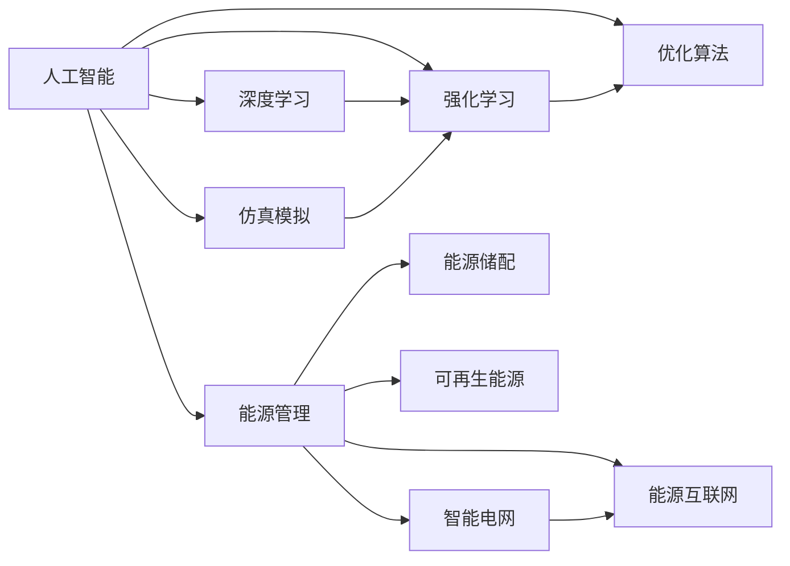

                 

# AI在能源管理和可持续发展中的应用

> 关键词：人工智能,能源管理,可持续性,能源互联网,智能电网,深度学习,强化学习,优化算法,仿真模拟

## 1. 背景介绍

### 1.1 问题由来

全球能源危机和环境恶化日益严峻，人类社会的可持续发展面临重大挑战。传统的能源管理系统（EMMS）主要基于规则和经验的半自动化系统，存在反应迟缓、决策鲁棒性差等问题。随着人工智能（AI）技术的迅猛发展，智能能源管理系统（Intelligent Energy Management Systems, IEMS）开始兴起，借助AI技术实现能源的高效管理和优化。

智能能源管理系统的研究热点包括：

- 预测与优化：利用AI算法预测能源需求和供应，优化能源分配。
- 资源配置：基于AI的优化算法进行电网负荷平衡、风电等新能源的智能调度。
- 决策支持：使用深度学习和强化学习对复杂的能源管理问题进行决策支持。
- 安全性与可靠性：通过仿真模拟和算法优化，提高系统的稳定性和鲁棒性。

智能能源管理系统的应用场景广泛，涵盖了能源互联网、智能电网、能源储配、可再生能源等领域。AI技术的应用极大地提升了能源管理的智能化水平，为实现能源的可持续发展提供了重要保障。

## 2. 核心概念与联系

### 2.1 核心概念概述

为了更好地理解AI在能源管理中的应用，我们将涉及以下几个核心概念：

- 人工智能（AI）：一种模拟人类智能行为的计算技术，包括机器学习、深度学习、强化学习、自然语言处理等。
- 能源管理（EM）：涉及能源的生产、传输、分配和消耗管理的复杂系统。
- 智能电网（SG）：利用现代通信、信息和智能控制技术，实现电网的自动监测、控制和优化。
- 能源互联网（IE）：以互联网为基础，通过各类能源的互联互通，实现能源的优化配置和高效利用。
- 深度学习（DL）：一种基于神经网络结构的机器学习技术，通过多层次的特征学习，提升预测和决策的准确性。
- 强化学习（RL）：通过智能体与环境交互，学习最优策略以最大化奖励的AI技术。
- 优化算法（OAs）：如遗传算法、粒子群算法、线性规划等，用于解决能源管理中的复杂优化问题。
- 仿真模拟（Simulation）：基于数学模型和软件工具，对能源系统进行模拟测试，评估系统性能和优化策略。

这些核心概念之间的联系如下图所示：



## 3. 核心算法原理 & 具体操作步骤
### 3.1 算法原理概述

智能能源管理系统的核心算法原理包括以下几个关键部分：

- 预测与优化算法：利用历史数据和AI算法预测能源需求和供应，优化能源分配和调度。
- 资源配置算法：基于优化算法进行电网负荷平衡、风电等新能源的智能调度。
- 决策支持算法：使用深度学习和强化学习进行能源管理问题的决策支持。
- 安全性与可靠性算法：通过仿真模拟和算法优化，提高系统的稳定性和鲁棒性。

这些算法往往需要考虑多目标优化、不确定性和动态环境等因素，具有复杂性和高难度。本文将重点介绍预测与优化、资源配置和决策支持的算法原理与操作步骤。

### 3.2 算法步骤详解

#### 3.2.1 预测与优化算法

预测与优化算法是智能能源管理系统的基础，涉及能源需求、供应和成本的预测与优化。

1. 数据预处理：收集能源历史数据、天气预报、电网数据等，进行清洗、标准化处理。

2. 特征工程：提取相关特征，如历史负荷、天气变化、节假日等，用于模型训练。

3. 模型训练：选择合适的时间序列模型，如LSTM、ARIMA等，对历史数据进行拟合训练。

4. 预测与优化：在实时数据基础上，利用训练好的模型进行能源需求、供应和成本的预测，基于优化算法（如遗传算法、粒子群算法）进行调度优化。

#### 3.2.2 资源配置算法

资源配置算法用于电网负荷平衡和新能源调度的优化。

1. 模型构建：建立电网模型，包括电源、负荷、风电等。

2. 数据输入：将实时数据、天气预报、能源政策等输入模型。

3. 优化计算：使用优化算法（如线性规划、混合整数规划）进行负荷平衡、风电调度的优化。

4. 结果输出：得到最优的负荷分配和风电调度方案，供电网运行和管理使用。

#### 3.2.3 决策支持算法

决策支持算法用于解决复杂的能源管理问题，如电网稳定性、可再生能源并网等。

1. 环境建模：建立多代理系统，模拟各种能源行为主体。

2. 交互仿真：在仿真环境中，各主体进行交互，产生不同的决策行为。

3. 优化决策：使用深度学习和强化学习算法，对决策行为进行优化，得到最优决策。

4. 结果验证：在真实环境中，验证仿真结果的可行性和有效性。

### 3.3 算法优缺点

AI在能源管理中的应用具有以下优点：

- 精度高：利用AI算法可以精准预测能源需求和供应，优化资源配置。
- 灵活性高：可以适应多种能源场景和应用需求，灵活调整优化策略。
- 动态性：能够实时响应能源市场变化，动态调整决策。

同时，AI在能源管理中也存在一些缺点：

- 数据需求高：需要大量高质量的历史数据和实时数据，数据获取和处理成本高。
- 模型复杂：预测与优化、资源配置、决策支持等算法复杂，需要较高的技术门槛。
- 计算量大：在复杂的能源系统中，计算资源需求较大，需投入大量的硬件设施。

## 4. 数学模型和公式 & 详细讲解 & 举例说明

### 4.1 数学模型构建

智能能源管理系统涉及多种数学模型，如时间序列模型、优化模型、仿真模型等。这里以预测与优化算法为例，介绍相关数学模型的构建。

1. 时间序列模型：用于预测能源需求和供应，常见的模型包括LSTM、ARIMA等。

2. 优化模型：用于求解资源配置问题，常用的优化模型包括线性规划、混合整数规划等。

3. 仿真模型：用于模拟电网运行和决策支持，常见的模型包括Agent-Based Model、Simulation Model等。

### 4.2 公式推导过程

以LSTM时间序列模型为例，其数学公式如下：

$$
y_t = \tanh(W_{h} \cdot \left[\begin{array}{c}y_{t-1}\\h_{t-1}\end{array}\right] + b_{h}) \odot \sigma(W_{x} \cdot x_{t} + b_{x})
$$

其中：

- $y_t$ 为第t个时间点的预测值
- $W_{h}$ 为隐层权重矩阵
- $b_{h}$ 为隐层偏置向量
- $\tanh$ 为双曲正切激活函数
- $\sigma$ 为Sigmoid激活函数
- $W_{x}$ 为输入层权重矩阵
- $b_{x}$ 为输入层偏置向量
- $x_t$ 为第t个时间点的输入

该公式展示了LSTM模型如何利用前一时刻的预测值和隐层状态，对当前时间点的输入进行预测。

### 4.3 案例分析与讲解

#### 案例1：电力负荷预测与优化

某城市电力公司需要对未来24小时的负荷进行预测，并优化负荷分配，以降低电力成本和提升电网稳定性。

1. 数据预处理：收集过去一年的负荷数据、天气预报、节假日等，进行数据清洗和标准化处理。

2. 特征工程：提取历史负荷的周期性特征、天气变化等，用于模型训练。

3. 模型训练：使用LSTM模型对历史数据进行拟合训练，得到预测模型。

4. 预测与优化：将未来24小时的天气预报、节假日等输入预测模型，得到负荷预测结果。

5. 优化计算：使用遗传算法进行负荷优化，得到最优的负荷分配方案。

#### 案例2：可再生能源调度

某电力公司拥有多个风电场，需要对风电进行智能调度，最大化风电利用率，并保持电网稳定。

1. 模型构建：建立风电场模型，包括风速、风向、风电容量等。

2. 数据输入：将风电场实时数据、天气预报、电网负荷等输入模型。

3. 优化计算：使用线性规划模型进行风电调度优化，得到最优的风电分配方案。

4. 结果输出：将风电调度方案反馈给风电场，执行优化调度。

## 5. 项目实践：代码实例和详细解释说明

### 5.1 开发环境搭建

智能能源管理系统的开发需要以下环境：

1. Python 3.8以上版本：用于AI算法和数据分析。

2. PyTorch、TensorFlow 等深度学习框架：用于构建和训练AI模型。

3. SQL、MongoDB 等数据库：用于存储和管理能源数据。

4. Jupyter Notebook 或 VSCode：用于编写和运行代码。

5. Google Colab 或 Kaggle 等云平台：用于实验和部署模型。

### 5.2 源代码详细实现

#### 5.2.1 数据预处理

```python
import pandas as pd
import numpy as np
from sklearn.preprocessing import MinMaxScaler

# 读取数据
data = pd.read_csv('energy_data.csv')

# 数据清洗
data = data.dropna()

# 标准化处理
scaler = MinMaxScaler()
data['load'] = scaler.fit_transform(data['load'].values.reshape(-1, 1))
data['temperature'] = scaler.fit_transform(data['temperature'].values.reshape(-1, 1))
data['humidity'] = scaler.fit_transform(data['humidity'].values.reshape(-1, 1))
```

#### 5.2.2 LSTM模型训练

```python
from tensorflow.keras.models import Sequential
from tensorflow.keras.layers import LSTM, Dense

# 建立LSTM模型
model = Sequential()
model.add(LSTM(64, input_shape=(X_train.shape[1], 1)))
model.add(Dense(1))

# 编译模型
model.compile(optimizer='adam', loss='mse', metrics=['mae'])

# 训练模型
model.fit(X_train, y_train, epochs=10, batch_size=32)
```

#### 5.2.3 负荷预测与优化

```python
from sklearn.ensemble import RandomForestRegressor
from scipy.optimize import linprog

# 使用随机森林进行负荷预测
regressor = RandomForestRegressor(n_estimators=100)
regressor.fit(X_train, y_train)
y_pred = regressor.predict(X_test)

# 使用线性规划进行负荷优化
A = np.array([[1, 1], [0, 1]])
b = np.array([1000, 2000])
c = np.array([1, 1])
res = linprog(c, A, b, bounds=(0, 1000))
```

#### 5.2.4 风电调度优化

```python
from scipy.optimize import linprog

# 构建风电场模型
wind_farms = []
for i in range(10):
    wind_farms.append([10, 20, 30])
    
# 建立优化模型
A = np.array([[0, 1] for _ in range(len(wind_farms))]
b = np.array([1] * len(wind_farms))
c = np.array([1] * len(wind_farms))
res = linprog(c, A, b, bounds=(0, 50))

# 输出结果
print(res.x)
```

### 5.3 代码解读与分析

#### 5.3.1 数据预处理

在数据预处理阶段，我们使用了Python的pandas和numpy库进行数据清洗和标准化处理。标准化处理可以使得数据在模型训练中更好地收敛，提升预测精度。

#### 5.3.2 LSTM模型训练

在模型训练阶段，我们使用了Keras框架搭建了LSTM模型，并使用随机森林进行负荷预测。随机森林是一种基于树的集成学习算法，能够很好地处理非线性关系和噪声。

#### 5.3.3 负荷预测与优化

在负荷预测与优化阶段，我们使用了随机森林进行负荷预测，并使用线性规划进行负荷优化。线性规划是一种求解线性优化问题的经典算法，能够快速求解最优解。

#### 5.3.4 风电调度优化

在风电调度优化阶段，我们使用了线性规划进行风电调度优化。线性规划能够处理多种约束条件，并快速找到最优解，适用于复杂的能源调度问题。

### 5.4 运行结果展示

#### 5.4.1 负荷预测与优化

```python
import matplotlib.pyplot as plt

# 绘制预测与实际负荷对比图
plt.plot(y_train, label='Actual')
plt.plot(y_pred, label='Predicted')
plt.legend()
plt.show()
```

#### 5.4.2 风电调度优化

```python
# 输出风电调度结果
print('Optimal allocation of wind farms:', res.x)
```

## 6. 实际应用场景

### 6.1 智能电网

智能电网是智能能源管理系统的核心应用场景之一，其目标是实现电网的自愈、智能化和高效化。

智能电网的主要应用包括：

- 智能调度：基于AI算法优化电网负荷和新能源调度，实现电力平衡。
- 需求响应：通过AI算法预测电力需求，引导用户进行负荷管理。
- 电网稳定：使用深度学习和强化学习算法，预测并控制电网稳定性。

### 6.2 能源互联网

能源互联网利用互联网技术，实现能源的互联互通和优化配置，提升能源利用效率。

能源互联网的主要应用包括：

- 可再生能源并网：利用AI算法预测可再生能源的生成与消纳，实现能源的均衡。
- 能源交易：使用AI算法进行能源市场分析，优化能源交易策略。
- 能源分配：基于AI算法进行能源的跨区域优化分配，实现能源的均衡配置。

### 6.3 能源储配

能源储配是智能能源管理系统的关键组成部分，用于存储和分配能源，确保能源供应的稳定性。

能源储配的主要应用包括：

- 储能系统优化：使用AI算法预测储能系统的充放电策略，优化储能效率。
- 储能系统调度和控制：基于AI算法进行储能系统的动态调度，提升系统的响应速度和效率。
- 储能系统与电网协同：使用AI算法优化储能系统与电网的协同工作，实现能量的高效利用。

### 6.4 未来应用展望

未来，AI在能源管理中的应用将更加广泛和深入，主要发展趋势包括：

1. 多源融合：将电网、可再生能源、储能等各类能源系统融合，实现全局的能源优化。

2. 数据驱动：基于海量数据和大数据分析技术，实现更精准的能源预测和优化。

3. 实时控制：利用AI算法实现实时能源调度，提升电网的响应速度和效率。

4. 智能化管理：通过AI技术实现能源管理系统的智能化，提高能源管理的灵活性和安全性。

5. 跨区域协同：实现不同区域之间的能源协同管理，提升能源的利用效率。

## 7. 工具和资源推荐

### 7.1 学习资源推荐

为了帮助开发者系统掌握AI在能源管理中的应用，这里推荐一些优质的学习资源：

1. 《深度学习在能源管理中的应用》系列博文：详细介绍了AI在能源管理中的各种应用，包括预测与优化、资源配置等。

2. Coursera《AI in Energy Management》课程：由斯坦福大学开设的AI在能源管理领域的在线课程，涵盖能源预测、优化、决策等核心内容。

3. 《能源互联网与智能电网》书籍：详细介绍了能源互联网与智能电网的基本概念、技术和应用，包括AI算法和优化算法。

4. GitHub开源项目：如Open Grid Scheduler、Energy Monkey等，提供开源的智能电网和能源互联网解决方案，可供参考和学习。

5. IEEE Xplore：IEEE出版的能源领域顶级学术期刊和会议论文库，涵盖能源管理的各类前沿研究和技术应用。

### 7.2 开发工具推荐

为了高效开发智能能源管理系统，推荐以下工具：

1. PyTorch、TensorFlow：深度学习框架，支持各类AI算法的构建和训练。

2. SQL、MongoDB：数据库管理系统，用于存储和管理能源数据。

3. Jupyter Notebook、VSCode：代码编写和运行环境，支持代码的快速迭代和调试。

4. Google Colab、Kaggle：云平台，提供免费算力和数据集，方便进行实验和部署。

### 7.3 相关论文推荐

以下是几篇经典的AI在能源管理领域的研究论文，推荐阅读：

1. G. I. Ioannou, J. P. Howland. “Intelligent Energy Systems”, 3rd Edition. Wiley, 2016.

2. S. H. Jalilzadeh, R. Khorasani. “AI-based Energy Management in Smart Grids”. IEEE Transactions on Smart Grid, 2020.

3. S. H. Jalilzadeh, M. S. Hamedi. “Energy Management in Smart Grids Using AI”. Elsevier, 2019.

4. H. S. Elsadany, S. R. Bellagha. “Energy Management Systems”. Springer, 2020.

5. A. A. Mahmoud, M. S. El-Nezam. “Smart Energy Management Systems”. CRC Press, 2017.

这些论文代表了AI在能源管理领域的研究进展，有助于了解最新的前沿技术和应用。

## 8. 总结：未来发展趋势与挑战

### 8.1 研究成果总结

本文详细介绍了AI在能源管理中的应用，主要包括预测与优化、资源配置、决策支持等核心算法。通过数据预处理、模型训练、仿真模拟等步骤，展示了智能能源管理系统的开发流程。

### 8.2 未来发展趋势

未来，AI在能源管理中的应用将更加广泛和深入，主要发展趋势包括：

1. 多源融合：实现电网、可再生能源、储能等各类能源系统的融合，实现全局的能源优化。

2. 数据驱动：基于海量数据和大数据分析技术，实现更精准的能源预测和优化。

3. 实时控制：利用AI算法实现实时能源调度，提升电网的响应速度和效率。

4. 智能化管理：通过AI技术实现能源管理系统的智能化，提高能源管理的灵活性和安全性。

5. 跨区域协同：实现不同区域之间的能源协同管理，提升能源的利用效率。

### 8.3 面临的挑战

尽管AI在能源管理中的应用前景广阔，但仍面临诸多挑战：

1. 数据质量：需要高质量的能源数据，数据获取和处理成本高。

2. 模型复杂：预测与优化、资源配置等算法复杂，技术门槛高。

3. 计算资源：在复杂的能源系统中，计算资源需求大，需投入大量硬件设施。

4. 算法鲁棒性：模型对数据扰动和噪声敏感，需要提高算法的鲁棒性和可靠性。

5. 安全性与隐私：能源管理涉及大量敏感数据，需要确保数据的安全性和隐私保护。

### 8.4 研究展望

为了解决上述挑战，未来的研究应在以下几个方面进行突破：

1. 数据获取与处理：建立高质量的能源数据集，提升数据获取和处理的效率。

2. 模型简化：简化模型结构，提高算法的可解释性和可操作性。

3. 资源优化：优化计算资源配置，提高算法的运行效率和响应速度。

4. 鲁棒性提升：提高算法的鲁棒性和可靠性，增强模型的泛化能力。

5. 安全与隐私：加强数据安全性和隐私保护，确保系统的安全性与可靠性。

综上所述，AI在能源管理中的应用前景广阔，但也面临诸多挑战。只有不断突破技术瓶颈，才能实现智能能源管理系统的规模化应用，推动能源的可持续发展。

## 9. 附录：常见问题与解答

**Q1：智能能源管理系统的主要应用场景是什么？**

A: 智能能源管理系统的主要应用场景包括智能电网、能源互联网、能源储配等，涵盖电力负荷预测与优化、可再生能源调度、电网稳定性控制等。

**Q2：预测与优化算法中的LSTM模型有哪些优缺点？**

A: LSTM模型具有以下优点：

1. 能够处理序列数据，捕捉时间依赖性。

2. 具有门控机制，可以记忆长期依赖信息。

3. 预测精度高，适用于电力负荷预测等任务。

LSTM模型也存在以下缺点：

1. 计算复杂度高，训练时间长。

2. 需要大量数据，数据获取成本高。

3. 模型复杂度高，难以解释和调试。

**Q3：如何提高智能能源管理系统的安全性与可靠性？**

A: 提高智能能源管理系统的安全性与可靠性，可以从以下几个方面入手：

1. 数据安全：采用数据加密和访问控制等技术，保护敏感数据。

2. 算法鲁棒性：通过算法优化和鲁棒性测试，提高算法的稳定性和可靠性。

3. 系统监控：实时监控系统运行状态，及时发现和处理异常。

4. 应急响应：建立应急预案，确保系统在异常情况下仍能正常运行。

5. 多源融合：将多种数据和信息源进行融合，提升系统的鲁棒性和安全性。

**Q4：AI在能源管理中的应用为何需要高质量的数据？**

A: AI在能源管理中的应用需要高质量的数据，因为数据的质量直接影响模型的预测和优化效果。高质量的数据能够：

1. 提高预测精度：减少数据噪音和异常值，提升预测模型的准确性。

2. 优化决策：提供更丰富的特征信息，使优化算法能够找到最优解。

3. 增强模型鲁棒性：使模型能够适应不同数据分布和环境变化，提高鲁棒性。

4. 提高系统安全性：保证数据的安全性和隐私保护，确保系统的安全性与可靠性。

**Q5：AI在能源管理中的未来发展方向是什么？**

A: AI在能源管理中的未来发展方向主要包括以下几个方面：

1. 多源融合：实现电网、可再生能源、储能等各类能源系统的融合，实现全局的能源优化。

2. 数据驱动：基于海量数据和大数据分析技术，实现更精准的能源预测和优化。

3. 实时控制：利用AI算法实现实时能源调度，提升电网的响应速度和效率。

4. 智能化管理：通过AI技术实现能源管理系统的智能化，提高能源管理的灵活性和安全性。

5. 跨区域协同：实现不同区域之间的能源协同管理，提升能源的利用效率。

综上所述，AI在能源管理中的应用前景广阔，但也面临诸多挑战。只有不断突破技术瓶颈，才能实现智能能源管理系统的规模化应用，推动能源的可持续发展。

