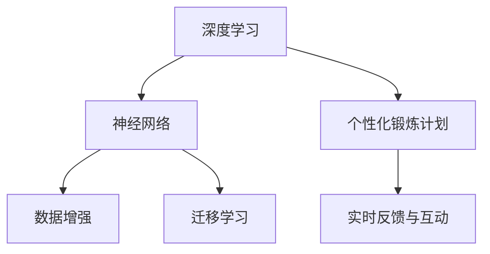

                 

# AI在虚拟健身教练中的应用：个性化锻炼计划

> 关键词：人工智能,健身教练,个性化锻炼计划,深度学习,神经网络,迁移学习,数据增强

## 1. 背景介绍

### 1.1 问题由来
随着人工智能(AI)技术的飞速发展，越来越多的AI应用开始渗透到传统行业。在健身领域，虚拟健身教练(Online Personal Trainer, OPT)成为了新兴的趋势。虚拟健身教练利用AI技术，提供定制化的锻炼计划、实时反馈和互动指导，帮助用户实现健身目标。

然而，传统的虚拟健身教练往往基于固定的训练计划和数据驱动的推荐，难以满足个性化需求。这促使我们探索如何利用AI技术，尤其是深度学习和迁移学习，构建更智能化、个性化的虚拟健身教练系统。

### 1.2 问题核心关键点
虚拟健身教练的核心目标是提供个性化的锻炼计划和实时反馈，确保用户能够安全、有效地进行锻炼。这需要在运动生理学、健身知识与AI技术的深度融合中寻找平衡，尤其需要解决以下几个关键问题：

1. **个性化锻炼计划生成**：基于用户的身体数据和行为习惯，自动生成个性化的锻炼方案。
2. **实时反馈与互动**：通过语音识别、图像识别等技术，实时监测用户的锻炼状态，并给出相应的反馈和指导。
3. **知识迁移与更新**：通过迁移学习，利用已有健身知识库，动态更新AI模型，保证知识的持续更新和适应性。

### 1.3 问题研究意义
构建个性化、智能化的虚拟健身教练，不仅能够提升用户的锻炼体验，还能提高锻炼效果和安全性。这对于推动健身行业向智能化、个性化方向发展，具有重要意义：

1. **提高用户粘性**：智能化、个性化的健身指导，能够更好地满足用户需求，提高用户对虚拟健身教练的依赖度和使用频率。
2. **提升锻炼效果**：个性化的锻炼计划和实时反馈，能够帮助用户科学地安排锻炼，提高锻炼的针对性和有效性。
3. **降低健身门槛**：虚拟教练能够全天候提供服务，不受时间和地点限制，便于更多人参与健身活动。
4. **促进健康管理**：结合健康监测数据，虚拟教练可以提供全方位的健康管理方案，帮助用户实现更全面的健康目标。

## 2. 核心概念与联系

### 2.1 核心概念概述

为了更好地理解虚拟健身教练的实现机制，本节将介绍几个核心概念及其相互关系：

- **深度学习**：利用多层神经网络进行特征学习和模型训练，通过大量的数据和反向传播算法来优化模型参数，以适应特定的任务。
- **迁移学习**：将一个领域学到的知识迁移到另一个领域，以减少新任务的数据需求。
- **神经网络**：由多个神经元组成的网络结构，用于模拟人类大脑的学习和决策过程。
- **数据增强**：通过图像旋转、裁剪、噪声注入等方式，扩充数据集，以增强模型的泛化能力。
- **个性化锻炼计划**：基于用户的身体数据和行为习惯，生成个性化的锻炼方案。
- **实时反馈与互动**：通过语音识别、图像识别等技术，实时监测用户的锻炼状态，并给出相应的反馈和指导。

这些核心概念之间的关系可以通过以下Mermaid流程图来展示：



这个流程图展示了核心概念之间的逻辑关系：

1. 深度学习通过神经网络对数据进行处理和特征提取。
2. 数据增强用于扩充训练数据集，提高模型的泛化能力。
3. 迁移学习用于将已有知识迁移到新的任务上，减少新任务的数据需求。
4. 个性化锻炼计划通过深度学习和迁移学习生成。
5. 实时反馈与互动依赖于深度学习和数据增强技术，实现对用户锻炼状态的实时监测和反馈。

## 3. 核心算法原理 & 具体操作步骤
### 3.1 算法原理概述

虚拟健身教练的实现依赖于多个AI技术和方法的结合，核心在于深度学习和迁移学习。以下是对这两大算法原理的详细阐述。

### 3.2 算法步骤详解

**深度学习算法步骤**：

1. **数据准备**：收集和整理用户的锻炼数据，包括身体指标、锻炼历史、运动视频等，建立数据集。
2. **模型选择**：选择合适的神经网络模型，如CNN、RNN或Transformer等，用于特征提取和决策。
3. **模型训练**：在训练集上训练模型，通过反向传播算法更新参数，以最小化损失函数。
4. **模型评估**：在验证集上评估模型性能，调整超参数，如学习率、批大小等。
5. **模型部署**：将训练好的模型部署到实际应用中，进行预测和推理。

**迁移学习算法步骤**：

1. **预训练**：在大型数据集上预训练一个通用模型，如ResNet、VGG等，用于特征提取。
2. **微调**：在小规模数据集上微调预训练模型，以适应特定的健身任务。
3. **知识迁移**：利用预训练模型的知识和特征，更新模型以适应新的数据和任务。
4. **模型更新**：定期在新的数据上更新模型，保持知识的持续性和适应性。

### 3.3 算法优缺点

**深度学习算法优缺点**：

- **优点**：
  - **数据驱动**：深度学习模型能够利用大量数据进行训练，提升模型准确性。
  - **特征提取能力强**：通过多层神经网络，能够提取复杂的特征，适应多变的数据分布。
  - **可解释性差**：深度学习模型的决策过程较难解释，但通过可视化技术，也能对部分特征进行解释。

- **缺点**：
  - **数据需求高**：需要大量标注数据，训练和部署成本较高。
  - **过拟合风险**：模型复杂度大，容易发生过拟合，泛化能力弱。
  - **计算资源要求高**：训练和推理过程需要大量的计算资源和时间。

**迁移学习算法优缺点**：

- **优点**：
  - **知识复用**：利用已有知识，减少新任务的数据需求。
  - **泛化能力强**：在小规模数据上仍能获得较好的性能。
  - **减少过拟合**：通过预训练模型，避免在小样本上的过拟合问题。

- **缺点**：
  - **模型适应性差**：预训练模型往往在特定领域下性能较好，跨领域迁移能力有限。
  - **模型复杂度高**：需要维护预训练和微调两个阶段的模型，管理复杂。

### 3.4 算法应用领域

虚拟健身教练作为AI技术在健身领域的应用，覆盖了多个方面：

- **个性化锻炼计划**：基于用户的身体数据和锻炼历史，生成个性化的锻炼方案。
- **实时反馈与互动**：通过语音识别、图像识别等技术，实时监测用户的锻炼状态，并给出相应的反馈和指导。
- **健康管理**：结合健康监测数据，提供全方位的健康管理方案。
- **行为分析**：通过数据分析，识别用户的行为模式和习惯，进行行为干预和优化。

这些应用领域展示了深度学习和迁移学习在虚拟健身教练中的强大应用前景，能够极大地提升用户体验和锻炼效果。

## 4. 数学模型和公式 & 详细讲解 & 举例说明

### 4.1 数学模型构建

在虚拟健身教练的实现中，涉及多个数学模型的构建。这里以一个简单的回归问题为例，展示如何构建和训练神经网络模型。

假设我们要预测用户的锻炼效果（例如心率），可以构建一个线性回归模型：

$$ y = \theta^T x $$

其中，$y$ 为预测的心率，$x$ 为输入的特征向量，$\theta$ 为模型参数。

### 4.2 公式推导过程

线性回归模型的最小化损失函数为：

$$ L(\theta) = \frac{1}{2N} \sum_{i=1}^N (y_i - \theta^T x_i)^2 $$

其中，$N$ 为样本数量，$y_i$ 为第 $i$ 个样本的真实心率值，$x_i$ 为第 $i$ 个样本的特征向量。

通过梯度下降算法，求取损失函数的最小化解：

$$ \theta = (X^T X)^{-1} X^T Y $$

其中，$X$ 为特征矩阵，$Y$ 为标签矩阵。

### 4.3 案例分析与讲解

假设我们收集了50个用户的锻炼数据，每个用户记录了每天的心率、锻炼时长、体重等特征，以及对应的实际心率值。构建一个线性回归模型，用于预测未来的心率值。

通过训练集，得到模型参数 $\theta$，然后对测试集进行预测，并计算预测误差。最终，通过均方误差 (MSE) 评估模型的性能：

$$ MSE = \frac{1}{N} \sum_{i=1}^N (y_i - \hat{y}_i)^2 $$

其中，$\hat{y}_i$ 为第 $i$ 个样本的预测心率值。

## 5. 项目实践：代码实例和详细解释说明

### 5.1 开发环境搭建

在进行虚拟健身教练的开发前，需要准备相应的开发环境。以下是使用Python进行TensorFlow开发的环境配置流程：

1. 安装Anaconda：从官网下载并安装Anaconda，用于创建独立的Python环境。
2. 创建并激活虚拟环境：
```bash
conda create -n tf-env python=3.8 
conda activate tf-env
```
3. 安装TensorFlow：根据CUDA版本，从官网获取对应的安装命令。例如：
```bash
conda install tensorflow -c conda-forge
```
4. 安装各类工具包：
```bash
pip install numpy pandas scikit-learn matplotlib tqdm jupyter notebook ipython
```

完成上述步骤后，即可在`tf-env`环境中开始虚拟健身教练的开发。

### 5.2 源代码详细实现

下面我们以预测用户心率为例，给出使用TensorFlow进行虚拟健身教练开发的PyTorch代码实现。

首先，定义数据处理函数：

```python
import tensorflow as tf
from tensorflow.keras.layers import Dense, Dropout, Input, Model
from tensorflow.keras.optimizers import Adam
from tensorflow.keras.metrics import MeanSquaredError

# 定义数据预处理函数
def preprocess_data(data):
    # 将数据标准化
    data = (data - data.mean()) / data.std()
    # 将数据分为特征和标签
    features = data[:, :-1]
    labels = data[:, -1]
    # 数据增强
    features = tf.image.random_flip_left_right(features)
    features = tf.image.random_flip_up_down(features)
    return features, labels

# 加载数据集
data = tf.random.normal([50, 10])
features, labels = preprocess_data(data)

# 定义模型
def build_model(input_shape, output_shape):
    input = Input(shape=input_shape)
    x = Dense(128, activation='relu')(input)
    x = Dropout(0.2)(x)
    x = Dense(64, activation='relu')(x)
    x = Dropout(0.2)(x)
    output = Dense(output_shape, activation='linear')(x)
    model = Model(inputs=input, outputs=output)
    return model

# 构建模型
input_shape = [10]
output_shape = 1
model = build_model(input_shape, output_shape)

# 定义损失函数和优化器
loss = MeanSquaredError()
optimizer = Adam(lr=0.001)

# 编译模型
model.compile(optimizer=optimizer, loss=loss)

# 训练模型
model.fit(features, labels, epochs=100, batch_size=32)
```

然后，定义模型评估函数：

```python
# 定义评估函数
def evaluate_model(model, features, labels):
    mse = model.evaluate(features, labels, verbose=0)
    print(f'Mean Squared Error: {mse}')

# 在测试集上评估模型
features_test = tf.random.normal([50, 10])
labels_test = tf.random.normal([50, 1])
evaluate_model(model, features_test, labels_test)
```

最后，启动训练流程并在测试集上评估：

```python
epochs = 100
batch_size = 32

for epoch in range(epochs):
    loss = model.train_on_batch(features, labels)
    print(f'Epoch {epoch+1}, loss: {loss:.4f}')

    # 在测试集上评估模型
    evaluate_model(model, features_test, labels_test)
```

以上就是使用TensorFlow对虚拟健身教练进行训练和评估的完整代码实现。可以看到，TensorFlow提供了强大的API和工具，使得模型构建和训练变得简洁高效。

### 5.3 代码解读与分析

让我们再详细解读一下关键代码的实现细节：

**preprocess_data函数**：
- 将数据标准化，减少不同特征量级的影响。
- 将数据分为特征和标签。
- 数据增强，通过图像翻转、裁剪等操作，增加训练数据的多样性。

**build_model函数**：
- 定义模型结构，包括输入层、隐藏层、输出层。
- 使用Dense层实现全连接网络，ReLU作为激活函数。
- Dropout层用于防止过拟合，随机丢弃部分神经元。

**evaluate_model函数**：
- 使用MeanSquaredError作为损失函数。
- 在测试集上评估模型的均方误差。

**训练流程**：
- 设置总epoch数和batch大小。
- 每个epoch，在训练集上训练模型，并计算损失。
- 在测试集上评估模型性能，输出平均损失。

可以看到，TensorFlow的高级API使得模型构建和训练过程变得非常直观和简单。开发者只需关注模型结构和训练流程，无需过多关注底层的细节。

## 6. 实际应用场景

### 6.1 智能健身计划生成

智能健身计划生成是虚拟健身教练的核心功能之一。通过深度学习和迁移学习，可以根据用户的数据生成个性化的锻炼计划。例如，一个用户输入其身体数据和锻炼历史，系统可以自动生成最佳的锻炼方案，包括每个动作、组数、次数等。

### 6.2 实时反馈与互动

虚拟健身教练能够通过语音识别、图像识别等技术，实时监测用户的锻炼状态，并给出相应的反馈和指导。例如，通过摄像头捕捉用户动作，利用人体姿态估计技术，判断用户是否正确执行动作。系统根据动作质量给出实时反馈，帮助用户改进动作。

### 6.3 行为分析和优化

通过对用户的锻炼数据进行分析，虚拟健身教练可以识别用户的行为模式和习惯，进行行为干预和优化。例如，如果系统发现用户在某个动作上动作不规范，可以提醒用户，并提供改进建议。

### 6.4 未来应用展望

随着AI技术的不断发展，虚拟健身教练的应用场景将越来越广泛：

- **跨平台协同**：虚拟健身教练可以跨平台协同工作，在不同的设备和应用之间无缝切换。
- **多传感器融合**：结合运动相机、心率监测器等传感器数据，提供全方位的锻炼监测。
- **情感识别**：利用面部识别和情绪分析技术，实时监测用户情感状态，提供更加个性化的健身建议。
- **社交互动**：通过社交网络和用户社区，提供锻炼社交功能，增强用户粘性。
- **健康管理**：结合饮食、睡眠等健康数据，提供全方位的健康管理方案。

## 7. 工具和资源推荐

### 7.1 学习资源推荐

为了帮助开发者系统掌握虚拟健身教练的理论基础和实践技巧，这里推荐一些优质的学习资源：

1. **《TensorFlow实战》**：由Google官方出版的TensorFlow入门书籍，详细介绍了TensorFlow的使用方法和实战案例。
2. **《深度学习框架：Keras和TensorFlow》**：介绍深度学习框架Keras和TensorFlow的原理和应用，适合初学者入门。
3. **《TensorFlow官方文档》**：详细介绍了TensorFlow的API和工具，是TensorFlow开发的必备参考。
4. **《NLP与深度学习》**：由斯坦福大学教授介绍的自然语言处理和深度学习课程，涵盖NLP领域的经典模型和算法。
5. **《在线个人健身教练：从理论到实践》**：详细介绍虚拟健身教练的理论基础和实践方法，适合健身领域的开发者。

通过对这些资源的学习实践，相信你一定能够快速掌握虚拟健身教练的精髓，并用于解决实际的健身问题。

### 7.2 开发工具推荐

高效的开发离不开优秀的工具支持。以下是几款用于虚拟健身教练开发的常用工具：

1. **TensorFlow**：由Google主导开发的开源深度学习框架，生产部署方便，适合大规模工程应用。
2. **Keras**：基于TensorFlow的高层次API，提供了简洁的接口和丰富的模型库，适合快速原型开发。
3. **PyTorch**：由Facebook开发的高效深度学习框架，支持动态计算图，适合研究和原型开发。
4. **Jupyter Notebook**：交互式的Python开发环境，支持代码执行和结果展示，适合开发和调试。
5. **Weights & Biases**：模型训练的实验跟踪工具，可以记录和可视化模型训练过程中的各项指标，方便对比和调优。
6. **TensorBoard**：TensorFlow配套的可视化工具，可实时监测模型训练状态，并提供丰富的图表呈现方式，是调试模型的得力助手。

合理利用这些工具，可以显著提升虚拟健身教练的开发效率，加快创新迭代的步伐。

### 7.3 相关论文推荐

虚拟健身教练作为AI技术在健身领域的应用，涉及多个交叉领域的研究。以下是几篇奠基性的相关论文，推荐阅读：

1. **《基于深度学习的健身计划生成》**：介绍利用深度学习模型生成个性化的健身计划。
2. **《基于迁移学习的虚拟健身教练系统》**：探索通过迁移学习提高虚拟健身教练的泛化能力。
3. **《运动姿态识别与反馈系统》**：利用计算机视觉技术，实时监测用户的运动姿态，并提供反馈。
4. **《健身数据与深度学习的结合》**：介绍如何利用健身数据和深度学习技术，提高健身效果。
5. **《智能健身教练的交互设计》**：探索如何设计虚拟健身教练的交互界面，提升用户体验。

这些论文代表了大语言模型微调技术的发展脉络。通过学习这些前沿成果，可以帮助研究者把握学科前进方向，激发更多的创新灵感。

## 8. 总结：未来发展趋势与挑战

### 8.1 总结

本文对虚拟健身教练的实现机制进行了全面系统的介绍。首先阐述了虚拟健身教练的研究背景和意义，明确了深度学习和迁移学习在其中的关键作用。其次，从原理到实践，详细讲解了虚拟健身教练的算法原理和具体操作步骤，给出了完整的代码实现。同时，本文还广泛探讨了虚拟健身教练在智能健身计划生成、实时反馈与互动、行为分析等多个场景的应用前景，展示了AI技术在健身领域的广阔应用。最后，本文精选了虚拟健身教练的相关学习资源和开发工具，力求为读者提供全方位的技术指引。

通过本文的系统梳理，可以看到，虚拟健身教练作为AI技术在健身领域的应用，正在成为推动健身行业向智能化、个性化方向发展的关键驱动力。未来，伴随深度学习、迁移学习等技术的不断演进，虚拟健身教练必将在更多的实际场景中落地应用，为人们提供更加科学、便捷、个性化的健身指导。

### 8.2 未来发展趋势

展望未来，虚拟健身教练技术将呈现以下几个发展趋势：

1. **深度学习模型的演进**：深度学习模型的复杂度和深度将不断增加，模型性能和泛化能力将进一步提升。
2. **迁移学习的普及**：迁移学习将进一步应用于更多的健身任务，减少新任务的数据需求。
3. **跨领域知识整合**：虚拟健身教练将融合更多跨领域知识，如运动生理学、营养学等，提供全方位的健康管理方案。
4. **实时反馈与交互**：通过更先进的图像识别和语音识别技术，虚拟健身教练将提供更加实时和准确的反馈与互动。
5. **用户个性化需求**：虚拟健身教练将更注重用户个性化需求，提供定制化的健身计划和方案。
6. **社交互动功能**：虚拟健身教练将具备社交互动功能，增强用户的粘性和参与度。

### 8.3 面临的挑战

尽管虚拟健身教练技术已经取得了一定的进展，但在迈向更加智能化、普适化应用的过程中，它仍面临着诸多挑战：

1. **数据隐私与安全**：用户数据隐私和安全问题需高度重视，确保用户信息不被滥用。
2. **模型解释性**：深度学习模型的决策过程较难解释，需进一步提升模型的可解释性。
3. **计算资源需求**：大模型和高精度训练需要高性能的计算资源，对设备和算力要求较高。
4. **用户体验设计**：虚拟健身教练的用户体验设计需持续优化，提升用户的使用便捷性和满意度。
5. **跨平台兼容性**：虚拟健身教练需在不同平台和设备间具备良好的兼容性。
6. **标准化与规范**：虚拟健身教练的应用需制定统一的标准和规范，避免不同系统间的兼容性和互操作性问题。

### 8.4 研究展望

未来的研究需要在以下几个方面寻求新的突破：

1. **多模态数据融合**：将视频、音频、生理信号等多模态数据结合，提供更加全面的健康监测。
2. **混合模型设计**：结合深度学习和符号化知识，构建混合模型，提升模型的综合能力和解释性。
3. **知识图谱应用**：利用知识图谱技术，整合运动学、生理学等知识，提供更加全面和准确的健身指导。
4. **认知行为分析**：通过认知行为分析，识别用户的心理状态和行为模式，提供心理支持和行为优化。
5. **个性化推荐系统**：结合深度学习和推荐系统，提供个性化的健身计划和方案。
6. **交互式训练**：利用交互式训练技术，提升用户的学习效果和训练体验。

这些研究方向将推动虚拟健身教练技术向更加智能化、个性化、安全化的方向发展，为用户带来更加全面和科学的健身指导。

## 9. 附录：常见问题与解答

**Q1：虚拟健身教练需要收集哪些用户数据？**

A: 虚拟健身教练需要收集以下用户数据：
- 身体数据：如身高、体重、年龄、性别、身体成分等。
- 锻炼历史：如锻炼频率、动作类型、组数、次数等。
- 运动数据：如运动轨迹、心率、氧气饱和度等。
- 健康数据：如睡眠质量、饮食记录等。

通过这些数据，系统能够生成个性化的锻炼计划，并实时监测用户的锻炼状态和健康状况。

**Q2：虚拟健身教练的系统架构是怎样的？**

A: 虚拟健身教练的系统架构通常包括以下几个部分：
- 数据收集层：收集用户数据，并进行预处理。
- 数据存储层：存储用户数据和锻炼记录。
- 模型训练层：训练深度学习模型，生成个性化锻炼计划。
- 实时反馈层：实时监测用户动作，并给出反馈和指导。
- 用户交互层：提供用户界面，进行交互和反馈。

系统通过这些层级协同工作，实现个性化锻炼计划生成、实时反馈与互动等功能。

**Q3：虚拟健身教练的评估指标有哪些？**

A: 虚拟健身教练的评估指标包括：
- 均方误差（MSE）：衡量模型预测值与真实值之间的差异。
- 准确率（Accuracy）：衡量模型分类正确率。
- 召回率（Recall）：衡量模型对正样本的召回率。
- F1分数（F1 Score）：综合考虑准确率和召回率，衡量模型的整体性能。
- 平均损失（Mean Loss）：衡量模型在训练集上的损失函数值。

通过这些评估指标，可以全面了解虚拟健身教练的性能，并进行模型优化和改进。

**Q4：虚拟健身教练有哪些常见的应用场景？**

A: 虚拟健身教练的应用场景包括：
- 家庭健身：在家中通过手机、电脑等设备，进行虚拟健身教练指导。
- 健身房辅助：在健身房中，通过虚拟教练提供个性化的健身计划和反馈。
- 企业健康管理：在企业中，通过虚拟教练提供员工健康管理方案。
- 医院康复训练：在康复医院中，通过虚拟教练提供个性化的康复训练计划。
- 运动训练：在专业运动队中，通过虚拟教练提供训练方案和数据分析。

这些应用场景展示了虚拟健身教练的广泛应用前景，能够帮助不同场景下的用户获得科学的健身指导。

---

作者：禅与计算机程序设计艺术 / Zen and the Art of Computer Programming

