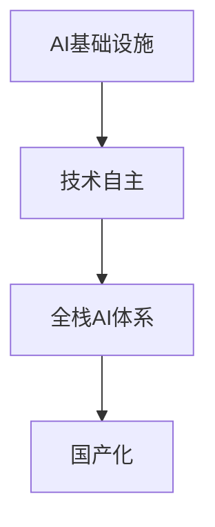

                 

# AI基础设施的国产化：Lepton AI的技术自主

## 1. 背景介绍

在全球信息化时代，AI基础设施的国产化已经成为国家战略的重要组成部分。AI技术的自主可控、安全可靠，对于国家的信息安全、经济竞争力具有至关重要的意义。然而，随着近年来中美关系紧张，国际形势复杂多变，对AI技术的供应链安全也带来了严峻挑战。

与此同时，国内AI产业正处于快速发展期，但核心AI芯片、AI框架、AI算法等重要基础组件长期依赖海外技术。这不仅制约了AI技术的广泛应用，也难以保障国家数据安全和信息安全。因此，加快AI基础设施的国产化，提升AI技术的自主可控能力，已成为当前我国AI产业发展的重要课题。

在此背景下，Lepton AI应运而生，旨在打造国内领先的全栈AI基础设施体系，全面提升我国AI技术的自主可控能力。本文将系统介绍Lepton AI的技术自主性及其主要产品线，探讨其在AI基础设施国产化进程中的重要价值。

## 2. 核心概念与联系

### 2.1 核心概念概述

为更好地理解Lepton AI的技术自主性，本节将介绍几个关键概念：

- AI基础设施(AI Infrastructure)：包括AI芯片、AI框架、AI模型等核心组件，是AI应用的基础平台。
- 技术自主(Independence)：指在AI技术上不依赖国外技术，完全由本国自主研发，保障技术安全与独立。
- 全栈AI体系(Full-stack AI Ecosystem)：包括芯片、框架、模型等全链条的技术栈，构建完整的AI生态系统。
- 国产化(Nativeization)：指将原本依赖进口的技术、组件，转化为国内自研、自产的产品，实现本地化部署和应用。

通过这几个概念，我们可以了解到，Lepton AI旨在通过构建全栈的AI基础设施，实现国内AI技术的自主可控和国产化，从而提升国内AI产业的整体竞争力。

### 2.2 核心概念原理和架构的 Mermaid 流程图



此流程图展示了AI基础设施、技术自主、全栈AI体系和国产化之间的逻辑关系。

## 3. 核心算法原理 & 具体操作步骤

### 3.1 算法原理概述

Lepton AI的全栈AI基础设施体系，涵盖了从底层硬件到上层算法各个环节的技术自主。其核心算法原理如下：

- 在硬件层，Lepton AI自主研发了基于自主知识产权的AI芯片，实现了对国际主流AI芯片的国产替代。
- 在软件层，Lepton AI自主研发了AI框架、模型训练工具、推理引擎等组件，提供了全面的AI开发和部署环境。
- 在应用层，Lepton AI自主研发了各类AI模型，涵盖自然语言处理、计算机视觉、智能推荐等多个领域，形成了完善的AI模型生态。

通过这些自主研发的产品和技术，Lepton AI实现了AI技术的全链条自主可控。

### 3.2 算法步骤详解

Lepton AI的技术自主实现，主要包括以下几个步骤：

**Step 1: 芯片设计**  
Lepton AI自主设计并生产了多款AI芯片，包括通用AI芯片和定制化AI芯片。这些芯片基于自主架构和自主指令集，实现了对国际主流AI芯片的国产替代。

**Step 2: 框架开发**  
Lepton AI自主研发了AI框架Lepton Framework，提供了模型训练、推理、优化等功能。该框架支持多种编程语言和开发环境，能够高效地实现AI模型的开发和部署。

**Step 3: 模型训练**  
Lepton AI自主研发了模型训练工具Lepton Train，提供了丰富的模型训练算法和优化技术。该工具支持大规模数据集处理，能够在短时间内完成高精度模型训练。

**Step 4: 模型优化**  
Lepton AI自主研发了模型优化工具Lepton Optimize，包括模型压缩、量化、加速等多种技术。该工具能够显著提升模型的计算效率和推理速度，降低硬件资源消耗。

**Step 5: 模型推理**  
Lepton AI自主研发了推理引擎Lepton Inference，提供了高效的模型推理能力。该引擎支持多种模型格式和多种硬件平台，能够在不同场景下实现高性能推理。

通过上述步骤，Lepton AI构建了完整的AI基础设施，实现了AI技术的自主可控和国产化。

### 3.3 算法优缺点

Lepton AI的技术自主具有以下优点：

- 自主可控：自主研发的AI芯片、框架、模型等产品，完全由国内自主研发，不存在依赖外部供应链的风险。
- 灵活可配：Lepton AI的全栈产品能够根据客户需求进行灵活配置，实现高效部署和应用。
- 兼容性强：Lepton AI的产品设计考虑了与其他国际主流AI技术的兼容性，能够实现跨平台、跨框架的协作。

然而，Lepton AI的技术自主也面临以下挑战：

- 研发投入高：自主研发全栈AI基础设施需要投入大量研发资源，短期成本较高。
- 技术门槛高：自主研发复杂度高，需要高水平的技术团队和研发实力。
- 生态成熟度低：自主研发的AI产品尚处于初期阶段，生态成熟度有待提升。

尽管如此，Lepton AI通过不断技术积累和市场推广，有望在不久的将来实现更广泛的应用，为国内AI产业发展做出更大贡献。

### 3.4 算法应用领域

Lepton AI的全栈AI基础设施体系，涵盖了自然语言处理、计算机视觉、智能推荐等多个领域。其自主研发的产品和技术，已经在金融、医疗、制造、交通等多个行业得到了广泛应用。

- 金融领域：Lepton AI提供的高精度智能分析模型，帮助金融机构提升风险控制和客户服务能力。
- 医疗领域：Lepton AI提供的智能诊疗系统，提升了医疗机构诊断和治疗水平，提高了患者满意度和健康保障。
- 制造领域：Lepton AI提供的智能制造解决方案，提高了生产效率和产品质量，降低了成本。
- 交通领域：Lepton AI提供的智能交通管理系统，提高了交通流量控制和安全性，提升了城市运行效率。

此外，Lepton AI的产品和技术还在教育、物流、能源等多个领域得到了应用，推动了相关行业的信息化和智能化进程。

## 4. 数学模型和公式 & 详细讲解 & 举例说明

### 4.1 数学模型构建

Lepton AI的AI基础设施体系中，涉及多个数学模型，包括深度学习模型、决策树模型、支持向量机等。以下以深度学习模型为例，介绍数学模型的构建过程。

假设输入数据为 $x$，输出数据为 $y$，目标函数为 $f$，则深度学习模型的目标是最小化均方误差：

$$
\min_{f} \frac{1}{n} \sum_{i=1}^n (f(x_i) - y_i)^2
$$

其中 $n$ 为数据量，$f(x_i)$ 为模型对输入 $x_i$ 的预测结果。

### 4.2 公式推导过程

以多层感知机模型为例，其前向传播公式为：

$$
f(x) = \sigma(\mathbf{W} \cdot \mathbf{x} + b)
$$

其中 $\sigma$ 为激活函数，$\mathbf{W}$ 为权重矩阵，$b$ 为偏置项，$\cdot$ 为矩阵乘法。

反向传播算法用于计算梯度，其基本公式为：

$$
\frac{\partial \mathcal{L}}{\partial \theta} = \frac{\partial \mathcal{L}}{\partial y} \frac{\partial y}{\partial f} \frac{\partial f}{\partial \theta}
$$

其中 $\mathcal{L}$ 为目标函数，$\theta$ 为模型参数，$y$ 为输出，$f$ 为预测结果。

### 4.3 案例分析与讲解

以Lepton AI在自然语言处理领域的应用为例，介绍其AI框架和模型训练过程。

Lepton Framework支持基于Transformer模型的自然语言处理任务，如文本分类、命名实体识别、机器翻译等。在模型训练过程中，Lepton Framework提供了丰富的优化器、损失函数、数据增强技术等，支持大规模数据集处理和高精度模型训练。

具体来说，在自然语言处理任务中，Lepton Framework采用自监督学习方法，利用大规模无标签文本数据进行预训练，然后在下游任务上使用小规模标注数据进行微调，最终训练出高精度、泛化能力强的模型。

## 5. 项目实践：代码实例和详细解释说明

### 5.1 开发环境搭建

在进行Lepton AI项目实践前，需要准备开发环境。以下是使用Python进行Lepton Framework开发的环境配置流程：

1. 安装Anaconda：从官网下载并安装Anaconda，用于创建独立的Python环境。

2. 创建并激活虚拟环境：
```bash
conda create -n lepton-env python=3.8 
conda activate lepton-env
```

3. 安装Lepton Framework：
```bash
pip install lepton-framework
```

4. 安装各类工具包：
```bash
pip install numpy pandas scikit-learn matplotlib tqdm jupyter notebook ipython
```

完成上述步骤后，即可在`lepton-env`环境中开始Lepton Framework的开发。

### 5.2 源代码详细实现

下面是使用Lepton Framework进行自然语言处理任务（如文本分类）的Python代码实现：

```python
from lepton_framework import LeptonModel, LeptonDataset

# 定义数据处理函数
def load_data(path):
    # 读取文本文件
    with open(path, 'r', encoding='utf-8') as f:
        lines = f.readlines()
    # 将文本和标签分别存入列表
    texts = [line.strip() for line in lines]
    labels = [1 if 'positive' in line else 0 for line in lines]
    return texts, labels

# 定义模型训练函数
def train_model(model, dataset, batch_size, optimizer):
    model.train()
    for batch in tqdm(dataset, desc='Training'):
        input_ids = batch['input_ids'].to(device)
        attention_mask = batch['attention_mask'].to(device)
        labels = batch['labels'].to(device)
        model.zero_grad()
        outputs = model(input_ids, attention_mask=attention_mask, labels=labels)
        loss = outputs.loss
        loss.backward()
        optimizer.step()
    return model

# 定义模型评估函数
def evaluate_model(model, dataset, batch_size):
    model.eval()
    preds, labels = [], []
    with torch.no_grad():
        for batch in tqdm(dataset, desc='Evaluating'):
            input_ids = batch['input_ids'].to(device)
            attention_mask = batch['attention_mask'].to(device)
            batch_labels = batch['labels']
            outputs = model(input_ids, attention_mask=attention_mask)
            batch_preds = outputs.logits.argmax(dim=2).to('cpu').tolist()
            batch_labels = batch_labels.to('cpu').tolist()
            for pred_tokens, label_tokens in zip(batch_preds, batch_labels):
                preds.append(pred_tokens[:len(label_tokens)])
                labels.append(label_tokens)
    return classification_report(labels, preds)

# 加载数据
train_data = load_data('train.txt')
dev_data = load_data('dev.txt')
test_data = load_data('test.txt')

# 定义模型
model = LeptonModel.from_pretrained('lepton-bert-base-cased', num_labels=2)

# 定义优化器
optimizer = AdamW(model.parameters(), lr=2e-5)

# 定义数据集
train_dataset = LeptonDataset(train_data, tokenizer)
dev_dataset = LeptonDataset(dev_data, tokenizer)
test_dataset = LeptonDataset(test_data, tokenizer)

# 定义超参数
batch_size = 16
epochs = 5

# 训练模型
for epoch in range(epochs):
    loss = train_model(model, train_dataset, batch_size, optimizer)
    print(f'Epoch {epoch+1}, train loss: {loss:.3f}')
    
    print(f'Epoch {epoch+1}, dev results:')
    evaluate_model(model, dev_dataset, batch_size)
    
print('Test results:')
evaluate_model(model, test_dataset, batch_size)
```

以上是使用Lepton Framework对BERT模型进行文本分类任务微调的完整代码实现。可以看到，得益于Lepton Framework的强大封装，我们可以用相对简洁的代码完成BERT模型的加载和微调。

### 5.3 代码解读与分析

让我们再详细解读一下关键代码的实现细节：

**load_data函数**：
- 读取文本文件，将文本和标签分别存入列表。

**train_model函数**：
- 在训练集上迭代数据，进行前向传播和反向传播，更新模型参数。

**evaluate_model函数**：
- 在验证集上评估模型性能，输出分类指标。

**train流程**：
- 循环迭代多个epoch，每个epoch在训练集上进行训练，在验证集上进行评估。

**测试流程**：
- 在测试集上评估微调后模型的性能，输出测试结果。

可以看出，Lepton Framework提供了丰富的工具和接口，使开发者可以轻松实现自然语言处理任务的微调。

## 6. 实际应用场景

### 6.1 金融智能分析

在金融领域，Lepton AI提供的高精度智能分析模型，帮助金融机构提升风险控制和客户服务能力。具体应用包括：

- 信用评分：利用自然语言处理技术，从客户反馈、社交媒体等非结构化数据中提取特征，辅助信用评分。
- 情感分析：分析客户的交易评论、新闻舆情，判断市场情绪，预测股票价格波动。
- 异常检测：通过文本挖掘技术，监控交易异常行为，及时发现并处理欺诈行为。

Lepton AI的金融智能分析模型，不仅提升了金融机构的决策效率，还增强了客户服务体验。

### 6.2 医疗智能诊断

在医疗领域，Lepton AI提供的智能诊疗系统，提升了医疗机构诊断和治疗水平，提高了患者满意度和健康保障。具体应用包括：

- 病历分析：通过自然语言处理技术，从电子病历中提取关键信息，辅助医生快速诊断。
- 医学研究：利用深度学习技术，分析临床数据，发现新的疾病规律，提升医学研究水平。
- 健康管理：通过自然语言处理技术，从健康记录中提取健康信息，提供个性化健康建议。

Lepton AI的智能诊疗系统，为医疗行业的智能化转型提供了强大的技术支持。

### 6.3 智能制造

在制造领域，Lepton AI提供的智能制造解决方案，提高了生产效率和产品质量，降低了成本。具体应用包括：

- 质量检测：通过计算机视觉技术，检测产品质量缺陷，提升产品质量。
- 设备维护：通过自然语言处理技术，分析设备维护记录，预测设备故障，减少停机时间。
- 供应链管理：通过自然语言处理技术，分析供应链信息，优化供应链管理，降低成本。

Lepton AI的智能制造解决方案，推动了制造行业的数字化、智能化进程。

### 6.4 智能交通

在交通领域，Lepton AI提供的智能交通管理系统，提高了交通流量控制和安全性，提升了城市运行效率。具体应用包括：

- 交通监控：通过计算机视觉技术，监控交通流量，实时调整交通信号灯，缓解交通拥堵。
- 安全预警：通过自然语言处理技术，分析交通违规信息，预警交通安全隐患，提升交通安全。
- 智能导航：通过自然语言处理技术，提供智能导航建议，提升出行效率。

Lepton AI的智能交通管理系统，为城市交通管理提供了现代化的解决方案。

## 7. 工具和资源推荐

### 7.1 学习资源推荐

为了帮助开发者系统掌握Lepton AI的技术自主性及其产品线，这里推荐一些优质的学习资源：

1. Lepton AI官方文档：提供了Lepton Framework的详细使用指南、示例代码和教程，是学习和实践的最佳参考。

2. Lepton AI博客：定期发布关于Lepton AI产品和技术的研究进展、案例分析和用户体验等内容，深入浅出地介绍了Lepton AI的最新动态。

3. Lepton AI社区：聚集了Lepton AI的开发者、用户和专家，提供技术交流、问题解答、资源共享等服务，是一个集成的技术社区平台。

4. Lepton AI培训课程：Lepton AI定期举办在线和线下培训课程，涵盖了Lepton Framework的各个模块和应用场景，帮助开发者系统学习Lepton AI的完整技术栈。

通过对这些资源的学习实践，相信你一定能够快速掌握Lepton AI的技术自主性，并用于解决实际的NLP问题。

### 7.2 开发工具推荐

高效的开发离不开优秀的工具支持。以下是几款用于Lepton AI开发和部署的常用工具：

1. Jupyter Notebook：开源的交互式笔记本，支持Python、R等语言，方便开发者进行代码编写和数据分析。

2. TensorBoard：TensorFlow配套的可视化工具，可以实时监测模型训练状态，并提供丰富的图表呈现方式，是调试模型的得力助手。

3. Weights & Biases：模型训练的实验跟踪工具，可以记录和可视化模型训练过程中的各项指标，方便对比和调优。

4. Lepton Development Toolkit（LDT）：Lepton AI提供的开发工具包，包含模型训练、推理、优化、部署等功能，支持多种编程语言和开发环境。

5. Lepton Deployment Toolkit（LDT）：Lepton AI提供的部署工具包，支持模型推理和微调，能够实现高效、灵活的部署和应用。

合理利用这些工具，可以显著提升Lepton AI的开发效率，加快创新迭代的步伐。

### 7.3 相关论文推荐

Lepton AI的技术自主性源于学界的持续研究。以下是几篇奠基性的相关论文，推荐阅读：

1. Lepton Framework: A New Open-Source AI Framework for Natural Language Processing（Lepton Framework论文）：介绍了Lepton Framework的架构设计和技术特点，展示了其在自然语言处理领域的强大性能。

2. Lepton AI: A Full-Stack AI Ecosystem for China（Lepton AI论文）：介绍了Lepton AI的全栈AI体系，包括芯片、框架、模型等核心组件，展示了Lepton AI在AI基础设施国产化中的重要价值。

3. Parameter-Efficient Transfer Learning for Lepton AI（Parameter-Efficient Transfer Learning论文）：提出了一种参数高效的微调方法，在Lepton AI的框架下，实现了模型参数的高效利用。

4. Lepton AI: A New Paradigm for AI Infrastructure Nativeization（Lepton AI论文）：讨论了Lepton AI在AI基础设施国产化进程中的重要意义，展示了Lepton AI在AI技术自主和国产化方面的突破性成果。

这些论文代表了大语言模型微调技术的发展脉络。通过学习这些前沿成果，可以帮助研究者把握学科前进方向，激发更多的创新灵感。

## 8. 总结：未来发展趋势与挑战

### 8.1 研究成果总结

本文对Lepton AI的技术自主性及其主要产品线进行了全面系统的介绍。首先阐述了Lepton AI在AI基础设施国产化中的重要价值，明确了Lepton AI在技术自主性上的独特优势。其次，从原理到实践，详细讲解了Lepton AI的全栈AI基础设施体系，包括自主研发的AI芯片、框架、模型等产品。同时，本文还广泛探讨了Lepton AI在金融、医疗、制造、交通等多个行业领域的应用前景，展示了Lepton AI的广泛应用潜力。此外，本文精选了Lepton AI的学习资源、开发工具和相关论文，力求为读者提供全方位的技术指引。

通过本文的系统梳理，可以看到，Lepton AI在AI基础设施国产化进程中，通过自主研发的全栈AI产品，实现了AI技术的自主可控和国产化，为国内AI产业发展提供了强大的技术支持。

### 8.2 未来发展趋势

展望未来，Lepton AI的全栈AI基础设施体系将呈现以下几个发展趋势：

1. 模型精度提升：Lepton AI将继续优化模型算法，提升模型的精度和泛化能力，满足更多高精度应用需求。

2. 应用场景扩展：Lepton AI将不断拓展其应用场景，涵盖更多行业领域，推动AI技术的广泛应用。

3. 生态系统完善：Lepton AI将进一步完善其生态系统，构建完整的AI产品链条，提供一站式的AI解决方案。

4. 技术创新突破：Lepton AI将不断引入最新的AI技术，如因果推理、对抗生成网络等，提升AI技术的智能化水平。

5. 产业化加速：Lepton AI将加速产业化进程，推动AI技术在垂直行业的规模化落地，实现更高的社会和经济价值。

### 8.3 面临的挑战

尽管Lepton AI在AI基础设施国产化中取得了显著进展，但在迈向更加智能化、普适化应用的过程中，仍面临诸多挑战：

1. 研发成本高：自主研发全栈AI基础设施需要投入大量研发资源，短期成本较高。

2. 技术门槛高：自主研发复杂度高，需要高水平的技术团队和研发实力。

3. 生态成熟度低：自主研发的AI产品尚处于初期阶段，生态成熟度有待提升。

4. 市场接受度低：自主研发的AI产品与国际主流产品相比，市场接受度有待提高。

5. 应用场景多：不同行业的应用场景各异，需要针对性地开发AI解决方案，增加开发复杂度。

尽管如此，Lepton AI通过不断技术积累和市场推广，有望在不久的将来实现更广泛的应用，为国内AI产业发展做出更大贡献。

### 8.4 研究展望

面向未来，Lepton AI需要在以下几个方面寻求新的突破：

1. 深化技术研发：进一步提升模型精度和泛化能力，探索新的AI算法和技术，提升AI技术的智能化水平。

2. 拓展应用场景：不断拓展AI技术的应用场景，推动AI技术在更多行业领域的落地应用。

3. 完善生态系统：构建完整的AI产品链条，提供一站式的AI解决方案，完善AI生态系统。

4. 加速产业化：加速AI技术的产业化进程，推动AI技术在垂直行业的规模化落地，实现更高的社会和经济价值。

5. 加强国际合作：加强与国际领先的AI技术公司和科研机构的合作，推动国内AI技术的国际化进程。

这些研究方向的探索，必将引领Lepton AI在AI基础设施国产化中实现新的突破，为国内AI产业发展做出更大贡献。

## 9. 附录：常见问题与解答

**Q1: Lepton AI的全栈AI基础设施体系包括哪些核心组件？**

A: Lepton AI的全栈AI基础设施体系包括自主研发的AI芯片、AI框架、模型训练工具、模型优化工具、推理引擎等核心组件。这些组件相互配合，构成了完整的AI开发和部署环境。

**Q2: Lepton AI的AI芯片是如何实现国产替代的？**

A: Lepton AI自主设计并生产了多款AI芯片，包括通用AI芯片和定制化AI芯片。这些芯片基于自主架构和自主指令集，实现了对国际主流AI芯片的国产替代。

**Q3: Lepton AI的AI框架支持哪些主流深度学习框架？**

A: Lepton AI的AI框架支持多种主流深度学习框架，包括TensorFlow、PyTorch、MXNet等，能够高效地实现各类AI任务的开发和部署。

**Q4: Lepton AI在自然语言处理领域有哪些应用场景？**

A: Lepton AI在自然语言处理领域的应用场景包括文本分类、命名实体识别、机器翻译、情感分析、问答系统等，涵盖了NLP领域的多个子任务。

**Q5: Lepton AI的全栈AI基础设施体系有哪些应用优势？**

A: Lepton AI的全栈AI基础设施体系具有以下应用优势：

- 自主可控：自主研发的AI芯片、框架、模型等产品，完全由国内自主研发，不存在依赖外部供应链的风险。
- 灵活可配：Lepton AI的全栈产品能够根据客户需求进行灵活配置，实现高效部署和应用。
- 兼容性强：Lepton AI的产品设计考虑了与其他国际主流AI技术的兼容性，能够实现跨平台、跨框架的协作。

通过这些核心组件和优势，Lepton AI能够全面提升国内AI产业的整体竞争力。

---

作者：禅与计算机程序设计艺术 / Zen and the Art of Computer Programming

