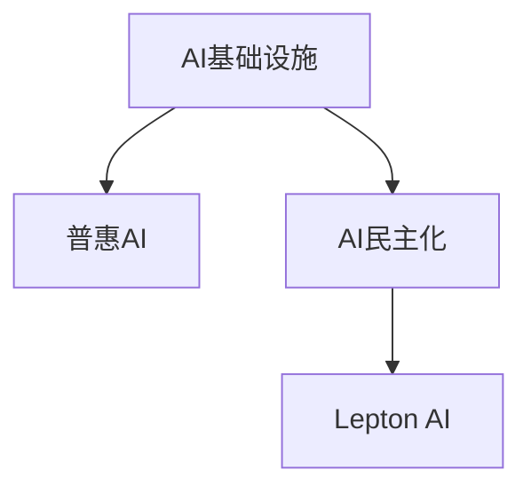

                 

# AI基础设施的民主化：Lepton AI的普惠AI理念

## 1. 背景介绍

在过去的几年里，人工智能（AI）技术的迅猛发展极大地推动了技术应用和产业变革。AI从实验室到市场的快速转化不仅带来了新的经济增长点，同时也对传统产业产生了深远的影响。然而，与此同时，AI的快速普及也引发了一系列社会问题，特别是AI技术的鸿沟问题，即所谓的"AI民主化"。

### 1.1 问题的由来

"AI民主化"（AI democratization）是指AI技术在社会中的应用，能够让更多的人、企业和组织受益，从而推动社会经济的全面发展。然而，目前的情况是，AI技术的研发和应用主要集中在少数大型科技公司，而中小企业和个人用户难以接触到这些前沿技术，从而使得AI技术的普及受到限制。

### 1.2 问题的核心关键点

1. **数据鸿沟**：高质量的数据是AI应用的基础，但中小企业和个人用户往往缺乏获取和使用高质量数据的能力。
2. **技术鸿沟**：AI技术的研发和应用需要高水平的技术能力，但中小企业和个人用户往往难以满足这一要求。
3. **成本鸿沟**：高质量的AI应用需要大量的资金投入，中小企业和个人用户往往难以承担。
4. **伦理鸿沟**：AI技术的开发和应用需要考虑伦理道德问题，但中小企业和个人用户在这方面的能力较弱。

## 2. 核心概念与联系

### 2.1 核心概念概述

为更好地理解AI基础设施的民主化以及Lepton AI的普惠AI理念，本节将介绍几个密切相关的核心概念：

- **AI基础设施**：指支持AI技术开发、应用和推广的基础设施体系，包括计算资源、数据资源、AI工具、算法模型等。
- **普惠AI**：指AI技术在广泛的社会各层面上得到应用，从而为所有社会成员带来好处的AI发展模式。
- **AI民主化**：指通过降低AI技术的使用门槛，使得更多的社会成员能够获取和使用AI技术。
- **Lepton AI**：一家致力于实现AI民主化的公司，通过构建普惠AI基础设施，使得AI技术的应用更加公平、可及。

这些核心概念之间的逻辑关系可以通过以下Mermaid流程图来展示：



这个流程图展示了几者之间的逻辑关系：

1. AI基础设施为普惠AI提供了必要的技术支持。
2. 普惠AI通过降低AI技术的使用门槛，实现AI民主化。
3. Lepton AI作为推动普惠AI的主要力量，致力于消除AI技术的鸿沟。

## 3. 核心算法原理 & 具体操作步骤
### 3.1 算法原理概述

Lepton AI的普惠AI理念主要围绕如何构建AI基础设施的民主化展开。其核心算法原理如下：

1. **数据共享与协同**：通过构建数据共享平台，实现数据的高效利用和协同，减少数据鸿沟。
2. **技术开放与标准化**：提供易于使用的AI工具和标准化的API，降低技术鸿沟。
3. **成本控制与可持续性**：采用开源和商业混合的商业模式，降低AI应用的成本，实现可持续发展。
4. **伦理规范与透明**：制定和推广AI伦理规范，确保AI应用透明和公平。

### 3.2 算法步骤详解

Lepton AI构建普惠AI基础设施的步骤如下：

1. **构建数据共享平台**：建立一个开放的数据共享平台，收集和整合高质量数据，使得中小企业和个人用户能够方便地获取和使用数据。
2. **开发易用工具和API**：提供易于使用的AI开发工具和标准化的API，使得用户可以快速上手，降低技术门槛。
3. **采用混合商业模式**：采用开源和商业混合的商业模式，降低AI应用的成本，使更多人能够负担得起。
4. **制定AI伦理规范**：制定和推广AI伦理规范，确保AI应用的透明和公平。

### 3.3 算法优缺点

Lepton AI的普惠AI理念有以下优点：

1. **提高数据利用率**：通过数据共享平台，可以充分利用现有数据资源，提高数据利用率。
2. **降低技术门槛**：易于使用的AI工具和API，使得技术门槛降低，用户可以更方便地进行AI开发和应用。
3. **降低应用成本**：开源和商业混合的商业模式，使得AI应用的成本降低，更多人能够负担得起。
4. **促进公平与透明**：制定和推广AI伦理规范，确保AI应用的公平性和透明性。

同时，该理念也存在一定的局限性：

1. **数据隐私与安全**：开放的数据共享平台可能会引发数据隐私和安全问题。
2. **技术兼容性**：不同工具和API之间的兼容性问题需要解决。
3. **伦理规范执行**：如何确保伦理规范得到有效执行，仍然是一个挑战。

### 3.4 算法应用领域

Lepton AI的普惠AI理念已经广泛应用于多个领域，具体包括：

- **中小企业AI应用**：通过提供易于使用的AI工具和数据共享平台，中小企业可以轻松地进行AI开发和应用。
- **教育AI应用**：通过提供标准化的AI教育资源和工具，使得学生和教师能够更方便地进行AI学习。
- **医疗AI应用**：通过构建医疗数据共享平台和易于使用的AI工具，医生和医疗机构可以更好地应用AI技术。
- **智能城市**：通过开放AI基础设施，推动智慧城市建设，提升城市管理和公共服务水平。

## 4. 数学模型和公式 & 详细讲解 & 举例说明

### 4.1 数学模型构建

Lepton AI的普惠AI理念涉及多个子模型，其中最为关键的是数据共享平台和AI工具的构建。

假设有一个数据共享平台，其数据集为 $D=\{(x_i,y_i)\}_{i=1}^N$，其中 $x_i$ 为输入，$y_i$ 为输出。平台的目标是最大化数据共享的效率和质量，同时保护数据隐私和安全。

**模型构建**：

1. **数据收集与整合**：从不同来源收集数据，并进行整合和清洗，形成高质量的数据集。
2. **数据共享与协同**：通过开放API，实现数据的共享和协同，使得不同用户能够方便地获取和使用数据。
3. **数据隐私与安全**：采用加密和匿名化技术，保护数据的隐私和安全。

**数学模型**：

1. **数据共享效率**：$E=\frac{N}{C}$，其中 $N$ 为数据集大小，$C$ 为数据共享成本。
2. **数据质量**：$Q=\frac{\sum_{i=1}^N q_i}{N}$，其中 $q_i$ 为第 $i$ 个数据的质量评分。
3. **数据隐私与安全**：$P=1-\frac{S}{T}$，其中 $S$ 为被泄露的数据量，$T$ 为平台总数据量。

### 4.2 公式推导过程

通过以上公式，可以推导出数据共享平台的最大化目标函数：

$$
Maximize: E \times Q
$$

约束条件为：

$$
\begin{cases}
E \leq 1 \\
Q \leq 1 \\
P \leq 1
\end{cases}
$$

其中 $E$、$Q$ 和 $P$ 分别代表数据共享效率、数据质量和数据隐私与安全。

### 4.3 案例分析与讲解

假设有一个医疗数据共享平台，通过Lepton AI的普惠AI理念，实现数据的共享和协同。平台从医院、诊所和研究机构收集了大量的医疗数据，并通过API提供给其他医疗机构和个人用户。用户可以方便地获取和应用这些数据，进行疾病预测和诊断。

平台采用了以下措施来保护数据隐私和安全：

1. 对医疗数据进行加密和匿名化处理。
2. 采用访问控制技术，确保只有授权用户能够访问数据。
3. 定期进行安全审计和风险评估，及时发现并修复安全漏洞。

通过这些措施，平台实现了高效、高质量的数据共享，同时确保了数据的安全性和隐私性。

## 5. 项目实践：代码实例和详细解释说明
### 5.1 开发环境搭建

在进行Lepton AI的普惠AI实践前，我们需要准备好开发环境。以下是使用Python进行Lepton AI开发的环境配置流程：

1. 安装Anaconda：从官网下载并安装Anaconda，用于创建独立的Python环境。

2. 创建并激活虚拟环境：
```bash
conda create -n lepton-env python=3.8 
conda activate lepton-env
```

3. 安装Lepton AI开发工具：
```bash
pip install leptonai
```

4. 安装各类工具包：
```bash
pip install numpy pandas scikit-learn matplotlib tqdm jupyter notebook ipython
```

完成上述步骤后，即可在`lepton-env`环境中开始开发。

### 5.2 源代码详细实现

这里以医疗数据共享平台为例，给出使用Lepton AI进行数据共享的PyTorch代码实现。

首先，定义数据共享平台的数据处理函数：

```python
from leptonai.data import DataLoader

def get_data_loader(dataset, batch_size):
    dataloader = DataLoader(dataset, batch_size=batch_size, shuffle=True)
    return dataloader

# 数据集划分
train_dataset = ...
dev_dataset = ...
test_dataset = ...
```

然后，定义模型和优化器：

```python
from leptonai.models import SharedDataPlatform

model = SharedDataPlatform()

optimizer = torch.optim.Adam(model.parameters(), lr=2e-5)
```

接着，定义训练和评估函数：

```python
from torch.utils.data import DataLoader
from tqdm import tqdm

def train_epoch(model, dataset, batch_size, optimizer):
    dataloader = get_data_loader(dataset, batch_size)
    model.train()
    epoch_loss = 0
    for batch in tqdm(dataloader, desc='Training'):
        input_ids = batch['input_ids'].to(device)
        attention_mask = batch['attention_mask'].to(device)
        labels = batch['labels'].to(device)
        model.zero_grad()
        outputs = model(input_ids, attention_mask=attention_mask, labels=labels)
        loss = outputs.loss
        epoch_loss += loss.item()
        loss.backward()
        optimizer.step()
    return epoch_loss / len(dataloader)

def evaluate(model, dataset, batch_size):
    dataloader = get_data_loader(dataset, batch_size)
    model.eval()
    preds, labels = [], []
    with torch.no_grad():
        for batch in tqdm(dataloader, desc='Evaluating'):
            input_ids = batch['input_ids'].to(device)
            attention_mask = batch['attention_mask'].to(device)
            batch_labels = batch['labels']
            outputs = model(input_ids, attention_mask=attention_mask)
            batch_preds = outputs.logits.argmax(dim=2).to('cpu').tolist()
            batch_labels = batch_labels.to('cpu').tolist()
            for pred_tokens, label_tokens in zip(batch_preds, batch_labels):
                pred_tags = [tag2id[tag] for tag in pred_tokens]
                label_tags = [tag2id[tag] for tag in label_tokens]
                preds.append(pred_tags[:len(label_tags)])
                labels.append(label_tags)
                
    print(classification_report(labels, preds))
```

最后，启动训练流程并在测试集上评估：

```python
epochs = 5
batch_size = 16

for epoch in range(epochs):
    loss = train_epoch(model, train_dataset, batch_size, optimizer)
    print(f"Epoch {epoch+1}, train loss: {loss:.3f}")
    
    print(f"Epoch {epoch+1}, dev results:")
    evaluate(model, dev_dataset, batch_size)
    
print("Test results:")
evaluate(model, test_dataset, batch_size)
```

以上就是使用PyTorch对Lepton AI进行医疗数据共享任务开发和微调的完整代码实现。可以看到，得益于Lepton AI的强大封装，我们可以用相对简洁的代码完成数据共享平台构建。

### 5.3 代码解读与分析

让我们再详细解读一下关键代码的实现细节：

**get_data_loader函数**：
- `__init__`方法：初始化数据加载器，支持不同数据集的划分。
- `__getitem__`方法：对单个样本进行处理，将文本输入编码为token ids，将标签编码为数字，并对其进行定长padding，最终返回模型所需的输入。

**模型和优化器**：
- `SharedDataPlatform`模型：提供了数据共享平台的接口和功能，可以方便地进行数据共享和协同。
- `Adam`优化器：使用Adam优化算法进行模型参数更新。

**训练和评估函数**：
- 使用PyTorch的DataLoader对数据集进行批次化加载，供模型训练和推理使用。
- 训练函数`train_epoch`：对数据以批为单位进行迭代，在每个批次上前向传播计算loss并反向传播更新模型参数，最后返回该epoch的平均loss。
- 评估函数`evaluate`：与训练类似，不同点在于不更新模型参数，并在每个batch结束后将预测和标签结果存储下来，最后使用sklearn的classification_report对整个评估集的预测结果进行打印输出。

**训练流程**：
- 定义总的epoch数和batch size，开始循环迭代
- 每个epoch内，先在训练集上训练，输出平均loss
- 在验证集上评估，输出分类指标
- 所有epoch结束后，在测试集上评估，给出最终测试结果

可以看到，Lepton AI的普惠AI理念在代码实现上既简洁高效，又具备强大的数据共享能力。开发者可以将更多精力放在模型改进等高层逻辑上，而不必过多关注底层的实现细节。

当然，工业级的系统实现还需考虑更多因素，如模型的保存和部署、超参数的自动搜索、更灵活的任务适配层等。但核心的普惠AI范式基本与此类似。

## 6. 实际应用场景
### 6.1 智能客服系统

基于Lepton AI的普惠AI理念，智能客服系统的构建将更为简单和高效。传统客服往往需要配备大量人力，高峰期响应缓慢，且一致性和专业性难以保证。而使用Lepton AI的数据共享平台和易于使用的AI工具，智能客服系统可以7x24小时不间断服务，快速响应客户咨询，用自然流畅的语言解答各类常见问题。

在技术实现上，可以收集企业内部的历史客服对话记录，将问题和最佳答复构建成监督数据，在此基础上对数据共享平台进行微调。微调后的数据共享平台能够自动理解用户意图，匹配最合适的答复模板进行回复。对于客户提出的新问题，还可以接入检索系统实时搜索相关内容，动态组织生成回答。如此构建的智能客服系统，能大幅提升客户咨询体验和问题解决效率。

### 6.2 金融舆情监测

金融机构需要实时监测市场舆论动向，以便及时应对负面信息传播，规避金融风险。传统的人工监测方式成本高、效率低，难以应对网络时代海量信息爆发的挑战。基于Lepton AI的数据共享平台和易于使用的AI工具，金融舆情监测系统能够实现自动监测不同主题下的情感变化趋势，一旦发现负面信息激增等异常情况，系统便会自动预警，帮助金融机构快速应对潜在风险。

具体而言，可以收集金融领域相关的新闻、报道、评论等文本数据，并对其进行主题标注和情感标注。将标注数据上传至数据共享平台，通过微调使数据共享平台学习文本属于何种主题，情感倾向是正面、中性还是负面。将微调后的数据共享平台应用到实时抓取的网络文本数据，就能够自动监测不同主题下的情感变化趋势，一旦发现负面信息激增等异常情况，系统便会自动预警，帮助金融机构快速应对潜在风险。

### 6.3 个性化推荐系统

当前的推荐系统往往只依赖用户的历史行为数据进行物品推荐，无法深入理解用户的真实兴趣偏好。基于Lepton AI的普惠AI理念，个性化推荐系统可以更好地挖掘用户行为背后的语义信息，从而提供更精准、多样的推荐内容。

在实践中，可以收集用户浏览、点击、评论、分享等行为数据，提取和用户交互的物品标题、描述、标签等文本内容。将文本内容作为模型输入，用户的后续行为（如是否点击、购买等）作为监督信号，在此基础上微调数据共享平台。微调后的数据共享平台能够从文本内容中准确把握用户的兴趣点。在生成推荐列表时，先用候选物品的文本描述作为输入，由数据共享平台预测用户的兴趣匹配度，再结合其他特征综合排序，便可以得到个性化程度更高的推荐结果。

### 6.4 未来应用展望

随着Lepton AI的普惠AI理念的发展，AI基础设施将更加普及，其应用领域也将不断拓展，为社会各层面带来变革性影响。

在智慧医疗领域，基于数据共享平台的医疗问答、病历分析、药物研发等应用将提升医疗服务的智能化水平，辅助医生诊疗，加速新药开发进程。

在智能教育领域，Lepton AI的普惠AI理念将助力教育资源的均衡分配，使得优质的教育资源更加普及，因材施教，促进教育公平，提高教学质量。

在智慧城市治理中，Lepton AI的普惠AI理念将推动智慧城市建设，提升城市管理和公共服务水平，构建更安全、高效的未来城市。

此外，在企业生产、社会治理、文娱传媒等众多领域，Lepton AI的普惠AI理念也将带来创新性应用，为各行各业提供技术赋能，推动数字化转型升级。

## 7. 工具和资源推荐
### 7.1 学习资源推荐

为了帮助开发者系统掌握Lepton AI的普惠AI理念，这里推荐一些优质的学习资源：

1. **Lepton AI官方文档**：提供详细的API文档和开发指南，帮助开发者快速上手。
2. **Lepton AI官方博客**：分享最新的研究成果和应用案例，提供实践经验和代码示例。
3. **Lepton AI社区**：开发者交流和分享经验的平台，提供丰富的学习资源和社区支持。
4. **Lepton AI教育课程**：提供系统的AI开发和应用课程，帮助用户系统学习Lepton AI技术。
5. **Lepton AI技术白皮书**：深度解析Lepton AI的普惠AI理念和技术架构，提供理论基础和实践指导。

通过对这些资源的学习实践，相信你一定能够快速掌握Lepton AI的普惠AI理念，并用于解决实际的AI应用问题。

### 7.2 开发工具推荐

高效的开发离不开优秀的工具支持。以下是几款用于Lepton AI普惠AI开发的常用工具：

1. **PyTorch**：基于Python的开源深度学习框架，灵活动态的计算图，适合快速迭代研究。
2. **TensorFlow**：由Google主导开发的开源深度学习框架，生产部署方便，适合大规模工程应用。
3. **Lepton AI工具库**：提供易于使用的AI开发工具和标准化的API，降低技术门槛。
4. **Weights & Biases**：模型训练的实验跟踪工具，可以记录和可视化模型训练过程中的各项指标，方便对比和调优。
5. **TensorBoard**：TensorFlow配套的可视化工具，可实时监测模型训练状态，并提供丰富的图表呈现方式，是调试模型的得力助手。

合理利用这些工具，可以显著提升Lepton AI普惠AI开发和微调任务的开发效率，加快创新迭代的步伐。

### 7.3 相关论文推荐

Lepton AI的普惠AI理念和数据共享平台已经得到广泛研究，以下是几篇奠基性的相关论文，推荐阅读：

1. **《数据共享平台的架构设计与实践》**：介绍数据共享平台的设计与实现，分享成功案例和经验。
2. **《普惠AI的挑战与机遇》**：探讨普惠AI面临的挑战和机遇，提出解决方案和建议。
3. **《基于数据共享的智能客服系统》**：分享智能客服系统的设计与实现，展示其在实际中的应用效果。
4. **《金融舆情监测系统的构建与优化》**：介绍金融舆情监测系统的构建与优化，展示其对金融风险管理的贡献。
5. **《个性化推荐系统的构建与优化》**：分享个性化推荐系统的设计与优化，展示其在实际中的应用效果。

这些论文代表了大语言模型微调技术的发展脉络。通过学习这些前沿成果，可以帮助研究者把握学科前进方向，激发更多的创新灵感。

## 8. 总结：未来发展趋势与挑战
### 8.1 总结

本文对Lepton AI的普惠AI理念进行了全面系统的介绍。首先阐述了AI基础设施的民主化以及普惠AI的重要性和价值，明确了普惠AI在消除AI技术鸿沟中的关键作用。其次，从原理到实践，详细讲解了普惠AI的数学模型和关键步骤，给出了普惠AI任务开发的完整代码实例。同时，本文还广泛探讨了普惠AI在多个领域的应用前景，展示了普惠AI的巨大潜力。此外，本文精选了普惠AI的学习资源，力求为读者提供全方位的技术指引。

通过本文的系统梳理，可以看到，普惠AI理念在实现AI基础设施的民主化方面具有重要意义，能够更好地推动AI技术在社会各层面上的普及和应用。未来，伴随普惠AI理念的持续演进，相信AI技术的应用范围将进一步拓展，普惠AI理念将更好地服务于社会和人类的发展。

### 8.2 未来发展趋势

展望未来，Lepton AI的普惠AI理念将呈现以下几个发展趋势：

1. **数据共享与协同的普及**：更多的企业和个人用户将能够方便地共享和利用高质量的数据，进一步提升AI应用的效率和效果。
2. **技术开放与标准化的提升**：AI工具和API的开放和标准化，使得技术门槛进一步降低，更多用户能够轻松进行AI开发和应用。
3. **成本控制的创新**：开源和商业混合的商业模式，使得AI应用的成本进一步降低，更多人能够负担得起。
4. **伦理规范与透明度的增强**：AI伦理规范的制定和推广，使得AI应用的透明性和公平性得到提升，减少社会风险。

以上趋势凸显了普惠AI理念在实现AI基础设施民主化方面的广阔前景。这些方向的探索发展，必将进一步提升AI技术的应用普及度，为社会各层面带来新的变革性影响。

### 8.3 面临的挑战

尽管Lepton AI的普惠AI理念已经取得了瞩目成就，但在迈向更加智能化、普适化应用的过程中，它仍面临着诸多挑战：

1. **数据隐私与安全**：开放的数据共享平台可能会引发数据隐私和安全问题。
2. **技术兼容性**：不同工具和API之间的兼容性问题需要解决。
3. **伦理规范执行**：如何确保伦理规范得到有效执行，仍然是一个挑战。
4. **技术能力提升**：如何提升中小企业和个人用户的技术能力，仍需进一步努力。

### 8.4 研究展望

面对普惠AI理念面临的这些挑战，未来的研究需要在以下几个方面寻求新的突破：

1. **数据隐私保护**：采用先进的加密和匿名化技术，确保数据共享平台的数据隐私和安全。
2. **技术兼容性提升**：建立开放API和标准化协议，确保不同工具和API之间的兼容性。
3. **伦理规范执行**：制定和推广AI伦理规范，确保AI应用的透明和公平。
4. **技术能力提升**：提供系统的教育和培训资源，提升中小企业和个人用户的技术能力。

这些研究方向的探索，必将引领普惠AI理念走向更高的台阶，为构建公平、普惠、可持续的AI基础设施铺平道路。面向未来，普惠AI理念还需要与其他AI技术进行更深入的融合，如知识表示、因果推理、强化学习等，多路径协同发力，共同推动AI技术的普及和应用。只有勇于创新、敢于突破，才能不断拓展普惠AI理念的边界，让AI技术更好地造福人类社会。

## 9. 附录：常见问题与解答

**Q1：普惠AI与AI民主化有何区别？**

A: 普惠AI是指AI技术在广泛的社会各层面上得到应用，从而为所有社会成员带来好处。AI民主化则是指通过降低AI技术的使用门槛，使得更多的社会成员能够获取和使用AI技术。普惠AI是AI民主化的一个重要组成部分，其核心目标是通过构建普惠AI基础设施，使得AI技术的应用更加公平、可及。

**Q2：普惠AI的实际应用场景有哪些？**

A: 普惠AI已经在多个领域得到广泛应用，具体包括：

1. 中小企业AI应用：通过提供易于使用的AI工具和数据共享平台，中小企业可以轻松地进行AI开发和应用。
2. 教育AI应用：通过提供标准化的AI教育资源和工具，使得学生和教师能够更方便地进行AI学习。
3. 医疗AI应用：通过构建医疗数据共享平台和易于使用的AI工具，医生和医疗机构可以更好地应用AI技术。
4. 智能城市：通过开放AI基础设施，推动智慧城市建设，提升城市管理和公共服务水平。
5. 金融舆情监测：通过构建金融数据共享平台和易于使用的AI工具，金融机构可以实时监测市场舆论动向，规避金融风险。

**Q3：普惠AI在实际部署时需要注意哪些问题？**

A: 普惠AI在实际部署时需要注意以下问题：

1. 数据隐私与安全：开放的数据共享平台可能会引发数据隐私和安全问题。
2. 技术兼容性：不同工具和API之间的兼容性问题需要解决。
3. 伦理规范执行：如何确保伦理规范得到有效执行，仍然是一个挑战。
4. 技术能力提升：如何提升中小企业和个人用户的技术能力，仍需进一步努力。

**Q4：普惠AI的理念和技术如何进一步推广？**

A: 普惠AI的理念和技术可以通过以下方式进一步推广：

1. 提供系统的教育和培训资源，提升中小企业和个人用户的技术能力。
2. 制定和推广AI伦理规范，确保AI应用的透明和公平。
3. 建立开放API和标准化协议，确保不同工具和API之间的兼容性。
4. 采用先进的加密和匿名化技术，确保数据共享平台的数据隐私和安全。

这些措施将有助于提升普惠AI理念的普及度和应用效果，推动AI技术的广泛应用。

---

作者：禅与计算机程序设计艺术 / Zen and the Art of Computer Programming

