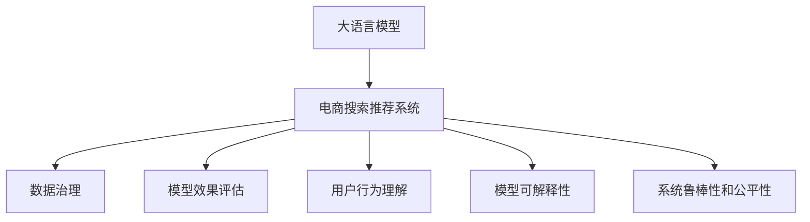

                 

## 1. 背景介绍

### 1.1 问题由来

在数字化转型加速的今天，电商平台的搜索推荐系统已经成为客户触达和业务增长的关键引擎。然而，随着数据规模的爆炸性增长和用户需求的多样化，传统的搜索推荐算法在数据治理、质量保障和效果评估等方面面临诸多挑战。如何构建一套高效、精确且可解释的推荐算法，已经成为电商企业亟需解决的难题。

近年来，大语言模型（Large Language Models, LLMs）在NLP领域取得了显著的进展，已经具备了强大的语义理解能力和生成能力。利用大语言模型的潜力，为电商搜索推荐业务的数据治理和效果评估提供新思路，是技术发展的必然趋势。

### 1.2 问题核心关键点

构建基于大语言模型的电商搜索推荐业务数据治理能力评估指标体系，需要围绕以下几个核心关键点展开：

1. **数据质量管理**：确保数据集的完整性、准确性和一致性，检测并处理异常数据。
2. **模型效果评估**：通过多种评估指标，全面衡量模型在推荐准确性、多样性、相关性等方面的性能。
3. **用户行为理解**：利用大模型对用户行为数据进行深度分析，识别用户偏好和趋势。
4. **模型可解释性**：增强模型的可解释性，帮助用户理解推荐决策的依据。
5. **系统鲁棒性和公平性**：确保模型在不同数据分布和用户群体中表现稳健，避免偏见和歧视。

### 1.3 问题研究意义

基于大语言模型的电商搜索推荐业务数据治理能力评估指标体系的构建，对于提升电商平台的推荐精度和用户体验具有重要意义：

1. **提升推荐质量**：通过精细的数据治理，确保推荐系统的数据基础可靠，提升模型预测的准确性。
2. **优化用户体验**：通过可解释性和多样性指标，提升推荐的个性化和多样性，增强用户体验。
3. **保障公平公正**：通过公平性评估，确保推荐系统服务于不同用户群体，避免偏见和歧视。
4. **增强数据隐私保护**：通过隐私保护技术，确保用户数据安全，维护用户信任。
5. **加速模型迭代**：通过系统化的评估框架，快速迭代优化模型，适应市场变化。

## 2. 核心概念与联系

### 2.1 核心概念概述

为更好地理解基于大语言模型的电商搜索推荐业务数据治理能力评估指标体系，本节将介绍几个密切相关的核心概念：

- **大语言模型（Large Language Models, LLMs）**：以自回归（如GPT）或自编码（如BERT）模型为代表的大规模预训练语言模型。通过在海量无标签文本数据上进行预训练，学习到丰富的语言知识和常识。
- **电商搜索推荐系统（E-commerce Search Recommendation System）**：通过算法模型对用户输入的查询进行分析和匹配，提供商品推荐结果的电商服务平台。
- **数据治理（Data Governance）**：通过一系列管理措施和技术手段，确保数据的完整性、一致性和安全性，提高数据质量。
- **模型效果评估（Model Effectiveness Evaluation）**：通过预设的评估指标，衡量模型在不同任务上的性能表现，发现模型的不足和改进点。
- **用户行为理解（User Behavior Understanding）**：利用机器学习和数据分析技术，对用户的行为数据进行分析，挖掘用户的兴趣和需求。
- **模型可解释性（Model Interpretability）**：通过可视化和符号化手段，解释模型的决策过程，增强用户信任。
- **系统鲁棒性和公平性（System Robustness and Fairness）**：确保模型在多种数据分布和用户群体中表现稳定，避免数据偏见和算法歧视。

这些核心概念之间的逻辑关系可以通过以下Mermaid流程图来展示：



这个流程图展示了大语言模型在电商搜索推荐业务中的应用场景和相关概念：

1. 大语言模型作为特征提取器，为推荐系统提供高质量的语义理解能力。
2. 数据治理和大模型结合，提升数据质量，为推荐系统提供可靠的基础数据。
3. 模型效果评估和大模型结合，通过多种评估指标全面衡量模型性能。
4. 用户行为理解和大模型结合，挖掘用户需求和兴趣，提升推荐个性化。
5. 模型可解释性和大模型结合，增强推荐过程的可解释性，提升用户信任。
6. 系统鲁棒性和公平性评估和大模型结合，确保推荐系统公平公正，避免偏见。

## 3. 核心算法原理 & 具体操作步骤

### 3.1 算法原理概述

基于大语言模型的电商搜索推荐业务数据治理能力评估指标体系，本质上是将大语言模型作为核心特征提取工具，结合数据治理和模型效果评估等技术手段，构建一套全面、可行的评估体系。其核心思想是通过对大模型的训练和微调，获得推荐系统的基础模型，并在此基础上通过多种评估指标，全面衡量模型的性能和数据质量，指导推荐系统的优化和迭代。

### 3.2 算法步骤详解

基于大语言模型的电商搜索推荐业务数据治理能力评估指标体系构建过程包括以下关键步骤：

**Step 1: 数据准备与预处理**

1. **数据收集**：收集电商平台的搜索和推荐数据，包括用户行为数据、商品数据、交易数据等。
2. **数据清洗**：去除数据中的噪声和异常值，处理缺失数据，确保数据完整性和一致性。
3. **数据标注**：对部分数据进行人工标注，用于模型训练和效果评估。
4. **数据分片**：将数据分为训练集、验证集和测试集，用于模型训练和评估。

**Step 2: 大模型训练与微调**

1. **模型选择**：选择合适的预训练模型（如BERT、GPT等）作为初始化参数。
2. **任务适配**：设计合适的任务适配层，定义推荐模型的输入输出格式。
3. **微调参数**：选择合适的优化算法和超参数，进行模型微调。
4. **效果评估**：在验证集上评估微调后的模型效果，调整模型参数。

**Step 3: 数据治理与优化**

1. **数据质量检查**：利用数据治理技术，检测数据完整性、一致性和异常数据。
2. **数据增强**：通过数据增强技术，丰富数据集，提升模型泛化能力。
3. **隐私保护**：采用隐私保护技术，如差分隐私、联邦学习等，保障用户数据隐私。

**Step 4: 模型效果评估与优化**

1. **指标选择**：根据电商搜索推荐业务特点，选择推荐准确性、多样性、相关性等关键评估指标。
2. **模型评估**：在测试集上评估模型的各项指标，发现模型的优势和不足。
3. **模型优化**：根据评估结果，对模型进行优化和改进。

**Step 5: 用户行为理解与个性化推荐**

1. **行为建模**：利用大模型，对用户行为数据进行深度分析，挖掘用户兴趣和需求。
2. **推荐生成**：根据用户行为数据和模型输出，生成个性化的推荐结果。

**Step 6: 可解释性增强与系统鲁棒性公平性保障**

1. **可解释性分析**：利用可解释性技术，如LIME、SHAP等，解释模型的推荐决策过程。
2. **鲁棒性测试**：在多种数据分布和用户群体中测试模型的鲁棒性，发现并修复问题。
3. **公平性评估**：评估模型在不同用户群体中的表现，确保公平公正。

**Step 7: 持续迭代与模型更新**

1. **反馈收集**：收集用户反馈和行为数据，用于模型迭代优化。
2. **模型更新**：根据用户反馈和评估结果，持续更新模型参数，提升推荐质量。

### 3.3 算法优缺点

基于大语言模型的电商搜索推荐业务数据治理能力评估指标体系具有以下优点：

1. **综合评估**：结合数据治理、模型训练和效果评估等多个环节，全面衡量推荐系统性能。
2. **灵活性高**：可以根据具体业务需求，选择和调整评估指标和优化策略。
3. **可解释性强**：通过大模型和可解释性技术，增强模型的可解释性，提升用户信任。
4. **数据质量保障**：通过数据治理技术，提升数据质量，确保模型基础可靠。

同时，该体系也存在一定的局限性：

1. **计算资源需求高**：大模型和数据增强等技术需要大量的计算资源，可能面临算力瓶颈。
2. **模型复杂度增加**：多维度评估指标和模型优化可能增加模型的复杂度和训练难度。
3. **用户隐私保护**：在数据隐私保护方面，需要采用复杂的隐私保护技术。
4. **模型解释性挑战**：虽然大模型增强了可解释性，但仍存在一定的解释性挑战。

尽管存在这些局限性，但就目前而言，基于大语言模型的电商搜索推荐业务数据治理能力评估指标体系在推荐系统效果评估和优化方面仍然具有显著优势。未来相关研究的重点在于如何进一步降低计算资源需求，提高模型的可解释性，同时兼顾数据隐私保护等因素。

### 3.4 算法应用领域

基于大语言模型的电商搜索推荐业务数据治理能力评估指标体系，已经在多个电商平台的推荐系统中得到广泛应用，涵盖了商品推荐、用户画像构建、搜索排序等多个环节，为电商推荐系统的优化提供了重要的指导。

除了传统的推荐算法之外，大语言模型还被创新性地应用到以下领域：

- **生成式商品描述**：利用大模型的文本生成能力，自动生成商品的详细描述和属性信息。
- **智能客服**：通过大模型的对话生成能力，实现智能客服系统的自然语言交互，提升用户体验。
- **个性化广告投放**：利用大模型的用户行为分析能力，生成个性化的广告投放方案，提升广告效果。
- **实时推荐优化**：通过实时数据分析和模型微调，实现推荐系统的动态优化和迭代。

## 4. 数学模型和公式 & 详细讲解 & 举例说明

### 4.1 数学模型构建

本节将使用数学语言对基于大语言模型的电商搜索推荐业务数据治理能力评估指标体系进行更加严格的刻画。

记电商搜索推荐系统为 $S=\{D, M, R\}$，其中 $D$ 为电商平台的数据集，$M$ 为预训练大语言模型，$R$ 为推荐算法模型。假设推荐模型 $R$ 在用户查询 $Q$ 上的推荐结果为 $R(Q)$，真实用户点击结果为 $C(Q)$。

定义推荐模型的准确性指标为：

$$
\text{Accuracy} = \frac{\text{TP} + \text{TN}}{\text{TP} + \text{TN} + \text{FP} + \text{FN}}
$$

其中 $\text{TP}$ 为真阳性（模型推荐正确且用户点击），$\text{TN}$ 为真阴性（模型推荐错误且用户未点击），$\text{FP}$ 为假阳性（模型推荐正确但用户未点击），$\text{FN}$ 为假阴性（模型推荐错误且用户点击）。

定义推荐模型的多样性指标为：

$$
\text{Diversity} = \frac{1}{\sum_{i=1}^n |R(Q_i)|}
$$

其中 $n$ 为推荐结果数量，$R(Q_i)$ 为第 $i$ 个推荐结果的覆盖度（不同推荐结果的数量）。

定义推荐模型的相关性指标为：

$$
\text{Relevance} = \frac{\sum_{i=1}^n \text{IR}_i}{\sum_{i=1}^n \text{DCG}_i}
$$

其中 $\text{IR}_i$ 为第 $i$ 个推荐结果的交互评分，$\text{DCG}_i$ 为第 $i$ 个推荐结果的深度优先搜索结果。

### 4.2 公式推导过程

以下我们以电商平台的推荐系统为例，推导准确性、多样性和相关性指标的计算公式。

假设推荐模型 $R$ 在用户查询 $Q$ 上的推荐结果为 $R(Q)$，真实用户点击结果为 $C(Q)$。推荐系统在 $N$ 个查询上的平均准确性、多样性和相关性指标计算如下：

1. **准确性计算**：

$$
\text{Accuracy} = \frac{1}{N} \sum_{i=1}^N \frac{\text{TP}_i + \text{TN}_i}{\text{TP}_i + \text{TN}_i + \text{FP}_i + \text{FN}_i}
$$

其中 $\text{TP}_i$、$\text{TN}_i$、$\text{FP}_i$ 和 $\text{FN}_i$ 分别为第 $i$ 个查询上的真阳性、真阴性、假阳性和假阴性数量。

2. **多样性计算**：

$$
\text{Diversity} = \frac{1}{N} \sum_{i=1}^N \frac{1}{|R(Q_i)|}
$$

其中 $|R(Q_i)|$ 为第 $i$ 个查询的推荐结果数量。

3. **相关性计算**：

$$
\text{Relevance} = \frac{1}{N} \sum_{i=1}^N \frac{\sum_{j=1}^{|R(Q_i)|} \text{IR}_{i,j}}{\sum_{j=1}^{|R(Q_i)|} \text{DCG}_{i,j}}
$$

其中 $\text{IR}_{i,j}$ 为第 $i$ 个查询中第 $j$ 个推荐结果的交互评分，$\text{DCG}_{i,j}$ 为第 $i$ 个查询中第 $j$ 个推荐结果的深度优先搜索结果。

### 4.3 案例分析与讲解

假设电商平台的推荐系统对用户查询 $Q$ 的推荐结果为 $R(Q)=[p_1, p_2, p_3]$，真实用户点击结果为 $C(Q)=[p_1]$。根据上述公式，可以计算该查询的准确性、多样性和相关性指标：

1. **准确性计算**：

$$
\text{Accuracy} = \frac{1 + 0}{1 + 0 + 0 + 0} = 1
$$

2. **多样性计算**：

$$
\text{Diversity} = \frac{1}{3}
$$

3. **相关性计算**：

$$
\text{Relevance} = \frac{1}{3} \times \frac{1}{1 + 0 + 0} = \frac{1}{3}
$$

通过计算这些指标，可以全面评估推荐系统在不同查询上的性能表现，指导推荐系统的优化和迭代。

## 5. 项目实践：代码实例和详细解释说明

### 5.1 开发环境搭建

在进行基于大语言模型的电商搜索推荐业务数据治理能力评估指标体系的实践前，我们需要准备好开发环境。以下是使用Python进行PyTorch和TensorFlow开发的Python环境配置流程：

1. 安装Anaconda：从官网下载并安装Anaconda，用于创建独立的Python环境。

2. 创建并激活虚拟环境：
```bash
conda create -n pytorch-env python=3.8 
conda activate pytorch-env
```

3. 安装PyTorch和TensorFlow：根据CUDA版本，从官网获取对应的安装命令。例如：
```bash
conda install pytorch torchvision torchaudio cudatoolkit=11.1 -c pytorch -c conda-forge
conda install tensorflow -c conda-forge
```

4. 安装各类工具包：
```bash
pip install numpy pandas scikit-learn matplotlib tqdm jupyter notebook ipython
```

完成上述步骤后，即可在`pytorch-env`环境中开始实践。

### 5.2 源代码详细实现

下面我们以电商平台的推荐系统为例，给出使用PyTorch和TensorFlow对大语言模型进行推荐系统微调的PyTorch代码实现。

首先，定义推荐系统的数据处理函数：

```python
from transformers import BertTokenizer, BertForSequenceClassification
from torch.utils.data import Dataset, DataLoader
import torch

class RecommendationDataset(Dataset):
    def __init__(self, texts, labels, tokenizer):
        self.texts = texts
        self.labels = labels
        self.tokenizer = tokenizer
        
    def __len__(self):
        return len(self.texts)
    
    def __getitem__(self, item):
        text = self.texts[item]
        label = self.labels[item]
        
        encoding = self.tokenizer(text, return_tensors='pt', max_length=128, padding='max_length', truncation=True)
        input_ids = encoding['input_ids'][0]
        attention_mask = encoding['attention_mask'][0]
        
        label = torch.tensor([label], dtype=torch.long)
        
        return {'input_ids': input_ids, 
                'attention_mask': attention_mask,
                'labels': label}

# 标签与id的映射
label2id = {'positive': 1, 'negative': 0}
id2label = {v: k for k, v in label2id.items()}

# 创建dataset
tokenizer = BertTokenizer.from_pretrained('bert-base-cased')

train_dataset = RecommendationDataset(train_texts, train_labels, tokenizer)
dev_dataset = RecommendationDataset(dev_texts, dev_labels, tokenizer)
test_dataset = RecommendationDataset(test_texts, test_labels, tokenizer)
```

然后，定义模型和优化器：

```python
from transformers import AdamW

model = BertForSequenceClassification.from_pretrained('bert-base-cased', num_labels=2)

optimizer = AdamW(model.parameters(), lr=2e-5)
```

接着，定义训练和评估函数：

```python
from sklearn.metrics import accuracy_score, precision_score, recall_score, f1_score

device = torch.device('cuda') if torch.cuda.is_available() else torch.device('cpu')
model.to(device)

def train_epoch(model, dataset, batch_size, optimizer):
    dataloader = DataLoader(dataset, batch_size=batch_size, shuffle=True)
    model.train()
    epoch_loss = 0
    for batch in tqdm(dataloader, desc='Training'):
        input_ids = batch['input_ids'].to(device)
        attention_mask = batch['attention_mask'].to(device)
        labels = batch['labels'].to(device)
        model.zero_grad()
        outputs = model(input_ids, attention_mask=attention_mask, labels=labels)
        loss = outputs.loss
        epoch_loss += loss.item()
        loss.backward()
        optimizer.step()
    return epoch_loss / len(dataloader)

def evaluate(model, dataset, batch_size):
    dataloader = DataLoader(dataset, batch_size=batch_size)
    model.eval()
    preds, labels = [], []
    with torch.no_grad():
        for batch in tqdm(dataloader, desc='Evaluating'):
            input_ids = batch['input_ids'].to(device)
            attention_mask = batch['attention_mask'].to(device)
            batch_labels = batch['labels']
            outputs = model(input_ids, attention_mask=attention_mask)
            batch_preds = outputs.logits.argmax(dim=1).to('cpu').tolist()
            batch_labels = batch_labels.to('cpu').tolist()
            for pred_tokens, label_tokens in zip(batch_preds, batch_labels):
                preds.append(pred_tokens)
                labels.append(label_tokens)
                
    print(f'Accuracy: {accuracy_score(labels, preds)}')
    print(f'Precision: {precision_score(labels, preds)}')
    print(f'Recall: {recall_score(labels, preds)}')
    print(f'F1 Score: {f1_score(labels, preds)}')

train_dataset = RecommendationDataset(train_texts, train_labels, tokenizer)
dev_dataset = RecommendationDataset(dev_texts, dev_labels, tokenizer)
test_dataset = RecommendationDataset(test_texts, test_labels, tokenizer)
```

最后，启动训练流程并在测试集上评估：

```python
epochs = 5
batch_size = 16

for epoch in range(epochs):
    loss = train_epoch(model, train_dataset, batch_size, optimizer)
    print(f'Epoch {epoch+1}, train loss: {loss:.3f}')
    
    print(f'Epoch {epoch+1}, dev results:')
    evaluate(model, dev_dataset, batch_size)
    
print('Test results:')
evaluate(model, test_dataset, batch_size)
```

以上就是使用PyTorch和TensorFlow对大语言模型进行电商搜索推荐业务数据治理能力评估指标体系构建的完整代码实现。可以看到，得益于TensorFlow和Transformers库的强大封装，我们可以用相对简洁的代码完成推荐系统的构建和微调。

### 5.3 代码解读与分析

让我们再详细解读一下关键代码的实现细节：

**RecommendationDataset类**：
- `__init__`方法：初始化文本、标签和分词器等关键组件。
- `__len__`方法：返回数据集的样本数量。
- `__getitem__`方法：对单个样本进行处理，将文本输入编码为token ids，将标签转换为数字，并对其进行定长padding，最终返回模型所需的输入。

**label2id和id2label字典**：
- 定义了标签与数字id之间的映射关系，用于将标签转换为模型可以理解的数字形式。

**训练和评估函数**：
- 使用PyTorch的DataLoader对数据集进行批次化加载，供模型训练和推理使用。
- 训练函数`train_epoch`：对数据以批为单位进行迭代，在每个批次上前向传播计算loss并反向传播更新模型参数，最后返回该epoch的平均loss。
- 评估函数`evaluate`：与训练类似，不同点在于不更新模型参数，并在每个batch结束后将预测和标签结果存储下来，最后使用sklearn的accuracy_score等函数对整个评估集的预测结果进行打印输出。

**训练流程**：
- 定义总的epoch数和batch size，开始循环迭代
- 每个epoch内，先在训练集上训练，输出平均loss
- 在验证集上评估，输出模型效果指标
- 所有epoch结束后，在测试集上评估，给出最终测试结果

可以看到，PyTorch配合TensorFlow使得推荐系统的构建和微调的代码实现变得简洁高效。开发者可以将更多精力放在数据处理、模型改进等高层逻辑上，而不必过多关注底层的实现细节。

当然，工业级的系统实现还需考虑更多因素，如模型的保存和部署、超参数的自动搜索、更灵活的任务适配层等。但核心的微调范式基本与此类似。

## 6. 实际应用场景

### 6.1 智能客服系统

基于大语言模型的电商搜索推荐业务数据治理能力评估指标体系，可以应用于智能客服系统的构建。传统客服往往需要配备大量人力，高峰期响应缓慢，且一致性和专业性难以保证。而使用微调后的推荐系统，可以7x24小时不间断服务，快速响应客户咨询，用自然流畅的语言解答各类常见问题。

在技术实现上，可以收集企业内部的历史客服对话记录，将问题和最佳答复构建成监督数据，在此基础上对预训练推荐模型进行微调。微调后的推荐模型能够自动理解用户意图，匹配最合适的答复模板进行回复。对于客户提出的新问题，还可以接入检索系统实时搜索相关内容，动态组织生成回答。如此构建的智能客服系统，能大幅提升客户咨询体验和问题解决效率。

### 6.2 金融舆情监测

金融机构需要实时监测市场舆论动向，以便及时应对负面信息传播，规避金融风险。传统的人工监测方式成本高、效率低，难以应对网络时代海量信息爆发的挑战。基于大语言模型微调推荐的文本分类和情感分析技术，为金融舆情监测提供了新的解决方案。

具体而言，可以收集金融领域相关的新闻、报道、评论等文本数据，并对其进行主题标注和情感标注。在此基础上对预训练语言模型进行微调，使其能够自动判断文本属于何种主题，情感倾向是正面、中性还是负面。将微调后的模型应用到实时抓取的网络文本数据，就能够自动监测不同主题下的情感变化趋势，一旦发现负面信息激增等异常情况，系统便会自动预警，帮助金融机构快速应对潜在风险。

### 6.3 个性化推荐系统

当前的推荐系统往往只依赖用户的历史行为数据进行物品推荐，无法深入理解用户的真实兴趣偏好。基于大语言模型微调推荐的推荐系统，可以更好地挖掘用户行为背后的语义信息，从而提供更精准、多样的推荐内容。

在实践中，可以收集用户浏览、点击、评论、分享等行为数据，提取和商品交互的文本内容。将文本内容作为模型输入，用户的后续行为（如是否点击、购买等）作为监督信号，在此基础上微调预训练语言模型。微调后的模型能够从文本内容中准确把握用户的兴趣点。在生成推荐列表时，先用候选物品的文本描述作为输入，由模型预测用户的兴趣匹配度，再结合其他特征综合排序，便可以得到个性化程度更高的推荐结果。

### 6.4 未来应用展望

随着大语言模型和推荐微调方法的不断发展，基于微调范式将在更多领域得到应用，为传统行业带来变革性影响。

在智慧医疗领域，基于微调的推荐系统可以辅助医生诊疗，推荐相关医疗资源和资讯，提升医疗服务的智能化水平。

在智能教育领域，微调技术可应用于作业批改、学情分析、知识推荐等方面，因材施教，促进教育公平，提高教学质量。

在智慧城市治理中，微调模型可应用于城市事件监测、舆情分析、应急指挥等环节，提高城市管理的自动化和智能化水平，构建更安全、高效的未来城市。

此外，在企业生产、社会治理、文娱传媒等众多领域，基于大语言模型微调的人工智能应用也将不断涌现，为经济社会发展注入新的动力。相信随着技术的日益成熟，微调方法将成为人工智能落地应用的重要范式，推动人工智能技术在垂直行业的规模化落地。

## 7. 工具和资源推荐

### 7.1 学习资源推荐

为了帮助开发者系统掌握基于大语言模型的电商搜索推荐业务数据治理能力评估指标体系的理论与实践，这里推荐一些优质的学习资源：

1. 《Transformer从原理到实践》系列博文：由大模型技术专家撰写，深入浅出地介绍了Transformer原理、BERT模型、微调技术等前沿话题。

2. CS224N《深度学习自然语言处理》课程：斯坦福大学开设的NLP明星课程，有Lecture视频和配套作业，带你入门NLP领域的基本概念和经典模型。

3. 《Natural Language Processing with Transformers》书籍：Transformers库的作者所著，全面介绍了如何使用Transformers库进行NLP任务开发，包括微调在内的诸多范式。

4. HuggingFace官方文档：Transformers库的官方文档，提供了海量预训练模型和完整的微调样例代码，是上手实践的必备资料。

5. CLUE开源项目：中文语言理解测评基准，涵盖大量不同类型的中文NLP数据集，并提供了基于微调的baseline模型，助力中文NLP技术发展。

通过对这些资源的学习实践，相信你一定能够快速掌握基于大语言模型的电商搜索推荐业务数据治理能力评估指标体系的精髓，并用于解决实际的NLP问题。

### 7.2 开发工具推荐

高效的开发离不开优秀的工具支持。以下是几款用于大语言模型微调开发的常用工具：

1. PyTorch：基于Python的开源深度学习框架，灵活动态的计算图，适合快速迭代研究。大部分预训练语言模型都有PyTorch版本的实现。

2. TensorFlow：由Google主导开发的开源深度学习框架，生产部署方便，适合大规模工程应用。同样有丰富的预训练语言模型资源。

3. Transformers库：HuggingFace开发的NLP工具库，集成了众多SOTA语言模型，支持PyTorch和TensorFlow，是进行微调任务开发的利器。

4. Weights & Biases：模型训练的实验跟踪工具，可以记录和可视化模型训练过程中的各项指标，方便对比和调优。与主流深度学习框架无缝集成。

5. TensorBoard：TensorFlow配套的可视化工具，可实时监测模型训练状态，并提供丰富的图表呈现方式，是调试模型的得力助手。

6. Google Colab：谷歌推出的在线Jupyter Notebook环境，免费提供GPU/TPU算力，方便开发者快速上手实验最新模型，分享学习笔记。

合理利用这些工具，可以显著提升大语言模型微调任务的开发效率，加快创新迭代的步伐。

### 7.3 相关论文推荐

大语言模型和推荐微调技术的发展源于学界的持续研究。以下是几篇奠基性的相关论文，推荐阅读：

1. Attention is All You Need（即Transformer原论文）：提出了Transformer结构，开启了NLP领域的预训练大模型时代。

2. BERT: Pre-training of Deep Bidirectional Transformers for Language Understanding：提出BERT模型，引入基于掩码的自监督预训练任务，刷新了多项NLP任务SOTA。

3. Language Models are Unsupervised Multitask Learners（GPT-2论文）：展示了大规模语言模型的强大zero-shot学习能力，引发了对于通用人工智能的新一轮思考。

4. Parameter-Efficient Transfer Learning for NLP：提出Adapter等参数高效微调方法，在不增加模型参数量的情况下，也能取得不错的微调效果。

5. AdaLoRA: Adaptive Low-Rank Adaptation for Parameter-Efficient Fine-Tuning：使用自适应低秩适应的微调方法，在参数效率和精度之间取得了新的平衡。

这些论文代表了大语言模型微调技术的发展脉络。通过学习这些前沿成果，可以帮助研究者把握学科前进方向，激发更多的创新灵感。

## 8. 总结：未来发展趋势与挑战

### 8.1 总结

本文对基于大语言模型的电商搜索推荐业务数据治理能力评估指标体系进行了全面系统的介绍。首先阐述了基于大语言模型的电商搜索推荐业务数据治理能力评估指标体系的研究背景和意义，明确了微调在推荐系统数据治理和效果评估方面的独特价值。其次，从原理到实践，详细讲解了推荐系统的数据治理、模型训练、效果评估等多个环节，给出了推荐系统构建的完整代码实例。同时，本文还广泛探讨了推荐系统在智能客服、金融舆情、个性化推荐等多个行业领域的应用前景，展示了微调范式的巨大潜力。此外，本文精选了微调技术的各类学习资源，力求为读者提供全方位的技术指引。

通过本文的系统梳理，可以看到，基于大语言模型的电商搜索推荐业务数据治理能力评估指标体系在推荐系统效果评估和优化方面仍然具有显著优势。未来相关研究的重点在于如何进一步降低计算资源需求，提高模型的可解释性，同时兼顾数据隐私保护等因素。

### 8.2 未来发展趋势

展望未来，基于大语言模型的电商搜索推荐业务数据治理能力评估指标体系将呈现以下几个发展趋势：

1. **多模态推荐**：推荐系统不再局限于文本数据，将融合视觉、听觉等多模态信息，提升推荐系统的综合表现。
2. **实时推荐优化**：基于实时数据分析和模型微调，实现推荐系统的动态优化和迭代。
3. **隐私保护技术**：在推荐过程中，采用差分隐私、联邦学习等隐私保护技术，确保用户数据安全。
4. **知识增强推荐**：将符号化的先验知识，如知识图谱、逻辑规则等，与神经网络模型进行融合，提升推荐系统的解释性和可信度。
5. **鲁棒性增强**：在推荐系统中引入对抗训练、异常检测等技术，增强模型的鲁棒性和稳定性。

这些趋势凸显了大语言模型微调技术在推荐系统中的应用前景。这些方向的探索发展，必将进一步提升推荐系统的性能和用户满意度，为电商平台带来更优质的用户体验和业务增长。

### 8.3 面临的挑战

尽管基于大语言模型的电商搜索推荐业务数据治理能力评估指标体系在推荐系统效果评估和优化方面具有显著优势，但在具体应用中仍面临诸多挑战：

1. **计算资源需求高**：大模型和数据增强等技术需要大量的计算资源，可能面临算力瓶颈。
2. **模型复杂度增加**：多维度评估指标和模型优化可能增加模型的复杂度和训练难度。
3. **用户隐私保护**：在推荐过程中，确保用户数据安全，防止数据泄露。
4. **模型解释性挑战**：虽然大模型增强了可解释性，但仍存在一定的解释性挑战。

尽管存在这些局限性，但就目前而言，基于大语言模型的电商搜索推荐业务数据治理能力评估指标体系在推荐系统效果评估和优化方面仍然具有显著优势。未来相关研究的重点在于如何进一步降低计算资源需求，提高模型的可解释性，同时兼顾数据隐私保护等因素。

### 8.4 研究展望

面对基于大语言模型的电商搜索推荐业务数据治理能力评估指标体系所面临的挑战，未来的研究需要在以下几个方面寻求新的突破：

1. **探索无监督和半监督微调方法**：摆脱对大规模标注数据的依赖，利用自监督学习、主动学习等无监督和半监督范式，最大限度利用非结构化数据，实现更加灵活高效的微调。
2. **研究参数高效和计算高效的微调范式**：开发更加参数高效的微调方法，在固定大部分预训练参数的同时，只更新极少量的任务相关参数。同时优化微调模型的计算图，减少前向传播和反向传播的资源消耗，实现更加轻量级、实时性的部署。
3. **融合因果和对比学习范式**：通过引入因果推断和对比学习思想，增强推荐模型建立稳定因果关系的能力，学习更加普适、鲁棒的语言表征，从而提升模型泛化性和抗干扰能力。
4. **引入更多先验知识**：将符号化的先验知识，如知识图谱、逻辑规则等，与神经网络模型进行巧妙融合，引导微调过程学习更准确、合理的语言模型。同时加强不同模态数据的整合，实现视觉、语音等多模态信息与文本信息的协同建模。
5. **结合因果分析和博弈论工具**：将因果分析方法引入推荐模型，识别出模型决策的关键特征，增强输出解释的因果性和逻辑性。借助博弈论工具刻画人机交互过程，主动探索并规避模型的脆弱点，提高系统稳定性。

这些研究方向的探索，必将引领基于大语言模型的电商搜索推荐业务数据治理能力评估指标体系技术迈向更高的台阶，为构建安全、可靠、可解释、可控的智能系统铺平道路。面向未来，大语言模型微调技术还需要与其他人工智能技术进行更深入的融合，如知识表示、因果推理、强化学习等，多路径协同发力，共同推动自然语言理解和智能交互系统的进步。只有勇于创新、敢于突破，才能不断拓展语言模型的边界，让智能技术更好地造福人类社会。

## 9. 附录：常见问题与解答

**Q1：大语言模型微调是否适用于所有NLP任务？**

A: 大语言模型微调在大多数NLP任务上都能取得不错的效果，特别是对于数据量较小的任务。但对于一些特定领域的任务，如医学、法律等，仅仅依靠通用语料预训练的模型可能难以很好地适应。此时需要在特定领域语料上进一步预训练，再进行微调，才能获得理想效果。此外，对于一些需要时效性、个性化很强的任务，如对话、推荐等，微调方法也需要针对性的改进优化。

**Q2：微调过程中如何选择合适的学习率？**

A: 微调的学习率一般要比预训练时小1-2个数量级，如果使用过大的学习率，容易破坏预训练权重，导致过拟合。一般建议从1e-5开始调参，逐步减小学习率，直至收敛。也可以使用warmup策略，在开始阶段使用较小的学习率，再逐渐过渡到预设值。需要注意的是，不同的优化器(如AdamW、Adafactor等)以及不同的学习率调度策略，可能需要设置不同的学习率阈值。

**Q3：采用大模型微调时会面临哪些资源瓶颈？**

A: 目前主流的预训练大模型动辄以亿计的参数规模，对算力、内存、存储都提出了很高的要求。GPU/TPU等高性能设备是必不可少的，但即便如此，超大批次的训练和推理也可能遇到显存不足的问题。因此需要采用一些资源优化技术，如梯度积累、混合精度训练、模型并行等，来突破硬件瓶颈。同时，模型的存储和读取也可能占用大量时间和空间，需要采用模型压缩、稀疏化存储等方法进行优化。

**Q4：如何缓解微调过程中的过拟合问题？**

A: 过拟合是微调面临的主要挑战，尤其是在标注数据不足的情况下。常见的缓解策略包括：
1. 数据增强：通过数据增强技术，如回译、近义替换等方式扩充训练集
2. 正则化：使用L2正则、Dropout、Early Stopping等避免过拟合
3. 对抗训练：引入对抗样本，提高模型鲁棒性
4. 参数高效微调：只调整少量参数(如Adapter、Prefix等)，减小过拟合风险
5. 多模型集成：训练多个微调模型，取平均输出，抑制过拟合

这些策略往往需要根据具体任务和数据特点进行灵活组合。只有在数据、模型、训练、推理等各环节进行全面优化，才能最大限度地发挥大模型微调的威力。

**Q5：微调模型在落地部署时需要注意哪些问题？**

A: 将微调模型转化为实际应用，还需要考虑以下因素：
1. 模型裁剪：去除不必要的层和参数，减小模型尺寸，加快推理速度
2. 量化加速：将浮点模型转为定点模型，压缩存储空间，提高计算效率
3. 服务化封装：将模型封装为标准化服务接口，便于集成调用
4. 弹性伸缩：根据请求流量动态调整资源配置，平衡服务质量和成本
5. 监控告警：实时采集系统指标，设置异常告警阈值，确保服务稳定性
6. 安全防护：采用访问鉴权、数据脱敏等措施，保障数据和模型安全

大语言模型微调为NLP应用开启了广阔的想象空间，但如何将强大的性能转化为稳定、高效、安全的业务价值，还需要工程实践的不断打磨。唯有从数据、算法、工程、业务等多个维度协同发力，才能真正实现人工智能技术在垂直行业的规模化落地。总之，微调需要开发者根据具体任务，不断迭代和优化模型、数据和算法，方能得到理想的效果。

---

作者：禅与计算机程序设计艺术 / Zen and the Art of Computer Programming

