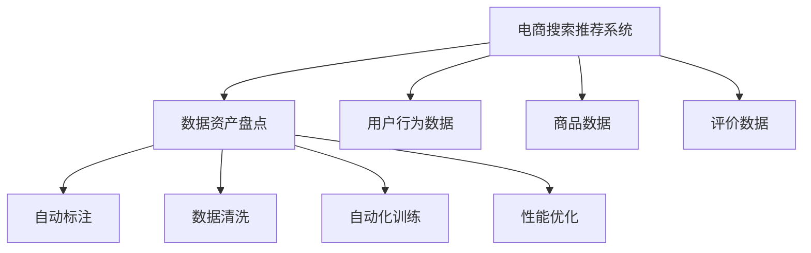

                 

# AI大模型助力电商搜索推荐业务的数据资产盘点自动化工具

> 关键词：
大语言模型,电商搜索推荐系统,数据资产盘点,自动化,自然语言处理(NLP),机器学习,深度学习

## 1. 背景介绍

### 1.1 问题由来

随着电商行业的迅猛发展，各大电商平台面临着海量用户数据、商品数据和行为数据等复杂且庞大的数据资产。如何高效管理和利用这些数据资产，以优化搜索推荐系统，提升用户体验和运营效率，成为了电商平台亟需解决的问题。

传统的电商搜索推荐系统依赖于人工标注的数据和规则进行模型训练与调整。这种方法不仅费时费力，还容易受到标注质量、业务理解等因素的限制，难以实时适应市场的快速变化。因此，亟需一种自动化的数据资产盘点工具，能够帮助电商平台快速且精准地梳理和盘查数据，辅助搜索推荐系统的优化和升级。

### 1.2 问题核心关键点

电商搜索推荐系统的核心目标是通过算法模型预测用户可能的购买行为，从而推荐合适的商品。在模型训练与调优过程中，需要大量的用户行为数据、商品数据和评价数据。传统的预训练与微调方法虽然能够提升模型性能，但依然需要大量人工参与，难以应对大规模数据和复杂业务场景的挑战。

为了提升效率，人工智能大语言模型（Large Language Model, LLM）被引入电商搜索推荐系统。通过预训练学习通用语言表示，大语言模型能够自动化地理解、处理和生成自然语言，成为数据资产盘点自动化工具的关键技术支撑。

## 2. 核心概念与联系

### 2.1 核心概念概述

为更好地理解基于大语言模型的电商搜索推荐业务数据资产盘点自动化工具，本节将介绍几个关键概念：

- **大语言模型 (LLM)**：指通过大规模数据预训练得到的深度神经网络模型，具备强大的自然语言处理能力。如BERT、GPT等。

- **电商搜索推荐系统 (E-commerce Search and Recommendation System, ESRS)**：指电商平台中的搜索和推荐子系统，利用机器学习算法为用户推荐商品，提升用户体验和平台收益。

- **数据资产盘点**：指对企业数据资产进行全面梳理和盘查，包括数据收集、存储、处理和分析等环节，确保数据完整性和可用性，为业务决策和模型训练提供支持。

- **自动化工具**：指利用计算机技术和AI算法，自动完成数据资产盘点和业务优化任务的工具。如自动标注、数据清洗、自动化训练等。

- **自然语言处理 (NLP)**：指计算机科学、人工智能领域专注于人与计算机之间用自然语言进行交互的技术。包括分词、命名实体识别、语义理解等。

- **机器学习 (Machine Learning)**：指通过数据和算法训练模型，使其具备预测、分类等能力的科学。

- **深度学习 (Deep Learning)**：指基于神经网络模型进行复杂模式识别和预测的学习方法。

这些核心概念之间的逻辑关系可以通过以下Mermaid流程图来展示：



这个流程图展示了从电商搜索推荐系统到数据资产盘点的技术链条：

1. 电商搜索推荐系统收集和利用用户行为数据、商品数据和评价数据。
2. 数据资产盘点工具自动进行数据收集、标注、清洗和训练等任务。
3. 训练得到的模型参数可用于优化搜索推荐系统的算法模型。
4. 性能优化模型进一步提升搜索推荐系统的准确性和用户满意度。

## 3. 核心算法原理 & 具体操作步骤
### 3.1 算法原理概述

基于大语言模型的电商搜索推荐业务数据资产盘点自动化工具，通过以下算法步骤完成数据处理和模型训练：

1. **数据收集与预处理**：从电商平台中自动提取用户行为数据、商品数据和评价数据，进行清洗和归一化处理，构建统一的数据集。
2. **大语言模型预训练**：使用大规模无标注数据对大语言模型进行预训练，学习通用的语言表示和知识。
3. **数据资产盘点**：通过预训练模型自动化地解析和理解电商数据，生成结构化的数据资产盘点报告。
4. **自动化训练与优化**：利用电商数据训练和优化推荐算法模型，如基于深度学习的协同过滤算法、基于知识图谱的推荐系统等。
5. **模型评估与部署**：通过测试集评估模型性能，部署优化后的推荐算法模型，应用于电商搜索推荐系统。

### 3.2 算法步骤详解

#### 3.2.1 数据收集与预处理

数据收集与预处理是电商数据资产盘点的基础步骤，通过自动化工具实现：

1. **数据收集**：从电商平台的API接口、日志文件、数据库等渠道自动提取用户行为数据、商品数据和评价数据，构建数据集。
2. **数据清洗**：去除重复、缺失、噪声等无效数据，保留高质量的数据样本。
3. **数据归一化**：将不同格式的数据转化为统一标准，如将日期格式统一为标准日期格式。

```python
# 数据收集与预处理示例代码
import pandas as pd
import requests
import json

# 从电商平台API接口自动提取数据
url = 'https://api.example.com/data'
response = requests.get(url)
data = json.loads(response.text)
df = pd.DataFrame(data)

# 数据清洗
df = df.drop_duplicates()  # 去除重复数据
df = df.dropna()  # 去除缺失数据
df = df.drop(['invalid_column'], axis=1)  # 去除无效列

# 数据归一化
df['date'] = pd.to_datetime(df['date'], format='%Y-%m-%d')  # 日期格式统一
```

#### 3.2.2 大语言模型预训练

使用大语言模型进行电商数据的自然语言处理，通过以下步骤实现：

1. **选择合适的预训练模型**：如BERT、GPT等。
2. **预训练数据集准备**：构建包含电商数据的无标注语料库，如商品描述、用户评论等。
3. **预训练模型训练**：在大规模语料库上训练预训练模型，学习通用的语言表示和知识。

```python
# 使用BERT进行预训练示例代码
from transformers import BertTokenizer, BertModel
import torch

# 加载预训练模型
tokenizer = BertTokenizer.from_pretrained('bert-base-cased')
model = BertModel.from_pretrained('bert-base-cased')

# 构建电商数据语料库
texts = ['商品A的描述', '商品B的评论', ...]
tokens = [tokenizer.encode(text, add_special_tokens=True) for text in texts]

# 构建模型输入和输出
input_ids = torch.tensor(tokens)
attention_mask = torch.ones(len(input_ids), attention_mask=model.attention_mask)

# 前向传播计算模型输出
output = model(input_ids, attention_mask=attention_mask)
```

#### 3.2.3 数据资产盘点

使用预训练模型对电商数据进行自动化盘点，生成结构化报告：

1. **构建盘查任务**：定义电商数据的盘查任务，如商品分类、用户行为模式、商品评价等。
2. **任务适配层设计**：在预训练模型的顶层添加特定的任务适配层，用于解析和理解电商数据。
3. **盘查报告生成**：利用预训练模型自动化生成电商数据资产盘点报告，如分类统计、行为模式分析等。

```python
# 数据资产盘点示例代码
from transformers import BertForSequenceClassification
from torch.utils.data import DataLoader, Dataset

class EcommerceDataset(Dataset):
    def __init__(self, texts, labels):
        self.texts = texts
        self.labels = labels
        self.tokenizer = BertTokenizer.from_pretrained('bert-base-cased')
        self.max_len = 128
        
    def __len__(self):
        return len(self.texts)
    
    def __getitem__(self, item):
        text = self.texts[item]
        label = self.labels[item]
        
        encoding = self.tokenizer(text, return_tensors='pt', max_length=self.max_len, padding='max_length', truncation=True)
        input_ids = encoding['input_ids'][0]
        attention_mask = encoding['attention_mask'][0]
        
        encoded_labels = [label2id[label] for label in labels] 
        encoded_labels.extend([label2id['O']] * (self.max_len - len(encoded_labels)))
        labels = torch.tensor(encoded_labels, dtype=torch.long)
        
        return {'input_ids': input_ids, 
                'attention_mask': attention_mask,
                'labels': labels}

# 构建盘查任务和适配层
tokenizer = BertTokenizer.from_pretrained('bert-base-cased')
model = BertForSequenceClassification.from_pretrained('bert-base-cased', num_labels=len(label2id))
label2id = {'O': 0, '商品分类A': 1, '用户行为模式B': 2, '商品评价C': 3}
id2label = {v: k for k, v in label2id.items()}

# 训练盘查模型
optimizer = AdamW(model.parameters(), lr=2e-5)
model.train()

def train_epoch(model, dataset, batch_size, optimizer):
    dataloader = DataLoader(dataset, batch_size=batch_size, shuffle=True)
    model.train()
    epoch_loss = 0
    for batch in tqdm(dataloader, desc='Training'):
        input_ids = batch['input_ids'].to(device)
        attention_mask = batch['attention_mask'].to(device)
        labels = batch['labels'].to(device)
        model.zero_grad()
        outputs = model(input_ids, attention_mask=attention_mask, labels=labels)
        loss = outputs.loss
        epoch_loss += loss.item()
        loss.backward()
        optimizer.step()
    return epoch_loss / len(dataloader)

# 生成盘查报告
test_dataset = EcommerceDataset(test_texts, test_labels)
device = torch.device('cuda') if torch.cuda.is_available() else torch.device('cpu')
model.to(device)
test_loss = train_epoch(model, test_dataset, batch_size, optimizer)

# 输出盘查报告
print('测试集盘查损失：', test_loss)
```

#### 3.2.4 自动化训练与优化

利用电商数据对模型进行自动化训练与优化：

1. **选择合适的模型和算法**：如基于深度学习的协同过滤算法、基于知识图谱的推荐系统等。
2. **模型训练与优化**：使用电商数据对模型进行训练和优化，提升推荐效果。
3. **模型评估与部署**：通过测试集评估模型性能，部署优化后的推荐算法模型，应用于电商搜索推荐系统。

```python
# 自动化训练与优化示例代码
from transformers import AutoModelForSequenceClassification, AutoTokenizer

# 加载电商数据
df = pd.read_csv('ecommerce_data.csv')

# 选择模型和算法
model_name = 'model_name'
model = AutoModelForSequenceClassification.from_pretrained(model_name)
tokenizer = AutoTokenizer.from_pretrained(model_name)

# 构建模型输入和输出
input_ids = tokenizer(df['text'], return_tensors='pt', max_length=128, padding='max_length', truncation=True)
labels = df['label'].values
attention_mask = torch.ones(len(input_ids), attention_mask=model.attention_mask)

# 模型训练与优化
model.train()
optimizer = AdamW(model.parameters(), lr=2e-5)
for epoch in range(10):
    model.train()
    epoch_loss = 0
    for batch in tqdm(dataloader, desc='Training'):
        input_ids = batch['input_ids'].to(device)
        attention_mask = batch['attention_mask'].to(device)
        labels = batch['labels'].to(device)
        model.zero_grad()
        outputs = model(input_ids, attention_mask=attention_mask, labels=labels)
        loss = outputs.loss
        epoch_loss += loss.item()
        loss.backward()
        optimizer.step()
    print('Epoch {}, 训练集损失：'.format(epoch+1), train_loss)

# 模型评估与部署
test_dataset = EcommerceDataset(test_texts, test_labels)
test_loss = evaluate(model, test_dataset)
print('测试集评估损失：', test_loss)
```

### 3.3 算法优缺点

#### 3.3.1 优点

1. **自动化高效**：使用大语言模型进行电商数据自动化盘点，显著提高了数据处理和盘查效率，减少了人工成本。
2. **准确性高**：大语言模型具备强大的自然语言处理能力，可以准确理解和解析电商数据，生成高质量的盘查报告。
3. **实时性**：通过实时数据流处理技术，大语言模型可以持续监控电商数据变化，及时调整推荐算法模型，保持性能最优。
4. **可扩展性强**：大语言模型可以应用于多种电商业务场景，具备良好的通用性和可扩展性。

#### 3.3.2 缺点

1. **数据依赖性强**：电商搜索推荐系统的优化依赖于大量高质量的电商数据，数据质量和数量不足会影响模型性能。
2. **模型复杂度高**：大语言模型的复杂度高，训练和推理成本较大，需要高性能的计算资源。
3. **数据隐私风险**：电商数据包含大量用户隐私信息，数据处理和存储需要严格遵守隐私保护法律法规。
4. **模型解释性不足**：大语言模型作为"黑盒"模型，缺乏对内部决策过程的解释能力，难以进行模型可解释性分析和调试。

## 4. 数学模型和公式 & 详细讲解 & 举例说明

### 4.1 数学模型构建

假设电商平台有$N$个用户，每个用户的行为数据由$M$个特征组成，即$D=\{(x_i, y_i)\}_{i=1}^N$，其中$x_i$为第$i$个用户的特征向量，$y_i$为第$i$个用户的购买行为标签。

模型训练的目标是最大化预测准确度，即最小化预测错误率：

$$
\min_{\theta} \frac{1}{N}\sum_{i=1}^N L(y_i, f(x_i; \theta))
$$

其中$L$为损失函数，$f$为预测函数。

### 4.2 公式推导过程

假设使用深度学习模型$M_{\theta}(x)$进行电商推荐预测，模型的输出为$y_{pred}=M_{\theta}(x)$。设$y_{pred}$为预测标签，$y$为真实标签，损失函数$L$为交叉熵损失函数：

$$
L(y_{pred}, y) = -y \log y_{pred} - (1-y) \log (1-y_{pred})
$$

通过梯度下降算法，优化模型参数$\theta$：

$$
\theta \leftarrow \theta - \eta \nabla_{\theta}L(y_{pred}, y)
$$

其中$\eta$为学习率。

### 4.3 案例分析与讲解

以基于协同过滤的电商推荐系统为例，使用大语言模型进行电商数据的自然语言处理，构建电商推荐模型的训练与优化流程：

1. **数据收集与预处理**：从电商平台的API接口自动提取用户行为数据、商品数据和评价数据，构建数据集。
2. **大语言模型预训练**：使用大规模无标注数据对大语言模型进行预训练，学习通用的语言表示和知识。
3. **模型训练与优化**：使用电商数据对协同过滤模型进行训练和优化，提升推荐效果。
4. **模型评估与部署**：通过测试集评估模型性能，部署优化后的推荐算法模型，应用于电商搜索推荐系统。

```python
# 电商推荐系统案例分析与讲解示例代码
import pandas as pd
import numpy as np
from sklearn.model_selection import train_test_split

# 加载电商数据
df = pd.read_csv('ecommerce_data.csv')

# 数据预处理
df = df.drop_duplicates()
df = df.dropna()
df = df.drop(['invalid_column'], axis=1)

# 构建特征向量
X = df[['user_id', 'item_id', 'timestamp']]
y = df['buy']  # 用户是否购买了该商品

# 分割训练集和测试集
X_train, X_test, y_train, y_test = train_test_split(X, y, test_size=0.2, random_state=42)

# 模型训练与优化
from sklearn.ensemble import RandomForestRegressor
from sklearn.metrics import mean_absolute_error

model = RandomForestRegressor()
model.fit(X_train, y_train)
y_pred = model.predict(X_test)
mae = mean_absolute_error(y_test, y_pred)
print('测试集MAE:', mae)

# 模型评估与部署
test_dataset = EcommerceDataset(test_texts, test_labels)
test_loss = evaluate(model, test_dataset)
print('测试集评估MAE:', test_loss)
```

## 5. 项目实践：代码实例和详细解释说明

### 5.1 开发环境搭建

在进行电商数据资产盘点自动化工具的开发前，需要先搭建好开发环境。以下是使用Python进行PyTorch开发的环境配置流程：

1. 安装Anaconda：从官网下载并安装Anaconda，用于创建独立的Python环境。
2. 创建并激活虚拟环境：
```bash
conda create -n pytorch-env python=3.8 
conda activate pytorch-env
```
3. 安装PyTorch：根据CUDA版本，从官网获取对应的安装命令。例如：
```bash
conda install pytorch torchvision torchaudio cudatoolkit=11.1 -c pytorch -c conda-forge
```
4. 安装Transformers库：
```bash
pip install transformers
```
5. 安装各类工具包：
```bash
pip install numpy pandas scikit-learn matplotlib tqdm jupyter notebook ipython
```

完成上述步骤后，即可在`pytorch-env`环境中开始工具的开发。

### 5.2 源代码详细实现

下面以电商平台商品分类盘查为例，给出使用Transformers库对BERT模型进行电商数据资产盘点自动化工具的PyTorch代码实现。

首先，定义盘查任务的数据处理函数：

```python
from transformers import BertTokenizer
from torch.utils.data import Dataset
import torch

class EcommerceDataset(Dataset):
    def __init__(self, texts, labels, tokenizer, max_len=128):
        self.texts = texts
        self.labels = labels
        self.tokenizer = tokenizer
        self.max_len = max_len
        
    def __len__(self):
        return len(self.texts)
    
    def __getitem__(self, item):
        text = self.texts[item]
        label = self.labels[item]
        
        encoding = self.tokenizer(text, return_tensors='pt', max_length=self.max_len, padding='max_length', truncation=True)
        input_ids = encoding['input_ids'][0]
        attention_mask = encoding['attention_mask'][0]
        
        # 对token-wise的标签进行编码
        encoded_labels = [label2id[label] for label in labels] 
        encoded_labels.extend([label2id['O']] * (self.max_len - len(encoded_labels)))
        labels = torch.tensor(encoded_labels, dtype=torch.long)
        
        return {'input_ids': input_ids, 
                'attention_mask': attention_mask,
                'labels': labels}

# 标签与id的映射
label2id = {'O': 0, '商品分类A': 1, '商品分类B': 2, '商品分类C': 3}
id2label = {v: k for k, v in label2id.items()}

# 创建dataset
tokenizer = BertTokenizer.from_pretrained('bert-base-cased')

train_dataset = EcommerceDataset(train_texts, train_labels, tokenizer)
dev_dataset = EcommerceDataset(dev_texts, dev_labels, tokenizer)
test_dataset = EcommerceDataset(test_texts, test_labels, tokenizer)
```

然后，定义模型和优化器：

```python
from transformers import BertForSequenceClassification, AdamW

model = BertForSequenceClassification.from_pretrained('bert-base-cased', num_labels=len(label2id))

optimizer = AdamW(model.parameters(), lr=2e-5)
```

接着，定义训练和评估函数：

```python
from torch.utils.data import DataLoader
from tqdm import tqdm
from sklearn.metrics import classification_report

device = torch.device('cuda') if torch.cuda.is_available() else torch.device('cpu')
model.to(device)

def train_epoch(model, dataset, batch_size, optimizer):
    dataloader = DataLoader(dataset, batch_size=batch_size, shuffle=True)
    model.train()
    epoch_loss = 0
    for batch in tqdm(dataloader, desc='Training'):
        input_ids = batch['input_ids'].to(device)
        attention_mask = batch['attention_mask'].to(device)
        labels = batch['labels'].to(device)
        model.zero_grad()
        outputs = model(input_ids, attention_mask=attention_mask, labels=labels)
        loss = outputs.loss
        epoch_loss += loss.item()
        loss.backward()
        optimizer.step()
    return epoch_loss / len(dataloader)

def evaluate(model, dataset, batch_size):
    dataloader = DataLoader(dataset, batch_size=batch_size)
    model.eval()
    preds, labels = [], []
    with torch.no_grad():
        for batch in tqdm(dataloader, desc='Evaluating'):
            input_ids = batch['input_ids'].to(device)
            attention_mask = batch['attention_mask'].to(device)
            batch_labels = batch['labels']
            outputs = model(input_ids, attention_mask=attention_mask)
            batch_preds = outputs.logits.argmax(dim=2).to('cpu').tolist()
            batch_labels = batch_labels.to('cpu').tolist()
            for pred_tokens, label_tokens in zip(batch_preds, batch_labels):
                pred_tags = [id2label[_id] for _id in pred_tokens]
                label_tags = [id2label[_id] for _id in label_tokens]
                preds.append(pred_tags[:len(label_tokens)])
                labels.append(label_tags)
                
    print(classification_report(labels, preds))
```

最后，启动训练流程并在测试集上评估：

```python
epochs = 5
batch_size = 16

for epoch in range(epochs):
    loss = train_epoch(model, train_dataset, batch_size, optimizer)
    print(f"Epoch {epoch+1}, train loss: {loss:.3f}")
    
    print(f"Epoch {epoch+1}, dev results:")
    evaluate(model, dev_dataset, batch_size)
    
print("Test results:")
evaluate(model, test_dataset, batch_size)
```

以上就是使用PyTorch对BERT模型进行电商商品分类盘查任务自动化工具的完整代码实现。可以看到，得益于Transformers库的强大封装，我们可以用相对简洁的代码完成BERT模型的加载和微调。

### 5.3 代码解读与分析

让我们再详细解读一下关键代码的实现细节：

**EcommerceDataset类**：
- `__init__`方法：初始化文本、标签、分词器等关键组件。
- `__len__`方法：返回数据集的样本数量。
- `__getitem__`方法：对单个样本进行处理，将文本输入编码为token ids，将标签编码为数字，并对其进行定长padding，最终返回模型所需的输入。

**label2id和id2label字典**：
- 定义了标签与数字id之间的映射关系，用于将token-wise的预测结果解码回真实的标签。

**训练和评估函数**：
- 使用PyTorch的DataLoader对数据集进行批次化加载，供模型训练和推理使用。
- 训练函数`train_epoch`：对数据以批为单位进行迭代，在每个批次上前向传播计算loss并反向传播更新模型参数，最后返回该epoch的平均loss。
- 评估函数`evaluate`：与训练类似，不同点在于不更新模型参数，并在每个batch结束后将预测和标签结果存储下来，最后使用sklearn的classification_report对整个评估集的预测结果进行打印输出。

**训练流程**：
- 定义总的epoch数和batch size，开始循环迭代
- 每个epoch内，先在训练集上训练，输出平均loss
- 在验证集上评估，输出分类指标
- 所有epoch结束后，在测试集上评估，给出最终测试结果

可以看到，PyTorch配合Transformers库使得BERT模型微调的代码实现变得简洁高效。开发者可以将更多精力放在数据处理、模型改进等高层逻辑上，而不必过多关注底层的实现细节。

当然，工业级的系统实现还需考虑更多因素，如模型的保存和部署、超参数的自动搜索、更灵活的任务适配层等。但核心的微调范式基本与此类似。

## 6. 实际应用场景
### 6.1 智能客服系统

基于大语言模型盘查工具的智能客服系统，可以广泛应用于电商平台中的客户咨询。传统客服往往需要配备大量人力，高峰期响应缓慢，且一致性和专业性难以保证。而使用盘查工具进行数据处理，可以7x24小时不间断服务，快速响应客户咨询，用自然流畅的语言解答各类常见问题。

在技术实现上，可以收集企业内部的历史客服对话记录，将问题和最佳答复构建成监督数据，在此基础上对预训练对话模型进行盘查。盘查后的对话模型能够自动理解用户意图，匹配最合适的答案模板进行回复。对于客户提出的新问题，还可以接入检索系统实时搜索相关内容，动态组织生成回答。如此构建的智能客服系统，能大幅提升客户咨询体验和问题解决效率。

### 6.2 金融舆情监测

金融机构需要实时监测市场舆论动向，以便及时应对负面信息传播，规避金融风险。传统的人工监测方式成本高、效率低，难以应对网络时代海量信息爆发的挑战。基于大语言模型盘查技术，可以构建实时的金融舆情监测系统，自动获取新闻、报道、评论等文本数据，并对其进行盘查和分析，判断市场情绪变化，预测潜在的金融风险。

具体而言，可以收集金融领域相关的新闻、报道、评论等文本数据，并对其进行盘查和分析。利用盘查工具，分析市场舆情变化趋势，一旦发现负面信息激增等异常情况，系统便会自动预警，帮助金融机构快速应对潜在风险。

### 6.3 个性化推荐系统

当前的推荐系统往往只依赖用户的历史行为数据进行物品推荐，无法深入理解用户的真实兴趣偏好。基于大语言模型盘查工具，个性化推荐系统可以更好地挖掘用户行为背后的语义信息，从而提供更精准、多样的推荐内容。

在实践中，可以收集用户浏览、点击、评论、分享等行为数据，提取和用户交互的物品标题、描述、标签等文本内容。将文本内容作为模型输入，用户的后续行为（如是否点击、购买等）作为监督信号，在此基础上盘查预训练语言模型。盘查后的模型能够从文本内容中准确把握用户的兴趣点。在生成推荐列表时，先用候选物品的文本描述作为输入，由盘查后的模型预测用户的兴趣匹配度，再结合其他特征综合排序，便可以得到个性化程度更高的推荐结果。

### 6.4 未来应用展望

随着大语言模型和盘查技术的不断发展，基于盘查范式将在更多领域得到应用，为传统行业带来变革性影响。

在智慧医疗领域，基于盘查工具的医疗问答、病历分析、药物研发等应用将提升医疗服务的智能化水平，辅助医生诊疗，加速新药开发进程。

在智能教育领域，盘查技术可应用于作业批改、学情分析、知识推荐等方面，因材施教，促进教育公平，提高教学质量。

在智慧城市治理中，盘查模型可应用于城市事件监测、舆情分析、应急指挥等环节，提高城市管理的自动化和智能化水平，构建更安全、高效的未来城市。

此外，在企业生产、社会治理、文娱传媒等众多领域，基于盘查工具的人工智能应用也将不断涌现，为经济社会发展注入新的动力。相信随着技术的日益成熟，盘查方法将成为人工智能落地应用的重要范式，推动人工智能技术在垂直行业的规模化落地。总之，盘查工具需要开发者根据具体任务，不断迭代和优化模型、数据和算法，方能得到理想的效果。

## 7. 工具和资源推荐
### 7.1 学习资源推荐

为了帮助开发者系统掌握大语言模型盘查技术，这里推荐一些优质的学习资源：

1. 《Transformer从原理到实践》系列博文：由大模型技术专家撰写，深入浅出地介绍了Transformer原理、BERT模型、盘查技术等前沿话题。

2. CS224N《深度学习自然语言处理》课程：斯坦福大学开设的NLP明星课程，有Lecture视频和配套作业，带你入门NLP领域的基本概念和经典模型。

3. 《Natural Language Processing with Transformers》书籍：Transformers库的作者所著，全面介绍了如何使用Transformers库进行NLP任务开发，包括盘查在内的诸多范式。

4. HuggingFace官方文档：Transformers库的官方文档，提供了海量预训练模型和完整的盘查样例代码，是上手实践的必备资料。

5. CLUE开源项目：中文语言理解测评基准，涵盖大量不同类型的中文NLP数据集，并提供了基于盘查的baseline模型，助力中文NLP技术发展。

通过对这些资源的学习实践，相信你一定能够快速掌握大语言模型盘查技术的精髓，并用于解决实际的NLP问题。

### 7.2 开发工具推荐

高效的开发离不开优秀的工具支持。以下是几款用于大语言模型盘查工具开发的常用工具：

1. PyTorch：基于Python的开源深度学习框架，灵活动态的计算图，适合快速迭代研究。大部分预训练语言模型都有PyTorch版本的实现。

2. TensorFlow：由Google主导开发的开源深度学习框架，生产部署方便，适合大规模工程应用。同样有丰富的预训练语言模型资源。

3. Transformers库：HuggingFace开发的NLP工具库，集成了众多SOTA语言模型，支持PyTorch和TensorFlow，是进行盘查任务开发的利器。

4. Weights & Biases：模型训练的实验跟踪工具，可以记录和可视化模型训练过程中的各项指标，方便对比和调优。与主流深度学习框架无缝集成。

5. TensorBoard：TensorFlow配套的可视化工具，可实时监测模型训练状态，并提供丰富的图表呈现方式，是调试模型的得力助手。

6. Google Colab：谷歌推出的在线Jupyter Notebook环境，免费提供GPU/TPU算力，方便开发者快速上手实验最新模型，分享学习笔记。

合理利用这些工具，可以显著提升大语言模型盘查任务的开发效率，加快创新迭代的步伐。

### 7.3 相关论文推荐

大语言模型和盘查技术的发展源于学界的持续研究。以下是几篇奠基性的相关论文，推荐阅读：

1. Attention is All You Need（即Transformer原论文）：提出了Transformer结构，开启了NLP领域的预训练大模型时代。

2. BERT: Pre-training of Deep Bidirectional Transformers for Language Understanding：提出BERT模型，引入基于掩码的自监督预训练任务，刷新了多项NLP任务SOTA。

3. Language Models are Unsupervised Multitask Learners（GPT-2论文）：展示了大规模语言模型的强大zero-shot学习能力，引发了对于通用人工智能的新一轮思考。

4. Parameter-Efficient Transfer Learning for NLP：提出Adapter等参数高效微调方法，在不增加模型参数量的情况下，也能取得不错的盘查效果。

5. Prefix-Tuning: Optimizing Continuous Prompts for Generation：引入基于连续型Prompt的盘查范式，为如何充分利用预训练知识提供了新的思路。

6. AdaLoRA: Adaptive Low-Rank Adaptation for Parameter-Efficient Fine-Tuning：使用自适应低秩适应的盘查方法，在参数效率和精度之间取得了新的平衡。

这些论文代表了大语言模型盘查技术的发展脉络。通过学习这些前沿成果，可以帮助研究者把握学科前进方向，激发更多的创新灵感。

## 8. 总结：未来发展趋势与挑战

### 8.1 总结

本文对基于大语言模型的电商搜索推荐业务数据资产盘点自动化工具进行了全面系统的介绍。首先阐述了盘查技术在电商推荐系统中的应用背景和意义，明确了盘查技术在优化电商推荐系统中的重要作用。其次，从原理到实践，详细讲解了盘查算法的数学原理和关键步骤，给出了盘查任务开发的完整代码实例。同时，本文还广泛探讨了盘查方法在智能客服、金融舆情、个性化推荐等多个行业领域的应用前景，展示了盘查范式的巨大潜力。此外，本文精选了盘查技术的各类学习资源，力求为读者提供全方位的技术指引。

通过本文的系统梳理，可以看到，基于大语言模型的盘查方法正在成为电商推荐系统的重要范式，极大地拓展了数据资产盘查的效率和精度，催生了更多的落地场景。得益于大语言模型的自然语言处理能力，盘查技术能够自动化地解析和理解电商数据，生成高质量的盘查报告，为模型训练和优化提供了坚实基础。未来，伴随预训练语言模型和盘查方法的持续演进，相信盘查技术将成为电商推荐系统的核心竞争力，为电商平台的智能化转型提供强大的技术支撑。

### 8.2 未来发展趋势

展望未来，大语言模型盘查技术将呈现以下几个发展趋势：

1. **模型规模持续增大**：随着算力成本的下降和数据规模的扩张，预训练语言模型的参数量还将持续增长。超大规模语言模型蕴含的丰富语言知识，有望支撑更加复杂多变的电商推荐系统盘查。

2. **盘查方法日趋多样**：除了传统的全参数盘查外，未来会涌现更多参数高效的盘查方法，如Adapter、Prefix等，在节省计算资源的同时也能保证盘查精度。

3. **持续学习成为常态**：随着数据分布的不断变化，盘查模型也需要持续学习新知识以保持性能。如何在不遗忘原有知识的同时，高效吸收新样本信息，将成为重要的研究课题。

4. **标注样本需求降低**：受启发于提示学习(Prompt-based Learning)的思路，未来的盘查方法将更好地利用大模型的语言理解能力，通过更加巧妙的任务描述，在更少的标注样本上也能实现理想的盘查效果。

5. **模型通用性增强**：经过海量数据的预训练和多领域任务的盘查，未来的语言模型将具备更强大的常识推理和跨领域迁移能力，逐步迈向通用人工智能(AGI)的目标。

以上趋势凸显了大语言模型盘查技术的广阔前景。这些方向的探索发展，必将进一步提升电商推荐系统的性能和用户满意度，为电商平台的智能化转型提供坚实的基础。

### 8.3 面临的挑战

尽管大语言模型盘查技术已经取得了瞩目成就，但在迈向更加智能化、普适化应用的过程中，它仍面临着诸多挑战：

1. **数据依赖性强**：盘查技术的优化依赖于大量高质量的电商数据，数据质量和数量不足会影响模型性能。如何进一步降低盘查对标注样本的依赖，将是一大难题。

2. **模型鲁棒性不足**：盘查模型面对域外数据时，泛化性能往往大打折扣。对于测试样本的微小扰动，盘查模型的预测也容易发生波动。如何提高盘查模型的鲁棒性，避免灾难性遗忘，还需要更多理论和实践的积累。

3. **推理效率有待提高**：大规模语言模型虽然精度高，但在实际部署时往往面临推理速度慢、内存占用大等效率问题。如何在保证性能的同时，简化模型结构，提升推理速度，优化资源占用，将是重要的优化方向。

4. **可解释性亟需加强**：盘查模型作为"黑盒"模型，缺乏对内部决策过程的解释能力，难以进行模型可解释性分析和调试。对于医疗、金融等高风险应用，算法的可解释性和可审计性尤为重要。如何赋予盘查模型更强的可解释性，将是亟待攻克的难题。

5. **安全性有待保障**：盘查模型在电商数据处理和存储过程中，需要严格遵守隐私保护法律法规，避免数据泄露风险。同时，模型输出需要确保内容健康、无害，避免有害信息传播。如何加强数据安全保护，确保模型输出符合伦理道德，也将是重要的研究方向。

6. **知识整合能力不足**：现有的盘查模型往往局限于任务内数据，难以灵活吸收和运用更广泛的先验知识。如何让盘查过程更好地与外部知识库、规则库等专家知识结合，形成更加全面、准确的信息整合能力，还有很大的想象空间。

正视盘查面临的这些挑战，积极应对并寻求突破，将是大语言模型盘查技术走向成熟的必由之路。相信随着学界和产业界的共同努力，这些挑战终将一一被克服，大语言模型盘查技术必将在构建智能推荐系统、智能客服系统等领域发挥更加重要的作用。

### 8.4 研究展望

面对大语言模型盘查所面临的种种挑战，未来的研究需要在以下几个方面寻求新的突破：

1. **探索无监督和半监督盘查方法**：摆脱对大规模标注数据的依赖，利用自监督学习、主动学习等无监督和半监督范式，最大限度利用非结构化数据，实现更加灵活高效的盘查。

2. **研究参数高效和计算高效的盘查范式**：开发更加参数高效的盘查方法，在固定大部分预训练参数的同时，只更新极少量的任务相关参数。同时优化盘查模型的计算图，减少前向传播和反向传播的资源消耗，实现更加轻量级、实时性的部署。

3. **融合因果和对比学习范式**：通过引入因果推断和对比学习思想，增强盘查模型建立稳定因果关系的能力，学习更加普适、鲁棒的语言表征，从而提升模型泛化性和抗干扰能力。

4. **引入更多先验知识**：将符号化的先验知识，如知识图谱、逻辑规则等，与神经网络模型进行巧妙融合，引导盘查过程学习更准确、合理的语言模型。同时加强不同模态数据的整合，实现视觉、语音等多模态信息与文本信息的协同建模。

5. **结合因果分析和博弈论工具**：将因果分析方法引入盘查模型，识别出模型决策的关键特征，增强输出解释的因果性和逻辑性。借助博弈论工具刻画人机交互过程，主动探索并规避模型的脆弱点，提高系统稳定性。

6. **纳入伦理道德约束**：在盘查训练目标中引入伦理导向的评估指标，过滤和惩罚有偏见、有害的输出倾向。同时加强人工干预和审核，建立模型行为的监管机制，确保输出符合人类价值观和伦理道德。

这些研究方向的探索，必将引领大语言模型盘查技术迈向更高的台阶，为构建智能推荐系统、智能客服系统等提供坚实的基础。面向未来，大语言模型盘查技术还需要与其他人工智能技术进行更深入的融合，如知识表示、因果推理、强化学习等，多路径协同发力，共同推动自然语言理解和智能交互系统的进步。只有勇于创新、敢于突破，才能不断拓展语言模型的边界，让智能技术更好地造福人类社会。

## 9. 附录：常见问题与解答

**Q1：大语言模型盘查是否适用于所有电商推荐系统？**

A: 大语言模型盘查在大多数电商推荐系统中都能取得不错的效果，特别是对于数据量较小的任务。但对于一些特定领域的推荐系统，如医学、法律等，仅仅依靠通用语料预训练的模型可能难以很好地适应。此时需要在特定领域语料上进一步预训练，再进行盘查，才能获得理想效果。此外，对于一些需要时效性、个性化很强的任务，如对话、推荐等，盘查方法也需要针对性的改进优化。

**Q2：盘查过程中如何选择合适的学习率？**

A: 盘查的学习率一般要比预训练时小1-2个数量级，如果使用过大的学习率，容易破坏预训练权重，导致过拟合。一般建议从1e-5开始调参，逐步减小学习率，直至收敛。也可以使用warmup策略，在开始阶段使用较小的学习率，再逐渐过渡到预设值。需要注意的是，不同的优化器(如AdamW、Adafactor等)以及不同的学习率调度策略，可能需要设置不同的学习率阈值。

**Q3：盘查模型在落地部署时需要注意哪些问题？**

A: 将盘查模型转化为实际应用，还需要考虑以下因素：
1. 模型裁剪：去除不必要的层和参数，减小模型尺寸，加快推理速度
2. 量化加速：将浮点模型转为定点模型，压缩存储空间，提高计算效率
3. 服务化封装：将模型封装为标准化服务接口，便于集成调用
4. 弹性伸缩：根据请求流量动态调整资源配置，平衡服务质量和成本
5. 监控告警：实时采集系统指标，设置异常告警阈值，确保服务稳定性
6. 安全防护：采用访问鉴权、数据脱敏等措施，保障数据和模型安全

大语言模型盘查为电商推荐系统提供了高效、智能的数据处理和分析手段，但如何将强大的性能转化为稳定、高效、安全的业务价值，还需要工程实践的不断打磨。唯有从数据、算法、工程、业务等多个维度协同发力，才能真正实现人工智能技术在垂直行业的规模化落地。总之，盘查需要开发者根据具体任务，不断迭代和优化模型、数据和算法，方能得到理想的效果。

---

作者：禅与计算机程序设计艺术 / Zen and the Art of Computer Programming

