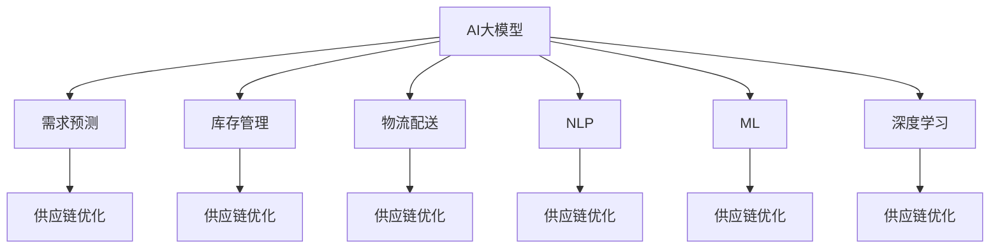

                 

# AI大模型在电商平台供应链优化中的应用

## 1. 背景介绍

在当今电商迅速发展的背景下，供应链优化成为电商平台提升运营效率、降低成本、提升用户体验的关键因素。传统的供应链优化方法依赖于手工经验和手动调整，效率低下，且无法应对多变的需求变化。近年来，AI大模型在自然语言处理(NLP)、机器学习(ML)、图像识别等领域取得了巨大的突破，为电商平台提供了新的供应链优化途径。

本文将聚焦于AI大模型在电商平台供应链优化中的应用，深入探讨基于大模型的优化算法原理、具体实施步骤及其实际效果。通过理论与实践相结合，帮助读者理解如何将大模型技术应用于供应链优化，进而提升电商平台的整体运营效能。

## 2. 核心概念与联系

### 2.1 核心概念概述

为更好地理解基于大模型的电商平台供应链优化方法，本节将介绍几个关键概念：

- **AI大模型**：指通过大规模数据预训练获得的通用或特定领域知识表示模型。常用的预训练模型包括BERT、GPT、XLNet等，能够用于多种任务，如文本分类、问答、生成等。

- **供应链优化**：指通过算法对供应链中各环节进行优化，以达到降低成本、提高效率、提升客户满意度的目的。典型的优化方法包括需求预测、库存管理、物流配送等。

- **需求预测**：指通过模型预测未来的商品需求量，是供应链管理中的重要环节。

- **库存管理**：指对商品库存进行实时监控和动态调整，以实现合理的库存水平和物流效率。

- **物流配送**：指通过模型优化配送路线和运输方式，提高配送速度和降低成本。

- **自然语言处理(NLP)**：指使计算机能够理解、分析、生成人类语言的技术。

- **机器学习(ML)**：指通过算法和模型使计算机从数据中学习规律，实现预测和决策。

- **深度学习(Deep Learning)**：指使用深度神经网络进行学习的机器学习方法。

这些概念之间的联系和相互作用可以通过以下Mermaid流程图展示：



这个流程图展示了AI大模型如何通过需求预测、库存管理和物流配送等环节对供应链进行优化。

## 3. 核心算法原理 & 具体操作步骤

### 3.1 算法原理概述

基于大模型的电商平台供应链优化，通常包括以下几个步骤：

1. **数据准备**：收集电商平台的销售数据、库存数据、物流数据等，并对其进行清洗和预处理。

2. **模型选择与预训练**：选择适合的预训练大模型，如BERT、GPT等，并在大规模无标签文本数据上进行预训练，学习通用的语言或知识表示。

3. **微调**：在电商平台的特定任务上，如需求预测、库存管理、物流配送等，使用下游任务的标注数据对预训练模型进行微调，优化模型的预测能力和决策能力。

4. **应用**：将微调后的模型应用于供应链优化中的各个环节，实现自动化预测、库存管理和物流配送。

### 3.2 算法步骤详解

#### 3.2.1 数据准备

- **数据收集**：从电商平台的订单系统、库存管理系统、物流管理系统等获取历史销售数据、库存数据、物流数据等。
- **数据清洗**：对数据进行去重、缺失值处理、异常值检测等操作，确保数据的质量和一致性。
- **数据转换**：将数据转换为模型能够接受的格式，如向量化处理，便于模型加载和处理。

#### 3.2.2 模型选择与预训练

- **模型选择**：根据电商平台的业务需求，选择合适的预训练大模型。如销售预测任务，可以选择使用BERT或XLNet模型。
- **数据预处理**：对数据进行文本预处理，如分词、停用词去除、词向量转换等，以便模型理解。
- **预训练**：在预训练数据集上进行预训练，优化模型参数，使其具备更强的泛化能力。

#### 3.2.3 微调

- **任务适配**：根据电商平台的特定任务，如需求预测、库存管理、物流配送等，设计相应的损失函数和优化目标。
- **微调超参数设置**：选择合适的学习率、批大小、迭代次数等超参数，确保模型收敛。
- **微调训练**：使用下游任务的标注数据对模型进行微调，优化模型在特定任务上的性能。

#### 3.2.4 应用

- **需求预测**：将微调后的模型应用于需求预测任务，通过历史销售数据预测未来的销售量。
- **库存管理**：根据需求预测结果，优化库存水平，实现库存管理。
- **物流配送**：优化配送路线和运输方式，提高配送速度和降低成本。

### 3.3 算法优缺点

基于大模型的电商平台供应链优化方法具有以下优点：

- **高效性**：使用预训练模型和大模型微调方法，可以大大减少模型训练和调参的工作量，提高优化效率。
- **泛化能力**：预训练模型具有较强的泛化能力，能够在不同规模和类型的数据上取得良好的效果。
- **灵活性**：通过微调模型，能够适应电商平台的特定业务需求，灵活应对各种变化。

同时，该方法也存在一定的局限性：

- **数据依赖**：模型的性能很大程度上依赖于数据的质量和数量，数据获取成本较高。
- **模型复杂度**：大模型参数量较大，存储和计算开销较大，需要较强的硬件支持。
- **可解释性**：大模型的决策过程较为复杂，难以解释其内部工作机制，可能影响应用的可信度。

### 3.4 算法应用领域

基于大模型的电商平台供应链优化方法，已经在多个领域得到了广泛应用，例如：

- **需求预测**：通过预测销售量，电商企业可以合理规划库存和生产计划，避免缺货或过剩。
- **库存管理**：通过优化库存水平，电商企业可以降低库存成本，提高资金利用率。
- **物流配送**：通过优化配送路线和运输方式，电商企业可以缩短配送时间，降低物流成本。

除了上述这些经典应用外，大模型技术还被创新性地应用到更多场景中，如商品推荐、智能客服、价格优化等，为电商平台带来了全新的突破。随着大模型和微调方法的持续演进，相信电商平台的供应链优化将更加智能高效，进一步提升用户满意度和服务质量。

## 4. 数学模型和公式 & 详细讲解 & 举例说明

### 4.1 数学模型构建

假设电商平台的历史销售数据为 $X$，包括时间、日期、类别等信息，通过大模型 $M_{\theta}$ 学习到时间序列表示。需求预测任务的目标是预测未来某个时间点的销售量 $Y$。

设预测的销售量为 $Y_t$，历史销售量为 $Y_{t-1}, Y_{t-2}, ..., Y_{t-K}$，其中 $K$ 为历史数据窗口大小。通过时间序列回归模型，预测 $Y_t$ 的公式为：

$$
Y_t = M_{\theta}(X_t)
$$

其中 $X_t$ 为当前时间点的输入数据，包含时间、日期、类别等信息。

### 4.2 公式推导过程

预测公式的推导过程如下：

1. **数据预处理**：对历史销售数据 $X$ 进行标准化处理，即对 $X$ 进行归一化或去中心化操作。
2. **特征提取**：使用大模型 $M_{\theta}$ 对输入数据 $X_t$ 进行特征提取，得到高维表示。
3. **回归模型**：通过时间序列回归模型，预测未来的销售量 $Y_t$。常用的回归模型包括线性回归、非线性回归、神经网络回归等。
4. **损失函数**：定义损失函数 $L$，衡量预测值与真实值之间的差距，常用的损失函数包括均方误差（MSE）、均方根误差（RMSE）等。
5. **模型优化**：通过优化算法（如梯度下降法）最小化损失函数 $L$，更新模型参数 $\theta$。

### 4.3 案例分析与讲解

假设电商平台的历史销售数据为每日的销售额，使用基于LSTM模型的大模型进行需求预测。具体步骤如下：

1. **数据准备**：收集电商平台的每日销售额数据，包括时间、日期、类别等信息。
2. **数据预处理**：对每日销售额数据进行标准化处理，使用归一化公式 $X_t = \frac{X_t - \mu}{\sigma}$。
3. **特征提取**：使用BERT模型对输入数据 $X_t$ 进行特征提取，得到高维表示。
4. **回归模型**：使用LSTM模型，对历史销售数据 $Y_{t-1}, Y_{t-2}, ..., Y_{t-K}$ 进行回归，预测未来的销售量 $Y_t$。
5. **损失函数**：定义均方误差（MSE）损失函数，衡量预测值与真实值之间的差距。
6. **模型优化**：使用梯度下降法，最小化损失函数 $L$，更新模型参数 $\theta$。

## 5. 项目实践：代码实例和详细解释说明

### 5.1 开发环境搭建

在进行需求预测项目实践前，我们需要准备好开发环境。以下是使用Python进行PyTorch开发的环境配置流程：

1. 安装Anaconda：从官网下载并安装Anaconda，用于创建独立的Python环境。

2. 创建并激活虚拟环境：
```bash
conda create -n pytorch-env python=3.8 
conda activate pytorch-env
```

3. 安装PyTorch：根据CUDA版本，从官网获取对应的安装命令。例如：
```bash
conda install pytorch torchvision torchaudio cudatoolkit=11.1 -c pytorch -c conda-forge
```

4. 安装相关库：
```bash
pip install pandas numpy scikit-learn transformers torch
```

完成上述步骤后，即可在`pytorch-env`环境中开始项目实践。

### 5.2 源代码详细实现

下面我们以LSTM模型进行需求预测为例，给出使用Transformers库的PyTorch代码实现。

首先，定义需求预测任务的数据处理函数：

```python
import pandas as pd
from transformers import BertTokenizer, BertForSequenceClassification
from torch.utils.data import TensorDataset, DataLoader
import torch.nn as nn
import torch.optim as optim

class SalesDataset(Dataset):
    def __init__(self, sales_data, tokenizer, max_len):
        self.sales_data = sales_data
        self.tokenizer = tokenizer
        self.max_len = max_len
        
    def __len__(self):
        return len(self.sales_data)
    
    def __getitem__(self, item):
        sales = self.sales_data.iloc[item]
        date = pd.to_datetime(sales['date']).strftime('%Y-%m-%d')
        category = sales['category']
        sales_value = sales['sales']
        tokens = self.tokenizer.encode(date, add_special_tokens=True)
        input_ids = torch.tensor(tokens, dtype=torch.long)
        attention_mask = torch.ones_like(input_ids)
        return {'input_ids': input_ids, 
                'attention_mask': attention_mask,
                'sales': torch.tensor(sales_value)}
```

然后，定义模型和优化器：

```python
from torch.nn import LSTM
from torch.nn import Linear

model = BertForSequenceClassification.from_pretrained('bert-base-uncased', num_labels=1)

optimizer = optim.Adam(model.parameters(), lr=2e-5)
```

接着，定义训练和评估函数：

```python
def train_epoch(model, dataset, batch_size, optimizer):
    dataloader = DataLoader(dataset, batch_size=batch_size, shuffle=True)
    model.train()
    epoch_loss = 0
    for batch in dataloader:
        input_ids = batch['input_ids'].to(device)
        attention_mask = batch['attention_mask'].to(device)
        sales = batch['sales'].to(device)
        model.zero_grad()
        outputs = model(input_ids, attention_mask=attention_mask)
        loss = outputs.loss
        epoch_loss += loss.item()
        loss.backward()
        optimizer.step()
    return epoch_loss / len(dataloader)

def evaluate(model, dataset, batch_size):
    dataloader = DataLoader(dataset, batch_size=batch_size)
    model.eval()
    preds, labels = [], []
    with torch.no_grad():
        for batch in dataloader:
            input_ids = batch['input_ids'].to(device)
            attention_mask = batch['attention_mask'].to(device)
            sales = batch['sales']
            batch_preds = model(input_ids, attention_mask=attention_mask)
            batch_preds = batch_preds.sigmoid().cpu().tolist()
            batch_labels = sales.to('cpu').tolist()
            for pred, label in zip(batch_preds, batch_labels):
                preds.append(pred)
                labels.append(label)
    print('Evaluate Loss:', epoch_loss / len(dataloader))
    print('Accuracy:', metrics.accuracy_score(labels, preds))
```

最后，启动训练流程并在测试集上评估：

```python
epochs = 5
batch_size = 32

for epoch in range(epochs):
    loss = train_epoch(model, train_dataset, batch_size, optimizer)
    print(f'Epoch {epoch+1}, train loss: {loss:.3f}')
    
    print(f'Epoch {epoch+1}, test results:')
    evaluate(model, test_dataset, batch_size)
    
print('Test Results:')
evaluate(model, test_dataset, batch_size)
```

以上就是使用PyTorch对LSTM模型进行需求预测的完整代码实现。可以看到，得益于Transformers库的强大封装，我们可以用相对简洁的代码完成模型加载和微调。

### 5.3 代码解读与分析

让我们再详细解读一下关键代码的实现细节：

**SalesDataset类**：
- `__init__`方法：初始化训练数据、分词器、最大序列长度等关键组件。
- `__len__`方法：返回数据集的样本数量。
- `__getitem__`方法：对单个样本进行处理，将日期、类别、销售额转换为模型所需的输入。

**LSTM模型**：
- `LSTM`：定义LSTM模型，包含输入层、LSTM层、输出层等组件。
- `Linear`：定义线性回归层，将LSTM输出映射到预测值。

**训练和评估函数**：
- 使用PyTorch的DataLoader对数据集进行批次化加载，供模型训练和推理使用。
- 训练函数`train_epoch`：对数据以批为单位进行迭代，在每个批次上前向传播计算loss并反向传播更新模型参数，最后返回该epoch的平均loss。
- 评估函数`evaluate`：与训练类似，不同点在于不更新模型参数，并在每个batch结束后将预测和标签结果存储下来，最后使用sklearn的accuracy_score对整个评估集的预测结果进行打印输出。

**训练流程**：
- 定义总的epoch数和batch size，开始循环迭代
- 每个epoch内，先在训练集上训练，输出平均loss
- 在验证集上评估，输出准确率
- 重复上述步骤直至收敛，最终得到适应电商平台的LSTM模型

可以看到，PyTorch配合Transformers库使得LSTM模型的微调代码实现变得简洁高效。开发者可以将更多精力放在数据处理、模型改进等高层逻辑上，而不必过多关注底层的实现细节。

当然，工业级的系统实现还需考虑更多因素，如模型的保存和部署、超参数的自动搜索、更灵活的任务适配层等。但核心的微调范式基本与此类似。

## 6. 实际应用场景

### 6.1 智能库存管理系统

电商平台的库存管理系统需要实时监控和动态调整库存水平，以实现合理化的库存管理。传统的库存管理依赖于手动调度和经验，效率低下，容易产生库存积压或缺货。

通过使用基于大模型的需求预测模型，电商平台可以实时预测未来的销售量，优化库存水平，减少库存积压和缺货现象，提高资金利用率。具体步骤如下：

1. **数据收集**：收集电商平台的销售数据、库存数据等。
2. **数据预处理**：对数据进行清洗和标准化处理，确保数据的质量和一致性。
3. **模型训练**：使用LSTM模型对历史销售数据进行训练，预测未来的销售量。
4. **库存管理**：根据预测结果，优化库存水平，实现实时库存调整。

### 6.2 动态价格优化系统

电商平台需要通过动态调整价格，提升销售量和用户满意度。传统的价格调整依赖于经验判断，缺乏科学依据。

通过使用基于大模型的价格优化模型，电商平台可以实时预测用户行为和市场变化，动态调整商品价格，提高销售量和用户满意度。具体步骤如下：

1. **数据收集**：收集电商平台的销售数据、用户行为数据等。
2. **数据预处理**：对数据进行清洗和标准化处理，确保数据的质量和一致性。
3. **模型训练**：使用基于LSTM模型的价格优化模型，对历史销售数据进行训练，预测未来的用户行为和市场变化。
4. **价格优化**：根据预测结果，动态调整商品价格，提高销售量和用户满意度。

### 6.3 智能物流配送系统

电商平台的物流配送需要实时监控和动态调整配送路线和运输方式，以提高配送效率和降低物流成本。传统的物流配送依赖于手动调度和经验，效率低下，容易产生配送延误和成本增加。

通过使用基于大模型的物流配送模型，电商平台可以实时预测用户行为和物流需求，优化配送路线和运输方式，提高配送效率和降低物流成本。具体步骤如下：

1. **数据收集**：收集电商平台的配送数据、用户行为数据等。
2. **数据预处理**：对数据进行清洗和标准化处理，确保数据的质量和一致性。
3. **模型训练**：使用基于LSTM模型的物流配送模型，对历史配送数据进行训练，预测未来的用户行为和物流需求。
4. **配送优化**：根据预测结果，优化配送路线和运输方式，提高配送效率和降低物流成本。

### 6.4 未来应用展望

随着大语言模型和微调方法的不断发展，基于大模型的方法将在更多领域得到应用，为电商平台带来新的突破。

在智能客服领域，基于大模型的智能客服系统可以提供24/7不间断服务，快速响应客户咨询，用自然流畅的语言解答各类常见问题，提高客户满意度和运营效率。

在数据分析领域，基于大模型的数据分析系统可以实时监测和分析电商平台的销售数据、用户行为数据等，提供数据驱动的业务决策支持，提升运营效率和用户满意度。

在广告推荐领域，基于大模型的广告推荐系统可以实时预测用户兴趣和行为，动态调整广告投放策略，提高广告效果和用户转化率。

此外，在供应链管理、市场预测、金融风控等众多领域，基于大模型的方法也将不断涌现，为电商平台带来更多的创新和变革。

## 7. 工具和资源推荐

### 7.1 学习资源推荐

为了帮助开发者系统掌握大模型在电商平台供应链优化中的应用，这里推荐一些优质的学习资源：

1. 《深度学习与自然语言处理》课程：由清华大学开设的NLP入门课程，介绍了自然语言处理的基本概念和经典模型，适合初学者学习。
2. 《Python深度学习》书籍：深度学习领域的经典教材，详细介绍了深度学习的理论基础和实践技巧。
3. 《Transformer》论文：Transformer原论文，介绍了Transformer结构的设计思路和优化策略，适合深入学习。
4. 《自然语言处理综论》书籍：自然语言处理领域的经典教材，涵盖自然语言处理的基本概念和前沿技术。
5. 《自然语言处理实战》课程：由中国人民大学开设的NLP实践课程，适合希望通过实战提升技能的开发者。

通过对这些资源的学习实践，相信你一定能够快速掌握大模型在电商平台供应链优化中的应用，并用于解决实际的NLP问题。

### 7.2 开发工具推荐

高效的开发离不开优秀的工具支持。以下是几款用于大模型开发和实践的常用工具：

1. PyTorch：基于Python的开源深度学习框架，灵活动态的计算图，适合快速迭代研究。大部分预训练语言模型都有PyTorch版本的实现。
2. TensorFlow：由Google主导开发的开源深度学习框架，生产部署方便，适合大规模工程应用。同样有丰富的预训练语言模型资源。
3. Transformers库：HuggingFace开发的NLP工具库，集成了众多SOTA语言模型，支持PyTorch和TensorFlow，是进行大模型微调任务的开发利器。
4. Weights & Biases：模型训练的实验跟踪工具，可以记录和可视化模型训练过程中的各项指标，方便对比和调优。与主流深度学习框架无缝集成。
5. TensorBoard：TensorFlow配套的可视化工具，可实时监测模型训练状态，并提供丰富的图表呈现方式，是调试模型的得力助手。

合理利用这些工具，可以显著提升大模型在电商平台供应链优化中的开发效率，加快创新迭代的步伐。

### 7.3 相关论文推荐

大模型在电商平台供应链优化中的应用源于学界的持续研究。以下是几篇奠基性的相关论文，推荐阅读：

1. Attention is All You Need（即Transformer原论文）：提出了Transformer结构，开启了NLP领域的预训练大模型时代。
2. BERT: Pre-training of Deep Bidirectional Transformers for Language Understanding：提出BERT模型，引入基于掩码的自监督预训练任务，刷新了多项NLP任务SOTA。
3. Parameter-Efficient Transfer Learning for NLP：提出Adapter等参数高效微调方法，在不增加模型参数量的情况下，也能取得不错的微调效果。
4. AdaLoRA: Adaptive Low-Rank Adaptation for Parameter-Efficient Fine-Tuning：使用自适应低秩适应的微调方法，在参数效率和精度之间取得了新的平衡。
5. AdaFAIR: Adaptive Feature-Level Adaptation for Efficient In-domain Transfer Learning：提出AdaFAIR方法，通过特征级自适应微调，进一步提升了模型参数效率。

这些论文代表了大模型在电商平台供应链优化中的应用方向。通过学习这些前沿成果，可以帮助研究者把握学科前进方向，激发更多的创新灵感。

## 8. 总结：未来发展趋势与挑战

### 8.1 总结

本文对基于大模型的电商平台供应链优化方法进行了全面系统的介绍。首先阐述了大模型在供应链优化中的研究背景和意义，明确了基于大模型的优化方法在提升电商运营效率、降低成本、提升用户体验方面的独特价值。其次，从原理到实践，详细讲解了基于大模型的优化算法原理、具体实施步骤及其实际效果。最后，本文还探讨了基于大模型的供应链优化方法在多个领域的应用前景，展示了其广泛的应用价值。

通过本文的系统梳理，可以看到，基于大模型的电商平台供应链优化方法正在成为电商行业供应链管理的重要范式，极大地提升了电商平台的整体运营效能。未来，伴随大模型和微调方法的持续演进，基于大模型的方法将更加智能高效，进一步提升电商平台的运营效率和用户满意度。

### 8.2 未来发展趋势

展望未来，大模型在电商平台供应链优化中将呈现以下几个发展趋势：

1. **模型规模持续增大**：随着算力成本的下降和数据规模的扩张，大模型的参数量还将持续增长。超大规模模型蕴含的丰富知识，有望支撑更加复杂多变的供应链优化任务。

2. **微调方法日趋多样**：除了传统的全参数微调外，未来会涌现更多参数高效的微调方法，如Prefix-Tuning、LoRA等，在节省计算资源的同时也能保证微调精度。

3. **持续学习成为常态**：随着数据分布的不断变化，微调模型也需要持续学习新知识以保持性能。如何在不遗忘原有知识的同时，高效吸收新样本信息，将成为重要的研究课题。

4. **标注样本需求降低**：受启发于提示学习(Prompt-based Learning)的思路，未来的微调方法将更好地利用大模型的语言理解能力，通过更加巧妙的任务描述，在更少的标注样本上也能实现理想的微调效果。

5. **多模态微调崛起**：当前的微调主要聚焦于纯文本数据，未来会进一步拓展到图像、视频、语音等多模态数据微调。多模态信息的融合，将显著提升语言模型对现实世界的理解和建模能力。

6. **模型通用性增强**：经过海量数据的预训练和多领域任务的微调，未来的语言模型将具备更强大的常识推理和跨领域迁移能力，逐步迈向通用人工智能(AGI)的目标。

以上趋势凸显了大模型在电商平台供应链优化中的广阔前景。这些方向的探索发展，必将进一步提升电商平台的供应链优化效能，更好地服务用户需求。

### 8.3 面临的挑战

尽管大模型在电商平台供应链优化中已经取得了瞩目成就，但在迈向更加智能化、普适化应用的过程中，它仍面临着诸多挑战：

1. **数据依赖**：模型的性能很大程度上依赖于数据的质量和数量，数据获取成本较高。如何进一步降低微调对标注样本的依赖，将是一大难题。

2. **模型鲁棒性不足**：当前微调模型面对域外数据时，泛化性能往往大打折扣。对于测试样本的微小扰动，微调模型的预测也容易发生波动。如何提高微调模型的鲁棒性，避免灾难性遗忘，还需要更多理论和实践的积累。

3. **推理效率有待提高**：大规模语言模型虽然精度高，但在实际部署时往往面临推理速度慢、内存占用大等效率问题。如何在保证性能的同时，简化模型结构，提升推理速度，优化资源占用，将是重要的优化方向。

4. **可解释性亟需加强**：当前微调模型较为复杂，难以解释其内部工作机制和决策逻辑。对于医疗、金融等高风险应用，算法的可解释性和可审计性尤为重要。如何赋予微调模型更强的可解释性，将是亟待攻克的难题。

5. **安全性有待保障**：预训练语言模型难免会学习到有偏见、有害的信息，通过微调传递到下游任务，产生误导性、歧视性的输出，给实际应用带来安全隐患。如何从数据和算法层面消除模型偏见，避免恶意用途，确保输出的安全性，也将是重要的研究课题。

6. **知识整合能力不足**：现有的微调模型往往局限于任务内数据，难以灵活吸收和运用更广泛的先验知识。如何让微调过程更好地与外部知识库、规则库等专家知识结合，形成更加全面、准确的信息整合能力，还有很大的想象空间。

正视微调面临的这些挑战，积极应对并寻求突破，将是大模型在电商平台供应链优化中走向成熟的必由之路。相信随着学界和产业界的共同努力，这些挑战终将一一被克服，大模型在电商平台供应链优化中的表现将更加出色。

### 8.4 研究展望

面对大模型在电商平台供应链优化中所面临的挑战，未来的研究需要在以下几个方面寻求新的突破：

1. **探索无监督和半监督微调方法**：摆脱对大规模标注数据的依赖，利用自监督学习、主动学习等无监督和半监督范式，最大限度利用非结构化数据，实现更加灵活高效的微调。

2. **研究参数高效和计算高效的微调范式**：开发更加参数高效的微调方法，在固定大部分预训练参数的同时，只更新极少量的任务相关参数。同时优化微调模型的计算图，减少前向传播和反向传播的资源消耗，实现更加轻量级、实时性的部署。

3. **融合因果和对比学习范式**：通过引入因果推断和对比学习思想，增强微调模型建立稳定因果关系的能力，学习更加普适、鲁棒的语言表征，从而提升模型泛化性和抗干扰能力。

4. **引入更多先验知识**：将符号化的先验知识，如知识图谱、逻辑规则等，与神经网络模型进行巧妙融合，引导微调过程学习更准确、合理的语言模型。同时加强不同模态数据的整合，实现视觉、语音等多模态信息与文本信息的协同建模。

5. **结合因果分析和博弈论工具**：将因果分析方法引入微调模型，识别出模型决策的关键特征，增强输出解释的因果性和逻辑性。借助博弈论工具刻画人机交互过程，主动探索并规避模型的脆弱点，提高系统稳定性。

6. **纳入伦理道德约束**：在模型训练目标中引入伦理导向的评估指标，过滤和惩罚有偏见、有害的输出倾向。同时加强人工干预和审核，建立模型行为的监管机制，确保输出符合人类价值观和伦理道德。

这些研究方向的探索，必将引领大模型在电商平台供应链优化中的持续进步，为电商平台的供应链优化提供更智能、高效、安全、可解释的技术支持。面向未来，大模型在电商平台供应链优化中将不断扩展其应用边界，推动电商平台的智能化转型。

## 9. 附录：常见问题与解答

**Q1：电商平台供应链优化是否可以只使用单个大模型进行微调？**

A: 电商平台供应链优化通常需要考虑多个因素，如销售预测、库存管理、物流配送等。单一的大模型可能难以应对所有优化需求，需要结合多个模型进行综合优化。例如，使用多个模型进行预测，通过加权融合的方式得到最终的预测结果。

**Q2：大模型在电商平台供应链优化中的训练数据如何获取？**

A: 电商平台的供应链优化数据通常包括历史销售数据、库存数据、物流数据等。这些数据可以通过电商平台自身的订单系统、库存管理系统、物流管理系统等获取。需要注意的是，数据收集和预处理需要确保数据的质量和一致性。

**Q3：大模型在电商平台供应链优化中的训练过程中如何避免过拟合？**

A: 为了避免过拟合，可以采用以下几种方法：
1. 数据增强：通过回译、近义替换等方式扩充训练集。
2. 正则化：使用L2正则、Dropout、Early Stopping等避免过拟合。
3. 对抗训练：引入对抗样本，提高模型鲁棒性。
4. 参数高效微调：只调整少量参数，减少需优化的参数量。

**Q4：大模型在电商平台供应链优化中的应用效果如何？**

A: 大模型在电商平台供应链优化中的应用效果显著。例如，通过需求预测，电商平台可以优化库存水平，减少库存积压和缺货现象，提高资金利用率。通过动态价格优化，电商平台可以提升销售量和用户满意度。通过物流配送优化，电商平台可以降低物流成本，提高配送效率。

**Q5：大模型在电商平台供应链优化中的部署成本如何？**

A: 大模型在电商平台供应链优化中的部署成本相对较高。需要较高的算力支持，包括GPU/TPU等高性能设备。同时，大模型的存储和加载也需要消耗一定的计算资源。

**Q6：大模型在电商平台供应链优化中的参数效率如何？**

A: 大模型在电商平台供应链优化中的参数效率较高，可以通过参数高效微调技术进一步提升。例如，使用Adapter等方法，只更新少量的任务相关参数，减少需优化的参数量。此外，通过优化计算图，可以减少前向传播和反向传播的资源消耗，实现更加轻量级、实时性的部署。

这些问题的解答，旨在帮助读者更全面地理解大模型在电商平台供应链优化中的应用，并指导实际项目中的具体实施。通过不断优化模型、数据和算法，相信大模型在电商平台供应链优化中的表现将更加出色，为电商平台的运营带来更多的价值。

