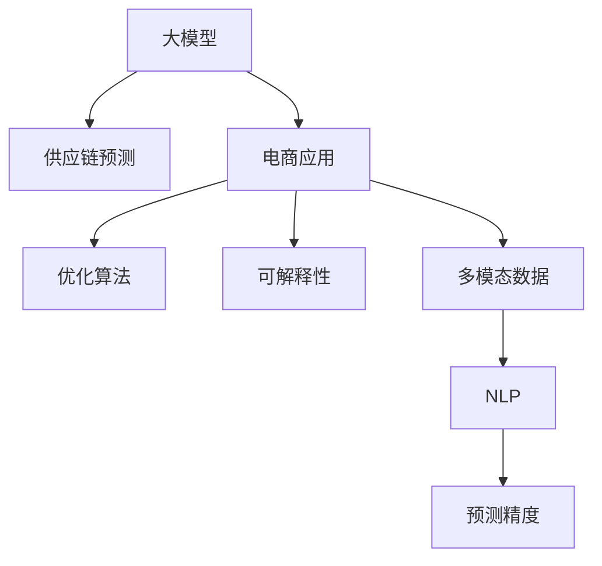

                 

# AI大模型在电商平台供应链预测中的应用

> 关键词：大模型,供应链预测,电商,优化算法,可解释性,多模态数据,自然语言处理(NLP)

## 1. 背景介绍

### 1.1 问题由来

随着电商平台的快速发展，商家对于供应链预测的需求愈发强烈。精准的供应链预测能够帮助商家优化库存管理，减少缺货或库存积压现象，提高运营效率。然而，传统的基于统计模型和历史数据的供应链预测方法在面对复杂多变的环境时往往显得力不从心。近年来，随着深度学习技术的崛起，基于大模型的供应链预测方法逐渐成为研究热点。本文将探讨如何利用大模型，特别是预训练语言模型，进行电商平台供应链预测，并分析其优缺点。

### 1.2 问题核心关键点

- **大模型**：如BERT、GPT等预训练语言模型，在无标签文本数据上预训练得到丰富的语言知识。
- **供应链预测**：预测商品需求量、库存水平、销售周期等，优化供应链管理。
- **电商应用**：应用于电商平台，实现需求预测、库存优化、订单分配等功能。
- **优化算法**：通过大模型进行预测，优化供应链管理决策。
- **可解释性**：大模型的输出需要具备一定的可解释性，以提高决策的透明度和可靠性。
- **多模态数据**：结合商品属性、销售记录、用户评论等多维数据，提高预测精度。
- **自然语言处理(NLP)**：利用NLP技术进行文本数据的处理和分析，提高预测准确度。

这些核心概念之间存在着紧密的联系，共同构成了利用大模型进行电商平台供应链预测的技术框架。

## 2. 核心概念与联系

### 2.1 核心概念概述

#### 2.1.1 大模型

大模型指通过在大规模无标签文本数据上预训练得到的语言模型。这些模型通常具备强大的语言理解和生成能力，能够在预训练的基础上通过微调进行任务适配，从而完成特定的预测任务。

#### 2.1.2 供应链预测

供应链预测旨在通过历史销售数据、市场需求变化等，预测未来的商品需求量、库存水平、销售周期等信息，以指导供应链的优化决策。

#### 2.1.3 电商应用

电商平台利用供应链预测技术，实现库存管理、需求预测、订单分配等操作，提高运营效率和用户体验。

#### 2.1.4 优化算法

优化算法用于调整供应链的库存、生产、配送等决策，以实现最优的运营效果。大模型可以通过预测未来需求和库存水平，辅助优化算法的决策。

#### 2.1.5 可解释性

可解释性指模型输出的结果需要具备一定的解释能力，以确保预测结果的可靠性和透明度。这对于电商平台的供应链决策尤为重要。

#### 2.1.6 多模态数据

多模态数据是指融合了文本、图片、视频等多类型数据的信息，通过这些多维信息，可以更全面地了解市场动态，提高预测精度。

#### 2.1.7 自然语言处理(NLP)

NLP技术用于处理和分析文本数据，如情感分析、实体识别等，有助于从文本数据中提取有价值的信息，辅助预测决策。

这些概念之间的逻辑关系可以通过以下Mermaid流程图来展示：



这个流程图展示了大模型在电商平台供应链预测中的关键角色，以及各概念之间的相互联系。

## 3. 核心算法原理 & 具体操作步骤

### 3.1 算法原理概述

基于大模型的供应链预测方法，一般分为两个步骤：

1. **预训练**：在大规模无标签文本数据上训练大模型，使其学习到通用的语言表示和模式。
2. **微调**：在具体的电商销售数据上微调大模型，使其能够针对特定任务进行预测。

这种预训练-微调的方法，能够在大数据和复杂任务的指导下，提高预测的精度和泛化能力。

### 3.2 算法步骤详解

#### 3.2.1 数据预处理

1. **数据收集**：收集电商平台的销售数据、用户评论、商品属性等信息。
2. **数据清洗**：处理缺失值、异常值，确保数据质量。
3. **数据归一化**：将数据转换为标准格式，便于模型处理。
4. **数据分割**：将数据集分为训练集、验证集和测试集。

#### 3.2.2 模型预训练

1. **选择模型**：选择合适的预训练模型，如BERT、GPT等。
2. **加载模型**：使用模型的预训练权重。
3. **数据输入**：将数据输入模型进行预训练。
4. **模型保存**：保存预训练后的模型参数。

#### 3.2.3 模型微调

1. **任务适配**：设计合适的输出层和损失函数，适配供应链预测任务。
2. **微调参数**：使用电商销售数据微调模型，更新模型参数。
3. **验证评估**：在验证集上评估模型性能，确保模型泛化能力。
4. **模型测试**：在测试集上测试模型性能，输出预测结果。

#### 3.2.4 结果分析

1. **结果可视化**：通过图表展示预测结果。
2. **结果分析**：分析预测结果的误差来源，优化模型。
3. **结果应用**：将预测结果应用于库存管理、订单分配等操作。

### 3.3 算法优缺点

#### 3.3.1 优点

1. **预测精度高**：大模型具备强大的语言理解能力和模式识别能力，能够在复杂的市场环境中进行精准预测。
2. **泛化能力强**：预训练使得模型能够更好地泛化到新的数据和场景。
3. **可解释性强**：通过NLP技术，可以解释模型预测结果的来源，提高决策的透明度和可靠性。
4. **适应性强**：模型能够适应多种电商平台的供应链需求，具备较好的通用性。

#### 3.3.2 缺点

1. **计算资源消耗大**：预训练和微调模型需要大量的计算资源和存储空间。
2. **模型复杂度高**：大模型结构复杂，训练和推理过程较为耗时。
3. **数据依赖性强**：模型的性能依赖于高质量的标注数据和数据量，数据不足时预测精度下降。
4. **模型解释性不足**：尽管有NLP技术的辅助，模型输出的解释仍有限。

### 3.4 算法应用领域

基于大模型的供应链预测方法，主要应用于电商平台的库存管理、需求预测、订单分配等场景。具体应用如下：

1. **库存管理**：根据预测结果，优化库存水平，减少缺货和库存积压。
2. **需求预测**：预测商品未来的需求量，帮助商家进行生产和采购规划。
3. **订单分配**：根据预测结果，合理分配订单，优化物流和配送。
4. **客户服务**：根据用户评论和反馈，预测客户需求，提供个性化服务。

这些应用场景使得大模型在电商平台供应链预测中发挥了重要作用。

## 4. 数学模型和公式 & 详细讲解 & 举例说明

### 4.1 数学模型构建

假设电商平台销售数据集为 $D=\{(x_i,y_i)\}_{i=1}^N$，其中 $x_i$ 为商品特征向量，$y_i$ 为销售数量。供应链预测任务的目标是训练一个模型 $M_{\theta}$，使得模型能够根据商品特征 $x_i$ 预测销售数量 $y_i$。模型训练过程可以表示为：

$$
\theta^* = \mathop{\arg\min}_{\theta} \frac{1}{N} \sum_{i=1}^N \ell(M_{\theta}(x_i),y_i)
$$

其中，$\ell$ 为损失函数，常用的有均方误差损失（MSE）、平均绝对误差损失（MAE）等。

### 4.2 公式推导过程

以均方误差损失为例，假设模型预测值为 $\hat{y}=M_{\theta}(x_i)$，则损失函数可以表示为：

$$
\ell(M_{\theta}(x_i),y_i) = \frac{1}{2}(y_i - \hat{y})^2
$$

将损失函数带入优化目标，得：

$$
\theta^* = \mathop{\arg\min}_{\theta} \frac{1}{N} \sum_{i=1}^N \frac{1}{2}(y_i - \hat{y})^2
$$

利用梯度下降算法，求解上述优化问题。模型的梯度可以表示为：

$$
\nabla_{\theta} \ell(M_{\theta}(x_i),y_i) = (y_i - \hat{y}) \cdot \nabla_{\theta} \hat{y}
$$

其中，$\nabla_{\theta} \hat{y}$ 为模型输出对参数 $\theta$ 的梯度。

### 4.3 案例分析与讲解

以某电商平台的数据为例，预测商品在未来一周的销售量。首先，收集商品的销售数据、用户评论、商品属性等，进行数据清洗和归一化。然后，将数据分为训练集、验证集和测试集，进行模型预训练和微调。

具体步骤如下：

1. **数据预处理**：收集商品销售数据、用户评论、商品属性等，清洗异常值和缺失值，进行归一化处理。
2. **模型预训练**：选择BERT模型，加载预训练权重，使用电商数据进行预训练。
3. **模型微调**：设计输出层和损失函数，使用电商销售数据微调模型。
4. **验证评估**：在验证集上评估模型性能，调整模型参数。
5. **模型测试**：在测试集上测试模型性能，输出预测结果。

## 5. 项目实践：代码实例和详细解释说明

### 5.1 开发环境搭建

在进行项目实践前，需要准备开发环境：

1. **安装Python**：使用Anaconda安装Python，创建虚拟环境。
2. **安装依赖包**：安装PyTorch、TensorFlow等深度学习框架，以及相关的库和工具。
3. **数据准备**：收集和准备电商平台的数据，进行预处理和分割。
4. **模型搭建**：选择合适的预训练模型，加载预训练权重，搭建模型架构。
5. **训练模型**：进行模型预训练和微调，训练模型参数。
6. **模型评估**：在验证集上评估模型性能，优化模型参数。
7. **模型测试**：在测试集上测试模型性能，输出预测结果。

### 5.2 源代码详细实现

以下是利用BERT模型进行电商供应链预测的Python代码实现：

```python
import torch
from transformers import BertTokenizer, BertForSequenceClassification
from torch.utils.data import DataLoader
from sklearn.metrics import mean_squared_error

# 初始化模型和tokenizer
model = BertForSequenceClassification.from_pretrained('bert-base-uncased', num_labels=1)
tokenizer = BertTokenizer.from_pretrained('bert-base-uncased')

# 数据预处理
def preprocess_data(data):
    # 将数据转换为token ids和attention mask
    encoded_input = tokenizer.encode_plus(data, add_special_tokens=True, max_length=128, padding='max_length', return_tensors='pt')
    return encoded_input['input_ids'], encoded_input['attention_mask']

# 模型微调
def fine_tune_model(model, train_loader, optimizer, device):
    model.to(device)
    model.train()
    for epoch in range(num_epochs):
        for batch in train_loader:
            input_ids, attention_mask = batch['input_ids'].to(device), batch['attention_mask'].to(device)
            labels = batch['labels'].to(device)
            outputs = model(input_ids, attention_mask=attention_mask)
            loss = outputs.loss
            optimizer.zero_grad()
            loss.backward()
            optimizer.step()

# 模型评估
def evaluate_model(model, val_loader, device):
    model.eval()
    mse = 0
    for batch in val_loader:
        input_ids, attention_mask = batch['input_ids'].to(device), batch['attention_mask'].to(device)
        with torch.no_grad():
            outputs = model(input_ids, attention_mask=attention_mask)
            mse += mean_squared_error(batch['labels'], outputs.predictions).item()
    return mse / len(val_loader)

# 模型测试
def test_model(model, test_loader, device):
    model.eval()
    mse = 0
    for batch in test_loader:
        input_ids, attention_mask = batch['input_ids'].to(device), batch['attention_mask'].to(device)
        with torch.no_grad():
            outputs = model(input_ids, attention_mask=attention_mask)
            mse += mean_squared_error(batch['labels'], outputs.predictions).item()
    return mse / len(test_loader)

# 主函数
if __name__ == '__main__':
    # 设置超参数
    num_epochs = 10
    batch_size = 32
    learning_rate = 2e-5
    device = torch.device('cuda' if torch.cuda.is_available() else 'cpu')

    # 加载数据集
    train_data = ...
    val_data = ...
    test_data = ...

    # 创建数据加载器
    train_loader = DataLoader(train_data, batch_size=batch_size, shuffle=True)
    val_loader = DataLoader(val_data, batch_size=batch_size, shuffle=False)
    test_loader = DataLoader(test_data, batch_size=batch_size, shuffle=False)

    # 初始化模型和优化器
    optimizer = torch.optim.Adam(model.parameters(), lr=learning_rate)

    # 进行模型预训练和微调
    for epoch in range(num_epochs):
        fine_tune_model(model, train_loader, optimizer, device)

    # 在验证集上评估模型性能
    mse_val = evaluate_model(model, val_loader, device)
    print(f'Validation MSE: {mse_val}')

    # 在测试集上测试模型性能
    mse_test = test_model(model, test_loader, device)
    print(f'Test MSE: {mse_test}')
```

### 5.3 代码解读与分析

上述代码实现了使用BERT模型进行电商平台供应链预测的完整流程，包括数据预处理、模型微调、模型评估和模型测试。

1. **数据预处理**：通过`preprocess_data`函数将原始数据转换为模型所需的token ids和attention mask。
2. **模型微调**：在`fine_tune_model`函数中，使用电商数据微调BERT模型，更新模型参数。
3. **模型评估**：在`evaluate_model`函数中，使用验证集评估模型性能，计算均方误差。
4. **模型测试**：在`test_model`函数中，使用测试集测试模型性能，计算均方误差。
5. **主函数**：设置超参数，加载数据集，初始化模型和优化器，进行模型预训练和微调，在验证集和测试集上评估模型性能。

通过上述代码，可以清晰地看到大模型在电商平台供应链预测中的应用流程，理解每个步骤的具体实现。

## 6. 实际应用场景

### 6.1 智能库存管理

电商平台可以利用大模型预测商品未来的销售量，优化库存水平。通过预测销售量，商家可以合理地安排采购和生产计划，避免缺货和库存积压，提高运营效率。

### 6.2 需求预测与定制化推荐

大模型可以根据用户评论和反馈，预测用户未来的购买需求，提供个性化的商品推荐。商家可以通过定制化推荐，提升用户满意度和购物体验，增加销售额。

### 6.3 物流优化

大模型可以预测商品的销售周期和运输时间，优化物流和配送路径。通过预测销售高峰期，商家可以提前准备货物，减少物流成本和配送时间。

### 6.4 未来应用展望

未来，基于大模型的供应链预测技术将有以下几个发展趋势：

1. **多模态融合**：结合商品属性、销售记录、用户评论等多维数据，提高预测精度。
2. **可解释性增强**：通过NLP技术，增强模型输出的可解释性，提高决策透明度。
3. **自适应学习**：利用在线学习技术，实时更新模型参数，保持预测模型的时效性和准确性。
4. **分布式计算**：利用分布式计算技术，加速模型训练和推理过程，提高计算效率。

## 7. 工具和资源推荐

### 7.1 学习资源推荐

1. **《Transformer from Scratch》**：由深度学习专家Vlad Niculae撰写，详细介绍大模型的原理和实践，适合入门学习。
2. **《NLP from the Ground Up》**：由斯坦福大学Ling实验室的Tommi Jaakkola等人撰写，系统讲解NLP基础知识，包括语言模型、序列标注、情感分析等。
3. **Kaggle竞赛**：参加Kaggle上的供应链预测竞赛，实践并学习大模型的应用。
4. **arXiv论文**：阅读最新的大模型供应链预测论文，了解前沿研究方向。

### 7.2 开发工具推荐

1. **PyTorch**：强大的深度学习框架，支持动态计算图，适合快速迭代研究。
2. **TensorFlow**：谷歌开源的深度学习框架，易于部署和扩展，适合大规模工程应用。
3. **Transformers库**：HuggingFace开发的NLP工具库，集成了多个预训练模型，支持微调。
4. **Weights & Biases**：用于实验跟踪和可视化的工具，帮助分析模型性能和优化过程。
5. **TensorBoard**：用于可视化模型训练和推理过程的工具，提供丰富的图表展示方式。

### 7.3 相关论文推荐

1. **《Attention is All You Need》**：Transformer论文，介绍自注意力机制，奠定大模型的基础。
2. **《BERT: Pre-training of Deep Bidirectional Transformers for Language Understanding》**：BERT模型论文，介绍掩码语言模型预训练方法。
3. **《Parameter-Efficient Transfer Learning for NLP》**： Adapter等参数高效微调方法的论文，提供高效的微调范式。
4. **《Prompt-Based Fine-Tuning of Language Models for Classification and Generation》**：介绍基于Prompt的微调方法，提供更加灵活的微调思路。
5. **《AdaLoRA: Adaptive Low-Rank Adaptation for Parameter-Efficient Fine-Tuning》**：介绍自适应低秩适应的微调方法，提供更高效的微调方案。

## 8. 总结：未来发展趋势与挑战

### 8.1 研究成果总结

本文详细介绍了利用大模型进行电商平台供应链预测的方法，涵盖数据预处理、模型预训练、微调优化、结果分析等关键步骤。通过具体案例分析，展示了大模型在供应链预测中的应用，并分析了其优缺点。

### 8.2 未来发展趋势

未来，基于大模型的供应链预测技术将进一步发展，呈现出以下趋势：

1. **多模态融合**：结合多类型数据，提高预测精度。
2. **可解释性增强**：通过NLP技术，增强模型输出的可解释性。
3. **自适应学习**：实时更新模型参数，保持预测模型的时效性和准确性。
4. **分布式计算**：利用分布式计算技术，加速模型训练和推理过程。

### 8.3 面临的挑战

尽管大模型在供应链预测中展现出良好的性能，但仍面临以下挑战：

1. **计算资源消耗大**：预训练和微调模型需要大量的计算资源和存储空间。
2. **模型复杂度高**：大模型结构复杂，训练和推理过程较为耗时。
3. **数据依赖性强**：模型的性能依赖于高质量的标注数据和数据量。
4. **模型解释性不足**：尽管有NLP技术的辅助，模型输出的解释仍有限。

### 8.4 研究展望

未来，研究者需要在以下方面进行深入探索：

1. **可解释性增强**：通过NLP技术，增强模型输出的可解释性，提高决策透明度。
2. **多模态融合**：结合多类型数据，提高预测精度。
3. **自适应学习**：实时更新模型参数，保持预测模型的时效性和准确性。
4. **分布式计算**：利用分布式计算技术，加速模型训练和推理过程。

通过这些研究方向的探索，大模型在电商平台供应链预测中的应用将更加广泛和深入，为电商平台的运营优化提供强大的技术支持。

## 9. 附录：常见问题与解答

**Q1: 如何选择合适的预训练模型？**

A: 选择合适的预训练模型需要考虑多个因素，包括模型的大小、预训练任务的适用范围、数据集的规模等。一般而言，对于电商平台的供应链预测任务，可以选择BERT、GPT等大模型。

**Q2: 如何提高模型的泛化能力？**

A: 提高模型的泛化能力需要以下措施：
1. 数据增强：通过数据增强技术，丰富训练数据集。
2. 正则化：使用L2正则、Dropout等方法，防止过拟合。
3. 多模型集成：通过集成多个模型，提高泛化能力。

**Q3: 如何在电商应用中提高模型性能？**

A: 提高模型性能需要以下措施：
1. 数据质量：确保数据的准确性和完整性。
2. 特征选择：选择有意义的特征，提高模型的预测能力。
3. 模型优化：调整模型超参数，优化模型架构。

**Q4: 大模型在电商平台供应链预测中面临的主要挑战是什么？**

A: 大模型在电商平台供应链预测中面临的主要挑战包括：
1. 计算资源消耗大：预训练和微调模型需要大量的计算资源和存储空间。
2. 模型复杂度高：大模型结构复杂，训练和推理过程较为耗时。
3. 数据依赖性强：模型的性能依赖于高质量的标注数据和数据量。
4. 模型解释性不足：尽管有NLP技术的辅助，模型输出的解释仍有限。

通过以上分析和解答，相信读者能够更好地理解利用大模型进行电商平台供应链预测的方法和应用，并在实际项目中发挥大模型的优势。

