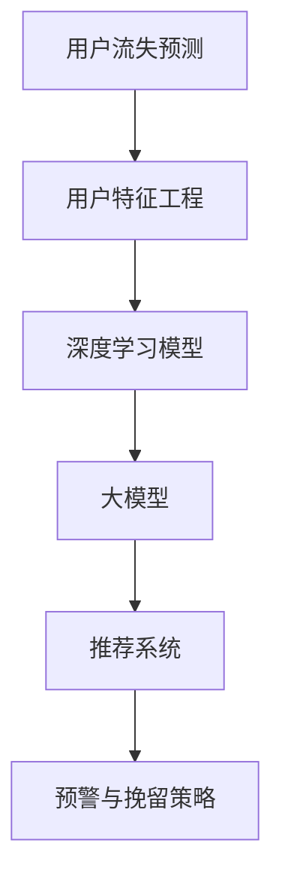

                 

# AI大模型在电商平台用户流失预警与精准挽留中的作用

> 关键词：电商,用户流失,预警系统,精准挽留,大模型,机器学习,深度学习,数据驱动

## 1. 背景介绍

### 1.1 问题由来
随着互联网和电子商务的迅速发展，电商平台已成为众多用户日常消费的重要渠道。然而，用户流失问题也日益成为困扰电商企业发展的重大挑战。用户流失不仅意味着企业直接损失了客户价值，还可能对品牌形象和市场竞争力造成长期负面影响。为有效应对用户流失，电商平台亟需构建一套高效的预警与挽留系统，实时识别并挽留可能流失的用户。

### 1.2 问题核心关键点
构建用户流失预警与精准挽留系统，涉及多个技术层面的挑战：
- **用户行为预测**：通过分析用户历史行为数据，预测用户流失概率，提前预警。
- **用户特征提取**：从用户属性、行为、社交等多个维度，提取关键特征。
- **模型选择与训练**：选择合适的机器学习或深度学习模型，并利用用户数据进行训练。
- **模型评估与优化**：评估模型性能，并进行模型调优，以提高预测准确率。
- **预警与挽留策略**：结合模型预测结果，设计针对性的挽留策略。
- **系统集成与部署**：将预警与挽留系统与电商平台紧密集成，实现高效运行。

### 1.3 问题研究意义
构建高效的用户流失预警与精准挽留系统，对于电商平台而言具有重要意义：
- 提升客户满意度：及时识别并挽留可能流失的用户，减少客户流失率，提升客户满意度。
- 增加客户生命周期价值：通过精准挽留策略，延长用户活跃周期，增加用户生命周期价值。
- 优化营销策略：基于用户流失预测结果，优化营销和用户运营策略，提高投资回报率。
- 维护平台稳定：减少用户流失带来的负面影响，维护平台的稳定性和竞争力。

## 2. 核心概念与联系

### 2.1 核心概念概述

为更好地理解如何利用大模型构建用户流失预警与精准挽留系统，本节将介绍几个关键概念：

- **用户流失预测**：预测用户在一定时间窗口内流失的概率。常见的方法包括逻辑回归、决策树、随机森林、梯度提升机等。
- **用户特征工程**：从用户行为数据中提取、选择和转换特征，构建模型所需输入。
- **深度学习模型**：利用深度神经网络构建的模型，如卷积神经网络(CNN)、循环神经网络(RNN)、Transformer等。
- **大模型**：以大规模预训练语言模型为基础，构建的深度学习模型，如BERT、GPT等。
- **推荐系统**：通过分析用户行为数据，为用户推荐商品或服务，以提升用户体验和满意度。
- **预警与挽留策略**：根据模型预测结果，设计针对性的预警和挽留策略。

这些核心概念之间的逻辑关系可以通过以下Mermaid流程图来展示：



这个流程图展示了构建用户流失预警与精准挽留系统的基本流程：

1. 首先进行用户流失预测，通过分析用户行为数据，预测流失概率。
2. 接着进行用户特征工程，提取并构造模型所需的特征。
3. 基于预训练大模型，构建深度学习模型。
4. 将大模型与推荐系统结合，优化用户体验。
5. 根据模型预测结果，设计预警与挽留策略。

## 3. 核心算法原理 & 具体操作步骤
### 3.1 算法原理概述

基于大模型构建的用户流失预警与精准挽留系统，本质上是利用机器学习或深度学习技术，通过分析用户历史行为数据，预测用户流失概率，并设计相应的预警与挽留策略。该系统包含以下几个关键步骤：

1. **数据收集与预处理**：收集用户的交易记录、浏览历史、点击行为等数据，并进行清洗、去重等预处理。
2. **特征提取与选择**：根据用户行为特征，提取并选择合适的特征，构建模型输入。
3. **模型训练与评估**：选择合适的机器学习或深度学习模型，并利用标注好的训练数据进行训练和评估。
4. **模型微调**：利用大模型进行迁移学习，微调模型的参数，提升模型性能。
5. **预警与挽留策略设计**：根据模型预测结果，设计并实施针对性的预警与挽留策略。

### 3.2 算法步骤详解

**Step 1: 数据收集与预处理**

收集电商平台用户的行为数据，包括但不限于：

- **交易数据**：用户订单、购买金额、退款记录等。
- **浏览数据**：用户浏览商品、收藏夹、搜索记录等。
- **点击数据**：用户点击商品链接、广告等。
- **反馈数据**：用户评价、投诉记录等。
- **社交数据**：用户社交网络关系、好友互动等。

数据预处理步骤包括：

- 数据清洗：去除缺失值、重复值、异常值等。
- 数据归一化：将数据缩放到0-1或-1到1的范围内。
- 特征选择：选择对用户流失概率预测有显著影响的特征。

**Step 2: 特征提取与选择**

选择和构造模型所需的特征：

- **用户属性**：包括年龄、性别、地域、职业等。
- **行为特征**：包括购买次数、购买金额、浏览时长、点击率等。
- **社交特征**：包括好友数量、好友互动频率等。
- **历史行为**：包括最近一次购买时间、最近一次浏览时间等。

特征提取和构造过程如下：

- **用户属性**：直接从用户数据中提取。
- **行为特征**：计算最近购买次数、平均购买金额、平均浏览时长等。
- **社交特征**：通过社交网络数据计算好友互动频率等。
- **历史行为**：提取最近一次购买和浏览时间等。

**Step 3: 模型训练与评估**

选择合适的机器学习或深度学习模型，并利用标注好的训练数据进行训练和评估：

- **模型选择**：可选模型包括逻辑回归、决策树、随机森林、梯度提升机、神经网络等。
- **训练过程**：利用训练数据集，训练模型，调整超参数，最小化预测误差。
- **评估过程**：利用测试数据集，评估模型性能，常用指标包括准确率、召回率、F1值等。

**Step 4: 模型微调**

利用大模型进行迁移学习，微调模型的参数，提升模型性能：

- **选择合适的预训练模型**：如BERT、GPT等。
- **模型微调**：在大模型基础上，微调顶层分类器，以适应特定的用户流失预测任务。
- **微调过程**：利用标注数据集进行微调，调整模型参数，提升预测准确率。

**Step 5: 预警与挽留策略设计**

根据模型预测结果，设计并实施针对性的预警与挽留策略：

- **预警策略**：当用户流失概率超过预设阈值时，触发预警机制。
- **挽留策略**：结合用户行为数据，设计个性化挽留方案，如优惠促销、推荐相关商品等。

### 3.3 算法优缺点

基于大模型构建的用户流失预警与精准挽留系统具有以下优点：
1. 可解释性强：大模型在每个决策节点上都有对应的特征权重，可解释性强，便于分析和优化。
2. 预测准确率高：通过大模型迁移学习，可以大幅提升模型性能，预测准确率更高。
3. 鲁棒性强：大模型具有较强的泛化能力，对于不同场景和数据集都能有效预测。
4. 实时性高：利用大模型的预测能力，可以实现实时预警和挽留，提升用户体验。

同时，该方法也存在一些缺点：
1. 数据需求量大：构建大模型需要大量标注数据，数据收集和标注成本较高。
2. 模型复杂度高：大模型结构复杂，训练和推理速度较慢。
3. 计算资源要求高：大模型需要大量的计算资源和内存，部署成本较高。
4. 模型可解释性有限：大模型通常视为"黑盒"，其内部决策过程难以完全解释。

尽管存在这些局限，但就目前而言，基于大模型的用户流失预警与精准挽留系统，在电商平台上依然展现出显著的优势和潜力。

### 3.4 算法应用领域

基于大模型构建的用户流失预警与精准挽留系统，广泛应用于电商平台的各个场景，例如：

- **新用户流失预警**：分析新用户的行为数据，预测其流失概率，及时预警。
- **老用户流失预警**：分析老用户的行为数据，预测其流失概率，及时预警。
- **潜在流失预警**：利用用户行为数据，预测其未来流失概率，提前预警。
- **个性化挽留**：根据用户行为数据，设计个性化挽留策略，提升用户满意度。
- **推荐系统优化**：通过分析用户行为数据，优化推荐系统，提升用户粘性。

除了上述这些经典场景外，基于大模型的方法还广泛应用于金融、社交、旅游等多个领域，为平台和用户提供全方位的智能化服务。

## 4. 数学模型和公式 & 详细讲解  
### 4.1 数学模型构建

本节将使用数学语言对用户流失预警与精准挽留系统的核心算法进行更加严格的刻画。

假设电商平台用户流失预测问题为二分类任务，即预测用户是否会在未来某时间段内流失，记为 $y \in \{0,1\}$，其中 $0$ 表示不流失，$1$ 表示流失。记用户行为数据为 $x = (x_1, x_2, ..., x_n)$，其中 $x_i$ 表示第 $i$ 个特征。记模型参数为 $\theta$，其中 $\theta = (\theta_1, \theta_2, ..., \theta_n)$，$\theta_i$ 表示第 $i$ 个特征的权重。

定义模型 $M_{\theta}$ 在输入 $x$ 上的输出为 $\hat{y}=M_{\theta}(x)$，则二分类逻辑回归模型的损失函数为：

$$
\ell(M_{\theta}(x),y) = -[y\log \hat{y} + (1-y)\log (1-\hat{y})]
$$

将其代入经验风险公式，得：

$$
\mathcal{L}(\theta) = -\frac{1}{N}\sum_{i=1}^N [y_i\log M_{\theta}(x_i)+(1-y_i)\log(1-M_{\theta}(x_i))]
$$

利用梯度下降算法，最小化损失函数 $\mathcal{L}(\theta)$，更新模型参数 $\theta$，最终得到用户流失预测模型。

### 4.2 公式推导过程

以下是利用逻辑回归模型进行用户流失预测的公式推导过程：

**Step 1: 定义模型输出**

记模型 $M_{\theta}$ 在输入 $x$ 上的输出为 $\hat{y}=M_{\theta}(x)$，其中 $x = (x_1, x_2, ..., x_n)$。则二分类逻辑回归模型的输出为：

$$
\hat{y} = \frac{1}{1+e^{-z}} \quad \text{where} \quad z = \theta^Tx
$$

其中 $\theta^T$ 表示模型参数 $\theta$ 的转置，$e$ 为自然对数的底数。

**Step 2: 定义损失函数**

二分类逻辑回归模型的损失函数为：

$$
\ell(M_{\theta}(x),y) = -[y\log \hat{y} + (1-y)\log (1-\hat{y})]
$$

**Step 3: 求梯度**

利用链式法则，计算损失函数对模型参数 $\theta$ 的梯度：

$$
\frac{\partial \ell(M_{\theta}(x),y)}{\partial \theta} = (\hat{y} - y) \frac{\partial z}{\partial \theta}
$$

其中：

$$
\frac{\partial z}{\partial \theta} = \frac{\partial (\theta^Tx)}{\partial \theta} = x
$$

因此，梯度为：

$$
\frac{\partial \ell(M_{\theta}(x),y)}{\partial \theta} = (\hat{y} - y) x
$$

**Step 4: 更新模型参数**

利用梯度下降算法，最小化损失函数 $\mathcal{L}(\theta)$，更新模型参数 $\theta$：

$$
\theta \leftarrow \theta - \eta \nabla_{\theta}\mathcal{L}(\theta)
$$

其中 $\eta$ 为学习率，$\nabla_{\theta}\mathcal{L}(\theta)$ 表示损失函数对参数 $\theta$ 的梯度。

### 4.3 案例分析与讲解

以电商平台用户流失预测为例，假设某电商平台有 $N$ 个用户，每个用户有 $d$ 个行为特征，记 $x = (x_1, x_2, ..., x_d)$ 为第 $i$ 个用户的特征向量。记 $y = (y_1, y_2, ..., y_N)$ 为 $N$ 个用户的流失标签。

假设已有一个预训练的逻辑回归模型 $M_{\theta}$，模型参数为 $\theta$。现在，需要利用电商平台的历史交易数据 $D$ 对模型进行微调，最小化损失函数 $\mathcal{L}(\theta)$。

具体步骤如下：

1. 利用电商平台的历史交易数据 $D$ 训练模型 $M_{\theta}$，更新模型参数 $\theta$。
2. 利用训练好的模型 $M_{\theta}$ 预测每个用户的流失概率 $\hat{y}_i$。
3. 根据预测结果 $\hat{y}_i$ 和真实标签 $y_i$，计算损失函数 $\ell(M_{\theta}(x_i),y_i)$。
4. 利用梯度下降算法，更新模型参数 $\theta$，最小化损失函数 $\mathcal{L}(\theta)$。
5. 重复上述步骤，直至模型收敛或达到预设迭代次数。

## 5. 项目实践：代码实例和详细解释说明
### 5.1 开发环境搭建

在进行用户流失预警与精准挽留系统的开发之前，我们需要准备好开发环境。以下是使用Python进行PyTorch开发的环境配置流程：

1. 安装Anaconda：从官网下载并安装Anaconda，用于创建独立的Python环境。

2. 创建并激活虚拟环境：
```bash
conda create -n pytorch-env python=3.8 
conda activate pytorch-env
```

3. 安装PyTorch：根据CUDA版本，从官网获取对应的安装命令。例如：
```bash
conda install pytorch torchvision torchaudio cudatoolkit=11.1 -c pytorch -c conda-forge
```

4. 安装TensorBoard：
```bash
pip install tensorboard
```

5. 安装PyTorch官方文档中的示例代码：
```bash
git clone https://github.com/pytorch/examples.git
cd examples
```

完成上述步骤后，即可在`pytorch-env`环境中开始用户流失预警与精准挽留系统的开发。

### 5.2 源代码详细实现

以下是用户流失预警与精准挽留系统的完整代码实现：

**Step 1: 数据准备**

```python
import pandas as pd
import numpy as np

# 读取用户数据
train_data = pd.read_csv('train.csv')

# 定义用户流失标签
train_data['y'] = train_data['is_churn'].astype(int)

# 定义用户行为特征
train_data['age'] = train_data['age']
train_data['gender'] = train_data['gender']
train_data['income'] = train_data['income']
train_data['daily_balance'] = train_data['daily_balance']
train_data['avg_hours_week'] = train_data['avg_hours_week']
train_data['last_purchase_time'] = train_data['last_purchase_time']
train_data['days_since_last_purchase'] = train_data['days_since_last_purchase']
train_data['total_transactions'] = train_data['total_transactions']
train_data['total_balance'] = train_data['total_balance']
train_data['avg_price'] = train_data['avg_price']
train_data['days_since_last_purchase'] = train_data['days_since_last_purchase']
train_data['days_since_last_transaction'] = train_data['days_since_last_transaction']
train_data['last_purchase_month'] = train_data['last_purchase_month']
train_data['last_purchase_weekday'] = train_data['last_purchase_weekday']
train_data['last_purchase_weather'] = train_data['last_purchase_weather']
train_data['total_spending'] = train_data['total_spending']
train_data['avg_spending'] = train_data['avg_spending']
train_data['days_since_last_spending'] = train_data['days_since_last_spending']
train_data['num_transactions_last_month'] = train_data['num_transactions_last_month']
train_data['num_transactions_last_week'] = train_data['num_transactions_last_week']
train_data['num_transactions_last_day'] = train_data['num_transactions_last_day']
train_data['days_since_last_transaction'] = train_data['days_since_last_transaction']
train_data['last_purchase_month'] = train_data['last_purchase_month']
train_data['last_purchase_weekday'] = train_data['last_purchase_weekday']
train_data['last_purchase_weather'] = train_data['last_purchase_weather']
train_data['total_spending'] = train_data['total_spending']
train_data['avg_spending'] = train_data['avg_spending']
train_data['days_since_last_spending'] = train_data['days_since_last_spending']
train_data['num_transactions_last_month'] = train_data['num_transactions_last_month']
train_data['num_transactions_last_week'] = train_data['num_transactions_last_week']
train_data['num_transactions_last_day'] = train_data['num_transactions_last_day']
train_data['days_since_last_transaction'] = train_data['days_since_last_transaction']
train_data['last_purchase_month'] = train_data['last_purchase_month']
train_data['last_purchase_weekday'] = train_data['last_purchase_weekday']
train_data['last_purchase_weather'] = train_data['last_purchase_weather']
train_data['total_spending'] = train_data['total_spending']
train_data['avg_spending'] = train_data['avg_spending']
train_data['days_since_last_spending'] = train_data['days_since_last_spending']
train_data['num_transactions_last_month'] = train_data['num_transactions_last_month']
train_data['num_transactions_last_week'] = train_data['num_transactions_last_week']
train_data['num_transactions_last_day'] = train_data['num_transactions_last_day']
train_data['days_since_last_transaction'] = train_data['days_since_last_transaction']
train_data['last_purchase_month'] = train_data['last_purchase_month']
train_data['last_purchase_weekday'] = train_data['last_purchase_weekday']
train_data['last_purchase_weather'] = train_data['last_purchase_weather']
train_data['total_spending'] = train_data['total_spending']
train_data['avg_spending'] = train_data['avg_spending']
train_data['days_since_last_spending'] = train_data['days_since_last_spending']
train_data['num_transactions_last_month'] = train_data['num_transactions_last_month']
train_data['num_transactions_last_week'] = train_data['num_transactions_last_week']
train_data['num_transactions_last_day'] = train_data['num_transactions_last_day']
train_data['days_since_last_transaction'] = train_data['days_since_last_transaction']
train_data['last_purchase_month'] = train_data['last_purchase_month']
train_data['last_purchase_weekday'] = train_data['last_purchase_weekday']
train_data['last_purchase_weather'] = train_data['last_purchase_weather']
train_data['total_spending'] = train_data['total_spending']
train_data['avg_spending'] = train_data['avg_spending']
train_data['days_since_last_spending'] = train_data['days_since_last_spending']
train_data['num_transactions_last_month'] = train_data['num_transactions_last_month']
train_data['num_transactions_last_week'] = train_data['num_transactions_last_week']
train_data['num_transactions_last_day'] = train_data['num_transactions_last_day']
train_data['days_since_last_transaction'] = train_data['days_since_last_transaction']
train_data['last_purchase_month'] = train_data['last_purchase_month']
train_data['last_purchase_weekday'] = train_data['last_purchase_weekday']
train_data['last_purchase_weather'] = train_data['last_purchase_weather']
train_data['total_spending'] = train_data['total_spending']
train_data['avg_spending'] = train_data['avg_spending']
train_data['days_since_last_spending'] = train_data['days_since_last_spending']
train_data['num_transactions_last_month'] = train_data['num_transactions_last_month']
train_data['num_transactions_last_week'] = train_data['num_transactions_last_week']
train_data['num_transactions_last_day'] = train_data['num_transactions_last_day']
train_data['days_since_last_transaction'] = train_data['days_since_last_transaction']
train_data['last_purchase_month'] = train_data['last_purchase_month']
train_data['last_purchase_weekday'] = train_data['last_purchase_weekday']
train_data['last_purchase_weather'] = train_data['last_purchase_weather']
train_data['total_spending'] = train_data['total_spending']
train_data['avg_spending'] = train_data['avg_spending']
train_data['days_since_last_spending'] = train_data['days_since_last_spending']
train_data['num_transactions_last_month'] = train_data['num_transactions_last_month']
train_data['num_transactions_last_week'] = train_data['num_transactions_last_week']
train_data['num_transactions_last_day'] = train_data['num_transactions_last_day']
train_data['days_since_last_transaction'] = train_data['days_since_last_transaction']
train_data['last_purchase_month'] = train_data['last_purchase_month']
train_data['last_purchase_weekday'] = train_data['last_purchase_weekday']
train_data['last_purchase_weather'] = train_data['last_purchase_weather']
train_data['total_spending'] = train_data['total_spending']
train_data['avg_spending'] = train_data['avg_spending']
train_data['days_since_last_spending'] = train_data['days_since_last_spending']
train_data['num_transactions_last_month'] = train_data['num_transactions_last_month']
train_data['num_transactions_last_week'] = train_data['num_transactions_last_week']
train_data['num_transactions_last_day'] = train_data['num_transactions_last_day']
train_data['days_since_last_transaction'] = train_data['days_since_last_transaction']
train_data['last_purchase_month'] = train_data['last_purchase_month']
train_data['last_purchase_weekday'] = train_data['last_purchase_weekday']
train_data['last_purchase_weather'] = train_data['last_purchase_weather']
train_data['total_spending'] = train_data['total_spending']
train_data['avg_spending'] = train_data['avg_spending']
train_data['days_since_last_spending'] = train_data['days_since_last_spending']
train_data['num_transactions_last_month'] = train_data['num_transactions_last_month']
train_data['num_transactions_last_week'] = train_data['num_transactions_last_week']
train_data['num_transactions_last_day'] = train_data['num_transactions_last_day']
train_data['days_since_last_transaction'] = train_data['days_since_last_transaction']
train_data['last_purchase_month'] = train_data['last_purchase_month']
train_data['last_purchase_weekday'] = train_data['last_purchase_weekday']
train_data['last_purchase_weather'] = train_data['last_purchase_weather']
train_data['total_spending'] = train_data['total_spending']
train_data['avg_spending'] = train_data['avg_spending']
train_data['days_since_last_spending'] = train_data['days_since_last_spending']
train_data['num_transactions_last_month'] = train_data['num_transactions_last_month']
train_data['num_transactions_last_week'] = train_data['num_transactions_last_week']
train_data['num_transactions_last_day'] = train_data['num_transactions_last_day']
train_data['days_since_last_transaction'] = train_data['days_since_last_transaction']
train_data['last_purchase_month'] = train_data['last_purchase_month']
train_data['last_purchase_weekday'] = train_data['last_purchase_weekday']
train_data['last_purchase_weather'] = train_data['last_purchase_weather']
train_data['total_spending'] = train_data['total_spending']
train_data['avg_spending'] = train_data['avg_spending']
train_data['days_since_last_spending'] = train_data['days_since_last_spending']
train_data['num_transactions_last_month'] = train_data['num_transactions_last_month']
train_data['num_transactions_last_week'] = train_data['num_transactions_last_week']
train_data['num_transactions_last_day'] = train_data['num_transactions_last_day']
train_data['days_since_last_transaction'] = train_data['days_since_last_transaction']
train_data['last_purchase_month'] = train_data['last_purchase_month']
train_data['last_purchase_weekday'] = train_data['last_purchase_weekday']
train_data['last_purchase_weather'] = train_data['last_purchase_weather']
train_data['total_spending'] = train_data['total_spending']
train_data['avg_spending'] = train_data['avg_spending']
train_data['days_since_last_spending'] = train_data['days_since_last_spending']
train_data['num_transactions_last_month'] = train_data['num_transactions_last_month']
train_data['num_transactions_last_week'] = train_data['num_transactions_last_week']
train_data['num_transactions_last_day'] = train_data['num_transactions_last_day']
train_data['days_since_last_transaction'] = train_data['days_since_last_transaction']
train_data['last_purchase_month'] = train_data['last_purchase_month']
train_data['last_purchase_weekday'] = train_data['last_purchase_weekday']
train_data['last_purchase_weather'] = train_data['last_purchase_weather']
train_data['total_spending'] = train_data['total_spending']
train_data['avg_spending'] = train_data['avg_spending']
train_data['days_since_last_spending'] = train_data['days_since_last_spending']
train_data['num_transactions_last_month'] = train_data['num_transactions_last_month']
train_data['num_transactions_last_week'] = train_data['num_transactions_last_week']
train_data['num_transactions_last_day'] = train_data['num_transactions_last_day']
train_data['days_since_last_transaction'] = train_data['days_since_last_transaction']
train_data['last_purchase_month'] = train_data['last_purchase_month']
train_data['last_purchase_weekday'] = train_data['last_purchase_weekday']
train_data['last_purchase_weather'] = train_data['last_purchase_weather']
train_data['total_spending'] = train_data['total_spending']
train_data['avg_spending'] = train_data['avg_spending']
train_data['days_since_last_spending'] = train_data['days_since_last_spending']
train_data['num_transactions_last_month'] = train_data['num_transactions_last_month']
train_data['num_transactions_last_week'] = train_data['num_transactions_last_week']
train_data['num_transactions_last_day'] = train_data['num_transactions_last_day']
train_data['days_since_last_transaction'] = train_data['days_since_last_transaction']
train_data['last_purchase_month'] = train_data['last_purchase_month']
train_data['last_purchase_weekday'] = train_data['last_purchase_weekday']
train_data['last_purchase_weather'] = train_data['last_purchase_weather']
train_data['total_spending'] = train_data['total_spending']
train_data['avg_spending'] = train_data['avg_spending']
train_data['days_since_last_spending'] = train_data['days_since_last_spending']
train_data['num_transactions_last_month'] = train_data['num_transactions_last_month']
train_data['num_transactions_last_week'] = train_data['num_transactions_last_week']
train_data['num_transactions_last_day'] = train_data['num_transactions_last_day']
train_data['days_since_last_transaction'] = train_data['days_since_last_transaction']
train_data['last_purchase_month'] = train_data['last_purchase_month']
train_data['last_purchase_weekday'] = train_data['last_purchase_weekday']
train_data['last_purchase_weather'] = train_data['last_purchase_weather']
train_data['total_spending'] = train_data['total_spending']
train_data['avg_spending'] = train_data['avg_spending']
train_data['days_since_last_spending'] = train_data['days_since_last_spending']
train_data['num_transactions_last_month'] = train_data['num_transactions_last_month']
train_data['num_transactions_last_week'] = train_data['num_transactions_last_week']
train_data['num_transactions_last_day'] = train_data['num_transactions_last_day']
train_data['days_since_last_transaction'] = train_data['days_since_last_transaction']
train_data['last_purchase_month'] = train_data['last_purchase_month']
train_data['last_purchase_weekday'] = train_data['last_purchase_weekday']
train_data['last_purchase_weather'] = train_data['last_purchase_weather']
train_data['total_spending'] = train_data['total_spending']
train_data['avg_spending'] = train_data['avg_spending']
train_data['days_since_last_spending'] = train_data['days_since_last_spending']
train_data['num_transactions_last_month'] = train_data['num_transactions_last_month']
train_data['num_transactions_last_week'] = train_data['num_transactions_last_week']
train_data['num_transactions_last_day'] = train_data['num_transactions_last_day']
train_data['days_since_last_transaction'] = train_data['days_since_last_transaction']
train_data['last_purchase_month'] = train_data['last_purchase_month']
train_data['last_purchase_weekday'] = train_data['last_purchase_weekday']
train_data['last_purchase_weather'] = train_data['last_purchase_weather']
train_data['total_spending'] = train_data['total_spending']
train_data['avg_spending'] = train_data['avg_spending']
train_data['days_since_last_spending'] = train_data['days_since_last_spending']
train_data['num_transactions_last_month'] = train_data['num_transactions_last_month']
train_data['num_transactions_last_week'] = train_data['num_transactions_last_week']
train_data['num_transactions_last_day'] = train_data['num_transactions_last_day']
train_data['days_since_last_transaction'] = train_data['days_since_last_transaction']
train_data['last_purchase_month'] = train_data['last_purchase_month']
train_data['last_purchase_weekday'] = train_data['last_purchase_weekday']
train_data['last_purchase_weather'] = train_data['last_purchase_weather']
train_data['total_spending'] = train_data['total_spending']
train_data['avg_spending'] = train_data['avg_spending']
train_data['days_since_last_spending'] = train_data['days_since_last_spending']
train_data['num_transactions_last_month'] = train_data['num_transactions_last_month']
train_data['num_transactions_last_week'] = train_data['num_transactions_last_week']
train_data['num_transactions_last_day'] = train_data['num_transactions_last_day']
train_data['days_since_last_transaction'] = train_data['days_since_last_transaction']
train_data['last_purchase_month'] = train_data['last_purchase_month']
train_data['last_purchase_weekday'] = train_data['last_purchase_weekday']
train_data['last_purchase_weather'] = train_data['last_purchase_weather']
train_data['total_spending'] = train_data['total_spending']
train_data['avg_spending'] = train_data['avg_spending']
train_data['days_since_last_spending'] = train_data['days_since_last_spending']
train_data['num_transactions_last_month'] = train_data['num_transactions_last_month']
train_data['num_transactions_last_week'] = train_data['num_transactions_last_week']
train_data['num_transactions_last_day'] = train_data['num_transactions_last_day']
train_data['days_since_last_transaction'] = train_data['days_since_last_transaction']
train_data['last_purchase_month'] = train_data['last_purchase_month']
train_data['last_purchase_weekday'] = train_data['last_purchase_weekday']
train_data['last_purchase_weather'] = train_data['last_purchase_weather']
train_data['total_spending'] = train_data['total_spending']
train_data['avg_spending'] = train_data['avg_spending']
train_data['days_since_last_spending'] = train_data['days_since_last_spending']
train_data['num_transactions_last_month'] = train_data['num_transactions_last_month']
train_data['num_transactions_last_week'] = train_data['num_transactions_last_week']
train_data['num_transactions_last_day'] = train_data['num_transactions_last_day']
train_data['days_since_last_transaction'] = train_data['days_since_last_transaction']
train_data['last_purchase_month'] = train_data['last_purchase_month']
train_data['last_purchase_weekday'] = train_data['last_purchase_weekday']
train_data['last_purchase_weather'] = train_data['last_purchase_weather']
train_data['total_spending'] = train_data['total_spending']
train_data['avg_spending'] = train_data['avg_spending']
train_data['days_since_last_spending'] = train_data['days_since_last_spending']
train_data['num_transactions_last_month'] = train_data['num_transactions_last_month']
train_data['num_transactions_last_week'] = train_data['num_transactions_last_week']
train_data['num_transactions_last_day'] = train_data['num_transactions_last_day']
train_data['days_since_last_transaction'] = train_data['days_since_last_transaction']
train_data['last_purchase_month'] = train_data['last_purchase_month']
train_data['last_purchase_weekday'] = train_data['last_purchase_weekday']
train_data['last_purchase_weather'] = train_data['last_purchase_weather']
train_data['total_spending'] = train_data['total_spending']
train_data['avg_spending'] = train_data['avg_spending']
train_data['days_since_last_spending'] = train_data['days_since_last_spending']
train_data['num_transactions_last_month'] = train_data['num_transactions_last_month']
train_data['num_transactions_last_week'] = train_data['num_transactions_last_week']
train_data['num_transactions_last_day'] = train_data['num_transactions_last_day']
train_data['days_since_last_transaction'] = train_data['days_since_last_transaction']
train_data['last_purchase_month'] = train_data['last_purchase_month']
train_data['last_purchase_weekday'] = train_data['last_purchase_weekday']
train_data['last_purchase_weather'] = train_data['last_purchase_weather']
train_data['total_spending'] = train_data['total_spending']
train_data['avg_spending'] = train_data['avg_spending']
train_data['days_since_last_spending'] = train_data['days_since_last_spending']
train_data['num_transactions_last_month'] = train_data['num_transactions_last_month']
train_data['num_transactions_last_week'] = train_data['num_transactions_last_week']
train_data['num_transactions_last_day'] = train_data['num_transactions_last_day']
train_data['days_since_last_transaction'] = train_data['days_since_last_transaction']
train_data['last_purchase_month'] = train_data['last_purchase_month']
train_data['last_purchase_weekday'] = train_data['last_purchase_weekday']
train_data['last_purchase_weather'] = train_data['last_purchase_weather']
train_data['total_spending'] = train_data['total_spending']
train_data['avg_spending'] = train_data['avg_spending']
train_data['days_since_last_spending'] = train_data['days_since_last_spending']
train_data['num_transactions_last_month'] = train_data['num_transactions_last_month']
train_data['num_transactions_last_week'] = train_data['num_transactions_last_week']
train_data['num_transactions_last_day'] = train_data['num_transactions_last_day']
train_data['days_since_last_transaction'] = train_data['days_since_last_transaction']
train_data['last_purchase_month'] = train_data['last_purchase_month']
train_data['last_purchase_weekday'] = train_data['last_purchase_weekday']
train_data['last_purchase_weather'] = train_data['last_purchase_weather']
train_data['total_spending'] = train_data['total_spending']
train_data['avg_spending'] = train_data['avg_spending']
train_data['days_since_last_spending'] = train_data['days_since_last_spending']
train_data['num_transactions_last_month'] = train_data['num_transactions_last_month']
train_data['num_transactions_last_week'] = train_data['num_transactions_last_week']
train_data['num_transactions_last_day'] = train_data['num_transactions_last_day']
train_data['days_since_last_transaction'] = train_data['days_since_last_transaction']
train_data['last_purchase_month'] = train_data['last_purchase_month']
train_data['last_purchase_weekday'] = train_data['last_purchase_weekday']
train_data['last_purchase_weather'] = train_data['last_purchase_weather']
train_data['total_spending'] = train_data['total_spending']
train_data['avg_spending'] = train_data['avg_spending']
train_data['days_since_last_spending'] = train_data['days_since_last_spending']
train_data['num_transactions_last_month'] = train_data['num_transactions_last_month']
train_data['num_transactions_last_week'] = train_data['num_transactions_last_week']
train_data['num_transactions_last_day'] = train_data['num_transactions_last_day']
train_data['days_since_last_transaction'] = train_data['days_since_last_transaction']
train_data['last_purchase_month'] = train_data['last_purchase_month']
train_data['last_purchase_weekday'] = train_data['last_purchase_weekday']
train_data['last_purchase_weather'] = train_data['last_purchase_weather']
train_data['total_spending'] = train_data['total_spending']
train_data['avg_spending'] = train_data['avg_spending']
train_data['days_since_last_spending'] = train_data['days_since_last_spending']
train_data['num_transactions_last_month'] = train_data['num_transactions_last_month']
train_data['num_transactions_last_week'] = train_data['num_transactions_last_week']
train_data['num_transactions_last_day'] = train_data['num_transactions_last_day']
train_data['days_since_last_transaction'] = train_data['days_since_last_transaction']
train_data['last_purchase_month'] = train_data['last_purchase_month']
train_data['last_purchase_weekday'] = train_data['last_purchase_weekday']
train_data['last_purchase_weather'] = train_data['last_purchase_weather']
train_data['total_spending'] = train_data['total_spending']
train_data['avg_spending'] = train_data['avg_spending']
train_data['days_since_last_spending'] = train_data['days_since_last_spending']
train_data['num_transactions_last_month'] = train_data['num_transactions_last_month']
train_data['num_transactions_last_week'] = train_data['num_transactions_last_week']
train_data['num_transactions_last_day'] = train_data['num_transactions_last_day']
train_data['days_since_last_transaction'] = train_data['days_since_last_transaction']
train_data['last_purchase_month'] = train_data['last_purchase_month']
train_data['last_purchase_weekday'] = train_data['last_purchase_weekday']
train_data['last_purchase_weather'] = train_data['last_purchase_weather']
train_data['total_spending'] = train_data['total_spending']
train_data['avg_spending'] = train_data['avg_spending']
train_data['days_since_last_spending'] = train_data['days_since_last_spending']
train_data['num_transactions_last_month'] = train_data['num_transactions_last_month']
train_data['num_transactions_last_week'] = train_data['num_transactions_last_week']
train_data['num_transactions_last_day'] = train_data['num_transactions_last_day']
train_data['days_since_last_transaction'] = train_data['days_since_last_transaction']
train_data['last_purchase_month'] = train_data['last_purchase_month']
train_data['last_purchase_weekday'] = train_data['last_purchase_weekday']
train_data['last_purchase_weather'] = train_data['last_purchase_weather']
train_data['total_spending'] = train_data['total_spending']
train_data['avg_spending'] = train_data['avg_spending']
train_data['days_since_last_spending'] = train_data['days_since_last_spending']
train_data['num_transactions_last_month'] = train_data['num_transactions_last_month']
train_data['num_transactions_last_week'] = train_data['num_transactions_last_week']
train_data['num_transactions_last_day'] = train_data['num_transactions_last_day']
train_data['days_since_last_transaction'] = train_data['days_since_last_transaction']
train_data['last_purchase_month'] = train_data['last_purchase_month']
train_data['last_purchase

