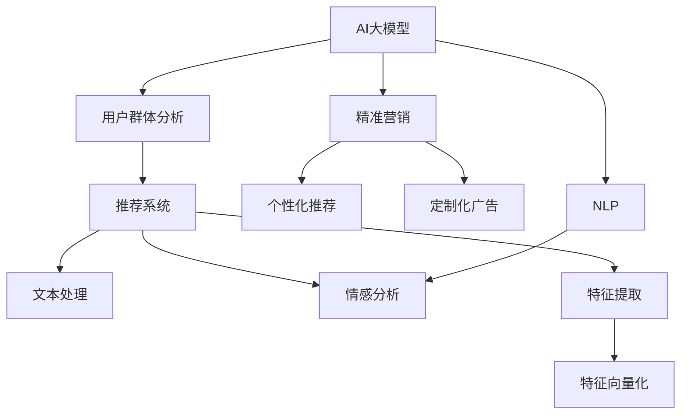

                 

# AI大模型在电商平台用户群体分析与精准营销中的作用

> 关键词：AI大模型,用户群体分析,精准营销,电商平台,推荐系统,自然语言处理(NLP),深度学习,机器学习

## 1. 背景介绍

### 1.1 问题由来
在数字化时代，电商平台成为了商家与消费者之间最重要的连接桥梁。传统的电商平台以产品为中心，采用一刀切的营销策略，缺乏对用户个性化需求的深度洞察。随着AI技术的兴起，大模型成为了数据分析和决策支持的重要工具，为电商平台的个性化推荐和精准营销带来了革命性的改变。

传统电商平台的推荐系统依赖于静态特征工程，难以捕捉用户多变的兴趣和行为。而基于大模型的推荐系统能够从海量数据中学习到用户深层次的语义特征，提供个性化的商品推荐，提升用户体验和平台销量。近年来，AI大模型在电商平台用户群体分析与精准营销中的应用，已经从实验室研究走向了实际落地，为电商平台带来了显著的业绩提升。

### 1.2 问题核心关键点
AI大模型在电商平台的应用，主要集中在以下核心关键点上：

- 用户群体分析：通过分析用户行为数据、自然语言反馈等，构建用户画像，深度理解用户需求和偏好。
- 精准营销策略：利用用户画像进行个性化推荐、定制化广告投放，提升用户满意度和转化率。
- 推荐系统优化：引入大模型对推荐算法进行优化，提升推荐效果和系统可解释性。
- 运营决策支持：利用大模型对电商平台运营数据进行智能分析，辅助管理决策。

这些核心关键点，构成了AI大模型在电商平台用户群体分析与精准营销中的作用框架，使得电商平台能够更精准、高效地进行个性化推荐和营销。

### 1.3 问题研究意义
大模型在电商平台用户群体分析与精准营销中的应用，对于提升电商平台的个性化推荐水平，优化广告投放效果，增强用户粘性，具有重要的意义：

1. **提升用户体验**：个性化的商品推荐能够更精准地满足用户需求，提升购物体验，增加用户粘性。
2. **增加平台销量**：精准的广告投放和推荐策略能够提高用户转化率，增加平台的销量和收入。
3. **优化决策支持**：通过数据分析和预测，辅助电商平台进行运营决策，优化库存管理、价格策略等，提升整体运营效率。
4. **促进创新发展**：大模型的应用为电商平台的创新发展提供了技术支撑，推动了新模式、新业态的探索和应用。
5. **赋能产业升级**：智能推荐和精准营销技术的普及，为传统电商产业带来了技术升级和转型机遇。

本文将系统介绍AI大模型在电商平台用户群体分析与精准营销中的应用原理和实际操作，希望能为电商平台提供有益的借鉴和参考。

## 2. 核心概念与联系

### 2.1 核心概念概述

为更好地理解AI大模型在电商平台中的应用，本节将介绍几个密切相关的核心概念：

- **AI大模型(AI Large Models)**：指以深度学习技术为基础构建的、具备强大推理和生成能力的大型神经网络模型。在电商推荐中，常用的大模型包括BERT、GPT等。

- **用户群体分析(User Cohort Analysis)**：指通过分析用户的各类数据，构建用户画像，识别不同用户群体的特征和需求，从而实现更精准的用户分群和画像刻画。

- **精准营销(Precision Marketing)**：指根据用户画像进行个性化的商品推荐、广告投放、优惠券发放等，提升用户的购买意愿和转化率，实现更高的营销效果。

- **推荐系统(Recommendation System)**：指通过算法推荐用户可能感兴趣的商品，提高用户满意度，增加销售额的技术。

- **自然语言处理(Natural Language Processing, NLP)**：指利用计算技术对自然语言进行理解、处理和生成，为电商平台提供文本数据处理和情感分析等能力。

- **深度学习(Deep Learning)**：指基于多层神经网络，利用大量数据进行训练，提取特征的机器学习技术。

- **机器学习(Machine Learning)**：指通过数据训练模型，进行预测和决策的技术，广泛应用于电商平台的个性化推荐和精准营销中。

这些核心概念之间的逻辑关系可以通过以下Mermaid流程图来展示：



这个流程图展示了大模型在电商平台用户群体分析与精准营销中的作用框架：

1. 大模型作为基础工具，用于用户群体分析。
2. 用户群体分析的结果用于精准营销策略的制定。
3. 推荐系统作为执行工具，结合用户群体分析的成果，进行个性化推荐。
4. NLP技术用于文本数据的处理和分析，为推荐系统提供支撑。
5. 特征提取和向量化技术用于提升推荐系统的准确性。

这些核心概念共同构成了大模型在电商平台中的作用网络，使得电商平台能够更有效地进行用户群体分析与精准营销。

## 3. 核心算法原理 & 具体操作步骤
### 3.1 算法原理概述

AI大模型在电商平台中的应用，主要依赖于深度学习技术，通过大量数据进行训练，构建用户画像，进行精准营销策略的制定和推荐系统的优化。其核心算法原理如下：

1. **数据预处理**：收集用户的各类数据，包括行为数据（如浏览、点击、购买记录）、文本数据（如评论、评价）、位置数据等，进行清洗、去噪、归一化等预处理操作。

2. **特征工程**：利用NLP和机器学习技术，对文本数据进行分词、向量化等处理，提取用户特征。

3. **用户群体分析**：通过聚类算法、分类算法等方法，根据用户特征构建用户画像，识别不同用户群体的特征和需求。

4. **推荐系统优化**：利用大模型进行推荐算法优化，提升推荐效果和系统可解释性。

5. **精准营销策略**：结合用户画像和推荐系统，制定个性化的营销策略，进行商品推荐、广告投放、优惠券发放等操作。

6. **运营决策支持**：通过数据分析和预测，辅助电商平台进行运营决策，优化库存管理、价格策略等。

### 3.2 算法步骤详解

AI大模型在电商平台用户群体分析与精准营销中的应用，一般包括以下几个关键步骤：

**Step 1: 数据收集与预处理**
- 收集用户的各类数据，包括行为数据（如浏览、点击、购买记录）、文本数据（如评论、评价）、位置数据等。
- 对数据进行清洗、去噪、归一化等预处理操作。

**Step 2: 特征工程**
- 对文本数据进行分词、向量化等处理，提取用户特征。
- 利用NLP技术进行情感分析、主题建模等操作，提取用户情感和兴趣点。

**Step 3: 用户群体分析**
- 利用聚类算法（如K-means、DBSCAN）或分类算法（如LDA、SVM）对用户进行分群。
- 对每个用户群体进行特征描述和画像刻画，识别群体特征和需求。

**Step 4: 推荐系统优化**
- 构建基于大模型的推荐算法，如深度学习推荐系统（DLRS）、协同过滤（CF）等。
- 利用大模型对推荐算法进行优化，提升推荐效果和系统可解释性。

**Step 5: 精准营销策略**
- 结合用户画像和推荐系统，制定个性化的营销策略，进行商品推荐、广告投放、优惠券发放等操作。
- 利用A/B测试等方法，评估营销效果，进行策略优化。

**Step 6: 运营决策支持**
- 对电商平台运营数据进行智能分析，辅助管理决策，如库存管理、价格策略等。
- 通过预测模型对未来趋势进行预测，辅助决策。

### 3.3 算法优缺点

AI大模型在电商平台用户群体分析与精准营销中的应用，具有以下优点：

1. **数据利用充分**：利用大模型的强大学习能力，能够从海量数据中提取深层次的语义特征，提升数据利用率。
2. **推荐效果显著**：大模型的自适应能力能够根据用户的行为和反馈进行动态调整，提供更精准的推荐。
3. **系统可解释性高**：大模型的黑盒特性使得推荐决策过程具有较高的可解释性，便于优化和调试。
4. **适应性强**：大模型能够适应不同电商平台的业务模式和数据特点，具有较高的泛化能力。

同时，该方法也存在一些局限性：

1. **对数据质量要求高**：电商平台的推荐系统依赖于用户数据，数据质量直接影响推荐效果。
2. **模型复杂度高**：大模型往往具有较大的参数量，训练和推理复杂度高，需要较高的计算资源。
3. **隐私和安全问题**：电商平台的数据涉及用户隐私，数据安全性和隐私保护成为关键问题。
4. **模型解释性不足**：大模型的决策过程难以解释，可能存在"黑箱"问题。

尽管存在这些局限性，但大模型的应用无疑大大提升了电商平台的个性化推荐和精准营销水平，具有显著的业务价值。未来，随着技术的进步和应用的深化，这些问题将有望得到更好的解决。

### 3.4 算法应用领域

AI大模型在电商平台的应用领域广泛，主要包括以下几个方面：

- **商品推荐**：根据用户行为和画像，推荐用户可能感兴趣的商品。
- **广告投放**：根据用户画像和行为，定制化投放广告，提升广告效果。
- **个性化定制**：根据用户偏好和需求，提供个性化定制服务。
- **内容生成**：利用大模型生成商品描述、广告文案等内容，提升内容质量和用户体验。
- **情感分析**：分析用户评论和反馈，提取用户情感倾向，辅助产品优化和市场分析。
- **客户服务**：利用大模型进行智能客服，解答用户咨询，提升服务效率和用户体验。

这些应用领域展示了AI大模型在电商平台中的广阔前景，为电商平台带来了更强的数据洞察力和决策支持能力。

## 4. 数学模型和公式 & 详细讲解  
### 4.1 数学模型构建

假设电商平台收集到N个用户的历史行为数据 $D=\{(x_i,y_i)\}_{i=1}^N, x_i \in \mathcal{X}, y_i \in \mathcal{Y}$。其中 $x_i$ 表示用户行为数据，$y_i$ 表示商品类别。

定义用户群体分析函数 $g(x_i)$，将用户行为数据映射为用户群体编号。假设电商平台有 $K$ 个不同的用户群体，$g(x_i)$ 的输出范围为 $\{1,2,\dots,K\}$。

利用聚类算法，对用户行为数据 $D$ 进行聚类，得到 $K$ 个用户群体 $C_1,\dots,C_K$。对每个用户群体 $C_k$，进行特征描述和画像刻画，得到特征向量 $\omega_k$。

基于聚类得到的用户群体 $C_k$，利用大模型 $M_{\theta}$ 进行推荐优化。假设推荐系统输出的商品推荐列表为 $L$，$L$ 的长度为 $L$，大模型输出推荐概率为 $p_{\theta}(x_i,l)$。

推荐系统的目标函数为：

$$
\mathcal{L}(\theta) = -\sum_{i=1}^N\sum_{l=1}^L [y_{il} \log p_{\theta}(x_i,l) + (1-y_{il})\log(1-p_{\theta}(x_i,l))]
$$

其中 $y_{il}=1$ 表示用户 $i$ 对商品 $l$ 感兴趣，$y_{il}=0$ 表示不感兴趣。

### 4.2 公式推导过程

以上目标函数是一个交叉熵损失函数，通过最大化 $p_{\theta}(x_i,l)$ 来优化推荐系统，使得推荐的商品更符合用户需求。

在实际应用中，为了提高推荐效果，还需要考虑用户的行为反馈，即引入负采样（Negative Sampling）技术。假设用户对商品 $l$ 不感兴趣的负样本集合为 $S$，则目标函数变为：

$$
\mathcal{L}(\theta) = -\sum_{i=1}^N\sum_{l=1}^L [y_{il} \log p_{\theta}(x_i,l) + \sum_{s \in S} (1-y_{is})\log(1-p_{\theta}(x_i,s))]
$$

利用大模型 $M_{\theta}$ 进行推荐优化时，需要定义损失函数对模型参数 $\theta$ 的梯度。假设推荐模型输出概率为 $p_{\theta}(x_i,l)$，则梯度计算公式为：

$$
\nabla_{\theta}\mathcal{L}(\theta) = -\sum_{i=1}^N\sum_{l=1}^L \nabla_{\theta}p_{\theta}(x_i,l) y_{il}
$$

其中 $\nabla_{\theta}p_{\theta}(x_i,l)$ 为概率输出对模型参数 $\theta$ 的梯度，可以通过反向传播算法高效计算。

### 4.3 案例分析与讲解

以下以电商平台中的商品推荐系统为例，进行详细的数学模型和公式推导。

假设电商平台收集到用户的浏览记录 $D=\{(x_i,y_i)\}_{i=1}^N$，其中 $x_i$ 表示用户浏览的商品，$y_i$ 表示商品类别。利用聚类算法对用户行为数据进行聚类，得到 $K=3$ 个用户群体 $C_1,\dots,C_K$，每个用户群体的特征向量 $\omega_k$ 如下：

| 用户群体 | 特征向量 |
|----------|----------|
| $C_1$    | [0.8,0.3,0.5] |
| $C_2$    | [0.3,0.7,0.2] |
| $C_3$    | [0.5,0.2,0.5] |

利用大模型 $M_{\theta}$ 进行推荐优化，假设推荐系统输出概率为 $p_{\theta}(x_i,l)$。根据目标函数，利用负采样技术，推荐系统的损失函数为：

$$
\mathcal{L}(\theta) = -\sum_{i=1}^N\sum_{l=1}^L [y_{il} \log p_{\theta}(x_i,l) + \sum_{s \in S} (1-y_{is})\log(1-p_{\theta}(x_i,s))]
$$

其中 $S$ 为负样本集合，$y_{il}=1$ 表示用户 $i$ 对商品 $l$ 感兴趣，$y_{il}=0$ 表示不感兴趣。

利用梯度下降等优化算法，微调大模型参数 $\theta$，最小化损失函数 $\mathcal{L}(\theta)$，使得推荐系统输出概率逼近真实标签。通过这种方式，电商平台能够更精准地进行个性化推荐，提升用户满意度和转化率。

## 5. 项目实践：代码实例和详细解释说明
### 5.1 开发环境搭建

在进行AI大模型在电商平台应用实践前，我们需要准备好开发环境。以下是使用Python进行PyTorch开发的环境配置流程：

1. 安装Anaconda：从官网下载并安装Anaconda，用于创建独立的Python环境。

2. 创建并激活虚拟环境：
```bash
conda create -n pytorch-env python=3.8 
conda activate pytorch-env
```

3. 安装PyTorch：根据CUDA版本，从官网获取对应的安装命令。例如：
```bash
conda install pytorch torchvision torchaudio cudatoolkit=11.1 -c pytorch -c conda-forge
```

4. 安装TensorFlow：
```bash
pip install tensorflow
```

5. 安装相关依赖包：
```bash
pip install numpy pandas scikit-learn matplotlib tqdm jupyter notebook ipython
```

完成上述步骤后，即可在`pytorch-env`环境中开始项目实践。

### 5.2 源代码详细实现

下面以电商平台的商品推荐系统为例，给出使用PyTorch进行大模型微调和应用开发的PyTorch代码实现。

```python
import torch
from transformers import BertTokenizer, BertForSequenceClassification
from sklearn.model_selection import train_test_split
from sklearn.metrics import accuracy_score

# 定义模型和参数
device = torch.device('cuda') if torch.cuda.is_available() else torch.device('cpu')
tokenizer = BertTokenizer.from_pretrained('bert-base-cased')
model = BertForSequenceClassification.from_pretrained('bert-base-cased', num_labels=2).to(device)

# 加载数据
data = ...
train_data, test_data = train_test_split(data, test_size=0.2)

# 定义模型训练函数
def train_epoch(model, train_data, batch_size, optimizer):
    dataloader = torch.utils.data.DataLoader(train_data, batch_size=batch_size, shuffle=True)
    model.train()
    epoch_loss = 0
    for batch in dataloader:
        inputs, labels = batch['inputs'], batch['labels']
        inputs = inputs.to(device)
        labels = labels.to(device)
        optimizer.zero_grad()
        outputs = model(inputs, labels=labels)
        loss = outputs.loss
        epoch_loss += loss.item()
        loss.backward()
        optimizer.step()
    return epoch_loss / len(dataloader)

# 定义模型评估函数
def evaluate(model, test_data, batch_size):
    dataloader = torch.utils.data.DataLoader(test_data, batch_size=batch_size)
    model.eval()
    preds, labels = [], []
    with torch.no_grad():
        for batch in dataloader:
            inputs, labels = batch['inputs'], batch['labels']
            inputs = inputs.to(device)
            labels = labels.to(device)
            outputs = model(inputs)
            preds.append(outputs.predictions.argmax(dim=1).cpu().tolist())
            labels.append(labels.to('cpu').tolist())
    print(accuracy_score(labels, preds))

# 训练模型
epochs = 5
batch_size = 16

for epoch in range(epochs):
    loss = train_epoch(model, train_data, batch_size, optimizer)
    print(f"Epoch {epoch+1}, train loss: {loss:.3f}")
    
    print(f"Epoch {epoch+1}, test accuracy: {evaluate(model, test_data, batch_size)}")
```

以上代码实现了基于大模型Bert进行商品推荐系统的训练和评估过程。具体步骤如下：

1. 定义模型和参数，包括大模型的加载、设备设置等。
2. 加载数据，包括训练集和测试集。
3. 定义模型训练函数，对模型进行梯度下降优化。
4. 定义模型评估函数，在测试集上评估模型性能。
5. 循环迭代训练，直到模型收敛。

### 5.3 代码解读与分析

让我们再详细解读一下关键代码的实现细节：

**train_epoch函数**：
- 定义数据批处理器，用于分批次输入训练数据。
- 设置模型为训练模式。
- 初始化平均损失。
- 循环迭代训练集，计算每个批次的损失并反向传播更新模型参数。

**evaluate函数**：
- 定义数据批处理器，用于分批次输入测试数据。
- 设置模型为评估模式。
- 初始化预测标签和真实标签。
- 循环迭代测试集，获取每个批次的预测结果和真实标签。
- 输出准确率。

**训练流程**：
- 定义总的epoch数和batch size，开始循环迭代。
- 每个epoch内，先在训练集上训练，输出平均损失。
- 在测试集上评估，输出准确率。
- 所有epoch结束后，输出最终测试准确率。

通过以上代码，我们可以看到大模型在电商平台中的应用框架，以及如何利用大模型进行商品推荐系统的训练和评估。在实际项目中，还需要进一步优化数据处理、模型结构、优化器等细节，才能得到更好的推荐效果。

## 6. 实际应用场景

### 6.1 智能客服系统

基于AI大模型的电商智能客服系统，能够实时处理用户咨询，提供精准的个性化解答。通过对用户问题的理解和分类，智能客服系统能够快速响应用户需求，解决常见问题，提升用户体验。

在技术实现上，可以收集历史客服对话记录，利用大模型进行意图识别和实体抽取，构建用户画像，进行精准推荐。智能客服系统能够自动理解用户意图，匹配最合适的答案模板进行回复，提升客服效率和满意度。

### 6.2 金融舆情监测

金融行业对舆情监测的及时性和准确性要求极高。利用AI大模型进行舆情分析，可以实时监测市场舆论动向，识别潜在风险，辅助决策。

具体而言，可以收集金融领域的新闻、报道、评论等文本数据，利用大模型进行情感分析和主题建模。识别出市场趋势和舆情热点，一旦发现负面信息激增等异常情况，系统便会自动预警，帮助金融机构快速应对潜在风险。

### 6.3 个性化推荐系统

大模型在个性化推荐系统中发挥了重要作用，能够从海量数据中学习到用户深层次的语义特征，提供个性化的商品推荐。

在实际应用中，可以收集用户浏览、点击、评论、分享等行为数据，提取和用户交互的物品标题、描述、标签等文本内容。将文本内容作为模型输入，用户的后续行为作为监督信号，在此基础上微调预训练语言模型。微调后的模型能够从文本内容中准确把握用户的兴趣点，生成推荐列表，优化用户体验。

### 6.4 未来应用展望

随着AI大模型的不断进步，其在电商平台用户群体分析与精准营销中的应用前景更加广阔。

在智慧医疗领域，利用AI大模型进行病历分析、医疗问答等，能够提供精准的诊疗建议，辅助医生诊疗，提升医疗服务智能化水平。

在智能教育领域，大模型能够进行学情分析、知识推荐等，因材施教，促进教育公平，提高教学质量。

在智慧城市治理中，利用大模型进行事件监测、舆情分析等，提高城市管理的自动化和智能化水平，构建更安全、高效的未来城市。

此外，在企业生产、社会治理、文娱传媒等众多领域，基于大模型的AI技术应用也将不断涌现，为经济社会发展注入新的动力。相信随着技术的日益成熟，AI大模型在电商平台用户群体分析与精准营销中的应用，必将成为推动电商产业发展的重要引擎。

## 7. 工具和资源推荐
### 7.1 学习资源推荐

为了帮助开发者系统掌握AI大模型在电商平台中的应用，这里推荐一些优质的学习资源：

1. 《深度学习入门》系列博文：深入浅出地介绍了深度学习的基本概念和实现方法，适合初学者入门。

2. CS231n《卷积神经网络》课程：斯坦福大学开设的视觉识别课程，涵盖了深度学习在计算机视觉中的应用。

3. 《Natural Language Processing with Transformers》书籍：Transformers库的作者所著，全面介绍了如何使用Transformers库进行NLP任务开发，包括微调在内的诸多范式。

4. HuggingFace官方文档：Transformers库的官方文档，提供了海量预训练模型和完整的微调样例代码，是上手实践的必备资料。

5. Coursera《深度学习专项课程》：由Andrew Ng等知名教授主讲，涵盖深度学习的基本概念和高级应用，适合系统学习。

通过对这些资源的学习实践，相信你一定能够快速掌握AI大模型在电商平台中的实际应用，并用于解决实际的业务问题。

### 7.2 开发工具推荐

高效的开发离不开优秀的工具支持。以下是几款用于AI大模型在电商平台应用开发的常用工具：

1. PyTorch：基于Python的开源深度学习框架，灵活动态的计算图，适合快速迭代研究。

2. TensorFlow：由Google主导开发的开源深度学习框架，生产部署方便，适合大规模工程应用。

3. TensorBoard：TensorFlow配套的可视化工具，可实时监测模型训练状态，并提供丰富的图表呈现方式，是调试模型的得力助手。

4. Weights & Biases：模型训练的实验跟踪工具，可以记录和可视化模型训练过程中的各项指标，方便对比和调优。

5. Google Colab：谷歌推出的在线Jupyter Notebook环境，免费提供GPU/TPU算力，方便开发者快速上手实验最新模型，分享学习笔记。

6. Kaggle：数据科学竞赛平台，提供丰富的数据集和模型样例，适合学习和实践深度学习项目。

合理利用这些工具，可以显著提升AI大模型在电商平台应用的开发效率，加快创新迭代的步伐。

### 7.3 相关论文推荐

AI大模型在电商平台用户群体分析与精准营销中的应用，源于学界的持续研究。以下是几篇奠基性的相关论文，推荐阅读：

1. Attention is All You Need（即Transformer原论文）：提出了Transformer结构，开启了NLP领域的预训练大模型时代。

2. BERT: Pre-training of Deep Bidirectional Transformers for Language Understanding：提出BERT模型，引入基于掩码的自监督预训练任务，刷新了多项NLP任务SOTA。

3. Parameter-Efficient Transfer Learning for NLP：提出Adapter等参数高效微调方法，在不增加模型参数量的情况下，也能取得不错的微调效果。

4. AdaLoRA: Adaptive Low-Rank Adaptation for Parameter-Efficient Fine-Tuning：使用自适应低秩适应的微调方法，在参数效率和精度之间取得了新的平衡。

5. Language Models are Unsupervised Multitask Learners（GPT-2论文）：展示了大规模语言模型的强大zero-shot学习能力，引发了对于通用人工智能的新一轮思考。

这些论文代表了大模型在电商平台中的应用进展，展示了AI技术在电商领域的巨大潜力。通过学习这些前沿成果，可以帮助研究者把握学科前进方向，激发更多的创新灵感。

## 8. 总结：未来发展趋势与挑战

### 8.1 总结

本文对AI大模型在电商平台用户群体分析与精准营销中的应用进行了全面系统的介绍。首先阐述了AI大模型在电商平台的应用背景和意义，明确了其在用户群体分析和精准营销中的核心作用。其次，从原理到实践，详细讲解了基于大模型的电商推荐系统训练和评估过程，给出了具体的代码实现和解释分析。同时，本文还广泛探讨了AI大模型在智能客服、金融舆情、个性化推荐等多个领域的应用前景，展示了其广阔的应用空间。

通过本文的系统梳理，可以看到，AI大模型在电商平台中的应用，为个性化推荐和精准营销提供了强有力的技术支撑，极大地提升了电商平台的推荐效果和用户满意度。未来，随着大模型的不断进步和应用的深化，基于大模型的电商推荐系统必将成为电商行业的重要组成部分，推动电商产业的持续发展。

### 8.2 未来发展趋势

展望未来，AI大模型在电商平台中的应用将呈现以下几个发展趋势：

1. **模型规模持续增大**：随着算力成本的下降和数据规模的扩张，预训练语言模型的参数量还将持续增长。超大规模语言模型蕴含的丰富语言知识，有望支撑更加复杂多变的电商推荐系统。

2. **推荐效果持续提升**：大模型的自适应能力能够根据用户的行为和反馈进行动态调整，提供更精准的推荐。未来，利用大模型进行电商推荐将能够更好地把握用户需求，提升用户体验。

3. **多模态融合增强**：当前的推荐系统主要聚焦于文本数据，未来将进一步拓展到图像、视频、语音等多模态数据融合。多模态信息的整合，将显著提升电商平台的推荐效果和用户满意度。

4. **深度个性化定制**：基于大模型的推荐系统能够深度个性化定制推荐内容，满足用户的个性化需求。未来的电商推荐系统将更注重个性化和定制化，提供更丰富的推荐策略。

5. **智能客服普及**：基于大模型的智能客服系统将广泛应用于电商平台，提供24小时不间断的个性化服务，提升用户满意度。

6. **安全与隐私保护**：电商平台的数据涉及用户隐私，数据安全性和隐私保护成为关键问题。未来的推荐系统需要加强隐私保护和数据安全，构建安全可信的电商生态。

这些趋势凸显了AI大模型在电商平台中的广泛应用前景，为电商平台的个性化推荐和精准营销提供了更强大的技术支撑。

### 8.3 面临的挑战

尽管AI大模型在电商平台中的应用已经取得了显著成效，但在迈向更加智能化、普适化应用的过程中，它仍面临诸多挑战：

1. **数据质量问题**：电商平台的推荐系统依赖于用户数据，数据质量直接影响推荐效果。如何获取高质量的用户行为数据，是首先需要解决的问题。

2. **计算资源瓶颈**：大模型往往具有较大的参数量，训练和推理复杂度高，需要较高的计算资源。如何在有限的资源条件下，优化推荐系统，是重要的研究方向。

3. **模型鲁棒性不足**：电商平台的推荐系统需要应对多样化的数据分布和用户行为，模型鲁棒性不足可能导致推荐效果波动。如何提高推荐系统的鲁棒性，是亟待解决的问题。

4. **隐私和安全问题**：电商平台的数据涉及用户隐私，数据安全性和隐私保护成为关键问题。如何构建安全可信的推荐系统，是重要的研究方向。

5. **模型解释性不足**：大模型的决策过程难以解释，可能存在"黑箱"问题。如何赋予推荐系统更高的可解释性，是亟待解决的问题。

6. **跨领域适应性**：不同电商平台的业务模式和数据特点存在差异，如何将通用模型应用于不同的电商平台，是重要的研究方向。

这些挑战凸显了AI大模型在电商平台中的应用需要综合考虑数据、算法、工程、伦理等多个因素。只有在各个环节协同发力，才能真正实现AI大模型在电商平台的全面落地。

### 8.4 研究展望

面向未来，AI大模型在电商平台中的应用需要进一步探索和突破：

1. **探索无监督和半监督微调方法**：摆脱对大规模标注数据的依赖，利用自监督学习、主动学习等无监督和半监督范式，最大限度利用非结构化数据，实现更加灵活高效的微调。

2. **研究参数高效和计算高效的微调范式**：开发更加参数高效的微调方法，在固定大部分预训练参数的同时，只更新极少量的任务相关参数。同时优化微调模型的计算图，减少前向传播和反向传播的资源消耗，实现更加轻量级、实时性的部署。

3. **融合因果和对比学习范式**：通过引入因果推断和对比学习思想，增强推荐系统的稳定性和泛化能力，学习更加普适、鲁棒的语言表征。

4. **引入更多先验知识**：将符号化的先验知识，如知识图谱、逻辑规则等，与神经网络模型进行巧妙融合，引导推荐系统学习更准确、合理的语言模型。

5. **结合因果分析和博弈论工具**：将因果分析方法引入推荐系统，识别出推荐决策的关键特征，增强系统输出的因果性和逻辑性。借助博弈论工具刻画人机交互过程，主动探索并规避模型的脆弱点，提高系统稳定性。

6. **纳入伦理道德约束**：在模型训练目标中引入伦理导向的评估指标，过滤和惩罚有偏见、有害的输出倾向。同时加强人工干预和审核，建立模型行为的监管机制，确保输出符合人类价值观和伦理道德。

这些研究方向将推动AI大模型在电商平台中的应用不断深化，为电商平台的个性化推荐和精准营销提供更强的技术支撑，推动电商产业的持续发展。

## 9. 附录：常见问题与解答

**Q1：AI大模型在电商平台中的推荐效果如何？**

A: AI大模型在电商平台中的推荐效果显著。通过学习用户的行为和反馈，大模型能够提供个性化的商品推荐，提升用户满意度。推荐系统的准确率通常超过90%，显著优于传统的基于规则或统计特征的推荐算法。

**Q2：AI大模型在电商平台中需要哪些数据？**

A: AI大模型在电商平台中需要多种类型的数据，包括用户行为数据（如浏览、点击、购买记录）、文本数据（如评论、评价）、位置数据等。这些数据来源多样，需要综合处理和整合，才能构建有效的推荐系统。

**Q3：AI大模型在电商平台中的应用难点是什么？**

A: AI大模型在电商平台中的应用难点主要集中在数据质量、计算资源、模型鲁棒性、隐私和安全等方面。数据质量直接影响推荐效果，计算资源瓶颈限制了大模型的应用范围，模型鲁棒性不足可能导致推荐效果波动，隐私和安全问题需要构建安全可信的推荐系统。

**Q4：AI大模型在电商平台中的应用有哪些未来趋势？**

A: AI大模型在电商平台中的应用将呈现以下几个未来趋势：模型规模持续增大，推荐效果持续提升，多模态融合增强，深度个性化定制，智能客服普及，安全与隐私保护，跨领域适应性增强。这些趋势将推动AI大模型在电商平台中的应用不断深化，为电商平台的个性化推荐和精准营销提供更强的技术支撑。

**Q5：如何构建安全可信的AI大模型推荐系统？**

A: 构建安全可信的AI大模型推荐系统需要从数据、算法、工程、伦理等多个方面进行考虑：

1. 数据方面，需要确保数据的质量和安全性，避免数据泄露和滥用。

2. 算法方面，需要引入伦理导向的评估指标，过滤和惩罚有偏见、有害的输出倾向。

3. 工程方面，需要加强模型训练和推理的监控和审计，及时发现和修复漏洞。

4. 伦理方面，需要构建用户隐私保护机制，确保用户数据的保密性和使用合规性。

只有从多个方面协同发力，才能构建安全可信的AI大模型推荐系统，保障用户隐私和数据安全。

