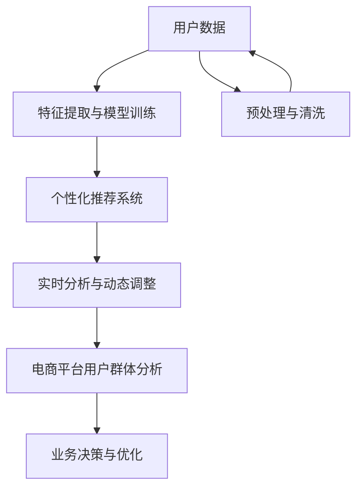

                 

# AI大模型在电商平台用户群体分析中的作用

## 1. 背景介绍

### 1.1 问题由来

在当今数字化时代，电商平台正面临着前所未有的竞争压力。为了获得竞争优势，电商企业需要深入理解其用户群体，以便提供个性化的服务，增强用户粘性，提升销售转化率。然而，用户数据的规模和复杂度不断增加，传统的分析方法难以满足需求，亟需引入更加先进的数据分析技术。

AI大模型作为新一代人工智能技术的代表，具备强大的数据分析和预测能力。其在电商平台中的应用，可以显著提升用户群体分析的深度和广度，帮助企业更好地理解用户需求，实现精准营销和个性化推荐，进而驱动业务增长。

### 1.2 问题核心关键点

AI大模型在电商平台用户群体分析中的作用主要体现在以下几个方面：

- **大规模数据处理能力**：能够处理海量用户数据，从中挖掘出有用的洞察，为业务决策提供依据。
- **深度特征提取**：通过自监督学习等方式，从文本、图像等多模态数据中提取深层次特征，为模型提供更加丰富的输入信息。
- **个性化推荐与营销**：利用深度学习模型，对用户行为进行建模，实现个性化推荐和精准营销，提升用户满意度和转化率。
- **实时分析与动态调整**：通过构建实时分析系统，实现对用户群体动态变化的快速响应和调整。
- **用户行为预测与预警**：利用预测模型，对用户未来行为进行预测，及时发现潜在风险，如流失用户、欺诈行为等，从而采取措施进行干预。

### 1.3 问题研究意义

AI大模型在电商平台用户群体分析中的应用，具有重要意义：

- **提升用户体验**：通过个性化的服务和推荐，提升用户满意度，增强用户忠诚度。
- **提高业务效率**：优化供应链、库存管理，提升运营效率，降低成本。
- **增强竞争力**：利用AI技术快速响应市场变化，领先竞争对手。
- **数据驱动决策**：将海量数据转化为有价值的商业洞察，支持数据驱动的决策制定。
- **实现精准营销**：通过精准的用户群体分析，实现高精准度的营销活动，提升ROI。

## 2. 核心概念与联系

### 2.1 核心概念概述

为了更好地理解AI大模型在电商平台用户群体分析中的作用，本节将介绍几个关键概念：

- **AI大模型**：以Transformer为基础的深度学习模型，如BERT、GPT-3、XLNet等，能够处理大规模多模态数据，提取深层次特征。
- **电商平台用户群体分析**：通过数据分析技术，从电商平台的用户数据中挖掘出用户群体特征，如年龄、性别、地域、消费行为等，以指导业务决策。
- **特征提取与模型训练**：利用AI大模型从文本、图像等多模态数据中提取特征，并将其作为模型输入进行训练。
- **个性化推荐系统**：根据用户特征，利用AI模型生成个性化推荐，提升用户购买转化率。
- **实时分析与动态调整**：构建实时分析系统，对用户群体变化进行动态调整，实现业务优化。

这些概念之间存在密切联系，共同构成了AI大模型在电商平台用户群体分析中的整体应用框架。

### 2.2 核心概念原理和架构的 Mermaid 流程图(Mermaid 流程节点中不要有括号、逗号等特殊字符)



此流程图展示了AI大模型在电商平台用户群体分析中的应用流程。用户数据首先经过预处理与清洗，然后通过特征提取与模型训练生成个性化的推荐，再利用实时分析与动态调整对用户群体变化进行响应，最终反馈到业务决策与优化环节。

## 3. 核心算法原理 & 具体操作步骤

### 3.1 算法原理概述

AI大模型在电商平台用户群体分析中的核心算法原理主要包括特征提取、模型训练和个性化推荐等环节。

#### 3.1.1 特征提取

特征提取是AI大模型在电商平台应用的基础。通过构建多模态数据集，将用户行为、商品属性、用户画像等数据转化为模型可用的特征向量。这些特征向量可以用于训练机器学习模型，预测用户行为，实现个性化推荐。

#### 3.1.2 模型训练

模型训练是利用AI大模型进行用户群体分析的核心步骤。通过在标注数据集上训练大模型，使其学习到用户群体特征与行为之间的关系。训练后的模型可以用于预测用户行为、生成推荐列表等任务。

#### 3.1.3 个性化推荐

个性化推荐系统是AI大模型在电商平台应用的直接结果。通过分析用户历史行为、偏好等数据，生成个性化的推荐列表，提升用户购买转化率。推荐系统的实现包括推荐算法的选择、模型的调参、推荐结果的展示等环节。

### 3.2 算法步骤详解

#### 3.2.1 数据准备

数据准备是用户群体分析的第一步。需要从电商平台收集用户行为数据、商品属性数据、用户画像数据等，并进行预处理、清洗和归一化。

#### 3.2.2 特征提取

特征提取阶段，利用AI大模型对数据集进行处理，提取深层次特征。常用的特征提取方法包括：

- **自然语言处理(NLP)**：对用户评论、商品描述等文本数据进行向量化，提取关键词、情感极性等特征。
- **图像处理**：对用户上传的商品图片进行特征提取，生成图像向量。
- **时间序列分析**：对用户行为数据进行时间序列分析，提取趋势、周期性等特征。

#### 3.2.3 模型训练

模型训练阶段，选择合适的AI大模型，如BERT、GPT-3等，在标注数据集上进行训练。训练过程包括：

- **选择模型**：根据任务需求选择合适的AI大模型。
- **设置超参数**：如学习率、批大小、迭代轮数等。
- **优化器选择**：如Adam、SGD等。
- **模型训练**：利用训练数据集进行迭代训练，更新模型参数。
- **评估模型**：在验证集上评估模型性能，调整超参数，直到模型达到理想状态。

#### 3.2.4 个性化推荐

个性化推荐系统构建过程包括：

- **选择推荐算法**：如协同过滤、内容推荐、混合推荐等。
- **模型集成**：将多个推荐模型进行集成，提升推荐效果。
- **推荐结果展示**：设计推荐界面，展示推荐列表。
- **效果评估**：通过A/B测试等方法评估推荐系统效果。

### 3.3 算法优缺点

AI大模型在电商平台用户群体分析中的算法具有以下优点：

- **高效性**：能够处理大规模多模态数据，提取深层次特征，提升分析效率。
- **准确性**：利用大规模语料进行预训练，具备强大的泛化能力，预测准确性高。
- **灵活性**：可以灵活调整超参数，适应不同的业务需求。

同时，也存在一些缺点：

- **计算资源需求高**：大规模模型需要高性能计算资源进行训练和推理。
- **数据隐私问题**：大规模数据处理可能涉及用户隐私，需要严格的数据保护措施。
- **模型复杂度**：模型参数量较大，模型解释性较弱。

### 3.4 算法应用领域

AI大模型在电商平台用户群体分析中的应用领域广泛，包括：

- **用户画像生成**：根据用户行为数据，生成用户画像，帮助企业了解用户特征。
- **个性化推荐**：基于用户历史行为和偏好，生成个性化推荐列表，提升用户购买转化率。
- **用户流失预测**：通过分析用户行为数据，预测用户流失概率，提前进行干预。
- **欺诈检测**：利用AI模型对用户行为进行异常检测，防范欺诈行为。
- **营销效果评估**：通过分析用户反馈和行为数据，评估营销活动效果。

## 4. 数学模型和公式 & 详细讲解 & 举例说明（备注：数学公式请使用latex格式，latex嵌入文中独立段落使用 $$，段落内使用 $)

### 4.1 数学模型构建

在本节中，我们将构建一个简单的数学模型来描述AI大模型在电商平台用户群体分析中的应用。

假设用户群体分析的目标是预测用户是否会购买某商品，用户数据集包含$m$个用户，每个用户有$n$个行为特征，其中$y_i \in \{0, 1\}$表示用户$i$是否购买了该商品。

设$X$为特征矩阵，$y$为标签向量，模型的目标是找到一个最优的参数$\theta$，使得模型预测值与真实标签之间的差异最小化。

### 4.2 公式推导过程

我们采用线性回归模型进行用户群体分析，模型的公式为：

$$
y = X\theta + b
$$

其中$y$为预测值，$X$为特征矩阵，$\theta$为模型参数，$b$为截距。

为了最小化预测值与真实标签之间的差异，我们采用均方误差(MSE)作为损失函数：

$$
\mathcal{L}(\theta) = \frac{1}{m} \sum_{i=1}^m (y_i - X_i\theta)^2
$$

最小化损失函数的过程可以通过梯度下降算法实现：

$$
\theta_{t+1} = \theta_t - \eta \nabla_{\theta} \mathcal{L}(\theta_t)
$$

其中$\eta$为学习率，$\nabla_{\theta} \mathcal{L}(\theta_t)$为损失函数对模型参数的梯度。

### 4.3 案例分析与讲解

以电商平台个性化推荐为例，我们可以使用以下步骤进行模型训练：

1. 收集用户行为数据，包括浏览历史、购买记录、评分数据等。
2. 对数据进行预处理和特征提取，生成特征矩阵$X$。
3. 选择合适的AI大模型，如BERT、GPT-3等，在标注数据集上进行训练。
4. 设定超参数，如学习率、批大小、迭代轮数等，进行模型训练。
5. 在验证集上评估模型性能，调整超参数，直到模型达到理想状态。
6. 构建个性化推荐系统，选择推荐算法，集成多个推荐模型，设计推荐界面，展示推荐列表。
7. 通过A/B测试等方法评估推荐系统效果，持续优化模型。

## 5. 项目实践：代码实例和详细解释说明

### 5.1 开发环境搭建

在进行AI大模型在电商平台用户群体分析的开发前，我们需要准备好开发环境。以下是使用Python进行PyTorch开发的环境配置流程：

1. 安装Anaconda：从官网下载并安装Anaconda，用于创建独立的Python环境。

2. 创建并激活虚拟环境：
```bash
conda create -n pytorch-env python=3.8 
conda activate pytorch-env
```

3. 安装PyTorch：根据CUDA版本，从官网获取对应的安装命令。例如：
```bash
conda install pytorch torchvision torchaudio cudatoolkit=11.1 -c pytorch -c conda-forge
```

4. 安装各类工具包：
```bash
pip install numpy pandas scikit-learn matplotlib tqdm jupyter notebook ipython
```

完成上述步骤后，即可在`pytorch-env`环境中开始开发实践。

### 5.2 源代码详细实现

下面我们以电商平台用户群体分析为例，给出使用Transformers库对BERT模型进行训练的PyTorch代码实现。

首先，定义数据处理函数：

```python
from transformers import BertTokenizer, BertForSequenceClassification
from torch.utils.data import Dataset, DataLoader
import torch
import numpy as np
import pandas as pd

class UserData(Dataset):
    def __init__(self, data_path, tokenizer, max_len=128):
        self.data = pd.read_csv(data_path)
        self.tokenizer = tokenizer
        self.max_len = max_len
        
    def __len__(self):
        return len(self.data)
    
    def __getitem__(self, item):
        user_data = self.data.iloc[item]
        user behaviors = user_data['behaviors'].split(',')
        user_besic = user_data['basic_info']
        
        # 将用户行为数据编码为token ids
        encoded_behaviors = [self.tokenizer.encode(text) for text in behaviors]
        encoded_behaviors = [behavior_ids for behavior_ids in encoded_behaviors if len(behavior_ids) < self.max_len]
        user_info = self.tokenizer.encode(user_besic, max_length=self.max_len)
        
        # 生成标签
        label = int(user_data['label'])
        
        # 对token ids进行padding，确保所有输入的长度一致
        encoded_behaviors = [behavior_ids + [0] * (self.max_len - len(behavior_ids)) for behavior_ids in encoded_behaviors]
        
        # 拼接输入，生成输入张量
        input_ids = torch.tensor(np.array(encoded_behaviors) + [user_info])
        attention_mask = torch.tensor(np.array([1] * len(encoded_behaviors) + [1] * len(user_info)))
        labels = torch.tensor(label)
        
        return {'input_ids': input_ids, 
                'attention_mask': attention_mask,
                'labels': labels}

# 加载BERT模型和预训练参数
model = BertForSequenceClassification.from_pretrained('bert-base-cased', num_labels=2)
model.to('cuda')

# 加载分词器
tokenizer = BertTokenizer.from_pretrained('bert-base-cased')
```

然后，定义训练和评估函数：

```python
from tqdm import tqdm
from transformers import AdamW

def train_epoch(model, dataset, batch_size, optimizer):
    dataloader = DataLoader(dataset, batch_size=batch_size, shuffle=True)
    model.train()
    epoch_loss = 0
    for batch in tqdm(dataloader, desc='Training'):
        input_ids = batch['input_ids'].to('cuda')
        attention_mask = batch['attention_mask'].to('cuda')
        labels = batch['labels'].to('cuda')
        model.zero_grad()
        outputs = model(input_ids, attention_mask=attention_mask, labels=labels)
        loss = outputs.loss
        epoch_loss += loss.item()
        loss.backward()
        optimizer.step()
    return epoch_loss / len(dataloader)

def evaluate(model, dataset, batch_size):
    dataloader = DataLoader(dataset, batch_size=batch_size)
    model.eval()
    preds, labels = [], []
    with torch.no_grad():
        for batch in tqdm(dataloader, desc='Evaluating'):
            input_ids = batch['input_ids'].to('cuda')
            attention_mask = batch['attention_mask'].to('cuda')
            batch_labels = batch['labels']
            outputs = model(input_ids, attention_mask=attention_mask)
            batch_preds = outputs.logits.argmax(dim=1).to('cpu').tolist()
            batch_labels = batch_labels.to('cpu').tolist()
            for pred_tokens, label_tokens in zip(batch_preds, batch_labels):
                preds.append(pred_tokens)
                labels.append(label_tokens)
                
    print(classification_report(labels, preds))
```

最后，启动训练流程并在测试集上评估：

```python
epochs = 5
batch_size = 16
optimizer = AdamW(model.parameters(), lr=2e-5)

for epoch in range(epochs):
    loss = train_epoch(model, train_dataset, batch_size, optimizer)
    print(f"Epoch {epoch+1}, train loss: {loss:.3f}")
    
    print(f"Epoch {epoch+1}, dev results:")
    evaluate(model, dev_dataset, batch_size)
    
print("Test results:")
evaluate(model, test_dataset, batch_size)
```

以上就是使用PyTorch对BERT进行电商平台用户群体分析的微调代码实现。可以看到，通过使用Transformers库，我们能够更加便捷地实现大模型的加载和微调，大大降低了开发难度。

### 5.3 代码解读与分析

让我们再详细解读一下关键代码的实现细节：

**UserData类**：
- `__init__`方法：初始化数据集、分词器等关键组件。
- `__len__`方法：返回数据集的样本数量。
- `__getitem__`方法：对单个样本进行处理，将用户行为数据、基本信息等编码为token ids，并对其进行定长padding，最终返回模型所需的输入。

**模型训练和评估函数**：
- `train_epoch`函数：对数据以批为单位进行迭代，在每个批次上前向传播计算loss并反向传播更新模型参数，最后返回该epoch的平均loss。
- `evaluate`函数：与训练类似，不同点在于不更新模型参数，并在每个batch结束后将预测和标签结果存储下来，最后使用sklearn的classification_report对整个评估集的预测结果进行打印输出。

**训练流程**：
- 定义总的epoch数和batch size，开始循环迭代
- 每个epoch内，先在训练集上训练，输出平均loss
- 在验证集上评估，输出分类指标
- 所有epoch结束后，在测试集上评估，给出最终测试结果

可以看到，PyTorch配合Transformers库使得BERT微调的代码实现变得简洁高效。开发者可以将更多精力放在数据处理、模型改进等高层逻辑上，而不必过多关注底层的实现细节。

当然，工业级的系统实现还需考虑更多因素，如模型的保存和部署、超参数的自动搜索、更灵活的任务适配层等。但核心的微调范式基本与此类似。

## 6. 实际应用场景

### 6.1 智能推荐系统

基于AI大模型的电商平台用户群体分析，可以应用于智能推荐系统的构建。传统的推荐系统往往只依赖用户历史行为数据进行推荐，难以捕捉用户的深层次需求和偏好。利用AI大模型对用户画像进行全面分析，可以提升推荐系统的个性化和精准度。

在技术实现上，可以收集用户浏览、点击、购买等行为数据，提取文本、图像、时间序列等多种特征，利用AI大模型进行特征提取和模型训练。微调后的模型可以用于生成个性化推荐列表，通过A/B测试等方法评估推荐效果，持续优化模型，实现高精准度的推荐。

### 6.2 用户流失预测

电商平台需要及时发现并干预可能流失的用户，以减少用户流失率。利用AI大模型对用户行为进行分析，可以预测用户的流失概率，实现早期预警和干预。

具体而言，可以收集用户行为数据，提取用户行为特征，构建预测模型。模型通过训练数据集学习用户流失的特征，然后在测试集上进行预测。如果预测到某个用户有高流失风险，可以采取措施进行干预，如发送优惠券、提供个性化服务等，提升用户留存率。

### 6.3 欺诈检测

电商平台面临欺诈行为的风险，需要及时识别并防范欺诈行为。利用AI大模型对用户行为进行异常检测，可以提升欺诈检测的准确率和及时性。

具体而言，可以收集用户行为数据，提取用户行为特征，构建异常检测模型。模型通过训练数据集学习正常用户行为的模式，然后在测试集上进行异常检测。如果检测到异常行为，可以采取措施进行干预，如冻结账户、人工审核等，降低欺诈风险。

### 6.4 营销效果评估

电商平台需要评估营销活动的效果，以便优化投放策略，提升营销ROI。利用AI大模型对用户行为进行分析，可以评估营销活动的影响，实现精准营销。

具体而言，可以收集用户行为数据，提取用户行为特征，构建效果评估模型。模型通过训练数据集学习营销活动的效果，然后在测试集上进行评估。根据评估结果，可以调整营销策略，优化资源配置，提升营销效果。

## 7. 工具和资源推荐

### 7.1 学习资源推荐

为了帮助开发者系统掌握AI大模型在电商平台用户群体分析中的应用，这里推荐一些优质的学习资源：

1. 《深度学习与自然语言处理》系列书籍：深入浅出地介绍了深度学习、自然语言处理的基本概念和经典模型，是入门学习的必备书籍。
2. CS224N《深度学习自然语言处理》课程：斯坦福大学开设的NLP明星课程，有Lecture视频和配套作业，带你深入理解NLP技术的原理和实践。
3. Transformers库官方文档：详细介绍了Transformers库的使用方法，包括预训练模型、特征提取、模型训练等环节。
4. Kaggle数据竞赛：参与数据竞赛，利用AI大模型解决实际问题，积累实战经验。
5. Coursera在线课程：提供丰富的AI和NLP相关课程，涵盖从基础到高级的各个层次。

通过对这些资源的学习实践，相信你一定能够快速掌握AI大模型在电商平台用户群体分析中的应用，并用于解决实际的NLP问题。

### 7.2 开发工具推荐

高效的开发离不开优秀的工具支持。以下是几款用于AI大模型开发和应用的工具：

1. PyTorch：基于Python的开源深度学习框架，灵活动态的计算图，适合快速迭代研究。

2. TensorFlow：由Google主导开发的开源深度学习框架，生产部署方便，适合大规模工程应用。

3. Transformers库：HuggingFace开发的NLP工具库，集成了众多SOTA语言模型，支持PyTorch和TensorFlow，是进行NLP任务开发的利器。

4. Weights & Biases：模型训练的实验跟踪工具，可以记录和可视化模型训练过程中的各项指标，方便对比和调优。

5. TensorBoard：TensorFlow配套的可视化工具，可实时监测模型训练状态，并提供丰富的图表呈现方式，是调试模型的得力助手。

6. Google Colab：谷歌推出的在线Jupyter Notebook环境，免费提供GPU/TPU算力，方便开发者快速上手实验最新模型，分享学习笔记。

合理利用这些工具，可以显著提升AI大模型在电商平台用户群体分析的开发效率，加快创新迭代的步伐。

### 7.3 相关论文推荐

AI大模型在电商平台用户群体分析中的应用源于学界的持续研究。以下是几篇奠基性的相关论文，推荐阅读：

1. Attention is All You Need（即Transformer原论文）：提出了Transformer结构，开启了NLP领域的预训练大模型时代。

2. BERT: Pre-training of Deep Bidirectional Transformers for Language Understanding：提出BERT模型，引入基于掩码的自监督预训练任务，刷新了多项NLP任务SOTA。

3. Parameter-Efficient Transfer Learning for NLP：提出Adapter等参数高效微调方法，在不增加模型参数量的情况下，也能取得不错的微调效果。

4. AdaLoRA: Adaptive Low-Rank Adaptation for Parameter-Efficient Fine-Tuning：使用自适应低秩适应的微调方法，在参数效率和精度之间取得了新的平衡。

5. Causal Attention for Allocative Spending on Development Project Sector Classification：引入因果推断方法，增强模型建立稳定因果关系的能力，学习更加普适、鲁棒的语言表征。

这些论文代表了大模型在电商平台用户群体分析领域的发展脉络。通过学习这些前沿成果，可以帮助研究者把握学科前进方向，激发更多的创新灵感。

## 8. 总结：未来发展趋势与挑战

### 8.1 研究成果总结

本文对AI大模型在电商平台用户群体分析中的应用进行了全面系统的介绍。首先阐述了AI大模型和电商平台用户群体分析的研究背景和意义，明确了用户群体分析在电商平台中的重要价值。其次，从原理到实践，详细讲解了AI大模型的特征提取、模型训练和个性化推荐等核心步骤，给出了微调任务开发的完整代码实例。同时，本文还广泛探讨了AI大模型在电商平台的多领域应用场景，展示了其广泛的应用前景。

通过本文的系统梳理，可以看到，AI大模型在电商平台用户群体分析中的应用，能够显著提升用户群体分析的深度和广度，帮助企业更好地理解用户需求，实现精准营销和个性化推荐，进而驱动业务增长。未来，随着AI大模型的不断发展，其在电商平台中的应用将更加广泛，带来更多的商业价值。

### 8.2 未来发展趋势

展望未来，AI大模型在电商平台用户群体分析中的应用将呈现以下几个发展趋势：

1. **模型规模持续增大**：随着算力成本的下降和数据规模的扩张，预训练语言模型的参数量还将持续增长。超大规模语言模型蕴含的丰富语言知识，有望支撑更加复杂多变的用户群体分析任务。

2. **特征提取更加高效**：利用多模态信息融合、因果推断等技术，提取更加全面、精准的用户群体特征，提升分析效果。

3. **模型训练更加自动化**：通过自动机器学习(AutoML)等技术，优化模型训练过程，降低对人工干预的依赖，提高模型开发效率。

4. **个性化推荐更加智能化**：结合知识图谱、逻辑规则等外部知识，增强推荐系统的智能化水平，实现更加精准的推荐。

5. **实时分析更加实时化**：构建实时分析系统，对用户群体变化进行动态调整，实现业务优化。

6. **用户行为预测更加精准**：利用深度学习模型，对用户行为进行精准预测，实现早期预警和干预。

### 8.3 面临的挑战

尽管AI大模型在电商平台用户群体分析中的应用已经取得显著成果，但在迈向更加智能化、普适化应用的过程中，仍面临诸多挑战：

1. **数据隐私问题**：大规模数据处理可能涉及用户隐私，需要严格的数据保护措施。

2. **计算资源需求高**：超大模型需要高性能计算资源进行训练和推理。

3. **模型复杂度**：模型参数量较大，模型解释性较弱。

4. **模型泛化能力**：模型在面对域外数据时，泛化性能往往大打折扣。

5. **实时分析系统构建复杂**：需要综合考虑数据处理、模型训练、业务逻辑等多个环节，系统构建复杂。

6. **用户行为预测准确性**：模型预测结果的准确性和稳定性有待进一步提升。

### 8.4 研究展望

面对AI大模型在电商平台用户群体分析中面临的挑战，未来的研究需要在以下几个方面寻求新的突破：

1. **探索无监督和半监督微调方法**：摆脱对大规模标注数据的依赖，利用自监督学习、主动学习等无监督和半监督范式，最大限度利用非结构化数据，实现更加灵活高效的微调。

2. **研究参数高效和计算高效的微调范式**：开发更加参数高效的微调方法，在固定大部分预训练参数的同时，只更新极少量的任务相关参数。同时优化模型计算图，减少前向传播和反向传播的资源消耗，实现更加轻量级、实时性的部署。

3. **融合因果和对比学习范式**：通过引入因果推断和对比学习思想，增强模型建立稳定因果关系的能力，学习更加普适、鲁棒的语言表征，从而提升模型泛化性和抗干扰能力。

4. **纳入伦理道德约束**：在模型训练目标中引入伦理导向的评估指标，过滤和惩罚有偏见、有害的输出倾向。同时加强人工干预和审核，建立模型行为的监管机制，确保输出符合人类价值观和伦理道德。

这些研究方向的探索，必将引领AI大模型在电商平台用户群体分析领域迈向更高的台阶，为构建安全、可靠、可解释、可控的智能系统铺平道路。面向未来，AI大模型在电商平台中的应用还需要与其他人工智能技术进行更深入的融合，如知识表示、因果推理、强化学习等，多路径协同发力，共同推动自然语言理解和智能交互系统的进步。只有勇于创新、敢于突破，才能不断拓展语言模型的边界，让智能技术更好地造福人类社会。

## 9. 附录：常见问题与解答

**Q1：AI大模型在电商平台用户群体分析中是否适用于所有电商平台？**

A: AI大模型在电商平台用户群体分析中的应用具有普适性，适用于各种类型的电商平台。但不同平台的业务模式和用户群体特征可能存在差异，需要根据平台特点进行微调和优化。例如，B2B电商平台的业务模式和用户群体特征与B2C平台有所不同，需要进行相应的调整。

**Q2：如何选择合适的AI大模型？**

A: 选择合适的AI大模型需要考虑以下几个因素：

1. **任务需求**：根据任务需求选择适合的大模型。例如，对于文本分类任务，可以选择BERT或GPT-3；对于推荐系统任务，可以选择CBMF或YAGPRAF等。
2. **数据规模**：根据数据规模选择适合的大模型。例如，对于小规模数据集，可以选择较小的预训练模型，如DistilBERT或RoBERTa；对于大规模数据集，可以选择较大的预训练模型，如GPT-3或XLNet。
3. **计算资源**：根据计算资源选择适合的大模型。例如，对于GPU资源有限的平台，可以选择计算效率更高的模型，如TinyBERT或MobileBERT。

**Q3：如何处理数据隐私问题？**

A: 处理数据隐私问题需要采取以下措施：

1. **数据匿名化**：对用户数据进行匿名化处理，确保数据不包含敏感信息。
2. **数据加密**：在数据传输和存储过程中，采用加密技术保护数据隐私。
3. **访问控制**：对数据访问进行严格控制，只有授权人员可以访问数据。
4. **差分隐私**：在数据处理过程中，采用差分隐私技术保护数据隐私。

**Q4：如何在保证性能的同时，优化模型计算效率？**

A: 在保证性能的同时，优化模型计算效率需要采取以下措施：

1. **模型裁剪**：去除不必要的层和参数，减小模型尺寸，加快推理速度。
2. **量化加速**：将浮点模型转为定点模型，压缩存储空间，提高计算效率。
3. **模型并行**：采用模型并行技术，将模型拆分为多个子模型，并行计算，提高计算效率。
4. **分布式训练**：利用分布式训练技术，在多台计算设备上并行训练，提高训练效率。

**Q5：如何提升模型泛化能力？**

A: 提升模型泛化能力需要采取以下措施：

1. **数据多样化**：收集多样化的数据，覆盖更多的用户群体和业务场景，提升模型的泛化能力。
2. **正则化**：在训练过程中，采用L2正则、Dropout等正则化技术，防止过拟合。
3. **迁移学习**：在预训练模型上微调，利用已有知识提升模型泛化能力。
4. **模型集成**：将多个模型进行集成，提升模型的泛化能力。

以上解答提供了对AI大模型在电商平台用户群体分析中常见问题的回答，希望能帮助你更好地理解和应用AI大模型技术。

---

作者：禅与计算机程序设计艺术 / Zen and the Art of Computer Programming

