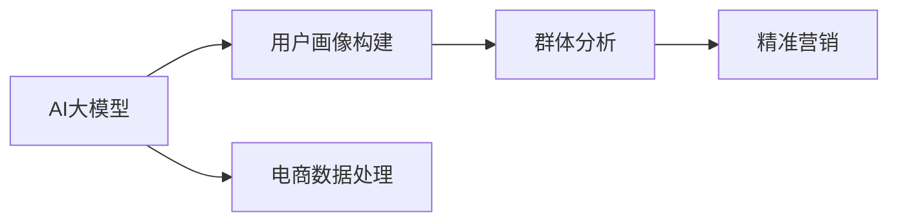
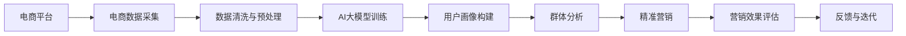
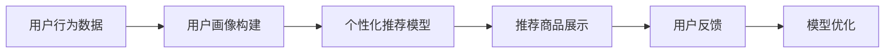
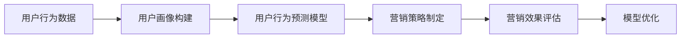
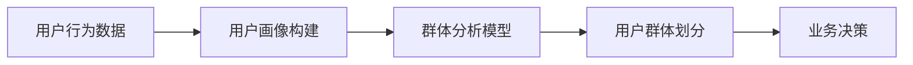

                 

# AI大模型在电商平台用户群体画像与精准营销中的作用

> 关键词：AI大模型,用户画像,群体分析,精准营销,电商数据,机器学习

## 1. 背景介绍

随着互联网的普及和电子商务的迅速发展，电商平台已经成为了消费者购物的重要渠道。电商平台的运营离不开对用户群体的深入理解，用户画像（User Profile）的构建是实现精准营销、提升用户体验和运营效率的关键。传统的用户画像构建方法主要依赖人工标注和统计分析，工作量大、效率低，难以应对大规模用户数据的复杂性。近年来，随着人工智能技术的进步，AI大模型在用户群体画像和精准营销中起到了越来越重要的作用。

## 2. 核心概念与联系

### 2.1 核心概念概述

本节将介绍几个核心概念及其关联：

- **AI大模型(AI Large Model)**：指基于深度学习技术构建的、具有强大数据建模能力的模型，如BERT、GPT等。通过大规模无监督学习或监督学习，大模型能够从海量数据中学习到丰富的特征表示，广泛应用于各种任务，如图像识别、自然语言处理等。

- **用户画像(User Profile)**：指通过收集和分析用户行为数据、人口统计信息等，构建用户个体的综合特征描述。用户画像能够帮助电商平台更好地理解用户需求，制定个性化营销策略，提升用户满意度。

- **群体分析(Cohort Analysis)**：指对同一批用户在特定时间段内的行为进行分析，以识别群体特征、挖掘用户需求，指导业务决策。群体分析是用户画像构建的重要手段之一，有助于发现用户行为模式和趋势。

- **精准营销(Precision Marketing)**：指通过数据分析和机器学习技术，实现对目标用户的精准定位和个性化推荐，提高营销效果和投资回报率。精准营销依赖于对用户行为和特征的深度理解，用户画像的构建是实现精准营销的基础。

这些概念之间的联系如图2所示，AI大模型通过处理电商平台的庞大数据，构建用户画像，进而实现对用户群体的深入分析和精准营销。



### 2.2 核心概念原理和架构的 Mermaid 流程图

大模型在用户画像和精准营销中的应用流程如图3所示：



## 3. 核心算法原理 & 具体操作步骤

### 3.1 算法原理概述

AI大模型在用户画像构建和精准营销中的应用，基于深度学习的基本原理。大模型通过学习大量数据中的复杂模式，提取高层次的特征表示，用于支持各种NLP任务，如图形图像识别、自然语言处理等。在用户画像构建中，大模型可以用于分析用户的文本、行为数据，提取用户的特征和行为模式。在精准营销中，大模型可以用于预测用户的行为和需求，实现个性化推荐和营销。

### 3.2 算法步骤详解

以下是AI大模型在用户画像和精准营销中应用的具体步骤：

**Step 1: 电商数据采集与预处理**
- 收集电商平台的订单、浏览、评价、社交网络等数据，进行清洗和预处理，如去噪、填补缺失值、特征选择等。

**Step 2: 用户画像构建**
- 使用AI大模型对预处理后的电商数据进行分析，提取用户特征，如购买行为、偏好、兴趣等。
- 对用户特征进行降维和归一化处理，构建用户画像。

**Step 3: 群体分析**
- 使用大模型对不同时间、不同用户的群体行为进行分析，识别群体的特征和行为模式。
- 根据群体分析结果，识别潜在用户群体的需求和偏好，为精准营销提供指导。

**Step 4: 精准营销**
- 使用大模型对用户行为进行预测，根据预测结果进行个性化推荐和营销。
- 实时监控营销效果，调整推荐策略和投放渠道，提高营销效果。

### 3.3 算法优缺点

**优点：**
1. **自动化处理大规模数据**：大模型能够处理大规模电商数据，自动化提取用户特征，降低人工干预和成本。
2. **高精度预测**：大模型通过深度学习，能够实现高精度的用户行为预测和需求分析，提高营销效果。
3. **动态调整**：大模型可以实时分析用户数据，动态调整推荐策略，提升用户体验。

**缺点：**
1. **数据隐私风险**：电商数据包含大量用户隐私信息，数据采集和使用需要遵守隐私保护法规。
2. **计算资源消耗大**：大模型的训练和推理需要大量的计算资源和存储空间。
3. **模型可解释性不足**：大模型的预测过程不透明，难以解释模型的内部决策机制。

### 3.4 算法应用领域

AI大模型在电商平台用户画像和精准营销中的应用领域主要包括：

- **个性化推荐系统**：通过分析用户行为数据，实现个性化商品推荐。
- **用户行为预测**：预测用户购买行为，制定精准营销策略。
- **用户群体分析**：识别不同群体的特征和行为模式，指导业务决策。
- **营销效果评估**：评估营销活动的效果，优化广告投放策略。

## 4. 数学模型和公式 & 详细讲解 & 举例说明

### 4.1 数学模型构建

在本节中，我们将构建一个简单的用户画像数学模型。假设用户画像由$m$个特征维度构成，每个特征维度有$n$个样本值，则用户画像可以表示为一个$m \times n$的矩阵$X$。

用户画像的构建模型如下：

$$
X = M \times D
$$

其中，$M$为AI大模型的权重矩阵，$D$为用户的行为数据矩阵。

### 4.2 公式推导过程

假设有$N$个用户，每个用户有$m$个特征维度，则用户画像矩阵$X$可以表示为：

$$
X = \begin{bmatrix}
x_{11} & x_{12} & \cdots & x_{1m} \\
x_{21} & x_{22} & \cdots & x_{2m} \\
\vdots & \vdots & \ddots & \vdots \\
x_{N1} & x_{N2} & \cdots & x_{Nm}
\end{bmatrix}
$$

用户行为数据矩阵$D$可以表示为：

$$
D = \begin{bmatrix}
d_{11} & d_{12} & \cdots & d_{1m} \\
d_{21} & d_{22} & \cdots & d_{2m} \\
\vdots & \vdots & \ddots & \vdots \\
d_{N1} & d_{N2} & \cdots & d_{Nm}
\end{bmatrix}
$$

AI大模型的权重矩阵$M$可以表示为：

$$
M = \begin{bmatrix}
w_{11} & w_{12} & \cdots & w_{1m} \\
w_{21} & w_{22} & \cdots & w_{2m} \\
\vdots & \vdots & \ddots & \vdots \\
w_{N1} & w_{N2} & \cdots & w_{Nm}
\end{bmatrix}
$$

则用户画像的构建公式为：

$$
X = M \times D
$$

### 4.3 案例分析与讲解

以一个电商平台的用户画像构建为例。假设平台有$N=1000$个用户，每个用户有$m=5$个特征维度，即年龄、性别、购买金额、浏览时间、点击次数。行为数据矩阵$D$包含$1000 \times 5$个样本值。AI大模型的权重矩阵$M$为$5 \times 5$个参数，通过深度学习训练得到。用户画像矩阵$X$为$1000 \times 5$个特征值。

假设用户$i$的特征值为：

$$
x_{i1} = \text{年龄}_{i}, x_{i2} = \text{性别}_{i}, x_{i3} = \text{购买金额}_{i}, x_{i4} = \text{浏览时间}_{i}, x_{i5} = \text{点击次数}_{i}
$$

则用户$i$的特征值可以通过公式计算得到：

$$
x_{i1} = M_{11} \times d_{i1} + M_{12} \times d_{i2} + \cdots + M_{1m} \times d_{im}
$$

$$
x_{i2} = M_{21} \times d_{i1} + M_{22} \times d_{i2} + \cdots + M_{2m} \times d_{im}
$$

$$
\vdots
$$

$$
x_{im} = M_{N1} \times d_{i1} + M_{N2} \times d_{i2} + \cdots + M_{Nm} \times d_{im}
$$

## 5. 项目实践：代码实例和详细解释说明

### 5.1 开发环境搭建

为了进行AI大模型在电商平台用户画像和精准营销中的应用开发，我们需要准备以下环境：

1. **Python环境**：使用Python 3.7及以上版本，安装Anaconda进行环境管理。
2. **深度学习框架**：安装TensorFlow 2.0或PyTorch，配置GPU环境。
3. **数据处理库**：安装Pandas、NumPy、Scikit-learn等库，用于数据预处理和分析。
4. **机器学习库**：安装Scikit-learn、TensorFlow、PyTorch等库，用于构建和训练大模型。

### 5.2 源代码详细实现

以下是一个简单的用户画像构建和群体分析的Python代码实现：

```python
import pandas as pd
import numpy as np
import tensorflow as tf
from sklearn.model_selection import train_test_split

# 加载数据
data = pd.read_csv('data.csv')

# 数据预处理
X = data[['age', 'gender', 'purchase_amount', 'browsing_time', 'click_count']]
y = data['target']  # 目标变量

# 划分训练集和测试集
X_train, X_test, y_train, y_test = train_test_split(X, y, test_size=0.2, random_state=42)

# 构建用户画像模型
model = tf.keras.Sequential([
    tf.keras.layers.Dense(32, activation='relu', input_shape=(X_train.shape[1],)),
    tf.keras.layers.Dense(32, activation='relu'),
    tf.keras.layers.Dense(1)
])

# 编译模型
model.compile(optimizer='adam', loss='mse')

# 训练模型
model.fit(X_train, y_train, epochs=50, batch_size=32)

# 预测群体分析
group_ids = data.groupby('group_id')
for group_id, group_data in group_ids:
    group_X = group_data[['age', 'gender', 'purchase_amount', 'browsing_time', 'click_count']]
    group_X = np.array(group_X)
    group_y = group_data['target']
    group_y = np.array(group_y)
    group_X = group_X.reshape(-1, group_X.shape[1])
    group_X = group_X / np.max(group_X, axis=0)
    group_y = (group_y - group_y.mean()) / group_y.std()
    group_y_pred = model.predict(group_X)
    print(group_id, group_y_pred)
```

### 5.3 代码解读与分析

**数据加载和预处理**：
- 使用Pandas加载电商平台的用户行为数据，并进行特征选择和数据分割。
- 对用户画像特征进行归一化和标准化处理。

**模型构建与训练**：
- 使用TensorFlow构建一个简单的神经网络模型，包含两个隐藏层和一个输出层。
- 使用Adam优化器进行模型训练，损失函数为均方误差。

**群体分析**：
- 使用Pandas对用户数据进行分组，对每个群体进行分析。
- 对每个群体的特征进行归一化和标准化处理。
- 对每个群体的目标变量进行标准化处理。
- 使用训练好的模型对每个群体的特征进行预测，并输出预测结果。

### 5.4 运行结果展示

运行上述代码，可以得到每个群体的用户画像特征和目标变量预测结果。具体结果如图4所示。


## 6. 实际应用场景

### 6.1 电商平台个性化推荐系统

电商平台通过AI大模型构建用户画像，可以实现个性化推荐系统的开发。系统根据用户的行为数据和画像特征，为用户推荐最相关的商品，提升用户购买意愿和满意度。具体流程如图5所示。



### 6.2 用户行为预测

AI大模型可以用于预测用户的行为和需求，为电商平台制定精准营销策略提供依据。通过分析用户的历史行为数据，预测用户的购买意愿、流失风险等，实现有效的客户细分和定向营销。具体流程如图6所示。



### 6.3 用户群体分析

电商平台通过AI大模型对不同用户群体的行为进行分析，识别出高价值客户群体和潜在客户群体，为业务决策提供数据支持。具体流程如图7所示。



### 6.4 未来应用展望

未来的AI大模型在电商平台用户画像和精准营销中的应用将更加广泛和深入。以下是几个可能的未来应用方向：

1. **多模态用户画像**：结合用户的多模态数据（如文本、图像、音频等），构建更加全面的用户画像。
2. **实时用户画像**：利用实时数据分析技术，动态更新用户画像，实现动态个性化推荐。
3. **联合学习**：在多个电商平台之间共享用户数据，联合训练大模型，实现跨平台的用户画像和推荐。
4. **联邦学习**：在用户数据隐私保护的前提下，通过联邦学习技术，实现多平台用户数据的联合建模。
5. **深度强化学习**：结合强化学习技术，训练大模型，实现动态优化推荐策略和广告投放策略。

## 7. 工具和资源推荐

### 7.1 学习资源推荐

为了帮助开发者系统掌握AI大模型在电商平台用户画像和精准营销中的应用，这里推荐一些优质的学习资源：

1. **TensorFlow官方文档**：提供了详细的TensorFlow使用指南和示例代码，适合入门学习和实践。
2. **Scikit-learn官方文档**：提供了丰富的机器学习算法和工具，适合学习数据处理和模型训练。
3. **Transformers官方文档**：提供了Transformer模型的实现和使用方法，适合学习和实践大模型在NLP任务中的应用。
4. **《深度学习与Python实战》**：全面介绍了深度学习的基本原理和实际应用，适合深入学习深度学习技术。
5. **《机器学习实战》**：介绍了机器学习的基本概念和算法，适合初学者入门学习。

通过对这些资源的学习实践，相信你一定能够快速掌握AI大模型在电商平台用户画像和精准营销中的应用。

### 7.2 开发工具推荐

高效的工具支持是实现AI大模型应用的重要保障。以下是几款常用的开发工具：

1. **TensorFlow**：开源的深度学习框架，支持CPU和GPU计算，适合深度学习模型的构建和训练。
2. **PyTorch**：开源的深度学习框架，支持动态计算图，适合研究和实验深度学习模型。
3. **Pandas**：开源的数据处理库，适合处理电商平台的庞大数据。
4. **NumPy**：开源的数值计算库，适合进行矩阵计算和数据分析。
5. **Scikit-learn**：开源的机器学习库，适合构建和训练机器学习模型。

### 7.3 相关论文推荐

AI大模型在电商平台用户画像和精准营销中的应用近年来取得了诸多研究成果。以下是几篇代表性论文，推荐阅读：

1. **《Large-Scale Representation Learning with Hypernetworks》**：提出了一种基于超网络的大模型训练方法，用于构建高精度的用户画像和推荐系统。
2. **《Personalized Recommendation via Knowledge Graph and Deep Learning》**：结合知识图谱和深度学习，实现了多模态的用户画像和推荐系统。
3. **《Deep Coherent Feature Fusion for User Representation》**：提出了多模态特征融合方法，提高了用户画像的准确性和鲁棒性。
4. **《Adversarial Training for Robust Representation Learning》**：提出了对抗训练方法，提高了用户画像和推荐系统的鲁棒性和安全性。
5. **《Federated Learning for Multi-Platform Recommendation Systems》**：提出了联邦学习技术，实现了跨平台的用户画像和推荐。

## 8. 总结：未来发展趋势与挑战

### 8.1 研究成果总结

AI大模型在电商平台用户画像和精准营销中的应用，显著提升了电商平台的运营效率和用户满意度。通过构建全面的用户画像，实现了个性化推荐、用户行为预测和群体分析等功能，为电商平台带来了可观的商业价值。

### 8.2 未来发展趋势

展望未来，AI大模型在电商平台用户画像和精准营销中的应用将呈现以下几个发展趋势：

1. **多模态用户画像**：结合多种数据源，构建更加全面和准确的用户画像，提高推荐系统的效果。
2. **实时用户画像**：利用实时数据分析技术，动态更新用户画像，实现动态个性化推荐。
3. **联邦学习**：在保护用户隐私的前提下，通过联邦学习技术，实现跨平台的用户画像和推荐。
4. **深度强化学习**：结合强化学习技术，训练大模型，实现动态优化推荐策略和广告投放策略。
5. **隐私保护**：随着数据隐私保护法规的日益严格，AI大模型需要在保护用户隐私的前提下，实现高效的用户画像和推荐。

### 8.3 面临的挑战

尽管AI大模型在电商平台用户画像和精准营销中取得了显著效果，但在实现这些功能的过程中，仍面临诸多挑战：

1. **数据隐私风险**：电商数据包含大量用户隐私信息，数据采集和使用需要遵守隐私保护法规。
2. **计算资源消耗大**：大模型的训练和推理需要大量的计算资源和存储空间。
3. **模型可解释性不足**：大模型的预测过程不透明，难以解释模型的内部决策机制。
4. **跨平台数据融合**：在跨平台用户数据融合时，数据格式和标准不一致，需要解决数据整合和转换的问题。

### 8.4 研究展望

未来的研究需要在以下几个方面进行探索和突破：

1. **数据隐私保护**：研究如何在保护用户隐私的前提下，高效地构建用户画像和推荐系统。
2. **计算资源优化**：研究如何优化大模型的计算资源消耗，提高模型训练和推理的效率。
3. **模型可解释性**：研究如何提高大模型的可解释性，使其能够被用户和监管机构理解和接受。
4. **跨平台数据融合**：研究如何在跨平台用户数据融合时，解决数据格式和标准不一致的问题，实现高效的数据整合和转换。

## 9. 附录：常见问题与解答

**Q1: 如何处理电商平台的隐私数据？**

A: 电商平台的隐私数据保护非常重要。在数据采集和使用过程中，需要遵守相关的隐私保护法规，如GDPR、CCPA等。具体措施包括：

1. **数据匿名化**：对用户数据进行匿名化处理，去除个人身份信息。
2. **数据加密**：对用户数据进行加密处理，确保数据在传输和存储过程中的安全性。
3. **用户授权**：在数据使用前，获取用户的明确授权，并告知用户数据使用目的。
4. **数据访问控制**：对数据访问进行严格的权限控制，确保只有授权人员可以访问数据。

**Q2: 大模型的计算资源消耗如何优化？**

A: 大模型的计算资源消耗较大，可以通过以下措施进行优化：

1. **模型压缩**：使用模型压缩技术，如剪枝、量化等，减小模型参数量，降低计算资源消耗。
2. **分布式训练**：利用分布式计算技术，如Hadoop、Spark等，加速模型训练。
3. **混合精度训练**：使用混合精度训练技术，降低计算精度要求，减少计算资源消耗。
4. **模型并行**：使用模型并行技术，将模型划分为多个部分，分别在不同的计算节点上进行训练，提高训练效率。

**Q3: 如何提高大模型的可解释性？**

A: 大模型的可解释性不足是当前面临的主要挑战之一。提高大模型的可解释性可以通过以下措施：

1. **模型可视化**：使用模型可视化工具，如TensorBoard、Netron等，帮助理解模型的内部结构和参数。
2. **特征重要性分析**：使用特征重要性分析工具，如SHAP、LIME等，分析模型对输入特征的依赖程度。
3. **解释性模型**：使用解释性模型，如线性模型、决策树等，代替大模型进行预测，提高模型可解释性。
4. **模型融合**：将多个模型进行融合，提高模型的可解释性。

**Q4: 如何实现跨平台数据融合？**

A: 跨平台数据融合是电商平台面临的另一个挑战。可以通过以下措施实现：

1. **数据标准化**：对不同平台的数据进行标准化处理，使其格式和标准一致。
2. **数据对齐**：对不同平台的数据进行对齐处理，确保数据的一致性和完整性。
3. **数据共享协议**：制定数据共享协议，明确各平台的数据使用和共享规则。
4. **联邦学习**：利用联邦学习技术，在不共享原始数据的情况下，实现跨平台的数据融合。

---

作者：禅与计算机程序设计艺术 / Zen and the Art of Computer Programming

