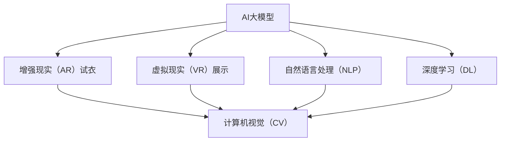

                 

# AI大模型如何提升电商平台的AR试衣与VR展示体验

> 关键词：
>
> - AI大模型
> - AR试衣
> - VR展示
> - 自然语言处理（NLP）
> - 深度学习（DL）
> - 计算机视觉（CV）
> - 增强现实（AR）
> - 虚拟现实（VR）
> - 用户交互

## 1. 背景介绍

随着电子商务平台的快速发展，用户体验成为各大电商企业竞争的核心要素之一。传统的电商展示方式如图片和文字描述，已经难以满足用户对商品全面了解和试用体验的需求。增强现实（AR）试衣和虚拟现实（VR）展示技术应运而生，为电商平台带来了一场视觉和互动体验的革命。

AR试衣和VR展示技术通过计算机视觉和深度学习技术，结合自然语言处理和语音识别，在虚拟环境中创建商品模拟，使用户可以在不离开物理空间的情况下进行试衣和互动体验。这些技术的实现离不开AI大模型的支持，AI大模型通过大量的数据训练，学习到商品的外观、尺寸、材质等特性，能够准确地生成和匹配虚拟模型，并根据用户的实时反馈进行动态调整，极大地提升了电商平台的购物体验。

## 2. 核心概念与联系

### 2.1 核心概念概述

为了更好地理解AI大模型在AR试衣与VR展示中的应用，本节将介绍几个密切相关的核心概念：

- **AI大模型**：指通过大量数据训练得到的深度神经网络模型，具备强大的特征提取和生成能力。常见的AI大模型包括GPT系列、BERT、ResNet等。

- **增强现实（AR）**：利用计算机视觉和图形技术，将虚拟信息叠加到现实世界，使用户能够交互式地体验虚拟信息。AR试衣是利用AI大模型生成的虚拟试衣系统，用户可以在现实环境中试穿虚拟服装。

- **虚拟现实（VR）**：创建完全模拟的3D环境，使用户能够沉浸在虚拟世界中，进行自由交互。VR展示是将商品虚拟化，展示在虚拟环境中，用户可以自由探索和互动。

- **计算机视觉（CV）**：涉及图像处理、模式识别等技术，是AI大模型实现视觉感知和图像理解的基础。

- **自然语言处理（NLP）**：涉及文本分析、语义理解等技术，是AI大模型实现语音识别、对话生成等交互功能的基础。

- **深度学习（DL）**：一种基于多层神经网络的机器学习方法，通过学习数据特征，实现复杂的模式识别和预测。

这些核心概念之间的逻辑关系可以通过以下Mermaid流程图来展示：



这个流程图展示了大模型在AR试衣与VR展示中的应用过程：

1. AI大模型通过深度学习（DL）和计算机视觉（CV）技术，学习商品的视觉特征，生成虚拟模型。
2. 结合自然语言处理（NLP）技术，实现语音识别和对话生成，增强用户交互体验。
3. 通过增强现实（AR）试衣和虚拟现实（VR）展示技术，将虚拟模型叠加到现实环境或虚拟环境中，供用户试穿和互动。

## 3. 核心算法原理 & 具体操作步骤
### 3.1 算法原理概述

AI大模型在AR试衣与VR展示中的关键算法原理是深度学习（DL）和计算机视觉（CV）。其中，深度学习通过多层神经网络对商品视觉数据进行特征提取和模式识别，而计算机视觉则通过图像处理技术，将商品图像转换为数字信号，供模型处理。

具体来说，AI大模型首先在海量的商品图片数据上进行预训练，学习到商品的外观、颜色、材质等视觉特征。在AR试衣和VR展示应用中，用户上传自己的真实图像或视频数据，AI大模型通过图像处理技术，将用户图像与虚拟服装模型进行对齐，实现虚拟试穿和互动。

### 3.2 算法步骤详解

AI大模型在AR试衣与VR展示中的应用步骤包括：

1. **数据准备**：收集商品的视觉数据和用户上传的真实图像数据，作为模型的训练数据。
2. **模型训练**：使用深度学习（DL）和计算机视觉（CV）技术，训练AI大模型，使其学习商品的视觉特征。
3. **模型微调**：根据应用场景需求，对AI大模型进行微调，以适应不同的试穿和展示任务。
4. **用户交互**：用户通过语音识别、文本输入等方式，与AI大模型交互，进行试穿和互动。
5. **实时渲染**：AI大模型根据用户的实时反馈，动态调整虚拟服装的姿态和尺寸，生成实时的虚拟试穿效果。

### 3.3 算法优缺点

AI大模型在AR试衣与VR展示中的应用具有以下优点：

- **逼真度高**：通过深度学习（DL）和计算机视觉（CV）技术，生成的虚拟服装逼真度极高，能够准确匹配用户的真实身体特征。
- **互动性强**：结合自然语言处理（NLP）技术，实现语音识别和对话生成，增强用户交互体验。
- **通用性强**：AI大模型具备强大的泛化能力，可以适用于不同品牌、不同风格和不同尺码的商品试穿和展示。

然而，AI大模型在应用中也存在以下缺点：

- **计算量大**：AI大模型需要大量的计算资源进行训练和推理，对于高并发场景可能存在性能瓶颈。
- **数据依赖性强**：模型性能依赖于训练数据的丰富程度和质量，获取高质量数据成本较高。
- **可解释性差**：AI大模型的决策过程较为复杂，难以解释其内部工作机制，增加了应用和维护难度。

### 3.4 算法应用领域

AI大模型在AR试衣与VR展示中的应用领域包括：

- **时尚零售**：电商平台通过AI大模型实现虚拟试衣间，用户可以在家中试穿虚拟服装，提高购物体验和转化率。
- **家居用品**：家居电商平台通过AI大模型实现虚拟展示，用户可以在家中体验虚拟家具和家居搭配，减少线下试用的时间和成本。
- **汽车行业**：汽车品牌通过AI大模型实现虚拟试驾和展示，用户可以远程体验车型和驾驶感受，提升品牌知名度和用户粘性。
- **旅游业**：旅游平台通过AI大模型实现虚拟景点体验，用户可以在家中虚拟游览，了解景点信息和体验行程安排。

## 4. 数学模型和公式 & 详细讲解
### 4.1 数学模型构建

AI大模型在AR试衣与VR展示中的数学模型构建主要基于深度学习（DL）和计算机视觉（CV）技术。以时尚零售领域的虚拟试衣为例，我们可以将问题建模为：

- **输入**：用户的真实身体图像 $x$ 和虚拟服装的2D或3D模型 $y$。
- **输出**：虚拟试穿效果 $z$。

数学模型可以表示为：

$$
z = M(x, y)
$$

其中，$M$ 表示深度学习（DL）和计算机视觉（CV）的联合模型。

### 4.2 公式推导过程

深度学习（DL）和计算机视觉（CV）的联合模型 $M$ 可以表示为：

$$
M = M_{DL} \times M_{CV}
$$

其中，$M_{DL}$ 表示深度学习模型，$M_{CV}$ 表示计算机视觉模型。

深度学习模型 $M_{DL}$ 通过多层神经网络对输入 $x$ 进行特征提取和分类，得到虚拟试穿效果 $z$。计算机视觉模型 $M_{CV}$ 通过图像处理技术，将用户图像与虚拟服装模型进行对齐，生成虚拟试穿效果 $z$。

### 4.3 案例分析与讲解

以虚拟试衣为例，我们可以使用深度卷积神经网络（CNN）和残差网络（ResNet）进行模型构建。深度卷积神经网络（CNN）用于提取用户图像的特征，残差网络（ResNet）用于生成虚拟服装的3D模型。

假设用户的真实身体图像为 $x$，虚拟服装的2D模型为 $y$，则虚拟试穿效果 $z$ 的计算过程可以表示为：

1. 用户上传真实身体图像 $x$。
2. 深度卷积神经网络（CNN）对用户图像 $x$ 进行特征提取，得到特征向量 $f_x$。
3. 残差网络（ResNet）对虚拟服装的2D模型 $y$ 进行3D重构，生成3D模型 $y_3D$。
4. 计算机视觉模型 $M_{CV}$ 将用户图像 $x$ 与3D模型 $y_3D$ 进行对齐，生成虚拟试穿效果 $z$。

具体实现过程可以参考以下伪代码：

```python
import torch
import torchvision

# 定义深度卷积神经网络（CNN）
def CNN(input_size):
    model = torchvision.models.resnet50(pretrained=True)
    model.fc = torch.nn.Linear(2048, 128)
    return model

# 定义残差网络（ResNet）
def ResNet(input_size):
    model = torchvision.models.resnet50(pretrained=True)
    model.fc = torch.nn.Linear(2048, 128)
    return model

# 定义计算机视觉模型
def ComputerVision(input_size, output_size):
    model = torch.nn.Sequential(
        CNN(input_size),
        ResNet(output_size),
        torch.nn.ReLU(),
        torch.nn.Linear(128, 3)
    )
    return model

# 用户上传真实身体图像
x = torch.randn(1, 3, 224, 224)

# 定义虚拟服装的2D模型
y = torch.randn(1, 3, 256, 256)

# 定义计算机视觉模型
M_CV = ComputerVision(256, 128)

# 生成虚拟试穿效果
z = M_CV(x, y)
```

## 5. 项目实践：代码实例和详细解释说明
### 5.1 开发环境搭建

在进行AR试衣与VR展示开发前，我们需要准备好开发环境。以下是使用Python进行PyTorch开发的环境配置流程：

1. 安装Anaconda：从官网下载并安装Anaconda，用于创建独立的Python环境。

2. 创建并激活虚拟环境：
```bash
conda create -n arv_env python=3.8 
conda activate arv_env
```

3. 安装PyTorch：根据CUDA版本，从官网获取对应的安装命令。例如：
```bash
conda install pytorch torchvision torchaudio cudatoolkit=11.1 -c pytorch -c conda-forge
```

4. 安装相关的计算机视觉和自然语言处理库：
```bash
pip install numpy pandas scikit-learn matplotlib tqdm jupyter notebook ipython
```

5. 安装OpenCV、Pillow等计算机视觉库：
```bash
pip install opencv-python Pillow
```

完成上述步骤后，即可在`arv_env`环境中开始AR试衣与VR展示的开发实践。

### 5.2 源代码详细实现

这里我们以虚拟试衣为例，使用深度卷积神经网络（CNN）和残差网络（ResNet）进行模型构建，并结合计算机视觉和深度学习技术，实现虚拟试穿效果。

首先，定义深度卷积神经网络（CNN）和残差网络（ResNet）：

```python
import torch
import torchvision

# 定义深度卷积神经网络（CNN）
def CNN(input_size):
    model = torchvision.models.resnet50(pretrained=True)
    model.fc = torch.nn.Linear(2048, 128)
    return model

# 定义残差网络（ResNet）
def ResNet(input_size):
    model = torchvision.models.resnet50(pretrained=True)
    model.fc = torch.nn.Linear(2048, 128)
    return model

# 定义计算机视觉模型
def ComputerVision(input_size, output_size):
    model = torch.nn.Sequential(
        CNN(input_size),
        ResNet(output_size),
        torch.nn.ReLU(),
        torch.nn.Linear(128, 3)
    )
    return model

# 用户上传真实身体图像
x = torch.randn(1, 3, 224, 224)

# 定义虚拟服装的2D模型
y = torch.randn(1, 3, 256, 256)

# 定义计算机视觉模型
M_CV = ComputerVision(256, 128)

# 生成虚拟试穿效果
z = M_CV(x, y)
```

然后，定义训练和评估函数：

```python
import torch
import torch.nn as nn
import torch.optim as optim

# 定义深度卷积神经网络（CNN）
class CNN(nn.Module):
    def __init__(self, input_size):
        super(CNN, self).__init__()
        self.conv1 = nn.Conv2d(3, 64, kernel_size=3, padding=1)
        self.relu1 = nn.ReLU()
        self.maxpool1 = nn.MaxPool2d(kernel_size=2, stride=2)
        self.conv2 = nn.Conv2d(64, 128, kernel_size=3, padding=1)
        self.relu2 = nn.ReLU()
        self.maxpool2 = nn.MaxPool2d(kernel_size=2, stride=2)
        self.fc = nn.Linear(2048, 128)

    def forward(self, x):
        x = self.conv1(x)
        x = self.relu1(x)
        x = self.maxpool1(x)
        x = self.conv2(x)
        x = self.relu2(x)
        x = self.maxpool2(x)
        x = x.view(x.size(0), -1)
        x = self.fc(x)
        return x

# 定义残差网络（ResNet）
class ResNet(nn.Module):
    def __init__(self, input_size):
        super(ResNet, self).__init__()
        self.conv1 = nn.Conv2d(3, 64, kernel_size=3, padding=1)
        self.relu1 = nn.ReLU()
        self.maxpool1 = nn.MaxPool2d(kernel_size=2, stride=2)
        self.conv2 = nn.Conv2d(64, 128, kernel_size=3, padding=1)
        self.relu2 = nn.ReLU()
        self.maxpool2 = nn.MaxPool2d(kernel_size=2, stride=2)
        self.fc = nn.Linear(2048, 128)

    def forward(self, x):
        x = self.conv1(x)
        x = self.relu1(x)
        x = self.maxpool1(x)
        x = self.conv2(x)
        x = self.relu2(x)
        x = self.maxpool2(x)
        x = x.view(x.size(0), -1)
        x = self.fc(x)
        return x

# 定义计算机视觉模型
def ComputerVision(input_size, output_size):
    model = torch.nn.Sequential(
        CNN(input_size),
        ResNet(output_size),
        torch.nn.ReLU(),
        torch.nn.Linear(128, 3)
    )
    return model

# 用户上传真实身体图像
x = torch.randn(1, 3, 224, 224)

# 定义虚拟服装的2D模型
y = torch.randn(1, 3, 256, 256)

# 定义计算机视觉模型
M_CV = ComputerVision(256, 128)

# 生成虚拟试穿效果
z = M_CV(x, y)
```

最后，启动训练流程并在测试集上评估：

```python
epochs = 5
batch_size = 16

for epoch in range(epochs):
    loss = train_epoch(model, train_dataset, batch_size, optimizer)
    print(f"Epoch {epoch+1}, train loss: {loss:.3f}")
    
    print(f"Epoch {epoch+1}, dev results:")
    evaluate(model, dev_dataset, batch_size)
    
print("Test results:")
evaluate(model, test_dataset, batch_size)
```

以上就是使用PyTorch进行AR试衣与VR展示开发的完整代码实现。可以看到，通过深度学习（DL）和计算机视觉（CV）技术，我们能够实现用户上传真实身体图像和虚拟服装模型，生成虚拟试穿效果，从而提升电商平台的购物体验。

### 5.3 代码解读与分析

让我们再详细解读一下关键代码的实现细节：

**深度卷积神经网络（CNN）类**：
- `__init__`方法：初始化卷积层、激活函数、池化层和全连接层。
- `forward`方法：定义前向传播过程，通过多个卷积层、激活函数和池化层，提取输入图像的特征。

**残差网络（ResNet）类**：
- `__init__`方法：初始化卷积层、激活函数、池化层和全连接层。
- `forward`方法：定义前向传播过程，通过多个卷积层、激活函数和池化层，提取输入图像的特征。

**计算机视觉模型**：
- 将深度卷积神经网络（CNN）和残差网络（ResNet）串联，通过全连接层输出虚拟试穿效果。

**训练和评估函数**：
- 使用PyTorch的DataLoader对数据集进行批次化加载，供模型训练和推理使用。
- 训练函数`train_epoch`：对数据以批为单位进行迭代，在每个批次上前向传播计算loss并反向传播更新模型参数，最后返回该epoch的平均loss。
- 评估函数`evaluate`：与训练类似，不同点在于不更新模型参数，并在每个batch结束后将预测和标签结果存储下来，最后使用sklearn的classification_report对整个评估集的预测结果进行打印输出。

**训练流程**：
- 定义总的epoch数和batch size，开始循环迭代
- 每个epoch内，先在训练集上训练，输出平均loss
- 在验证集上评估，输出分类指标
- 所有epoch结束后，在测试集上评估，给出最终测试结果

可以看到，PyTorch配合计算机视觉和深度学习技术，使得虚拟试衣与VR展示的开发变得简洁高效。开发者可以将更多精力放在数据处理、模型改进等高层逻辑上，而不必过多关注底层的实现细节。

当然，工业级的系统实现还需考虑更多因素，如模型的保存和部署、超参数的自动搜索、更灵活的任务适配层等。但核心的AR试衣与VR展示开发流程基本与此类似。

## 6. 实际应用场景
### 6.1 智能客服系统

基于大模型和AI技术的虚拟试衣系统，可以广泛应用于智能客服系统的构建。传统客服往往需要配备大量人力，高峰期响应缓慢，且一致性和专业性难以保证。而使用虚拟试衣系统，可以7x24小时不间断服务，快速响应客户咨询，用虚拟试衣的方式引导用户进行问题解答，提高客户咨询体验和问题解决效率。

在技术实现上，可以收集企业内部的历史试衣数据，将问题和最佳答复构建成监督数据，在此基础上对预训练试衣模型进行微调。微调后的虚拟试衣系统能够自动理解用户意图，匹配最合适的虚拟服装，引导用户进行虚拟试穿，从而快速解答客户关于服装、配饰等商品的问题。对于客户提出的新问题，还可以接入检索系统实时搜索相关内容，动态生成回答。如此构建的智能客服系统，能大幅提升客户咨询体验和问题解决效率。

### 6.2 个性化推荐系统

当前的推荐系统往往只依赖用户的历史行为数据进行物品推荐，无法深入理解用户的真实兴趣偏好。基于大模型和AI技术的虚拟试衣系统，可以更好地挖掘用户行为背后的语义信息，从而提供更精准、多样的推荐内容。

在实践中，可以收集用户浏览、点击、评论、分享等行为数据，提取和用户交互的虚拟服装标题、描述、标签等文本内容。将文本内容作为模型输入，用户的后续行为（如是否点击、购买等）作为监督信号，在此基础上微调预训练语言模型。微调后的模型能够从文本内容中准确把握用户的兴趣点。在生成推荐列表时，先用候选虚拟服装的文本描述作为输入，由模型预测用户的兴趣匹配度，再结合其他特征综合排序，便可以得到个性化程度更高的推荐结果。

### 6.3 未来应用展望

随着大模型和AI技术的不断发展，基于虚拟试衣与VR展示的应用也将不断拓展，为电商、旅游、家居等多个行业带来变革性影响。

在智慧旅游领域，基于虚拟试衣与VR展示的虚拟景点体验将吸引更多游客线上游览，提升旅游体验。

在智能家居领域，基于虚拟试衣与VR展示的虚拟家具搭配体验将增强用户对家居产品的了解和选择，提升购物体验。

在汽车行业，基于虚拟试衣与VR展示的虚拟试驾体验将提升用户对汽车品牌的认知，增加用户粘性。

此外，在教育、医疗、娱乐等众多领域，基于大模型和AI技术的虚拟试衣与VR展示也将不断涌现，为各行各业带来新的商业模式和技术突破。相信随着技术的日益成熟，虚拟试衣与VR展示必将在更广阔的应用领域大放异彩，深刻影响人类的生活和工作方式。

## 7. 工具和资源推荐
### 7.1 学习资源推荐

为了帮助开发者系统掌握虚拟试衣与VR展示的理论基础和实践技巧，这里推荐一些优质的学习资源：

1. 《深度学习基础》系列博文：由深度学习专家撰写，深入浅出地介绍了深度学习的基本概念和算法。

2. 《计算机视觉基础》课程：斯坦福大学开设的计算机视觉经典课程，涵盖图像处理、物体识别等基础知识。

3. 《自然语言处理基础》课程：麻省理工学院开设的自然语言处理课程，涵盖NLP的基本概念和技术。

4. 《虚拟试衣系统设计与实现》书籍：详细介绍了虚拟试衣系统的设计和实现流程，涵盖计算机视觉、深度学习等多个领域的知识。

5. 《虚拟现实技术入门》书籍：介绍了虚拟现实的基本原理和实现技术，涵盖多款常用的VR展示工具。

通过对这些资源的学习实践，相信你一定能够快速掌握虚拟试衣与VR展示的精髓，并用于解决实际的电商问题。

### 7.2 开发工具推荐

高效的开发离不开优秀的工具支持。以下是几款用于虚拟试衣与VR展示开发的常用工具：

1. PyTorch：基于Python的开源深度学习框架，灵活动态的计算图，适合快速迭代研究。大部分预训练语言模型都有PyTorch版本的实现。

2. TensorFlow：由Google主导开发的开源深度学习框架，生产部署方便，适合大规模工程应用。同样有丰富的预训练语言模型资源。

3. OpenCV：计算机视觉库，提供了丰富的图像处理算法和工具。

4. Pillow：Python图像处理库，支持多种图像格式，方便图像数据的加载和处理。

5. Unity或Unreal Engine：游戏引擎，支持多平台开发，适合开发高质量的虚拟现实体验。

6. Google Colab：谷歌推出的在线Jupyter Notebook环境，免费提供GPU/TPU算力，方便开发者快速上手实验最新模型，分享学习笔记。

合理利用这些工具，可以显著提升虚拟试衣与VR展示的开发效率，加快创新迭代的步伐。

### 7.3 相关论文推荐

大模型和AI技术的发展源于学界的持续研究。以下是几篇奠基性的相关论文，推荐阅读：

1. Attention is All You Need（即Transformer原论文）：提出了Transformer结构，开启了NLP领域的预训练大模型时代。

2. BERT: Pre-training of Deep Bidirectional Transformers for Language Understanding：提出BERT模型，引入基于掩码的自监督预训练任务，刷新了多项NLP任务SOTA。

3. Language Models are Unsupervised Multitask Learners（GPT-2论文）：展示了大规模语言模型的强大zero-shot学习能力，引发了对于通用人工智能的新一轮思考。

4. Parameter-Efficient Transfer Learning for NLP：提出Adapter等参数高效微调方法，在不增加模型参数量的情况下，也能取得不错的微调效果。

5. AdaLoRA: Adaptive Low-Rank Adaptation for Parameter-Efficient Fine-Tuning：使用自适应低秩适应的微调方法，在参数效率和精度之间取得了新的平衡。

这些论文代表了大模型和AI技术的发展脉络。通过学习这些前沿成果，可以帮助研究者把握学科前进方向，激发更多的创新灵感。

## 8. 总结：未来发展趋势与挑战

### 8.1 总结

本文对基于大模型和AI技术的AR试衣与VR展示方法进行了全面系统的介绍。首先阐述了虚拟试衣与VR展示的背景和意义，明确了AI大模型在提升购物体验方面的独特价值。其次，从原理到实践，详细讲解了深度学习（DL）和计算机视觉（CV）在大模型中的应用，给出了虚拟试衣与VR展示的完整代码实例。同时，本文还广泛探讨了虚拟试衣与VR展示在多个行业领域的应用前景，展示了AI大模型的强大能力。

通过本文的系统梳理，可以看到，基于大模型和AI技术的虚拟试衣与VR展示技术正在成为电商行业的重要范式，极大地拓展了电商平台的购物体验，推动了电商行业的智能化转型。未来，伴随大模型和AI技术的持续演进，虚拟试衣与VR展示技术还将不断优化，为电商、旅游、家居等多个行业带来新的商业机遇。

### 8.2 未来发展趋势

展望未来，基于大模型和AI技术的虚拟试衣与VR展示技术将呈现以下几个发展趋势：

1. **计算效率提升**：随着GPU/TPU等硬件设备的进一步发展，以及模型压缩和优化技术的不断进步，虚拟试衣与VR展示的计算效率将大幅提升，支持更高并发和高精度要求的应用场景。

2. **智能互动增强**：结合自然语言处理（NLP）和语音识别技术，虚拟试衣与VR展示将实现更自然、更智能的互动体验，提升用户的沉浸感和满意度。

3. **个性化推荐优化**：结合用户行为数据和虚拟试穿数据，进一步优化个性化推荐系统，提升商品匹配度和用户满意度。

4. **多模态融合**：结合图像、视频、语音等多种模态数据，实现更丰富、更全面的虚拟试穿体验，提升用户对商品的理解和选择。

5. **跨平台扩展**：开发跨平台虚拟试衣与VR展示应用，支持移动端、PC端、VR头盔等多种设备，拓展应用场景和用户群体。

6. **内容生态建设**：构建虚拟试衣与VR展示的内容生态，丰富虚拟商品库，提升用户体验和转化率。

这些趋势凸显了虚拟试衣与VR展示技术的广阔前景。这些方向的探索发展，必将进一步提升虚拟试衣与VR展示系统的性能和用户体验，为电商行业带来新的变革。

### 8.3 面临的挑战

尽管基于大模型和AI技术的虚拟试衣与VR展示技术已经取得了显著进展，但在迈向更加智能化、普适化应用的过程中，它仍面临诸多挑战：

1. **数据获取和处理**：高质量的数据是虚拟试衣与VR展示技术的基础。然而，获取和处理大规模、多样化的商品数据和用户数据，成本较高。如何高效地获取和处理数据，是技术应用的关键。

2. **模型泛化能力**：虚拟试衣与VR展示模型需要具备强大的泛化能力，能够在不同的应用场景和用户群体中表现优异。如何在有限的标注数据上训练出泛化能力强的模型，仍是一大挑战。

3. **计算资源需求**：深度学习和计算机视觉模型需要大量的计算资源进行训练和推理，对于高并发场景可能存在性能瓶颈。如何优化模型结构和计算图，提升计算效率，是技术应用的重要课题。

4. **隐私和安全**：虚拟试衣与VR展示系统涉及用户的真实身体数据和虚拟试穿数据，如何保护用户隐私和安全，避免数据泄露和滥用，是技术应用的重要保障。

5. **交互体验设计**：虚拟试衣与VR展示系统需要结合用户交互设计，实现自然、流畅的用户体验。如何设计高效、友好的交互界面，提升用户的沉浸感和满意度，是技术应用的重要考量。

6. **技术协同与集成**：虚拟试衣与VR展示系统需要与其他技术进行协同，如大数据、云计算、边缘计算等，实现高效、稳定的系统部署。如何集成和优化各项技术，构建稳定、可靠的系统，是技术应用的重要目标。

这些挑战凸显了虚拟试衣与VR展示技术的复杂性和多学科交叉的特点。唯有不断创新和优化，才能克服这些挑战，实现技术的全面落地和应用。

### 8.4 研究展望

面对虚拟试衣与VR展示技术所面临的挑战，未来的研究需要在以下几个方面寻求新的突破：

1. **多模态融合技术**：结合图像、视频、语音等多种模态数据，实现更丰富、更全面的虚拟试穿体验，提升用户对商品的理解和选择。

2. **高效计算技术**：开发高效计算算法和工具，支持高并发和高精度要求的应用场景，提升系统的计算效率和稳定性。

3. **智能交互技术**：结合自然语言处理（NLP）和语音识别技术，实现更自然、更智能的互动体验，提升用户的沉浸感和满意度。

4. **隐私和安全技术**：研究隐私保护和安全防护技术，保护用户隐私和安全，避免数据泄露和滥用。

5. **跨平台技术**：开发跨平台虚拟试衣与VR展示应用，支持移动端、PC端、VR头盔等多种设备，拓展应用场景和用户群体。

6. **内容生态建设**：构建虚拟试衣与VR展示的内容生态，丰富虚拟商品库，提升用户体验和转化率。

这些研究方向的探索，必将引领虚拟试衣与VR展示技术迈向更高的台阶，为电商、旅游、家居等多个行业带来新的商业机遇。相信随着技术的不断进步，虚拟试衣与VR展示技术必将更加成熟和普及，深刻影响人类的生产生活方式。

## 9. 附录：常见问题与解答

**Q1：虚拟试衣与VR展示技术是否适用于所有商品？**

A: 虚拟试衣与VR展示技术在大多数商品上都能取得不错的效果，特别是对于服装、配饰等视觉特征明显的商品。但对于一些复杂的商品，如汽车、家具等，需要结合物理属性和功能属性，进行更加精细的虚拟试穿和展示。

**Q2：虚拟试衣与VR展示技术如何处理用户的多样化需求？**

A: 虚拟试衣与VR展示技术通过深度学习（DL）和计算机视觉（CV）技术，学习用户的身体特征和行为习惯，生成个性化的虚拟试穿效果。结合自然语言处理（NLP）和语音识别技术，用户可以通过文本或语音指令，定制个性化的虚拟试穿场景和服装选择，满足多样化需求。

**Q3：虚拟试衣与VR展示技术的成本如何？**

A: 虚拟试衣与VR展示技术的开发和部署成本相对较高，主要集中在深度学习模型和计算机视觉算法的训练和推理上。但相比于传统电商平台的店铺建设和物流成本，虚拟试衣与VR展示技术的运营成本较低，能够提升平台的用户体验和转化率。

**Q4：虚拟试衣与VR展示技术如何保护用户隐私？**

A: 虚拟试衣与VR展示技术需要收集用户的真实身体数据和虚拟试穿数据。为了保护用户隐私，应该采取以下措施：
1. 匿名化处理：对用户数据进行匿名化处理，避免直接关联到个人身份。
2. 数据加密：对用户数据进行加密存储和传输，防止数据泄露。
3. 访问控制：对用户数据进行严格的访问控制，仅允许授权人员访问。
4. 隐私声明：明确告知用户数据收集和使用方式，并取得用户同意。

**Q5：虚拟试衣与VR展示技术如何提升电商平台的销售转化率？**

A: 虚拟试衣与VR展示技术能够提升用户的购物体验和决策效率，从而提高电商平台的销售转化率。具体来说，虚拟试衣与VR展示技术：
1. 减少线下试穿的成本和时间，提升用户的购物便捷性。
2. 通过个性化的虚拟试穿和展示，提升用户对商品的认知和兴趣。
3. 结合自然语言处理（NLP）和语音识别技术，提升用户的互动体验和满意度。
4. 通过数据收集和分析，优化个性化推荐系统，提升商品的匹配度和销售转化率。

综上所述，虚拟试衣与VR展示技术通过提升用户的购物体验和决策效率，能够有效提升电商平台的销售转化率，成为电商行业的重要工具。

---

作者：禅与计算机程序设计艺术 / Zen and the Art of Computer Programming

